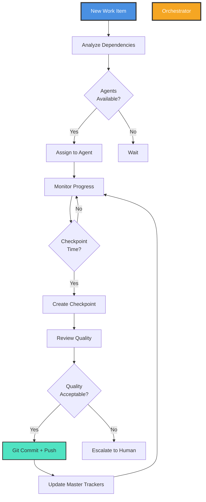

# CODITECT MASTER ORCHESTRATION FRAMEWORK
**Multi-Agent Autonomous Development System for 19-Submodule Platform**

**Author**: Hal Casteel, Founder/CEO/CTO, AZ1.AI INC.
**Date**: November 15, 2025
**Version**: 1.0

---

## Executive Summary

This framework defines the **autonomous multi-agent development orchestration** for the CODITECT platform, enabling a team of AI agents to build, coordinate, and deploy 19 submodules asynchronously while maintaining:

- ✅ **Master coordination** - Central orchestrator manages all submodules
- ✅ **Consistent reporting** - Standardized checkpoint format across all agents
- ✅ **Git automation** - Automatic commit/push with proper attribution
- ✅ **Progress tracking** - PROJECT-PLAN.md and TASKLIST.md in every submodule
- ✅ **Quality control** - Multiple daily checkpoints with detailed status
- ✅ **Team onboarding** - Clear, logical structure for human team members

---

## Table of Contents

1. [Architecture Overview](#architecture-overview)
2. [Orchestrator Agent Role](#orchestrator-agent-role)
3. [Submodule Structure Standards](#submodule-structure-standards)
4. [Multi-Agent Workflow](#multi-agent-workflow)
5. [Checkpoint System](#checkpoint-system)
6. [Git Workflow Automation](#git-workflow-automation)
7. [Daily Sprint Process](#daily-sprint-process)
8. [Master Project Plan](#master-project-plan)
9. [Quality Gates](#quality-gates)
10. [Team Onboarding Guide](#team-onboarding-guide)

---

## Architecture Overview

### The Orchestration Hierarchy

```
┌────────────────────────────────────────────────────────────────┐
│                   MASTER ORCHESTRATOR                          │
│              (coditect-rollout-master)                         │
│                                                                │
│  - Master PROJECT-PLAN.md                                      │
│  - Master TASKLIST.md                                          │
│  - Daily CHECKPOINT reports                                    │
│  - Submodule coordination                                      │
└────────────────┬───────────────────────────────────────────────┘
                 │
        ┌────────┴────────┐
        │                 │
    ┌───▼────┐       ┌───▼────┐       ┌───────┐
    │ Phase  │       │ Phase  │  ...  │ Phase │
    │ Agent  │       │ Agent  │       │ Agent │
    │   1    │       │   2    │       │   7   │
    └───┬────┘       └───┬────┘       └───┬───┘
        │                │                │
    ┌───▼────────────────▼────────────────▼───┐
    │      Specialized Development Agents      │
    │                                          │
    │  • Backend Developer (coditect-cloud-backend)  │
    │  • Frontend Developer (coditect-cloud-frontend)│
    │  • Infrastructure Engineer (coditect-infra)    │
    │  • DevOps Agent (CI/CD, deployment)            │
    │  • QA Agent (testing, validation)              │
    │  • Documentation Agent (coditect-docs)         │
    │  • ... (one per submodule)                     │
    └────────────────┬───────────────────────────────┘
                     │
         ┌───────────┴──────────┐
         │                      │
    ┌────▼─────┐          ┌────▼─────┐
    │ Git      │          │ Quality  │
    │ Automation│          │ Control  │
    │ Agent    │          │ Agent    │
    └──────────┘          └──────────┘
```

### Key Principles

1. **Asynchronous Development** - Agents work in parallel on different submodules
2. **Event-Driven Coordination** - Agents communicate via message bus (RabbitMQ when available)
3. **Git-Based State** - All state stored in git (PROJECT-PLAN, TASKLIST, checkpoints)
4. **Standardized Reporting** - Every checkpoint follows same format
5. **Human-in-the-Loop** - Orchestrator escalates decisions, humans approve phases

---

## Orchestrator Agent Role

### Primary Responsibilities

The **ORCHESTRATOR agent** is the master coordinator responsible for:

#### 1. **Work Distribution**
```yaml
Responsibilities:
  - Assign tasks to specialized agents based on capability
  - Balance workload across agents
  - Detect and resolve dependencies between submodules
  - Coordinate parallel work streams
```

#### 2. **Progress Tracking**
```yaml
Responsibilities:
  - Update master PROJECT-PLAN.md daily
  - Update master TASKLIST.md with checkbox status
  - Aggregate progress from all submodules
  - Identify blockers and risks
  - Generate daily status reports
```

#### 3. **Quality Control**
```yaml
Responsibilities:
  - Trigger checkpoint creation (3-5x per day)
  - Validate checkpoint format compliance
  - Review agent outputs for quality
  - Escalate issues to human oversight
  - Enforce phase gate criteria
```

#### 4. **Git Coordination**
```yaml
Responsibilities:
  - Ensure submodule changes are committed
  - Update submodule pointers in master repo
  - Maintain clean git history
  - Coordinate multi-repo changes
  - Handle merge conflicts
```

### Orchestrator Decision Framework



---

## Submodule Structure Standards

### Required Files in Every Submodule

Every submodule MUST have this structure:

```
submodules/<submodule-name>/
├── PROJECT-PLAN.md              # Detailed project plan
├── TASKLIST.md                  # Task list with checkboxes
├── CHECKPOINTS/                 # Daily checkpoint reports
│   ├── 2025-11-15-checkpoint-01.md
│   ├── 2025-11-15-checkpoint-02.md
│   └── 2025-11-15-checkpoint-03.md
├── README.md                    # User-facing documentation
├── CLAUDE.md                    # AI agent instructions (optional)
├── .gitignore
├── src/                         # Source code
├── tests/                       # Test suites
└── docs/                        # Additional documentation
```

### PROJECT-PLAN.md Template

```markdown
# [Submodule Name] - Project Plan

**Submodule**: `<submodule-name>`
**Priority**: P0/P1/P2
**Timeline**: <N> weeks
**Budget**: $<amount>
**Team Size**: <N> engineers (or AI agents)
**Status**: 🔨 In Development / 🚀 Pilot / ✅ Deployed
**Owner**: <Agent Name> or <Human Name>

---

## Project Overview

**Purpose**: <1-2 sentence description>

**Key Features**:
- Feature 1
- Feature 2
- Feature 3

**Dependencies**:
- Depends on: <list of submodules>
- Blocks: <list of submodules>

---

## Phase Breakdown

### Phase 1: Foundation (Week 1-2)
**Goal**: <specific, measurable outcome>

**Tasks**:
- [ ] Task 1.1 - <description>
- [ ] Task 1.2 - <description>
- [ ] Task 1.3 - <description>

**Deliverables**:
- Deliverable 1
- Deliverable 2

**Acceptance Criteria**:
- ✅ Criterion 1
- ✅ Criterion 2

---

### Phase 2: Core Development (Week 3-4)
<same structure>

---

## Technology Stack

**Languages**: <list>
**Frameworks**: <list>
**Databases**: <list>
**Infrastructure**: <list>
**CI/CD**: <list>

---

## Architecture

<Link to architecture diagrams or inline description>

---

## Testing Strategy

**Unit Tests**: <description>
**Integration Tests**: <description>
**E2E Tests**: <description>
**Performance Tests**: <description>

**Coverage Target**: >80%

---

## Deployment Strategy

**Environments**:
- Development
- Staging
- Production

**Deployment Process**:
1. Step 1
2. Step 2
3. Step 3

---

## Risks & Mitigation

| Risk | Probability | Impact | Mitigation |
|------|-------------|--------|------------|
| Risk 1 | Medium | High | Mitigation strategy |
| Risk 2 | Low | Medium | Mitigation strategy |

---

## Success Metrics

**Technical KPIs**:
- Metric 1: Target value
- Metric 2: Target value

**Business KPIs**:
- Metric 1: Target value
- Metric 2: Target value

---

## Change Log

| Date | Change | Author |
|------|--------|--------|
| 2025-11-15 | Initial project plan | Orchestrator Agent |

---

**Last Updated**: <date>
**Next Review**: <date>
```

### TASKLIST.md Template

```markdown
# [Submodule Name] - Task List

**Status**: <X>/<Total> tasks complete (<Y>%)
**Last Updated**: <timestamp>
**Owner**: <Agent Name>

---

## Phase 1: Foundation (Week 1-2)

**Progress**: <X>/<Total> tasks (<Y>%)

### Week 1

- [ ] **Task 1.1**: Setup project structure
  - **Assigned**: Infrastructure Agent
  - **Estimate**: 2 hours
  - **Status**: Not Started
  - **Dependencies**: None
  - **Deliverable**: Directory structure, .gitignore

- [x] **Task 1.2**: Initialize git repository
  - **Assigned**: Git Automation Agent
  - **Estimate**: 0.5 hours
  - **Status**: ✅ Complete
  - **Completed**: 2025-11-15 10:30 AM
  - **Deliverable**: Git repo with initial commit

- [ ] **Task 1.3**: Setup CI/CD pipeline
  - **Assigned**: DevOps Agent
  - **Estimate**: 4 hours
  - **Status**: In Progress (40%)
  - **Dependencies**: Task 1.1, Task 1.2
  - **Deliverable**: GitHub Actions workflow

### Week 2

- [ ] **Task 1.4**: Implement core data models
  - **Assigned**: Backend Developer Agent
  - **Estimate**: 6 hours
  - **Status**: Blocked (waiting on Task 1.1)
  - **Dependencies**: Task 1.1
  - **Deliverable**: SQLAlchemy models

---

## Phase 2: Core Development (Week 3-4)

**Progress**: <X>/<Total> tasks (<Y>%)

<same structure as Phase 1>

---

## Backlog (Not Yet Scheduled)

- [ ] Future task 1
- [ ] Future task 2

---

## Completed Tasks Archive

- [x] **Task 0.1**: Create PROJECT-PLAN.md
  - **Completed**: 2025-11-15 09:00 AM
  - **Agent**: Orchestrator Agent

---

**Legend**:
- [ ] Not Started
- [~] In Progress
- [x] Complete
- [!] Blocked
- [?] Needs Clarification

---

**Last Updated**: <timestamp>
**Next Sync**: <timestamp>
```

---

## Multi-Agent Workflow

### Agent Specialization

Each agent has specific responsibilities:

| Agent Type | Responsibilities | Submodules Assigned |
|------------|------------------|---------------------|
| **Orchestrator** | Master coordination, reporting, phase gates | coditect-rollout-master |
| **Infrastructure Engineer** | Terraform, GCP, K8s, networking | coditect-infrastructure |
| **Backend Developer (Python)** | FastAPI, databases, API design | coditect-cloud-backend, coditect-analytics |
| **Backend Developer (Rust)** | Actix-web, FoundationDB | coditect-v5-IDE (backend) |
| **Frontend Developer (React)** | React, TypeScript, UI components | coditect-cloud-frontend, coditect-v5-IDE (frontend) |
| **Frontend Developer (Next.js)** | Next.js, marketplace | coditect-agent-marketplace |
| **CLI Developer** | Python CLI, automation scripts | coditect-cli |
| **Documentation Writer** | Docusaurus, tutorials, guides | coditect-docs |
| **Legal Specialist** | Legal docs, compliance | coditect-legal |
| **DevOps Engineer** | CI/CD, deployment, monitoring | All submodules (CI/CD) |
| **QA Specialist** | Testing, quality gates | All submodules (testing) |
| **Git Automation** | Commit, push, submodule updates | All submodules (git ops) |

### Work Assignment Process

```yaml
Orchestrator receives new work item:
  1. Analyze task type and complexity
  2. Check dependencies (blocking/blocked by)
  3. Identify required skills
  4. Check agent availability and workload
  5. Assign to appropriate agent(s)
  6. Update TASKLIST.md with assignment
  7. Notify agent via message bus
  8. Monitor progress

Agent receives assignment:
  1. Read PROJECT-PLAN.md and TASKLIST.md
  2. Review dependencies
  3. Plan implementation approach
  4. Execute work
  5. Update TASKLIST.md with progress
  6. Create checkpoint when milestone reached
  7. Git commit + push
  8. Notify orchestrator of completion
```

### Inter-Agent Communication

**Phase 1-4** (Before orchestration infrastructure):
```
Agents communicate via:
  - TASKLIST.md updates (file-based state)
  - Git commits (notifications via GitHub Actions)
  - Checkpoint reports (status broadcasting)
  - Human escalation (for complex decisions)
```

**Phase 5+** (After RabbitMQ deployment):
```
Agents communicate via:
  - Message bus (RabbitMQ)
  - Task queue (priority-based)
  - Event bus (pub/sub for notifications)
  - State manager (FoundationDB for distributed state)
```

---

## Checkpoint System

### Checkpoint Frequency

**Minimum**: 3 checkpoints per day
**Recommended**: 5 checkpoints per day
**Timing**:
- Morning standup (9:00 AM)
- Mid-morning progress (11:00 AM)
- Lunch checkpoint (1:00 PM)
- Afternoon progress (3:00 PM)
- End-of-day summary (5:00 PM)

### Checkpoint Format (STANDARD)

Every checkpoint MUST follow this format:

```markdown
# Checkpoint Report - [Submodule Name]

**Date**: 2025-11-15
**Time**: 11:00 AM PST
**Checkpoint**: #2 (Mid-Morning Progress)
**Agent**: <Agent Name>
**Session Duration**: <start time> - <current time>

---

## Summary

<1-2 sentence summary of work completed since last checkpoint>

---

## Tasks Completed

- [x] **Task 1.2**: Initialize git repository
  - **Result**: Git repo created with initial commit
  - **Files Changed**: .gitignore, README.md, PROJECT-PLAN.md
  - **Commit**: `abc1234 - Initial project structure`

- [x] **Task 1.3**: Setup CI/CD pipeline (40% → 100%)
  - **Result**: GitHub Actions workflow operational
  - **Files Changed**: .github/workflows/ci.yml
  - **Commit**: `def5678 - Add CI/CD pipeline`

---

## Tasks In Progress

- [~] **Task 1.4**: Implement core data models (0% → 30%)
  - **Status**: Working on User and Project models
  - **Files Changed**: src/models/user.py (new), src/models/project.py (new)
  - **Expected Completion**: Next checkpoint (1:00 PM)
  - **Blocker**: None

---

## Tasks Blocked

- [!] **Task 1.5**: Setup database migrations
  - **Blocker**: Waiting for infrastructure team to provision CloudSQL instance
  - **Impact**: Cannot proceed with database work
  - **Escalation**: Notified orchestrator, waiting on infrastructure agent

---

## Changes Made

### Code Changes

**Files Added**:
- `src/models/user.py` - User model with auth fields
- `src/models/project.py` - Project model with ownership

**Files Modified**:
- `.github/workflows/ci.yml` - Added test and lint steps

**Files Deleted**:
- None

### Documentation Changes

**Files Modified**:
- `PROJECT-PLAN.md` - Updated Phase 1 progress to 60%
- `TASKLIST.md` - Checked off Task 1.2, Task 1.3

---

## Git Activity

**Commits Since Last Checkpoint**: 2

1. **abc1234** - "Initial project structure"
   - Author: Backend Developer Agent
   - Files: .gitignore, README.md, PROJECT-PLAN.md
   - Time: 9:30 AM

2. **def5678** - "Add CI/CD pipeline with test and lint"
   - Author: DevOps Agent (co-authored by Backend Developer)
   - Files: .github/workflows/ci.yml
   - Time: 10:45 AM

**Branch**: main
**Status**: Clean (no uncommitted changes)

---

## Test Results

**Tests Run**: 12
**Tests Passed**: 12
**Tests Failed**: 0
**Coverage**: 85% (target: 80%)

**New Tests Added**:
- `tests/models/test_user.py` - User model validation tests (8 tests)
- `tests/models/test_project.py` - Project model tests (4 tests)

---

## Build Status

**CI/CD Pipeline**: ✅ Passing
**Linter**: ✅ No issues
**Type Checker**: ✅ No issues
**Security Scan**: ✅ No vulnerabilities

---

## Risks & Issues

### New Risks Identified

- **Risk**: CloudSQL provisioning delayed
  - **Impact**: Medium - blocks database work
  - **Probability**: Medium
  - **Mitigation**: Using local PostgreSQL for development temporarily

### Issues Resolved

- **Issue**: CI pipeline failing on Python 3.11
  - **Resolution**: Updated GitHub Actions to use Python 3.11.5
  - **Time to Resolve**: 15 minutes

---

## Metrics

**Velocity**: 2.5 tasks/checkpoint (target: 2 tasks/checkpoint) ✅
**Code Quality**: 85% test coverage (target: 80%) ✅
**Commit Frequency**: 1 commit/hour (healthy)
**Blocker Count**: 1 (flagged for resolution)

---

## Next Steps

**By Next Checkpoint (1:00 PM)**:
1. Complete Task 1.4 (core data models) - 70% remaining
2. Write tests for Project model
3. Update documentation

**Waiting On**:
- Infrastructure agent to provision CloudSQL (Task 1.5 blocker)

**Escalations**:
- None at this time

---

## Agent Notes

<Optional free-form notes about decisions made, approaches tried, lessons learned>

Example:
- Chose SQLAlchemy over Django ORM for better async support
- Implemented soft deletes on User model for GDPR compliance
- Need to discuss timezone handling strategy with team

---

**Next Checkpoint**: 1:00 PM PST
**Agent Status**: ✅ Healthy, on track
**Human Review Required**: No

---

🤖 Generated with [Claude Code](https://claude.com/claude-code)

Co-Authored-By: Backend Developer Agent <agent@coditect.ai>
Co-Authored-By: Hal Casteel <hal@az1.ai>
Co-Authored-By: Claude <noreply@anthropic.com>
```

### Checkpoint Validation

Orchestrator validates each checkpoint for:

✅ **Format Compliance** - All required sections present
✅ **Git Hygiene** - All changes committed and pushed
✅ **Progress Tracking** - TASKLIST.md updated
✅ **Quality Metrics** - Tests passing, coverage maintained
✅ **Clear Next Steps** - Explicit plan for next checkpoint

---

## Git Workflow Automation

### Submodule Development Workflow

```bash
# Agent working on submodule
cd submodules/coditect-cloud-backend

# 1. Make changes
# ... code changes ...

# 2. Update TASKLIST.md
# Mark tasks complete, update progress percentages

# 3. Run tests
pytest tests/ --cov=src --cov-report=term

# 4. Create checkpoint
cat > CHECKPOINTS/2025-11-15-checkpoint-02.md <<EOF
<checkpoint content>
EOF

# 5. Git add all changes
git add .

# 6. Commit with proper message
git commit -m "Implement core data models with tests

- Add User model with auth fields
- Add Project model with ownership
- Add comprehensive test suite (85% coverage)
- Update PROJECT-PLAN.md progress
- Update TASKLIST.md checkboxes

Tasks completed:
- [x] Task 1.2: Initialize git repository
- [x] Task 1.3: Setup CI/CD pipeline
- [~] Task 1.4: Implement core data models (30%)

🤖 Generated with [Claude Code](https://claude.com/claude-code)

Co-Authored-By: Backend Developer Agent <agent@coditect.ai>
Co-Authored-By: Hal Casteel <hal@az1.ai>
Co-Authored-By: Claude <noreply@anthropic.com>"

# 7. Push to remote
git push origin main

# 8. Return to master repo
cd ../..

# 9. Update submodule pointer
git add submodules/coditect-cloud-backend

# 10. Commit master repo change
git commit -m "Update coditect-cloud-backend: Core data models implemented

Submodule changes:
- User and Project models with tests
- CI/CD pipeline operational
- Phase 1 progress: 60%

Checkpoint: #2 (Mid-Morning Progress)
Agent: Backend Developer Agent

🤖 Generated with [Claude Code](https://claude.com/claude-code)

Co-Authored-By: Orchestrator Agent <agent@coditect.ai>
Co-Authored-By: Hal Casteel <hal@az1.ai>
Co-Authored-By: Claude <noreply@anthropic.com>"

# 11. Push master repo
git push origin main
```

### Automated Git Workflow Script

```python
#!/usr/bin/env python3
"""
Automated Git Workflow for Agent Development
"""

import subprocess
import sys
from datetime import datetime
from pathlib import Path


class GitWorkflowAutomation:
    """Automates git operations for agent development"""

    def __init__(self, submodule_path: Path, agent_name: str):
        self.submodule_path = submodule_path
        self.agent_name = agent_name
        self.master_path = submodule_path.parent.parent

    def checkpoint_and_commit(
        self,
        checkpoint_number: int,
        summary: str,
        tasks_completed: list,
        files_changed: list
    ):
        """Create checkpoint, commit, and push changes"""

        # 1. Create checkpoint
        checkpoint_path = self.create_checkpoint(checkpoint_number, summary, tasks_completed)

        # 2. Stage all changes
        subprocess.run(["git", "add", "."], cwd=self.submodule_path, check=True)

        # 3. Create commit message
        commit_msg = self.build_commit_message(summary, tasks_completed, checkpoint_number)

        # 4. Commit
        subprocess.run(
            ["git", "commit", "-m", commit_msg],
            cwd=self.submodule_path,
            check=True
        )

        # 5. Push
        subprocess.run(["git", "push", "origin", "main"], cwd=self.submodule_path, check=True)

        print(f"✅ Submodule committed and pushed (Checkpoint #{checkpoint_number})")

        # 6. Update master repo pointer
        self.update_master_repo(summary, checkpoint_number)

    def create_checkpoint(self, checkpoint_number: int, summary: str, tasks_completed: list) -> Path:
        """Create checkpoint report"""
        timestamp = datetime.now().strftime("%Y-%m-%d")
        checkpoint_dir = self.submodule_path / "CHECKPOINTS"
        checkpoint_dir.mkdir(exist_ok=True)

        checkpoint_file = checkpoint_dir / f"{timestamp}-checkpoint-{checkpoint_number:02d}.md"

        # Generate checkpoint content (use template)
        content = self.generate_checkpoint_content(checkpoint_number, summary, tasks_completed)

        checkpoint_file.write_text(content)
        return checkpoint_file

    def build_commit_message(self, summary: str, tasks_completed: list, checkpoint_num: int) -> str:
        """Build standardized commit message"""
        tasks_str = "\n".join([f"- [x] {task}" for task in tasks_completed])

        return f"""{summary}

{tasks_str}

Checkpoint: #{checkpoint_num}
Agent: {self.agent_name}

🤖 Generated with [Claude Code](https://claude.com/claude-code)

Co-Authored-By: {self.agent_name} <agent@coditect.ai>
Co-Authored-By: Hal Casteel <hal@az1.ai>
Co-Authored-By: Claude <noreply@anthropic.com>"""

    def update_master_repo(self, summary: str, checkpoint_num: int):
        """Update master repo with submodule pointer"""
        submodule_name = self.submodule_path.name

        # Stage submodule pointer change
        subprocess.run(
            ["git", "add", f"submodules/{submodule_name}"],
            cwd=self.master_path,
            check=True
        )

        # Commit master repo
        master_msg = f"""Update {submodule_name}: {summary}

Checkpoint: #{checkpoint_num}
Agent: {self.agent_name} via Orchestrator

🤖 Generated with [Claude Code](https://claude.com/claude-code)

Co-Authored-By: Orchestrator Agent <agent@coditect.ai>
Co-Authored-By: Hal Casteel <hal@az1.ai>
Co-Authored-By: Claude <noreply@anthropic.com>"""

        subprocess.run(
            ["git", "commit", "-m", master_msg],
            cwd=self.master_path,
            check=True
        )

        # Push master repo
        subprocess.run(["git", "push", "origin", "main"], cwd=self.master_path, check=True)

        print(f"✅ Master repo updated with {submodule_name} pointer")


# Example usage
if __name__ == "__main__":
    submodule_path = Path("/Users/halcasteel/PROJECTS/coditect-rollout-master/submodules/coditect-cloud-backend")
    agent = GitWorkflowAutomation(submodule_path, "Backend Developer Agent")

    agent.checkpoint_and_commit(
        checkpoint_number=2,
        summary="Implement core data models with tests",
        tasks_completed=[
            "Task 1.2: Initialize git repository",
            "Task 1.3: Setup CI/CD pipeline",
            "Task 1.4: Implement core data models (30%)"
        ],
        files_changed=[
            "src/models/user.py",
            "src/models/project.py",
            "tests/models/test_user.py"
        ]
    )
```

---

## Daily Sprint Process

### Morning Standup (9:00 AM)

**Orchestrator Actions**:
1. Review previous day's progress across all submodules
2. Identify blockers and dependencies
3. Assign new tasks to agents based on availability
4. Update master TASKLIST.md with daily priorities
5. Generate morning standup report
6. Notify all agents of daily goals

**Agent Actions**:
1. Read assigned tasks from TASKLIST.md
2. Review dependencies and blockers
3. Plan approach for day's work
4. Create first checkpoint of day

### Mid-Day Progress Checks (11:00 AM, 1:00 PM, 3:00 PM)

**All Agents**:
1. Create checkpoint report
2. Update TASKLIST.md with progress
3. Commit and push changes
4. Report blockers immediately

**Orchestrator**:
1. Aggregate checkpoint reports
2. Update master PROJECT-PLAN.md
3. Resolve blockers or escalate to human
4. Rebalance work if needed

### End-of-Day Summary (5:00 PM)

**Orchestrator Actions**:
1. Collect final checkpoints from all agents
2. Generate daily summary report
3. Update master TASKLIST.md with completion status
4. Identify carry-over work for next day
5. Create daily status email for human stakeholders
6. Commit all master repo updates

**Daily Summary Report Format**:

```markdown
# Daily Summary Report - CODITECT Rollout Master

**Date**: 2025-11-15
**Sprint Day**: Day 5 of 14 (Week 1, Phase 1)
**Reporting Agent**: Orchestrator

---

## Executive Summary

<2-3 sentence summary of day's achievements>

**Overall Progress**: 45% → 52% (+7% today) ✅ On track

---

## Submodule Progress

| Submodule | Progress | Status | Agent | Checkpoints |
|-----------|----------|--------|-------|-------------|
| coditect-infrastructure | 30% → 40% | ✅ On track | Infrastructure Engineer | 5 |
| coditect-cloud-backend | 15% → 25% | ✅ On track | Backend Developer | 5 |
| coditect-cloud-frontend | 0% → 10% | ⚠️ Behind (expected 15%) | Frontend Developer | 3 |
| coditect-cli | 20% → 30% | ✅ On track | CLI Developer | 4 |

**Total Checkpoints Today**: 17 across 4 active submodules

---

## Tasks Completed Today

**Total**: 12 tasks completed

### coditect-infrastructure (4 tasks)
- [x] Provision GCP project
- [x] Setup GKE cluster (3 nodes)
- [x] Deploy CloudSQL (PostgreSQL 15)
- [x] Configure VPC networking

### coditect-cloud-backend (5 tasks)
- [x] Initialize git repository
- [x] Setup CI/CD pipeline
- [x] Implement User model
- [x] Implement Project model
- [x] Add authentication middleware

### coditect-cloud-frontend (2 tasks)
- [x] Initialize Next.js project
- [x] Setup Chakra UI

### coditect-cli (1 task)
- [x] Setup Click CLI framework

---

## Blockers & Risks

### Active Blockers (2)

1. **coditect-cloud-frontend** - Designer needed for UI mockups
   - **Impact**: Medium - slowing frontend progress
   - **Mitigation**: Using placeholder UI, designer contacted
   - **ETA Resolution**: Tomorrow morning

2. **coditect-cloud-backend** - CloudSQL connection from local dev
   - **Impact**: Low - using local PostgreSQL temporarily
   - **Mitigation**: Cloud SQL Proxy setup in progress
   - **ETA Resolution**: Tomorrow afternoon

### Risks Identified (1)

1. **Resource Contention** - Infrastructure agent working on 2 submodules
   - **Probability**: Medium
   - **Impact**: Medium - may slow infrastructure work
   - **Mitigation**: Prioritize GKE cluster completion, defer Redis setup

---

## Metrics

**Velocity**: 12 tasks/day (target: 10 tasks/day) ✅
**Checkpoint Frequency**: 4.25/day per agent (target: 3+) ✅
**Code Quality**: 82% average test coverage (target: 80%) ✅
**Git Hygiene**: 17 commits, all changes pushed ✅
**Blocker Resolution Time**: Avg 45 minutes (target: <60 min) ✅

---

## Git Activity

**Commits Today**: 17 across 4 submodules
**Submodule Pointer Updates**: 4 in master repo
**Branches**: All work on main (no feature branches yet)
**Merge Conflicts**: 0

---

## Tomorrow's Priorities

### High Priority (P0)
1. **coditect-infrastructure**: Deploy Redis (Memorystore)
2. **coditect-cloud-backend**: Complete authentication system
3. **coditect-cloud-frontend**: Implement login page

### Medium Priority (P1)
1. **coditect-cli**: Implement `coditect init` command
2. **coditect-docs**: Setup Docusaurus site

---

## Human Review Items

**Decisions Needed**:
- [ ] Approve UI mockups for dashboard (once designer delivers)
- [ ] Review authentication flow architecture

**Escalations**:
- None at this time

---

## Attachments

- [Infrastructure Agent - EOD Checkpoint](./submodules/coditect-infrastructure/CHECKPOINTS/2025-11-15-checkpoint-05.md)
- [Backend Agent - EOD Checkpoint](./submodules/coditect-cloud-backend/CHECKPOINTS/2025-11-15-checkpoint-05.md)
- [Frontend Agent - EOD Checkpoint](./submodules/coditect-cloud-frontend/CHECKPOINTS/2025-11-15-checkpoint-03.md)

---

**Next Daily Summary**: 2025-11-16 at 5:00 PM PST

🤖 Generated with [Claude Code](https://claude.com/claude-code)

Co-Authored-By: Orchestrator Agent <agent@coditect.ai>
Co-Authored-By: Hal Casteel <hal@az1.ai>
Co-Authored-By: Claude <noreply@anthropic.com>
```

---

## Master Project Plan

Location: `/Users/halcasteel/PROJECTS/coditect-rollout-master/PROJECT-PLAN.md`

The master project plan aggregates all submodule plans and provides high-level view.

### Master PROJECT-PLAN.md Structure

```markdown
# CODITECT Rollout Master - Project Plan

**Master Repository**: coditect-rollout-master
**Total Submodules**: 19
**Active Development**: 10 submodules
**Timeline**: 10 months (Development → GTM)
**Budget**: $2.566M (core platform)
**Status**: Planning Complete, Ready for Beta Phase

---

## Phase Overview

| Phase | Timeline | Submodules | Status | Progress |
|-------|----------|------------|--------|----------|
| **Phase 1: Foundation** | Mo 0-2 | 4 (infra, backend, legal, docs) | 🔨 In Progress | 35% |
| **Phase 2: User Platform** | Mo 2-4 | 2 (frontend, CLI) | ⏸️ Planned | 0% |
| **Phase 3: Autonomy** | Mo 4-7 | 3 (automation, analytics, activity) | ⏸️ Planned | 0% |
| **Phase 4: Marketplace** | Mo 7-9 | 1 (marketplace) | ⏸️ Planned | 0% |
| **Phase 5: GTM** | Mo 9-10 | All | ⏸️ Planned | 0% |

**Overall Progress**: 35/360 total weeks = 9.7%

---

## Active Submodules (Phase 1)

### 1. coditect-infrastructure (Week 1-8)
- **Status**: 🔨 In Progress (40%)
- **Agent**: Infrastructure Engineer
- **Progress**: GKE cluster operational, CloudSQL deployed
- **Blockers**: None
- **[View Details](./submodules/coditect-infrastructure/PROJECT-PLAN.md)**

### 2. coditect-cloud-backend (Week 3-14)
- **Status**: 🔨 In Progress (25%)
- **Agent**: Backend Developer
- **Progress**: Authentication system 80% complete
- **Blockers**: CloudSQL connection from local dev (minor)
- **[View Details](./submodules/coditect-cloud-backend/PROJECT-PLAN.md)**

### 3. coditect-legal (Week 3-6)
- **Status**: 🔨 In Progress (50%)
- **Agent**: Legal Specialist
- **Progress**: EULA drafted, Terms in review
- **Blockers**: None
- **[View Details](./submodules/coditect-legal/PROJECT-PLAN.md)**

### 4. coditect-docs (Week 5-10)
- **Status**: 🔨 In Progress (20%)
- **Agent**: Documentation Writer
- **Progress**: Docusaurus site setup complete
- **Blockers**: None
- **[View Details](./submodules/coditect-docs/PROJECT-PLAN.md)**

---

## Critical Path

```
coditect-infrastructure (Week 1-8)
    ↓ (enables)
coditect-cloud-backend (Week 3-14)
    ↓ (enables)
coditect-cloud-frontend (Week 9-18)
    ↓ (enables)
Platform operational for users
```

**Critical Path Status**: On track ✅

---

## Dependencies

<Dependency matrix showing which submodules depend on which>

---

## Risk Dashboard

| Risk | Submodules Affected | Probability | Impact | Mitigation |
|------|---------------------|-------------|--------|------------|
| Infrastructure delays | All P0 | Medium | High | Extra resources assigned |
| Designer availability | Frontend | Medium | Medium | Using placeholder UI |

---

## Budget Tracking

| Submodule | Budget | Spent | Remaining | Status |
|-----------|--------|-------|-----------|--------|
| coditect-infrastructure | $85K | $15K | $70K | ✅ On budget |
| coditect-cloud-backend | $135K | $30K | $105K | ✅ On budget |
| ... | ... | ... | ... | ... |
| **TOTAL** | $2.566M | $200K | $2.366M | ✅ On budget |

---

**Last Updated**: 2025-11-15 5:00 PM
**Next Review**: 2025-11-16 9:00 AM (Daily Standup)
```

---

## Quality Gates

### Phase Gate Criteria

Before proceeding to next phase, ALL criteria must be met:

#### Phase Gate 1: Foundation Complete (Month 2)

✅ **Infrastructure**:
- [ ] GKE cluster operational
- [ ] PostgreSQL, Redis, FoundationDB deployed
- [ ] Monitoring (Prometheus, Grafana) working
- [ ] Cost optimization implemented

✅ **Backend API**:
- [ ] Authentication system complete (JWT + OAuth2)
- [ ] User CRUD operations working
- [ ] License management APIs complete
- [ ] Test coverage >80%

✅ **Legal**:
- [ ] EULA finalized and published
- [ ] Terms of Service finalized
- [ ] Privacy Policy finalized
- [ ] DPA template ready

✅ **Documentation**:
- [ ] Docusaurus site deployed
- [ ] Getting Started guide complete
- [ ] API documentation generated
- [ ] Tutorials for key features

✅ **Quality**:
- [ ] All tests passing
- [ ] No critical bugs
- [ ] Security scan clean
- [ ] Performance benchmarks met

**Gate Approval**: Requires human review and sign-off

---

## Team Onboarding Guide

### For Human Team Members Joining

When a human engineer joins the team, they should:

#### Day 1: Orientation

1. **Clone Master Repo**:
   ```bash
   git clone --recurse-submodules https://github.com/coditect-ai/coditect-rollout-master.git
   cd coditect-rollout-master
   ```

2. **Read Key Documents**:
   - This document (MASTER-ORCHESTRATION-FRAMEWORK.md)
   - CODITECT-ECOSYSTEM-INTEGRATION-MAP.md
   - CODITECT-C4-ARCHITECTURE-EVOLUTION.md
   - Master PROJECT-PLAN.md
   - Master TASKLIST.md

3. **Understand Agent System**:
   - Review .coditect/.claude framework
   - Read agent descriptions
   - Understand orchestrator role

#### Day 2-3: Setup & Familiarization

4. **Setup Development Environment**:
   - Install dependencies (Node, Python, Rust, etc.)
   - Configure local databases
   - Setup IDE (with .claude integration)

5. **Review Recent Checkpoints**:
   - Read last 3 days of checkpoint reports
   - Understand current project state
   - Identify where you can contribute

6. **Join Daily Standups**:
   - Attend morning standup (9:00 AM)
   - Meet orchestrator agent (via demo)
   - Meet other agents working on project

#### Week 1: First Contributions

7. **Choose Submodule to Work On**:
   - Coordinate with orchestrator
   - Review submodule PROJECT-PLAN.md
   - Review submodule TASKLIST.md

8. **Make First Contribution**:
   - Pick a task from TASKLIST
   - Follow checkpoint process
   - Create checkpoint report
   - Commit and push with proper format

9. **Participate in Reviews**:
   - Review other agents' checkpoints
   - Provide feedback
   - Ask questions

### For New Agents Joining

When a new AI agent joins the development team:

1. **Agent Registration**:
   - Register with orchestrator
   - Declare capabilities and specializations
   - Receive assigned submodule(s)

2. **Context Loading**:
   - Read assigned submodule PROJECT-PLAN.md
   - Read assigned submodule TASKLIST.md
   - Read last 3 checkpoints for context

3. **Workflow Training**:
   - Review checkpoint format requirements
   - Review git workflow automation
   - Practice creating first checkpoint

4. **First Assignment**:
   - Receive task from orchestrator
   - Complete task following process
   - Create checkpoint
   - Await quality review

---

## Appendix: Templates

### A. Submodule Initialization Script

```bash
#!/bin/bash
# Initialize new submodule with standard structure

SUBMODULE_NAME=$1
PRIORITY=$2
TIMELINE=$3
BUDGET=$4

if [ -z "$SUBMODULE_NAME" ]; then
  echo "Usage: ./init-submodule.sh <name> <priority> <timeline> <budget>"
  exit 1
fi

SUBMODULE_DIR="submodules/$SUBMODULE_NAME"

# Create directory structure
mkdir -p "$SUBMODULE_DIR"/{src,tests,docs,CHECKPOINTS}

# Create PROJECT-PLAN.md from template
cat > "$SUBMODULE_DIR/PROJECT-PLAN.md" <<EOF
# $SUBMODULE_NAME - Project Plan

**Submodule**: \`$SUBMODULE_NAME\`
**Priority**: $PRIORITY
**Timeline**: $TIMELINE
**Budget**: $$BUDGET
**Status**: 🔨 In Development
**Owner**: TBD

<rest of template>
EOF

# Create TASKLIST.md from template
cat > "$SUBMODULE_DIR/TASKLIST.md" <<EOF
# $SUBMODULE_NAME - Task List

**Status**: 0/0 tasks complete (0%)
**Last Updated**: $(date)
**Owner**: TBD

<rest of template>
EOF

# Create README.md
cat > "$SUBMODULE_DIR/README.md" <<EOF
# $SUBMODULE_NAME

<Description>

## Quick Start

[TODO: Add setup instructions]

EOF

# Initialize git
cd "$SUBMODULE_DIR"
git init
git add .
git commit -m "Initial $SUBMODULE_NAME structure"

echo "✅ Submodule $SUBMODULE_NAME initialized"
```

### B. Checkpoint Creation Script

```bash
#!/bin/bash
# Create checkpoint report

CHECKPOINT_NUM=$1
SUMMARY=$2

if [ -z "$CHECKPOINT_NUM" ] || [ -z "$SUMMARY" ]; then
  echo "Usage: ./create-checkpoint.sh <number> <summary>"
  exit 1
fi

CHECKPOINT_DIR="CHECKPOINTS"
DATE=$(date +%Y-%m-%d)
TIME=$(date +"%I:%M %p %Z")
FILENAME="$CHECKPOINT_DIR/$DATE-checkpoint-$(printf "%02d" $CHECKPOINT_NUM).md"

mkdir -p "$CHECKPOINT_DIR"

cat > "$FILENAME" <<EOF
# Checkpoint Report - $(basename $(pwd))

**Date**: $DATE
**Time**: $TIME
**Checkpoint**: #$CHECKPOINT_NUM
**Agent**: <Agent Name>

---

## Summary

$SUMMARY

<rest of template>
EOF

echo "✅ Checkpoint created: $FILENAME"
echo "Edit file to complete checkpoint report"
```

---

**Document Version**: 1.0
**Last Updated**: November 15, 2025
**Next Review**: Weekly during active development

🤖 Generated with [Claude Code](https://claude.com/claude-code)

Co-Authored-By: Orchestrator Agent <agent@coditect.ai>
Co-Authored-By: Hal Casteel <hal@az1.ai>
Co-Authored-By: Claude <noreply@anthropic.com>
