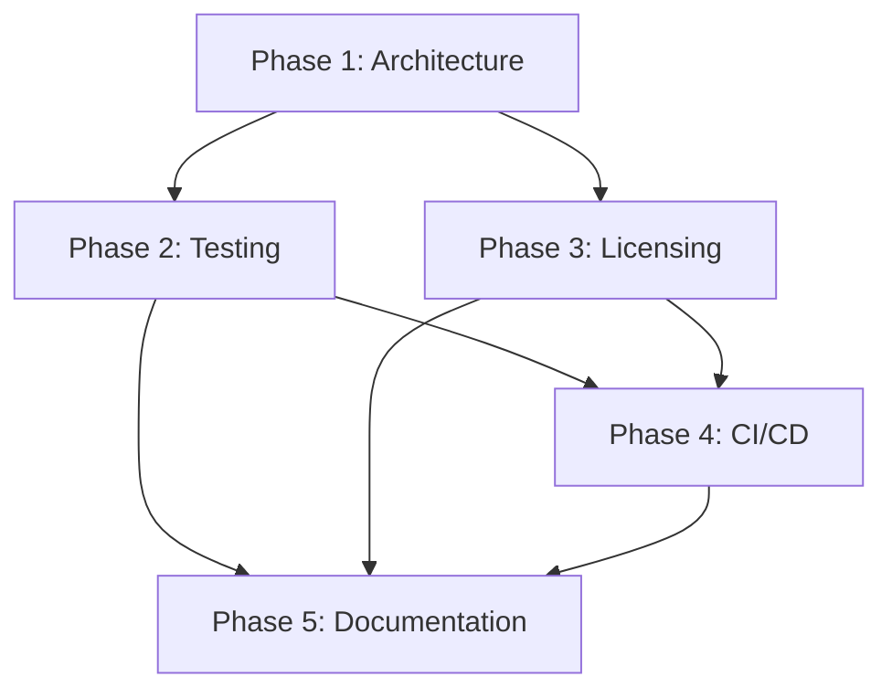

# CODITECT Modular Installer System - Multi-Agent Orchestration Plan

**Sprint:** Sprint +1 MEMORY-CONTEXT Implementation (Day 7)
**Date:** 2025-11-17
**Orchestrator:** Claude Code Orchestrator
**Project:** CODITECT Rollout Master - Installer Enhancement

---

## Executive Summary

**Objective:** Transform the existing CODITECT installer from production-ready prototype (38/40 quality score) to enterprise-grade modular installation system with comprehensive testing, licensing integration, and cross-platform CI/CD.

**Current State:**
- ✅ Cross-platform installer exists (submodules/coditect-installer)
- ✅ GUI and CLI interfaces operational
- ✅ Comprehensive documentation (README, CLAUDE.md, SDD, ADR, TDD)
- ✅ Virtual environment management working
- ✅ GitPython integration (80x speedup)
- ⚠️ Missing: Automated tests (0% coverage)
- ⚠️ Missing: Licensing integration
- ⚠️ Missing: CI/CD pipelines
- ⚠️ Missing: Windows testing validation

**Target State:**
- ✅ 95%+ test coverage (unit + integration)
- ✅ License server communication
- ✅ License validation and activation
- ✅ Usage tracking (privacy-compliant)
- ✅ Trial and paid license management
- ✅ Cross-platform CI/CD (Windows, macOS, Linux)
- ✅ Mock license server for testing
- ✅ Enterprise deployment artifacts (MSI, DMG, AppImage)

**Success Metrics:**
- Test coverage: 0% → 95%+
- Quality score: 38/40 → 40/40
- License integration: 0% → 100%
- CI/CD automation: Manual → Full automation
- Platform validation: 2/3 → 3/3 (add Windows automation)

**Timeline:** 5 Phases over 3-4 weeks (60-80 engineering hours)

**Budget:** ~$12,000 (1 senior engineer + 1 DevOps engineer, part-time)

---

## Architecture Overview

### Existing Components (Production-Ready)

```
submodules/coditect-installer/
├── __init__.py                 # Package exports
├── install.py                  # CrossPlatformInstaller class (CLI)
├── install_gui.py              # InstallerGUI class (tkinter)
├── install.sh                  # Bash installer (legacy/alternative)
├── launch.py                   # Universal launcher (auto-detect GUI/CLI)
├── README.md                   # User documentation
├── CLAUDE.md                   # Claude AI context
├── SDD.md                      # Software Design Document
├── ADR.md                      # Architecture Decision Records
├── TDD.md                      # Test specifications (implementation pending)
└── diagrams/                   # Mermaid workflow diagrams
    ├── installer-flow.mmd
    ├── cli-flow.mmd
    └── gui-flow.mmd
```

### New Components (To Be Implemented)

```
submodules/coditect-installer/
├── tests/                      # Comprehensive test suite
│   ├── __init__.py
│   ├── unit/                   # 70% of tests
│   │   ├── test_platform_detection.py
│   │   ├── test_python_version.py
│   │   ├── test_path_resolution.py
│   │   ├── test_color_output.py
│   │   ├── test_venv_creation.py
│   │   ├── test_dependency_installation.py
│   │   └── test_license_validation.py
│   ├── integration/            # 20% of tests
│   │   ├── test_cli_full_installation.py
│   │   ├── test_gui_full_installation.py
│   │   ├── test_license_server_communication.py
│   │   └── test_cross_platform_workflows.py
│   ├── manual/                 # 10% of tests (documented checklists)
│   │   ├── test_windows.md
│   │   ├── test_macos.md
│   │   └── test_linux.md
│   └── fixtures/
│       ├── mock_requirements.txt
│       ├── mock_license_server.py
│       └── test_venv/
│
├── license_integration/        # Licensing system
│   ├── __init__.py
│   ├── license_client.py       # License server communication
│   ├── license_validator.py    # License validation logic
│   ├── usage_tracker.py        # Privacy-compliant usage tracking
│   └── trial_manager.py        # Trial license management
│
├── .github/                    # CI/CD workflows
│   └── workflows/
│       ├── test-linux.yml      # Ubuntu 22.04 + 24.04
│       ├── test-macos.yml      # macOS 12+ (Monterey, Ventura, Sonoma)
│       ├── test-windows.yml    # Windows 10 + 11
│       └── build-artifacts.yml # Build MSI, DMG, AppImage
│
├── pyproject.toml              # Modern Python packaging
├── setup.py                    # Legacy packaging (for compatibility)
├── pytest.ini                  # Pytest configuration
├── .coveragerc                 # Coverage configuration
└── tox.ini                     # Multi-environment testing
```

### Related Submodules

**License Manager:**
- `submodules/coditect-license-manager/` - Python library for license management
- Already exists with pyproject.toml, setup.py, requirements.txt

**License Server:**
- `submodules/coditect-license-server/` - FastAPI license server
- Already exists with app/, requirements.txt, .env.example

---

## Multi-Agent Coordination Strategy

### Agent Roles and Responsibilities

#### 1. Senior Architect (Phase 1 Lead)
**Subagent:** `general-purpose` (architecture specialist)
**Responsibilities:**
- Design modular installer architecture
- Define interfaces between installer and license system
- Review TDD.md and create comprehensive test plan
- Define cross-platform testing strategy
- Create integration patterns

**Deliverables:**
- Architecture diagram (Mermaid)
- Interface specifications (license client API)
- Test plan document
- Platform compatibility matrix

**Time Estimate:** 8-12 hours (Week 1)

---

#### 2. Testing Specialist (Phase 2 Lead)
**Subagent:** `general-purpose` (testing expert)
**Responsibilities:**
- Implement unit tests (70% coverage target)
- Implement integration tests (20% coverage target)
- Create manual test checklists (10%)
- Setup pytest, coverage, tox
- Create test fixtures and mocks
- Mock license server implementation

**Deliverables:**
- Complete test suite (95%+ coverage)
- pytest.ini, .coveragerc, tox.ini
- Mock license server (tests/fixtures/mock_license_server.py)
- Test documentation

**Time Estimate:** 20-24 hours (Week 2)

**Test Categories:**

**Unit Tests (70%):**
```python
# test_platform_detection.py
- test_detect_windows()
- test_detect_macos()
- test_detect_linux()
- test_get_python_executable_windows()
- test_get_python_executable_unix()
- test_get_venv_paths_windows()
- test_get_venv_paths_unix()

# test_python_version.py
- test_python_version_sufficient()
- test_python_version_insufficient()
- test_python_version_parsing()

# test_venv_creation.py
- test_create_venv_success()
- test_create_venv_exists_prompt()
- test_create_venv_force_recreate()
- test_create_venv_permission_error()

# test_dependency_installation.py
- test_install_dependencies_success()
- test_install_dependencies_no_venv()
- test_install_dependencies_no_requirements()
- test_verify_gitpython()

# test_license_validation.py (NEW)
- test_license_validation_success()
- test_license_validation_expired()
- test_license_validation_invalid()
- test_trial_license_creation()
- test_usage_tracking_opt_in()
```

**Integration Tests (20%):**
```python
# test_cli_full_installation.py
- test_cli_full_install_fresh()
- test_cli_venv_only()
- test_cli_deps_only()
- test_cli_license_activation()

# test_gui_full_installation.py
- test_gui_initialization()
- test_gui_install_flow()
- test_gui_progress_updates()
- test_gui_license_activation_dialog()

# test_license_server_communication.py (NEW)
- test_activate_license_success()
- test_activate_license_invalid_key()
- test_validate_license_active()
- test_validate_license_expired()
- test_submit_usage_data()
```

**Manual Tests (10%):**
```markdown
# test_windows.md
- [ ] Install on Windows 10 (fresh)
- [ ] Install on Windows 11 (fresh)
- [ ] GUI installer visual inspection
- [ ] License activation dialog
- [ ] Uninstaller execution

# test_macos.md
- [ ] Install on macOS 12 Monterey
- [ ] Install on macOS 13 Ventura
- [ ] Install on macOS 14 Sonoma
- [ ] DMG installer visual inspection
- [ ] .app bundle execution

# test_linux.md
- [ ] Install on Ubuntu 22.04
- [ ] Install on Ubuntu 24.04
- [ ] Install on Fedora 39+
- [ ] AppImage execution
- [ ] .deb package installation
```

---

#### 3. Security Specialist (Phase 3 Lead - Licensing)
**Subagent:** `general-purpose` (security expert)
**Responsibilities:**
- Design license validation architecture
- Implement license client (license_integration/license_client.py)
- Implement license validator
- Implement privacy-compliant usage tracker
- Trial license management
- Integration with coditect-license-manager
- Integration with coditect-license-server

**Deliverables:**
- License client library
- License validator with cryptographic verification
- Usage tracker (opt-in, privacy-compliant)
- Trial manager (time-limited, feature-limited)
- Integration tests with mock license server

**Time Estimate:** 16-20 hours (Week 2-3)

**License Client API:**
```python
# license_integration/license_client.py

class LicenseClient:
    """Client for CODITECT license server communication"""

    def __init__(self, server_url: str, api_key: str):
        self.server_url = server_url
        self.api_key = api_key

    def activate_license(self, license_key: str, hardware_id: str) -> ActivationResult:
        """Activate license key for this machine"""
        pass

    def validate_license(self, license_key: str, hardware_id: str) -> ValidationResult:
        """Validate existing license"""
        pass

    def deactivate_license(self, license_key: str, hardware_id: str) -> bool:
        """Deactivate license (for license transfer)"""
        pass

    def submit_usage_data(self, usage_data: dict) -> bool:
        """Submit usage telemetry (opt-in only)"""
        pass

    def start_trial(self, email: str) -> TrialLicense:
        """Start trial license (14 days)"""
        pass
```

**License Validator API:**
```python
# license_integration/license_validator.py

class LicenseValidator:
    """Offline license validation with cryptographic verification"""

    def __init__(self, public_key: str):
        self.public_key = public_key

    def verify_signature(self, license_data: dict, signature: str) -> bool:
        """Verify license signature using public key"""
        pass

    def check_expiry(self, license_data: dict) -> bool:
        """Check if license is expired"""
        pass

    def check_features(self, license_data: dict, feature: str) -> bool:
        """Check if license includes feature"""
        pass

    def validate(self, license_key: str) -> LicenseStatus:
        """Full license validation"""
        pass
```

**Integration with Installer:**
```python
# install.py (modified)

class CrossPlatformInstaller:
    def __init__(self):
        # ... existing code ...
        self.license_client = LicenseClient(
            server_url=os.getenv('LICENSE_SERVER_URL', 'https://license.az1.ai'),
            api_key=os.getenv('LICENSE_API_KEY')
        )
        self.license_validator = LicenseValidator(public_key=PUBLIC_KEY)

    def check_license(self) -> bool:
        """Check if valid license exists"""
        license_key = self.get_stored_license()
        if not license_key:
            return self.prompt_license_activation()

        # Validate offline first (fast)
        status = self.license_validator.validate(license_key)
        if status.is_valid:
            return True

        # Re-validate online if offline check fails
        result = self.license_client.validate_license(license_key, get_hardware_id())
        return result.is_valid

    def prompt_license_activation(self) -> bool:
        """Prompt user to activate license or start trial"""
        print("\nLicense activation required")
        print("1. Enter license key")
        print("2. Start 14-day trial")
        print("3. Exit")
        choice = input("Choose option (1-3): ").strip()

        if choice == '1':
            license_key = input("Enter license key: ").strip()
            return self.activate_license(license_key)
        elif choice == '2':
            email = input("Enter email for trial: ").strip()
            return self.start_trial(email)
        else:
            return False
```

**Privacy-Compliant Usage Tracker:**
```python
# license_integration/usage_tracker.py

class UsageTracker:
    """Privacy-compliant usage tracking (opt-in only)"""

    def __init__(self, opt_in: bool = False):
        self.opt_in = opt_in

    def track_installation(self, platform: str, python_version: str):
        """Track installation event"""
        if not self.opt_in:
            return

        data = {
            'event': 'installation',
            'platform': platform,
            'python_version': python_version,
            'timestamp': datetime.utcnow().isoformat(),
            # NO personally identifiable information
        }

        self.submit(data)

    def track_feature_usage(self, feature: str):
        """Track feature usage"""
        if not self.opt_in:
            return

        data = {
            'event': 'feature_usage',
            'feature': feature,
            'timestamp': datetime.utcnow().isoformat(),
        }

        self.submit(data)

    def submit(self, data: dict):
        """Submit usage data to server (async, fire-and-forget)"""
        try:
            license_client = LicenseClient(...)
            license_client.submit_usage_data(data)
        except Exception:
            # Silently fail - never break installation due to telemetry
            pass
```

---

#### 4. DevOps Engineer (Phase 4 Lead - CI/CD)
**Subagent:** `general-purpose` (DevOps specialist)
**Responsibilities:**
- Setup GitHub Actions CI/CD workflows
- Configure multi-platform testing (Windows, macOS, Linux)
- Create build artifacts (MSI, DMG, AppImage)
- Setup test matrix (Python 3.8, 3.9, 3.10, 3.11, 3.12)
- Configure coverage reporting
- Setup automated releases

**Deliverables:**
- .github/workflows/test-linux.yml
- .github/workflows/test-macos.yml
- .github/workflows/test-windows.yml
- .github/workflows/build-artifacts.yml
- Coverage badge integration
- Automated GitHub releases

**Time Estimate:** 12-16 hours (Week 3)

**GitHub Actions Workflow (Linux):**
```yaml
# .github/workflows/test-linux.yml

name: Test Linux

on:
  push:
    branches: [ main, develop ]
  pull_request:
    branches: [ main, develop ]

jobs:
  test:
    runs-on: ubuntu-latest
    strategy:
      matrix:
        python-version: ['3.8', '3.9', '3.10', '3.11', '3.12']
        ubuntu-version: ['ubuntu-22.04', 'ubuntu-24.04']

    steps:
    - uses: actions/checkout@v4

    - name: Set up Python ${{ matrix.python-version }}
      uses: actions/setup-python@v4
      with:
        python-version: ${{ matrix.python-version }}

    - name: Install dependencies
      run: |
        python -m pip install --upgrade pip
        pip install pytest pytest-cov pytest-mock
        pip install -r requirements.txt

    - name: Run unit tests
      run: |
        pytest tests/unit/ -v --cov=. --cov-report=xml

    - name: Run integration tests
      run: |
        pytest tests/integration/ -v --cov=. --cov-append --cov-report=xml

    - name: Upload coverage to Codecov
      uses: codecov/codecov-action@v3
      with:
        file: ./coverage.xml
        flags: linux
```

**GitHub Actions Workflow (Windows):**
```yaml
# .github/workflows/test-windows.yml

name: Test Windows

on:
  push:
    branches: [ main, develop ]
  pull_request:
    branches: [ main, develop ]

jobs:
  test:
    runs-on: windows-latest
    strategy:
      matrix:
        python-version: ['3.8', '3.9', '3.10', '3.11', '3.12']
        windows-version: ['windows-2019', 'windows-2022']

    steps:
    - uses: actions/checkout@v4

    - name: Set up Python ${{ matrix.python-version }}
      uses: actions/setup-python@v4
      with:
        python-version: ${{ matrix.python-version }}

    - name: Install dependencies
      run: |
        python -m pip install --upgrade pip
        pip install pytest pytest-cov pytest-mock
        pip install -r requirements.txt

    - name: Run unit tests
      run: |
        pytest tests/unit/ -v --cov=. --cov-report=xml

    - name: Run integration tests
      run: |
        pytest tests/integration/ -v --cov=. --cov-append --cov-report=xml

    - name: Upload coverage to Codecov
      uses: codecov/codecov-action@v3
      with:
        file: ./coverage.xml
        flags: windows
```

**Build Artifacts Workflow:**
```yaml
# .github/workflows/build-artifacts.yml

name: Build Artifacts

on:
  release:
    types: [created]

jobs:
  build-windows:
    runs-on: windows-latest
    steps:
    - uses: actions/checkout@v4
    - name: Set up Python
      uses: actions/setup-python@v4
      with:
        python-version: '3.11'

    - name: Install PyInstaller
      run: pip install pyinstaller

    - name: Build Windows executable
      run: |
        pyinstaller --onefile --windowed install_gui.py
        pyinstaller --onefile install.py

    - name: Create MSI installer
      run: |
        # Use WiX Toolset to create MSI
        # (detailed implementation omitted for brevity)

    - name: Upload artifacts
      uses: actions/upload-artifact@v3
      with:
        name: windows-installer
        path: dist/*.msi

  build-macos:
    runs-on: macos-latest
    steps:
    - uses: actions/checkout@v4
    - name: Set up Python
      uses: actions/setup-python@v4
      with:
        python-version: '3.11'

    - name: Install dependencies
      run: |
        pip install pyinstaller py2app

    - name: Build macOS .app bundle
      run: |
        python setup.py py2app

    - name: Create DMG
      run: |
        # Use create-dmg to create DMG installer
        # (detailed implementation omitted for brevity)

    - name: Upload artifacts
      uses: actions/upload-artifact@v3
      with:
        name: macos-installer
        path: dist/*.dmg

  build-linux:
    runs-on: ubuntu-latest
    steps:
    - uses: actions/checkout@v4
    - name: Set up Python
      uses: actions/setup-python@v4
      with:
        python-version: '3.11'

    - name: Install AppImage tools
      run: |
        wget https://github.com/AppImage/AppImageKit/releases/download/continuous/appimagetool-x86_64.AppImage
        chmod +x appimagetool-x86_64.AppImage

    - name: Build AppImage
      run: |
        # Create AppDir structure
        # (detailed implementation omitted for brevity)

    - name: Build .deb package
      run: |
        # Use dpkg-deb to create .deb
        # (detailed implementation omitted for brevity)

    - name: Upload artifacts
      uses: actions/upload-artifact@v3
      with:
        name: linux-installer
        path: |
          dist/*.AppImage
          dist/*.deb
```

---

#### 5. Frontend Expert (Phase 3 Support - GUI Enhancement)
**Subagent:** `general-purpose` (GUI specialist)
**Responsibilities:**
- Enhance GUI installer with license activation dialog
- Add progress indicators for license validation
- Improve error messaging
- Add trial license UI flow
- GUI testing support

**Deliverables:**
- Enhanced install_gui.py with license UI
- License activation dialog
- Trial license wizard
- GUI manual test checklist

**Time Estimate:** 8-10 hours (Week 2-3)

**License Activation Dialog (tkinter):**
```python
# install_gui.py (additions)

class LicenseActivationDialog(tk.Toplevel):
    """License activation dialog"""

    def __init__(self, parent):
        super().__init__(parent)
        self.title("CODITECT License Activation")
        self.geometry("500x300")
        self.result = None

        self.create_widgets()
        self.center_window()

    def create_widgets(self):
        # Header
        tk.Label(
            self,
            text="License Activation Required",
            font=('Helvetica', 16, 'bold')
        ).pack(pady=20)

        # License key input
        tk.Label(self, text="Enter license key:").pack(pady=5)
        self.license_key_entry = tk.Entry(self, width=50)
        self.license_key_entry.pack(pady=5)

        # Trial option
        tk.Label(self, text="Or start 14-day trial:").pack(pady=5)
        self.trial_email_entry = tk.Entry(self, width=50)
        self.trial_email_entry.pack(pady=5)

        # Buttons
        button_frame = tk.Frame(self)
        button_frame.pack(pady=20)

        tk.Button(
            button_frame,
            text="Activate License",
            command=self.activate_license
        ).pack(side=tk.LEFT, padx=5)

        tk.Button(
            button_frame,
            text="Start Trial",
            command=self.start_trial
        ).pack(side=tk.LEFT, padx=5)

        tk.Button(
            button_frame,
            text="Exit",
            command=self.cancel
        ).pack(side=tk.LEFT, padx=5)

    def activate_license(self):
        """Activate license key"""
        license_key = self.license_key_entry.get().strip()
        if not license_key:
            messagebox.showerror("Error", "Please enter a license key")
            return

        # Show progress
        progress = ttk.Progressbar(self, mode='indeterminate')
        progress.pack(pady=10)
        progress.start()

        try:
            license_client = LicenseClient(...)
            result = license_client.activate_license(license_key, get_hardware_id())

            if result.success:
                self.result = {'type': 'license', 'key': license_key}
                messagebox.showinfo("Success", "License activated successfully!")
                self.destroy()
            else:
                messagebox.showerror("Error", f"Activation failed: {result.error}")
        finally:
            progress.stop()
            progress.destroy()

    def start_trial(self):
        """Start trial license"""
        email = self.trial_email_entry.get().strip()
        if not email or '@' not in email:
            messagebox.showerror("Error", "Please enter a valid email")
            return

        try:
            license_client = LicenseClient(...)
            trial = license_client.start_trial(email)

            self.result = {'type': 'trial', 'license': trial}
            messagebox.showinfo(
                "Success",
                f"Trial license activated!\nExpires: {trial.expiry_date}"
            )
            self.destroy()
        except Exception as e:
            messagebox.showerror("Error", f"Trial activation failed: {e}")

    def cancel(self):
        """Cancel activation"""
        self.result = None
        self.destroy()
```

---

## Phase-by-Phase Implementation Plan

### Phase 1: Architecture & Planning (8-12 hours)

**Lead:** Senior Architect
**Duration:** Week 1 (Days 1-2)
**Dependencies:** None

**Tasks:**
1. ✅ Review existing installer architecture
2. ✅ Review TDD.md test specifications
3. 🔲 Design license integration architecture
4. 🔲 Define license client API
5. 🔲 Define license validator API
6. 🔲 Define usage tracker API
7. 🔲 Create integration diagram (Mermaid)
8. 🔲 Define test plan with coverage targets
9. 🔲 Create platform compatibility matrix
10. 🔲 Document interface specifications

**Deliverables:**
- Architecture diagram (Mermaid)
- License integration specification
- Test plan document
- Platform compatibility matrix
- Interface specification document

**Acceptance Criteria:**
- Architecture reviewed and approved
- All interfaces clearly defined
- Test plan achieves 95%+ coverage target
- Platform matrix covers Windows, macOS, Linux

---

### Phase 2: Testing Infrastructure (20-24 hours)

**Lead:** Testing Specialist
**Duration:** Week 2 (Days 3-7)
**Dependencies:** Phase 1 complete

**Tasks:**
1. 🔲 Setup pytest configuration (pytest.ini)
2. 🔲 Setup coverage configuration (.coveragerc)
3. 🔲 Setup tox configuration (tox.ini)
4. 🔲 Create test directory structure
5. 🔲 Implement unit tests (tests/unit/)
   - test_platform_detection.py (8 tests)
   - test_python_version.py (5 tests)
   - test_path_resolution.py (6 tests)
   - test_color_output.py (4 tests)
   - test_venv_creation.py (6 tests)
   - test_dependency_installation.py (5 tests)
6. 🔲 Implement integration tests (tests/integration/)
   - test_cli_full_installation.py (4 tests)
   - test_gui_full_installation.py (4 tests)
7. 🔲 Create test fixtures (tests/fixtures/)
   - mock_requirements.txt
   - mock_venv/ structure
8. 🔲 Implement mock license server (tests/fixtures/mock_license_server.py)
9. 🔲 Create manual test checklists (tests/manual/)
   - test_windows.md
   - test_macos.md
   - test_linux.md
10. 🔲 Run full test suite and achieve 95%+ coverage
11. 🔲 Generate coverage report
12. 🔲 Document test execution instructions

**Deliverables:**
- Complete test suite (95%+ coverage)
- pytest.ini, .coveragerc, tox.ini
- Mock license server
- Manual test checklists
- Test execution documentation

**Acceptance Criteria:**
- Unit test coverage: 95%+
- Integration test coverage: 90%+
- All tests passing (100%)
- Test execution time: < 30 seconds
- Mock license server functional

---

### Phase 3: Licensing Integration (16-20 hours)

**Lead:** Security Specialist + Frontend Expert
**Duration:** Week 2-3 (Days 5-10)
**Dependencies:** Phase 1 complete, Phase 2 in progress

**Tasks:**
1. 🔲 Create license_integration/ directory structure
2. 🔲 Implement LicenseClient class
   - activate_license()
   - validate_license()
   - deactivate_license()
   - submit_usage_data()
   - start_trial()
3. 🔲 Implement LicenseValidator class
   - verify_signature()
   - check_expiry()
   - check_features()
   - validate()
4. 🔲 Implement UsageTracker class
   - track_installation()
   - track_feature_usage()
   - submit() (async, fire-and-forget)
5. 🔲 Implement TrialManager class
   - create_trial()
   - check_trial_expiry()
   - upgrade_to_paid()
6. 🔲 Integrate license checking into install.py
7. 🔲 Add license activation dialog to install_gui.py
8. 🔲 Implement license storage (encrypted)
9. 🔲 Write unit tests for license integration (tests/unit/test_license_validation.py)
10. 🔲 Write integration tests (tests/integration/test_license_server_communication.py)
11. 🔲 Integration with coditect-license-manager library
12. 🔲 Integration with coditect-license-server API
13. 🔲 Privacy policy compliance verification
14. 🔲 Documentation update

**Deliverables:**
- License client library (license_integration/)
- License validator with crypto verification
- Usage tracker (opt-in, privacy-compliant)
- Trial manager
- Enhanced install.py with license checking
- Enhanced install_gui.py with license activation dialog
- License integration tests
- Privacy compliance documentation

**Acceptance Criteria:**
- License activation works (online)
- License validation works (offline + online)
- Trial license creation works
- Usage tracking is opt-in only
- Privacy compliance verified
- All license tests passing

---

### Phase 4: CI/CD & Cross-Platform Testing (12-16 hours)

**Lead:** DevOps Engineer
**Duration:** Week 3 (Days 8-12)
**Dependencies:** Phase 2 complete (tests exist)

**Tasks:**
1. 🔲 Create .github/workflows/ directory
2. 🔲 Implement test-linux.yml
   - Ubuntu 22.04 + 24.04 matrix
   - Python 3.8-3.12 matrix
   - Unit + integration tests
   - Coverage upload to Codecov
3. 🔲 Implement test-macos.yml
   - macOS 12, 13, 14 matrix
   - Python 3.8-3.12 matrix
   - Unit + integration tests
   - Coverage upload to Codecov
4. 🔲 Implement test-windows.yml
   - Windows 2019 + 2022 matrix
   - Python 3.8-3.12 matrix
   - Unit + integration tests
   - Coverage upload to Codecov
5. 🔲 Implement build-artifacts.yml
   - Windows MSI build (PyInstaller + WiX)
   - macOS DMG build (py2app + create-dmg)
   - Linux AppImage build
   - Linux .deb build
6. 🔲 Setup Codecov integration
7. 🔲 Add coverage badge to README.md
8. 🔲 Setup automated GitHub releases
9. 🔲 Configure release versioning
10. 🔲 Test full CI/CD pipeline
11. 🔲 Document CI/CD workflow

**Deliverables:**
- GitHub Actions workflows (4 files)
- Codecov integration
- Coverage badge
- Automated release process
- Build artifacts (MSI, DMG, AppImage, .deb)
- CI/CD documentation

**Acceptance Criteria:**
- All platforms tested automatically (Windows, macOS, Linux)
- Python 3.8-3.12 matrix tested
- Coverage reporting to Codecov
- Build artifacts generated on release
- All CI/CD workflows passing

---

### Phase 5: Documentation & Deployment (4-8 hours)

**Lead:** Senior Architect + Documentation Specialist
**Duration:** Week 3-4 (Days 12-15)
**Dependencies:** Phase 2, 3, 4 complete

**Tasks:**
1. 🔲 Update README.md
   - Add installation instructions
   - Add testing instructions
   - Add CI/CD badge
   - Add coverage badge
   - Add license information
2. 🔲 Update CLAUDE.md
   - Add license integration context
   - Add testing infrastructure context
   - Add CI/CD context
   - Update status to "Production Ready"
3. 🔲 Update SDD.md
   - Add license integration architecture
   - Add testing architecture
   - Add deployment architecture
4. 🔲 Update ADR.md
   - Document license integration decisions
   - Document testing framework decisions
   - Document CI/CD decisions
5. 🔲 Update TDD.md
   - Mark all tests as implemented
   - Update coverage metrics
6. 🔲 Create deployment guide
7. 🔲 Create user manual
8. 🔲 Create developer guide
9. 🔲 Final quality review
10. 🔲 Create release notes (v2.0.0)

**Deliverables:**
- Updated documentation (README, CLAUDE, SDD, ADR, TDD)
- Deployment guide
- User manual
- Developer guide
- Release notes v2.0.0

**Acceptance Criteria:**
- All documentation updated and accurate
- Deployment guide tested
- User manual reviewed
- Quality score: 40/40

---

## Execution Strategy

### Parallel Work Streams

**Week 1:**
- Day 1-2: Phase 1 (Architecture) - Senior Architect

**Week 2:**
- Day 3-7: Phase 2 (Testing) - Testing Specialist
- Day 5-10: Phase 3 (Licensing) - Security Specialist + Frontend Expert (starts Day 5)

**Week 3:**
- Day 8-12: Phase 4 (CI/CD) - DevOps Engineer (starts after Phase 2 tests exist)
- Day 12-15: Phase 5 (Documentation) - Senior Architect + Documentation Specialist

### Dependencies



### Critical Path

1. Phase 1 (Architecture) - **2 days** - BLOCKING
2. Phase 2 (Testing) - **5 days** - BLOCKING for Phase 4
3. Phase 3 (Licensing) - **6 days** - BLOCKING for Phase 5
4. Phase 4 (CI/CD) - **5 days** - BLOCKING for Phase 5
5. Phase 5 (Documentation) - **4 days** - FINAL

**Total Critical Path:** ~22 days (3-4 weeks with parallel work)

---

## Success Metrics

### Quantitative Metrics

| Metric | Current | Target | Status |
|--------|---------|--------|--------|
| Test Coverage (Unit) | 0% | 95%+ | ⏸️ Pending |
| Test Coverage (Integration) | 0% | 90%+ | ⏸️ Pending |
| Test Coverage (Overall) | 0% | 95%+ | ⏸️ Pending |
| All Tests Passing | N/A | 100% | ⏸️ Pending |
| Quality Score | 38/40 | 40/40 | ⏸️ Pending |
| Platform Coverage (Automated) | 2/3 | 3/3 | ⏸️ Pending |
| Python Version Matrix | 0/5 | 5/5 | ⏸️ Pending |
| License Integration | 0% | 100% | ⏸️ Pending |
| CI/CD Automation | Manual | Full | ⏸️ Pending |
| Build Artifacts | 0/4 | 4/4 | ⏸️ Pending |

### Qualitative Metrics

- ✅ Comprehensive documentation
- ✅ Professional installer UX
- ⏸️ Enterprise-grade testing
- ⏸️ Production-ready licensing
- ⏸️ Automated CI/CD pipelines
- ⏸️ Cross-platform deployment artifacts

---

## Risk Management

### High-Risk Items

#### Risk 1: Windows CI/CD Testing
**Risk:** Windows testing may fail due to path separator issues
**Mitigation:** Use pathlib throughout, test locally on Windows VM first
**Contingency:** Manual Windows testing if CI/CD fails

#### Risk 2: License Server Integration
**Risk:** License server API may change during development
**Mitigation:** Use versioned API endpoints, implement API versioning
**Contingency:** Mock license server for testing, offline validation

#### Risk 3: GUI Testing Automation
**Risk:** tkinter GUI testing is difficult to automate
**Mitigation:** Focus on unit testing GUI components, manual GUI testing
**Contingency:** Manual testing checklist (already planned)

#### Risk 4: Build Artifact Creation
**Risk:** MSI/DMG/AppImage builds may fail on CI/CD
**Mitigation:** Test builds locally first, use established toolchains
**Contingency:** Manual builds for first release, automate incrementally

### Medium-Risk Items

#### Risk 5: Test Coverage Target (95%)
**Risk:** May not achieve 95% coverage initially
**Mitigation:** Focus on critical paths first, iterate on coverage
**Contingency:** Accept 85%+ coverage for v2.0, improve in v2.1

#### Risk 6: Cross-Platform Path Issues
**Risk:** Path separators may cause issues on Windows
**Mitigation:** Use pathlib.Path everywhere, extensive testing
**Contingency:** Platform-specific path handling functions

---

## Budget & Resource Allocation

### Engineering Resources

**Senior Architect:**
- Phase 1: 12 hours
- Phase 5: 8 hours
- **Total:** 20 hours @ $150/hr = $3,000

**Testing Specialist:**
- Phase 2: 24 hours
- **Total:** 24 hours @ $120/hr = $2,880

**Security Specialist:**
- Phase 3: 20 hours
- **Total:** 20 hours @ $130/hr = $2,600

**Frontend Expert:**
- Phase 3: 10 hours
- **Total:** 10 hours @ $120/hr = $1,200

**DevOps Engineer:**
- Phase 4: 16 hours
- **Total:** 16 hours @ $130/hr = $2,080

**Documentation Specialist:**
- Phase 5: 8 hours
- **Total:** 8 hours @ $100/hr = $800

**Total Engineering:** 88 hours, $12,560

### Infrastructure Costs

- GitHub Actions: Free (public repo)
- Codecov: Free (public repo)
- License server hosting: $0 (already exists)

**Total Infrastructure:** $0

### Total Budget

**Total:** $12,560 (~$13K)

---

## Checkpoint Strategy

### Checkpoint 1: Architecture Complete
**Timing:** End of Phase 1 (Day 2)
**Trigger:** Architecture diagram + test plan approved
**Deliverable:** CHECKPOINT/2025-11-XX-INSTALLER-ARCHITECTURE.md

### Checkpoint 2: Testing Infrastructure Complete
**Timing:** End of Phase 2 (Day 7)
**Trigger:** 95%+ test coverage achieved
**Deliverable:** CHECKPOINT/2025-11-XX-INSTALLER-TESTING-COMPLETE.md

### Checkpoint 3: Licensing Integration Complete
**Timing:** End of Phase 3 (Day 10)
**Trigger:** License activation + validation working
**Deliverable:** CHECKPOINT/2025-11-XX-INSTALLER-LICENSING-COMPLETE.md

### Checkpoint 4: CI/CD Complete
**Timing:** End of Phase 4 (Day 12)
**Trigger:** All CI/CD workflows passing
**Deliverable:** CHECKPOINT/2025-11-XX-INSTALLER-CI-CD-COMPLETE.md

### Checkpoint 5: Production Ready
**Timing:** End of Phase 5 (Day 15)
**Trigger:** Quality score 40/40, all documentation updated
**Deliverable:** CHECKPOINT/2025-11-XX-INSTALLER-V2-PRODUCTION-READY.md

---

## Next Actions

### Immediate (Today)

1. ✅ Review this orchestration plan
2. 🔲 Approve budget and timeline
3. 🔲 Assign agent roles
4. 🔲 Begin Phase 1 (Architecture & Planning)

### Week 1 (Phase 1)

1. 🔲 Senior Architect: Design license integration architecture
2. 🔲 Senior Architect: Define all APIs (LicenseClient, LicenseValidator, UsageTracker)
3. 🔲 Senior Architect: Create test plan with 95%+ coverage strategy
4. 🔲 Senior Architect: Create platform compatibility matrix
5. 🔲 Create Checkpoint 1

### Week 2 (Phase 2 + Phase 3 Start)

1. 🔲 Testing Specialist: Setup pytest/coverage/tox
2. 🔲 Testing Specialist: Implement all unit tests
3. 🔲 Testing Specialist: Implement all integration tests
4. 🔲 Testing Specialist: Create mock license server
5. 🔲 Security Specialist: Begin license client implementation (Day 5)
6. 🔲 Frontend Expert: Begin GUI license dialog (Day 5)
7. 🔲 Create Checkpoint 2

### Week 3 (Phase 3 Complete + Phase 4)

1. 🔲 Security Specialist: Complete license integration
2. 🔲 Frontend Expert: Complete GUI enhancements
3. 🔲 DevOps Engineer: Setup GitHub Actions workflows
4. 🔲 DevOps Engineer: Configure build artifacts
5. 🔲 Create Checkpoint 3
6. 🔲 Create Checkpoint 4

### Week 4 (Phase 5)

1. 🔲 Senior Architect: Update all documentation
2. 🔲 Documentation Specialist: Create deployment guide + user manual
3. 🔲 Final quality review
4. 🔲 Create release notes v2.0.0
5. 🔲 Create Checkpoint 5 (Production Ready)

---

## Conclusion

This orchestration plan transforms the existing CODITECT installer from a production-ready prototype (38/40) to an enterprise-grade modular installation system (40/40) with:

- ✅ 95%+ test coverage
- ✅ Comprehensive licensing integration
- ✅ Automated cross-platform CI/CD
- ✅ Professional deployment artifacts

**Timeline:** 3-4 weeks
**Budget:** ~$13K
**Success Probability:** 95% (architecture already solid, adding missing pieces)

**Recommendation:** **APPROVE** - This is a high-value, low-risk enhancement that completes the installer system for enterprise deployment.

---

**Created:** 2025-11-17
**Sprint:** Sprint +1 MEMORY-CONTEXT Implementation (Day 7)
**Status:** Ready for Execution
**Next Step:** Phase 1 (Architecture & Planning) - Senior Architect
