# CODITECT.AI

> **Agentic Development as a Service - Transform Ideas into Production-Ready Products with Autonomous AI Orchestration**

CODITECT is a revolutionary distributed intelligence platform that enables autonomous software development through 52+ specialized AI agents, seamless multi-agent orchestration, and zero catastrophic forgetting across sessions.

**Built by:** AZ1.AI INC
**Lead:** Hal Casteel, Founder/CEO/CTO
**Status:** Beta Testing (Active) | Public Launch: March 11, 2026
**Platform:** Agentic Development as a Service

---

## 🎯 What is CODITECT?

CODITECT (Code + Architect) is the first **Agentic Development as a Service** platform that transforms the entire software development lifecycle through autonomous AI agent orchestration.

### Platform Capabilities


### Key Features

- **🤖 52+ Specialized AI Agents** - Domain experts for every development phase
- **⚡ 81+ Automation Commands** - Instant productivity via slash commands
- **🧠 Distributed Intelligence** - Autonomous operation at every project level
- **📋 Systematic Project Management** - Complete traceability from concept to deployment
- **🔄 Multi-Agent Orchestration** - Automated coordination across complex workflows
- **💾 Zero Forgetting** - Context preservation with MEMORY-CONTEXT system
- **☁️ Hybrid Deployment** - Local-first with optional cloud services

---

## 🏗️ System Architecture

### High-Level Platform Architecture


### Container Architecture


### Distributed Intelligence Architecture


---

## 📦 Complete Repository Structure

### Master Orchestration

**🔗 [coditect-rollout-master](https://github.com/coditect-ai/coditect-rollout-master)**
Master orchestration repository coordinating 46 git submodules across 8 categories for complete CODITECT platform rollout.

- **Purpose:** Central coordination and distributed intelligence hub
- **Submodules:** 46 repositories across 8 categories
- **Documentation:** 456K+ words comprehensive
- **Architecture:** Distributed nervous system via `.coditect` symlinks

---

### 🧠 Core Framework (3 repositories)

The brain of CODITECT - distributed intelligence engine with agents, skills, and commands.

#### **🔗 [coditect-core](https://github.com/coditect-ai/coditect-core)** ⭐ PRIMARY PRODUCT

The core CODITECT framework - distributed intelligence engine enabling autonomous AI development.

- **Components:** 52 agents, 81 commands, 26 skills (254+ reusable assets)
- **MEMORY-CONTEXT:** Zero forgetting system (7,507+ unique messages)
- **Training:** 55K+ word operator training program
- **Scripts:** 21 Python automation scripts
- **Status:** Production-ready (78% operational, roadmap to 100%)

#### **🔗 [coditect-core-framework](https://github.com/coditect-ai/coditect-core-framework)**

Framework utilities and shared components for cross-project intelligence.

- **Purpose:** Reusable patterns and utilities
- **Components:** Workflow patterns, production patterns, horizontal capabilities
- **Integration:** Symlink-based distribution to all projects

#### **🔗 [coditect-core-architecture](https://github.com/coditect-ai/coditect-core-architecture)**

Architecture documentation, ADRs, and system design specifications.

- **ADRs:** 10+ Architecture Decision Records
- **Diagrams:** C4 architecture diagrams (7 phases, 24 diagrams)
- **Research:** Multi-agent architecture patterns and best practices

---

### ☁️ Cloud Platform (5 repositories)

Optional cloud-hosted SaaS platform for CODITECT as a service.

#### **🔗 [coditect-cloud-backend](https://github.com/coditect-ai/coditect-cloud-backend)**

High-performance async backend API for cloud-hosted CODITECT platform.

- **Tech Stack:** Rust, Actix-web, FoundationDB
- **Features:** Multi-tenant API, session management, license validation
- **Architecture:** Async request handling, WebSocket support, circuit breakers
- **Database:** FoundationDB with multi-tenant key design

#### **🔗 [coditect-cloud-frontend](https://github.com/coditect-ai/coditect-cloud-frontend)**

Modern web dashboard for cloud CODITECT platform.

- **Tech Stack:** React, TypeScript, TailwindCSS
- **Features:** Project dashboard, agent monitoring, session management
- **Real-time:** WebSocket integration for live updates
- **Design:** Responsive, accessible, production-grade UI

#### **🔗 [coditect-cloud-ide](https://github.com/coditect-ai/coditect-cloud-ide)**

Browser-based IDE powered by Eclipse Theia with CODITECT agent integration.

- **Tech Stack:** Eclipse Theia, WebAssembly terminal, WebSocket
- **Features:** Cloud IDE with integrated CODITECT agents
- **Deployment:** Containerized, Kubernetes-ready
- **Integration:** Direct agent invocation from IDE

#### **🔗 [coditect-cloud-infra](https://github.com/coditect-ai/coditect-cloud-infra)**

Infrastructure as Code for CODITECT cloud platform deployment.

- **Tech Stack:** OpenTofu, GCP, Kubernetes
- **Resources:** Cloud SQL, GKE, Redis, VPC, Cloud KMS, Identity Platform
- **Monitoring:** Prometheus, Grafana, Cloud Logging
- **Security:** Zero-trust architecture, encryption at rest/transit

---

### 🛠️ Developer Tools (9 repositories)

CLI, automation, analytics, and specialized development utilities.

#### **🔗 [coditect-cli](https://github.com/coditect-ai/coditect-cli)**

Command-line interface for local CODITECT operations.

- **Purpose:** Primary developer interface for CODITECT
- **Features:** Agent invocation, project management, workflow automation
- **Integration:** Works with or without cloud platform

#### **🔗 [coditect-automation](https://github.com/coditect-ai/coditect-automation)**

Automation scripts and workflow orchestration.

- **Scripts:** 21 Python automation scripts
- **Workflows:** Git operations, checkpoint creation, documentation generation
- **Integration:** Seamless CLI integration

#### **🔗 [coditect-analytics](https://github.com/coditect-ai/coditect-analytics)**

Usage analytics, metrics, and insights dashboard.

- **Metrics:** Agent utilization, token consumption, project velocity
- **Dashboards:** Real-time analytics and reporting
- **Privacy:** Local-first analytics, optional cloud sync

#### **🔗 [coditect-dev-context](https://github.com/coditect-ai/coditect-dev-context)**

Context management and session continuity system.

- **MEMORY-CONTEXT:** Session export and deduplication
- **Features:** 7,507+ unique messages, zero catastrophic forgetting
- **Integration:** Automatic checkpoint creation

#### **🔗 [coditect-dev-intelligence](https://github.com/coditect-ai/coditect-dev-intelligence)**

Intelligence layer for code analysis and recommendations.

- **Features:** Code quality analysis, pattern detection, optimization suggestions
- **Agents:** Integrates with code-reviewer, senior-architect agents

#### **🔗 [coditect-dev-pdf](https://github.com/coditect-ai/coditect-dev-pdf)**

PDF document processing and analysis.

- **Features:** Extract text from PDFs, analyze documentation
- **Use Cases:** Processing technical specs, research papers

#### **🔗 [coditect-dev-audio2text](https://github.com/coditect-ai/coditect-dev-audio2text)**

Audio transcription for meeting notes and documentation.

- **Features:** Transcribe audio to text, generate summaries
- **Use Cases:** Meeting notes, podcast transcription, voice memos

#### **🔗 [coditect-dev-qrcode](https://github.com/coditect-ai/coditect-dev-qrcode)**

QR code generation and scanning utilities.

- **Features:** Generate QR codes, scan and decode
- **Use Cases:** URL sharing, authentication, asset tracking

---

### 🏪 Marketplace (2 repositories)

Agent marketplace and activity tracking for ecosystem growth.

#### **🔗 [coditect-market-agents](https://github.com/coditect-ai/coditect-market-agents)**

Marketplace for community-contributed agents and skills.

- **Features:** Agent discovery, ratings, reviews
- **Submission:** Community agent contributions
- **Curation:** Quality gates and security validation

#### **🔗 [coditect-market-activity](https://github.com/coditect-ai/coditect-market-activity)**

Activity tracking, leaderboards, and community engagement.

- **Metrics:** Agent usage, popularity, trending
- **Gamification:** Contributor leaderboards, badges

---

### 📚 Documentation (5 repositories)

Comprehensive documentation, legal, blog, training, and setup guides.

#### **🔗 [coditect-docs-main](https://github.com/coditect-ai/coditect-docs-main)**

Primary documentation hub with user guides and API references.

- **Content:** User guides, API docs, architecture guides
- **Format:** Markdown, optimized for web and NotebookLM

#### **🔗 [coditect-legal](https://github.com/coditect-ai/coditect-legal)**

Legal documentation, terms of service, privacy policy.

- **Documents:** TOS, Privacy Policy, SLA, DPA
- **Compliance:** GDPR, CCPA, SOC2 readiness

#### **🔗 [coditect-docs-blog](https://github.com/coditect-ai/coditect-docs-blog)**

Technical blog and content marketing materials.

- **Content:** Tutorials, case studies, release notes
- **SEO:** Optimized for organic discovery

#### **🔗 [coditect-docs-training](https://github.com/coditect-ai/coditect-docs-training)**

Comprehensive operator training program (55K+ words).

- **Levels:** Quick Start (30min), Comprehensive (4-6hr), Advanced
- **Content:** 13 core documents, assessments, certification
- **Demo Scripts:** Live orchestrated demonstrations

#### **🔗 [coditect-docs-setup](https://github.com/coditect-ai/coditect-docs-setup)**

Installation, configuration, and onboarding guides.

- **Content:** Environment setup, troubleshooting, FAQ
- **Platforms:** macOS, Linux, Windows

---

### ⚙️ Operations (4 repositories)

Distribution, licensing, project management, compliance, and estimation.

#### **🔗 [coditect-ops-distribution](https://github.com/coditect-ai/coditect-ops-distribution)**

Distribution packages and installer management.

- **Packages:** CLI installers for macOS, Linux, Windows
- **Updates:** Automatic update mechanism
- **Telemetry:** Optional usage reporting

#### **🔗 [coditect-ops-license](https://github.com/coditect-ai/coditect-ops-license)**

License management system for commercial deployments.

- **Features:** License key generation, validation, enforcement
- **Tiers:** Community, Professional, Team, Enterprise
- **Integration:** Backend API integration

#### **🔗 [coditect-ops-projects](https://github.com/coditect-ai/coditect-ops-projects)**

Project intelligence platform for internal and customer projects.

- **Features:** Project discovery, planning, structure optimization
- **Agents:** project-discovery-specialist, project-structure-optimizer
- **Automation:** Complete project scaffolding

#### **🔗 [coditect-ops-compliance](https://github.com/coditect-ai/coditect-ops-compliance)** ⭐ NEW (Nov 22)

Compliance framework, security standards, and audit automation.

- **Standards:** SOC2, GDPR, HIPAA readiness
- **Automation:** Compliance checks, audit trails
- **Documentation:** Policy templates, procedures

#### **🔗 [coditect-ops-estimation-engine](https://github.com/coditect-ai/coditect-ops-estimation-engine)**

AI-powered project estimation and resource planning.

- **Features:** Effort estimation, resource allocation, timeline prediction
- **ML Models:** Historical data analysis, pattern recognition
- **Integration:** PROJECT-PLAN.md generation

---

### 🚀 Go-to-Market (7 repositories)

Communications, strategy, CRM, personas, customer projects, legitimacy, investors.

#### **🔗 [coditect-gtm-comms](https://github.com/coditect-ai/coditect-gtm-comms)**

Communications center and marketing materials.

- **Content:** Press releases, newsletters, email campaigns
- **Channels:** Email, social media, blog integration

#### **🔗 [coditect-gtm-strategy](https://github.com/coditect-ai/coditect-gtm-strategy)**

Go-to-market strategy, positioning, and market analysis.

- **Analysis:** TAM/SAM/SOM, competitive intelligence
- **Strategy:** Product positioning, pricing, channels

#### **🔗 [coditect-gtm-crm](https://github.com/coditect-ai/coditect-gtm-crm)**

Customer relationship management system.

- **Features:** Lead tracking, pipeline management, customer lifecycle
- **Integration:** Email, calendar, support ticketing

#### **🔗 [coditect-gtm-personas](https://github.com/coditect-ai/coditect-gtm-personas)**

Ideal customer profiles and user personas.

- **Personas:** Technical decision makers, developers, CTOs
- **Research:** Pain points, motivations, objections

#### **🔗 [coditect-gtm-customer-clipora](https://github.com/coditect-ai/coditect-gtm-customer-clipora)**

Early customer project - Clipora integration.

- **Purpose:** Reference implementation, case study
- **Features:** Custom agent development, white-label deployment

#### **🔗 [coditect-gtm-legitimacy](https://github.com/coditect-ai/coditect-gtm-legitimacy)**

Trust signals, social proof, and credibility building.

- **Content:** Case studies, testimonials, certifications
- **Metrics:** Customer success metrics, NPS tracking

#### **🔗 [coditect-gtm-investor](https://github.com/coditect-ai/coditect-gtm-investor)**

Investor relations, pitch decks, financial models.

- **Materials:** Pitch deck, financial projections, data room
- **Metrics:** Traction metrics, unit economics, ROI analysis

---

### 🔬 Labs (12 repositories)

Research, experiments, and next-generation development.

#### **🔗 [coditect-labs-learning](https://github.com/coditect-ai/coditect-labs-learning)**

Machine learning experiments and AI research.

#### **🔗 [coditect-labs-agent-standards](https://github.com/coditect-ai/coditect-labs-agent-standards)**

Agent standardization research and best practices.

#### **🔗 [coditect-labs-screenshot](https://github.com/coditect-ai/coditect-labs-screenshot)**

Screenshot capture and analysis utilities.

#### **🔗 [coditect-labs-workflow](https://github.com/coditect-ai/coditect-labs-workflow)**

Workflow optimization and automation research.

#### **🔗 [coditect-labs-agents-research](https://github.com/coditect-ai/coditect-labs-agents-research)**

Multi-agent coordination research and experiments.

#### **🔗 [coditect-labs-claude-research](https://github.com/coditect-ai/coditect-labs-claude-research)**

Claude Code integration research and patterns.

#### **🔗 [coditect-labs-first-principles](https://github.com/coditect-ai/coditect-labs-first-principles)**

First principles thinking and problem decomposition.

#### **🔗 [coditect-labs-v4-archive](https://github.com/coditect-ai/coditect-labs-v4-archive)**

Historical v4 IDE platform (reference architecture).

#### **🔗 [coditect-labs-mcp-auth](https://github.com/coditect-ai/coditect-labs-mcp-auth)**

MCP (Model Context Protocol) authentication research.

#### **🔗 [coditect-labs-multi-agent-rag](https://github.com/coditect-ai/coditect-labs-multi-agent-rag)**

Multi-agent RAG (Retrieval Augmented Generation) experiments.

#### **🔗 [coditect-labs-cli-web-arch](https://github.com/coditect-ai/coditect-labs-cli-web-arch)**

CLI and web architecture research and prototypes.

#### **🔗 [coditect-next-generation](https://github.com/coditect-ai/coditect-next-generation)** ⭐ NEW (Nov 22)

Next-generation CODITECT platform architecture and research.

- **Focus:** Future platform evolution, new capabilities
- **Research:** Advanced agent orchestration, autonomous workflows

#### **🔗 [NESTED-LEARNING-GOOGLE](https://github.com/coditect-ai/NESTED-LEARNING-GOOGLE)**

Educational content for Google NotebookLM integration.

---

## 🔄 Platform Workflows

### 1. User Registration Flow


**Key Features:**
- Argon2 password hashing
- Email verification required
- Rate limiting on registration endpoint
- Multi-factor authentication (optional)

---

### 2. Authentication & Authorization Flow


**Security Features:**
- JWT with short-lived access tokens (15 minutes)
- Refresh tokens with rotation (7 days)
- Argon2id password hashing
- Rate limiting and brute-force protection
- Secure token storage (OS keychain)
- Multi-tenant authorization (RBAC)

---

### 3. Payment & Subscription Flow


**Subscription Tiers:**
- **Community:** Free (local-only, limited agents)
- **Professional:** $49/month (full agents, 1 user, cloud optional)
- **Team:** $99/month per user (5+ users, collaboration features)
- **Enterprise:** Custom pricing (SLA, on-premise, dedicated support)

**Payment Features:**
- Stripe integration for payments
- Automatic billing and invoices
- Grace period for failed payments (3 days)
- Prorated upgrades/downgrades
- Annual discounts (20% off)

---

### 4. License Validation & Enforcement


**License Features:**
- Local-first validation (offline support)
- Cryptographic signature verification
- Automatic sync with cloud (24hr heartbeat)
- Concurrent seat enforcement
- Grace period for network failures (7 days)

---

### 5. User & Tenant Management

```mermaid
sequenceDiagram
    actor Admin
    participant Web as Admin Dashboard
    participant API as Backend API
    participant Tenant as Tenant Service
    participant RBAC as RBAC Service
    participant DB as FoundationDB
    participant Email as Email Service

    rect rgb(200, 220, 240)
        Note over Admin,Email: Tenant Creation
        Admin->>Web: Create Organization "Acme Corp"
        Web->>API: POST /api/v1/tenants
        API->>Tenant: Create Tenant
        Tenant->>DB: Generate Tenant ID
        Tenant->>DB: Create Tenant Record
        Tenant->>DB: Create Default Roles (Owner, Admin, Member)
        DB-->>Tenant: Tenant Created
        Tenant->>RBAC: Assign Admin as Owner
        RBAC->>DB: Create User-Tenant-Role Mapping
        Tenant-->>API: Tenant ID
        API-->>Web: Tenant Created
        Web-->>Admin: Organization Dashboard
    end

    rect rgb(220, 240, 200)
        Note over Admin,Email: Invite Team Member
        Admin->>Web: Invite User "developer@acme.com"
        Web->>API: POST /api/v1/tenants/{id}/invites
        API->>Tenant: Create Invitation
        Tenant->>DB: Store Invite Token (expires 7 days)
        Tenant->>Email: Send Invitation Email
        Tenant-->>API: Invitation Sent
        API-->>Web: Invite Pending
    end

    rect rgb(240, 220, 200)
        Note over Admin,Email: Accept Invitation
        participant NewUser as New User
        NewUser->>Email: Click Invitation Link
        Email->>API: GET /api/v1/invites/accept?token=xxx
        API->>Tenant: Validate Token
        Tenant->>DB: Fetch Invitation
        DB-->>Tenant: Invitation Data
        Tenant->>Tenant: Check Expiry
        Tenant-->>API: Invitation Valid
        API-->>NewUser: Registration Form (Pre-filled)
        NewUser->>API: POST /api/v1/auth/register (with invite token)
        API->>Tenant: Create User + Link to Tenant
        Tenant->>DB: Create User Record
        Tenant->>RBAC: Assign Role (Member)
        RBAC->>DB: Create User-Tenant-Role Mapping
        Tenant->>DB: Mark Invitation Accepted
        Tenant->>Email: Welcome Email
        Tenant-->>API: User Created
        API-->>NewUser: Redirect to Dashboard
    end

    rect rgb(200, 240, 220)
        Note over Admin,Email: Manage Team Member
        Admin->>Web: Change Role: developer@acme.com → Admin
        Web->>API: PATCH /api/v1/tenants/{id}/members/{user_id}
        API->>RBAC: Check Admin Has Permission
        RBAC->>DB: Verify Admin is Owner/Admin
        DB-->>RBAC: Permission Granted
        RBAC->>DB: Update User-Tenant-Role Mapping
        DB-->>RBAC: Role Updated
        RBAC->>Email: Notify User of Role Change
        RBAC-->>API: Update Complete
        API-->>Web: Role Changed
    end
```



**Multi-Tenancy Features:**
- Complete data isolation per tenant
- FoundationDB tenant key prefix isolation
- Role-based access control (RBAC)
- Invitation-based onboarding
- Seat-based licensing enforcement
- Team activity audit logs

---

### 6. Local CODITECT Deployment


**Local Deployment Benefits:**
- ✅ No cloud dependency (works offline)
- ✅ Complete data privacy (local file system)
- ✅ Zero latency (no network calls except LLM)
- ✅ Free tier available (Community Edition)
- ✅ Git-based version control
- ✅ MEMORY-CONTEXT for zero forgetting

---

### 7. Cloud CODITECT Deployment


**Cloud Deployment Benefits:**
- ✅ Browser-based IDE (Theia)
- ✅ Multi-tenant isolation (Kubernetes namespaces)
- ✅ Automatic scaling (Cloud Run, GKE)
- ✅ Managed infrastructure (GCP)
- ✅ Integrated CI/CD (Cloud Build)
- ✅ Persistent storage (FoundationDB + Cloud Storage)
- ✅ Team collaboration features
- ✅ Zero DevOps overhead

**Cloud Architecture:**
- **Frontend:** React/TypeScript on Cloud Run
- **Backend API:** Rust/Actix-web on Cloud Run
- **IDE:** Eclipse Theia on GKE
- **Database:** FoundationDB (multi-tenant)
- **Storage:** Cloud Storage (project files)
- **Build:** Cloud Build (CI/CD)
- **Networking:** VPC, Load Balancer, Cloud CDN
- **Monitoring:** Prometheus, Grafana, Cloud Logging

---

### 8. Deployment Options Comparison


| Feature | Local | Cloud | Hybrid |
|---------|-------|-------|--------|
| **Cost** | Free (Community) | $49-99/mo | Free + Optional Cloud |
| **Privacy** | 100% Private | Multi-tenant Isolated | Configurable |
| **Offline** | ✅ Full Support | ❌ Requires Internet | ✅ Offline Capable |
| **Collaboration** | Git-based | Real-time | Git + Optional Cloud |
| **IDE** | Local Editor | Browser IDE | Both |
| **Deployment** | Manual | Automated CI/CD | Configurable |
| **Scalability** | Local Resources | Auto-scaling | Local + Cloud |

---

## 🎓 Getting Started

### Quick Start (5 Minutes)

```bash
# 1. Install CODITECT CLI
curl -fsSL https://get.coditect.ai | bash

# 2. Verify installation
coditect --version

# 3. Login (cloud) or use locally
coditect login  # Optional: for cloud features

# 4. Create your first project
coditect init "my-awesome-app"

# 5. Start autonomous development
coditect agent invoke orchestrator "Build a REST API for user management"

# 6. Review generated code
ls -la src/
```

### Comprehensive Training

**CODITECT Operator Training Program** (55,000+ words)

1. **Quick Start (30 minutes)** - Immediate productivity
2. **Comprehensive Training (4-6 hours)** - Full certification
3. **Advanced Mastery (ongoing)** - Expert optimization

**Training Includes:**
- 13 core training documents
- Live demo scripts with real examples
- Sample templates and quality benchmarks
- Assessments verifying capability

**Start:** [User Training README](https://github.com/coditect-ai/coditect-core/tree/main/user-training/README.md)

---

## 💰 Pricing & Licensing

### Subscription Tiers

| Tier | Price | Features |
|------|-------|----------|
| **Community** | **Free** | Local-only, 20 agents, community support |
| **Professional** | **$49/month** | Full 52 agents, cloud optional, email support |
| **Team** | **$99/month per user** | 5+ users, collaboration, priority support |
| **Enterprise** | **Custom** | On-premise, SLA, dedicated support, custom agents |

### Enterprise Features

- ✅ On-premise deployment
- ✅ Custom agent development
- ✅ SLA guarantees (99.9% uptime)
- ✅ Dedicated support channel
- ✅ Security audits & compliance
- ✅ White-label options
- ✅ Professional services available

**Request Enterprise Quote:** [Contact Sales](https://coditect.ai/contact)

---

## 📊 Roadmap

### Current Phase: Beta Testing (Active)

**Status:** Week 2 of 4 (Nov 12 - Dec 10, 2025)
**Users:** 50-100 beta testers
**Focus:** Product validation, feedback collection, bug fixes

### Next Milestone: Pilot Program

**Dates:** Dec 11, 2025 - Feb 18, 2026
**Users:** 100+ pilot customers
**Focus:** Production readiness, scalability, customer success

### Public Launch: March 11, 2026

**Target:** General availability
**Launch:** Website, documentation, community support
**Revenue Goal:** $150K MRR by Month 12

### Future Phases (2026+)

**Phase 4: Autonomous Operation (Q2-Q3 2026)**
- Inter-agent communication (RabbitMQ)
- Agent discovery service (Redis)
- 95% autonomy (eliminate human-in-the-loop)

**Phase 5: Marketplace & Ecosystem (Q4 2026)**
- Community agent contributions
- Agent marketplace with ratings
- Certified consultant network

**Phase 6: Enterprise Scale (2027)**
- Multi-region deployment
- Advanced analytics
- Custom AI model support

---

## 🤝 Contributing

CODITECT is currently in **private beta**. We welcome contributions from beta testers.

**Beta Access:**
- **Apply:** Submit use case and team size
- **Timeline:** Beta concludes December 10, 2025
- **Benefits:** Early access, influence roadmap, founding customer pricing

**Public contributions** open March 11, 2026 after general availability launch.

---

## 📞 Contact & Support

**Organization:** AZ1.AI INC
**Lead:** Hal Casteel, Founder/CEO/CTO
**GitHub:** https://github.com/coditect-ai

**Beta Support:**
- GitHub Issues: [coditect-rollout-master/issues](https://github.com/coditect-ai/coditect-rollout-master/issues)
- Direct Contact: Available to beta testers

**Stay Updated:**
- ⭐ Star [coditect-rollout-master](https://github.com/coditect-ai/coditect-rollout-master)
- 📅 Public launch countdown: 109 days (as of Nov 24, 2025)

---

## 📄 License

**Current:** Private Beta (Proprietary)
**Future:** Commercial license with Community Edition (March 2026)

---

## 🌟 Why CODITECT?

### Traditional Development Challenges

❌ Manual orchestration overhead (40-60% time on coordination)
❌ Knowledge silos (critical decisions lost)
❌ Inconsistent processes (reinventing the wheel)
❌ Context switching (hours lost reconstructing state)
❌ Quality variability (no systematic enforcement)

### CODITECT Solutions

✅ **Autonomous orchestration** - AI agents handle coordination
✅ **Centralized intelligence** - `.coditect` symlinks everywhere
✅ **Systematic processes** - Proven workflows for every phase
✅ **Zero forgetting** - MEMORY-CONTEXT preserves all context
✅ **Enforced quality** - Automated quality gates and compliance

---

## 🚀 Start Your Journey

**Transform your ideas into production-ready applications with autonomous AI orchestration.**

```bash
# Begin with CODITECT today
curl -fsSL https://get.coditect.ai | bash
coditect init "your-transformative-idea"
```

**Welcome to the future of software development. Welcome to CODITECT.** 🎯

---

*Last Updated: November 24, 2025*
*Framework Version: 1.0 (Beta)*
*Public Launch: March 11, 2026*
*Master Repository: 46 submodules across 8 categories*
