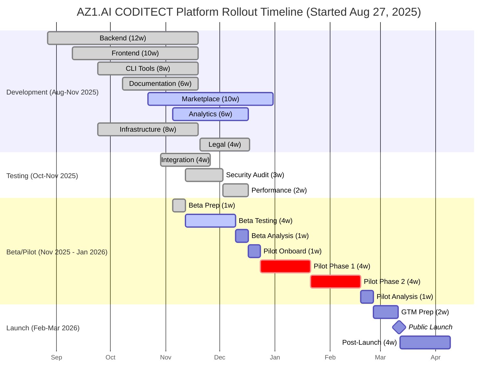

# AZ1.AI CODITECT Platform Rollout - Master Timeline

## Overview

This master Gantt chart represents the complete rollout timeline for the AZ1.AI CODITECT Platform, starting August 27, 2025. The timeline shows parallel development tracks, testing phases, beta/pilot programs, and public launch scheduled for March 2026.

**Project Start:** August 27, 2025
**Current Status:** Beta Testing (Active as of Nov 20, 2025)
**Target Launch:** March 11, 2026

**Diagram Source:** [master-gantt-timeline.mmd](master-gantt-timeline.mmd)

## Timeline Visualization

## Phase Summary

### Aug-Nov 2025: Development Phase ✅ MOSTLY COMPLETE
**Focus:** Build all core platform components in parallel
**Status:** Core development complete, Marketplace & Analytics in progress

| Component | Duration | Related Phase |
|-----------|----------|---------------|
| **Backend Development** | 12 weeks | [Phase 2 - IDE & Cloud](phase-2-ide-cloud/) |
| **Frontend Development** | 10 weeks | [Phase 2 - IDE & Cloud](phase-2-ide-cloud/) |
| **CLI Tools** | 8 weeks | [Phase 1 - Claude Framework](phase-1-claude-framework/) |
| **Documentation** | 6 weeks | All Phases |
| **Agent Marketplace** | 10 weeks | [Phase 5 - Marketplace](phase-5-marketplace-analytics/) |
| **Analytics Platform** | 6 weeks | [Phase 5 - Analytics](phase-5-marketplace-analytics/) |
| **Infrastructure** | 8 weeks | [Phase 2 - Cloud Platform](phase-2-ide-cloud/) |
| **Legal & Compliance** | 4 weeks | [Phase 4 - License Management](phase-4-license-management/) |

**Key Deliverables:**
- Production-ready FastAPI backend with multi-tenant isolation
- React/TypeScript cloud IDE with Theia integration
- Complete CLI tool suite with agent orchestration
- Comprehensive API documentation and user training
- Agent marketplace with discovery and rating system
- ClickHouse analytics platform with real-time tracking
- GKE infrastructure with CI/CD automation
- Complete legal framework and compliance documentation

### Oct-Nov 2025: Testing Phase ✅ COMPLETE
**Focus:** Comprehensive quality assurance and production readiness
**Status:** Integration, security audit, and performance testing complete

| Activity | Duration | Purpose |
|----------|----------|---------|
| **Integration Testing** | 4 weeks | Cross-component validation, API testing, database transactions |
| **Security Audit** | 3 weeks | Penetration testing, vulnerability assessment, compliance verification |
| **Performance Testing** | 2 weeks | Load testing (100+ users), latency benchmarks, auto-scaling validation |

**Success Criteria:**
- 95%+ test coverage across all components
- Zero critical security vulnerabilities
- API latency <200ms (p95), 99.9% uptime SLA
- Support 100+ concurrent users

### Nov-Dec 2025: Beta Phase ⚡ ACTIVE NOW
**Focus:** Internal and limited external user testing (50-100 users)
**Status:** Beta testing actively underway as of Nov 20, 2025

| Activity | Duration | Focus |
|----------|----------|-------|
| **Beta Preparation** | 1 week | Onboarding materials, feedback systems, bug tracking |
| **Beta Testing** ⚠️ CRITICAL | 4 weeks | Real-world usage, feedback collection, rapid iteration |
| **Beta Analysis** | 1 week | Feedback synthesis, pilot readiness assessment |

**Success Criteria:**
- 50+ active beta users providing feedback
- 80%+ positive user satisfaction
- Critical bugs resolved within 24 hours
- System stability >99% uptime

### Dec 2025 - Feb 2026: Pilot Phase
**Focus:** Expanded testing with 100-500 pilot users
**Status:** Scheduled to begin mid-December 2025

| Activity | Duration | Focus |
|----------|----------|-------|
| **Pilot Onboarding** | 1 week | User recruitment, training, access provisioning |
| **Pilot Phase 1** ⚠️ CRITICAL | 4 weeks | Core feature validation (100-200 users) |
| **Pilot Phase 2** ⚠️ CRITICAL | 4 weeks | Scale testing and enterprise validation (200-500 users) |
| **Pilot Analysis** | 1 week | Performance review, pricing validation, GTM preparation |

**Success Criteria:**
- 300+ active pilot users by Phase 2 end
- 80%+ user satisfaction maintained
- Enterprise use cases validated
- Pricing model confirmed

### Feb-Mar 2026: GTM & Launch 🎯
**Focus:** Public launch and post-launch support
**Status:** Planned for March 11, 2026

| Activity | Duration | Focus |
|----------|----------|-------|
| **GTM Preparation** | 2 weeks | Marketing campaigns, sales enablement, support scaling |
| **Public Launch** 🎯 MILESTONE | 1 day | Platform goes live for public signups |
| **Post-Launch Support** | 4 weeks | 24/7 monitoring, rapid issue resolution, user feedback |

**Success Criteria:**
- Zero critical launch issues
- >99.9% uptime maintained
- Support ticket resolution <24 hours
- User satisfaction >85%

## Critical Path Items

The following activities are on the **critical path** and directly impact the March 2026 launch date:

1. ⚡ **Beta Testing** (Nov 12 - Dec 10, 2025) - **ACTIVE NOW** - Must validate core functionality before pilot
2. ⚠️ **Pilot Phase 1** (Dec 24, 2025 - Jan 21, 2026) - Must prove product-market fit
3. ⚠️ **Pilot Phase 2** (Jan 21 - Feb 18, 2026) - Must validate enterprise readiness and scale
4. 🎯 **Public Launch** (March 11, 2026) - Target milestone

**Any delays in critical path items will push back the March 11, 2026 launch date.**

## Parallel Development Strategy

The timeline shows significant parallel work to maximize efficiency:

**Aug-Oct 2025: ✅ COMPLETE**
- Backend + Frontend development ran concurrently
- CLI Tools + Documentation overlapped with core development
- Infrastructure supported all development activities

**Oct-Nov 2025: ✅ COMPLETE**
- Marketplace + Analytics built on core platform (still in progress)
- Legal & Compliance prepared beta user agreements
- All tracks converged for integration testing

**Oct-Nov 2025: ✅ COMPLETE**
- Integration, Security, and Performance testing ran sequentially with overlap
- Buffer periods used for addressing issues

## Key Milestones

| Date | Milestone | Significance | Status |
|------|-----------|--------------|--------|
| **Nov 19, 2025** | Core Platform Complete | Backend + Frontend + CLI operational | ✅ Done |
| **Nov 19, 2025** | Core Development Complete | Backend, Frontend, CLI, Docs, Infrastructure ready | ✅ Done |
| **Jan 2026** | Marketplace Ready | Agent ecosystem launched | 🔨 In Progress |
| **Nov 26, 2025** | Testing Complete | Production readiness validated | ✅ Done |
| **Nov 12, 2025** | Beta Launch | First external users onboarded | ⚡ Active |
| **Dec 24, 2025** | Pilot Phase 1 Start | Scale validation begins | 📅 Scheduled |
| **Mar 11, 2026** | Public Launch | General availability | 🎯 Target |

## Risk Mitigation

### High-Risk Areas

1. **Integration Testing (Month 5)** - Complex multi-component system
   - **Mitigation:** 4-week dedicated testing period with automation

2. **Security Audit (Month 5-6)** - Vulnerabilities could delay beta
   - **Mitigation:** Continuous security review during development

3. **Beta/Pilot Feedback (Months 6-9)** - User feedback may require rework
   - **Mitigation:** 12 weeks total for iteration and refinement

### Contingency Buffers

- **Testing Phase:** 2-week buffer built into overlapping test activities
- **Pilot Phase 2:** Can be extended without affecting Month 10 launch
- **GTM Preparation:** Starts 2 weeks early providing launch buffer

## Related Documentation

- **[Overall Vision](../AZ1.AI-CODITECT-VISION-AND-STRATEGY.md)** - Strategic vision and business goals
- **[Master Orchestration Plan](../docs/CODITECT-MASTER-ORCHESTRATION-PLAN.md)** - Detailed project coordination
- **[Rollout Master Plan](../docs/CODITECT-ROLLOUT-MASTER-PLAN.md)** - Complete rollout strategy
- **[Phase 1: Claude Framework](phase-1-claude-framework/)** - CLI and agent framework architecture
- **[Phase 2: IDE & Cloud Platform](phase-2-ide-cloud/)** - Cloud infrastructure and web IDE
- **[Phase 4: License Management](phase-4-license-management/)** - Legal framework and compliance
- **[Phase 5: Marketplace & Analytics](phase-5-marketplace-analytics/)** - Agent marketplace and usage analytics

## Timeline Maintenance

This timeline should be reviewed and updated:
- **Weekly** during active development (Months 1-5)
- **Bi-weekly** during testing and beta phases (Months 5-7)
- **As needed** when critical path items are at risk

**Project Started:** August 27, 2025
**Current Phase:** Beta Testing (Active)
**Last Updated:** November 20, 2025
**Next Milestone:** Beta Analysis - December 10, 2025
**Target Launch:** March 11, 2026
