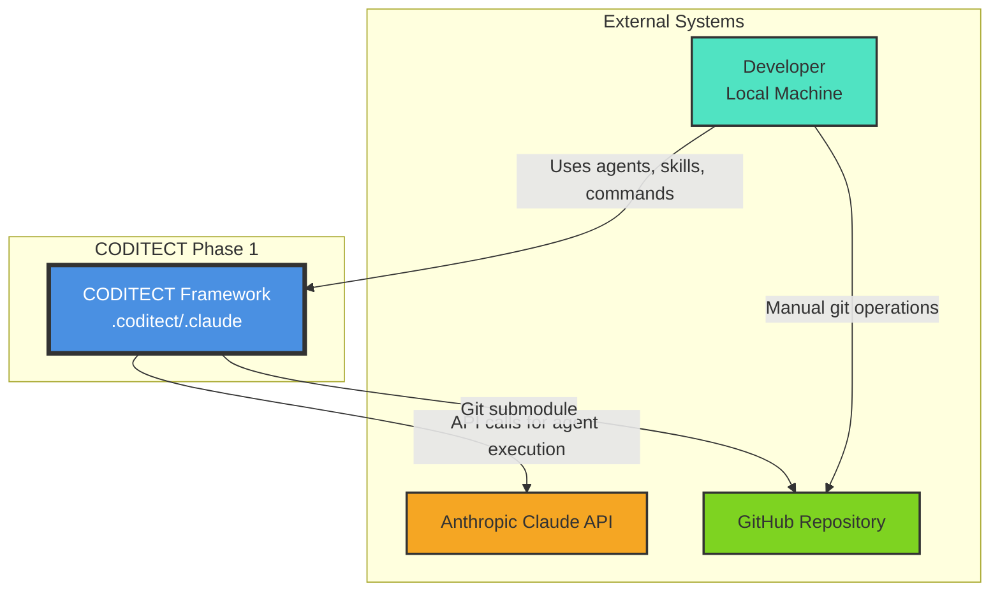

# Phase 1 - System Context Diagram

**Diagram Type:** C1 - System Context
**Phase:** 1 - .coditect/.claude Framework
**Status:** ✅ Active
**Last Updated:** 2025-11-20

## Introduction

This diagram provides the **highest-level view** of the CODITECT Phase 1 architecture, showing how developers interact with the local .coditect framework and its external dependencies. This is the foundation of the CODITECT platform - a git-based framework that brings 50+ specialized AI agents to local development environments.

**Key Insight:** Phase 1 is entirely local - no central server, no authentication, no tracking. Just a developer, their API key, and a powerful AI agent framework.

## What This Diagram Shows

- **Who uses the system:** Developers working on local machines
- **What the system is:** CODITECT Framework (.coditect/.claude directory)
- **External dependencies:** Anthropic Claude API, GitHub repositories
- **Key interactions:** How agents are invoked, how code is managed

## Key Elements

### Users

**Developer (Local Machine)**
- Primary user of the CODITECT framework
- Has direct access to 50 AI agents, 75 slash commands, 18+ skills
- Uses their own Anthropic API key (no centralized auth)
- Manually manages git operations and project structure

### Systems

**CODITECT Framework (.coditect/.claude)**
- Core intelligence directory containing all agents, skills, and commands
- Distributed via git submodule pattern
- Symlinked as `.claude` for Claude Code compatibility
- Single source of truth for all AI capabilities

**Anthropic Claude API**
- External LLM service (claude-sonnet-4-5)
- Executes all agent reasoning and code generation
- Accessed via user's personal API key
- No CODITECT-managed authentication layer

**GitHub Repository**
- Version control for CODITECT framework
- Distributed as git submodule to user projects
- Manual git operations (no automation yet)
- User manages pulls, updates, and commits

## Detailed Explanation

### Distributed Intelligence Architecture

Phase 1 implements a **distributed intelligence pattern** where every project gets a complete copy of the CODITECT framework via git submodules. This creates several advantages:

1. **Zero Dependencies:** No central server needed - completely offline capable (except for Claude API)
2. **Version Control:** Framework updates distributed via git (users pull when ready)
3. **Autonomy:** Each project operates independently with full agent access
4. **Resilience:** No single point of failure (no central server to go down)

### Symlink Chain Pattern

Every CODITECT project implements this pattern:
```
project-root/
├── .coditect/  → submodules/core/coditect-core/
└── .claude/    → .coditect/
```

This enables:
- **Claude Code Compatibility:** Official Claude Code CLI recognizes `.claude/` directory
- **Distributed Access:** Every submodule can resolve to master brain
- **Autonomous Operation:** Agents work at any level of project hierarchy

### Interaction Flows

**Agent Invocation Flow:**
1. Developer uses Claude Code CLI with Task Tool Proxy pattern
2. Request: "Use rust-expert-developer subagent to implement authentication"
3. CODITECT Framework dispatches to appropriate agent
4. Agent makes API call to Anthropic Claude using developer's key
5. Response returned to developer

**Manual Operations:**
- Git operations (clone, pull, commit, push) are manual
- API key management is manual (stored in ~/.anthropic/api_key)
- No usage tracking or analytics
- No session management (context lost between sessions, mitigated by MEMORY-CONTEXT)

## Architecture Patterns

### Pattern 1: Git Submodule Distribution
**Decision:** Use git submodules instead of npm/pip packages
**Rationale:**
- Keeps agents as editable markdown files (not compiled code)
- Enables rapid iteration and customization
- Familiar to developers (standard git workflow)
- No package manager dependencies

### Pattern 2: Symlink-Based Access
**Decision:** Use filesystem symlinks instead of path configuration
**Rationale:**
- Zero configuration required
- Works across macOS/Linux (Windows requires special handling)
- Transparent to users (agents "just work")
- Compatible with Claude Code's `.claude/` convention

### Pattern 3: User-Managed API Keys
**Decision:** No centralized authentication in Phase 1
**Rationale:**
- Reduces complexity (no auth server needed)
- Users already have Anthropic accounts
- Privacy-preserving (no CODITECT knows what you're building)
- Faster time to value (no signup flow)

## Limitations & Future Evolution

### Phase 1 Limitations

❌ **No Inter-Agent Communication**
- Agents cannot invoke each other
- Human must copy/paste between agent outputs
- Blocks autonomous multi-agent workflows

❌ **No Session Persistence**
- Context lost between Claude Code sessions
- Mitigated by MEMORY-CONTEXT system (manual export)
- No automatic continuity

❌ **No Usage Analytics**
- No visibility into what agents are used
- No telemetry for improvement
- Can't identify popular workflows

❌ **Manual Git Operations**
- User must manually pull framework updates
- No automatic versioning
- Risk of version drift across projects

### Evolution to Phase 2

Phase 2 (IDE in Cloud) adds:
- ✅ Browser-based access (no local setup)
- ✅ Centralized hosting (GKE deployment)
- ✅ Persistent workspaces
- ✅ Eclipse Theia IDE
- ✅ Extension marketplace

Phase 2 keeps the Phase 1 framework but adds cloud infrastructure.

## Technical Details

### Framework Statistics
- **AI Agents:** 50 specialized agents
- **Slash Commands:** 75 workflow commands
- **Production Skills:** 18+ automation skills
- **Training Materials:** 13 documents, 55,000+ words
- **Orchestration Modules:** 8 Python modules
- **Memory Context:** 6,400+ messages stored

### Supported Platforms
- ✅ macOS (native symlink support)
- ✅ Linux (native symlink support)
- ⚠️ Windows (requires Developer Mode for symlinks)

### Technology Stack
- **Agent Runtime:** Claude Code CLI (Anthropic)
- **LLM Model:** claude-sonnet-4-5
- **Version Control:** Git (submodules)
- **Filesystem:** Symlinks for directory structure
- **Documentation:** Markdown files

## Diagram



## Related Documentation

- **Phase Overview:** [README.md](README.md)
- **Container Diagram:** [phase1-c2-container.md](phase1-c2-container.md)
- **Component Diagram:** [phase1-c3-agent-execution.md](phase1-c3-agent-execution.md)
- **Architecture Evolution:** [../../docs/CODITECT-C4-ARCHITECTURE-EVOLUTION.md](../../docs/CODITECT-C4-ARCHITECTURE-EVOLUTION.md)
- **What is CODITECT:** [WHAT-IS-CODITECT.md](https://github.com/coditect-ai/coditect-core/blob/main/WHAT-IS-CODITECT.md)

---

**Maintained By:** AZ1.AI CODITECT Team
**Repository:** https://github.com/coditect-ai/coditect-rollout-master
**Framework:** https://github.com/coditect-ai/coditect-core
