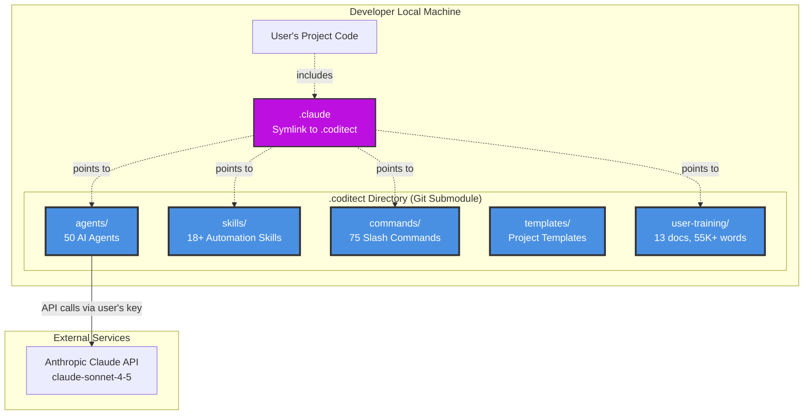

# Phase 1 - Container Diagram

**Diagram Type:** C2 - Container
**Phase:** 1 - .coditect/.claude Framework
**Status:** ✅ Active
**Last Updated:** 2025-11-20

## Introduction

This diagram shows the **internal structure** of the `.coditect` directory - the brain of the CODITECT framework. It reveals the major containers (directories) that make up the framework and how they interact with the developer's project code and external services.

**Key Insight:** The `.coditect` directory is a self-contained AI agent platform - 50 agents, 75 commands, 18+ skills, and comprehensive training materials, all in one git submodule.

## What This Diagram Shows

- **Internal structure:** The 5 core containers inside `.coditect/`
- **Symlink pattern:** How `.claude` symlink enables Claude Code compatibility
- **Integration:** How user projects access framework capabilities
- **External dependency:** Single connection to Anthropic Claude API

## Key Elements

### Core Containers

**1. agents/ Directory (50 AI Agents)**

Specialized AI agents organized by domain:
- **Orchestrator (1):** Multi-agent coordination
- **Analysis Specialists (12):** Code analysis, architecture review, security audits
- **Locators (4):** File discovery, pattern finding, codebase navigation
- **Development (8):** Language specialists (Rust, TypeScript, React, Python)
- **Research (6):** Web search, market analysis, competitive intelligence
- **Business (3):** Business intelligence, VC analysis, curriculum development
- **Cloud/DevOps (6):** GCP, Kubernetes, cloud architecture, deployment automation
- **Quality (10):** Testing, QA, documentation, security specialists

Each agent is a markdown file with:
- Specialized system prompt
- Domain-specific knowledge
- Tool access permissions
- Example invocations

**2. skills/ Directory (18+ Automation Skills)**

Production-ready automation workflows:
- `ai-curriculum-development` - Educational content generation
- `build-deploy-workflow` - Automated GCP deployment
- `code-editor` - Multi-file code modification
- `foundationdb-queries` - Database patterns and queries
- `google-cloud-build` - Cloud Build orchestration
- `multi-agent-workflow` - Agent coordination patterns
- `rust-backend-patterns` - Actix-web production patterns
- `framework-patterns` - FSM, event-driven, reactive patterns
- `production-patterns` - Circuit breakers, observability, fault tolerance

**3. commands/ Directory (75 Slash Commands)**

Workflow commands for Claude Code:
- `/implement` - Production-ready implementation with error handling
- `/analyze` - Code quality and architecture review
- `/document` - API docs, architecture diagrams, runbooks
- `/strategy` - Architectural planning and ADRs
- `/deliberation` - Pure planning mode (no execution)
- `/research` - Verification and technical validation
- `/prototype` - Rapid proof-of-concept development
- `/optimize` - Performance analysis and improvements

**4. templates/ Directory (Project Templates)**

Initialization templates for new projects:
- Full-stack SaaS starter
- Rust backend service
- React frontend app
- Documentation sites
- Multi-repo orchestration

**5. user-training/ Directory (13 Docs, 55K+ Words)**

Comprehensive training materials:
- `1-2-3-CODITECT-ONBOARDING-GUIDE.md` - Quick start guide
- `CODITECT-OPERATOR-TRAINING-SYSTEM.md` - Full certification program
- `CODITECT-OPERATOR-ASSESSMENTS.md` - Skill verification tests
- `live-demo-scripts/` - Step-by-step orchestrated demos
- `sample-project-templates/` - Real-world examples
- Training covers: environment setup, Task Tool Pattern, business discovery, technical specs, project management

### Integration Layer

**.claude Symlink**

Critical compatibility layer:
- Symlink pointing to `.coditect/` directory
- Enables Claude Code CLI recognition
- Provides transparent access to all framework capabilities
- Standard pattern across all CODITECT projects

**User's Project Code**

Developer's actual application:
- Includes `.claude` symlink for framework access
- Contains MEMORY-CONTEXT for session persistence
- Has project-specific configurations
- Managed independently from framework

## Detailed Explanation

### Directory Structure Deep Dive

The `.coditect` directory implements a **modular architecture** with clear separation of concerns:

```
.coditect/
├── agents/                      # Who does the work
├── skills/                      # How to do complex tasks
├── commands/                    # What workflows to execute
├── templates/                   # Starting points for new work
├── user-training/               # How to use the system
├── orchestration/               # Python coordination modules
├── scripts/                     # Automation utilities
├── MEMORY-CONTEXT/              # Persistent AI memory
└── docs/                        # Architecture and research
```

### Symlink Chain Explained

**Pattern:**
```
project-root/
├── .coditect/  → submodules/core/coditect-core/
└── .claude/    → .coditect/
```

**Why This Works:**
1. Git submodule pulls `coditect-core` repository
2. Symlink `.coditect` points to submodule location
3. Symlink `.claude` points to `.coditect` (Claude Code compatibility)
4. Claude Code CLI reads `.claude/agents/` and finds all 50 agents

**Benefits:**
- ✅ Zero configuration (symlinks are one-time setup)
- ✅ Framework updates via `git submodule update --remote`
- ✅ Works at any depth in project hierarchy
- ✅ Compatible with both `.coditect` and `.claude` conventions

### Agent Invocation Pattern

**Task Tool Proxy Pattern (Only Working Method):**
```python
# Correct invocation
Task(
  subagent_type="general-purpose",
  prompt="Use rust-expert-developer subagent to implement JWT authentication"
)
```

**Why Proxy Required:**
- Direct invocation doesn't work (just prompts base Claude)
- Task tool actually spawns specialized agent subprocess
- Agent has access to specialized knowledge and tools
- Response quality significantly higher than base Claude

### API Key Flow

**User Authentication:**
1. Developer sets up Anthropic API key locally
2. Key stored in `~/.anthropic/api_key` or environment variable
3. Claude Code CLI reads key automatically
4. All agent API calls use developer's personal key

**No Centralized Auth:**
- No CODITECT authentication server
- No user accounts or login
- No tracking of API usage
- Privacy-preserving (CODITECT doesn't see requests)

## Architecture Patterns

### Pattern 1: Single Responsibility Directories
**Decision:** One container per concern (agents, skills, commands)
**Rationale:**
- Clear separation makes framework easier to navigate
- Developers can find capabilities quickly
- Enables independent evolution of each container
- Supports modular testing and validation

### Pattern 2: Markdown-Based Agent Definitions
**Decision:** Agents as `.md` files, not code
**Rationale:**
- Human-readable and editable
- No compilation or build step required
- Version control friendly (clear diffs)
- Easy to customize for specific projects
- Fast iteration (edit prompt, test immediately)

### Pattern 3: Git Submodule Distribution
**Decision:** Framework distributed via git, not package managers
**Rationale:**
- Keeps entire framework visible and editable
- No "black box" abstractions
- Standard developer workflow (git pull to update)
- Works across all languages and platforms
- Enables forking and customization

## Container Interactions

### Local Development Flow

```
Developer writes code
    ↓
Needs AI assistance
    ↓
Invokes Claude Code CLI
    ↓
CLI reads .claude/ symlink
    ↓
Resolves to .coditect/ directory
    ↓
Loads appropriate agent/skill/command
    ↓
Agent makes API call to Anthropic (developer's key)
    ↓
Response returned to developer
    ↓
Developer continues work
```

### Framework Update Flow

```
CODITECT team publishes update to coditect-core repo
    ↓
Developer runs: git submodule update --remote
    ↓
Local .coditect/ directory updates to latest commit
    ↓
New agents/skills/commands immediately available
    ↓
No restart or rebuild required
```

## Technical Details

### Container Sizes
- **agents/**: 50 files (~300 KB)
- **skills/**: 18 files (~200 KB)
- **commands/**: 75 files (~150 KB)
- **templates/**: 10+ files (~500 KB)
- **user-training/**: 13 files (~500 KB)
- **Total**: ~1.5 MB (lightweight!)

### Dependencies
- **Runtime:** Claude Code CLI (official Anthropic tool)
- **External Services:** Anthropic Claude API only
- **Filesystem:** Symlink support (macOS/Linux native, Windows Developer Mode)
- **Version Control:** Git (no special plugins)

### Customization Points

Developers can customize:
1. **Local Agent Overrides**: Create project-specific agents in local `.coditect/`
2. **Skill Extensions**: Add custom skills for domain-specific workflows
3. **Command Aliases**: Create shortcuts for frequently used commands
4. **Templates**: Modify initialization templates for team standards

## Limitations & Future Evolution

### Current Limitations

❌ **Static Framework**
- Updates require manual git pull
- No automatic update notifications
- Risk of version drift across projects

❌ **No Collaboration Features**
- Agents don't share context between team members
- Each developer has isolated framework instance
- No shared memory or learnings

❌ **Limited Observability**
- No usage analytics
- Can't identify popular agents/workflows
- No performance metrics

### Phase 2 Additions

Phase 2 (IDE in Cloud) adds:
- ✅ Centralized framework hosting
- ✅ Automatic updates (no manual git pull)
- ✅ Persistent workspace storage
- ✅ Team collaboration features
- ✅ Usage analytics dashboard

## Diagram



## Related Documentation

- **Phase Overview:** [README.md](README.md)
- **System Context:** [phase1-c1-system-context.md](phase1-c1-system-context.md)
- **Component Diagram:** [phase1-c3-agent-execution.md](phase1-c3-agent-execution.md)
- **Agent Index:** [../../.coditect/AGENT-INDEX.md](../../.coditect/AGENT-INDEX.md)
- **Skills Catalog:** [../../.coditect/skills/README.md](../../.coditect/skills/README.md)

---

**Maintained By:** AZ1.AI CODITECT Team
**Repository:** https://github.com/coditect-ai/coditect-rollout-master
**Framework:** https://github.com/coditect-ai/coditect-core
