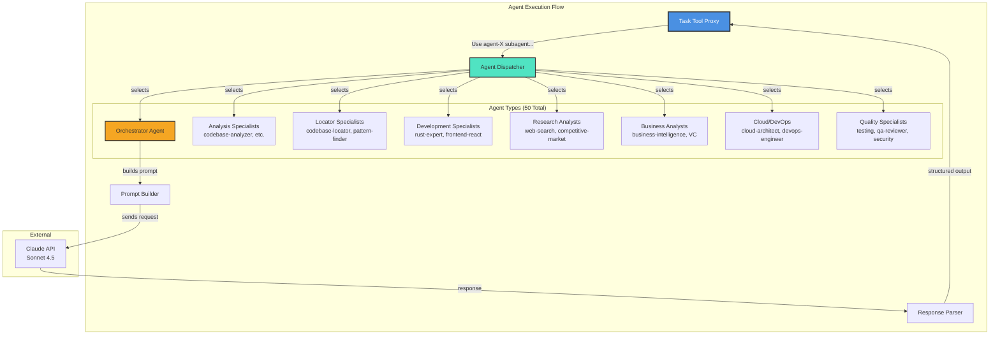

# Phase 1 - Component Diagram: Agent Execution

**Diagram Type:** C3 - Component
**Phase:** 1 - .coditect/.claude Framework
**Status:** ✅ Active
**Last Updated:** 2025-11-20

## Introduction

This diagram shows **how agents are discovered, dispatched, and executed** within the CODITECT framework. It reveals the internal component architecture that enables 50 specialized agents to be invoked through a single Task Tool Proxy interface.

**Key Insight:** Agent specialization is achieved through intelligent dispatching - the same API endpoint routes to 50 different specialized agents based on request content.

## What This Diagram Shows

- **Execution pipeline:** From user request to agent response
- **Agent categories:** 8 categories of specialized agents
- **Component responsibilities:** Proxy, dispatcher, prompt builder, parser
- **API integration:** Connection to Anthropic Claude API

## Key Components

### Integration Layer

**Task Tool Proxy**

Entry point for all agent invocations:
- **Purpose:** Claude Code CLI integration point
- **Interface:** Task tool in Claude Code
- **Input:** Natural language request with agent specification
- **Example:** `"Use rust-expert-developer subagent to implement JWT auth"`
- **Critical:** Only working method to invoke specialized agents (direct prompting doesn't work)

**Why Proxy Required:**
- Direct natural language doesn't spawn specialized agents
- Proxy creates actual subprocess with specialized context
- Enables access to agent-specific tools and knowledge
- Provides quality differentiation vs. base Claude

### Orchestration Components

**Agent Dispatcher**

Intelligent routing component:
- **Responsibility:** Select appropriate specialized agent
- **Input:** User request with agent name or intent
- **Logic:** Pattern matching on agent names and capabilities
- **Output:** Selected agent definition (markdown file)
- **Fallback:** General-purpose agent if no match found

**Dispatch Strategies:**
1. **Explicit:** User specifies agent name (`rust-expert-developer`)
2. **Intent-Based:** User describes need, dispatcher selects best agent
3. **Workflow-Based:** Slash command determines agent sequence
4. **Orchestrator:** Multi-agent coordination for complex tasks

**Prompt Builder**

Context construction component:
- **Responsibility:** Build agent-specific prompts with context
- **Inputs:**
  - Agent definition (system prompt, capabilities)
  - User request
  - Project context (files, structure, MEMORY-CONTEXT)
  - Tool permissions
- **Output:** Complete prompt for LLM API call
- **Optimization:** Token budget management, context prioritization

**Response Parser**

Output processing component:
- **Responsibility:** Extract structured data from LLM responses
- **Capabilities:**
  - Parse tool use (Read, Write, Edit, Bash, etc.)
  - Extract decisions and recommendations
  - Format output for user display
  - Handle errors and retries
- **Output:** Structured response to Task Tool Proxy

### Agent Categories (50 Total)

**1. Orchestrator Agent (1)**
- `orchestrator` - Multi-agent coordination planner
- **Capability:** Breaks down complex tasks into agent assignments
- **Use Case:** Features requiring multiple specialized agents
- **Example:** "Build full authentication system" → assigns backend, frontend, security, testing agents

**2. Analysis Specialists (12)**
- `codebase-analyzer` - Technical implementation analysis
- `thoughts-analyzer` - Research document analysis
- `script-utility-analyzer` - Shell script evaluation
- `coditect-adr-specialist` - ADR compliance validation
- `adr-compliance-specialist` - Architecture decision enforcement
- `novelty-detection-specialist` - Novel situation assessment
- `cloud-architect-code-reviewer` - Cloud architecture review
- `orchestrator-code-review` - Multi-agent code review coordination
- And 4 more...

**3. Locator Specialists (4)**
- `codebase-locator` - File and component discovery
- `thoughts-locator` - Research document discovery
- `codebase-pattern-finder` - Usage examples and patterns
- `Explore` (specialized) - Fast codebase exploration

**4. Development Specialists (8)**
- `rust-expert-developer` - Production Rust systems
- `frontend-react-typescript-expert` - React 18 + TypeScript
- `senior-architect` - System design and full-stack
- `actix-web-specialist` - Actix web framework specialist
- `websocket-protocol-designer` - Real-time communication
- `wasm-optimization-expert` - WebAssembly performance
- `terminal-integration-specialist` - WASM + WebSocket + K8s
- `prompt-analyzer-specialist` - AI prompt analysis platform

**5. Research Analysts (6)**
- `research-agent` - Technical research and library comparison
- `web-search-researcher` - Competitive intelligence and market analysis
- `competitive-market-analyst` - Market research execution
- `business-intelligence-analyst` - Strategic decision support
- `venture-capital-business-analyst` - VC and financial modeling
- `ai-specialist` - Multi-provider AI routing

**6. Business Analysts (3)**
- `business-intelligence-analyst` - Market analysis and strategy
- `venture-capital-business-analyst` - Investment readiness assessment
- `ai-curriculum-specialist` - Educational curriculum development

**7. Cloud/DevOps (6)**
- `cloud-architect` - GCP deployment and infrastructure
- `devops-engineer` - CI/CD and automation
- `codi-devops-engineer` - CODITECT-specific DevOps
- `k8s-statefulset-specialist` - Kubernetes StatefulSets
- `database-architect` - SQL/NoSQL design
- `foundationdb-expert` - FoundationDB operations

**8. Quality Specialists (10)**
- `testing-specialist` - TDD and quality gates
- `codi-test-engineer` - Test automation infrastructure
- `codi-qa-specialist` - Quality assurance strategies
- `qa-reviewer` - Documentation quality validation
- `codi-documentation-writer` - Technical documentation
- `rust-qa-specialist` - Rust quality assurance
- `security-specialist` - Enterprise security architecture
- `monitoring-specialist` - Observability and monitoring
- `skill-quality-enhancer` - Skill evaluation and improvement
- `multi-tenant-architect` - Multi-tenant architecture specialist

## Detailed Explanation

### Agent Execution Flow

**Step-by-Step Process:**

```
1. User invokes Task tool
   ↓
2. Task Tool Proxy receives request
   Input: "Use rust-expert-developer subagent to implement JWT authentication"
   ↓
3. Agent Dispatcher analyzes request
   Pattern match: "rust-expert-developer" → Found in Development Specialists
   ↓
4. Load agent definition
   File: .coditect/agents/rust-expert-developer.md
   Read: System prompt, capabilities, tool access
   ↓
5. Prompt Builder constructs full prompt
   Components:
   - Agent system prompt (Rust expertise)
   - User request (JWT authentication)
   - Project context (existing code, MEMORY-CONTEXT)
   - Tool permissions (Read, Write, Edit, Bash, etc.)
   ↓
6. API call to Claude
   Model: claude-sonnet-4-5
   Prompt: Complete context + request
   ↓
7. LLM generates response
   Output: Code, explanations, tool uses
   ↓
8. Response Parser processes output
   Extract: Tool calls, decisions, recommendations
   ↓
9. Return to user
   Format: Structured output with code, explanations
```

### Specialization Through System Prompts

Each agent has a specialized system prompt defining:

**Rust Expert Developer Example:**
```markdown
You are a Rust expert specializing in:
- Production-grade Rust systems
- Async patterns (Tokio, async-std)
- Memory safety and ownership
- Actix-web framework
- Database integration (SQLx, Diesel)
- Error handling (thiserror, anyhow)

Tools available: Read, Write, Edit, Bash, Grep, Glob
Quality standards: Production-ready, tested, documented
Architectural patterns: Actor model, async services, repository pattern
```

This specialized context produces dramatically better results than base Claude.

### Agent Selection Strategies

**1. Explicit Agent Selection (Recommended)**
```python
Task(
  subagent_type="general-purpose",
  prompt="Use rust-expert-developer subagent to implement JWT authentication"
)
```

**2. Intent-Based Selection**
```python
Task(
  subagent_type="general-purpose",
  prompt="I need to analyze our codebase architecture and find anti-patterns"
)
# Dispatcher auto-selects: codebase-analyzer
```

**3. Orchestrator Delegation**
```python
Task(
  subagent_type="orchestrator",
  prompt="Build complete user authentication system with frontend, backend, tests"
)
# Orchestrator breaks down and assigns:
# - rust-expert-developer (backend)
# - frontend-react-typescript-expert (UI)
# - testing-specialist (tests)
# - security-specialist (review)
```

### Context Enrichment

**Prompt Builder adds:**
1. **File Context:** Recently modified files, current file
2. **Project Context:** README, CLAUDE.md, PROJECT-PLAN.md
3. **Memory Context:** Previous session exports, decisions (ADRs)
4. **Dependencies:** package.json, Cargo.toml, requirements.txt
5. **Git Context:** Current branch, recent commits, changes

This creates a comprehensive understanding for the agent.

## Architecture Patterns

### Pattern 1: Single Entry Point, Multiple Specialists
**Decision:** One Task Tool Proxy for all 50 agents
**Rationale:**
- Simplifies user interface (one invocation pattern)
- Enables intelligent routing
- Supports agent discovery and recommendation
- Reduces cognitive load (don't need to remember 50 different tools)

### Pattern 2: Markdown-Based Agent Definitions
**Decision:** Agents as markdown files, not compiled code
**Rationale:**
- Human-readable and auditable
- Fast iteration (edit prompt, test immediately)
- Version control friendly
- Easy customization for specific projects
- No compilation or build step

### Pattern 3: Stateless Agent Execution
**Decision:** Each agent invocation is independent
**Rationale:**
- Simpler architecture (no session management)
- Prevents context pollution across requests
- Enables parallel agent execution
- Mitigated by MEMORY-CONTEXT system for continuity

## Performance Characteristics

### Agent Dispatch Latency
- **Pattern Matching:** <10ms (local file lookup)
- **Prompt Building:** 50-200ms (file reads, context gathering)
- **API Call:** 2-10 seconds (Anthropic Claude latency)
- **Response Parsing:** <50ms (structured output extraction)
- **Total:** ~2-10 seconds (dominated by LLM latency)

### Token Usage Optimization
- **Agent Prompts:** 500-2,000 tokens (specialized system prompt)
- **Project Context:** 1,000-5,000 tokens (files, structure, memory)
- **User Request:** 50-500 tokens
- **Total Input:** 1,500-7,500 tokens
- **Response:** 500-4,000 tokens (varies by task complexity)

**Optimization Strategies:**
- Selective context loading (only relevant files)
- Token budget enforcement (truncate if needed)
- Cached system prompts (reuse across requests)
- Smart MEMORY-CONTEXT retrieval (most relevant sessions)

## Limitations & Future Evolution

### Current Limitations

❌ **No Inter-Agent Communication**
- Agents can't directly invoke each other
- Human must copy/paste orchestrator recommendations
- Blocks fully autonomous multi-agent workflows
- **Critical blocker** for Phase 6 (Multi-Agent Orchestration)

❌ **Sequential Execution Only**
- Can't run agents in parallel
- Each agent waits for previous to complete
- No task queue or job management

❌ **No Agent Discovery Service**
- No centralized registry of agent capabilities
- Can't query "which agent handles authentication?"
- Limited to pattern matching on names

❌ **No Circuit Breaker or Retry Logic**
- API failures stop execution
- No automatic retry with exponential backoff
- No fallback to alternative agents

### Phase 6 Evolution (Multi-Agent Orchestration)

**Critical additions for autonomous operation:**

✅ **Message Bus (RabbitMQ)**
- Enables inter-agent task passing
- Priority queues for urgent tasks
- Persistent messages (survive restarts)

✅ **Agent Discovery Service (Redis)**
- Capability-based agent lookup
- Load balancing across agent instances
- Health checks and automatic failover

✅ **Task Queue Manager (Redis + RQ)**
- Dependency resolution
- Automatic task unblocking
- Progress tracking and checkpoints

✅ **Circuit Breaker Service**
- Automatic failure detection
- Fallback strategies
- Gradual recovery

See: [Phase 6 Orchestration Diagrams](../phase-6-orchestration/README.md)

## Diagram



## Related Documentation

- **Phase Overview:** [README.md](README.md)
- **System Context:** [phase1-c1-system-context.md](phase1-c1-system-context.md)
- **Container Diagram:** [phase1-c2-container.md](phase1-c2-container.md)
- **Agent Index:** [../../.coditect/AGENT-INDEX.md](../../.coditect/AGENT-INDEX.md)
- **Phase 6 Orchestration:** [../phase-6-orchestration/README.md](../phase-6-orchestration/README.md)

---

**Maintained By:** AZ1.AI CODITECT Team
**Repository:** https://github.com/coditect-ai/coditect-rollout-master
**Framework:** https://github.com/coditect-ai/coditect-core
