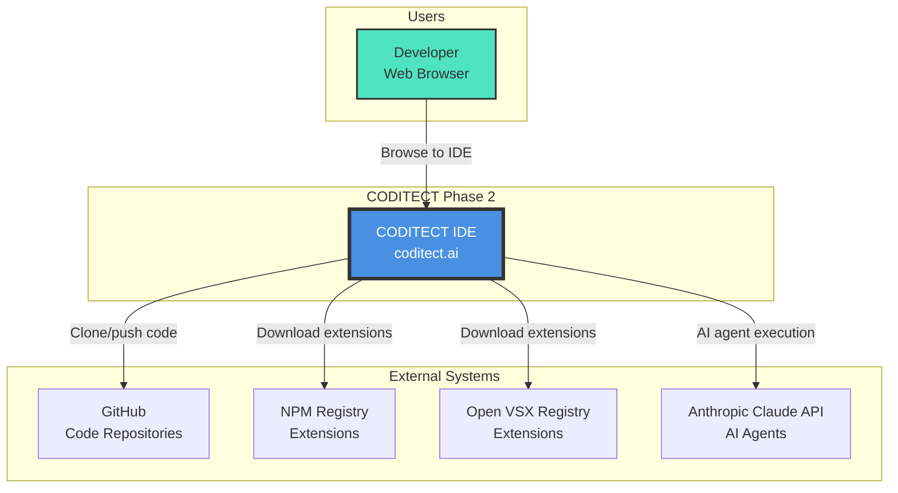

# Phase 2 - System Context Diagram

**Diagram Type:** C1 - System Context
**Phase:** 2 - IDE in the Cloud
**Status:** ✅ Production (coditect.ai)
**Last Updated:** 2025-11-20

## Introduction

This diagram shows the **highest-level view of Phase 2** - the CODITECT Cloud IDE, a production browser-based development environment accessible at https://coditect.ai. Phase 2 transforms the local-only Phase 1 framework into a fully cloud-hosted IDE combining React 18 frontend, Eclipse Theia 1.65, and Rust/Actix-web backend on Google Kubernetes Engine.

**Key Insight:** Phase 2 eliminates local setup entirely. Developers now access a complete IDE, AI agents, and development tools directly in their browser with zero installation required.

## What This Diagram Shows

- **Who uses the system:** Developers accessing via web browser (no local install)
- **What the system is:** CODITECT Cloud IDE at coditect.ai (GKE deployment)
- **External dependencies:** GitHub, NPM/Open VSX registries, Anthropic Claude API
- **Key interactions:** Browser-based IDE access, git integration, extension marketplace, AI agent execution

## Key Elements

### Users

**Developer (Web Browser)**
- Accesses IDE through any modern web browser (Chrome, Firefox, Safari, Edge)
- No local installation or configuration required
- Works from any device with internet connection (desktop, laptop, tablet)
- Requires only an Anthropic API key for AI agent access (JWT auth for IDE access)
- Full IDE features available: code editing, terminal, git, extensions, AI agents

### Systems

**CODITECT IDE (coditect.ai)**
- Production cloud-hosted IDE deployed on Google Kubernetes Engine
- External IP: 34.8.51.57 behind Cloud Load Balancer
- 3 StatefulSet pods with hybrid storage (45 GB total across all pods)
- React 18 frontend (28 pages) + Eclipse Theia 1.65 IDE + Rust/Actix backend
- 20+ VS Code extensions pre-installed
- Monaco editor with 100+ language support
- xterm.js 5.3 for terminal access
- Built from 32 production builds (latest: 2025-10-29)

**GitHub (Code Repositories)**
- External git service for code version control
- Users clone, commit, push via Theia's integrated Git Service
- No manual git CLI commands required (git operations built into IDE)
- Supports SSH and HTTPS authentication
- Works with public and private repositories

**NPM Registry & Open VSX Registry**
- External extension marketplaces
- 20+ VS Code extensions available in IDE
- ESLint, Prettier, GitLens, and other popular extensions
- Extensions downloaded and installed via Extension Manager
- Auto-updates for installed extensions

**Anthropic Claude API**
- External LLM service powering AI agents
- Same 50 agents from Phase 1 framework (.coditect directory)
- Accessed via user's personal API key
- Executes agent reasoning, code generation, analysis
- Model: claude-sonnet-4-5

## Detailed Explanation

### Cloud-Native Architecture

Phase 2 moves from local development to **cloud-native infrastructure** with several key architectural changes:

1. **Browser-Based Access:** Complete IDE runs in browser (React + Theia)
2. **Persistent Workspaces:** User files survive session restarts (10 GB per pod)
3. **Multi-Tenant Deployment:** 3 pods serve multiple users with isolated workspaces
4. **Extension Marketplace:** 20+ VS Code extensions available for installation
5. **Integrated Git:** Clone, commit, push without leaving browser
6. **Terminal Access:** Full shell access via xterm.js in browser

### Production Deployment Details

**Current Configuration (Build #32):**
```
URL: https://coditect.ai
IP: 34.8.51.57
GKE Cluster: coditect-production
Pods: 3 (StatefulSet: coditect-combined-hybrid)
Storage: 45 GB (15 GB per pod: 10 GB workspace + 5 GB config)
Backend: 3 Rust/Actix pods
Database: FoundationDB (3 coordinators + 2 proxies)
CI/CD: Cloud Build
Status: ✅ Stable and operational
```

**Hybrid Storage Optimization:**
Phase 2 achieved **75% storage cost reduction** through hybrid optimization:
- **Before:** 180 GB (60 GB × 3 pods) = $551.15/year
- **After:** 45 GB (15 GB × 3 pods) = $259.55/year
- **Savings:** $291.60/year

### Interaction Flows

**Developer Access Flow:**
1. Developer browses to https://coditect.ai
2. Cloud Load Balancer routes to available pod
3. React frontend loads in browser
4. User logs in (basic JWT authentication)
5. Theia IDE initializes in browser
6. Developer has full IDE access (editor, terminal, extensions, git)

**Git Integration Flow:**
1. Developer uses Theia Git Service (UI-based)
2. Clone repository from GitHub (HTTPS or SSH)
3. Make changes in Monaco editor
4. Commit changes via Theia UI
5. Push to GitHub (credentials handled by Git Service)
6. No manual git CLI commands required

**Extension Installation Flow:**
1. Developer opens Extension Manager in Theia
2. Browse available extensions (NPM/Open VSX)
3. One-click install (e.g., ESLint, Prettier)
4. Extension activates in current workspace
5. Extension settings persist to Config PVC

**AI Agent Execution Flow:**
1. Developer invokes agent via Task Tool Proxy pattern
2. Request routed to Rust backend API
3. Backend makes API call to Anthropic Claude (user's API key)
4. Agent response returned to frontend
5. Developer sees agent output in IDE

### Comparison: Phase 1 → Phase 2

| Aspect | Phase 1 (Local) | Phase 2 (Cloud) |
|--------|-----------------|-----------------|
| **Access** | Local machine only | Any browser, any device |
| **Setup** | Git clone, symlink setup | Zero setup (just browse) |
| **IDE** | External (VS Code, etc.) | Built-in (Theia in browser) |
| **Storage** | Local filesystem | Cloud PVCs (10 GB workspace) |
| **Extensions** | Manually install | One-click from marketplace |
| **Git** | Manual CLI commands | Integrated UI (clone, commit, push) |
| **Terminal** | Local terminal | xterm.js in browser |
| **Sessions** | Local only | Persistent across devices |
| **Scale** | Single developer | 3 pods (multi-user capable) |

## Architecture Patterns

### Pattern 1: StatefulSet with Hybrid Storage
**Decision:** Use StatefulSet with per-pod PVCs (not shared storage)
**Rationale:**
- Persistent workspaces survive pod restarts
- Per-pod storage isolates user data
- Hybrid optimization: 75% cost reduction vs shared storage
- Each pod gets 10 GB workspace + 5 GB config
- SSD-backed for performance

### Pattern 2: Combined Frontend + IDE in Single Pod
**Decision:** Run React frontend + Theia IDE + NGINX in same pod
**Rationale:**
- Simplified routing (no cross-pod communication)
- Lower latency (all in-process)
- NGINX handles reverse proxy within pod
- Single container image for easier deployment
- Unified health checks

### Pattern 3: Separate Backend API Deployment
**Decision:** Rust backend as separate deployment (not in Theia pods)
**Rationale:**
- Independent scaling (backend scales differently than IDE)
- Stateless API (can scale horizontally)
- Better resource allocation (CPU-intensive backend separate from IDE)
- JWT authentication layer separate from IDE concerns
- FoundationDB session storage for multi-pod consistency

### Pattern 4: Extension Marketplace Integration
**Decision:** Integrate NPM + Open VSX registries (not custom marketplace)
**Rationale:**
- Leverage existing VS Code extension ecosystem
- No maintenance overhead for custom marketplace
- 20+ popular extensions available immediately
- Familiar extension model for VS Code users
- Open VSX provides open-source alternative to Microsoft marketplace

## Technical Details

### Technology Stack

**Frontend:**
- **React:** 18.2.0
- **TypeScript:** 5.3.3
- **Build Tool:** Vite 5.0.8
- **UI Library:** Chakra UI 2.8.2
- **Routing:** React Router 6.21.0
- **State Management:** Zustand 4.4.7, TanStack Query 5.17.9
- **Pages:** 28 routes

**IDE Framework:**
- **Eclipse Theia:** 1.65.0
- **Monaco Editor:** 0.45.0 (VS Code editor engine)
- **Terminal:** xterm.js 5.3.0
- **Extensions:** 20+ VS Code extensions (ESLint, Prettier, GitLens, etc.)
- **Language Support:** 100+ languages with syntax highlighting

**Backend:**
- **Language:** Rust 2021 edition
- **Framework:** Actix-web 4.4
- **Runtime:** Tokio 1.35 (async)
- **Auth:** jsonwebtoken 9.1 + argon2 0.4
- **Database:** FoundationDB 0.9 client

**Infrastructure:**
- **Platform:** Google Kubernetes Engine (GKE)
- **Ingress:** Cloud Load Balancer (external IP: 34.8.51.57)
- **Storage:** GCE Persistent Disk SSD (45 GB total)
- **CI/CD:** Cloud Build (32 production builds)
- **SSL:** Google-managed SSL certificates

### Deployment Statistics

| Metric | Value |
|--------|-------|
| **Live URL** | https://coditect.ai |
| **Build Number** | #32 (2025-10-29) |
| **StatefulSet Pods** | 3 (coditect-combined-hybrid) |
| **Backend API Pods** | 3 (Rust/Actix deployment) |
| **FoundationDB Nodes** | 5 (3 coordinators + 2 proxies) |
| **Total Storage** | 45 GB (15 GB per pod) |
| **Extensions Available** | 20+ VS Code extensions |
| **Frontend Pages** | 28 routes |
| **Languages Supported** | 100+ with syntax highlighting |
| **Cost Savings** | $291.60/year (75% storage reduction) |

## Limitations & Future Evolution

### Phase 2 Limitations

❌ **No Enhanced Authentication**
- Basic JWT authentication only
- No SSO, no OAuth providers, no 2FA
- Single-user sessions (no team collaboration)
- Phase 4 adds: Enterprise SSO, license management, user roles

❌ **No Usage Analytics**
- No visibility into extension usage
- No telemetry for IDE improvements
- No session duration tracking
- Phase 5 adds: Comprehensive analytics dashboard

❌ **No Activity Feed**
- IDE and Workflow Analyzer not integrated
- No cross-system task synchronization
- Phase 3/4 adds: Unified activity feed, workflow → IDE task flow

❌ **No Agent Marketplace**
- Only 50 built-in agents from Phase 1
- Cannot discover/install community agents
- Phase 5 adds: Agent marketplace with ratings, reviews, payments

❌ **No License Management**
- Open access (ungated)
- No tier enforcement (Free/Team/Enterprise)
- No quota management
- Phase 4 adds: License tiers, usage quotas, billing integration

❌ **No Multi-Session Coordination**
- Session state not synchronized across devices
- Opening IDE on different device = new session
- Phase 4 adds: Session management, cross-device state sync

### Evolution to Phase 3

Phase 3 (Workflow Analyzer Integration) adds:
- ✅ 8-agent workflow analysis platform (already deployed at workflow.coditect.ai)
- ✅ 9 export formats (Mermaid, PlantUML, BPMN, SVG, PDF, PNG, etc.)
- ✅ PostgreSQL storage for workflow persistence
- ✅ Redis caching for session data
- ⏳ IDE integration (future): tasks from Workflow Analyzer appear in IDE activity feed

Phase 3 is **already operational** as a separate deployment - full integration with IDE comes in Phase 4.

## Diagram



## Related Documentation

- **Phase 2 README:** [diagrams/phase-2-ide-cloud/README.md](README.md) - Complete Phase 2 overview
- **Container Diagram:** [phase2-c2-container.md](phase2-c2-container.md) - GKE deployment architecture
- **Component Diagram:** [phase2-c3-theia-ide.md](phase2-c3-theia-ide.md) - Eclipse Theia internal structure
- **Phase 1 Context:** [../phase-1-claude-framework/phase1-c1-system-context.md](../phase-1-claude-framework/phase1-c1-system-context.md) - Local framework baseline
- **Phase 3 Context:** [../phase-3-workflow-analyzer/phase3-c1-system-context.md](../phase-3-workflow-analyzer/phase3-c1-system-context.md) - Workflow Analyzer integration
- **Production Docs:** [coditect-cloud-ide repository](https://github.com/coditect-ai/coditect-cloud-ide) - Full codebase and deployment docs

---

**Status:** ✅ Production (Build #32)
**Maintained By:** AZ1.AI CODITECT Team
**Production URL:** https://coditect.ai
**Build Date:** 2025-10-29
