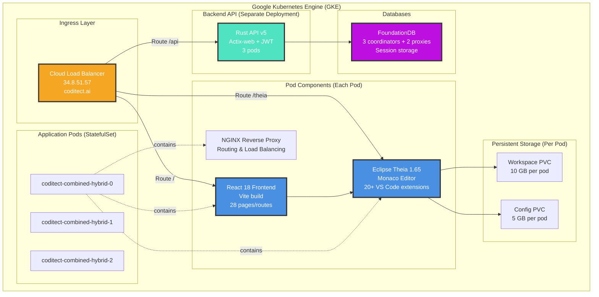

# Phase 2 - Container Diagram

**Diagram Type:** C2 - Container
**Phase:** 2 - IDE in the Cloud
**Status:** ✅ Production (coditect.ai)
**Last Updated:** 2025-11-20

## Introduction

This diagram shows the **container-level architecture** of the CODITECT Cloud IDE deployment on Google Kubernetes Engine. It reveals how the React frontend, Eclipse Theia IDE, Rust backend, and FoundationDB work together to deliver a production-grade browser-based development environment.

**Key Insight:** Phase 2 uses a **hybrid pod architecture** where each StatefulSet pod contains React frontend + Theia IDE + NGINX, while the Rust backend and FoundationDB run as separate deployments. This design optimizes for storage costs (75% reduction) while maintaining clear separation of concerns.

## What This Diagram Shows

- **Deployment topology:** 3 StatefulSet pods + 3 backend pods + 5 FoundationDB nodes
- **Networking:** Cloud Load Balancer routing to frontend/IDE/API
- **Storage:** Per-pod PVCs (10 GB workspace + 5 GB config)
- **Data persistence:** FoundationDB for session storage
- **Scaling strategy:** Horizontal pod autoscaling capability

## Key Elements

### Ingress Layer

**Cloud Load Balancer**
- **External IP:** 34.8.51.57
- **Domain:** coditect.ai (DNS A record)
- **SSL:** Google-managed SSL certificates
- **Routing:**
  - `/` → React frontend
  - `/theia` → Theia IDE
  - `/api` → Rust backend
- **Health Checks:** HTTP liveness probes on all pods
- **Session Affinity:** Sticky sessions for IDE connections

### Application Pods (StatefulSet)

**coditect-combined-hybrid-{0,1,2}**
- **Count:** 3 pods (StatefulSet for stable network identity)
- **Purpose:** Serve React frontend and Theia IDE to users
- **Components per pod:**
  - React 18 frontend (Vite build, 28 pages)
  - Eclipse Theia 1.65 IDE (Monaco editor, xterm.js)
  - NGINX reverse proxy (routing within pod)
- **Storage per pod:**
  - Workspace PVC: 10 GB SSD
  - Config PVC: 5 GB SSD
- **Resource Allocation:**
  - CPU: 2 cores per pod
  - Memory: 4 GB per pod
- **Scaling:** Manual scale (auto-scaling in Phase 7)

### Pod Components (Each Pod Contains)

**React 18 Frontend**
- **Build Tool:** Vite 5.0.8 (optimized production builds)
- **Routes:** 28 pages (dashboard, editor, settings, etc.)
- **UI Framework:** Chakra UI 2.8.2
- **State Management:** Zustand 4.4.7 + TanStack Query 5.17.9
- **Routing:** React Router 6.21.0
- **TypeScript:** 5.3.3 for type safety
- **Port:** 3000 (internal)

**Eclipse Theia 1.65**
- **Editor:** Monaco 0.45 (VS Code editor engine)
- **Terminal:** xterm.js 5.3.0
- **Extensions:** 20+ VS Code extensions
- **File Service:** CRUD operations on workspace PVC
- **Git Service:** Clone, commit, push operations
- **Terminal Service:** Shell spawning and management
- **Port:** 3001 (internal)

**NGINX Reverse Proxy**
- **Purpose:** Route requests within pod
- **Config:** nginx-combined.conf
- **Routes:**
  - `/` → React frontend (port 3000)
  - `/theia` → Theia IDE (port 3001)
- **Port:** 80 (exposed to load balancer)

### Persistent Storage (Per Pod)

**Workspace PVC (10 GB per pod)**
- **Mount Path:** `/home/theia/workspace`
- **Purpose:** User project files and code
- **Storage Class:** GCE Persistent Disk SSD
- **Access Mode:** ReadWriteOnce
- **Reclaim Policy:** Retain (data survives pod restarts)
- **Total Workspace Storage:** 30 GB (10 GB × 3 pods)

**Config PVC (5 GB per pod)**
- **Mount Path:** `/home/theia/.theia`
- **Purpose:** IDE settings, extensions, preferences
- **Storage Class:** GCE Persistent Disk SSD
- **Access Mode:** ReadWriteOnce
- **Reclaim Policy:** Retain
- **Total Config Storage:** 15 GB (5 GB × 3 pods)

### Backend API (Separate Deployment)

**Rust API v5**
- **Pods:** 3 replicas (stateless deployment)
- **Language:** Rust 2021 edition
- **Framework:** Actix-web 4.4
- **Runtime:** Tokio 1.35 (async I/O)
- **Authentication:** JWT tokens (jsonwebtoken 9.1)
- **Password Hashing:** argon2 0.4
- **Database Client:** FoundationDB 0.9
- **Endpoints:**
  - `/api/auth/login` - User login (JWT generation)
  - `/api/auth/register` - User registration
  - `/api/auth/validate` - Token validation
  - `/api/sessions` - Session CRUD
  - `/api/workspaces` - Workspace management
- **Port:** 8080 (internal)
- **Resource Allocation:**
  - CPU: 1 core per pod
  - Memory: 2 GB per pod
- **Scaling:** Horizontal Pod Autoscaler (HPA) based on CPU

### Databases

**FoundationDB**
- **Topology:** 3 coordinators + 2 proxies (5 nodes total)
- **Purpose:** Session storage and state persistence
- **Data Model:** Key-value store with ACID transactions
- **Consistency:** Serializable snapshot isolation
- **Replication:** 3x replication factor
- **Storage:** 50 GB SSD per node
- **Deployment:** StatefulSet for stable network identities
- **Clients:** Rust backend API (session queries)

## Detailed Explanation

### Hybrid Storage Architecture

Phase 2 uses **per-pod PVCs** (not shared storage) to achieve massive cost savings:

**Evolution of Storage Strategy:**

**Phase 1 (v1):** Shared PVC across all pods
- 60 GB shared PVC × 3 pods = 180 GB total
- Cost: $1.51/day = $551.15/year
- Problem: Over-provisioned, expensive, single point of failure

**Phase 2-5 (Hybrid v2-v5):** Per-pod PVCs with optimization
- 10 GB workspace + 5 GB config per pod
- 15 GB × 3 pods = 45 GB total
- Cost: $0.71/day = $259.55/year
- **Savings:** $291.60/year (75% reduction)
- **Benefits:**
  - Isolated storage per pod (no shared state)
  - Right-sized for actual usage
  - Survives pod restarts (StatefulSet)
  - Scales independently per pod

### Request Routing Flow

**User Request Journey:**

1. **User browses to https://coditect.ai**
2. **DNS Resolution:** coditect.ai → 34.8.51.57
3. **Load Balancer:** Terminates SSL, routes based on path
4. **Frontend Request (/):**
   - LB → Pod NGINX (port 80)
   - NGINX → React app (port 3000)
   - React app served to browser
5. **IDE Request (/theia):**
   - LB → Pod NGINX (port 80)
   - NGINX → Theia IDE (port 3001)
   - Theia IDE loads in browser
6. **API Request (/api):**
   - LB → Rust backend (port 8080)
   - Backend queries FoundationDB
   - Response returned to frontend

### Session Management Flow

**Session Lifecycle:**

1. **User Login:**
   - User submits credentials to `/api/auth/login`
   - Rust backend validates credentials
   - Backend generates JWT token (24h expiry)
   - Token returned to frontend, stored in localStorage

2. **Session Creation:**
   - Frontend sends JWT to `/api/sessions` (POST)
   - Backend validates JWT
   - Backend creates session record in FoundationDB
   - Session ID returned to frontend

3. **Workspace Access:**
   - User opens file in Theia IDE
   - Frontend sends authenticated request to Theia backend
   - Theia File Service reads from Workspace PVC
   - File content displayed in Monaco editor

4. **Session Persistence:**
   - User closes browser tab
   - Session remains in FoundationDB
   - User returns → JWT still valid → session resumed
   - Workspace PVC data persists across sessions

### Deployment Architecture Diagram

```
Internet (https://coditect.ai)
    ↓
Cloud Load Balancer (34.8.51.57)
    ↓
┌─────────────────────────────────────────────┐
│ GKE Cluster: coditect-production           │
│                                             │
│  StatefulSet: coditect-combined-hybrid     │
│  ├─ Pod 0 (React + Theia + NGINX)         │
│  │  ├─ Workspace PVC (10 GB)              │
│  │  └─ Config PVC (5 GB)                  │
│  ├─ Pod 1 (React + Theia + NGINX)         │
│  │  ├─ Workspace PVC (10 GB)              │
│  │  └─ Config PVC (5 GB)                  │
│  └─ Pod 2 (React + Theia + NGINX)         │
│     ├─ Workspace PVC (10 GB)              │
│     └─ Config PVC (5 GB)                  │
│                                             │
│  Deployment: coditect-api-v5               │
│  └─ 3 Rust/Actix pods (stateless)         │
│                                             │
│  StatefulSet: foundationdb                 │
│  └─ 3 coordinators + 2 proxies            │
└─────────────────────────────────────────────┘
```

## Architecture Patterns

### Pattern 1: StatefulSet for IDE Pods
**Decision:** Use StatefulSet (not Deployment) for IDE pods
**Rationale:**
- Stable network identity (pod-0, pod-1, pod-2)
- Predictable PVC associations (workspace bound to specific pod)
- Ordered deployment and scaling
- Graceful shutdown with data preservation
- Required for per-pod storage strategy

### Pattern 2: Separate Backend Deployment
**Decision:** Rust backend as separate deployment (not in IDE pods)
**Rationale:**
- **Stateless:** Backend has no persistent state (sessions in FoundationDB)
- **Independent Scaling:** Backend scales based on API load, IDE scales based on user count
- **Resource Optimization:** Backend is CPU-intensive, IDE is memory-intensive
- **Deployment Independence:** Can update backend without IDE downtime
- **Security:** API logic separate from user-facing IDE

### Pattern 3: NGINX In-Pod Routing
**Decision:** NGINX runs inside each IDE pod (not separate ingress)
**Rationale:**
- **Simplicity:** Single container image for combined deployment
- **Low Latency:** Routing happens in-process (no network hop)
- **Unified Health Checks:** One probe for both React + Theia
- **Cost Savings:** No separate ingress pods needed
- **Clear Ownership:** Each pod owns its routing logic

### Pattern 4: FoundationDB for Sessions
**Decision:** Use FoundationDB (not PostgreSQL/Redis) for session storage
**Rationale:**
- **ACID Transactions:** Strong consistency for session state
- **High Availability:** 3x replication with automatic failover
- **Low Latency:** <10ms read/write latency
- **Scalability:** Horizontal scaling to 100+ nodes
- **Multi-Tenant Ready:** Excellent isolation and performance at scale

## Technical Details

### Resource Allocation (Per Pod)

**IDE StatefulSet Pods:**
```yaml
resources:
  requests:
    cpu: 2000m        # 2 cores
    memory: 4Gi       # 4 GB
  limits:
    cpu: 4000m        # 4 cores max
    memory: 8Gi       # 8 GB max
```

**Backend API Pods:**
```yaml
resources:
  requests:
    cpu: 1000m        # 1 core
    memory: 2Gi       # 2 GB
  limits:
    cpu: 2000m        # 2 cores max
    memory: 4Gi       # 4 GB max
```

### Storage Capacity

| Component | Size per Pod | Total (3 pods) | Storage Class | Reclaim Policy |
|-----------|--------------|----------------|---------------|----------------|
| **Workspace PVC** | 10 GB | 30 GB | GCE SSD | Retain |
| **Config PVC** | 5 GB | 15 GB | GCE SSD | Retain |
| **Total** | 15 GB | 45 GB | — | — |

### Network Configuration

**Service Definitions:**

**coditect-combined-service** (IDE pods)
- Type: ClusterIP
- Port: 80 (HTTP)
- TargetPort: 80 (NGINX in pod)
- Selector: app=coditect-combined

**coditect-api-service** (Backend pods)
- Type: ClusterIP
- Port: 8080 (HTTP)
- TargetPort: 8080 (Rust API)
- Selector: app=coditect-api

**foundationdb-service** (Database)
- Type: ClusterIP
- Port: 4500 (FDB client protocol)
- Selector: app=foundationdb

### Health Checks

**IDE Pod Liveness Probe:**
```yaml
livenessProbe:
  httpGet:
    path: /health
    port: 80
  initialDelaySeconds: 30
  periodSeconds: 10
  timeoutSeconds: 5
  failureThreshold: 3
```

**Backend API Liveness Probe:**
```yaml
livenessProbe:
  httpGet:
    path: /api/health
    port: 8080
  initialDelaySeconds: 10
  periodSeconds: 5
  timeoutSeconds: 3
  failureThreshold: 3
```

### Deployment Statistics

| Metric | Value | Notes |
|--------|-------|-------|
| **StatefulSet Pods** | 3 | coditect-combined-hybrid |
| **Backend Pods** | 3 | Rust API v5 |
| **FoundationDB Nodes** | 5 | 3 coord + 2 proxy |
| **Total Pods** | 11 | IDE + Backend + FDB |
| **Total Storage** | 45 GB | 15 GB × 3 StatefulSet pods |
| **Total Memory** | 18 GB | 12 GB IDE + 6 GB backend |
| **Total CPU** | 9 cores | 6 cores IDE + 3 cores backend |
| **Cost Savings** | $291.60/year | 75% storage reduction |

## Limitations & Future Evolution

### Phase 2 Limitations

❌ **No Auto-Scaling**
- Manual pod scaling only
- No HPA (Horizontal Pod Autoscaler) configured
- Cannot respond to traffic spikes automatically
- Phase 7 adds: Auto-scaling based on CPU/memory/request rate

❌ **No Multi-Region Deployment**
- Single GKE cluster (likely US region)
- High latency for international users
- No disaster recovery in other regions
- Phase 7 adds: Multi-region deployment for global users

❌ **No User Isolation**
- Pods shared across multiple users
- No namespace-based tenant isolation
- Limited security boundaries
- Phase 4 adds: Multi-tenant isolation with Row-Level Security

❌ **No Advanced Monitoring**
- Basic health checks only
- No Prometheus metrics
- No distributed tracing
- Phase 6 adds: Prometheus, Jaeger, Grafana observability stack

❌ **No Circuit Breakers**
- No resilience patterns implemented
- Cascading failures possible
- No automatic retry logic
- Phase 6 adds: Circuit breaker, retry engine, dead letter queues

### Evolution to Phase 3

Phase 3 (Workflow Analyzer) adds:
- ✅ 8-agent workflow analysis (already deployed separately)
- ✅ PostgreSQL storage (workflow data)
- ✅ Redis caching (session data)
- ⏳ Integration with IDE (future): tasks flow from Workflow → IDE activity feed

### Evolution to Phase 4

Phase 4 (License Management) adds:
- ✅ Unified authentication (SSO across all services)
- ✅ License tiers (Free, Team, Enterprise)
- ✅ Session coordination (state sync across IDE + Workflow + Dashboard)
- ✅ Admin portal (user management, billing)
- ✅ Multi-tenant isolation (Row-Level Security)

## Diagram



## Related Documentation

- **Phase 2 README:** [diagrams/phase-2-ide-cloud/README.md](README.md) - Complete Phase 2 overview
- **System Context:** [phase2-c1-system-context.md](phase2-c1-system-context.md) - High-level external view
- **Component Diagram:** [phase2-c3-theia-ide.md](phase2-c3-theia-ide.md) - Eclipse Theia internals
- **Phase 1 Container:** [../phase-1-claude-framework/phase1-c2-container.md](../phase-1-claude-framework/phase1-c2-container.md) - Local framework components
- **Phase 3 Container:** [../phase-3-workflow-analyzer/phase3-c2-container.md](../phase-3-workflow-analyzer/phase3-c2-container.md) - Workflow Analyzer architecture
- **Deployment Docs:** [coditect-cloud-ide/k8s/](https://github.com/coditect-ai/coditect-cloud-ide/tree/main/k8s) - Kubernetes manifests

---

**Status:** ✅ Production (Build #32)
**Maintained By:** AZ1.AI CODITECT Team
**Deployment:** GKE (coditect-production cluster)
**Monitoring:** Basic health checks (Prometheus/Grafana in Phase 6)
