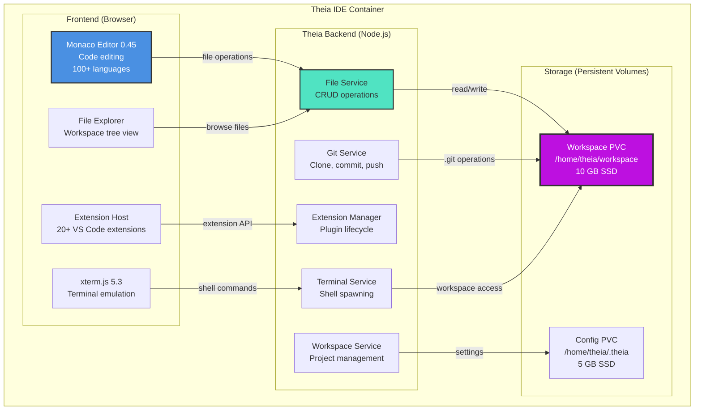

# Phase 2 - Component Diagram (Eclipse Theia IDE)

**Diagram Type:** C3 - Component
**Phase:** 2 - IDE in the Cloud
**Status:** ✅ Production (coditect.ai)
**Last Updated:** 2025-11-20

## Introduction

This diagram shows the **internal architecture of the Eclipse Theia IDE** component, revealing how Monaco editor, xterm.js terminal, file services, and extension system work together to deliver a VS Code-like experience in the browser. Theia is the core of the CODITECT Cloud IDE, providing full IDE capabilities without any local installation.

**Key Insight:** Eclipse Theia replicates the VS Code experience by combining Monaco editor (the same editor engine used by VS Code), a powerful extension API, and browser-based file/git/terminal services, all backed by persistent Kubernetes volumes.

## What This Diagram Shows

- **Frontend components:** Monaco editor, terminal, file explorer, extension host
- **Backend services:** File service, git service, workspace service, extension manager
- **Storage layer:** Workspace PVC (code) and Config PVC (settings)
- **Data flows:** How editor operations translate to file system changes
- **Extension system:** How VS Code extensions work in the browser

## Key Elements

### Frontend (Browser Components)

**Monaco Editor 0.45**
- **Purpose:** Code editing engine (same as VS Code)
- **Features:**
  - Syntax highlighting for 100+ languages
  - IntelliSense (code completion)
  - Multi-cursor editing
  - Find/replace with regex support
  - Code folding
  - Minimap navigation
  - Diff editor for git diffs
- **Performance:** Handles files up to 10 MB
- **Integration:** Connects to File Service for save/load operations

**xterm.js 5.3 (Terminal)**
- **Purpose:** Terminal emulation in browser
- **Features:**
  - Full shell access (bash, zsh, sh)
  - ANSI color support
  - Copy/paste functionality
  - Scrollback buffer (1000 lines)
  - Unicode support
  - Cursor positioning
- **Shell:** Spawns real shell processes on backend
- **Integration:** Connects to Terminal Service via WebSocket

**File Explorer**
- **Purpose:** Tree view of workspace files
- **Features:**
  - Hierarchical file/folder display
  - Context menu (right-click actions)
  - Drag-and-drop file operations
  - File search and filtering
  - Git status indicators (modified, untracked)
  - Quick open (Cmd/Ctrl+P)
- **Integration:** Connects to File Service for directory listing

**Extension Host**
- **Purpose:** Run VS Code extensions in browser
- **Extensions Installed (20+):**
  - ESLint (linting)
  - Prettier (code formatting)
  - GitLens (git blame/history)
  - Python (language support)
  - Docker (container management)
  - Markdown Preview Enhanced
  - REST Client
  - YAML support
  - And 12+ more...
- **API:** VS Code Extension API compatibility layer
- **Integration:** Connects to Extension Manager for lifecycle management

### Theia Backend (Node.js Services)

**File Service**
- **Purpose:** File CRUD operations
- **Operations:**
  - `read(path)` - Read file contents
  - `write(path, data)` - Write file
  - `mkdir(path)` - Create directory
  - `delete(path)` - Delete file/directory
  - `move(from, to)` - Rename/move
  - `copy(from, to)` - Copy file
  - `stat(path)` - File metadata
- **Storage:** Reads/writes to Workspace PVC (`/home/theia/workspace`)
- **Permissions:** Standard Unix permissions (user/group/other)

**Git Service**
- **Purpose:** Git operations without CLI
- **Operations:**
  - `clone(url)` - Clone repository
  - `commit(message)` - Commit changes
  - `push(remote, branch)` - Push to remote
  - `pull(remote, branch)` - Pull from remote
  - `status()` - Show modified files
  - `diff(file)` - Show file diff
  - `log()` - Commit history
- **Implementation:** Uses `nodegit` library (native git bindings)
- **Storage:** `.git` directory in Workspace PVC
- **Authentication:** SSH keys or HTTPS credentials

**Workspace Service**
- **Purpose:** Workspace and project management
- **Operations:**
  - `open(path)` - Open workspace
  - `close()` - Close workspace
  - `getSettings()` - Load IDE settings
  - `setSettings(settings)` - Save IDE settings
  - `getRecent()` - Recent workspaces
- **Storage:** Settings in Config PVC (`/home/theia/.theia`)
- **Format:** JSON configuration files

**Extension Manager**
- **Purpose:** Extension lifecycle management
- **Operations:**
  - `install(extensionId)` - Install extension from marketplace
  - `uninstall(extensionId)` - Remove extension
  - `enable(extensionId)` - Enable disabled extension
  - `disable(extensionId)` - Disable extension
  - `list()` - List installed extensions
  - `update(extensionId)` - Update to latest version
- **Marketplaces:** NPM Registry + Open VSX Registry
- **Storage:** Extensions in Config PVC (`/home/theia/.theia/extensions`)

**Terminal Service**
- **Purpose:** Shell spawning and management
- **Operations:**
  - `spawn(shell)` - Create new terminal
  - `write(terminalId, data)` - Send input to terminal
  - `resize(terminalId, cols, rows)` - Resize terminal
  - `kill(terminalId)` - Close terminal
- **Shell Options:** bash, zsh, sh, fish
- **Working Directory:** Defaults to `/home/theia/workspace`
- **Environment:** Inherits pod environment variables

### Storage (Persistent Volumes)

**Workspace PVC**
- **Mount Path:** `/home/theia/workspace`
- **Size:** 10 GB per pod (SSD-backed)
- **Purpose:** User project files and code
- **Contents:**
  - Project files (source code)
  - `.git` directory (version control)
  - `node_modules`, `venv` (dependencies)
  - Build artifacts
- **Access Mode:** ReadWriteOnce (single pod)
- **Reclaim Policy:** Retain (survives pod restarts)

**Config PVC**
- **Mount Path:** `/home/theia/.theia`
- **Size:** 5 GB per pod (SSD-backed)
- **Purpose:** IDE settings and extensions
- **Contents:**
  - `settings.json` (user preferences)
  - `keybindings.json` (custom keybindings)
  - `extensions/` (installed extensions)
  - `workspace-storage/` (workspace metadata)
  - `.theia-extensions/` (extension data)
- **Access Mode:** ReadWriteOnce
- **Reclaim Policy:** Retain

## Detailed Explanation

### Editor Flow: Opening a File

1. **User clicks file in File Explorer**
2. **Frontend:** File Explorer sends `openFile(path)` request
3. **Backend:** File Service receives request
4. **Backend:** File Service reads from Workspace PVC: `read('/home/theia/workspace/src/main.rs')`
5. **Backend:** Returns file contents + metadata (size, modified time)
6. **Frontend:** Monaco Editor receives file data
7. **Frontend:** Monaco loads file, applies syntax highlighting (Rust language)
8. **Frontend:** User sees code in editor with IntelliSense

### Save Flow: Editing a File

1. **User edits code in Monaco Editor**
2. **User presses Cmd/Ctrl+S (save)**
3. **Frontend:** Monaco sends `saveFile(path, contents)` to File Service
4. **Backend:** File Service validates path (no directory traversal attacks)
5. **Backend:** File Service writes to Workspace PVC: `write('/home/theia/workspace/src/main.rs', contents)`
6. **Backend:** Updates file metadata (modified time)
7. **Backend:** Returns success response
8. **Frontend:** Monaco displays "File saved" indicator
9. **File Explorer:** Updates git status indicator (shows file as modified)

### Git Flow: Committing Changes

1. **User opens Source Control panel**
2. **Frontend:** Requests `git status()` from Git Service
3. **Backend:** Git Service runs git status on Workspace PVC
4. **Backend:** Returns list of modified files
5. **Frontend:** Displays modified files in Source Control panel
6. **User:** Stages files, enters commit message
7. **User:** Clicks "Commit" button
8. **Frontend:** Sends `git commit(message)` to Git Service
9. **Backend:** Git Service runs `git commit` on Workspace PVC
10. **Backend:** Returns commit SHA
11. **Frontend:** Displays success message + commit SHA

### Terminal Flow: Running Commands

1. **User opens new terminal (Ctrl+`)**
2. **Frontend:** Sends `spawn('bash')` to Terminal Service
3. **Backend:** Terminal Service spawns bash process
4. **Backend:** Returns terminal ID + WebSocket endpoint
5. **Frontend:** xterm.js connects to WebSocket
6. **User:** Types command: `npm install`
7. **Frontend:** xterm.js sends command to WebSocket
8. **Backend:** Terminal Service writes to bash stdin
9. **Bash:** Executes `npm install` in `/home/theia/workspace`
10. **Bash:** Outputs to stdout (installation progress)
11. **Backend:** Terminal Service reads stdout, sends to WebSocket
12. **Frontend:** xterm.js displays output in terminal

### Extension Flow: Installing Extension

1. **User opens Extensions panel**
2. **User:** Searches for "ESLint"
3. **Frontend:** Queries Extension Manager: `search('ESLint')`
4. **Backend:** Extension Manager queries NPM/Open VSX registries
5. **Backend:** Returns search results
6. **Frontend:** Displays ESLint extension with rating/downloads
7. **User:** Clicks "Install"
8. **Frontend:** Sends `install('dbaeumer.vscode-eslint')` to Extension Manager
9. **Backend:** Downloads extension package from registry
10. **Backend:** Extracts to Config PVC: `/home/theia/.theia/extensions/vscode-eslint/`
11. **Backend:** Registers extension with Extension Host
12. **Frontend:** Extension Host loads ESLint extension
13. **Frontend:** ESLint starts linting open files

## Architecture Patterns

### Pattern 1: Frontend-Backend Separation
**Decision:** Separate browser frontend (React/Monaco) from Node.js backend (Theia services)
**Rationale:**
- **Security:** Backend validates all file operations (no direct filesystem access from browser)
- **Performance:** Heavy operations (git, file search) offloaded to backend
- **Scalability:** Backend can run on different pod than frontend (future optimization)
- **Compatibility:** Standard web architecture (REST/WebSocket)

### Pattern 2: WebSocket for Terminal
**Decision:** Use WebSocket (not polling) for terminal communication
**Rationale:**
- **Low Latency:** Real-time bidirectional communication
- **Efficiency:** No polling overhead
- **Compatibility:** Standard protocol, works through firewalls
- **Scalability:** Connection pooling, many terminals per pod

### Pattern 3: VS Code Extension API Compatibility
**Decision:** Implement VS Code Extension API (not custom API)
**Rationale:**
- **Ecosystem:** Access to 20,000+ existing VS Code extensions
- **Familiarity:** Developers already know VS Code API
- **Documentation:** Extensive VS Code extension docs available
- **Migration:** Users can bring their existing extensions

### Pattern 4: Per-Pod Storage (Not Shared)
**Decision:** Each pod has its own Workspace + Config PVCs (not shared storage)
**Rationale:**
- **Isolation:** User workspaces isolated from each other
- **Performance:** No network filesystem overhead (local SSD)
- **Cost:** Right-sized storage per pod (10 GB + 5 GB)
- **Resilience:** Pod failure doesn't affect other users

## Technical Details

### Monaco Editor Features

**Supported Languages (100+):**
- **Web:** JavaScript, TypeScript, HTML, CSS, SCSS, JSON, XML
- **Backend:** Python, Rust, Go, Java, C/C++, C#, Ruby, PHP
- **DevOps:** YAML, Dockerfile, Shell, Makefile, Terraform
- **Data:** SQL, GraphQL, Markdown
- **And 80+ more...**

**IntelliSense Features:**
- Code completion (Ctrl+Space)
- Parameter hints
- Hover documentation
- Go to definition (F12)
- Find all references
- Rename symbol (F2)
- Format document

**Editor Performance:**
- Max file size: 10 MB (recommended)
- Large file mode: 50 MB+ (limited features)
- Concurrent editors: 20+ files open
- Memory usage: ~2 MB per file

### Terminal Service Details

**Shell Support:**
- bash 5.1+ (default)
- zsh 5.8+
- sh (POSIX)
- fish 3.3+

**Terminal Features:**
- Scrollback: 1000 lines
- Max terminals: 10 per user
- Timeout: 1 hour inactivity
- Max output rate: 1 MB/s (throttled)

**Environment Variables:**
```bash
HOME=/home/theia
SHELL=/bin/bash
PATH=/usr/local/bin:/usr/bin:/bin
TERM=xterm-256color
```

### File Service Limits

**File Operations:**
- Max file size (read): 100 MB
- Max file size (write): 50 MB
- Max directory depth: 100 levels
- Max files per directory: 10,000
- File watch limit: 1,000 files

**Workspace Capacity:**
- Storage: 10 GB per pod
- Inodes: 1M per pod
- Max files: 100,000 per workspace

### Extension System

**Installation Sources:**
- NPM Registry (primary)
- Open VSX Registry (backup)
- Manual upload (.vsix file)

**Extension Limits:**
- Max extensions: 50 per workspace
- Max extension size: 100 MB
- Total extension storage: 2 GB (Config PVC)

**Most Popular Extensions:**
1. ESLint (linting)
2. Prettier (formatting)
3. GitLens (git visualization)
4. Python (language support)
5. Docker (container management)

## Limitations & Future Evolution

### Theia IDE Limitations

❌ **No Collaborative Editing**
- Cannot edit same file with multiple users simultaneously
- No real-time cursor sharing
- No live code review
- Phase 4 considers: Collaborative editing with OT/CRDT

❌ **Limited Extension Marketplace**
- Only 20+ extensions pre-installed
- Cannot browse full VS Code marketplace (proprietary)
- Open VSX has fewer extensions than Microsoft marketplace
- Phase 5 adds: CODITECT custom agent marketplace

❌ **No Language Servers for All Languages**
- IntelliSense works for popular languages only
- Less common languages have basic syntax highlighting only
- Some extensions missing (VS Code exclusives)
- Future: Add more language server protocols

❌ **No Remote Development**
- Cannot SSH into remote containers
- Cannot develop on remote Linux servers
- All development happens in current pod
- Future: Remote development extension support

❌ **No Debugging UI**
- No visual debugger for breakpoints/stepping
- Must use CLI debuggers (gdb, pdb, etc.)
- No debug adapter protocol support
- Phase 5/6 considers: Debugging UI integration

### Evolution to Phase 3

Phase 3 (Workflow Analyzer) adds:
- ✅ Workflow analysis integration (separate tool, no IDE changes)
- ⏳ Future: Activity feed in IDE (workflow tasks → IDE to-do list)

### Evolution to Phase 4

Phase 4 (License Management) adds:
- ✅ Session state sync (workspace settings persist across devices)
- ✅ Usage quotas (storage limits based on tier)
- ✅ User preferences (saved in central database)

## Diagram



## Related Documentation

- **Phase 2 README:** [diagrams/phase-2-ide-cloud/README.md](README.md) - Complete Phase 2 overview
- **System Context:** [phase2-c1-system-context.md](phase2-c1-system-context.md) - External view of IDE
- **Container Diagram:** [phase2-c2-container.md](phase2-c2-container.md) - GKE deployment architecture
- **Eclipse Theia Docs:** [https://theia-ide.org/docs/](https://theia-ide.org/docs/) - Official Theia documentation
- **Monaco Editor Docs:** [https://microsoft.github.io/monaco-editor/](https://microsoft.github.io/monaco-editor/) - Editor API reference
- **VS Code Extension API:** [https://code.visualstudio.com/api](https://code.visualstudio.com/api) - Extension development guide

---

**Status:** ✅ Production (Build #32)
**Maintained By:** AZ1.AI CODITECT Team
**IDE Version:** Eclipse Theia 1.65.0
**Editor:** Monaco 0.45.0
