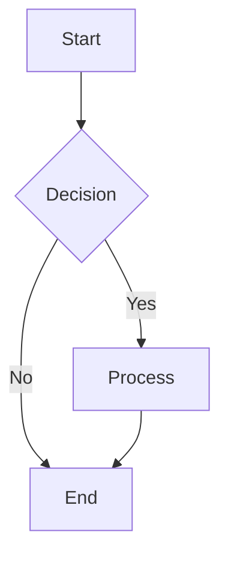
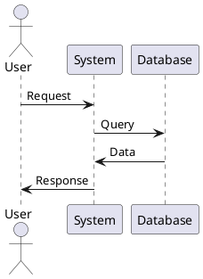
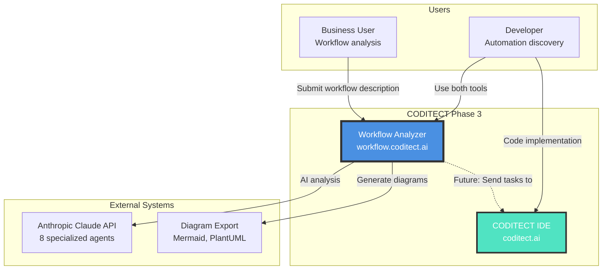

# Phase 3 - System Context Diagram

**Diagram Type:** C1 - System Context
**Phase:** 3 - Workflow Analyzer Integration
**Status:** ✅ Production (workflow.coditect.ai)
**Last Updated:** 2025-11-20

## Introduction

This diagram shows the **highest-level view of Phase 3** - the CODITECT Workflow Analyzer, a production AI-powered workflow analysis platform deployed at https://workflow.coditect.ai. Phase 3 adds 8 specialized agents that analyze business processes and generate implementation artifacts including diagrams in 9 different formats.

**Key Insight:** Phase 3 bridges business and technical domains - business users describe workflows in natural language, and 8 specialized AI agents decompose them into actionable technical specifications with automated diagram generation.

## What This Diagram Shows

- **Who uses the system:** Business users (workflow analysts) and developers (automation discovery)
- **What the system is:** Workflow Analyzer platform with 8-agent orchestration
- **External dependencies:** Anthropic Claude API (8 agents), diagram export tools
- **Key interactions:** Workflow submission, multi-agent analysis, diagram generation
- **Future integration:** Tasks from Workflow Analyzer → IDE activity feed

## Key Elements

### Users

**Business User (Workflow Analysis)**
- Primary user: Business analysts, process managers, product owners
- Use case: Submit workflow descriptions in natural language
- Input format: Text description of business process (e.g., "customer onboarding flow")
- Output: Comprehensive analysis with diagrams, automation opportunities, requirements
- No technical knowledge required
- Can export diagrams for presentations and documentation

**Developer (Automation Discovery)**
- Secondary user: Software engineers, DevOps engineers
- Use case: Discover automation opportunities in existing workflows
- Input format: Existing workflow documentation or process description
- Output: Technical specifications, API requirements, database schema, code templates
- Uses both Workflow Analyzer + IDE in parallel
- Implements discovered automations in IDE

### Systems

**Workflow Analyzer (workflow.coditect.ai)**
- Production deployment (v2.0-alpha)
- 8 specialized AI agents for multi-dimensional analysis
- FastAPI + React architecture
- PostgreSQL for workflow persistence
- Redis for caching and session management
- 9 export formats: SVG, PDF, PNG, Mermaid, PlantUML, BPMN, Visio, Draw.io, Lucidchart
- Orchestrated agent coordination (4-phase analysis pipeline)

**CODITECT IDE (coditect.ai)**
- Existing Phase 2 cloud IDE
- Future integration: Receive tasks from Workflow Analyzer
- Developers implement discovered automations
- Cross-system state synchronization (Phase 4)

**Anthropic Claude API (8 Specialized Agents)**
- Same LLM service as Phase 1/2
- 8 new specialized agents:
  1. **Workflow Analyzer** - High-level workflow understanding
  2. **Task Decomposer** - Break workflows into atomic tasks
  3. **Actor Identifier** - Identify human/system actors
  4. **Automation Assessor** - Identify automation opportunities
  5. **Requirements Extractor** - Extract technical requirements
  6. **Process Designer** - Design optimized processes
  7. **Quality Analyzer** - Identify bottlenecks and improvements
  8. **Technical Analyzer** - Generate technical specifications
- Model: claude-sonnet-4-5

**Diagram Export Tools**
- **Mermaid:** Text-based diagramming (default)
- **PlantUML:** UML diagrams from text
- **BPMN:** Business Process Model and Notation
- **SVG/PDF/PNG:** Image exports
- **Visio/Draw.io/Lucidchart:** Import formats for external tools

## Detailed Explanation

### Multi-Agent Workflow Analysis

Phase 3 introduces **orchestrated multi-agent analysis** where 8 specialized agents work in coordinated phases:

**4-Phase Analysis Pipeline:**

**Phase 1: Analysis (Agent: Workflow Analyzer)**
- Understands high-level workflow intent
- Identifies workflow domain (e-commerce, HR, DevOps, etc.)
- Extracts key workflow characteristics
- Determines appropriate analysis depth

**Phase 2: Decomposition (Agents: Task Decomposer + Actor Identifier)**
- Breaks workflow into atomic tasks
- Identifies all human and system actors
- Maps task dependencies
- Creates initial task graph

**Phase 3: Assessment (Agents: Automation Assessor + Requirements Extractor)**
- Identifies automation opportunities (% of tasks automatable)
- Extracts technical requirements (APIs, databases, integrations)
- Assesses complexity and risk
- Prioritizes automation candidates

**Phase 4: Design (Agents: Process Designer + Quality Analyzer + Technical Analyzer)**
- Designs optimized workflow with automation
- Identifies bottlenecks and improvement areas
- Generates technical specifications (API schemas, database models)
- Creates implementation roadmap

### Diagram Generation (9 Export Formats)

**Text-Based Formats (Developer-Friendly):**
- **Mermaid:** `graph TB` syntax for markdown rendering
- **PlantUML:** `@startuml` syntax for UML diagrams
- **BPMN:** XML-based business process notation

**Image Formats (Presentation-Ready):**
- **SVG:** Scalable vector graphics (web-friendly)
- **PDF:** Print-ready documentation
- **PNG:** Raster images for slides

**Import Formats (External Tools):**
- **Visio:** Microsoft Visio import
- **Draw.io:** Open-source diagramming tool
- **Lucidchart:** Cloud diagramming platform

### Interaction Flows

**Workflow Analysis Flow:**
1. Business user browses to https://workflow.coditect.ai
2. User submits workflow description: "E-commerce checkout process"
3. Workflow Analyzer (frontend) sends request to FastAPI backend
4. Orchestrator Service coordinates 8 agents through 4-phase pipeline
5. Each agent analyzes different dimension (tasks, actors, automation, etc.)
6. Result Aggregator combines all agent outputs
7. Diagram Engine generates diagrams in selected formats
8. User receives comprehensive analysis report with diagrams

**Developer Automation Flow:**
1. Developer submits workflow: "CI/CD pipeline for microservices"
2. 8-agent analysis identifies automation opportunities (e.g., "auto-deploy on green tests")
3. Technical Analyzer generates API specs, database schema
4. Developer exports diagrams (Mermaid for docs, PNG for presentation)
5. Developer opens CODITECT IDE (Phase 2)
6. Developer implements automation based on specifications
7. (Phase 4 integration): Tasks automatically appear in IDE activity feed

**Diagram Export Flow:**
1. User selects "Export Diagrams" after analysis
2. User chooses formats: Mermaid + PNG + Visio
3. Diagram Engine generates all 3 formats
4. User downloads ZIP file with all exports
5. User imports Mermaid into markdown docs
6. User adds PNG to presentation slides
7. User opens Visio file for detailed editing

### Comparison: Phase 2 vs Phase 3

| Aspect | Phase 2 (IDE) | Phase 3 (Workflow) |
|--------|---------------|-------------------|
| **Primary User** | Developer | Business user + Developer |
| **Input** | Code | Natural language workflow description |
| **Output** | Code | Analysis reports + diagrams |
| **Agents** | 50 general agents | 8 specialized workflow agents |
| **Artifacts** | Source code files | Diagrams (9 formats) + specs |
| **Use Case** | Code implementation | Workflow analysis + automation discovery |
| **Integration** | Standalone | Future: Tasks → IDE activity feed |

## Architecture Patterns

### Pattern 1: Separate Deployment (Not Integrated with IDE)
**Decision:** Deploy Workflow Analyzer as separate service (workflow.coditect.ai)
**Rationale:**
- **Independent Scaling:** Workflow analysis has different resource profile than IDE
- **User Segmentation:** Business users don't need IDE access
- **Technology Stack:** FastAPI (Python) vs Rust backend (Phase 2)
- **Iteration Speed:** Can update workflow agents without IDE downtime
- **Phase 4 Integration:** Will add cross-system session coordination

### Pattern 2: Orchestrated Agent Pipeline (Not Parallel)
**Decision:** Run agents in 4 sequential phases (not all in parallel)
**Rationale:**
- **Dependencies:** Later agents need earlier agent outputs (e.g., Task Decomposer needs Workflow Analyzer results)
- **Cost Efficiency:** Don't run all agents if early analysis determines workflow is simple
- **Quality:** Sequential pipeline ensures consistent analysis depth
- **Debugging:** Easier to identify which phase produced errors

### Pattern 3: PostgreSQL for Workflows (Not NoSQL)
**Decision:** Store workflow data in PostgreSQL (not MongoDB/DynamoDB)
**Rationale:**
- **Relational Data:** Workflows have clear relationships (tasks, actors, dependencies)
- **ACID Transactions:** Ensure consistency when saving multi-agent results
- **Querying:** Complex queries for workflow search and filtering
- **Mature Ecosystem:** Battle-tested, well-understood database

### Pattern 4: Redis for Session Caching
**Decision:** Use Redis for session data (not in-memory only)
**Rationale:**
- **Persistence:** Sessions survive application restarts
- **Sharing:** Multiple backend pods can access same session
- **Performance:** Sub-millisecond latency for session lookups
- **TTL Support:** Auto-expire old sessions

## Technical Details

### Technology Stack

**Frontend:**
- **React:** 18.2.0
- **TypeScript:** 5.3.3
- **UI Framework:** TBD (likely Chakra UI for consistency with IDE)
- **State Management:** TBD (likely Zustand)

**Backend:**
- **Language:** Python 3.11+
- **Framework:** FastAPI 0.104+
- **Async Runtime:** asyncio + uvicorn
- **AI Framework:** LangChain or custom orchestration
- **Authentication:** JWT (shared with Phase 2 backend)

**Databases:**
- **PostgreSQL:** 15+ (workflow data)
  - Tables: workflows, tasks, actors, analysis_results
  - Schemas: Multi-tenant with row-level security (Phase 4)
- **Redis:** 7+ (caching, sessions)
  - TTL: 24 hours for sessions
  - Eviction policy: LRU

**Infrastructure:**
- **Deployment:** TBD (likely Cloud Run or GKE)
- **Domain:** workflow.coditect.ai
- **SSL:** Google-managed certificates
- **CI/CD:** Cloud Build

### 8 Specialized Agents

| Agent | Purpose | Input | Output |
|-------|---------|-------|--------|
| **Workflow Analyzer** | High-level understanding | Workflow description | Workflow domain, key characteristics |
| **Task Decomposer** | Break into tasks | Workflow + domain | List of atomic tasks with dependencies |
| **Actor Identifier** | Find actors | Workflow + tasks | Human actors, system actors, roles |
| **Automation Assessor** | Find automation | Tasks + actors | Automation opportunities (% automatable) |
| **Requirements Extractor** | Extract tech reqs | Tasks + automation | API specs, database schema, integrations |
| **Process Designer** | Design optimized flow | All inputs | Optimized workflow with automation |
| **Quality Analyzer** | Find bottlenecks | Process design | Performance bottlenecks, improvements |
| **Technical Analyzer** | Generate specs | All inputs | Technical specs, code templates, roadmap |

### Diagram Export Formats

**Mermaid (Text-Based):**


**PlantUML (Text-Based):**


**BPMN (XML):**
```xml
<bpmn:process id="Process_1">
  <bpmn:startEvent id="StartEvent_1" />
  <bpmn:task id="Task_1" name="Process" />
  <bpmn:endEvent id="EndEvent_1" />
</bpmn:process>
```

## Limitations & Future Evolution

### Phase 3 Limitations

❌ **No IDE Integration Yet**
- Workflow Analyzer and IDE are separate systems
- Tasks don't automatically flow to IDE activity feed
- Developers must manually copy specifications
- Phase 4 adds: Unified activity feed, cross-system task synchronization

❌ **No Real-Time Collaboration**
- Cannot analyze workflows with multiple users simultaneously
- No shared workspace for team workflow analysis
- Phase 4 considers: Multi-user workflow analysis sessions

❌ **No Workflow Versioning**
- Cannot track workflow changes over time
- No diff view for workflow updates
- No rollback to previous workflow versions
- Future: Git-like versioning for workflows

❌ **No Approval Workflows**
- Generated specifications not reviewed before implementation
- No approval gates for critical workflows
- Phase 4 considers: Review and approval process

❌ **Limited Diagram Customization**
- Generated diagrams use default styling
- Cannot customize colors, fonts, layout
- Future: Diagram style templates and themes

### Evolution to Phase 4

Phase 4 (License Management + Session Coordination) adds:
- ✅ Unified authentication (SSO across IDE + Workflow + Dashboard)
- ✅ Session coordination (state sync between IDE and Workflow Analyzer)
- ✅ Activity feed (Workflow tasks → IDE to-do list)
- ✅ Usage tracking (workflow analysis quota by license tier)
- ✅ Multi-tenant isolation (separate workflow data by organization)

### Evolution to Phase 5

Phase 5 (Analytics) adds:
- ✅ Workflow analysis metrics (most common workflows, analysis time)
- ✅ Agent performance tracking (which agents are most accurate)
- ✅ Export format popularity (which formats users prefer)
- ✅ Business intelligence (automation opportunity trends)

## Diagram



## Related Documentation

- **Phase 3 README:** [diagrams/phase-3-workflow-analyzer/README.md](README.md) - Complete Phase 3 overview
- **Container Diagram:** [phase3-c2-container.md](phase3-c2-container.md) - Backend architecture and 8 agents
- **Orchestration Diagram:** [phase3-c3-orchestration.md](phase3-c3-orchestration.md) - Agent coordination flow
- **Phase 2 Context:** [../phase-2-ide-cloud/phase2-c1-system-context.md](../phase-2-ide-cloud/phase2-c1-system-context.md) - Cloud IDE baseline
- **Phase 4 Context:** [../phase-4-license-management/phase4-c1-system-context.md](../phase-4-license-management/phase4-c1-system-context.md) - Unified platform integration

---

**Status:** ✅ Production (v2.0-alpha)
**Maintained By:** AZ1.AI CODITECT Team
**Production URL:** https://workflow.coditect.ai
**Agents:** 8 specialized workflow agents
**Export Formats:** 9 (Mermaid, PlantUML, BPMN, SVG, PDF, PNG, Visio, Draw.io, Lucidchart)
