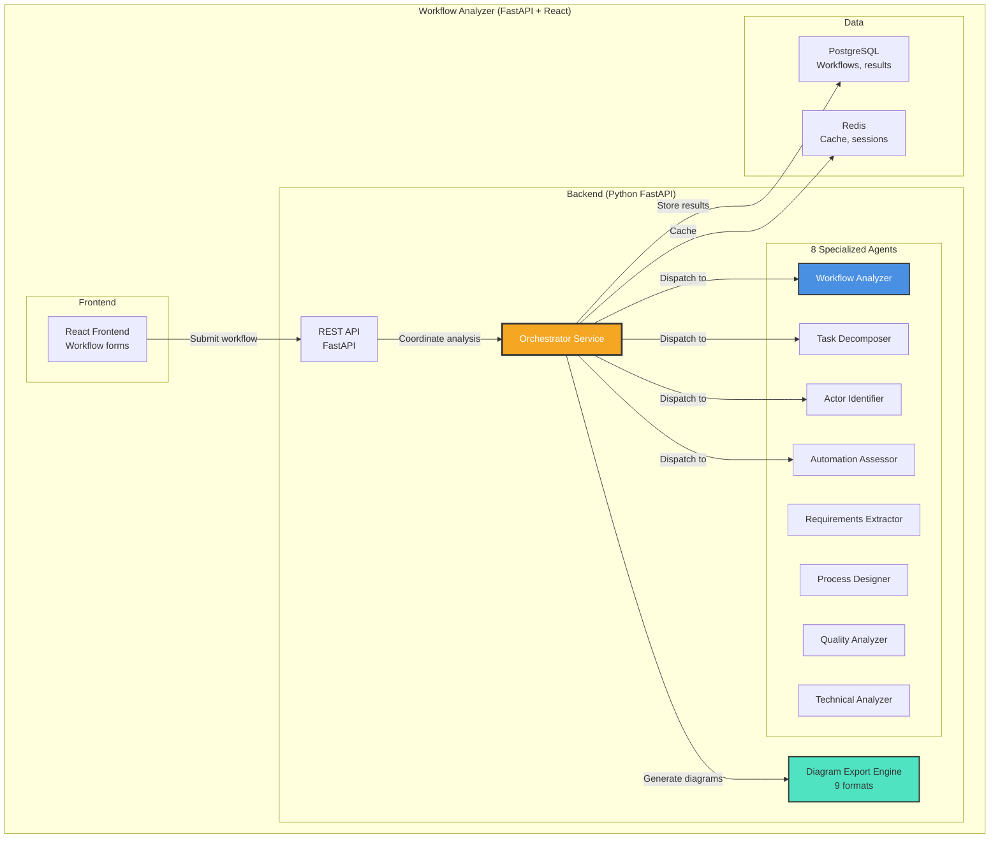

# Phase 3 - Container Diagram

**Diagram Type:** C2 - Container
**Phase:** 3 - Workflow Analyzer Integration
**Status:** ✅ Deployed (Production)
**URL:** https://workflow.coditect.ai
**Last Updated:** 2025-11-20

## Introduction

This diagram shows the **internal container architecture** of the CODITECT Workflow Analyzer, revealing how 8 specialized AI agents work together to analyze business workflows and generate comprehensive implementation artifacts. Phase 3 introduces the first **multi-agent orchestration system** in the CODITECT platform.

**Key Insight:** The Workflow Analyzer demonstrates Phase 6's future vision - autonomous multi-agent coordination producing deliverables without human intervention between agent steps.

## What This Diagram Shows

- **Application containers:** Frontend, Backend API, Agent services
- **8 Specialized agents:** Workflow analysis, task decomposition, automation assessment, etc.
- **Orchestration service:** Coordinates agent execution in phases
- **Data layer:** PostgreSQL for persistence, Redis for caching
- **Export engine:** 9 diagram format generators

## Key Elements

### Frontend Layer

**React Frontend**
- **Technology:** React 18 + TypeScript
- **Purpose:** Workflow submission forms and result display
- **Features:**
  - Workflow description input
  - Domain selection (software, manufacturing, healthcare, etc.)
  - Real-time progress tracking
  - Analysis result visualization
  - Multi-format diagram download
- **Integration:** Calls Backend REST API
- **Deployment:** Separate from IDE (workflow.coditect.ai)

### Backend API Layer

**REST API (FastAPI)**
- **Framework:** Python FastAPI
- **Purpose:** HTTP endpoints for workflow operations
- **Endpoints:**
  - `POST /api/workflows` - Submit new workflow
  - `GET /api/workflows/{id}` - Get workflow analysis
  - `GET /api/workflows/{id}/export/{format}` - Download diagram
  - `GET /api/workflows` - List user workflows
  - `POST /api/workflows/{id}/regenerate` - Re-run analysis
- **Authentication:** JWT tokens (integrated with Phase 2 backend)
- **Rate Limiting:** Redis-based request throttling

### Agent Layer (8 Specialized Agents)

**1. Workflow Analyzer**
- **Responsibility:** High-level workflow understanding
- **Inputs:** Raw workflow description
- **Outputs:**
  - Workflow purpose and goals
  - Key stakeholders
  - Success criteria
  - Domain classification
- **Execution Time:** ~5-10 seconds

**2. Task Decomposer**
- **Responsibility:** Break workflow into atomic tasks
- **Inputs:** Workflow description + Analyzer results
- **Outputs:**
  - Sequential tasks list
  - Parallel tasks identification
  - Task dependencies
  - Critical path analysis
- **Execution Time:** ~10-15 seconds

**3. Actor Identifier**
- **Responsibility:** Identify all workflow participants
- **Inputs:** Workflow description + decomposed tasks
- **Outputs:**
  - Human actors (roles, responsibilities)
  - System actors (applications, services)
  - External actors (APIs, third parties)
  - Actor interactions
- **Execution Time:** ~5-8 seconds

**4. Automation Assessor**
- **Responsibility:** Evaluate automation opportunities
- **Inputs:** Tasks + actors
- **Outputs:**
  - Automatable tasks (score 0-100)
  - Manual tasks requiring human judgment
  - Hybrid tasks (partial automation)
  - ROI estimates for automation
- **Execution Time:** ~8-12 seconds

**5. Requirements Extractor**
- **Responsibility:** Extract technical and business requirements
- **Inputs:** Complete workflow understanding
- **Outputs:**
  - Functional requirements
  - Non-functional requirements (performance, security, compliance)
  - Data requirements
  - Integration requirements
- **Execution Time:** ~10-15 seconds

**6. Process Designer**
- **Responsibility:** Design optimized process flow
- **Inputs:** All previous agent outputs
- **Outputs:**
  - Optimized process diagram
  - Decision points
  - Exception handling flows
  - Subprocess definitions
- **Execution Time:** ~12-18 seconds

**7. Quality Analyzer**
- **Responsibility:** Assess workflow quality and risks
- **Inputs:** Designed process
- **Outputs:**
  - Quality metrics (efficiency, reliability, maintainability)
  - Risk assessment (bottlenecks, single points of failure)
  - Compliance gaps
  - Improvement recommendations
- **Execution Time:** ~8-12 seconds

**8. Technical Analyzer**
- **Responsibility:** Provide technical implementation guidance
- **Inputs:** Complete workflow analysis
- **Outputs:**
  - Technology stack recommendations
  - Architecture patterns
  - Database schema suggestions
  - API design
  - Security considerations
- **Execution Time:** ~10-15 seconds

### Orchestration Layer

**Orchestrator Service**
- **Responsibility:** Coordinate 8-agent execution pipeline
- **Coordination Pattern:** Phase-based sequential execution
- **Phases:**
  1. **Phase 1 (Analysis):** Workflow Analyzer runs first
  2. **Phase 2 (Decomposition):** Task Decomposer + Actor Identifier run in parallel
  3. **Phase 3 (Assessment):** Automation Assessor + Requirements Extractor run in parallel
  4. **Phase 4 (Design):** Process Designer, Quality Analyzer, Technical Analyzer run in sequence
- **Features:**
  - Dependency management (agents wait for prerequisites)
  - Parallel execution where possible
  - Result aggregation
  - Error handling and retry logic
  - Progress tracking (exposed via WebSocket)

**Diagram Export Engine**
- **Responsibility:** Generate diagrams in multiple formats
- **Supported Formats (9 total):**
  1. **SVG** - Scalable Vector Graphics (web-friendly)
  2. **PDF** - Portable Document Format (printing)
  3. **PNG** - Raster image (presentations)
  4. **Mermaid** - Markdown-compatible diagrams
  5. **PlantUML** - Developer-friendly text format
  6. **BPMN** - Business Process Model and Notation (XML)
  7. **Visio (VSDX)** - Microsoft Visio format
  8. **Draw.io (XML)** - Draw.io compatible format
  9. **Lucidchart** - Lucidchart compatible format
- **Rendering:**
  - Server-side rendering (no client dependencies)
  - Template-based generation
  - Custom styling per format
- **Performance:** <3 seconds per format

### Data Layer

**PostgreSQL Database**
- **Version:** PostgreSQL 15
- **Purpose:** Persistent workflow and analysis storage
- **Schema:**
  - `workflows` table - Workflow metadata
  - `analysis_results` table - Agent outputs
  - `diagrams` table - Generated diagram metadata
  - `export_history` table - Download tracking
- **Indexes:** Optimized for workflow lookup and user queries
- **Backups:** Daily automated backups to GCS

**Redis Cache**
- **Version:** Redis 7.0
- **Purpose:** Performance optimization and session management
- **Use Cases:**
  - Session caching (user workflows in progress)
  - Result caching (avoid re-running agents)
  - Rate limiting (request throttling)
  - WebSocket connection management
- **TTL Strategy:**
  - In-progress workflows: 24 hours
  - Completed workflows: 7 days cache
  - Rate limit buckets: 1 hour

## Detailed Explanation

### Multi-Agent Orchestration Pattern

**Phase-Based Execution Strategy:**

```
User submits workflow description
    ↓
Orchestrator receives request
    ↓
Phase 1: ANALYSIS
├─ Workflow Analyzer executes
├─ Outputs: workflow understanding
├─ Duration: ~5-10 seconds
    ↓
Phase 2: DECOMPOSITION (Parallel)
├─ Task Decomposer executes
├─ Actor Identifier executes (simultaneously)
├─ Outputs: tasks + actors
├─ Duration: ~10-15 seconds (max of parallel agents)
    ↓
Phase 3: ASSESSMENT (Parallel)
├─ Automation Assessor executes
├─ Requirements Extractor executes (simultaneously)
├─ Outputs: automation scores + requirements
├─ Duration: ~10-15 seconds (max of parallel agents)
    ↓
Phase 4: DESIGN (Sequential)
├─ Process Designer executes
│  ├─ Uses all previous outputs
│  ├─ Duration: ~12-18 seconds
├─ Quality Analyzer executes
│  ├─ Reviews designed process
│  ├─ Duration: ~8-12 seconds
├─ Technical Analyzer executes
│  ├─ Provides implementation guidance
│  ├─ Duration: ~10-15 seconds
    ↓
Result Aggregator combines all outputs
    ↓
Artifact Generator creates deliverables
├─ Workflow analysis document (Markdown)
├─ Process diagrams (9 formats)
├─ Requirements specification
├─ Implementation roadmap
    ↓
Results saved to PostgreSQL
    ↓
User receives complete analysis (~60-90 seconds total)
```

### Agent Communication Pattern

**Current Implementation (Phase 3):**
- **Sequential Outputs:** Each agent reads previous agent outputs from PostgreSQL
- **No Direct Communication:** Agents don't invoke each other
- **Orchestrator-Mediated:** All coordination through Orchestrator Service
- **Synchronous:** User waits for complete pipeline (60-90 seconds)

**Evolution to Phase 6 (Future):**
- **Message Bus:** Agents communicate via RabbitMQ
- **Asynchronous:** User receives progress updates, final results when ready
- **Dynamic Routing:** Agents can spawn additional agents as needed
- **Circuit Breakers:** Automatic fallback if agent fails

### Export Engine Architecture

**Multi-Format Generation:**

```
Process Designer output (canonical model)
    ↓
Template Selector
├─ Format: SVG → SVG template
├─ Format: Mermaid → Mermaid template
├─ Format: BPMN → BPMN XML template
    ↓
Renderer (format-specific)
├─ SVG: D3.js server-side rendering
├─ Mermaid: mermaid-cli (mmdc)
├─ BPMN: bpmn-js XML generation
├─ Visio: python-pptx + vsdx library
    ↓
Post-Processing
├─ Compression (PNG, PDF)
├─ Validation (XML formats)
├─ Watermarking (optional)
    ↓
Storage (blob storage or inline return)
    ↓
Download URL or inline response
```

## Architecture Patterns

### Pattern 1: Orchestrator-Agent Delegation
**Decision:** Central orchestrator coordinates agents vs peer-to-peer
**Rationale:**
- Simplifies dependency management
- Enables phase-based execution
- Single point of progress tracking
- Easier error handling and retry logic
- Foundation for Phase 6's message bus

### Pattern 2: Result Persistence Between Phases
**Decision:** Store intermediate results in PostgreSQL vs in-memory passing
**Rationale:**
- Enables analysis review (see partial results)
- Supports retry on failure (don't lose Phase 1-2 work)
- Allows caching (avoid re-running expensive agents)
- Facilitates debugging (inspect agent outputs)
- Prepares for async execution (Phase 6)

### Pattern 3: Multi-Format Export
**Decision:** Support 9 formats vs single standard format
**Rationale:**
- Different stakeholders prefer different tools
- Broad compatibility (Visio for enterprise, Mermaid for developers)
- Future-proof (new formats added easily)
- Competitive differentiator (most tools support 1-2 formats)

### Pattern 4: Stateless Agents
**Decision:** Agents as pure functions vs stateful services
**Rationale:**
- Simplifies scaling (run multiple instances)
- No session management complexity
- Easier testing (deterministic inputs/outputs)
- Crash-safe (no lost state on failure)

## Performance Characteristics

### End-to-End Latency
- **Total Pipeline:** 60-90 seconds
- **Breakdown:**
  - Phase 1 (Analysis): 5-10 seconds
  - Phase 2 (Decomposition): 10-15 seconds
  - Phase 3 (Assessment): 10-15 seconds
  - Phase 4 (Design): 30-45 seconds
  - Aggregation + Export: 5-10 seconds

### Throughput
- **Concurrent Workflows:** 10+ (limited by API rate)
- **Agent Instances:** 1 per agent (can scale horizontally)
- **Database Connections:** Pool of 20
- **Redis Connections:** Pool of 50

### Caching Impact
- **Cache Hit Rate:** ~40% (users re-run similar workflows)
- **Latency Reduction:** 80% (10-15 seconds vs 60-90 seconds)
- **Database Load:** 60% reduction

## Technology Stack

### Backend Services
- **API Framework:** FastAPI 0.104
- **Agent Runtime:** Python 3.11 + async/await
- **LLM Integration:** Anthropic Python SDK
- **Orchestration:** Custom Python service
- **Diagram Generation:** mermaid-cli, bpmn-js, python-pptx

### Data Layer
- **Relational DB:** PostgreSQL 15 (workflows, results)
- **Cache:** Redis 7.0 (sessions, rate limiting)
- **Blob Storage:** GCS (large diagram exports)

### Infrastructure
- **Platform:** GKE (planned migration from current deployment)
- **Current:** Separate deployment (workflow.coditect.ai)
- **Future:** Integrated with main CODITECT cluster

## Limitations & Future Evolution

### Current Limitations

❌ **No IDE Integration**
- Analysis results don't flow back to IDE
- User must manually copy tasks from Workflow Analyzer to IDE
- Future: Tasks appear in IDE activity feed

❌ **Synchronous Execution**
- User waits 60-90 seconds for results
- No progress streaming (just spinner)
- Future: WebSocket progress updates, async execution

❌ **Limited Collaboration**
- Single-user workflow analysis
- No team sharing or commenting
- Future: Team workflows, shared analysis libraries

❌ **Sequential Agent Execution**
- Only 2 phases support parallel execution
- Could be faster with more parallelism
- Future: Fully parallel execution where dependencies allow

### Evolution to Phase 4

Phase 4 (License & User Management) adds:
- ✅ User accounts and workflow history
- ✅ Workflow sharing within teams
- ✅ Usage quotas (Free: 10 workflows/month, Team: unlimited)
- ✅ Workflow templates library

### Evolution to Phase 6

Phase 6 (Multi-Agent Orchestration) adds:
- ✅ Message Bus (RabbitMQ) for agent communication
- ✅ Asynchronous execution with progress streaming
- ✅ Dynamic agent spawning
- ✅ Circuit breakers and auto-retry
- ✅ Distributed agent execution across pods

## Diagram



## Related Documentation

- **Phase Overview:** [README.md](README.md)
- **System Context:** [phase3-c1-system-context.md](phase3-c1-system-context.md)
- **Orchestration Flow:** [phase3-c3-orchestration.md](phase3-c3-orchestration.md)
- **Phase 2 (IDE):** [../phase-2-ide-cloud/README.md](../phase-2-ide-cloud/README.md)
- **Phase 6 (Advanced Orchestration):** [../phase-6-orchestration/README.md](../phase-6-orchestration/README.md)

---

**Maintained By:** AZ1.AI CODITECT Team
**Repository:** https://github.com/coditect-ai/coditect-rollout-master
**Production URL:** https://workflow.coditect.ai
**Status:** Production (v2.0-alpha)
