# Phase 3 - Component Diagram: Orchestration Flow

**Diagram Type:** C3 - Component
**Phase:** 3 - Workflow Analyzer Integration
**Status:** ✅ Deployed (Production)
**URL:** https://workflow.coditect.ai
**Last Updated:** 2025-11-20

## Introduction

This diagram shows the **internal orchestration pipeline** that coordinates the 8 specialized workflow analysis agents. It reveals how the Orchestrator Service manages dependencies, executes agents in optimal order, and aggregates results into deliverable artifacts.

**Key Insight:** This is CODITECT's first implementation of autonomous multi-agent coordination - a preview of Phase 6's full inter-agent communication capabilities.

## What This Diagram Shows

- **Orchestrator components:** Router, Coordinator, Aggregator
- **4-phase execution pipeline:** Analysis → Decomposition → Assessment → Design
- **Agent dependencies:** Which agents must run before others
- **Artifact generation:** How final deliverables are created
- **Result flow:** From individual agent outputs to combined artifacts

## Key Components

### Workflow Router

**Responsibility:** Entry point and workflow classification

**Functions:**
- Receive incoming workflow analysis requests
- Classify workflow domain (software dev, manufacturing, healthcare, finance, etc.)
- Route to appropriate Agent Coordinator configuration
- Initialize execution context (workflow ID, user ID, timestamps)
- Set up progress tracking (WebSocket channels for future streaming)

**Domain Classification:**
- **Software Development:** Custom agents for SDLC workflows
- **Manufacturing:** Production and supply chain workflows
- **Healthcare:** Patient care and compliance workflows
- **Finance:** Transaction processing and approval workflows
- **General:** Default 8-agent pipeline for unclassified workflows

**Execution Context:**
```python
{
  "workflow_id": "uuid",
  "user_id": "user_uuid",
  "domain": "software_dev",
  "description": "User's workflow description...",
  "timestamp": "2025-11-20T14:30:00Z",
  "status": "in_progress"
}
```

### Agent Coordinator

**Responsibility:** Multi-agent execution orchestration

**Core Functions:**
1. **Dependency Resolution:**
   - Build execution graph from agent dependencies
   - Identify parallel execution opportunities
   - Ensure prerequisites met before agent execution

2. **Phase Management:**
   - Coordinate 4-phase execution pipeline
   - Monitor phase completion
   - Handle cross-phase data passing

3. **Agent Dispatch:**
   - Spawn agent processes
   - Pass execution context + previous results
   - Monitor agent execution
   - Collect agent outputs

4. **Error Handling:**
   - Detect agent failures
   - Retry failed agents (up to 3 attempts)
   - Graceful degradation (continue with partial results)
   - Error logging and user notification

**Coordination Algorithm:**
```python
for phase in [Phase1, Phase2, Phase3, Phase4]:
    agents = phase.get_agents()

    # Execute agents in parallel if possible
    if phase.supports_parallel():
        results = await asyncio.gather(*[
            execute_agent(agent, context, prev_results)
            for agent in agents
        ])
    else:
        # Sequential execution
        results = []
        for agent in agents:
            result = await execute_agent(agent, context, prev_results)
            results.append(result)
            prev_results.update(result)

    # Store phase results
    save_phase_results(workflow_id, phase, results)

    # Update context for next phase
    context.update(results)
```

### Execution Pipeline (4 Phases)

**Phase 1: Analysis**

**Purpose:** Understand workflow at high level

**Agents:**
- **Workflow Analyzer** (single agent)

**Execution:**
- Sequential (only 1 agent)
- Duration: ~5-10 seconds
- No dependencies

**Inputs:**
- Raw workflow description
- Domain classification

**Outputs:**
- Workflow purpose and goals
- Key stakeholders identified
- Success criteria
- Complexity assessment (low/medium/high)

**Example Output:**
```json
{
  "purpose": "Customer onboarding automation",
  "stakeholders": ["Sales", "Customer Success", "IT"],
  "success_criteria": [
    "Reduce onboarding time from 5 days to 2 days",
    "90% customer satisfaction",
    "Zero manual data entry errors"
  ],
  "complexity": "medium"
}
```

---

**Phase 2: Decomposition**

**Purpose:** Break down workflow into atomic components

**Agents:**
- **Task Decomposer**
- **Actor Identifier**

**Execution:**
- **Parallel** (2 agents run simultaneously)
- Duration: ~10-15 seconds (max of both agents)
- Depends on: Phase 1 results

**Task Decomposer Outputs:**
- Sequential tasks list (ordered steps)
- Parallel tasks (can run concurrently)
- Task dependencies (task B requires task A)
- Critical path identification

**Actor Identifier Outputs:**
- Human actors (roles: Sales Rep, CSM, etc.)
- System actors (applications: CRM, Email, Database)
- External actors (payment gateway, identity provider)
- Actor interactions (who talks to who)

**Example Output:**
```json
{
  "tasks": [
    {"id": 1, "name": "Collect customer info", "parallel": false},
    {"id": 2, "name": "Verify email", "parallel": true},
    {"id": 3, "name": "Check credit", "parallel": true},
    {"id": 4, "name": "Create account", "depends_on": [2, 3]}
  ],
  "actors": {
    "human": ["Sales Rep", "Customer Success Manager"],
    "system": ["CRM (Salesforce)", "Email Service", "PostgreSQL"],
    "external": ["Stripe API", "Auth0"]
  }
}
```

---

**Phase 3: Assessment**

**Purpose:** Evaluate automation potential and extract requirements

**Agents:**
- **Automation Assessor**
- **Requirements Extractor**

**Execution:**
- **Parallel** (2 agents run simultaneously)
- Duration: ~10-15 seconds (max of both agents)
- Depends on: Phase 1 + Phase 2 results

**Automation Assessor Outputs:**
- Automatable tasks (score 0-100 per task)
- Manual tasks (require human judgment)
- Hybrid tasks (partial automation possible)
- ROI estimates (cost savings, time savings)

**Requirements Extractor Outputs:**
- Functional requirements (what system must do)
- Non-functional requirements (performance, security, compliance)
- Data requirements (entities, relationships, volumes)
- Integration requirements (APIs, protocols, formats)

**Example Output:**
```json
{
  "automation_scores": {
    "task_1": {"score": 95, "type": "fully_automatable"},
    "task_2": {"score": 85, "type": "fully_automatable"},
    "task_3": {"score": 40, "type": "hybrid"},
    "task_4": {"score": 10, "type": "manual"}
  },
  "roi": {
    "time_savings": "15 hours/week",
    "cost_savings": "$50,000/year",
    "payback_period": "3 months"
  },
  "requirements": {
    "functional": ["Email verification", "Credit check API", "Account creation"],
    "non_functional": {
      "performance": "<2 seconds response time",
      "security": "PCI-DSS compliance",
      "scalability": "1000 onboardings/day"
    }
  }
}
```

---

**Phase 4: Design**

**Purpose:** Create optimized process design and implementation guidance

**Agents:**
- **Process Designer** (runs first)
- **Quality Analyzer** (runs after Process Designer)
- **Technical Analyzer** (runs after Quality Analyzer)

**Execution:**
- **Sequential** (agents run one after another)
- Duration: ~30-45 seconds total
- Depends on: Phase 1 + Phase 2 + Phase 3 results

**Process Designer Outputs:**
- Optimized process flow (swimlane diagram)
- Decision points (if-then-else logic)
- Exception handling (error flows, retries)
- Subprocess definitions (reusable components)

**Quality Analyzer Outputs:**
- Quality metrics:
  - Efficiency score (time reduction)
  - Reliability score (error rate)
  - Maintainability score (complexity)
- Risk assessment:
  - Bottlenecks identified
  - Single points of failure
  - Compliance gaps
- Improvement recommendations (prioritized)

**Technical Analyzer Outputs:**
- Technology stack recommendations
- Architecture patterns (event-driven, microservices, etc.)
- Database schema (ERD diagram)
- API design (REST endpoints, GraphQL schema)
- Security considerations (auth, encryption, audit logs)

**Example Output:**
```json
{
  "process_design": {
    "flow": "mermaid_diagram_code...",
    "decision_points": 3,
    "exception_handlers": 5
  },
  "quality": {
    "efficiency_score": 85,
    "reliability_score": 92,
    "maintainability_score": 78,
    "risks": ["Payment API single point of failure"]
  },
  "technical": {
    "stack": ["React", "FastAPI", "PostgreSQL", "Redis", "Stripe API"],
    "architecture": "Event-driven microservices",
    "api_endpoints": [
      "POST /api/onboarding",
      "GET /api/onboarding/{id}",
      "POST /api/onboarding/{id}/verify"
    ]
  }
}
```

### Result Aggregator

**Responsibility:** Combine all agent outputs into cohesive analysis

**Functions:**
1. **Data Consolidation:**
   - Collect results from all 8 agents
   - Validate completeness (all phases completed)
   - Resolve conflicts (if agents disagree)

2. **Cross-References:**
   - Link tasks to actors
   - Connect requirements to technical recommendations
   - Map automation scores to ROI

3. **Quality Assurance:**
   - Check for missing information
   - Validate logical consistency
   - Score overall analysis quality

4. **Metadata Enrichment:**
   - Add timestamps
   - Calculate execution metrics
   - Generate analysis summary

**Aggregated Result Structure:**
```json
{
  "workflow_id": "uuid",
  "created_at": "2025-11-20T14:30:00Z",
  "execution_time": "72 seconds",
  "analysis": {
    "overview": {/* Phase 1 */},
    "decomposition": {/* Phase 2 */},
    "assessment": {/* Phase 3 */},
    "design": {/* Phase 4 */}
  },
  "metadata": {
    "complexity": "medium",
    "automation_potential": "high",
    "implementation_effort": "6-8 weeks"
  }
}
```

### Artifact Generator

**Responsibility:** Create deliverable artifacts from aggregated results

**Generated Artifacts:**

**1. Workflow Analysis Document (Markdown)**
- Executive summary
- Detailed analysis (all 8 agent outputs)
- Recommendations
- Implementation roadmap
- Appendices (raw data, methodology)

**2. Process Diagrams (9 Formats)**
- **Mermaid:** Markdown-compatible flowchart
- **PlantUML:** Text-based UML diagram
- **BPMN:** Business Process Model (XML)
- **SVG:** Vector graphic for web
- **PDF:** Printable diagram
- **PNG:** Raster image
- **Visio (VSDX):** Microsoft Visio format
- **Draw.io:** draw.io compatible XML
- **Lucidchart:** Lucidchart import format

**3. Requirements Specification**
- Functional requirements list
- Non-functional requirements matrix
- Acceptance criteria
- Test scenarios

**4. Implementation Roadmap**
- Phase-based implementation plan
- Resource estimates
- Risk mitigation strategies
- Success metrics

**Generation Process:**
```python
async def generate_artifacts(analysis_results):
    artifacts = {}

    # 1. Generate Markdown document
    artifacts['markdown'] = await markdown_generator(analysis_results)

    # 2. Generate diagrams (parallel)
    diagram_tasks = [
        generate_mermaid(analysis_results),
        generate_plantuml(analysis_results),
        generate_bpmn(analysis_results),
        # ... 6 more formats
    ]
    diagrams = await asyncio.gather(*diagram_tasks)
    artifacts['diagrams'] = diagrams

    # 3. Generate specs
    artifacts['requirements'] = await requirements_generator(analysis_results)
    artifacts['roadmap'] = await roadmap_generator(analysis_results)

    return artifacts
```

## Architecture Patterns

### Pattern 1: Phase-Based Execution
**Decision:** 4 phases with dependencies vs fully parallel execution
**Rationale:**
- Mirrors human analysis workflow (understand → decompose → assess → design)
- Enables partial parallelization where dependencies allow
- Provides natural checkpoints for progress tracking
- Easier debugging (isolate which phase failed)
- **Foundation for Phase 6's async execution**

### Pattern 2: Centralized Coordination
**Decision:** Orchestrator Service vs peer-to-peer agent communication
**Rationale:**
- Single source of truth for execution state
- Simplified dependency management
- Easier error handling and recovery
- Enables retry logic and circuit breakers
- **Evolves to message bus in Phase 6**

### Pattern 3: Result Persistence at Each Phase
**Decision:** Save intermediate results vs in-memory only
**Rationale:**
- Enables analysis resume on failure
- Supports caching (don't re-run phases)
- Facilitates debugging (inspect phase outputs)
- Allows partial result viewing (show progress)
- **Prepares for async execution (Phase 6)**

## Performance Optimizations

### Parallel Execution

**Phase 2 Parallelization:**
- Task Decomposer + Actor Identifier run simultaneously
- 40% faster than sequential (15s vs 25s)
- No data dependencies between these agents

**Phase 3 Parallelization:**
- Automation Assessor + Requirements Extractor run simultaneously
- 35% faster than sequential (15s vs 23s)
- Independent analyses, different perspectives

**Future Optimization (Phase 6):**
- **Phase 4 parallelization:** Process Designer could run parallel with Quality Analyzer
- **Dynamic agent spawning:** Agents spawn sub-agents for specific analysis
- **Result streaming:** Show partial results as phases complete

### Caching Strategy

**Agent Result Caching:**
```python
cache_key = hash(workflow_description + agent_name + agent_version)
if cached_result := redis.get(cache_key):
    return cached_result
else:
    result = await execute_agent(...)
    redis.setex(cache_key, ttl=7_days, value=result)
    return result
```

**Cache Hit Scenarios:**
- User re-runs same workflow
- Similar workflows (80%+ text overlap)
- Workflow refinement iterations

**Performance Gain:**
- 80% latency reduction (15s vs 75s)
- 40% cache hit rate in production

## Limitations & Future Evolution

### Current Limitations

❌ **Sequential Phase 4**
- Process Designer → Quality Analyzer → Technical Analyzer run sequentially
- Could parallelize some components
- 30-45 second bottleneck

❌ **No Dynamic Agent Selection**
- Always runs all 8 agents
- Even if domain doesn't need all (e.g., "simple" workflows)
- Future: Smart agent selection based on complexity

❌ **Fixed Agent Pipeline**
- Can't add agents mid-execution
- No dynamic sub-agent spawning
- Future: Agents can invoke specialized sub-agents

❌ **Synchronous Execution**
- User waits for full 60-90 second pipeline
- No streaming results
- Future: WebSocket progress updates, async execution

### Evolution to Phase 6

**Phase 6 (Multi-Agent Orchestration) adds:**

✅ **Message Bus (RabbitMQ)**
- Agents publish results to message broker
- Dependent agents subscribe to relevant topics
- Decouples agents from orchestrator

✅ **Asynchronous Execution**
- User receives task ID immediately
- Agents execute in background
- WebSocket streams progress updates
- Notification on completion

✅ **Dynamic Agent Graphs**
- Agents can spawn sub-agents
- Execution graph built dynamically
- Adapts to workflow complexity

✅ **Circuit Breakers**
- Automatic failure detection
- Fallback to simplified analysis
- Retry with exponential backoff

✅ **Agent Discovery Service**
- Runtime agent registration
- Capability-based agent selection
- Load balancing across agent instances

## Diagram

```mermaid
graph TB
    subgraph "Orchestrator Service"
        WorkflowRouter[Workflow Router]
        AgentCoordinator[Agent Coordinator]
        ResultAggregator[Result Aggregator]

        subgraph "Agent Execution Pipeline"
            Phase1[Phase 1: Analysis<br/>Workflow Analyzer]
            Phase2[Phase 2: Decomposition<br/>Task Decomposer, Actor ID]
            Phase3[Phase 3: Assessment<br/>Automation, Requirements]
            Phase4[Phase 4: Design<br/>Process, Quality, Technical]
        end

        ArtifactGen[Artifact Generator]
    end

    WorkflowRouter -->|Route by domain| AgentCoordinator
    AgentCoordinator -->|Execute| Phase1
    Phase1 -->|Results| Phase2
    Phase2 -->|Results| Phase3
    Phase3 -->|Results| Phase4
    Phase4 -->|All results| ResultAggregator
    ResultAggregator -->|Generate| ArtifactGen
    ArtifactGen -->|Markdown docs<br/>Diagrams<br/>Templates| WorkflowRouter

    style AgentCoordinator fill:#F5A623,stroke:#333,stroke-width:3px,color:#fff
    style ArtifactGen fill:#50E3C2,stroke:#333,stroke-width:2px
```



## Related Documentation

- **Phase Overview:** [README.md](README.md)
- **System Context:** [phase3-c1-system-context.md](phase3-c1-system-context.md)
- **Container Diagram:** [phase3-c2-container.md](phase3-c2-container.md)
- **Phase 6 (Advanced Orchestration):** [../phase-6-orchestration/README.md](../phase-6-orchestration/README.md)
- **Phase 2 (IDE):** [../phase-2-ide-cloud/README.md](../phase-2-ide-cloud/README.md)

---

**Maintained By:** AZ1.AI CODITECT Team
**Repository:** https://github.com/coditect-ai/coditect-rollout-master
**Production URL:** https://workflow.coditect.ai
**Status:** Production (v2.0-alpha)
