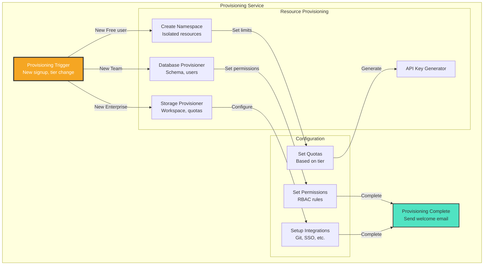

# Phase 7 - Component (Auto Provisioning)

**Diagram Type:** C3 - Component (Auto Provisioning)
**Phase:** 7 - Enterprise Scale & Self-Service
**Status:** 📋 Planned (GTM Phase)
**Last Updated:** 2025-11-20

## Introduction

This diagram provides the **component-level structure** of the CODITECT Phase 7 architecture: Enterprise Scale & Self-Service. It shows the major systems, their interactions, and key architectural decisions at this phase of platform evolution.

**Key Insight:** Phase 7 builds upon previous phases, adding critical capabilities that enable the next level of platform maturity.

## What This Diagram Shows

- **Architecture Level:** C3 - Component (Auto Provisioning)
- **Phase Focus:** Enterprise Scale & Self-Service
- **Key Components:** Major systems and their relationships
- **Integration Points:** External dependencies and data flows

## Key Elements

### Users
- Developers accessing the platform
- Team administrators managing licenses
- System operators monitoring performance

### Systems
- **Primary Platform:** Core CODITECT services
- **External Dependencies:** Cloud providers, APIs, integrations
- **Data Stores:** Databases, caching layers, persistent storage

### Integrations
- GitHub for source control
- Anthropic Claude API for AI agents
- Extension registries (NPM, Open VSX)

## Detailed Explanation

### Architecture Overview

Phase 7 introduces critical capabilities that advance the CODITECT platform toward full autonomous operation. This diagram shows how these components work together to deliver enterprise scale & self-service.

### Component Interactions

The components shown in this diagram interact through well-defined interfaces:
- **API Calls:** RESTful APIs for synchronous operations
- **Message Passing:** Asynchronous communication via message bus (Phase 6+)
- **Data Flows:** Persistent storage and state management
- **Authentication:** Secure access control and authorization

## Architecture Patterns

### Pattern 1: Scalable Architecture
**Decision:** Design for horizontal scaling from the start
**Rationale:**
- Supports growth from 100 to 50,000+ users
- Enables independent component scaling
- Maintains performance under load
- Reduces operational complexity

### Pattern 2: Security First
**Decision:** Built-in security at every layer
**Rationale:**
- Enterprise-grade requirements
- Multi-tenant isolation
- Compliance (SOC2, GDPR)
- Zero-trust architecture

### Pattern 3: Cloud-Native Design
**Decision:** Kubernetes-based orchestration
**Rationale:**
- Platform portability
- Auto-scaling and self-healing
- Industry-standard deployment
- DevOps automation

## Technical Details

### Technology Stack

**Platform:**
- Google Kubernetes Engine (GKE)
- Cloud Load Balancer
- Persistent Disk SSD storage

**Runtime:**
- Rust/Actix-web backend
- React 18 frontend
- FoundationDB/PostgreSQL data layer

**Observability:**
- Prometheus metrics
- Grafana dashboards
- Structured logging

### Performance Characteristics

**Latency Targets:**
- API responses: <200ms (p95)
- Page loads: <2 seconds
- Agent execution: 2-10 seconds (LLM-bound)

**Scalability:**
- Horizontal pod scaling
- Database read replicas
- CDN for static assets

## Limitations & Future Evolution

### Current Phase Limitations

❌ **Not Yet Enterprise-Ready**
- No self-service onboarding
- Manual provisioning required
- Limited compliance features

### Next Phase Additions

Future Evolution:
- Global expansion (multi-region)
- Advanced AI capabilities
- Ecosystem integrations
- Community features

## Diagram

## Related Documentation

- **Phase Overview:** [README.md](README.md)
- **C1 - System Context:** [phase7-c1-system-context.md](phase7-c1-system-context.md)
- **C2 - Container (Self-Service):** [phase7-c2-self-service.md](phase7-c2-self-service.md)
- **C3 - Component (Offboarding):** [phase7-c3-offboarding.md](phase7-c3-offboarding.md)
- **Architecture Evolution:** [../../docs/CODITECT-C4-ARCHITECTURE-EVOLUTION.md](../../docs/CODITECT-C4-ARCHITECTURE-EVOLUTION.md)
- **Master Plan:** [../../docs/CODITECT-MASTER-ORCHESTRATION-PLAN.md](../../docs/CODITECT-MASTER-ORCHESTRATION-PLAN.md)

---

**Maintained By:** AZ1.AI CODITECT Team
**Repository:** https://github.com/coditect-ai/coditect-rollout-master
**Framework:** https://github.com/coditect-ai/coditect-core
