# CODITECT Platform Architecture Evolution
**C4 Model Diagrams - Phase-by-Phase Platform Development**

**Author**: Hal Casteel, Founder/CEO/CTO, AZ1.AI INC.
**Date**: November 15, 2025
**Methodology**: C4 Model (Context → Container → Component → Code)

---

## Table of Contents

1. [Architecture Evolution Overview](#architecture-evolution-overview)
2. [Phase 1: .coditect/.claude Framework (Current Pilot)](#phase-1-coditect-claude-framework-current-pilot)
3. [Phase 2: Full IDE in the Cloud](#phase-2-full-ide-in-the-cloud)
4. [Phase 3: Workflow Analyzer Integration](#phase-3-workflow-analyzer-integration)
5. [Phase 4: License/User/Session Management](#phase-4-license-user-session-management)
6. [Phase 5: Agent Marketplace & Analytics](#phase-5-agent-marketplace--analytics)
7. [Phase 6: Multi-Agent Orchestration](#phase-6-multi-agent-orchestration)
8. [Phase 7: Enterprise Scale & Self-Service](#phase-7-enterprise-scale--self-service)
9. [Scaling Strategy](#scaling-strategy)
10. [Self-Service Onboarding/Offboarding](#self-service-onboarding-offboarding)

---

## Architecture Evolution Overview

### Phased Rollout Strategy

The CODITECT platform evolves through **7 distinct phases**, each adding capabilities while maintaining backward compatibility:

```
Phase 1: .claude Framework (Pilot, <5 users)
    ↓
Phase 2: Full IDE in Cloud (Beta, 100 users)
    ↓
Phase 3: Workflow Analyzer (Beta expansion, 500 users)
    ↓
Phase 4: License/User/Session Mgmt (Platform foundation, 1,000 users)
    ↓
Phase 5: Marketplace & Analytics (Growth phase, 5,000 users)
    ↓
Phase 6: Multi-Agent Orchestration (Autonomy, 10,000 users)
    ↓
Phase 7: Enterprise Scale (Full GTM, 50,000+ users)
```

### C4 Model Levels

Each phase will be documented at **4 levels of abstraction**:

1. **C1 - System Context**: How users interact with CODITECT and external systems
2. **C2 - Container**: Major applications and data stores
3. **C3 - Component**: Internal structure of key containers
4. **C4 - Code**: Critical implementation details (for complex components)

---

## Phase 1: .coditect/.claude Framework (Current Pilot)

**Status**: 🚀 Active Pilot (<5 users)
**Timeline**: Current state
**User Scale**: <5 users
**Deployment**: Local development only

### C1 - System Context Diagram

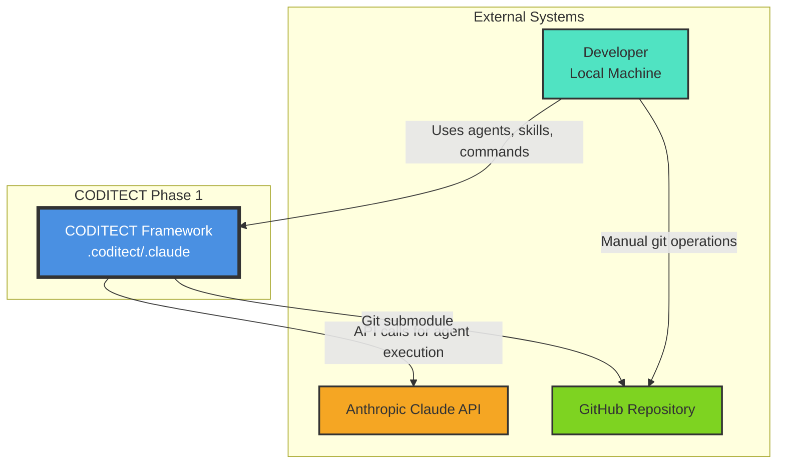
```mermaid
graph TB
    subgraph "External Systems"
        User[Developer<br/>Local Machine]
        Claude[Anthropic Claude API]
        GitHub[GitHub Repository]
    end

    subgraph "CODITECT Phase 1"
        CoditectFramework[CODITECT Framework<br/>.coditect/.claude]
    end

    User -->|Uses agents, skills, commands| CoditectFramework
    CoditectFramework -->|API calls for agent execution| Claude
    CoditectFramework -->|Git submodule| GitHub
    User -->|Manual git operations| GitHub

    style CoditectFramework fill:#4A90E2,stroke:#333,stroke-width:4px,color:#fff
    style User fill:#50E3C2,stroke:#333,stroke-width:2px
    style Claude fill:#F5A623,stroke:#333,stroke-width:2px
    style GitHub fill:#7ED321,stroke:#333,stroke-width:2px
```

**Key Characteristics**:
- **No central server** - purely local framework
- **Manual setup** - user adds git submodule + symlink
- **No authentication** - user's own Anthropic API key
- **No tracking** - no usage analytics or session management
- **Human-in-the-loop** - agents cannot communicate with each other

### C2 - Container Diagram

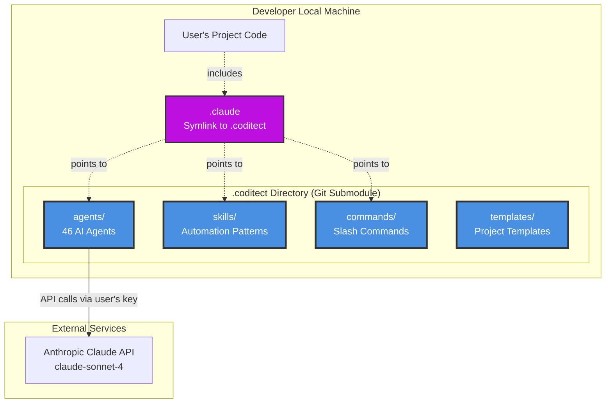
```mermaid
graph TB
    subgraph "Developer Local Machine"
        subgraph ".coditect Directory (Git Submodule)"
            Agents[agents/<br/>46 AI Agents]
            Skills[skills/<br/>Automation Patterns]
            Commands[commands/<br/>Slash Commands]
            Templates[templates/<br/>Project Templates]
        end

        ClaudeSymlink[.claude<br/>Symlink to .coditect]

        LocalProject[User's Project Code]
    end

    subgraph "External Services"
        AnthropicAPI[Anthropic Claude API<br/>claude-sonnet-4]
    end

    LocalProject -.->|includes| ClaudeSymlink
    ClaudeSymlink -.->|points to| Agents
    ClaudeSymlink -.->|points to| Skills
    ClaudeSymlink -.->|points to| Commands

    Agents -->|API calls via user's key| AnthropicAPI

    style Agents fill:#4A90E2,stroke:#333,stroke-width:3px,color:#fff
    style Skills fill:#4A90E2,stroke:#333,stroke-width:3px,color:#fff
    style Commands fill:#4A90E2,stroke:#333,stroke-width:3px,color:#fff
    style Templates fill:#4A90E2,stroke:#333,stroke-width:3px,color:#fff
    style ClaudeSymlink fill:#BD10E0,stroke:#333,stroke-width:2px,color:#fff
```

**Key Containers**:
1. **agents/** - 46 specialized AI agents (orchestrator, codebase-analyzer, etc.)
2. **skills/** - Automation patterns and workflows
3. **commands/** - 72 slash commands for Claude Code
4. **templates/** - Project initialization templates
5. **.claude symlink** - Compatibility layer for Claude Code

### C3 - Component Diagram (Agent Execution)

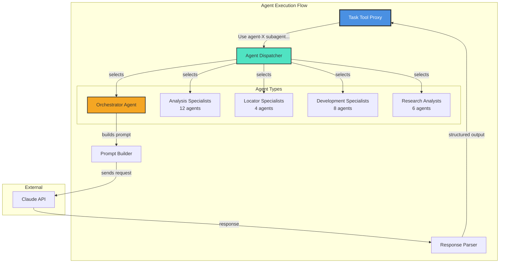
```mermaid
graph TB
    subgraph "Agent Execution Flow"
        TaskProxy[Task Tool Proxy]
        AgentDispatcher[Agent Dispatcher]

        subgraph "Agent Types"
            Orchestrator[Orchestrator Agent]
            Analyzer[Analysis Specialists<br/>12 agents]
            Locator[Locator Specialists<br/>4 agents]
            Developer[Development Specialists<br/>8 agents]
            Research[Research Analysts<br/>6 agents]
        end

        PromptBuilder[Prompt Builder]
        ResponseParser[Response Parser]
    end

    subgraph "External"
        ClaudeAPI[Claude API]
    end

    TaskProxy -->|"Use agent-X subagent..."| AgentDispatcher
    AgentDispatcher -->|selects| Orchestrator
    AgentDispatcher -->|selects| Analyzer
    AgentDispatcher -->|selects| Locator
    AgentDispatcher -->|selects| Developer
    AgentDispatcher -->|selects| Research

    Orchestrator -->|builds prompt| PromptBuilder
    PromptBuilder -->|sends request| ClaudeAPI
    ClaudeAPI -->|response| ResponseParser
    ResponseParser -->|structured output| TaskProxy

    style TaskProxy fill:#4A90E2,stroke:#333,stroke-width:3px,color:#fff
    style AgentDispatcher fill:#50E3C2,stroke:#333,stroke-width:2px
    style Orchestrator fill:#F5A623,stroke:#333,stroke-width:2px
```

**Component Responsibilities**:
- **Task Tool Proxy**: Claude Code integration point
- **Agent Dispatcher**: Routes requests to appropriate specialized agent
- **Prompt Builder**: Constructs agent-specific prompts with context
- **Response Parser**: Extracts structured data from LLM responses

### Phase 1 Limitations

❌ **No inter-agent communication** - human must copy/paste between agents
❌ **No central authentication** - each user manages own API keys
❌ **No usage tracking** - no metrics or analytics
❌ **No session persistence** - context lost between sessions
❌ **No multi-user coordination** - agents unaware of other users' work
❌ **No automated workflows** - everything requires manual triggering

---

## Phase 2: Full IDE in the Cloud

**Status**: ✅ Deployed (https://coditect.ai)
**Timeline**: Currently operational (Build #32)
**User Scale**: Open to public (ungated)
**Deployment**: GKE with 3 hybrid pods

### C1 - System Context Diagram

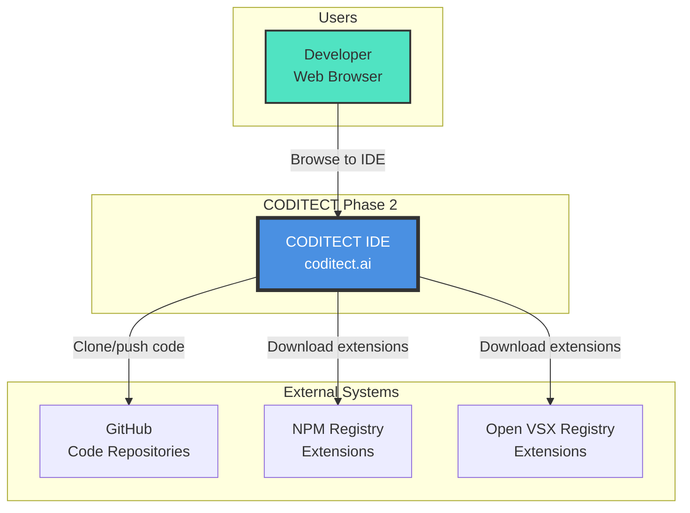
```mermaid
graph TB
    subgraph "Users"
        Developer[Developer<br/>Web Browser]
    end

    subgraph "CODITECT Phase 2"
        IDE[CODITECT IDE<br/>coditect.ai]
    end

    subgraph "External Systems"
        GitHub[GitHub<br/>Code Repositories]
        NPM[NPM Registry<br/>Extensions]
        OpenVSX[Open VSX Registry<br/>Extensions]
    end

    Developer -->|Browse to IDE| IDE
    IDE -->|Clone/push code| GitHub
    IDE -->|Download extensions| NPM
    IDE -->|Download extensions| OpenVSX

    style IDE fill:#4A90E2,stroke:#333,stroke-width:4px,color:#fff
    style Developer fill:#50E3C2,stroke:#333,stroke-width:2px
```

**Key Additions**:
- **Browser-based access** - no local installation required
- **Cloud hosting** - GKE with auto-scaling
- **Extension marketplace** - VS Code extensions available
- **Still no authentication** - open access (temporary)

### C2 - Container Diagram

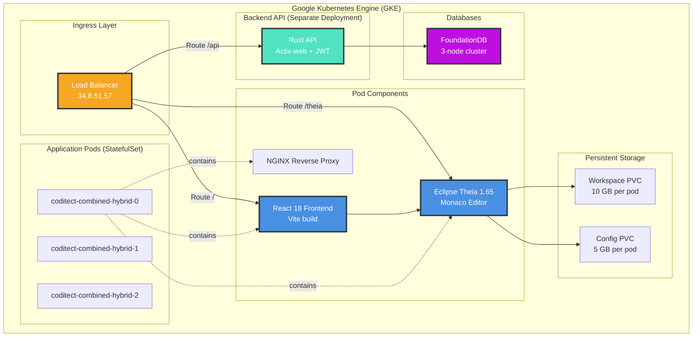
```mermaid
graph TB
    subgraph "Google Kubernetes Engine (GKE)"
        subgraph "Ingress Layer"
            LB[Load Balancer<br/>34.8.51.57]
        end

        subgraph "Application Pods (StatefulSet)"
            Pod1[coditect-combined-hybrid-0]
            Pod2[coditect-combined-hybrid-1]
            Pod3[coditect-combined-hybrid-2]
        end

        subgraph "Pod Components"
            ReactFE[React 18 Frontend<br/>Vite build]
            TheiaIDE[Eclipse Theia 1.65<br/>Monaco Editor]
            NGINX[NGINX Reverse Proxy]
        end

        subgraph "Persistent Storage"
            PVC1[Workspace PVC<br/>10 GB per pod]
            PVC2[Config PVC<br/>5 GB per pod]
        end

        subgraph "Backend API (Separate Deployment)"
            RustAPI[Rust API<br/>Actix-web + JWT]
        end

        subgraph "Databases"
            FDB[FoundationDB<br/>3-node cluster]
        end
    end

    LB -->|Route /| ReactFE
    LB -->|Route /theia| TheiaIDE
    LB -->|Route /api| RustAPI

    ReactFE --> TheiaIDE
    TheiaIDE --> PVC1
    TheiaIDE --> PVC2
    RustAPI --> FDB

    Pod1 -.->|contains| ReactFE
    Pod1 -.->|contains| TheiaIDE
    Pod1 -.->|contains| NGINX

    style LB fill:#F5A623,stroke:#333,stroke-width:3px,color:#fff
    style ReactFE fill:#4A90E2,stroke:#333,stroke-width:3px,color:#fff
    style TheiaIDE fill:#4A90E2,stroke:#333,stroke-width:3px,color:#fff
    style RustAPI fill:#50E3C2,stroke:#333,stroke-width:3px,color:#fff
    style FDB fill:#BD10E0,stroke:#333,stroke-width:3px,color:#fff
```

**Key Containers**:
1. **React Frontend** - Apple-quality UI wrapper
2. **Eclipse Theia** - Full IDE with Monaco editor, terminal, file explorer
3. **NGINX** - Reverse proxy and static file serving
4. **Rust API** - Backend with JWT auth (basic)
5. **FoundationDB** - Session and state storage
6. **Persistent Volumes** - User workspace and configuration

### C3 - Component Diagram (Theia IDE)

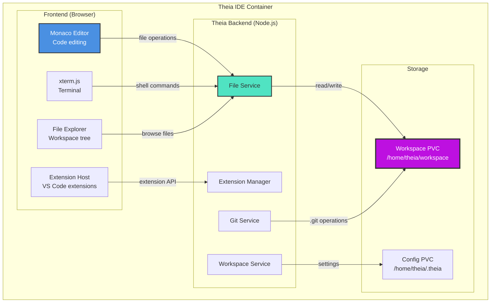
```mermaid
graph TB
    subgraph "Theia IDE Container"
        subgraph "Frontend (Browser)"
            MonacoEditor[Monaco Editor<br/>Code editing]
            Terminal[xterm.js<br/>Terminal]
            FileExplorer[File Explorer<br/>Workspace tree]
            Extensions[Extension Host<br/>VS Code extensions]
        end

        subgraph "Theia Backend (Node.js)"
            FileService[File Service]
            GitService[Git Service]
            WorkspaceService[Workspace Service]
            ExtensionManager[Extension Manager]
        end

        subgraph "Storage"
            WorkspacePVC[Workspace PVC<br/>/home/theia/workspace]
            ConfigPVC[Config PVC<br/>/home/theia/.theia]
        end
    end

    MonacoEditor -->|file operations| FileService
    Terminal -->|shell commands| FileService
    FileExplorer -->|browse files| FileService
    Extensions -->|extension API| ExtensionManager

    FileService -->|read/write| WorkspacePVC
    WorkspaceService -->|settings| ConfigPVC
    GitService -->|.git operations| WorkspacePVC

    style MonacoEditor fill:#4A90E2,stroke:#333,stroke-width:2px,color:#fff
    style FileService fill:#50E3C2,stroke:#333,stroke-width:2px
    style WorkspacePVC fill:#BD10E0,stroke:#333,stroke-width:3px,color:#fff
```

### Phase 2 Current Status

✅ **Browser-based IDE** - full VS Code-like experience
✅ **Cloud deployment** - GKE with 3 pods, auto-scaling ready
✅ **Persistent workspace** - user files saved across sessions
✅ **Extension support** - 20+ VS Code extensions
✅ **Git integration** - clone, commit, push from IDE
✅ **Terminal access** - full shell in browser

⏳ **Sprint 3 NOT STARTED**:
- ❌ LM Studio multi-LLM integration
- ❌ MCP (Model Context Protocol)
- ❌ A2A (Agent-to-Agent) protocol
- ❌ Multi-session architecture

---

## Phase 3: Workflow Analyzer Integration

**Status**: ✅ Deployed (https://workflow.coditect.ai)
**Timeline**: Currently operational (v2.0-alpha)
**User Scale**: Open to public (ungated)
**Deployment**: Separate deployment (needs GKE migration)

### C1 - System Context Diagram

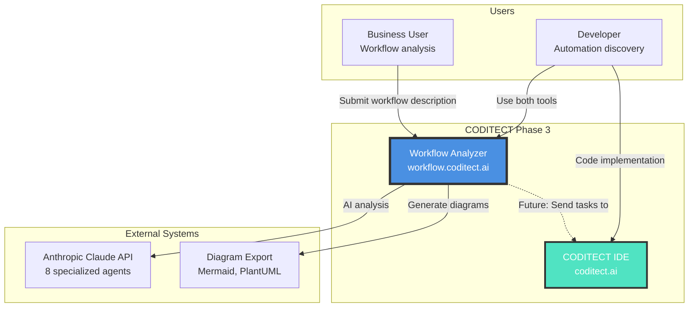
```mermaid
graph TB
    subgraph "Users"
        BusinessUser[Business User<br/>Workflow analysis]
        Developer2[Developer<br/>Automation discovery]
    end

    subgraph "CODITECT Phase 3"
        WorkflowAnalyzer[Workflow Analyzer<br/>workflow.coditect.ai]
        IDE2[CODITECT IDE<br/>coditect.ai]
    end

    subgraph "External Systems"
        ClaudeAPI2[Anthropic Claude API<br/>8 specialized agents]
        ExportTools[Diagram Export<br/>Mermaid, PlantUML]
    end

    BusinessUser -->|Submit workflow description| WorkflowAnalyzer
    Developer2 -->|Use both tools| WorkflowAnalyzer
    Developer2 -->|Code implementation| IDE2

    WorkflowAnalyzer -->|AI analysis| ClaudeAPI2
    WorkflowAnalyzer -->|Generate diagrams| ExportTools
    WorkflowAnalyzer -.->|Future: Send tasks to| IDE2

    style WorkflowAnalyzer fill:#4A90E2,stroke:#333,stroke-width:4px,color:#fff
    style IDE2 fill:#50E3C2,stroke:#333,stroke-width:3px,color:#fff
```

**Key Integration**:
- **Workflow discovery** → **IDE implementation** (currently manual)
- **Future**: Workflow Analyzer generates tasks directly in IDE

### C2 - Container Diagram

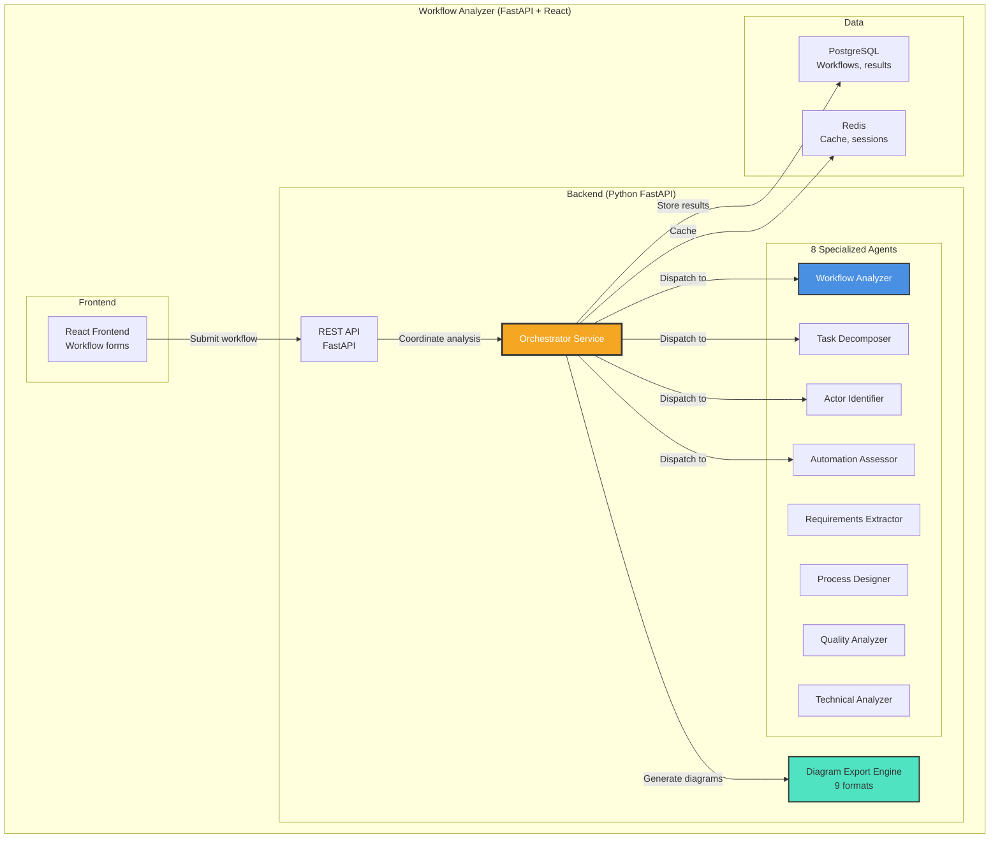
```mermaid
graph TB
    subgraph "Workflow Analyzer (FastAPI + React)"
        subgraph "Frontend"
            ReactUI[React Frontend<br/>Workflow forms]
        end

        subgraph "Backend (Python FastAPI)"
            API[REST API<br/>FastAPI]

            subgraph "8 Specialized Agents"
                WA[Workflow Analyzer]
                TD[Task Decomposer]
                AI[Actor Identifier]
                AA[Automation Assessor]
                RE[Requirements Extractor]
                PD[Process Designer]
                QA[Quality Analyzer]
                TA[Technical Analyzer]
            end

            Orchestrator2[Orchestrator Service]
            DiagramEngine[Diagram Export Engine<br/>9 formats]
        end

        subgraph "Data"
            PostgreSQL2[PostgreSQL<br/>Workflows, results]
            Redis2[Redis<br/>Cache, sessions]
        end
    end

    ReactUI -->|Submit workflow| API
    API -->|Coordinate analysis| Orchestrator2
    Orchestrator2 -->|Dispatch to| WA
    Orchestrator2 -->|Dispatch to| TD
    Orchestrator2 -->|Dispatch to| AI
    Orchestrator2 -->|Dispatch to| AA

    Orchestrator2 -->|Store results| PostgreSQL2
    Orchestrator2 -->|Cache| Redis2
    Orchestrator2 -->|Generate diagrams| DiagramEngine

    style Orchestrator2 fill:#F5A623,stroke:#333,stroke-width:3px,color:#fff
    style WA fill:#4A90E2,stroke:#333,stroke-width:2px,color:#fff
    style DiagramEngine fill:#50E3C2,stroke:#333,stroke-width:2px
```

**Key Components**:
1. **8 AI Agents** - Multi-dimensional workflow analysis
2. **Orchestrator** - Coordinates agent execution
3. **Diagram Engine** - 9 export formats (SVG, PDF, PNG, Mermaid, PlantUML)
4. **PostgreSQL** - Workflow storage and results
5. **Redis** - Caching and session management

### C3 - Component Diagram (Agent Orchestration)


```mermaid
graph TB
    subgraph "Orchestrator Service"
        WorkflowRouter[Workflow Router]
        AgentCoordinator[Agent Coordinator]
        ResultAggregator[Result Aggregator]

        subgraph "Agent Execution Pipeline"
            Phase1[Phase 1: Analysis<br/>Workflow Analyzer]
            Phase2[Phase 2: Decomposition<br/>Task Decomposer, Actor ID]
            Phase3[Phase 3: Assessment<br/>Automation, Requirements]
            Phase4[Phase 4: Design<br/>Process, Quality, Technical]
        end

        ArtifactGen[Artifact Generator]
    end

    WorkflowRouter -->|Route by domain| AgentCoordinator
    AgentCoordinator -->|Execute| Phase1
    Phase1 -->|Results| Phase2
    Phase2 -->|Results| Phase3
    Phase3 -->|Results| Phase4
    Phase4 -->|All results| ResultAggregator
    ResultAggregator -->|Generate| ArtifactGen
    ArtifactGen -->|Markdown docs<br/>Diagrams<br/>Templates| WorkflowRouter

    style AgentCoordinator fill:#F5A623,stroke:#333,stroke-width:3px,color:#fff
    style ArtifactGen fill:#50E3C2,stroke:#333,stroke-width:2px
```

### Phase 3 Integration Opportunity

**Current State**: Workflow Analyzer and IDE are **separate, disconnected**

**Future Integration** (Phase 4+):
```
User analyzes workflow in Workflow Analyzer
    ↓
Workflow Analyzer generates implementation tasks
    ↓
Tasks automatically appear in IDE Activity Feed
    ↓
Developer (or AI agents) implement tasks in IDE
    ↓
IDE reports completion back to Workflow Analyzer
```

**Requirements**:
- Shared authentication (both systems know same user)
- Shared task/activity database
- API integration between systems
- Activity feed in IDE (coditect-activity-data-model-ui)

---

## Phase 4: License/User/Session Management

**Status**: 🔨 In Development (not started)
**Timeline**: Months 2-4 (after infrastructure)
**User Scale**: 100-1,000 users
**Deployment**: Central cloud backend + frontend

### C1 - System Context Diagram

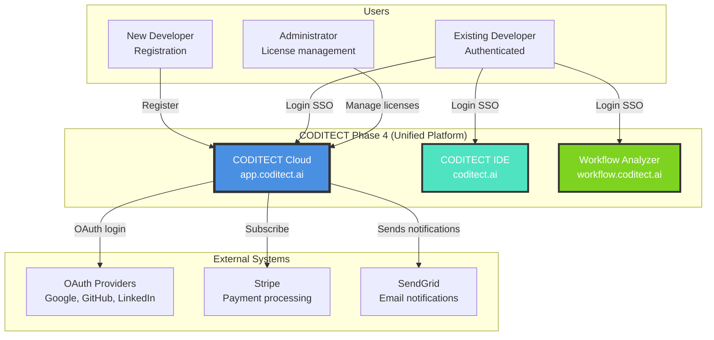
```mermaid
graph TB
    subgraph "Users"
        NewUser[New Developer<br/>Registration]
        ExistingUser[Existing Developer<br/>Authenticated]
        Admin[Administrator<br/>License management]
    end

    subgraph "CODITECT Phase 4 (Unified Platform)"
        CloudDashboard[CODITECT Cloud<br/>app.coditect.ai]
        IDE3[CODITECT IDE<br/>coditect.ai]
        Workflow3[Workflow Analyzer<br/>workflow.coditect.ai]
    end

    subgraph "External Systems"
        OAuth[OAuth Providers<br/>Google, GitHub, LinkedIn]
        Stripe[Stripe<br/>Payment processing]
        Email[SendGrid<br/>Email notifications]
    end

    NewUser -->|Register| CloudDashboard
    CloudDashboard -->|OAuth login| OAuth
    CloudDashboard -->|Subscribe| Stripe

    ExistingUser -->|Login SSO| CloudDashboard
    ExistingUser -->|Login SSO| IDE3
    ExistingUser -->|Login SSO| Workflow3

    Admin -->|Manage licenses| CloudDashboard

    CloudDashboard -->|Sends notifications| Email

    style CloudDashboard fill:#4A90E2,stroke:#333,stroke-width:4px,color:#fff
    style IDE3 fill:#50E3C2,stroke:#333,stroke-width:3px,color:#fff
    style Workflow3 fill:#7ED321,stroke:#333,stroke-width:3px,color:#fff
```

**Key Additions**:
- **Unified authentication** - SSO across all CODITECT services
- **License management** - freemium → paid tiers
- **Session coordination** - persistent state across all tools
- **Admin portal** - user management, billing, analytics

### C2 - Container Diagram

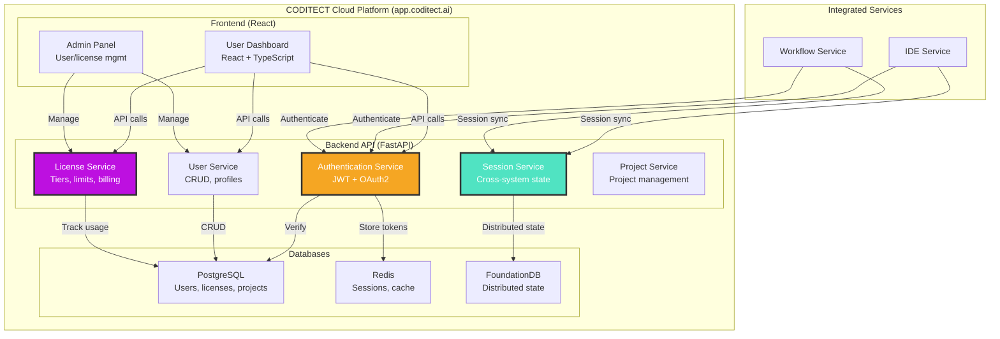
```mermaid
graph TB
    subgraph "CODITECT Cloud Platform (app.coditect.ai)"
        subgraph "Frontend (React)"
            Dashboard[User Dashboard<br/>React + TypeScript]
            AdminPanel[Admin Panel<br/>User/license mgmt]
        end

        subgraph "Backend API (FastAPI)"
            AuthService[Authentication Service<br/>JWT + OAuth2]
            UserService[User Service<br/>CRUD, profiles]
            LicenseService[License Service<br/>Tiers, limits, billing]
            SessionService[Session Service<br/>Cross-system state]
            ProjectService[Project Service<br/>Project management]
        end

        subgraph "Databases"
            PostgreSQL3[PostgreSQL<br/>Users, licenses, projects]
            Redis3[Redis<br/>Sessions, cache]
            FDB2[FoundationDB<br/>Distributed state]
        end
    end

    subgraph "Integrated Services"
        IDE4[IDE Service]
        Workflow4[Workflow Service]
    end

    Dashboard -->|API calls| AuthService
    Dashboard -->|API calls| UserService
    Dashboard -->|API calls| LicenseService
    AdminPanel -->|Manage| UserService
    AdminPanel -->|Manage| LicenseService

    AuthService -->|Store tokens| Redis3
    AuthService -->|Verify| PostgreSQL3
    UserService -->|CRUD| PostgreSQL3
    LicenseService -->|Track usage| PostgreSQL3
    SessionService -->|Distributed state| FDB2

    IDE4 -->|Authenticate| AuthService
    Workflow4 -->|Authenticate| AuthService
    IDE4 -->|Session sync| SessionService
    Workflow4 -->|Session sync| SessionService

    style AuthService fill:#F5A623,stroke:#333,stroke-width:3px,color:#fff
    style LicenseService fill:#BD10E0,stroke:#333,stroke-width:3px,color:#fff
    style SessionService fill:#50E3C2,stroke:#333,stroke-width:3px,color:#fff
```

**Key Containers**:
1. **Authentication Service** - JWT + OAuth2 + MFA
2. **User Service** - User profiles, preferences, teams
3. **License Service** - Freemium tiers, usage limits, billing
4. **Session Service** - Cross-system state synchronization
5. **Project Service** - Project management, collaboration
6. **PostgreSQL** - Primary data store
7. **Redis** - Session cache, rate limiting
8. **FoundationDB** - Distributed state coordination

### C3 - Component Diagram (Authentication Flow)

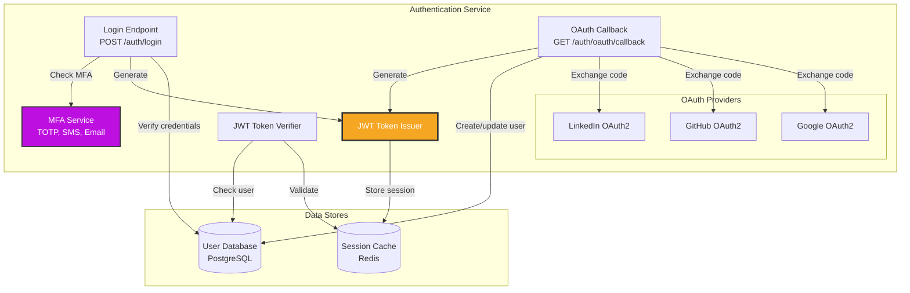
```mermaid
graph TB
    subgraph "Authentication Service"
        LoginEndpoint[Login Endpoint<br/>POST /auth/login]
        OAuthCallback[OAuth Callback<br/>GET /auth/oauth/callback]
        TokenIssuer[JWT Token Issuer]
        TokenVerifier[JWT Token Verifier]
        MFAService[MFA Service<br/>TOTP, SMS, Email]

        subgraph "OAuth Providers"
            GoogleOAuth[Google OAuth2]
            GitHubOAuth[GitHub OAuth2]
            LinkedInOAuth[LinkedIn OAuth2]
        end
    end

    subgraph "Data Stores"
        UserDB[(User Database<br/>PostgreSQL)]
        SessionCache[(Session Cache<br/>Redis)]
    end

    LoginEndpoint -->|Verify credentials| UserDB
    LoginEndpoint -->|Generate| TokenIssuer
    LoginEndpoint -->|Check MFA| MFAService

    OAuthCallback -->|Exchange code| GoogleOAuth
    OAuthCallback -->|Exchange code| GitHubOAuth
    OAuthCallback -->|Exchange code| LinkedInOAuth
    OAuthCallback -->|Create/update user| UserDB
    OAuthCallback -->|Generate| TokenIssuer

    TokenIssuer -->|Store session| SessionCache
    TokenVerifier -->|Validate| SessionCache
    TokenVerifier -->|Check user| UserDB

    style TokenIssuer fill:#F5A623,stroke:#333,stroke-width:3px,color:#fff
    style MFAService fill:#BD10E0,stroke:#333,stroke-width:2px,color:#fff
```

**Authentication Flow**:
1. User initiates login (email/password or OAuth)
2. System verifies credentials
3. MFA challenge (if enabled)
4. JWT token issued with claims (user_id, tier, permissions)
5. Token stored in Redis (session management)
6. All CODITECT services verify token with Auth Service

### C3 - Component Diagram (License Management)

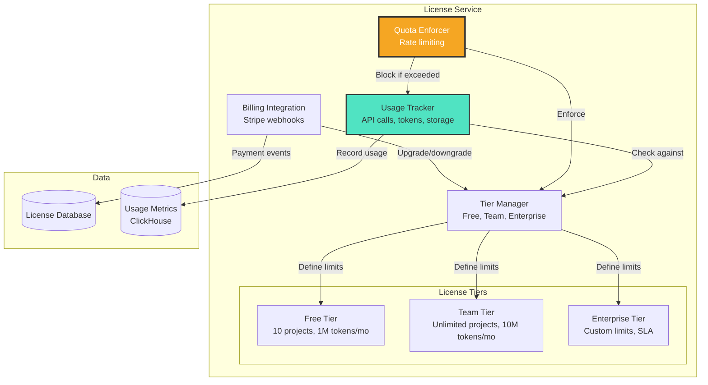
```mermaid
graph TB
    subgraph "License Service"
        TierManager[Tier Manager<br/>Free, Team, Enterprise]
        UsageTracker[Usage Tracker<br/>API calls, tokens, storage]
        QuotaEnforcer[Quota Enforcer<br/>Rate limiting]
        BillingIntegration[Billing Integration<br/>Stripe webhooks]

        subgraph "License Tiers"
            Free[Free Tier<br/>10 projects, 1M tokens/mo]
            Team[Team Tier<br/>Unlimited projects, 10M tokens/mo]
            Enterprise[Enterprise Tier<br/>Custom limits, SLA]
        end
    end

    subgraph "Data"
        LicenseDB[(License Database)]
        UsageMetrics[(Usage Metrics<br/>ClickHouse)]
    end

    TierManager -->|Define limits| Free
    TierManager -->|Define limits| Team
    TierManager -->|Define limits| Enterprise

    UsageTracker -->|Record usage| UsageMetrics
    UsageTracker -->|Check against| TierManager
    QuotaEnforcer -->|Enforce| TierManager
    QuotaEnforcer -->|Block if exceeded| UsageTracker

    BillingIntegration -->|Upgrade/downgrade| TierManager
    BillingIntegration -->|Payment events| LicenseDB

    style QuotaEnforcer fill:#F5A623,stroke:#333,stroke-width:3px,color:#fff
    style UsageTracker fill:#50E3C2,stroke:#333,stroke-width:2px
```

**License Tiers** (proposed):

| Tier | Price | Projects | Tokens/mo | Features |
|------|-------|----------|-----------|----------|
| **Free** | $0 | 10 | 1M | IDE, Workflow Analyzer, 5 agents |
| **Team** | $29/user/mo | Unlimited | 10M | + All agents, collaboration, analytics |
| **Enterprise** | Custom | Unlimited | Custom | + SSO, SLA, dedicated support, on-prem |

### C3 - Component Diagram (Session Management)

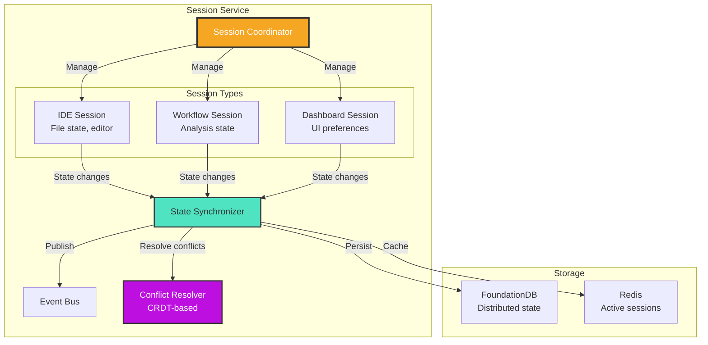
```mermaid
graph TB
    subgraph "Session Service"
        SessionCoordinator[Session Coordinator]
        StateSync[State Synchronizer]
        EventBus[Event Bus]

        subgraph "Session Types"
            IDESession[IDE Session<br/>File state, editor]
            WorkflowSession[Workflow Session<br/>Analysis state]
            DashboardSession[Dashboard Session<br/>UI preferences]
        end

        ConflictResolver[Conflict Resolver<br/>CRDT-based]
    end

    subgraph "Storage"
        FDB3[FoundationDB<br/>Distributed state]
        Redis4[Redis<br/>Active sessions]
    end

    SessionCoordinator -->|Manage| IDESession
    SessionCoordinator -->|Manage| WorkflowSession
    SessionCoordinator -->|Manage| DashboardSession

    IDESession -->|State changes| StateSync
    WorkflowSession -->|State changes| StateSync
    DashboardSession -->|State changes| StateSync

    StateSync -->|Publish| EventBus
    StateSync -->|Persist| FDB3
    StateSync -->|Cache| Redis4
    StateSync -->|Resolve conflicts| ConflictResolver

    style SessionCoordinator fill:#F5A623,stroke:#333,stroke-width:3px,color:#fff
    style StateSync fill:#50E3C2,stroke:#333,stroke-width:2px
    style ConflictResolver fill:#BD10E0,stroke:#333,stroke-width:2px,color:#fff
```

**Session Capabilities**:
- **Cross-system state** - IDE knows about Workflow Analyzer activity
- **Resume anywhere** - Start in IDE, continue in dashboard
- **Conflict resolution** - Multiple devices, CRDT-based merging
- **Event-driven updates** - Real-time sync across all connected clients

### Phase 4 Deliverables

✅ **User registration and authentication**
✅ **License tier management** (Free, Team, Enterprise)
✅ **Usage tracking and quota enforcement**
✅ **SSO across IDE, Workflow Analyzer, Dashboard**
✅ **Session synchronization** (IDE ↔ Dashboard ↔ Workflow)
✅ **Admin portal** for user/license management
✅ **Billing integration** with Stripe
✅ **Email notifications** (welcome, billing, limits)

---

## Phase 5: Agent Marketplace & Analytics

**Status**: 🔨 Planned (P1, Months 7-9)
**Timeline**: After Phase 4 complete
**User Scale**: 1,000-5,000 users
**Goal**: Community growth + usage insights

### C1 - System Context Diagram

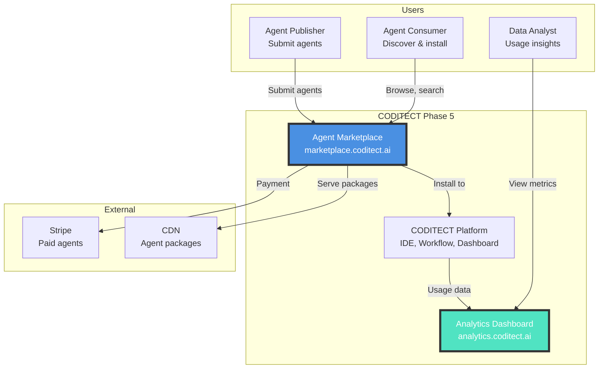
```mermaid
graph TB
    subgraph "Users"
        Consumer[Agent Consumer<br/>Discover & install]
        Publisher[Agent Publisher<br/>Submit agents]
        Analyst[Data Analyst<br/>Usage insights]
    end

    subgraph "CODITECT Phase 5"
        Marketplace[Agent Marketplace<br/>marketplace.coditect.ai]
        Analytics[Analytics Dashboard<br/>analytics.coditect.ai]
        Platform5[CODITECT Platform<br/>IDE, Workflow, Dashboard]
    end

    subgraph "External"
        StripeAPI[Stripe<br/>Paid agents]
        CDN[CDN<br/>Agent packages]
    end

    Consumer -->|Browse, search| Marketplace
    Publisher -->|Submit agents| Marketplace
    Analyst -->|View metrics| Analytics

    Marketplace -->|Install to| Platform5
    Platform5 -->|Usage data| Analytics
    Marketplace -->|Payment| StripeAPI
    Marketplace -->|Serve packages| CDN

    style Marketplace fill:#4A90E2,stroke:#333,stroke-width:4px,color:#fff
    style Analytics fill:#50E3C2,stroke:#333,stroke-width:4px,color:#fff
```

### C2 - Container Diagram (Agent Marketplace)

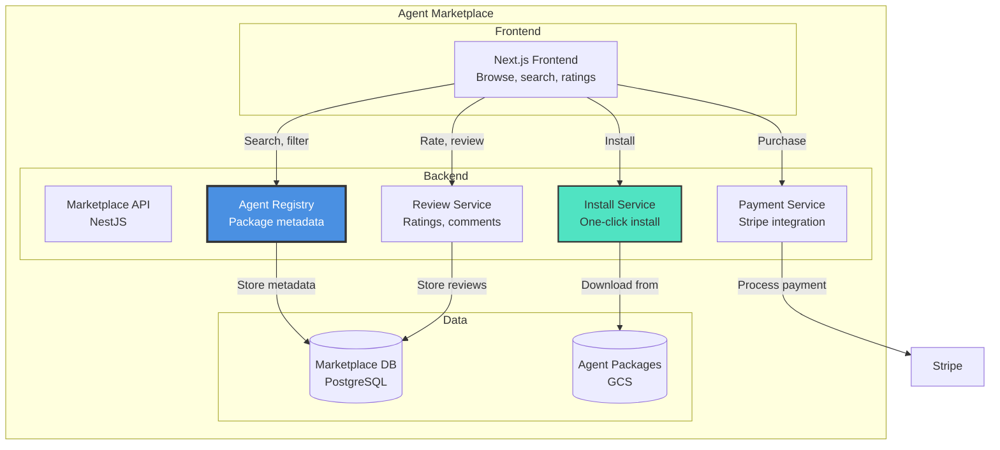
```mermaid
graph TB
    subgraph "Agent Marketplace"
        subgraph "Frontend"
            MarketplaceUI[Next.js Frontend<br/>Browse, search, ratings]
        end

        subgraph "Backend"
            MarketplaceAPI[Marketplace API<br/>NestJS]
            AgentRegistry[Agent Registry<br/>Package metadata]
            ReviewService[Review Service<br/>Ratings, comments]
            InstallService[Install Service<br/>One-click install]
            PaymentService[Payment Service<br/>Stripe integration]
        end

        subgraph "Data"
            MarketplaceDB[(Marketplace DB<br/>PostgreSQL)]
            AgentPackages[(Agent Packages<br/>GCS)]
        end
    end

    MarketplaceUI -->|Search, filter| AgentRegistry
    MarketplaceUI -->|Rate, review| ReviewService
    MarketplaceUI -->|Install| InstallService
    MarketplaceUI -->|Purchase| PaymentService

    AgentRegistry -->|Store metadata| MarketplaceDB
    ReviewService -->|Store reviews| MarketplaceDB
    InstallService -->|Download from| AgentPackages
    PaymentService -->|Process payment| Stripe

    style AgentRegistry fill:#4A90E2,stroke:#333,stroke-width:3px,color:#fff
    style InstallService fill:#50E3C2,stroke:#333,stroke-width:2px
```

### C2 - Container Diagram (Analytics Platform)

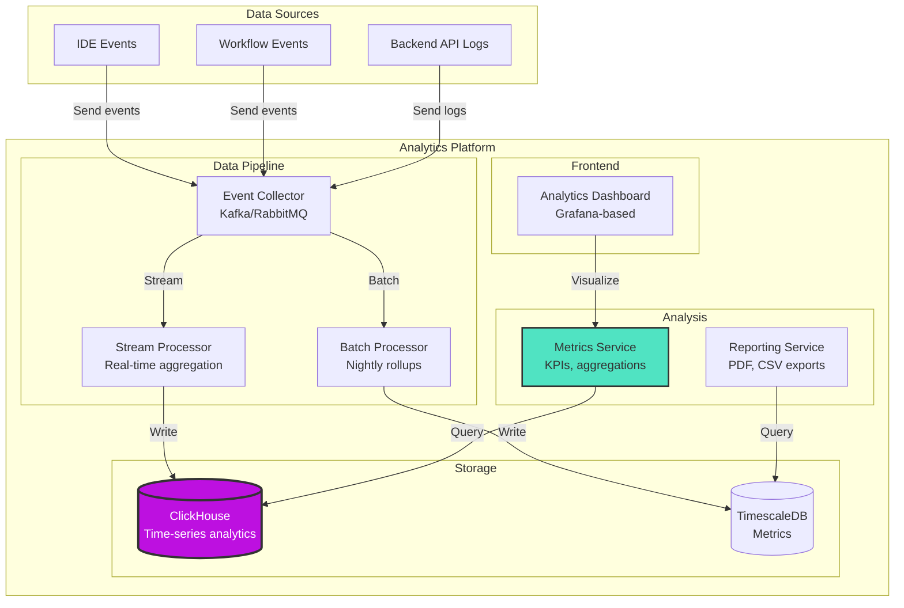
```mermaid
graph TB
    subgraph "Analytics Platform"
        subgraph "Frontend"
            AnalyticsUI[Analytics Dashboard<br/>Grafana-based]
        end

        subgraph "Data Pipeline"
            EventCollector[Event Collector<br/>Kafka/RabbitMQ]
            StreamProcessor[Stream Processor<br/>Real-time aggregation]
            BatchProcessor[Batch Processor<br/>Nightly rollups]
        end

        subgraph "Storage"
            ClickHouse[(ClickHouse<br/>Time-series analytics)]
            TimescaleDB[(TimescaleDB<br/>Metrics)]
        end

        subgraph "Analysis"
            MetricsService[Metrics Service<br/>KPIs, aggregations]
            ReportingService[Reporting Service<br/>PDF, CSV exports]
        end
    end

    subgraph "Data Sources"
        IDE5[IDE Events]
        Workflow5[Workflow Events]
        Backend5[Backend API Logs]
    end

    IDE5 -->|Send events| EventCollector
    Workflow5 -->|Send events| EventCollector
    Backend5 -->|Send logs| EventCollector

    EventCollector -->|Stream| StreamProcessor
    EventCollector -->|Batch| BatchProcessor

    StreamProcessor -->|Write| ClickHouse
    BatchProcessor -->|Write| TimescaleDB

    MetricsService -->|Query| ClickHouse
    ReportingService -->|Query| TimescaleDB
    AnalyticsUI -->|Visualize| MetricsService

    style ClickHouse fill:#BD10E0,stroke:#333,stroke-width:3px,color:#fff
    style MetricsService fill:#50E3C2,stroke:#333,stroke-width:2px
```

### Phase 5 Key Metrics

**User Metrics**:
- Daily/Monthly Active Users (DAU/MAU)
- User retention (Day 1, 7, 30)
- Feature adoption rates
- Session duration

**Agent Metrics**:
- Agent execution count
- Token usage per agent
- Success/failure rates
- Average execution time

**Business Metrics**:
- Tier distribution (Free vs Paid)
- Conversion rate (Free → Team → Enterprise)
- Monthly Recurring Revenue (MRR)
- Customer Lifetime Value (LTV)

**Platform Metrics**:
- API latency (p50, p95, p99)
- Error rates
- Infrastructure costs
- Storage usage

---

## Phase 6: Multi-Agent Orchestration

**Status**: 🔨 Planned (P1, Months 4-7)
**Timeline**: Parallel with Phase 5
**User Scale**: 5,000-10,000 users
**Goal**: Full autonomous agent coordination

### C1 - System Context Diagram

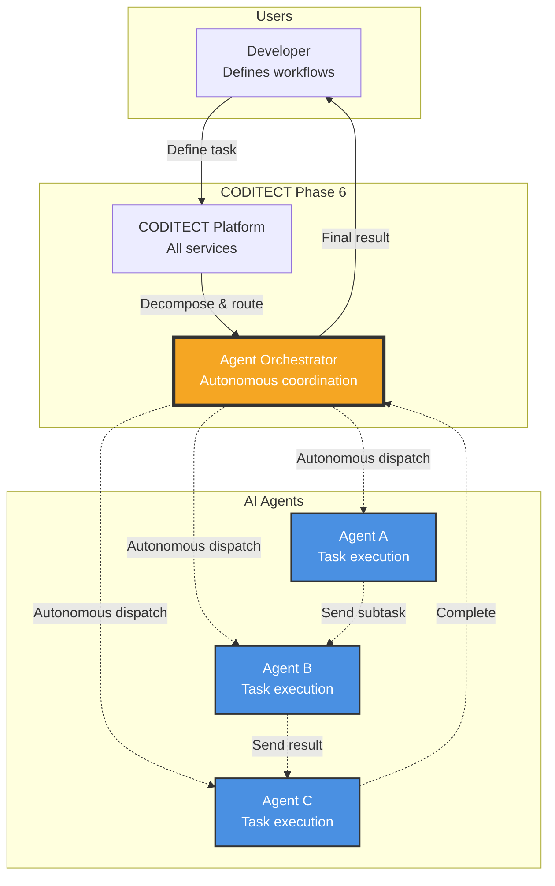
```mermaid
graph TB
    subgraph "Users"
        Developer6[Developer<br/>Defines workflows]
    end

    subgraph "CODITECT Phase 6"
        Platform6[CODITECT Platform<br/>All services]
        Orchestrator6[Agent Orchestrator<br/>Autonomous coordination]
    end

    subgraph "AI Agents"
        Agent1[Agent A<br/>Task execution]
        Agent2[Agent B<br/>Task execution]
        Agent3[Agent C<br/>Task execution]
    end

    Developer6 -->|Define task| Platform6
    Platform6 -->|Decompose & route| Orchestrator6
    Orchestrator6 -.->|Autonomous dispatch| Agent1
    Orchestrator6 -.->|Autonomous dispatch| Agent2
    Orchestrator6 -.->|Autonomous dispatch| Agent3

    Agent1 -.->|Send subtask| Agent2
    Agent2 -.->|Send result| Agent3
    Agent3 -.->|Complete| Orchestrator6
    Orchestrator6 -->|Final result| Developer6

    style Orchestrator6 fill:#F5A623,stroke:#333,stroke-width:4px,color:#fff
    style Agent1 fill:#4A90E2,stroke:#333,stroke-width:2px,color:#fff
    style Agent2 fill:#4A90E2,stroke:#333,stroke-width:2px,color:#fff
    style Agent3 fill:#4A90E2,stroke:#333,stroke-width:2px,color:#fff
```

**This phase removes the critical human-in-the-loop bottleneck from Phase 1!**

### C2 - Container Diagram (Orchestration Infrastructure)

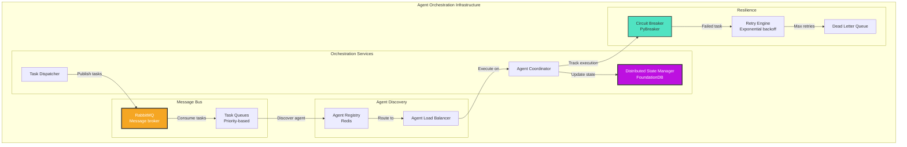
```mermaid
graph TB
    subgraph "Agent Orchestration Infrastructure"
        subgraph "Message Bus"
            RabbitMQ[RabbitMQ<br/>Message broker]
            TaskQueue[Task Queues<br/>Priority-based]
        end

        subgraph "Agent Discovery"
            Registry[Agent Registry<br/>Redis]
            LoadBalancer6[Agent Load Balancer]
        end

        subgraph "Orchestration Services"
            Dispatcher[Task Dispatcher]
            Coordinator[Agent Coordinator]
            StateManager[Distributed State Manager<br/>FoundationDB]
        end

        subgraph "Resilience"
            CircuitBreaker[Circuit Breaker<br/>PyBreaker]
            RetryEngine[Retry Engine<br/>Exponential backoff]
            DeadLetterQueue[Dead Letter Queue]
        end
    end

    Dispatcher -->|Publish tasks| RabbitMQ
    RabbitMQ -->|Consume tasks| TaskQueue
    TaskQueue -->|Discover agent| Registry
    Registry -->|Route to| LoadBalancer6
    LoadBalancer6 -->|Execute on| Coordinator

    Coordinator -->|Update state| StateManager
    Coordinator -->|Track execution| CircuitBreaker
    CircuitBreaker -->|Failed task| RetryEngine
    RetryEngine -->|Max retries| DeadLetterQueue

    style RabbitMQ fill:#F5A623,stroke:#333,stroke-width:3px,color:#fff
    style StateManager fill:#BD10E0,stroke:#333,stroke-width:3px,color:#fff
    style CircuitBreaker fill:#50E3C2,stroke:#333,stroke-width:2px
```

### C3 - Component Diagram (Inter-Agent Communication)

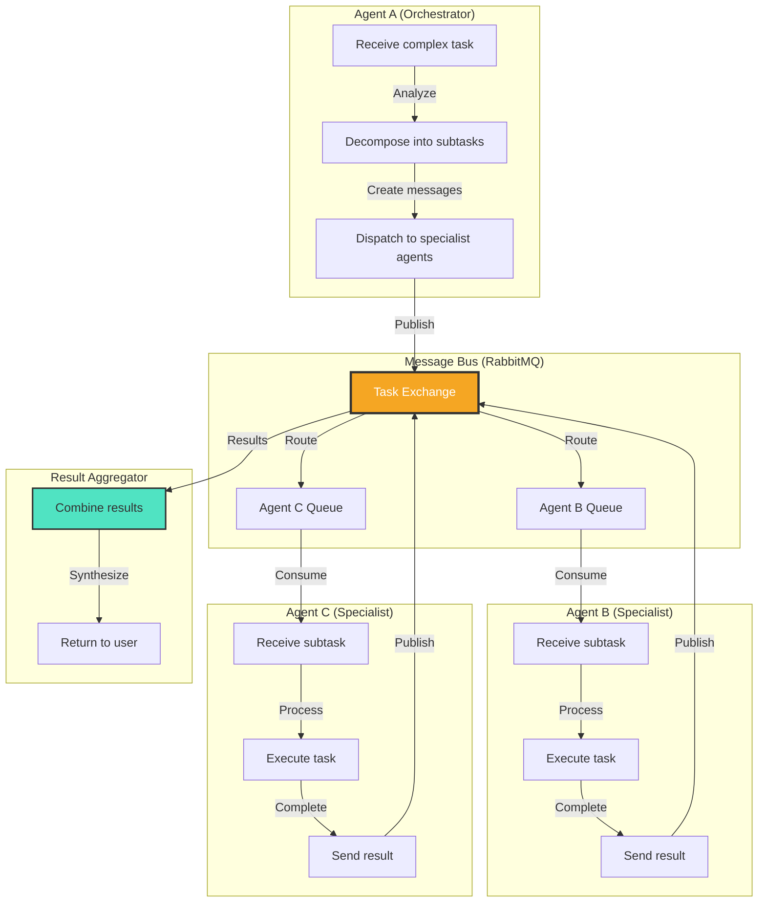
```mermaid
graph TB
    subgraph "Agent A (Orchestrator)"
        A_Input[Receive complex task]
        A_Decompose[Decompose into subtasks]
        A_Dispatch[Dispatch to specialist agents]
    end

    subgraph "Message Bus (RabbitMQ)"
        Exchange[Task Exchange]
        QueueB[Agent B Queue]
        QueueC[Agent C Queue]
    end

    subgraph "Agent B (Specialist)"
        B_Receive[Receive subtask]
        B_Execute[Execute task]
        B_Result[Send result]
    end

    subgraph "Agent C (Specialist)"
        C_Receive[Receive subtask]
        C_Execute[Execute task]
        C_Result[Send result]
    end

    subgraph "Result Aggregator"
        Aggregate[Combine results]
        FinalResult[Return to user]
    end

    A_Input -->|Analyze| A_Decompose
    A_Decompose -->|Create messages| A_Dispatch
    A_Dispatch -->|Publish| Exchange
    Exchange -->|Route| QueueB
    Exchange -->|Route| QueueC

    QueueB -->|Consume| B_Receive
    B_Receive -->|Process| B_Execute
    B_Execute -->|Complete| B_Result
    B_Result -->|Publish| Exchange

    QueueC -->|Consume| C_Receive
    C_Receive -->|Process| C_Execute
    C_Execute -->|Complete| C_Result
    C_Result -->|Publish| Exchange

    Exchange -->|Results| Aggregate
    Aggregate -->|Synthesize| FinalResult

    style Exchange fill:#F5A623,stroke:#333,stroke-width:3px,color:#fff
    style Aggregate fill:#50E3C2,stroke:#333,stroke-width:2px
```

**Communication Patterns**:
1. **Request-Reply**: Agent A asks Agent B for result, waits for response
2. **Publish-Subscribe**: Agent A publishes event, multiple agents react
3. **Work Queue**: Tasks distributed across agent pool (load balancing)
4. **Routing**: Messages routed to specific agents based on capability

### Phase 6 Deliverables

✅ **RabbitMQ message bus** for inter-agent communication
✅ **Agent discovery service** (Redis-based registry)
✅ **Task queue manager** with priority and dependency resolution
✅ **Circuit breaker** for fault tolerance
✅ **Distributed state management** (FoundationDB)
✅ **Agent-to-agent protocols** (no human-in-the-loop!)
✅ **Monitoring & observability** (Prometheus, Jaeger, Grafana)

**Impact**: .claude framework users get **95% autonomy** (vs 0% in Phase 1)

---

## Phase 7: Enterprise Scale & Self-Service

**Status**: 📋 Planned (GTM phase, Months 9-12)
**Timeline**: After all core components operational
**User Scale**: 10,000-50,000+ users
**Goal**: Full enterprise-grade platform with automated onboarding

### C1 - System Context Diagram

```mermaid
graph TB
    subgraph "User Types"
        Individual[Individual Developer]
        Team[Team (5-50 devs)]
        Enterprise[Enterprise (50-1000+ devs)]
    end

    subgraph "CODITECT Enterprise Platform"
        SelfService[Self-Service Portal<br/>app.coditect.ai]
        PlatformServices[All Platform Services<br/>IDE, Workflow, Agents, etc.]
    end

    subgraph "Enterprise Features"
        SSO[Enterprise SSO<br/>SAML, OIDC]
        AuditLog[Audit Logging<br/>SOC2 compliant]
        DataResidency[Data Residency<br/>Regional deployments]
        SLA[SLA Monitoring<br/>99.99% uptime]
    end

    subgraph "External"
        Identity[Identity Provider<br/>Okta, Azure AD]
        ComplianceTools[Compliance Tools<br/>Vanta, Drata]
    end

    Individual -->|Self-service signup| SelfService
    Team -->|Team signup| SelfService
    Enterprise -->|Enterprise contract| SelfService

    SelfService -->|Provision access| PlatformServices
    Enterprise -->|Federate auth| SSO
    SSO -->|Integrate| Identity

    PlatformServices -->|Generate logs| AuditLog
    AuditLog -->|Export| ComplianceTools

    style SelfService fill:#4A90E2,stroke:#333,stroke-width:4px,color:#fff
    style SSO fill:#BD10E0,stroke:#333,stroke-width:3px,color:#fff
    style AuditLog fill:#F5A623,stroke:#333,stroke-width:3px,color:#fff
```

### C2 - Container Diagram (Self-Service Infrastructure)

```mermaid
graph TB
    subgraph "Self-Service Portal"
        subgraph "Onboarding Flow"
            SignupForm[Signup Form<br/>Email, OAuth, SSO]
            EmailVerification[Email Verification]
            ProfileSetup[Profile Setup<br/>Name, company, role]
            TierSelection[Tier Selection<br/>Free, Team, Enterprise]
            PaymentSetup[Payment Setup<br/>Stripe, invoicing]
            Provisioning[Auto Provisioning<br/>Resources, limits]
        end

        subgraph "Account Management"
            BillingPortal[Billing Portal<br/>Invoices, usage]
            TeamManagement[Team Management<br/>Invite, remove, roles]
            SettingsPanel[Settings Panel<br/>Preferences, integrations]
        end

        subgraph "Offboarding Flow"
            CancellationForm[Cancellation Form<br/>Feedback collection]
            DataExport[Data Export<br/>Projects, settings]
            ResourceCleanup[Resource Cleanup<br/>Deprovisioning]
            FinalConfirmation[Final Confirmation]
        end
    end

    subgraph "Backend Services"
        ProvisioningService[Provisioning Service<br/>Auto-provision resources]
        BillingService[Billing Service<br/>Stripe integration]
        NotificationService[Notification Service<br/>Email, in-app]
    end

    SignupForm -->|Submit| EmailVerification
    EmailVerification -->|Verified| ProfileSetup
    ProfileSetup -->|Complete| TierSelection
    TierSelection -->|Select tier| PaymentSetup
    PaymentSetup -->|Process| ProvisioningService
    ProvisioningService -->|Create resources| Provisioning

    BillingPortal -->|Fetch data| BillingService
    TeamManagement -->|Update| ProvisioningService

    CancellationForm -->|Request| DataExport
    DataExport -->|Export complete| ResourceCleanup
    ResourceCleanup -->|Cleanup done| FinalConfirmation
    FinalConfirmation -->|Send| NotificationService

    style ProvisioningService fill:#F5A623,stroke:#333,stroke-width:3px,color:#fff
    style DataExport fill:#50E3C2,stroke:#333,stroke-width:2px
```

### C3 - Component Diagram (Auto Provisioning)

```mermaid
graph TB
    subgraph "Provisioning Service"
        TriggerHandler[Provisioning Trigger<br/>New signup, tier change]

        subgraph "Resource Provisioning"
            NamespaceCreator[Create Namespace<br/>Isolated resources]
            DatabaseProvisioner[Database Provisioner<br/>Schema, users]
            StorageProvisioner[Storage Provisioner<br/>Workspace, quotas]
            APIKeyGenerator[API Key Generator]
        end

        subgraph "Configuration"
            QuotaSetter[Set Quotas<br/>Based on tier]
            PermissionSetter[Set Permissions<br/>RBAC rules]
            IntegrationSetup[Setup Integrations<br/>Git, SSO, etc.]
        end

        CompletionHandler[Provisioning Complete<br/>Send welcome email]
    end

    TriggerHandler -->|New Free user| NamespaceCreator
    TriggerHandler -->|New Team| DatabaseProvisioner
    TriggerHandler -->|New Enterprise| StorageProvisioner

    NamespaceCreator -->|Set limits| QuotaSetter
    DatabaseProvisioner -->|Set permissions| PermissionSetter
    StorageProvisioner -->|Configure| IntegrationSetup

    QuotaSetter -->|Generate| APIKeyGenerator
    PermissionSetter -->|Complete| CompletionHandler
    IntegrationSetup -->|Complete| CompletionHandler

    style TriggerHandler fill:#F5A623,stroke:#333,stroke-width:3px,color:#fff
    style CompletionHandler fill:#50E3C2,stroke:#333,stroke-width:2px
```

**Auto-Provisioning Steps** (< 60 seconds):
1. Create isolated namespace in GKE
2. Provision PostgreSQL schema + user
3. Allocate storage quota (based on tier)
4. Generate API keys and secrets
5. Set RBAC permissions
6. Configure tier-based quotas
7. Send welcome email with onboarding guide
8. Grant access to IDE, Workflow Analyzer, Dashboard

### C3 - Component Diagram (Offboarding)

```mermaid
graph TB
    subgraph "Offboarding Service"
        CancellationRequest[Cancellation Request]

        subgraph "Data Handling"
            ExportProjects[Export Projects<br/>Zip archive]
            ExportSettings[Export Settings<br/>JSON]
            ExportAgents[Export Custom Agents]
            RetentionPeriod[30-day Retention<br/>Soft delete]
        end

        subgraph "Resource Cleanup"
            RevokeAccess[Revoke Access<br/>Disable login]
            CleanupNamespace[Cleanup Namespace<br/>GKE resources]
            PurgeDatabase[Purge Database<br/>After retention]
            DeleteStorage[Delete Storage<br/>After retention]
        end

        FinalNotification[Send Final Email<br/>Export link]
    end

    CancellationRequest -->|Initiate| ExportProjects
    ExportProjects -->|Include| ExportSettings
    ExportSettings -->|Include| ExportAgents
    ExportAgents -->|Complete| FinalNotification

    CancellationRequest -->|Immediately| RevokeAccess
    FinalNotification -->|After 30 days| CleanupNamespace
    CleanupNamespace -->|Cleanup| PurgeDatabase
    PurgeDatabase -->|Cleanup| DeleteStorage

    ExportProjects -.->|Store temporarily| RetentionPeriod

    style CancellationRequest fill:#F5A623,stroke:#333,stroke-width:3px,color:#fff
    style RetentionPeriod fill:#BD10E0,stroke:#333,stroke-width:2px,color:#fff
    style FinalNotification fill:#50E3C2,stroke:#333,stroke-width:2px
```

**Offboarding Guarantees**:
- ✅ **Data export** within 24 hours
- ✅ **30-day retention** before permanent deletion
- ✅ **GDPR compliant** deletion process
- ✅ **Audit trail** of all offboarding steps
- ✅ **Transparent process** - user sees progress

---

## Scaling Strategy

### Horizontal Scaling by Component

| Component | Current Scale | 1K Users | 10K Users | 50K Users | Scaling Strategy |
|-----------|--------------|----------|-----------|-----------|------------------|
| **IDE Pods** | 3 | 10 | 50 | 200 | HPA (CPU/Memory) |
| **Backend API** | 3 | 10 | 30 | 100 | HPA (Request rate) |
| **PostgreSQL** | 1 (CloudSQL) | 1 (HA) | 3 (Read replicas) | 10 (Sharding) | Vertical then read replicas |
| **Redis** | 1 | 3 (Sentinel) | 6 (Cluster) | 12 (Cluster) | Redis Cluster mode |
| **FoundationDB** | 3 | 5 | 9 | 15 | Add storage/transaction nodes |
| **RabbitMQ** | 0 (not deployed) | 3 (Cluster) | 5 (Cluster) | 10 (Federated) | Cluster then federation |
| **ClickHouse** | 0 (not deployed) | 1 | 3 (Replicated) | 6 (Distributed) | Replication then sharding |

### Cost Projections

**Phase 4 (1,000 users)**:
- GKE: $2,000/month (10 nodes)
- CloudSQL: $500/month (HA PostgreSQL)
- Redis: $300/month (Sentinel)
- Storage: $400/month (PVCs, GCS)
- **Total**: ~$3,200/month → $3.20/user/month

**Phase 7 (50,000 users)**:
- GKE: $15,000/month (200 nodes, auto-scaling)
- CloudSQL: $3,000/month (Read replicas, sharding)
- Redis: $2,000/month (Cluster mode)
- Storage: $5,000/month (Large-scale PVCs)
- ClickHouse: $2,000/month (Analytics cluster)
- **Total**: ~$27,000/month → $0.54/user/month (economies of scale!)

### Database Scaling Strategy

**PostgreSQL Scaling Path**:
1. **Phase 4** (1K users): Single CloudSQL instance (HA, 4 vCPUs, 16 GB)
2. **Phase 5** (5K users): Add 2 read replicas, vertical scale to 8 vCPUs
3. **Phase 6** (10K users): Add 3rd read replica, connection pooling (PgBouncer)
4. **Phase 7** (50K users): Shard by tenant_id, 5 primary shards + replicas

**FoundationDB Scaling Path**:
1. **Phase 4** (1K users): 3 storage + 2 transaction nodes
2. **Phase 5** (5K users): 5 storage + 3 transaction nodes
3. **Phase 6** (10K users): 9 storage + 5 transaction nodes (distributed)
4. **Phase 7** (50K users): 15 storage + 7 transaction nodes (multi-region)

### Caching Strategy

**Redis Usage Evolution**:
- **Phase 4**: Session cache, rate limiting
- **Phase 5**: + Query cache, agent discovery registry
- **Phase 6**: + Task queue, distributed locks
- **Phase 7**: + Message broker (secondary to RabbitMQ)

**Cache Hit Rates** (target):
- Session data: 95%+ (hot data)
- Query results: 70-80% (with smart invalidation)
- Agent metadata: 90%+ (rarely changes)

---

## Self-Service Onboarding/Offboarding

### Onboarding Flow (Automated)

```
User visits app.coditect.ai
    ↓
[Step 1] Choose signup method
    - Email + password
    - Google OAuth
    - GitHub OAuth
    - LinkedIn OAuth
    - Enterprise SSO (if configured)
    ↓
[Step 2] Email verification (if email signup)
    - Send verification email
    - User clicks link
    - Email confirmed
    ↓
[Step 3] Profile setup
    - Name, company, role
    - Use case (compliance, general dev, workflow analysis)
    - Team size
    ↓
[Step 4] Tier selection
    - Free tier (default)
    - Team tier ($29/user/mo) - 7-day trial
    - Enterprise tier (custom) - Contact sales
    ↓
[Step 5] Payment setup (if Team/Enterprise)
    - Credit card (Stripe)
    - Invoice billing (Enterprise only)
    ↓
[Step 6] Auto-provisioning (30-60 seconds)
    - Create namespace
    - Setup databases
    - Generate API keys
    - Set quotas
    - Configure RBAC
    ↓
[Step 7] Welcome & onboarding
    - Interactive tutorial
    - Sample project
    - Documentation links
    - Support resources
    ↓
User ready to use CODITECT!
```

**Onboarding Metrics** (targets):
- Time to first value: < 5 minutes
- Onboarding completion rate: > 80%
- Day 1 retention: > 70%
- Day 7 retention: > 50%

### Offboarding Flow (Automated)

```
User requests account cancellation
    ↓
[Step 1] Reason collection
    - Survey: Why are you leaving?
    - Optional: Feedback on improvements
    ↓
[Step 2] Data export offer
    - Export all projects (ZIP)
    - Export all settings (JSON)
    - Export custom agents
    - Download link emailed (valid 30 days)
    ↓
[Step 3] Retention offer (optional)
    - Pause account (retain data, no billing)
    - Downgrade to Free tier
    - Schedule deletion
    ↓
[Step 4] Immediate actions
    - Revoke all access tokens
    - Disable login
    - Stop billing (prorate if applicable)
    - Send confirmation email
    ↓
[Step 5] 30-day grace period
    - Soft delete (data retained)
    - User can reactivate
    - No charges during period
    ↓
[Step 6] Permanent deletion (after 30 days)
    - Delete all user data
    - Delete all projects
    - Delete all settings
    - Cleanup GKE namespace
    - Purge database records
    - Delete storage
    ↓
[Step 7] Final confirmation
    - Email: "Account permanently deleted"
    - GDPR compliance confirmed
    ↓
Account fully removed
```

**Offboarding Metrics** (targets):
- Data export success rate: 100%
- User satisfaction with process: > 70%
- Retention offer acceptance: > 20%
- Reactivation within 30 days: > 10%

### Self-Service Operations

**Automated Operations** (no human intervention):
✅ Account creation
✅ Email verification
✅ Payment processing
✅ Resource provisioning
✅ Tier upgrades/downgrades
✅ Team member invitations
✅ Password resets
✅ 2FA setup
✅ API key rotation
✅ Data exports
✅ Account cancellation
✅ Resource cleanup

**Requires Human** (support team):
- Enterprise contracts
- Custom pricing
- SSO configuration (first time)
- Compliance audits
- Disputes and chargebacks
- Complex migration assistance

---

## Summary: 7-Phase Evolution

| Phase | Focus | Users | Timeline | Key Deliverable |
|-------|-------|-------|----------|-----------------|
| **1** | .claude Framework | <5 | Current | Local development framework, 46 agents |
| **2** | IDE in Cloud | Public | Current | Browser-based IDE, 3 pods on GKE |
| **3** | Workflow Analyzer | Public | Current | 8-agent workflow analysis platform |
| **4** | License/User/Session | 100-1K | Mo 2-4 | Central auth, licensing, session sync |
| **5** | Marketplace & Analytics | 1K-5K | Mo 7-9 | Community agents, usage insights |
| **6** | Multi-Agent Orchestration | 5K-10K | Mo 4-7 | Full autonomy, no human-in-the-loop |
| **7** | Enterprise Scale | 10K-50K+ | Mo 9-12 | Self-service onboarding, enterprise features |

**Critical Path**: Phase 4 → Phase 6 → Phase 7 (other phases can overlap)

**Key Integrations**:
- Phase 4 enables unified platform (all systems share auth/state)
- Phase 6 enables autonomy (agents communicate without humans)
- Phase 7 enables scale (automated onboarding/offboarding)

---

## Next Steps

### Week 1-2: Create SVG Diagrams

Use a tool like draw.io, Lucidchart, or export these Mermaid diagrams to SVG:

```bash
# Create diagrams directory
mkdir -p /Users/halcasteel/PROJECTS/coditect-rollout-master/diagrams/

# Subdirectories by phase
mkdir -p diagrams/phase-1-claude-framework
mkdir -p diagrams/phase-2-ide-cloud
mkdir -p diagrams/phase-3-workflow-analyzer
mkdir -p diagrams/phase-4-license-management
mkdir -p diagrams/phase-5-marketplace-analytics
mkdir -p diagrams/phase-6-orchestration
mkdir -p diagrams/phase-7-enterprise-scale

# Export Mermaid to SVG using mmdc (mermaid-cli)
npm install -g @mermaid-js/mermaid-cli

# Example: export diagram
mmdc -i phase1-c1-context.mmd -o diagrams/phase-1-claude-framework/c1-system-context.svg
```

### Week 3-4: Stakeholder Review

1. Present this architecture evolution to stakeholders
2. Get feedback on phasing and priorities
3. Validate scaling assumptions
4. Confirm budget and timeline

### Month 1-2: Begin Phase 4 Implementation

Start building the foundation:
1. Infrastructure (GCP, GKE, databases)
2. Backend API (authentication, users, licenses)
3. Frontend dashboard (onboarding, account management)

---

**Document Version**: 1.0
**Last Updated**: November 15, 2025
**Next Review**: Weekly during active development

🤖 Generated with [Claude Code](https://claude.com/claude-code)

Co-Authored-By: Hal Casteel <hal@az1.ai>
Co-Authored-By: Claude <noreply@anthropic.com>
