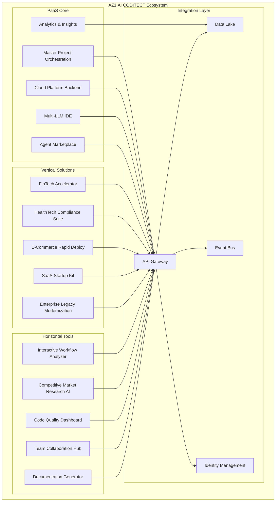
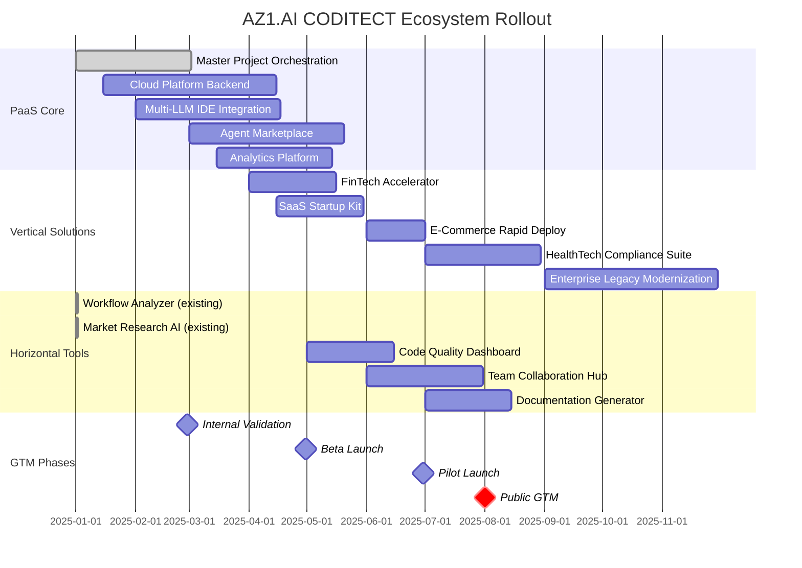

# AZ1.AI CODITECT Integrated Ecosystem Vision

**The Complete Platform: PaaS Core + Vertical Solutions + Horizontal Tools**

**Document Version:** 1.0
**Last Updated:** 2025-11-15
**Document Owner:** Hal Casteel, Founder/CEO/CTO, AZ1.AI INC.
**Status:** STRATEGIC VISION

---

## Executive Summary

This document presents the complete vision for the AZ1.AI CODITECT ecosystem: a comprehensive AI-first development platform combining Platform-as-a-Service (PaaS) core capabilities with vertical industry solutions and horizontal developer productivity tools.

**The Three-Pillar Strategy:**

1. **PaaS Core** - Foundational platform capabilities (what we're building in rollout-master)
2. **Vertical Solutions** - Industry-specific implementations and accelerators
3. **Horizontal Tools** - Cross-industry developer productivity enhancers

**Market Position:** The **only** AI-first development platform that combines autonomous multi-agent orchestration, multi-LLM IDE, and master project management into a single integrated offering.

**Total Addressable Market (TAM):**
- Global developer tools market: $40B (2025)
- AI-assisted development: $10B subset (growing 50% YoY)
- AZ1.AI target: $100M ARR by Year 3

---

## Table of Contents

1. [Platform Architecture Overview](#platform-architecture-overview)
2. [PaaS Core Capabilities](#paas-core-capabilities)
3. [Vertical Solutions](#vertical-solutions)
4. [Horizontal Tools](#horizontal-tools)
5. [Integration Layer](#integration-layer)
6. [Go-to-Market Strategy](#go-to-market-strategy)
7. [Rollout Phases](#rollout-phases)
8. [Revenue Model](#revenue-model)
9. [Competitive Positioning](#competitive-positioning)
10. [Success Metrics](#success-metrics)

---

## Platform Architecture Overview



---

## PaaS Core Capabilities

### 1. Master Project Orchestration

**What We Built Today:** `coditect-rollout-master`

**Core Capabilities:**
- Multi-repository project coordination via git submodules
- Autonomous AI agent orchestration across projects
- Session-based development with MEMORY-CONTEXT
- Cross-project status reporting and analytics
- Human-in-the-loop governance with phase gates

**Future Enhancements:**
- Visual project dependency graphs
- Automated dependency resolution
- Cross-project refactoring tools
- Project templates marketplace

**Target Users:** All developer personas (individuals, teams, enterprises)

**Pricing:** Included in all tiers (core platform capability)

---

### 2. Cloud Platform Backend

**What We're Building:** `coditect-cloud-backend`

**Core Capabilities:**
- User authentication and authorization (OAuth 2.0, SSO)
- License management (EULA, NDA acceptance tracking)
- Multi-tenant data isolation
- Usage tracking and billing integration
- Admin control panel
- API gateway for all services

**Technologies:**
- FastAPI (Python 3.11+)
- PostgreSQL 15 (multi-tenant database)
- Redis 7 (caching, session storage)
- Celery (background jobs)
- RabbitMQ (message queue)

**SLA:** 99.9% uptime (Business tier), 99.95% (Enterprise tier)

---

### 3. Multi-LLM IDE (Cloud-Based)

**What Exists:** `Coditect-v5-multiple-LLM-IDE`

**Core Capabilities:**
- Cloud-based IDE accessible from any browser
- Support for multiple LLM backends:
  - Claude (Anthropic)
  - GPT-4 (OpenAI)
  - Gemini (Google)
  - Local models (Ollama, LM Studio)
- Real-time collaboration (multiplayer editing)
- Integrated terminal and debugger
- Git integration (built-in)
- Extension marketplace

**Differentiation:**
- **Only** cloud IDE with native multi-LLM support
- Seamless LLM switching mid-session
- Shared context across LLMs
- Automatic cost optimization (route to cheapest LLM)

**Pricing:**
- Individual: Claude Sonnet included, GPT-4 add-on
- Business: All LLMs included
- Enterprise: Dedicated LLM instances (BYO API keys)

---

### 4. Agent Marketplace

**What We're Building:** `coditect-agent-marketplace`

**Core Capabilities:**
- Browse and install AI agents
- Agent categories:
  - Code generation (React, Python, Go, etc.)
  - Testing (unit tests, integration tests, E2E)
  - Documentation (README, API docs, architecture)
  - DevOps (CI/CD, infrastructure, monitoring)
  - Security (vulnerability scanning, compliance)
- Agent ratings and reviews
- Usage analytics per agent
- Custom agent development (SDK)
- Revenue share for agent creators (70/30 split)

**Marketplace Model:**
- Free agents (community-contributed)
- Premium agents (paid, creator-monetized)
- Enterprise agents (private, org-only)

**Launch Target:** 100 agents at launch (50 free, 50 premium)

---

### 5. Analytics & Insights Platform

**What We're Building:** `coditect-analytics`

**Core Capabilities:**
- Real-time usage dashboards
- Development velocity metrics
- LLM usage and cost analytics
- Team productivity insights
- Compliance and audit reports
- Custom dashboards (drag-and-drop widgets)

**Technologies:**
- ClickHouse (analytics database)
- Grafana (visualization)
- Prometheus (metrics collection)
- TimescaleDB (time-series data)

**Pre-Built Dashboards:**
- Executive KPIs (growth, retention, revenue)
- Engineering metrics (velocity, quality, burndown)
- Cost optimization (LLM spend by project/user)
- Compliance (SOC 2, ISO 27001 readiness)

---

## Vertical Solutions

### 1. FinTech Accelerator

**Target Market:** Fintech startups, neobanks, payment processors

**Problem:** Financial services have strict compliance requirements (PCI-DSS, SOC 2, GDPR) and need to ship fast

**Solution:** Pre-built CODITECT templates + compliance agents

**Included:**
- Payment processing templates (Stripe, Plaid integration)
- KYC/AML workflow agents
- PCI-DSS compliance checker
- Financial data encryption (at-rest, in-transit)
- Audit trail generator
- Regulatory reporting templates

**Case Study:** Fintech startup ships MVP in 4 weeks (vs. 12 weeks industry avg)

**Pricing:** $5K setup fee + $499/month (per team)

**Total Market Opportunity:** 10,000 fintech startups globally = $50M ARR potential

---

### 2. HealthTech Compliance Suite

**Target Market:** Digital health startups, telemedicine, health IT

**Problem:** HIPAA compliance is complex and expensive; non-compliance = $50K+ fines

**Solution:** HIPAA-compliant CODITECT templates + automated compliance checks

**Included:**
- HIPAA-compliant architecture templates (AWS/GCP)
- PHI data encryption agents
- Access control and audit logging
- Business Associate Agreement (BAA) templates
- Breach notification automation
- HIPAA compliance dashboard

**Case Study:** Telemedicine startup achieves HIPAA compliance in 6 weeks (vs. 6 months)

**Pricing:** $10K setup fee + $999/month (includes HIPAA audit support)

**Total Market Opportunity:** 5,000 healthtech startups = $50M ARR potential

---

### 3. E-Commerce Rapid Deploy

**Target Market:** Direct-to-consumer brands, marketplace platforms, retail

**Problem:** E-commerce sites need to launch fast, but must handle scale (Black Friday surges)

**Solution:** Production-ready e-commerce templates + auto-scaling infrastructure

**Included:**
- Shopify/WooCommerce/Custom storefront templates
- Payment processing (Stripe, PayPal, Apple Pay)
- Inventory management
- Order fulfillment integration (Shippo, ShipStation)
- Auto-scaling infrastructure (Kubernetes)
- Performance optimization agents

**Case Study:** DTC brand launches in 2 weeks, handles 10x Black Friday traffic

**Pricing:** $2K setup fee + $299/month (scales with GMV)

**Total Market Opportunity:** 50,000 e-commerce sites = $150M ARR potential

---

### 4. SaaS Startup Kit

**Target Market:** B2B SaaS startups (seed to Series A)

**Problem:** Need to build fast, impress investors, get to Product-Market Fit

**Solution:** Complete SaaS boilerplate + AI-powered feature development

**Included:**
- Multi-tenant SaaS architecture (Postgres + Redis)
- User authentication (Auth0, Clerk integration)
- Billing and subscription management (Stripe)
- Admin dashboard
- API infrastructure (REST + GraphQL)
- Email/SMS notifications (SendGrid, Twilio)
- Analytics and monitoring

**Case Study:** SaaS startup raises seed round 2 months after launch (vs. 6 months avg)

**Pricing:** $3K setup fee + $399/month

**Total Market Opportunity:** 100,000 SaaS startups = $400M ARR potential

---

### 5. Enterprise Legacy Modernization

**Target Market:** Fortune 500, large enterprises with legacy systems

**Problem:** Legacy codebases (COBOL, Java monoliths) are expensive to maintain and difficult to modernize

**Solution:** AI-powered code migration + CODITECT orchestration for phased rollout

**Included:**
- Legacy code analysis agents
- Automated code translation (COBOL → Java/Python)
- Microservices decomposition
- Strangler fig pattern implementation
- Risk assessment and rollback automation
- Executive reporting dashboards

**Case Study:** Bank modernizes 20-year-old COBOL system in 18 months (vs. 5 years)

**Pricing:** $500K+ per engagement (custom pricing)

**Total Market Opportunity:** 1,000 enterprises × $500K avg = $500M potential

---

## Horizontal Tools

### 1. Interactive Workflow Analyzer

**What Exists:** `coditect-interactive-workflow-analyzer`

**Core Capability:** Analyzes development workflows to identify bottlenecks and suggest optimizations

**Use Cases:**
- Identify slow code review processes
- Find inefficient CI/CD pipelines
- Detect team collaboration issues
- Benchmark against industry standards

**Integration:**
- Connects to GitHub, GitLab, Jira, Linear
- Analyzes commit history, PR cycles, issue velocity
- Generates optimization recommendations

**Pricing:** $99/month per team (up to 10 members)

**Target:** All developers, regardless of industry

---

### 2. Competitive Market Research AI

**What Exists:** `az1.ai-coditect-AI-IDE-competitive-market-research`

**Core Capability:** AI-powered competitive intelligence for developer tools

**Use Cases:**
- Analyze competitor features and pricing
- Identify market gaps and opportunities
- Track competitor product launches
- Generate positioning recommendations

**Data Sources:**
- Product Hunt, Hacker News, GitHub Trending
- Competitor websites (automated scraping)
- G2, Capterra reviews
- Social media sentiment

**Pricing:** $199/month (unlimited queries)

**Target:** Product managers, founders, VPs of Product

---

### 3. Code Quality Dashboard

**Core Capability:** Unified view of code quality across all projects

**Metrics:**
- Code coverage (unit, integration, E2E tests)
- Technical debt score
- Security vulnerabilities (OWASP Top 10)
- Performance bottlenecks
- Documentation completeness

**Integrations:**
- SonarQube, CodeClimate, Snyk
- GitHub Actions, GitLab CI
- Datadog, New Relic (performance)

**Pricing:** $49/month per project

**Target:** Tech leads, engineering managers

---

### 4. Team Collaboration Hub

**Core Capability:** Centralized hub for async team collaboration

**Features:**
- Threaded discussions (Slack-style)
- Code snippets with syntax highlighting
- Screen recording and annotation
- AI-powered meeting summaries
- Action item tracking

**Integrations:**
- Slack, Discord, Microsoft Teams
- Zoom, Google Meet (recording)
- Notion, Confluence (docs)

**Pricing:** $15/user/month

**Target:** Remote teams, distributed teams

---

### 5. Documentation Generator

**Core Capability:** AI-powered documentation generation from code

**Outputs:**
- API documentation (OpenAPI/Swagger)
- README files
- Architecture diagrams (C4 model)
- User guides
- Video tutorials (AI narration)

**Technologies:**
- GPT-4 for text generation
- Mermaid for diagrams
- ElevenLabs for voice narration

**Pricing:** $29/month per project

**Target:** Solo developers, small teams

---

## Integration Layer

### API Gateway

**Technology:** Kong, AWS API Gateway, or custom (Envoy)

**Capabilities:**
- Single entry point for all services
- Request routing and load balancing
- Authentication and authorization
- Rate limiting and throttling
- API versioning (/v1/, /v2/)
- Monitoring and logging

---

### Event Bus

**Technology:** RabbitMQ, Apache Kafka, or AWS EventBridge

**Use Cases:**
- Service-to-service communication
- Async job processing (code generation, analysis)
- Real-time notifications (WebSockets)
- Event-driven workflows

**Example Events:**
- `project.created`
- `session.started`
- `agent.executed`
- `billing.invoice_paid`

---

### Data Lake

**Technology:** AWS S3 + Athena, Google BigQuery, or ClickHouse

**Data Stored:**
- Usage analytics (API calls, features used)
- Session exports (MEMORY-CONTEXT)
- Code metrics (commits, PRs, issues)
- LLM interactions (prompts, responses)
- Financial data (invoices, payments)

**Use Cases:**
- Business intelligence (Looker, Metabase)
- Machine learning (user behavior prediction)
- Compliance and audit reporting

---

### Identity Management

**Technology:** Auth0, Okta, or custom (Keycloak)

**Capabilities:**
- Single Sign-On (SSO) for enterprises
- Multi-factor authentication (MFA)
- Social login (Google, GitHub)
- SCIM provisioning (automated user management)
- Role-based access control (RBAC)

---

## Go-to-Market Strategy

### Phased Rollout

```
Phase 1: Internal (Months 1-2)
  → AZ1.AI team validates all tools
  → NPS >70 from internal users

Phase 2: Beta (Months 3-4)
  → 50-100 invite-only customers
  → Early access to PaaS core
  → NPS >60 from beta users

Phase 3: Pilot (Months 5-6)
  → 500 customers (all tiers)
  → PaaS core + 2 vertical solutions (FinTech, SaaS Startup)
  → NPS >65

Phase 4: GTM Launch (Month 7)
  → Public availability
  → All PaaS core + 3 verticals + 5 horizontals
  → Product Hunt launch (#1 Product of the Day goal)

Phase 5: Scale (Months 8-12)
  → Add remaining verticals (HealthTech, E-Commerce, Enterprise)
  → Partner ecosystem (consultants, affiliates)
  → International expansion (EU, APAC)
```

---

### Marketing Channels

| Channel | Budget (Mo 1-3) | CAC Target | LTV:CAC Goal |
|---------|-----------------|------------|--------------|
| **Content Marketing** | $20K/month | $50 | 10:1 |
| **Product Hunt** | $5K (one-time) | $30 | 15:1 |
| **Developer Relations** | $30K/month | $40 | 12:1 |
| **Paid Ads (Google, LinkedIn)** | $25K/month | $120 | 5:1 |
| **Partnerships (Integrations)** | $15K/month | $25 | 20:1 |
| **Events/Conferences** | $20K/month | $100 | 7:1 |
| **Total** | $115K/month | $68 (blended) | 10:1 (avg) |

---

### Sales Motion

**Self-Service (Individual, Small Teams):**
- Free trial (14 days, no credit card)
- In-app onboarding (guided tutorials)
- Self-service billing (Stripe)
- Community support (Discord, docs)

**Sales-Assisted (Business, Enterprise):**
- Custom pricing and contracts
- Dedicated Customer Success Manager (CSM)
- White-glove onboarding
- SLA guarantees
- Priority support (4-hour response)

---

## Rollout Phases

### Detailed Timeline



---

## Revenue Model

### Pricing Tiers

| Tier | Price/Month | Target | Features |
|------|-------------|--------|----------|
| **Free** | $0 | Hobbyists, students | 1 user, 3 projects, community support, Claude Haiku only |
| **Individual** | $49 | Solo developers | 1 user, 10 projects, email support, Claude Sonnet + Haiku |
| **Team** | $199 | 2-10 person teams | 10 users, 50 projects, Slack support, all LLMs |
| **Business** | $799 | 10-50 person companies | 50 users, unlimited projects, priority support, SSO, all LLMs |
| **Enterprise** | Custom | 50+ person orgs | Unlimited users, white-labeling, SLA, dedicated support, on-prem option |

### Revenue Projections (3-Year)

| Metric | Year 1 | Year 2 | Year 3 |
|--------|--------|--------|--------|
| **Total Users** | 10,000 | 50,000 | 150,000 |
| **Paid Users** | 2,500 (25%) | 15,000 (30%) | 52,500 (35%) |
| **ARPU** | $75 | $85 | $95 |
| **MRR** | $187K | $1.28M | $5.0M |
| **ARR** | $2.25M | $15.3M | $59.9M |
| **Churn Rate** | 5% | 4% | 3% |
| **LTV:CAC** | 5:1 | 8:1 | 12:1 |

### Revenue Mix (Year 3)

- **PaaS Core** (subscriptions): 60% ($36M ARR)
- **Vertical Solutions** (premiums): 25% ($15M ARR)
- **Horizontal Tools** (add-ons): 10% ($6M ARR)
- **Marketplace** (rev share): 5% ($3M ARR)

---

## Competitive Positioning

### Competitive Landscape

| Competitor | Strength | Weakness | CODITECT Advantage |
|------------|----------|----------|-------------------|
| **GitHub Copilot** | Large user base, GitHub integration | Single LLM (GPT-4), no orchestration | Multi-LLM, master project orchestration |
| **Cursor** | Great UX, fast | Single LLM (GPT-4), local only | Cloud IDE, multi-LLM, agent marketplace |
| **Replit** | Cloud IDE, beginner-friendly | Limited LLM support, no enterprise | Multi-LLM, enterprise-ready, compliance |
| **Tabnine** | Privacy (on-prem) | Limited capabilities | Cloud + on-prem options, more features |
| **Codeium** | Free tier | Single LLM | Multi-LLM, vertical solutions |

### Unique Value Propositions

**vs. GitHub Copilot:**
> "GitHub Copilot writes code. CODITECT orchestrates entire projects. Multi-LLM, multi-repo, multi-agent. Human-in-the-loop governance."

**vs. Cursor:**
> "Cursor is a great local IDE. CODITECT is a complete cloud platform. Work from anywhere, collaborate in real-time, scale infinitely."

**vs. Replit:**
> "Replit is for beginners. CODITECT is for professionals. Enterprise-grade security, compliance, and tooling."

**vs. All Competitors:**
> "Only CODITECT combines multi-LLM IDE + master project orchestration + vertical solutions + autonomous agents. Build once, use everywhere, scale infinitely."

---

## Success Metrics

### North Star Metric

**Weekly Active Users (WAU)** - Measures platform stickiness

**Targets:**
- Month 3 (Beta): 100 WAU
- Month 6 (Pilot): 500 WAU
- Month 12 (GTM): 5,000 WAU
- Month 24: 25,000 WAU
- Month 36: 75,000 WAU

---

### Product Metrics

| Metric | Month 6 | Month 12 | Month 24 | Month 36 |
|--------|---------|----------|----------|----------|
| **Projects Created** | 1,000 | 10,000 | 100,000 | 500,000 |
| **Agents Installed** | 5,000 | 50,000 | 500,000 | 2M |
| **LLM Queries** | 100K/day | 1M/day | 10M/day | 50M/day |
| **Avg Session Duration** | 45 min | 60 min | 75 min | 90 min |
| **Feature Adoption** | 60% | 75% | 85% | 90% |

---

### Business Metrics

| Metric | Month 6 | Month 12 | Month 24 | Month 36 |
|--------|---------|----------|----------|----------|
| **MRR** | $50K | $187K | $1.28M | $5.0M |
| **ARR** | $600K | $2.25M | $15.3M | $59.9M |
| **CAC** | $80 | $70 | $60 | $50 |
| **LTV** | $500 | $600 | $720 | $900 |
| **LTV:CAC** | 6:1 | 8.5:1 | 12:1 | 18:1 |
| **Gross Margin** | 70% | 75% | 80% | 85% |
| **Net Revenue Retention** | 105% | 115% | 125% | 135% |

---

### Operational Metrics

| Metric | Target |
|--------|--------|
| **Platform Uptime** | >99.9% |
| **API Response Time (p95)** | <200ms |
| **Support Ticket Resolution** | <24 hours |
| **NPS** | >70 |
| **Customer Satisfaction (CSAT)** | >4.5/5.0 |

---

## Summary: The Integrated Vision

### What We're Building

**PaaS Core** (Foundation):
✅ Master Project Orchestration (built today!)
✅ Cloud Platform Backend
✅ Multi-LLM IDE
✅ Agent Marketplace
✅ Analytics Platform

**Vertical Solutions** (Industry-Specific):
✅ FinTech Accelerator
✅ HealthTech Compliance Suite
✅ E-Commerce Rapid Deploy
✅ SaaS Startup Kit
✅ Enterprise Legacy Modernization

**Horizontal Tools** (Cross-Industry):
✅ Interactive Workflow Analyzer (existing)
✅ Competitive Market Research AI (existing)
✅ Code Quality Dashboard
✅ Team Collaboration Hub
✅ Documentation Generator

### Why This Wins

**Network Effects:**
- More users → Better agents → More users
- More verticals → More use cases → More verticals
- More tools → Better ecosystem → More tools

**Ecosystem Lock-In:**
- All tools integrate seamlessly
- Switching cost is high (data, workflows, training)
- Continuous value delivery (weekly new features)

**Competitive Moat:**
- **Only** platform with multi-LLM + master orchestration + verticals
- Cannot be replicated by single-feature competitors
- Requires years of platform investment to match

### The Path to $100M ARR

```
Year 1: $2.25M ARR → Build PaaS core + 2 verticals
Year 2: $15.3M ARR → Scale users + add 3 verticals
Year 3: $59.9M ARR → International + enterprise

Goal: $100M ARR by Year 4
```

**This is the AZ1.AI CODITECT way:**
**Build once, use everywhere, scale infinitely. PaaS + Verticals + Horizontals = Ecosystem Dominance.**

---

*Built with Excellence by AZ1.AI CODITECT*
*Systematic Development. Continuous Context. Exceptional Results.*
