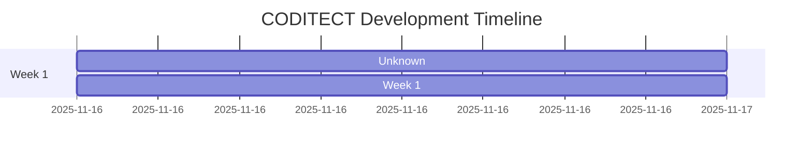

# CODITECT Development Timeline

**Generated**: 2025-11-17T21:25:07.607966
**Total Unique Messages**: 1,601
**Total Checkpoints**: 49
**Phases**: 2

---

## Timeline Visualization

---

## Detailed Timeline

### Unknown

**Messages**: 1,467
**Checkpoints**: 48

**Focus Areas**:
- Documentation: 686 messages (46.8%)
- Memory Context: 171 messages (11.7%)
- General: 157 messages (10.7%)
- Cloud: 142 messages (9.7%)
- Testing: 141 messages (9.6%)
- Architecture: 74 messages (5.0%)
- Backend: 49 messages (3.3%)
- Frontend: 41 messages (2.8%)
- Database: 6 messages (0.4%)

**Checkpoints**:

- **2025-11-17-incremental-test**
  - Focus: Testing
  - Messages: 13
  - Timestamp: 
  - Source: ``

- **2025-11-17-MASTER3-incremental-test**
  - Focus: Testing
  - Messages: 35
  - Timestamp: 
  - Source: ``

- **export-2025-11-17-EXPORT-PROJECTS-coditect-rollout-master**
  - Focus: General
  - Messages: 13
  - Timestamp: 
  - Source: ``

- **export-2025-11-17-EXPORT-PROJECTS-coditect-rollout-master-2**
  - Focus: General
  - Messages: 82
  - Timestamp: 
  - Source: ``

- **export-2025-09-01-EXPORT-ADRS-session5**
  - Focus: Architecture
  - Messages: 53
  - Timestamp: 2025-11-15T19:07:19.159140
  - Source: `submodules/Coditect-v5-multiple-LLM-IDE/docs/09-sessions/2025-09-01-EXPORT-ADRS-session5.txt`

- **export-2025-09-03-EXPORT-DOCUMENT-DEV-3**
  - Focus: Documentation
  - Messages: 117
  - Timestamp: 2025-11-15T19:07:19.159247
  - Source: `submodules/Coditect-v5-multiple-LLM-IDE/docs/09-sessions/2025-09-03-EXPORT-DOCUMENT-DEV-3.txt`

- **export-2025-09-03-EXPORT-SESSION8-QA-REVIEWER**
  - Focus: Documentation
  - Messages: 124
  - Timestamp: 2025-11-15T19:07:19.159359
  - Source: `submodules/Coditect-v5-multiple-LLM-IDE/docs/09-sessions/2025-09-03-EXPORT-SESSION8-QA-REVIEWER.txt`

- **export-2025-09-28-EXPORT-FRONTEND-DEVELOPER-SESSION-2025-09-28-01**
  - Focus: Frontend
  - Messages: 1
  - Timestamp: 2025-11-15T19:07:19.159713
  - Source: `submodules/Coditect-v5-multiple-LLM-IDE/docs/09-sessions/2025-09-28-EXPORT-FRONTEND-DEVELOPER-SESSION-2025-09-28-01.txt`

- **export-2025-09-29-EXPORT-CLOUD-ARCHITECT-SESSION-2025-09-29-01**
  - Focus: Cloud
  - Messages: 3
  - Timestamp: 2025-11-15T19:07:19.159858
  - Source: `MEMORY-CONTEXT/test-dataset/exports/2025-09-29-EXPORT-CLOUD-ARCHITECT-SESSION-2025-09-29-01.txt`

- **export-2025-09-29-EXPORT-ORCHESTRATOR-SESSION-2025-09-27**
  - Focus: Documentation
  - Messages: 290
  - Timestamp: 2025-11-15T19:07:19.160028
  - Source: `submodules/Coditect-v5-multiple-LLM-IDE/docs/09-sessions/2025-09-29-EXPORT-ORCHESTRATOR-SESSION-2025-09-27.txt`

- **export-2025-09-30-EXPORT-CLOUD-ARCHITECT-2025-09-30-02**
  - Focus: Cloud
  - Messages: 120
  - Timestamp: 2025-11-15T19:07:19.160246
  - Source: `submodules/Coditect-v5-multiple-LLM-IDE/docs/09-sessions/2025-09-30-EXPORT-CLOUD-ARCHITECT-2025-09-30-02.txt`

- **export-2025-09-30-EXPORT-FILE-MANAGEMENT-ORGANIZER-SESSION-2025-09-30-01**
  - Focus: Documentation
  - Messages: 74
  - Timestamp: 2025-11-15T19:07:19.160329
  - Source: `submodules/Coditect-v5-multiple-LLM-IDE/docs/09-sessions/2025-09-30-EXPORT-FILE-MANAGEMENT-ORGANIZER-SESSION-2025-09-30-01.txt`

- **export-2025-10-06-02-EXPORT-LM-STUDIO-multiple-LLMS**
  - Focus: Testing
  - Messages: 1
  - Timestamp: 2025-11-15T19:07:19.160426
  - Source: `MEMORY-CONTEXT/test-dataset/exports/2025-10-06-02-EXPORT-LM-STUDIO-multiple-LLMS.txt`

- **export-2025-10-07-EXPORT**
  - Focus: Testing
  - Messages: 6
  - Timestamp: 2025-11-15T19:07:19.161360
  - Source: `MEMORY-CONTEXT/test-dataset/exports/2025-10-07-EXPORT.txt`

- **export-2025-10-08-EXPORT-Theia-BRANDING-ISSUES**
  - Focus: Testing
  - Messages: 2
  - Timestamp: 2025-11-15T19:07:19.161459
  - Source: `MEMORY-CONTEXT/test-dataset/exports/2025-10-08-EXPORT-Theia-BRANDING-ISSUES.txt`

- **export-2025-10-12-EXPORT-DOCKER-BUILD**
  - Focus: Frontend
  - Messages: 4
  - Timestamp: 2025-11-15T19:07:19.161667
  - Source: `MEMORY-CONTEXT/test-dataset/exports/2025-10-12-EXPORT-DOCKER-BUILD.txt`

- **export-2025-10-12-EXPORT-DOT-CLAUDE-UPDATES**
  - Focus: Testing
  - Messages: 15
  - Timestamp: 2025-11-15T19:07:19.161757
  - Source: `MEMORY-CONTEXT/test-dataset/exports/2025-10-12-EXPORT-DOT-CLAUDE-UPDATES.txt`

- **export-2025-10-12-EXPORT-FRONTEND-DOCKER-BUILD**
  - Focus: Frontend
  - Messages: 18
  - Timestamp: 2025-11-15T19:07:19.161857
  - Source: `MEMORY-CONTEXT/test-dataset/exports/2025-10-12-EXPORT-FRONTEND-DOCKER-BUILD.txt`

- **export-2025-10-13-EXPORT-DOCKER-V5-CODITECT-WRAPPER-PERSISTENCE**
  - Focus: Documentation
  - Messages: 1
  - Timestamp: 2025-11-15T19:07:19.162045
  - Source: `MEMORY-CONTEXT/test-dataset/exports/2025-10-13-EXPORT-DOCKER-V5-CODITECT-WRAPPER-PERSISTENCE.txt`

- **export-2025-10-14-EXPORT-FOUNDATIONDB-SESSION**
  - Focus: Database
  - Messages: 6
  - Timestamp: 2025-11-15T19:07:19.162133
  - Source: `MEMORY-CONTEXT/test-dataset/exports/2025-10-14-EXPORT-FOUNDATIONDB-SESSION.txt`

- **export-2025-10-14-EXPORT-SESSION-CONTEXT**
  - Focus: Testing
  - Messages: 28
  - Timestamp: 2025-11-15T19:07:19.162254
  - Source: `MEMORY-CONTEXT/test-dataset/exports/2025-10-14-EXPORT-SESSION-CONTEXT.txt`

- **export-2025-10-14-EXPORT-SessionTabManager-FIX**
  - Focus: Testing
  - Messages: 5
  - Timestamp: 2025-11-15T19:07:19.162355
  - Source: `MEMORY-CONTEXT/test-dataset/exports/2025-10-14-EXPORT-SessionTabManager-FIX.txt`

- **export-2025-10-15-EXPORT-BACKEND-BUILD-ERRORS**
  - Focus: Backend
  - Messages: 28
  - Timestamp: 2025-11-15T19:07:19.162441
  - Source: `submodules/Coditect-v5-multiple-LLM-IDE/docs/09-sessions/2025-10-15-EXPORT-BACKEND-BUILD-ERRORS.txt`

- **export-2025-10-26-EXPORT-LATEST-CODITECT-YAML-PRE-PRODUCTION-CLOUD-BUILD**
  - Focus: Frontend
  - Messages: 4
  - Timestamp: 2025-11-15T19:07:19.162698
  - Source: `MEMORY-CONTEXT/test-dataset/exports/2025-10-26-EXPORT-LATEST-CODITECT-YAML-PRE-PRODUCTION-CLOUD-BUILD.txt`

- **export-2025-10-26-EXPORT-PRE-PRODUCTION-PREPARATION**
  - Focus: Testing
  - Messages: 15
  - Timestamp: 2025-11-15T19:07:19.162788
  - Source: `MEMORY-CONTEXT/test-dataset/exports/2025-10-26-EXPORT-PRE-PRODUCTION-PREPARATION.txt`

- **export-2025-10-27-EXPORT-BUILD17-SESSION1**
  - Focus: Frontend
  - Messages: 4
  - Timestamp: 2025-11-15T19:07:19.162896
  - Source: `MEMORY-CONTEXT/test-dataset/exports/2025-10-27-EXPORT-BUILD17-SESSION1.txt`

- **export-2025-10-27-EXPORT-BUILD17-SESSION2**
  - Focus: Frontend
  - Messages: 7
  - Timestamp: 2025-11-15T19:07:19.163062
  - Source: `submodules/Coditect-v5-multiple-LLM-IDE/docs/09-sessions/2025-10-27-EXPORT-BUILD17-SESSION2.txt`

- **export-2025-10-28-EXPORT-CODITECT-BUILD-26**
  - Focus: Frontend
  - Messages: 3
  - Timestamp: 2025-11-15T19:07:19.163217
  - Source: `MEMORY-CONTEXT/test-dataset/exports/2025-10-28-EXPORT-CODITECT-BUILD-26.txt`

- **export-2025-10=20-EXPORT-SPRINT-2**
  - Focus: Testing
  - Messages: 18
  - Timestamp: 2025-11-15T19:07:19.163306
  - Source: `MEMORY-CONTEXT/test-dataset/exports/2025-10=20-EXPORT-SPRINT-2.txt`

- **export-2025-10-11-EXPORT-KNOWLEDGEBASE-SESSION**
  - Focus: Documentation
  - Messages: 80
  - Timestamp: 2025-11-15T19:07:19.257441
  - Source: `submodules/Coditect-v5-multiple-LLM-IDE/docs/99-archive/obsolete-directories/theia-kb-extension/2025-10-11-EXPORT-KNOWLEDGEBASE-SESSION.txt`

- **checkpoint-2025-11-16T03-54-36Z-SPRINT-COMPLETE-ONBOARDING-SYSTEM**
  - Focus: General
  - Messages: 16
  - Timestamp: 2025-11-15T22:56:47.273132
  - Source: `CHECKPOINTS/2025-11-16T03-54-36Z-SPRINT-COMPLETE-ONBOARDING-SYSTEM.md`

- **export-2025-11-17-EXPORT-MEMORY-CONTEXT-DOT-CODITECT**
  - Focus: Memory Context
  - Messages: 5
  - Timestamp: 2025-11-16T03:28:31.775558
  - Source: `MEMORY-CONTEXT/2025-11-17-EXPORT-MEMORY-CONTEXT-DOT-CODITECT.txt`

- **checkpoint-2025-11-16T08-34-53Z-DISTRIBUTED-INTELLIGENCE-ARCHITECTURE-COMPLETE**
  - Focus: Architecture
  - Messages: 17
  - Timestamp: 2025-11-16T03:36:56.361871
  - Source: `CHECKPOINTS/2025-11-16T08-34-53Z-DISTRIBUTED-INTELLIGENCE-ARCHITECTURE-COMPLETE.md`

- **checkpoint-2025-11-16T09-05-16Z-Checkpoint-Automation-System-Implementation-Complete**
  - Focus: General
  - Messages: 12
  - Timestamp: 2025-11-16T04:05:17.575650
  - Source: `CHECKPOINTS/2025-11-16T09-05-16Z-Checkpoint-Automation-System-Implementation-Complete.md`

- **checkpoint-2025-11-16T09-26-41Z-TASKLISTs-Updated-and-Checkpoint-Automation-System-Complete**
  - Focus: General
  - Messages: 4
  - Timestamp: 2025-11-16T04:27:18.281614
  - Source: `CHECKPOINTS/2025-11-16T09-26-41Z-TASKLISTs-Updated-and-Checkpoint-Automation-System-Complete.md`

- **export-2025-11-16-EXPORT-CHECKPOINT**
  - Focus: Memory Context
  - Messages: 37
  - Timestamp: 2025-11-16T04:31:37.305152
  - Source: `MEMORY-CONTEXT/2025-11-16-EXPORT-CHECKPOINT.txt`

- **checkpoint-2025-11-16T09-56-08Z-Distributed-Intelligence-Architecture-Complete---All-Symlinks-Configured**
  - Focus: Architecture
  - Messages: 4
  - Timestamp: 2025-11-16T04:58:10.961769
  - Source: `CHECKPOINTS/2025-11-16T09-56-08Z-Distributed-Intelligence-Architecture-Complete---All-Symlinks-Configured.md`

- **export-2025-11-16T20:08:18Z-EXPORT-DAY6-NESTED-LEARNINGS**
  - Focus: Testing
  - Messages: 2
  - Timestamp: 2025-11-16T15:09:22.848148
  - Source: `MEMORY-CONTEXT/test-dataset/exports/2025-11-16T20:08:18Z-EXPORT-DAY6-NESTED-LEARNINGS.txt`

- **export-2025-11-16-EXPORT-CODITECT-INSTALLER**
  - Focus: Testing
  - Messages: 1
  - Timestamp: 2025-11-16T20:56:22.906861
  - Source: `MEMORY-CONTEXT/test-dataset/exports/2025-11-16-EXPORT-CODITECT-INSTALLER.txt`

- **export-2025-11-17-EXPORT-ROLLOUT-MASTER**
  - Focus: Memory Context
  - Messages: 2
  - Timestamp: 2025-11-17T04:26:42.803301
  - Source: `MEMORY-CONTEXT/exports/2025-11-17-EXPORT-ROLLOUT-MASTER.txt`

- **checkpoint-2025-11-17T10-21-00Z-Week-1-Phase-1-Complete**
  - Focus: General
  - Messages: 13
  - Timestamp: 2025-11-17T05:21:41.697088
  - Source: `CHECKPOINTS/2025-11-17T10-21-00Z-Week-1-Phase-1-Complete.md`

- **checkpoint-2025-11-17T09-30-00Z-CONVERSATION-DEDUP-WEEK1-DAY1-COMPLETE**
  - Focus: Memory Context
  - Messages: 16
  - Timestamp: 2025-11-17T10:31:09.674010
  - Source: `CHECKPOINTS/2025-11-17T09-30-00Z-CONVERSATION-DEDUP-WEEK1-DAY1-COMPLETE.md`

- **checkpoint-2025-11-17T15-30-00Z-Week-1-Phase-2.1-Cloud-SQL-Deployed**
  - Focus: Cloud
  - Messages: 19
  - Timestamp: 2025-11-17T10:32:19.106896
  - Source: `CHECKPOINTS/2025-11-17T15-30-00Z-Week-1-Phase-2.1-Cloud-SQL-Deployed.md`

- **checkpoint-2025-11-17T23-00-00Z-Week-1-Backend-Implementation-Complete**
  - Focus: Backend
  - Messages: 21
  - Timestamp: 2025-11-17T16:59:53.308511
  - Source: `CHECKPOINTS/2025-11-17T23-00-00Z-Week-1-Backend-Implementation-Complete.md`

- **export-2025-11-17-EXPORT-MASTER**
  - Focus: Memory Context
  - Messages: 85
  - Timestamp: 2025-11-17T19:06:47.422333
  - Source: `MEMORY-CONTEXT/2025-11-17-EXPORT-MASTER.txt`

- **export-2025-11-17-EXPORT-MASTER2**
  - Focus: Memory Context
  - Messages: 9
  - Timestamp: 2025-11-17T19:11:48.835041
  - Source: `MEMORY-CONTEXT/2025-11-17-EXPORT-MASTER2.txt`

- **export-2025-11-17-EXPORT-MASTER3**
  - Focus: Memory Context
  - Messages: 17
  - Timestamp: 2025-11-17T19:21:26.747599
  - Source: `MEMORY-CONTEXT/2025-11-17-EXPORT-MASTER3.txt`

- **export-2025-11-17-EXPORT-PROJECTS-coditect-rollout-master-2117ET**
  - Focus: General
  - Messages: 17
  - Timestamp: 2025-11-17T21:17:05.327619
  - Source: `2025-11-17-EXPORT-PROJECTS-coditect-rollout-master-2117ET.txt`

---

### Week 1

**Messages**: 134
**Checkpoints**: 1

**Focus Areas**:
- Memory Context: 134 messages (100.0%)

**By Day**:

#### Day 2
- **2025-11-17-Week 1 Day 2 - Deduplication System Complete**
  - Focus: Memory Context
  - Messages: 134
  - Source: ``

---

## Integration with Project Plans

### Linked Resources

**Project Plans:**
- [CODITECT Master Orchestration Plan](CODITECT-MASTER-ORCHESTRATION-PLAN.md)
- [Cloud Platform Project Plan](CODITECT-CLOUD-PLATFORM-PROJECT-PLAN.md)
- [Rollout Master Plan](CODITECT-ROLLOUT-MASTER-PLAN.md)

**Tasklists:**
- Check individual submodule `TASKLIST.md` files for checkbox progress
- See `CHECKPOINTS/` directory for completed phase summaries

**Export Files:**
- All processed exports in `MEMORY-CONTEXT/dedup_state/unique_messages.jsonl`
- Original exports in submodule `docs/09-sessions/` directories

---

## Usage

**Drill Down:**
1. Identify phase of interest (e.g., Week 1, Sprint +1)
2. Review focus areas to understand work distribution
3. Navigate to specific checkpoint files for detailed context
4. Check linked project plans and tasklists for task status

**API Integration:**
- JSON export available: `PROJECT-TIMELINE.json`
- Use for activity feed integration
- Powers 360° project intelligence dashboard

---

**Last Updated**: 2025-11-17T21:25:07.608066