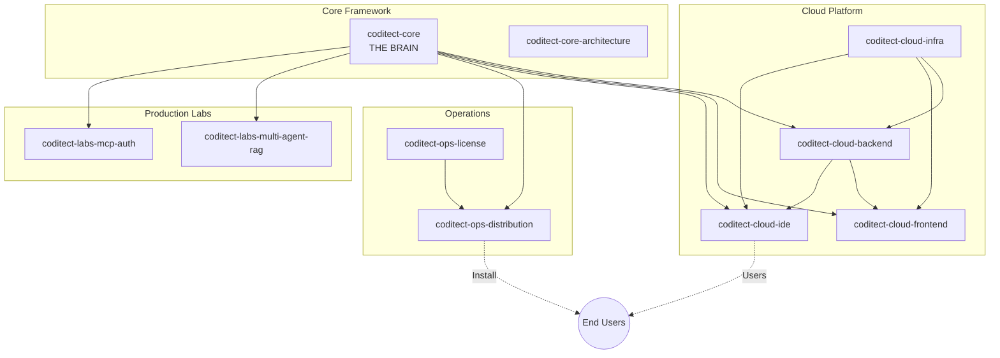

# CODITECT Submodule Analysis Framework

## Executive Summary

This document provides a comprehensive analysis of all 42 CODITECT submodules, their purposes, relationships, and roles in the ecosystem. Use this as the authoritative reference when writing cohesive README documentation.

**Analysis Date:** 2025-11-19
**Total Submodules:** 42
**Categories:** 8

---

## Ecosystem Architecture Overview

```
┌─────────────────────────────────────────────────────────────────────────┐
│                         USER-FACING PRODUCTS                             │
├─────────────────────────────────────────────────────────────────────────┤
│  coditect-cloud-ide (PROD)     coditect-gtm-customer-clipora (DEV)      │
│  Browser-based IDE              AI Social Media Platform                 │
└───────────────────────┬─────────────────────────────────────────────────┘
                        │
┌───────────────────────▼─────────────────────────────────────────────────┐
│                         PLATFORM SERVICES                                │
├─────────────────────────────────────────────────────────────────────────┤
│  coditect-cloud-backend    coditect-cloud-frontend    coditect-docs-blog│
│  (FastAPI API)             (React Admin)              (Enterprise Blog) │
└───────────────────────┬─────────────────────────────────────────────────┘
                        │
┌───────────────────────▼─────────────────────────────────────────────────┐
│                         CORE FRAMEWORK                                   │
├─────────────────────────────────────────────────────────────────────────┤
│  coditect-core         coditect-core-architecture             │
│  THE BRAIN: 50 agents,           ADRs, design docs,                     │
│  72 commands, 24 skills          architectural standards                │
└───────────────────────┬─────────────────────────────────────────────────┘
                        │
┌───────────────────────▼─────────────────────────────────────────────────┐
│                         INFRASTRUCTURE                                   │
├─────────────────────────────────────────────────────────────────────────┤
│  coditect-cloud-infra    coditect-ops-distribution    coditect-ops-license│
│  (Terraform/GCP/K8s)     (Installer)                  (Licensing)        │
└─────────────────────────────────────────────────────────────────────────┘
```

---

## Submodule Classification

### By Type

| Type | Count | Description |
|------|-------|-------------|
| **Standalone Application** | 4 | Deployable, user-facing products |
| **Library/Framework** | 3 | Reusable code for other repos |
| **Configuration** | 6 | Infrastructure, settings, scripts |
| **Documentation** | 15 | Content, guides, research docs |
| **Research/Experimental** | 14 | R&D, prototypes, experiments |

### By Status

| Status | Count | Description |
|--------|-------|-------------|
| **Production** | 12 | Deployed or complete |
| **Development** | 14 | Active development |
| **Planning/Stub** | 10 | Only README/plans exist |
| **Archive** | 1 | Historical reference |
| **Experimental** | 5 | Research phase |

---

## Complete Submodule Profiles

### core/ - Core Framework (3 repos)

#### coditect-core
**Type:** Configuration/Framework | **Status:** Production (78%)

**What It Is:** The central "brain" of CODITECT - a shared configuration directory containing AI agents, skills, commands, and context management that is symlinked into all projects.

**Ecosystem Role:**
- **THE FOUNDATION** - Every other submodule depends on this
- Implements distributed intelligence via symlinks
- Single source of truth for AI capabilities

**Key Capabilities:**
- 50 specialized AI agents across 8 domains
- 72 slash commands for workflow automation
- 24 reusable skills
- Memory context system with checkpointing
- User training system (240K+ words)

**Dependencies:**
- Depends on: None (root)
- Used by: ALL other submodules via `.coditect -> ../../../.coditect`

---

#### coditect-core-framework
**Type:** Library | **Status:** Stub

**What It Is:** Intended distributable version of CODITECT framework for external projects. Currently only contains placeholder docs.

**Ecosystem Role:** Future framework distribution mechanism

**Dependencies:**
- Depends on: Would extract from dotclaude
- Used by: External projects (planned)

---

#### coditect-core-architecture
**Type:** Documentation | **Status:** Production

**What It Is:** Authoritative source for architectural decisions - contains ADRs, research docs, and design specifications.

**Ecosystem Role:** Governs HOW all CODITECT components should be structured

**Key Contents:**
- ADR-001: Distributed brain symlink architecture
- ADR-002: Centralized MEMORY-CONTEXT
- ADR-003: Project-local configuration
- ADR-004: Export deduplication strategy
- Setup/migration scripts

**Dependencies:**
- Depends on: None
- Used by: All repos (as architectural reference)

---

### cloud/ - Cloud Platform (4 repos)

#### coditect-cloud-backend
**Type:** Standalone Application | **Status:** Development

**What It Is:** FastAPI backend providing REST API for CODITECT Cloud Platform - handles auth, users, orgs, licenses, projects.

**Ecosystem Role:** Primary API server for cloud platform

**Technology:** Python, FastAPI, PostgreSQL, SQLAlchemy, JWT

**Dependencies:**
- Depends on: coditect-cloud-infra
- Used by: coditect-cloud-frontend, coditect-cloud-ide

---

#### coditect-cloud-frontend
**Type:** Standalone Application | **Status:** Stub

**What It Is:** React/TypeScript admin dashboard for CODITECT Cloud - user onboarding, license management, org management.

**Ecosystem Role:** User-facing management UI (distinct from IDE)

**Technology:** React 18, TypeScript, TailwindCSS, Vite

**Dependencies:**
- Depends on: coditect-cloud-backend
- Used by: End users via browser

---

#### coditect-cloud-ide
**Type:** Standalone Application | **Status:** Production (Build #32)

**What It Is:** Production browser-based IDE combining Eclipse Theia with React wrapper. Currently deployed at https://coditect.ai.

**Ecosystem Role:** **THE PRIMARY PRODUCT** - main deliverable users interact with

**Technology:** React 18, Eclipse Theia 1.65, Rust/Actix-web backend, FoundationDB, GKE

**Dependencies:**
- Depends on: coditect-cloud-backend, coditect-cloud-infra
- Used by: End users at coditect.ai

---

#### coditect-cloud-infra
**Type:** Configuration | **Status:** Stub

**What It Is:** Terraform infrastructure as code for deploying to GCP with Kubernetes.

**Ecosystem Role:** Foundation deployment layer for all cloud services

**Technology:** Terraform, GCP, Docker, Kubernetes, GitHub Actions

**Dependencies:**
- Depends on: None (root infrastructure)
- Used by: All cloud services

---

### dev/ - Developer Tools (9 repos)

#### coditect-cli
**Type:** Standalone Application | **Status:** Stub

**What It Is:** Command-line interface tools for CODITECT operations.

**Ecosystem Role:** Developer interface for CODITECT automation

**Dependencies:**
- Depends on: coditect-core
- Used by: Developers

---

#### coditect-analytics
**Type:** Library | **Status:** Stub

**What It Is:** Usage analytics and metrics collection for CODITECT platform.

**Ecosystem Role:** Telemetry and insights infrastructure

**Dependencies:**
- Depends on: coditect-cloud-backend
- Used by: All CODITECT products

---

#### coditect-automation
**Type:** Library | **Status:** Stub

**What It Is:** AI orchestration and workflow automation capabilities.

**Ecosystem Role:** Automation engine for autonomous operations

**Dependencies:**
- Depends on: coditect-core
- Used by: CODITECT products

---

#### coditect-dev-context
**Type:** Library | **Status:** Stub

**What It Is:** Context management system for maintaining session state.

**Ecosystem Role:** Session continuity and context preservation

**Dependencies:**
- Depends on: coditect-core
- Used by: All development tools

---

#### coditect-dev-intelligence
**Type:** Research | **Status:** Development

**What It Is:** Development intelligence and code analysis capabilities.

**Ecosystem Role:** AI-powered development insights

**Dependencies:**
- Depends on: coditect-core
- Used by: IDE and CLI tools

---

#### coditect-dev-pdf
**Type:** Library | **Status:** Stub

**What It Is:** PDF generation and processing utilities.

**Ecosystem Role:** Document generation capability

**Dependencies:**
- Depends on: None
- Used by: Documentation and reporting tools

---

#### coditect-dev-audio2text
**Type:** Library | **Status:** Stub

**What It Is:** Audio transcription service using ML models.

**Ecosystem Role:** Voice-to-text capability

**Dependencies:**
- Depends on: ML models (Whisper)
- Used by: Development tools

---

#### coditect-dev-qrcode
**Type:** Library | **Status:** Stub

**What It Is:** QR code generation and processing.

**Ecosystem Role:** QR code utility

**Dependencies:**
- Depends on: None
- Used by: Various tools

---

### market/ - Marketplace (2 repos)

#### coditect-market-agents
**Type:** Standalone Application | **Status:** Stub

**What It Is:** Agent marketplace for sharing and discovering CODITECT agents.

**Ecosystem Role:** Agent distribution and monetization platform

**Dependencies:**
- Depends on: coditect-cloud-backend
- Used by: Agent developers and consumers

---

#### coditect-market-activity
**Type:** Library | **Status:** Stub (MISSING README)

**What It Is:** Activity feed and event tracking for marketplace.

**Ecosystem Role:** Social/activity features for marketplace

**Dependencies:**
- Depends on: coditect-market-agents
- Used by: Marketplace frontend

---

### docs/ - Documentation (5 repos)

#### coditect-docs-main
**Type:** Documentation | **Status:** Stub

**What It Is:** Docusaurus documentation site - main CODITECT docs hub.

**Ecosystem Role:** Primary developer documentation

**Technology:** Docusaurus, React, MDX, Algolia

**Dependencies:**
- Depends on: Content from all repos
- Used by: Developers learning CODITECT

---

#### coditect-docs-blog
**Type:** Standalone Application | **Status:** Development

**What It Is:** Full-stack enterprise multi-tenant blog platform (not just docs).

**Ecosystem Role:** Reference application AND content platform

**Technology:** NestJS, React, PostgreSQL, Redis, Prisma, GKE

**Dependencies:**
- Depends on: GCP services
- Used by: Content team, end users

---

#### coditect-docs-training
**Type:** Documentation/Configuration | **Status:** Production

**What It Is:** AI curriculum framework with 32-week content and automation system.

**Ecosystem Role:** Training materials AND content generation showcase

**Technology:** Python, Sphinx, Jupyter, ML libraries

**Dependencies:**
- Depends on: coditect-core
- Used by: Learners, educators

---

#### coditect-docs-setup
**Type:** Configuration | **Status:** Development (70%)

**What It Is:** Development environment setup with agents, skills, hooks.

**Ecosystem Role:** Bootstrap/quickstart for Claude Code setup

**Technology:** TypeScript, Python, Playwright

**Dependencies:**
- Depends on: Claude Code
- Used by: New developers

---

#### coditect-legal
**Type:** Documentation | **Status:** Stub

**What It Is:** Legal documents - EULA, NDA, ToS, Privacy Policy.

**Ecosystem Role:** Legal compliance (P0 blocker for launch)

**Technology:** Markdown, LaTeX, Pandoc

**Dependencies:**
- Depends on: Legal review
- Used by: Frontend, backend, licensing

---

### ops/ - Operations (3 repos)

#### coditect-ops-distribution
**Type:** Configuration | **Status:** Production

**What It Is:** One-click installer with license validation and auto-updates.

**Ecosystem Role:** Primary distribution mechanism for CODITECT

**Technology:** Bash, launchd, curl

**Dependencies:**
- Depends on: coditect-core, coditect-ops-license
- Used by: All end users

---

#### coditect-ops-license
**Type:** Library/Application | **Status:** Production

**What It Is:** License management - client library and FastAPI server.

**Ecosystem Role:** Commercial enablement and monetization

**Technology:** Python, FastAPI, PostgreSQL, Redis

**Dependencies:**
- Depends on: License server
- Used by: coditect-ops-distribution, all licensed products

---

#### coditect-ops-projects
**Type:** Configuration | **Status:** Active

**What It Is:** Master project coordination with tasklists and checkpoints.

**Ecosystem Role:** Operational coordination hub

**Technology:** Markdown with checkboxes

**Dependencies:**
- Depends on: All subprojects
- Used by: Project managers, AI agents

---

### gtm/ - Go-to-Market (6 repos)

#### coditect-gtm-strategy
**Type:** Documentation | **Status:** Production

**What It Is:** Master GTM strategy (66K+ words) - customer discovery, playbooks, growth.

**Ecosystem Role:** Strategic foundation for all GTM activities

**Dependencies:**
- Depends on: None
- Used by: All GTM repos

---

#### coditect-gtm-legitimacy
**Type:** Research | **Status:** Production

**What It Is:** Enterprise legitimacy research (40K+ words) based on Sinofsky analysis.

**Ecosystem Role:** Strategic research foundation

**Dependencies:**
- Depends on: External research
- Used by: coditect-gtm-strategy

---

#### coditect-gtm-comms
**Type:** Documentation | **Status:** Development

**What It Is:** Communications center with visual assets (25 Mermaid diagrams).

**Ecosystem Role:** Visual communication infrastructure

**Dependencies:**
- Depends on: coditect-gtm-strategy
- Used by: All presentations and communications

---

#### coditect-gtm-crm
**Type:** Research | **Status:** Planning

**What It Is:** Rust ERP/CRM project based on ODOO architecture analysis.

**Ecosystem Role:** Internal CRM infrastructure

**Technology:** Rust, Actix-web, SeaORM (planned)

**Dependencies:**
- Depends on: ODOO reference
- Used by: Internal operations

---

#### coditect-gtm-personas
**Type:** Documentation | **Status:** Production

**What It Is:** Customer personas and interview frameworks (subset of strategy).

**Ecosystem Role:** Customer intelligence hub

**Dependencies:**
- Depends on: coditect-gtm-strategy
- Used by: Sales, product, marketing

---

#### coditect-gtm-customer-clipora
**Type:** Standalone Application | **Status:** Development

**What It Is:** AI social media marketing SaaS for customer (Ravi Mehta).

**Ecosystem Role:** Customer project / revenue generation

**Technology:** FastAPI, React, PostgreSQL, ML, GKE

**Dependencies:**
- Depends on: CODITECT framework
- Used by: External customer

---

### labs/ - Research & Experiments (11 repos)

#### coditect-labs-agent-standards
**Type:** Documentation | **Status:** Development

**What It Is:** Standards and conventions for AI agent development.

**Ecosystem Role:** Foundation standards for all agents

---

#### coditect-labs-agents-research
**Type:** Research | **Status:** Experimental

**What It Is:** Multi-agent orchestration and coordination research.

**Ecosystem Role:** R&D for advanced agent patterns

---

#### coditect-labs-claude-research
**Type:** Research | **Status:** Experimental

**What It Is:** Claude/Anthropic capabilities research.

**Ecosystem Role:** Understanding Claude for optimal integration

---

#### coditect-labs-workflow
**Type:** Research | **Status:** Development

**What It Is:** Workflow automation and orchestration research.

**Ecosystem Role:** R&D for autonomous workflows

---

#### coditect-labs-screenshot
**Type:** Research | **Status:** Experimental

**What It Is:** Screenshot capture and analysis utilities.

**Ecosystem Role:** Visual documentation and testing

---

#### coditect-labs-v4-archive
**Type:** Archive | **Status:** Archive

**What It Is:** Complete CODITECT v4 production system (historical).

**Ecosystem Role:** Historical reference for GKE, FoundationDB, API v2

---

#### coditect-labs-multi-agent-rag
**Type:** Library | **Status:** Production (v2.1.0)

**What It Is:** Production RAG pipeline with 7 specialized agents.

**Ecosystem Role:** Core RAG infrastructure for CODITECT apps

**Technology:** Python, Anthropic, Pinecone, 5 retrieval strategies

---

#### coditect-labs-cli-web-arch
**Type:** Documentation | **Status:** Production

**What It Is:** Architecture docs and competitive analysis (8 platforms).

**Ecosystem Role:** Strategic architecture documentation

---

#### coditect-labs-first-principles
**Type:** Documentation | **Status:** Complete

**What It Is:** Strategic vision (127KB) - 5 first principles, 3-year roadmap.

**Ecosystem Role:** Foundation strategic document

---

#### coditect-labs-learning
**Type:** Research | **Status:** Early Research

**What It Is:** Google Nested Learning and continual learning research.

**Ecosystem Role:** R&D for memory/learning systems

---

#### coditect-labs-mcp-auth
**Type:** Library | **Status:** Production

**What It Is:** MCP server for Claude Code integration with RAG.

**Ecosystem Role:** Claude Code MCP integration layer

**Technology:** Python, MCP Protocol, Anthropic

---

## Dependency Graph



---

## README Writing Guidelines

### Cohesive Narrative

When writing each README, ensure it answers:

1. **What is this?** - Clear, specific description (not generic)
2. **Why does it exist?** - The problem it solves
3. **Who uses it?** - Target audience (developers/operators/users/internal)
4. **How does it fit?** - Relationship to CODITECT ecosystem
5. **What does it depend on?** - Upstream dependencies
6. **What depends on it?** - Downstream dependents

### Terminology Consistency

Use these terms consistently across all READMEs:

- **CODITECT** - The overall platform/product
- **Distributed Intelligence** - The symlink architecture pattern
- **Brain** - coditect-core (the central configuration)
- **Agents** - AI agents defined in .coditect/agents/
- **Skills** - Reusable capabilities in .coditect/skills/
- **Commands** - Slash commands in .coditect/commands/
- **Operator** - Someone deploying/managing CODITECT

### Type-Specific Requirements

**For Standalone Applications:**
- Deployment instructions
- Environment configuration
- API documentation references
- Health check endpoints

**For Libraries:**
- Installation instructions
- API reference
- Usage examples
- Integration patterns

**For Documentation:**
- Content structure overview
- Navigation guide
- Update procedures

**For Research/Experimental:**
- Research objectives
- Methodology
- Current findings
- Future work

---

## Summary Statistics

| Category | Apps | Libraries | Config | Docs | Research |
|----------|------|-----------|--------|------|----------|
| core | 0 | 1 | 1 | 1 | 0 |
| cloud | 3 | 0 | 1 | 0 | 0 |
| dev | 1 | 6 | 0 | 0 | 1 |
| market | 1 | 1 | 0 | 0 | 0 |
| docs | 1 | 0 | 1 | 3 | 0 |
| ops | 0 | 1 | 2 | 0 | 0 |
| gtm | 1 | 0 | 0 | 4 | 1 |
| labs | 0 | 2 | 0 | 3 | 6 |
| **TOTAL** | **7** | **11** | **5** | **11** | **8** |

---

**Created:** 2025-11-19
**Purpose:** Authoritative reference for README standardization
**Next Step:** Use this framework to systematically update all 42 READMEs

---

*This framework ensures cohesive, accurate READMEs that properly explain each submodule's role in the CODITECT ecosystem.*
