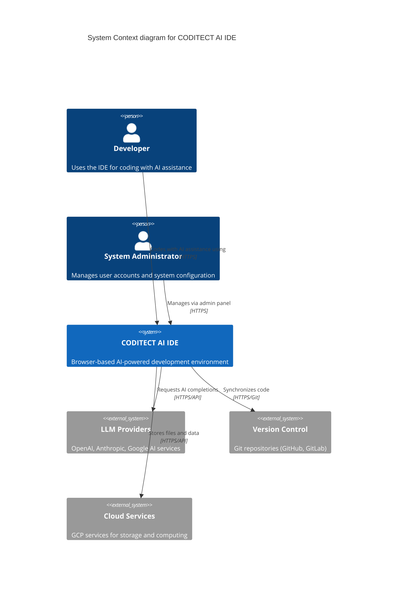
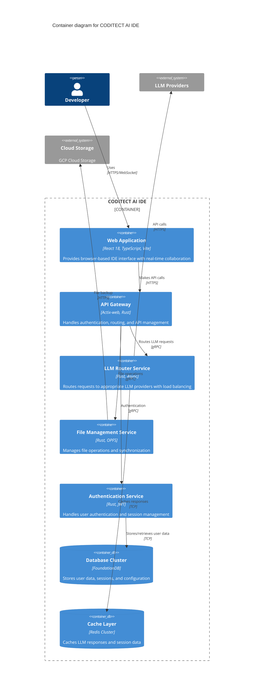
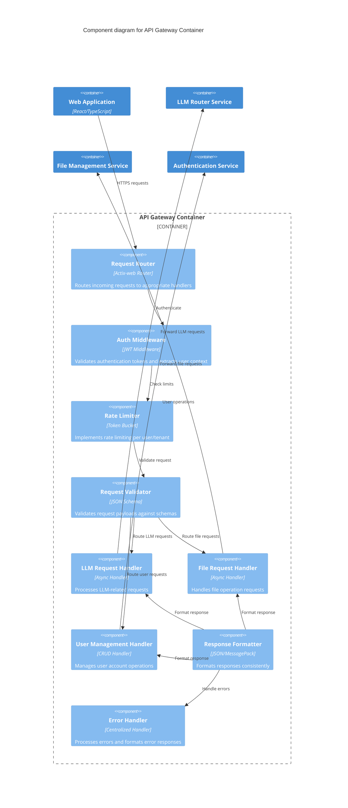
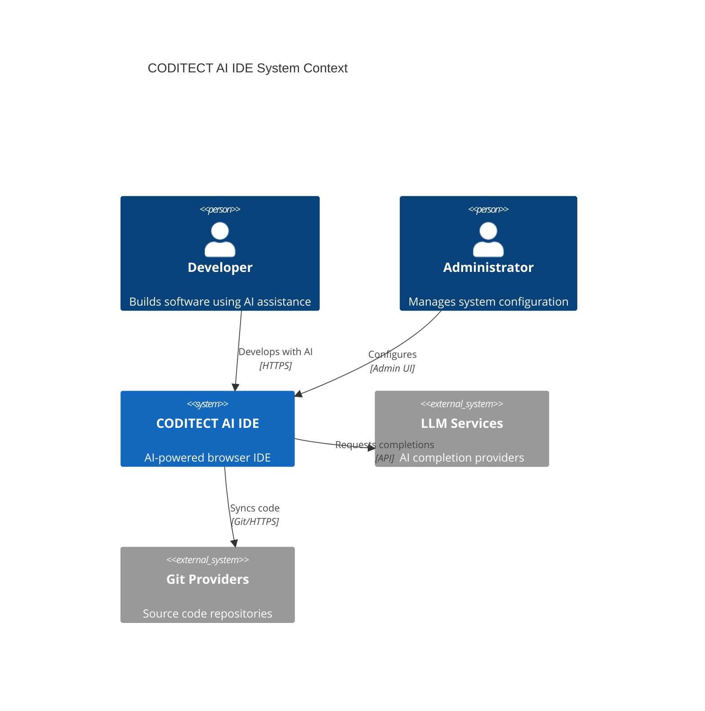

# C4 Methodology Skill - Enterprise Software Architecture Visualization

## Description
Comprehensive C4 (Context, Containers, Components, Code) methodology skill for creating hierarchical software architecture diagrams. Implements diagram-as-code approaches using Structurizr, PlantUML, and Mermaid.js with 2025 best practices for enterprise software architecture visualization and collaborative documentation.

## C4 Model Fundamentals

### The Four Abstraction Levels

#### Level 1: System Context Diagrams
**Purpose**: Show the overall system scope and external dependencies  
**Audience**: Business stakeholders, project managers, architects  
**Focus**: People and systems that interact with the target system



#### Level 2: Container Diagrams
**Purpose**: Show high-level system decomposition and technology choices  
**Audience**: Technical stakeholders, developers, architects  
**Focus**: Runnable/deployable units and their interactions



#### Level 3: Component Diagrams
**Purpose**: Show internal structure of containers and component responsibilities  
**Audience**: Software developers, technical architects  
**Focus**: Components within containers and their interactions



#### Level 4: Code Diagrams (Optional)
**Purpose**: Show implementation details for critical components  
**Audience**: Software developers working on specific components  
**Focus**: Classes, interfaces, and implementation details

```rust
// Critical implementation pattern for LLM Provider Manager
pub trait LLMProvider: Send + Sync {
    async fn complete(&self, request: CompletionRequest) -> Result<CompletionResponse, LLMError>;
    fn provider_id(&self) -> ProviderId;
    fn capabilities(&self) -> Vec<Capability>;
    fn cost_per_token(&self) -> TokenCost;
}

pub struct LLMProviderManager {
    providers: HashMap<ProviderId, Arc<dyn LLMProvider>>,
    load_balancer: Arc<LoadBalancer>,
    circuit_breaker: Arc<CircuitBreaker>,
    metrics_collector: Arc<MetricsCollector>,
}

impl LLMProviderManager {
    pub async fn route_request(&self, request: CompletionRequest) -> Result<CompletionResponse, LLMError> {
        let provider = self.load_balancer.select_provider(&request, &self.providers)?;
        
        self.circuit_breaker
            .call(|| async {
                let response = provider.complete(request).await?;
                self.metrics_collector.record_success(provider.provider_id());
                Ok(response)
            })
            .await
    }
}
```

## Diagram-as-Code Implementation

### 1. Mermaid.js Implementation (Recommended for GitHub)

#### System Context Example
```markdown


#### Container Diagram Automation
```yaml
# GitHub Action for C4 diagram generation
name: Generate C4 Diagrams
on:
  push:
    paths: ['docs/architecture/**/*.md']

jobs:
  generate-diagrams:
    runs-on: ubuntu-latest
    steps:
      - uses: actions/checkout@v3
      - name: Generate C4 diagrams
        run: |
          # Mermaid CLI generates SVG/PNG from markdown
          npx @mermaid-js/mermaid-cli -i docs/architecture/c4-context.md -o diagrams/context.svg
          npx @mermaid-js/mermaid-cli -i docs/architecture/c4-container.md -o diagrams/container.svg
```

### 2. PlantUML with C4-PlantUML (Advanced Features)

```plantuml
@startuml CODITECT-Context
!includeurl https://raw.githubusercontent.com/plantuml-stdlib/C4-PlantUML/master/C4_Context.puml

LAYOUT_WITH_LEGEND()

title System Context Diagram for CODITECT AI IDE

Person(developer, "Developer", "Software developer using AI-powered IDE")
Person(admin, "System Administrator", "Manages users and system configuration")

System(coditect, "CODITECT AI IDE", "Browser-based AI development environment")

System_Ext(llm_providers, "LLM Providers", "OpenAI, Anthropic, Google AI services")
System_Ext(version_control, "Version Control Systems", "GitHub, GitLab, Bitbucket")
System_Ext(cloud_services, "Cloud Infrastructure", "GCP services for compute and storage")

Rel_D(developer, coditect, "Uses for development", "HTTPS")
Rel_D(admin, coditect, "Administers", "HTTPS")
Rel_R(coditect, llm_providers, "Requests AI completions", "HTTPS/REST")
Rel_L(coditect, version_control, "Synchronizes repositories", "Git/HTTPS")
Rel_U(coditect, cloud_services, "Deploys to and stores in", "HTTPS/API")

@enduml
```

### 3. Structurizr DSL (Enterprise Premium)

```structurizr
workspace "CODITECT AI IDE" "AI-powered development environment architecture" {

    model {
        developer = person "Developer" "Uses the IDE for AI-assisted development"
        admin = person "System Administrator" "Manages system configuration"

        coditect = softwareSystem "CODITECT AI IDE" "Browser-based AI development environment" {
            webApp = container "Web Application" "React 18, TypeScript, Vite" "Provides browser IDE interface"
            apiGateway = container "API Gateway" "Actix-web, Rust" "Handles authentication and routing"
            llmRouter = container "LLM Router" "Rust" "Routes requests to LLM providers"
            database = container "Database" "FoundationDB" "Stores user data and sessions"
            cache = container "Cache" "Redis" "Caches LLM responses"
        }

        llmProviders = softwareSystem "LLM Providers" "External AI services" "External"
        versionControl = softwareSystem "Version Control" "Git repositories" "External"

        # Relationships
        developer -> coditect "Uses for development"
        admin -> coditect "Administers"
        coditect -> llmProviders "Requests AI completions"
        coditect -> versionControl "Synchronizes code"

        # Container relationships
        webApp -> apiGateway "Makes API requests" "HTTPS"
        apiGateway -> llmRouter "Routes LLM requests" "gRPC"
        llmRouter -> cache "Caches responses" "Redis protocol"
        apiGateway -> database "Stores/retrieves data" "FDB protocol"
    }

    views {
        systemContext coditect "SystemContext" {
            include *
            autoLayout lr
        }

        container coditect "Containers" {
            include *
            autoLayout lr
        }

        styles {
            element "Software System" {
                background #1168bd
                color #ffffff
            }
            element "External" {
                background #999999
                color #ffffff
            }
            element "Person" {
                shape person
                background #08427b
                color #ffffff
            }
            element "Container" {
                background #438dd5
                color #ffffff
            }
        }
    }
}
```

## 2025 Best Practices Implementation

### 1. Collaborative Development Approach

#### Stakeholder Workshop Template
```yaml
c4_workshop_agenda:
  duration: "3 hours"
  participants: 
    - "Product Manager"
    - "Technical Architect" 
    - "Senior Developers"
    - "DevOps Engineer"
    - "Security Specialist"
    
  activities:
    context_mapping:
      duration: "45 minutes"
      output: "System context boundaries and external dependencies"
      
    container_identification:
      duration: "60 minutes"
      output: "High-level system decomposition"
      
    technology_decisions:
      duration: "45 minutes"
      output: "Technology stack rationale and constraints"
      
    review_and_validation:
      duration: "30 minutes"
      output: "Stakeholder sign-off on architecture decisions"
```

#### Review Process Automation
```yaml
# .github/workflows/c4-review.yml
name: C4 Architecture Review
on:
  pull_request:
    paths: ['docs/architecture/c4-*.md']

jobs:
  architecture-review:
    runs-on: ubuntu-latest
    steps:
      - uses: actions/checkout@v3
      
      - name: Generate C4 Diagrams
        run: |
          npx @mermaid-js/mermaid-cli -i docs/architecture/c4-*.md -o /tmp/diagrams/
          
      - name: Architecture Validation
        run: |
          # Custom validation script for C4 compliance
          python scripts/validate_c4_diagrams.py docs/architecture/
          
      - name: Comment PR with Diagrams
        uses: actions/github-script@v6
        with:
          script: |
            const fs = require('fs');
            const diagrams = fs.readdirSync('/tmp/diagrams/');
            let comment = '## Updated Architecture Diagrams\n\n';
            diagrams.forEach(diagram => {
              comment += `})\n\n`;
            });
            github.rest.issues.createComment({
              issue_number: context.issue.number,
              owner: context.repo.owner,
              repo: context.repo.repo,
              body: comment
            });
```

### 2. Iterative Refinement Process

#### Architecture Evolution Tracking
```yaml
architecture_evolution:
  version_control:
    branching_strategy: "feature/architecture-updates"
    commit_convention: "arch: [level] [component] - description"
    review_requirements: "minimum 2 architecture reviewers"
    
  iteration_schedule:
    sprint_review: "Update diagrams with implementation changes"
    quarterly_review: "Comprehensive architecture validation"
    major_release: "Complete C4 model refresh"
    
  change_impact_analysis:
    automated_checks:
      - "Container dependency validation"
      - "API contract compatibility"
      - "Security boundary verification"
      - "Performance impact assessment"
```

#### Living Documentation Integration
```typescript
// Architecture documentation automation
interface ArchitectureMetadata {
  lastUpdated: Date;
  version: string;
  contributors: string[];
  reviewedBy: string[];
  implementationStatus: 'planned' | 'in-progress' | 'implemented' | 'deprecated';
}

class C4DocumentationManager {
  async updateFromCodebase(codebasePath: string): Promise<void> {
    // Extract actual architecture from code
    const actualContainers = await this.extractContainersFromCode(codebasePath);
    const documentedContainers = await this.parseC4Diagrams();
    
    // Identify discrepancies
    const discrepancies = this.findArchitectureDiscrepancies(
      actualContainers, 
      documentedContainers
    );
    
    if (discrepancies.length > 0) {
      await this.generateUpdatePullRequest(discrepancies);
    }
  }
  
  private async extractContainersFromCode(path: string): Promise<Container[]> {
    // Analyze Docker files, service definitions, deployment configs
    const containers: Container[] = [];
    
    // Parse docker-compose.yml
    const dockerCompose = await this.parseDockerCompose(path);
    containers.push(...dockerCompose.services);
    
    // Parse Kubernetes manifests
    const k8sManifests = await this.parseKubernetesManifests(path);
    containers.push(...k8sManifests.deployments);
    
    return containers;
  }
}
```

### 3. Consistency and Standardization

#### Visual Style Guide
```yaml
c4_style_guide:
  color_palette:
    person: "#08427b"
    internal_system: "#1168bd" 
    external_system: "#999999"
    container: "#438dd5"
    component: "#85bbf0"
    
  typography:
    title_font: "Arial, Bold, 16pt"
    element_font: "Arial, Regular, 10pt"
    relationship_font: "Arial, Italic, 8pt"
    
  layout_rules:
    max_elements_per_diagram: 15
    relationship_line_style: "solid"
    element_spacing: "consistent_grid"
    
  naming_conventions:
    systems: "Title Case with Service Suffix"
    containers: "Title Case"
    components: "PascalCase with Component Suffix"
    relationships: "Verb phrases in present tense"
```

#### Automated Consistency Validation
```python
# C4 diagram validation script
import yaml
import re
from typing import List, Dict

class C4Validator:
    def __init__(self, style_guide: Dict):
        self.style_guide = style_guide
        
    def validate_diagram(self, diagram_content: str) -> List[str]:
        issues = []
        
        # Check naming conventions
        issues.extend(self.validate_naming_conventions(diagram_content))
        
        # Check color consistency  
        issues.extend(self.validate_colors(diagram_content))
        
        # Check element count
        issues.extend(self.validate_element_count(diagram_content))
        
        return issues
        
    def validate_naming_conventions(self, content: str) -> List[str]:
        issues = []
        
        # Extract system names
        systems = re.findall(r'System\([^,]+,\s*"([^"]+)"', content)
        for system in systems:
            if not re.match(r'^[A-Z][a-zA-Z\s]+Service$', system):
                issues.append(f"System '{system}' doesn't follow naming convention")
                
        return issues
        
    def validate_colors(self, content: str) -> List[str]:
        issues = []
        
        # Check for hardcoded colors that don't match style guide
        color_matches = re.findall(r'fill:(#[a-fA-F0-9]{6})', content)
        allowed_colors = self.style_guide['color_palette'].values()
        
        for color in color_matches:
            if color not in allowed_colors:
                issues.append(f"Color {color} not in approved style guide")
                
        return issues
```

## Integration with Software-Design-Architect Agent

### Automated C4 Generation Workflow
```yaml
c4_generation_workflow:
  triggers:
    - "architecture_decision_made"
    - "new_container_added"
    - "system_boundary_changed"
    
  automation_steps:
    context_diagram:
      input: "system_requirements.yaml"
      template: "c4_context_template.mermaid"
      validation: "stakeholder_review_required"
      
    container_diagram:
      input: "docker-compose.yml + kubernetes_manifests"
      template: "c4_container_template.mermaid"
      validation: "technical_review_required"
      
    component_diagram:
      input: "source_code_analysis + api_definitions"
      template: "c4_component_template.mermaid"
      validation: "developer_review_required"
      
  output_formats:
    development: ["mermaid", "svg"]
    documentation: ["png", "pdf"]
    presentation: ["pptx_export"]
```

## Usage Examples

### Enterprise Multi-System Architecture
```bash
/c4-methodology-skill generate context enterprise-multi-system
```

### Microservices Container Mapping
```bash
/c4-methodology-skill generate container microservices-architecture
```

### Component Detail Analysis
```bash
/c4-methodology-skill generate component api-gateway-container
```

## Success Criteria
- 100% stakeholder alignment on system boundaries and responsibilities
- Reduced architecture communication overhead by 40-60%
- Automated diagram generation from infrastructure-as-code
- Living documentation that stays current with implementation
- Clear traceability from business requirements to implementation details