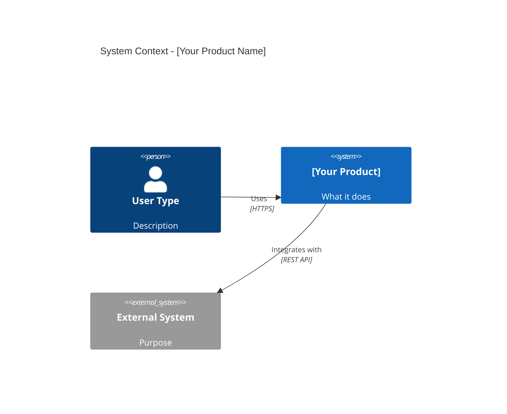
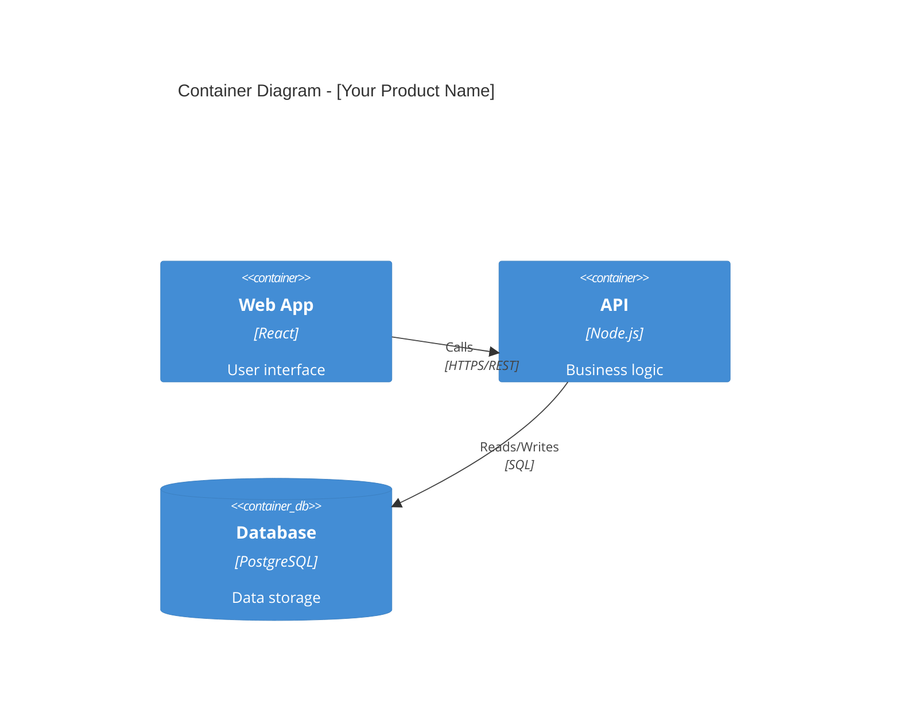
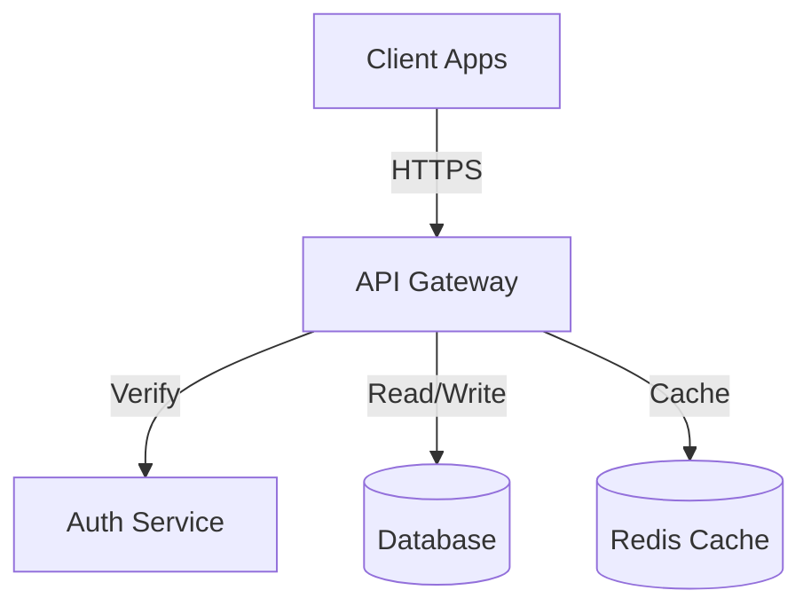
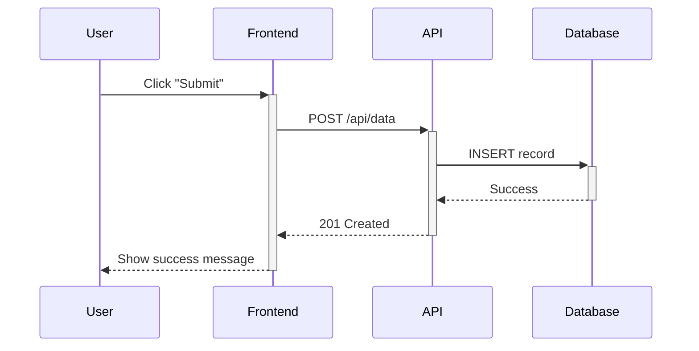

# AZ1.AI CODITECT 1-2-3 QUICKSTART
## From Idea to Production-Ready Product

**Copyright © 2025 AZ1.AI INC. All Rights Reserved.**
**Developed by Hal Casteel, Founder/CEO/CTO, AZ1.AI INC.**

**Version**: 1.0.0
**Last Updated**: 2025-11-15
**Part of**: AZ1.AI CODITECT Project Management & Development Platform

---

## 🏢 About AZ1.AI CODITECT

**AZ1.AI CODITECT** is a comprehensive project management and development platform that provides systematic frameworks for the inception, initiation, assessment, development, and deployment of software projects, products, and applications.

This framework represents years of software development best practices, distilled into a repeatable, scalable process that ensures nothing is forgotten when bringing ideas to production.

**Use this framework for**:
- New product development
- Feature additions to existing products
- Client projects and consulting engagements
- Internal tools and applications
- Open source projects

---

## 📜 License & Usage

**Copyright © 2025 AZ1.AI INC.**

This framework is proprietary to AZ1.AI INC. Unauthorized reproduction, distribution, or commercial use without permission is prohibited.

For licensing inquiries: [Contact AZ1.AI INC.]

---

## 🎯 Purpose

This is your **complete blueprint** for transforming an idea into a production-ready product, business, or application. Follow these steps systematically to ensure nothing is missed.

**What This Covers:**
- ✅ Market research & validation
- ✅ Product strategy & positioning
- ✅ Technical architecture & decisions
- ✅ Project management & execution
- ✅ Go-to-market strategy
- ✅ Issue tracking & resolution

**Who This Is For:**
- Solo founders building their first product
- Development teams launching new features
- Consultants starting client projects
- Anyone turning an idea into reality

---

## 📋 Table of Contents

1. [Phase 1: DISCOVERY & VALIDATION](#phase-1-discovery--validation)
2. [Phase 2: STRATEGY & PLANNING](#phase-2-strategy--planning)
3. [Phase 3: EXECUTION & DELIVERY](#phase-3-execution--delivery)
4. [Templates & Resources](#templates--resources)
5. [Checklist: Ready to Launch?](#checklist-ready-to-launch)

---

## Phase 1: DISCOVERY & VALIDATION

### Step 1.1: Market Research 🔍

**Goal**: Understand if your idea solves a real problem for real people

#### Research Checklist

- [ ] **Conduct web research** on the concept
  - Industry size and growth trends
  - Existing solutions in the market
  - Recent news and developments
  - Technology trends enabling this solution

- [ ] **Define the problem space**
  - What problem are you solving?
  - Who experiences this problem?
  - How painful is this problem? (0-10 scale)
  - What do people do today to solve it?

- [ ] **Market sizing**
  - Total Addressable Market (TAM)
  - Serviceable Addressable Market (SAM)
  - Serviceable Obtainable Market (SOM)

**Output**: `01-market-research.md` in `/docs/research/`

---

### Step 1.2: Product Scope Definition 📐

**Goal**: Clearly define what you're building and why

#### Product Classification

Answer this first:

- [ ] **Is this a Feature?** - Addition to existing product
- [ ] **Is this an Application?** - Standalone software tool
- [ ] **Is this a Product?** - Complete solution with ongoing value
- [ ] **Is this a Business?** - Product + revenue model + operations

**Classification**: _________________ (Fill this in)

#### Scope Questions

- [ ] What is the **core value proposition** in one sentence?
- [ ] What is **OUT of scope** for MVP?
- [ ] What are the **must-have** vs **nice-to-have** features?
- [ ] What is the **minimum viable product** (MVP)?

**Output**: `02-product-scope.md` in `/docs/product/`

---

### Step 1.3: Customer Discovery 👥

**Goal**: Validate that real customers want this

#### Ideal Customer Profile (ICP)

- [ ] **Demographics**
  - Industry vertical: _______________
  - Company size: _______________
  - Job titles: _______________
  - Geographic focus: _______________

- [ ] **Psychographics**
  - Pain points: _______________
  - Goals & motivations: _______________
  - Buying triggers: _______________
  - Decision-making process: _______________

- [ ] **Behavioral**
  - Current tools they use: _______________
  - Budget range: _______________
  - Technical sophistication: _______________

#### Customer Validation

- [ ] Interview 5-10 potential customers
- [ ] Ask about their current workflow
- [ ] Present your solution concept
- [ ] Gauge willingness to pay
- [ ] Get email for early access list

**Output**: `03-customer-discovery.md` in `/docs/research/`

---

### Step 1.4: Competitive Analysis 🥊

**Goal**: Understand the competitive landscape

#### Competitor Matrix

Create a table with:

| Competitor | Strengths | Weaknesses | Pricing | Market Position |
|------------|-----------|------------|---------|-----------------|
| _________  | _________ | __________ | _______ | _______________ |

- [ ] **Direct competitors** (3-5)
- [ ] **Indirect competitors** (2-3)
- [ ] **Substitute solutions** (2-3)

#### Competitive Advantage

Answer these questions:

- [ ] **What is your unfair advantage?**
  - Technology/IP: _______________
  - Team expertise: _______________
  - Network/partnerships: _______________
  - Unique insight: _______________

- [ ] **What is your differentiation?**
  - 10x better: _______________
  - Unique feature: _______________
  - Better experience: _______________
  - Lower cost: _______________

- [ ] **What is your moat?**
  - Network effects: _______________
  - Switching costs: _______________
  - Brand: _______________
  - Data/AI: _______________

**Output**: `04-competitive-analysis.md` in `/docs/strategy/`

---

## Phase 2: STRATEGY & PLANNING

### Step 2.1: Product Strategy 🎯

**Goal**: Define clear positioning and value proposition

#### Value Proposition Canvas

```
For [TARGET CUSTOMER]
Who [STATEMENT OF NEED/OPPORTUNITY]
Our [PRODUCT NAME]
Is a [PRODUCT CATEGORY]
That [STATEMENT OF KEY BENEFIT]
Unlike [PRIMARY COMPETITIVE ALTERNATIVE]
Our product [STATEMENT OF PRIMARY DIFFERENTIATION]
```

Fill this in: `05-value-proposition.md`

#### Product-Market Fit Framework

Use the **7-Fit Framework** (2025):

**Pre-Launch (Customer Value Creation)**:
- [ ] **Problem-Solution Fit**: Does your solution solve the problem?
- [ ] **Solution-Market Fit**: Is there a market for this solution?
- [ ] **Product-Channel Fit**: Can you reach customers efficiently?

**Post-Launch (Business Value Creation)**:
- [ ] **Channel-Model Fit**: Does your distribution support your business model?
- [ ] **Model-Market Fit**: Can you acquire customers profitably?
- [ ] **Product-Market Fit**: Do customers love and retain your product?
- [ ] **Business-Market Fit**: Can you scale sustainably?

**Output**: `06-product-market-fit-plan.md` in `/docs/strategy/`

---

### Step 2.2: Pricing Strategy 💰

**Goal**: Set pricing that captures value and enables growth

#### Pricing Research

- [ ] **Research competitor pricing**
  - Low end: $_____ /month
  - Mid tier: $_____ /month
  - High end: $_____ /month

- [ ] **Calculate your costs**
  - Cost per user: $_____
  - Infrastructure: $_____
  - Support: $_____
  - Sales & Marketing: $_____

- [ ] **Determine pricing model**
  - [ ] Per-user (seat-based)
  - [ ] Usage-based (consumption)
  - [ ] Flat-rate (unlimited)
  - [ ] Freemium + paid tiers
  - [ ] Enterprise (custom)

#### Pricing Tiers

| Tier | Price | Target | Key Features |
|------|-------|--------|--------------|
| Free/Trial | $0 | Individual users | Core features, limited |
| Starter | $____ | Small teams | Full features, support |
| Pro | $____ | Growing companies | Advanced, integrations |
| Enterprise | Custom | Large orgs | Unlimited, SLA, SSO |

- [ ] **Rationale for pricing**
  - Value-based: What outcomes do you deliver?
  - Cost-plus: What's your margin?
  - Competitive: Where do you sit in the market?

**Output**: `07-pricing-strategy.md` in `/docs/strategy/`

---

### Step 2.3: Go-to-Market (GTM) Strategy 🚀

**Goal**: Plan how you'll acquire and retain customers

#### GTM Motion Selection

Choose your primary go-to-market motion:

- [ ] **Product-Led Growth (PLG)**
  - Self-serve signup
  - Freemium or free trial
  - In-product activation
  - Best for: Developer tools, SMB SaaS

- [ ] **Sales-Led Growth (SLG)**
  - Outbound prospecting
  - Demo-driven sales
  - Custom contracts
  - Best for: Enterprise B2B

- [ ] **Marketing-Led Growth (MLG)**
  - Inbound content
  - SEO & paid ads
  - Lead nurturing
  - Best for: Mid-market B2B

- [ ] **Partner-Led Growth (PLG)**
  - Marketplace listings
  - Integration partnerships
  - Reseller channels
  - Best for: Ecosystem plays

**Your GTM Motion**: _______________ (choose one primary)

#### Customer Acquisition Strategy

- [ ] **Month 1-3** (Launch)
  - Target: ____ customers
  - Channels: _______________
  - Budget: $_____
  - Key tactics: _______________

- [ ] **Month 4-6** (Growth)
  - Target: ____ customers
  - Channels: _______________
  - Budget: $_____
  - Key tactics: _______________

- [ ] **Month 7-12** (Scale)
  - Target: ____ customers
  - Channels: _______________
  - Budget: $_____
  - Key tactics: _______________

#### CAC & LTV Targets

- [ ] **Customer Acquisition Cost (CAC)**: $_____
- [ ] **Lifetime Value (LTV)**: $_____
- [ ] **LTV:CAC Ratio**: _____ : 1 (target: 3:1 minimum)
- [ ] **Months to recover CAC**: _____ (target: <12 months)

**Output**: `08-go-to-market-strategy.md` in `/docs/strategy/`

---

### Step 2.4: Technical Architecture (C4 Model) 🏗️

**Goal**: Design a scalable, maintainable system using the C4 Model methodology

#### C4 Model Overview

The C4 Model provides **4 levels of architectural abstraction**:

1. **C1: System Context** - The big picture (stakeholder view)
2. **C2: Container** - High-level technology choices (architect view)
3. **C3: Component** - Component breakdown (developer view)
4. **C4: Code** - Implementation details (code view)

**See**: `C4-ARCHITECTURE-METHODOLOGY.md` for complete documentation

#### C1: System Context Diagram

**Create this FIRST** - shows how your system fits into the world

- [ ] Identify all user types (personas)
- [ ] Map external systems (APIs, databases, services)
- [ ] Show data flows and integrations
- [ ] Use Mermaid C4 syntax

**Template**:


**Output**: `c1-system-context.mmd` in `/docs/architecture/diagrams/`

#### C2: Container Diagram

**Create SECOND** - shows major technical components

- [ ] Web applications (React, Vue, etc.)
- [ ] Mobile apps (iOS, Android)
- [ ] API servers (Node.js, Python, Go)
- [ ] Databases (PostgreSQL, MongoDB)
- [ ] Caches (Redis, Memcached)
- [ ] Message queues (RabbitMQ, Kafka)

**Template**:


**Output**: `c2-container.mmd` in `/docs/architecture/diagrams/`

#### C3: Component Diagrams

**Create for EACH container** - shows internal components

- [ ] Break down frontend into components
- [ ] Break down API into services
- [ ] Show data flow between components
- [ ] Document interfaces

**Output**: `c3-component-[container-name].mmd` for each container

#### C4: Code Diagrams

**Create for COMPLEX components** - shows class structure

- [ ] Use UML class diagrams
- [ ] Show inheritance relationships
- [ ] Document key interfaces
- [ ] Guide implementation

**Output**: `c4-code-[component-name].mmd` for complex components

#### Architecture Decision Records (ADRs)

For EVERY major technical decision, create an ADR:

**Template**: `ADR-###-[short-title].md`

```markdown
# ADR-001: [Decision Title]

**Status**: Proposed | Accepted | Deprecated | Superseded
**Date**: YYYY-MM-DD
**Decision Makers**: [Names]

## Context
What is the issue we're addressing?

## Decision
What are we doing?

## Consequences
What becomes easier or harder as a result?

## Alternatives Considered
What other options did we evaluate?
```

**Required ADRs for all projects**:
- [ ] ADR-001: Tech stack selection
- [ ] ADR-002: Database choice
- [ ] ADR-003: Deployment architecture
- [ ] ADR-004: Authentication & authorization
- [ ] ADR-005: Monitoring & observability
- [ ] ADR-006: CI/CD pipeline

**Output**: `/docs/architecture/adrs/` directory

#### System Design Documents

- [ ] **High-level architecture diagram** (Mermaid)
- [ ] **Data flow diagrams** (Mermaid)
- [ ] **Database schema** (ER diagram)
- [ ] **API specifications** (OpenAPI/Swagger)
- [ ] **Infrastructure as Code** (Terraform/CDK)

**Output**: `09-system-design.md` with diagrams in `/docs/architecture/`

---

### Step 2.5: Project Planning 📅

**Goal**: Break down work into executable tasks

#### Project Structure

Create this directory structure:

```
/project-root/
├── docs/
│   ├── research/
│   ├── strategy/
│   ├── architecture/
│   │   ├── adrs/
│   │   └── diagrams/
│   ├── product/
│   └── processes/
├── src/
├── tests/
├── .github/
│   └── workflows/
└── project-management/
    ├── sprints/
    ├── issues/
    └── retrospectives/
```

#### Milestone Planning

Define 3-5 major milestones:

| Milestone | Target Date | Key Deliverables | Success Criteria |
|-----------|-------------|------------------|------------------|
| MVP | _________ | _____________ | _____________ |
| Beta | _________ | _____________ | _____________ |
| Launch | _________ | _____________ | _____________ |
| Growth | _________ | _____________ | _____________ |

#### Sprint Planning (2-week sprints)

- [ ] **Sprint 1-2**: Foundation & setup
- [ ] **Sprint 3-4**: Core features
- [ ] **Sprint 5-6**: Integration & testing
- [ ] **Sprint 7-8**: Polish & launch prep

**Output**: `10-project-plan.md` in `/project-management/`

---

### Step 2.6: Task List with Checkboxes ✅

**Goal**: Track every single task to completion

#### Master Task List Template

```markdown
## Sprint [Number]: [Name] ([Start Date] - [End Date])

### Planning
- [ ] Sprint planning meeting completed
- [ ] User stories defined and estimated
- [ ] Sprint goal documented

### Development
- [ ] Task 1: [Description]
  - [ ] Design reviewed
  - [ ] Implementation complete
  - [ ] Unit tests written
  - [ ] Code review passed
  - [ ] Merged to main

- [ ] Task 2: [Description]
  - [ ] Design reviewed
  - [ ] Implementation complete
  - [ ] Unit tests written
  - [ ] Code review passed
  - [ ] Merged to main

### Testing
- [ ] Integration tests passing
- [ ] E2E tests passing
- [ ] Performance testing complete
- [ ] Security scan passed

### Documentation
- [ ] API docs updated
- [ ] User docs updated
- [ ] ADRs written for major decisions
- [ ] Changelog updated

### Sprint Closure
- [ ] Demo to stakeholders
- [ ] Sprint retrospective completed
- [ ] Sprint metrics captured
- [ ] Next sprint planned
```

**Output**: `11-master-task-list.md` in `/project-management/`

---

## Phase 3: EXECUTION & DELIVERY

### Step 3.1: Issue Management Process 🐛

**Goal**: Systematically resolve all issues using the 6-step process

#### The 6-Step Issue Resolution Process

**From**: `ISSUE-RESOLUTION-PROCESS.md`

For EVERY issue, follow these steps:

```
1. INVESTIGATE → 2. IDENTIFY → 3. SOLUTION → 4. FIX → 5. TEST → 6. DEPLOY
```

**No issue is "complete" until all 6 steps are checked off.**

#### Issue Template

```markdown
# Issue #[NUM]: [Title]

**Reporter**: [Name/User]
**Date**: YYYY-MM-DD
**Priority**: Critical | High | Medium | Low
**Status**: Pending | In Progress | Completed

## User Quote
> [Exact description of the issue]

## 1. INVESTIGATE 🔍
- [ ] Reproduce the issue
- [ ] Gather context
- [ ] Document symptoms
- [ ] Check related systems
- [ ] Review user quote

## 2. IDENTIFY 🎯
- [ ] Locate the bug
- [ ] Understand data flow
- [ ] Check for duplicates
- [ ] Identify scope
- [ ] Find related code

## 3. SOLUTION 💡
- [ ] Propose solution
- [ ] Consider alternatives
- [ ] Evaluate trade-offs
- [ ] Plan implementation
- [ ] Identify tests needed

## 4. FIX 🔧
- [ ] Write the code
- [ ] Follow conventions
- [ ] Add comments
- [ ] Update types
- [ ] Check for side effects

## 5. TEST ✅
- [ ] Build succeeds
- [ ] Manual testing
- [ ] Check edge cases
- [ ] Verify no regressions
- [ ] User acceptance

## 6. DEPLOY 🚀
- [ ] Rebuild app
- [ ] Version bump
- [ ] Commit changes
- [ ] Update docs
- [ ] Launch application
```

**Output**: Issues tracked in `/ project-management/issues/` directory

---

### Step 3.2: Screenshot Automation (Before/After) 📸

**Goal**: Document visual changes for every issue

#### Automated Screenshot Workflow

For UI changes:

1. **Before** fixing issue:
   ```bash
   ai-doc --app YourApp --issue XXX --state before
   ```

2. **After** fixing issue:
   ```bash
   ai-doc --app YourApp --issue XXX --state after
   ```

3. **Compare**:
   ```bash
   ai-doc --compare XXX
   ```

**Tool**: Use `AI Screenshot Automator` (separate repository)
**Repository**: https://github.com/coditect-ai/az1.ai-coditect-ai-screenshot-automator

**Output**: Screenshots in `/docs/screenshots/[issue-num]/before/` and `/after/`

---

### Step 3.3: Continuous Integration & Deployment ⚙️

**Goal**: Automate build, test, and deploy processes

#### CI/CD Checklist

- [ ] **GitHub Actions** (or CI tool) configured
  - [ ] Automated tests on every PR
  - [ ] Build validation
  - [ ] Security scanning (Snyk, Dependabot)
  - [ ] Code quality checks (ESLint, Prettier)

- [ ] **Deployment Pipeline**
  - [ ] Staging environment
  - [ ] Production environment
  - [ ] Rollback capability
  - [ ] Health checks

- [ ] **Monitoring & Alerts**
  - [ ] Error tracking (Sentry)
  - [ ] Performance monitoring (DataDog, New Relic)
  - [ ] Uptime monitoring (UptimeRobot)
  - [ ] Log aggregation (Loggly, Papertrail)

**Output**: `.github/workflows/` directory with CI/CD configs

---

### Step 3.4: Documentation As Code 📝

**Goal**: Keep documentation synchronized with code

#### Required Documentation

- [ ] **README.md** - Project overview, setup instructions
- [ ] **CONTRIBUTING.md** - How to contribute
- [ ] **CHANGELOG.md** - Version history
- [ ] **API.md** - API reference (auto-generated if possible)
- [ ] **ARCHITECTURE.md** - System architecture overview
- [ ] **DEPLOYMENT.md** - Deployment guide

#### Diagram Standards

Use **Mermaid** for all diagrams (renders in GitHub/GitLab):

**Architecture Diagram Example**:


**Data Flow Example**:


**Output**: All diagrams in `/docs/architecture/diagrams/` as `.mmd` files

---

### Step 3.5: TDD & Testing Strategy 🧪

**Goal**: Ensure code quality through comprehensive testing

#### Test Coverage Requirements

- [ ] **Unit Tests**: 80%+ coverage
- [ ] **Integration Tests**: Critical paths covered
- [ ] **E2E Tests**: User flows covered
- [ ] **Performance Tests**: Load testing for critical endpoints

#### TDD Workflow

```
1. Write failing test
2. Write minimal code to pass
3. Refactor for quality
4. Repeat
```

#### Test Structure

```
/tests/
├── unit/
│   ├── components/
│   ├── services/
│   └── utils/
├── integration/
│   ├── api/
│   └── database/
└── e2e/
    ├── user-flows/
    └── smoke-tests/
```

**Output**: Test files alongside source code, coverage reports in CI

---

## Templates & Resources

### Quick Links

All templates are in this repository and can be used as submodules:

- **ADR Template**: `/templates/ADR-template.md`
- **Issue Template**: `/templates/issue-template.md`
- **Sprint Planning**: `/templates/sprint-planning-template.md`
- **Retrospective**: `/templates/retrospective-template.md`
- **Executive Summary**: `/templates/executive-summary-template.md`
- **Product Requirements**: `/templates/prd-template.md`
- **Technical Spec**: `/templates/technical-spec-template.md`

### Mermaid Diagram Examples

- Architecture diagrams: `/templates/diagrams/architecture-examples.mmd`
- Sequence diagrams: `/templates/diagrams/sequence-examples.mmd`
- State machines: `/templates/diagrams/state-examples.mmd`
- Entity relationships: `/templates/diagrams/er-examples.mmd`

---

## Checklist: Ready to Launch?

### Pre-Launch Checklist

#### Product
- [ ] MVP features complete and tested
- [ ] Performance meets benchmarks
- [ ] Security audit passed
- [ ] Accessibility (WCAG) compliance
- [ ] Mobile responsive (if web app)
- [ ] Error handling comprehensive
- [ ] Loading states polished

#### Business
- [ ] Pricing finalized
- [ ] Payment processing integrated
- [ ] Terms of Service written
- [ ] Privacy Policy written
- [ ] GDPR/compliance handled
- [ ] Support email/chat ready

#### Go-to-Market
- [ ] Landing page live
- [ ] Product Hunt submission ready
- [ ] Email list built (100+ subscribers)
- [ ] Social media accounts created
- [ ] Launch blog post written
- [ ] Press release drafted
- [ ] Demo video created

#### Operations
- [ ] Monitoring & alerts configured
- [ ] On-call rotation scheduled
- [ ] Incident response plan documented
- [ ] Backup & disaster recovery tested
- [ ] Customer support playbook created
- [ ] Onboarding emails automated

#### Legal & Finance
- [ ] Company/LLC registered
- [ ] Business bank account opened
- [ ] Accounting software setup (QuickBooks, Xero)
- [ ] Tax ID (EIN) obtained
- [ ] Insurance (E&O, Cyber) purchased

---

## Executive Summary Template

For every project, create a 1-page executive summary:

```markdown
# [Project Name] - Executive Summary

**Date**: [Date]
**Author**: [Name]
**Version**: 1.0

## The Opportunity

[2-3 sentences on the market opportunity]

## The Solution

[2-3 sentences on what you're building]

## Value Proposition

For [target customer], our [product] delivers [key benefit] by [unique approach].

## Market Size

- TAM: $_____ billion
- SAM: $_____ million
- SOM: $_____ (Year 1 target)

## Business Model

- Pricing: $_____/month (avg)
- CAC: $_____
- LTV: $_____
- Gross Margin: ____%

## Go-to-Market

Primary channel: _____
Launch date: _____
Year 1 goal: _____ customers, $_____ ARR

## Competition

| Competitor | Our Advantage |
|------------|---------------|
| __________ | _____________ |

## Team

- [Name]: [Role] - [Relevant experience]

## Funding

- Current: $_____ (bootstrapped/raised)
- Runway: _____ months
- Next milestone: _____

## Risks & Mitigations

1. **Risk**: _____ | **Mitigation**: _____
2. **Risk**: _____ | **Mitigation**: _____

## Ask

[If seeking investment/partnership/etc.]
```

**Output**: `executive-summary.md` in `/docs/`

---

## How to Use This Repository as a Submodule

### Adding to a New Project

```bash
# In your new project repository
git submodule add https://github.com/coditect-ai/coditect-core.git .coditect

# Create symlink for compatibility with Claude Code
ln -s .coditect .claude

# Add .claude symlink to .gitignore (since it's project-specific)
echo ".claude" >> .gitignore

# This gives you access to all AZ1.AI CODITECT templates and processes
```

**Directory Structure**:
```
/your-project/
├── .coditect/                    # Submodule (actual files)
│   ├── AZ1.AI-CODITECT-1-2-3-QUICKSTART.md
│   ├── C4-ARCHITECTURE-METHODOLOGY.md
│   ├── ISSUE-RESOLUTION-PROCESS.md
│   └── templates/
├── .claude -> .coditect          # Symlink for Claude Code compatibility
├── docs/
├── src/
└── project-management/
```

### Initial Setup

```bash
# Navigate to the submodule
cd .coditect

# Copy templates to your project structure
cp templates/ADR-template.md ../docs/architecture/adrs/ADR-001-example.md
cp templates/issue-template.md ../project-management/issues/issue-template.md
cp templates/executive-summary-template.md ../docs/executive-summary.md

# Copy process documents
cp ISSUE-RESOLUTION-PROCESS.md ../docs/processes/
cp C4-ARCHITECTURE-METHODOLOGY.md ../docs/architecture/

# Return to project root
cd ..
```

### Keeping Templates Up to Date

```bash
# Pull latest templates from AZ1.AI CODITECT repository
git submodule update --remote .coditect

# Review changes before copying to your project
cd .coditect
git log
cd ..

# Update your project templates as needed
```

### Why .coditect with .claude Symlink?

**Primary Directory**: `.coditect`
- Official name for the AZ1.AI CODITECT platform
- Contains all project management frameworks
- Version controlled as a submodule

**Symlink**: `.claude`
- Maintains compatibility with Claude Code conventions
- Allows Claude to access frameworks via familiar path
- Project-specific (not committed to version control)

This approach:
- ✅ Brands the platform correctly
- ✅ Works with Claude Code workflows
- ✅ Keeps project history clean
- ✅ Allows easy updates from main repository

---

## Questions & Support

### Common Questions

**Q: How long does this process take?**
A: For a typical SaaS MVP:
- Discovery & Validation: 2-3 weeks
- Strategy & Planning: 1-2 weeks
- Execution (MVP): 8-12 weeks
- Total: ~3-4 months

**Q: Can I skip steps?**
A: You can, but each step exists because teams that skip it usually fail. The order matters.

**Q: What if I'm a solo founder?**
A: Follow the same process, but move faster. Focus on "good enough" over "perfect" for early stages.

**Q: How do I know if I have product-market fit?**
A: Key signals:
- Customers are pulling (not you pushing)
- Retention is strong (>90% monthly for B2B)
- Word-of-mouth referrals happening
- Willingness to pay is high

**Q: When should I start charging?**
A: Charge from day 1 if possible. Free users don't give accurate demand signals.

### Get Help

- **Issues**: File issues in this repository
- **Discussions**: Use GitHub Discussions
- **Email**: [support email]

---

## Changelog

### v1.0.0 (2025-11-15)
- Initial release
- Comprehensive 1-2-3 quickstart framework
- C4 Model architecture methodology integration
- Integration with AI Screenshot Automator
- Based on 2025 best practices (Lean Startup, Product-Led Growth, C4, ADRs)
- Full branding and copyright protection

---

## 📜 Copyright & License

**Copyright © 2025 AZ1.AI INC. All Rights Reserved.**

**Developed by**: Hal Casteel, Founder/CEO/CTO, AZ1.AI INC.

**Product**: AZ1.AI CODITECT Project Management & Development Platform

This framework is proprietary intellectual property of AZ1.AI INC. Unauthorized reproduction, distribution, modification, or commercial use without express written permission from AZ1.AI INC. is strictly prohibited.

### License Grant

This framework may be used by:
- Licensed AZ1.AI CODITECT platform users
- AZ1.AI INC. clients and partners (per agreement)
- Individual developers for personal projects (non-commercial use)

For commercial licensing, enterprise agreements, or partnership inquiries:
- **Website**: [AZ1.AI INC.]
- **Email**: legal@az1.ai
- **Contact**: Hal Casteel, CEO/CTO

### Trademark Notice

"AZ1.AI", "CODITECT", and "AZ1.AI CODITECT" are trademarks of AZ1.AI INC.

---

**Built with Excellence by AZ1.AI CODITECT**

*Transform ideas into production-ready products, systematically.*

**AZ1.AI INC.**
Founded 2025
Innovation Through Systematic Development

---
