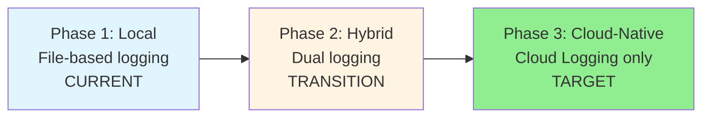
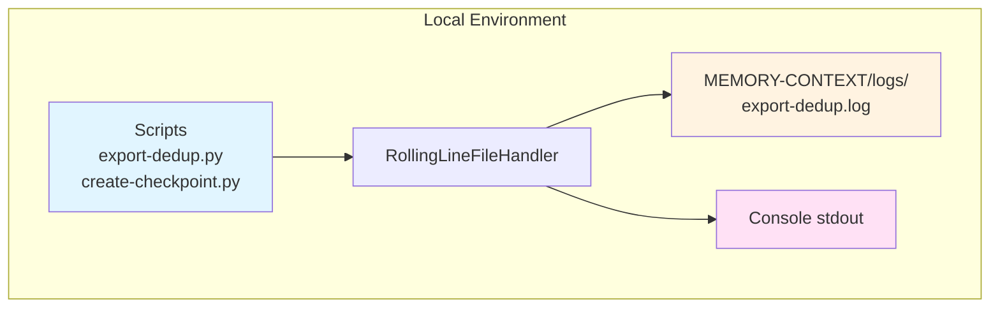
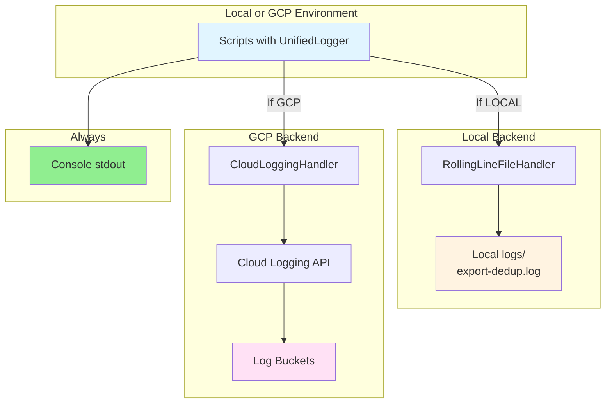
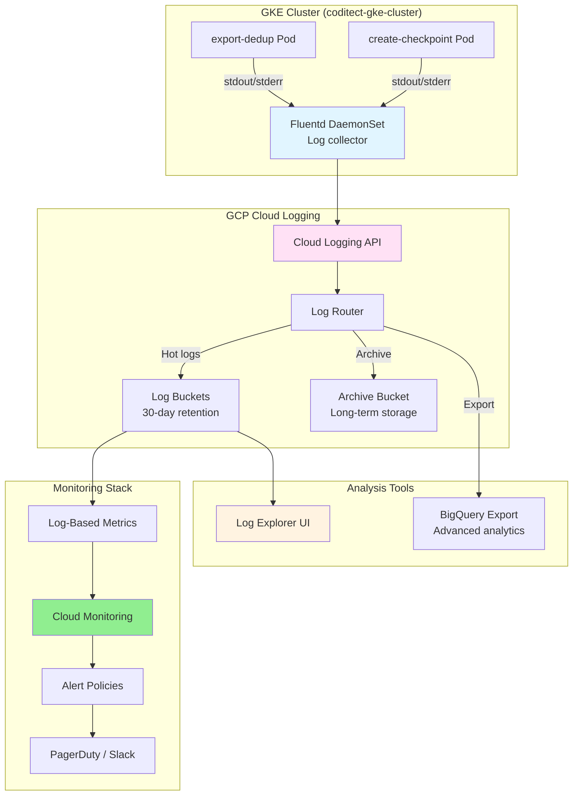

# Logging Migration Guide: Local → GCP Cloud Logging

**Document:** LOGGING-MIGRATION-GUIDE.md
**Date:** 2024-11-24
**Author:** AZ1.AI INC (Hal Casteel)
**Status:** Active

---

## Table of Contents

1. [Overview](#overview)
2. [Three-Phase Migration Strategy](#three-phase-migration-strategy)
3. [Phase 1: Local Development](#phase-1-local-development-current)
4. [Phase 2: Hybrid Mode](#phase-2-hybrid-mode-transition)
5. [Phase 3: Cloud-Native](#phase-3-cloud-native-target)
6. [GKE Deployment](#gke-deployment)
7. [Monitoring & Alerting](#monitoring--alerting)
8. [Cost Estimation](#cost-estimation)
9. [Troubleshooting](#troubleshooting)

---

## Overview

### Current State

Export-dedup system uses **local file-based logging** with:
- RollingLineFileHandler (5000-line max)
- Dual output (file + console)
- Located in `MEMORY-CONTEXT/logs/`

### Target State

**GCP Cloud Logging** with:
- Structured JSON logs
- Distributed tracing with correlation IDs
- Resource labels (GKE pod metadata)
- Log-based metrics for monitoring
- Real-time alerting
- Long-term log retention

### Migration Goals

✅ **Zero downtime** - Gradual migration without service interruption
✅ **Backward compatibility** - Works in both local and cloud environments
✅ **Automatic detection** - Environment auto-detection (local vs GCP)
✅ **Structured logging** - Consistent JSON format for analysis
✅ **Cost efficiency** - Optimize log volume and retention

---

## Three-Phase Migration Strategy



### Timeline

| Phase | Duration | Effort | Risk |
|-------|----------|--------|------|
| **Phase 1** (Local) | Ongoing | 0 hours (complete) | Low |
| **Phase 2** (Hybrid) | 2 weeks | 16 hours | Medium |
| **Phase 3** (Cloud-Native) | 4 weeks | 32 hours | Low |
| **Total** | 6 weeks | 48 hours | - |

---

## Phase 1: Local Development (CURRENT)

### Architecture



### Configuration

**Current logging setup:**

```python
from rolling_log_handler import setup_rolling_logger

logger = setup_rolling_logger(
    log_file=Path("MEMORY-CONTEXT/logs/export-dedup.log"),
    logger_name="export_dedup",
    max_lines=5000,
    console_level=logging.INFO,
    file_level=logging.DEBUG
)
```

### Characteristics

✅ **Pros:**
- Simple setup, no external dependencies
- Immediate feedback (console output)
- Complete control over log format
- No cost

⚠️ **Cons:**
- Limited to single machine
- No distributed tracing
- Manual log rotation
- Difficult to aggregate across services

### Files

```
MEMORY-CONTEXT/logs/
├── export-dedup.log         # Main workflow logs (rolling, 5000 lines)
├── checkpoint-creation.log  # Checkpoint logs (append mode)
└── git-operations.log       # Git staging/commit/push (future)
```

---

## Phase 2: Hybrid Mode (TRANSITION)

### Architecture



### Configuration

**New unified logging setup:**

```python
from unified_logger import setup_unified_logger

# Automatically detects environment (local vs GCP)
logger = setup_unified_logger(
    component="export-dedup",
    log_file=Path("MEMORY-CONTEXT/logs/export-dedup.log"),  # Used if local
    max_lines=5000,
    console_level=logging.INFO,
    file_level=logging.DEBUG
)

# Works the same in both environments!
logger.info("Processing exports", metadata={'count': 3})
logger.log_metrics("deduplicate", metrics={'dedup_rate': 78.3})
```

### Environment Detection

```python
def detect_environment() -> str:
    """Automatically detect if running in GCP or locally."""
    gcp_indicators = [
        'KUBERNETES_SERVICE_HOST',  # GKE
        'K_SERVICE',                 # Cloud Run
        'GOOGLE_CLOUD_PROJECT',      # General GCP
    ]

    for indicator in gcp_indicators:
        if os.getenv(indicator):
            return 'gcp'

    return 'local'
```

### Migration Steps

**Step 1: Install dependencies**

```bash
# For local development (optional GCP support)
pip install google-cloud-logging

# Or use requirements.txt
echo "google-cloud-logging>=3.5.0" >> requirements.txt
pip install -r requirements.txt
```

**Step 2: Update scripts to use UnifiedLogger**

```python
# OLD (export-dedup.py)
from rolling_log_handler import setup_rolling_logger
logger = setup_rolling_logger(...)

# NEW (export-dedup.py)
from unified_logger import setup_unified_logger
logger = setup_unified_logger(
    component="export-dedup",
    # Same parameters as before!
)
```

**Step 3: Test locally**

```bash
# Should work exactly as before
python scripts/export-dedup.py "Test session"

# Check logs still go to MEMORY-CONTEXT/logs/
ls -lh MEMORY-CONTEXT/logs/export-dedup.log
```

**Step 4: Deploy to GCP (when ready)**

```bash
# Set GCP credentials
export GOOGLE_APPLICATION_CREDENTIALS="path/to/service-account-key.json"
export GOOGLE_CLOUD_PROJECT="coditect-cloud-infra"

# Run - automatically uses Cloud Logging!
python scripts/export-dedup.py "Test session"

# View logs in GCP Console
gcloud logging read "resource.type=k8s_pod" --limit 50
```

### Characteristics

✅ **Pros:**
- Works in both local and cloud environments
- Zero code changes between environments
- Gradual migration (test locally first)
- Backward compatible

⚠️ **Cons:**
- Requires GCP library installation
- Slightly more complex configuration
- Need to manage GCP credentials locally

---

## Phase 3: Cloud-Native (TARGET)

### Architecture



### GKE Deployment Configuration

**1. Kubernetes Deployment (export-dedup-deployment.yaml)**

```yaml
apiVersion: apps/v1
kind: Deployment
metadata:
  name: export-dedup
  namespace: coditect-core
  labels:
    app: export-dedup
    component: coditect-core
spec:
  replicas: 1
  selector:
    matchLabels:
      app: export-dedup
  template:
    metadata:
      labels:
        app: export-dedup
        component: coditect-core
    spec:
      serviceAccountName: coditect-workload-identity
      containers:
      - name: export-dedup
        image: gcr.io/coditect-cloud-infra/export-dedup:latest
        env:
        # GCP environment variables
        - name: GOOGLE_CLOUD_PROJECT
          value: "coditect-cloud-infra"
        - name: CLUSTER_NAME
          value: "coditect-gke-cluster"
        - name: NAMESPACE
          valueFrom:
            fieldRef:
              fieldPath: metadata.namespace
        - name: NODE_NAME
          valueFrom:
            fieldRef:
              fieldPath: spec.nodeName
        - name: HOSTNAME
          valueFrom:
            fieldRef:
              fieldPath: metadata.name

        # Application configuration
        - name: LOG_LEVEL
          value: "INFO"
        - name: MAX_LOG_LINES
          value: "5000"

        resources:
          requests:
            memory: "256Mi"
            cpu: "250m"
          limits:
            memory: "512Mi"
            cpu: "500m"

        volumeMounts:
        - name: memory-context
          mountPath: /app/MEMORY-CONTEXT

      volumes:
      - name: memory-context
        persistentVolumeClaim:
          claimName: memory-context-pvc
```

**2. Fluentd DaemonSet (fluentd-config.yaml)**

```yaml
apiVersion: v1
kind: ConfigMap
metadata:
  name: fluentd-config
  namespace: kube-system
data:
  fluent.conf: |
    # Input: Kubernetes container logs
    <source>
      @type tail
      path /var/log/containers/*coditect-core*.log
      pos_file /var/log/fluentd-coditect.log.pos
      tag coditect.*
      read_from_head true
      <parse>
        @type json
        time_format %Y-%m-%dT%H:%M:%S.%NZ
      </parse>
    </source>

    # Filter: Add Kubernetes metadata
    <filter coditect.**>
      @type kubernetes_metadata
      @id filter_kube_metadata
    </filter>

    # Filter: Parse structured logs
    <filter coditect.**>
      @type parser
      key_name log
      reserve_data true
      <parse>
        @type json
      </parse>
    </filter>

    # Output: Google Cloud Logging
    <match coditect.**>
      @type google_cloud
      use_metadata_service true
      buffer_chunk_limit 512k
      flush_interval 5s
      max_retry_wait 30
      disable_retry_limit
      num_threads 2
    </match>

---
apiVersion: apps/v1
kind: DaemonSet
metadata:
  name: fluentd-gcp
  namespace: kube-system
spec:
  selector:
    matchLabels:
      app: fluentd-gcp
  template:
    metadata:
      labels:
        app: fluentd-gcp
    spec:
      serviceAccountName: fluentd-gcp
      containers:
      - name: fluentd-gcp
        image: gcr.io/google-containers/fluentd-gcp:1.8.9
        env:
        - name: FLUENT_UID
          value: "0"
        resources:
          limits:
            memory: 500Mi
          requests:
            cpu: 100m
            memory: 200Mi
        volumeMounts:
        - name: varlog
          mountPath: /var/log
        - name: varlibdockercontainers
          mountPath: /var/lib/docker/containers
          readOnly: true
        - name: config
          mountPath: /etc/fluent/config.d
      volumes:
      - name: varlog
        hostPath:
          path: /var/log
      - name: varlibdockercontainers
        hostPath:
          path: /var/lib/docker/containers
      - name: config
        configMap:
          name: fluentd-config
```

**3. Workload Identity (service-account.yaml)**

```yaml
apiVersion: v1
kind: ServiceAccount
metadata:
  name: coditect-workload-identity
  namespace: coditect-core
  annotations:
    iam.gke.io/gcp-service-account: coditect-logger@coditect-cloud-infra.iam.gserviceaccount.com

---
# GCP IAM binding (run with gcloud)
# gcloud iam service-accounts add-iam-policy-binding \
#   coditect-logger@coditect-cloud-infra.iam.gserviceaccount.com \
#   --role roles/iam.workloadIdentityUser \
#   --member "serviceAccount:coditect-cloud-infra.svc.id.goog[coditect-core/coditect-workload-identity]"
```

### Cloud Logging Configuration

**1. Log Router (log-router.yaml)**

```yaml
# Create log sink for long-term archive
gcloud logging sinks create coditect-archive-sink \
  bigquery.googleapis.com/projects/coditect-cloud-infra/datasets/coditect_logs \
  --log-filter='resource.type="k8s_pod" AND resource.labels.namespace_name="coditect-core"'

# Create log sink for real-time analysis
gcloud logging sinks create coditect-realtime-sink \
  storage.googleapis.com/coditect-logs-archive \
  --log-filter='resource.type="k8s_pod" AND resource.labels.namespace_name="coditect-core" AND severity>=INFO'
```

**2. Log Buckets (retention policy)**

```bash
# Create custom log bucket with 30-day retention
gcloud logging buckets create coditect-logs \
  --location=us-central1 \
  --retention-days=30 \
  --description="Coditect application logs"

# Create log sink to custom bucket
gcloud logging sinks create coditect-bucket-sink \
  logging.googleapis.com/projects/coditect-cloud-infra/locations/us-central1/buckets/coditect-logs \
  --log-filter='resource.type="k8s_pod" AND resource.labels.namespace_name="coditect-core"'
```

**3. Log-Based Metrics**

```bash
# Metric: Deduplication rate
gcloud logging metrics create dedup_rate \
  --description="Export deduplication rate" \
  --log-filter='jsonPayload.operation="deduplicate"' \
  --value-extractor='EXTRACT(jsonPayload.metrics.dedup_rate)'

# Metric: Git staging errors
gcloud logging metrics create git_staging_errors \
  --description="Git staging operation errors" \
  --log-filter='jsonPayload.operation="git_staging" AND severity="ERROR"' \
  --metric-kind=DELTA

# Metric: Workflow duration
gcloud logging metrics create workflow_duration_ms \
  --description="Export-dedup workflow duration in milliseconds" \
  --log-filter='jsonPayload.operation="workflow_complete"' \
  --value-extractor='EXTRACT(jsonPayload.duration_ms)'
```

### Characteristics

✅ **Pros:**
- Centralized logging across all services
- Real-time monitoring and alerting
- Distributed tracing with correlation IDs
- Long-term retention (BigQuery archive)
- Advanced query capabilities (Log Explorer)
- Integration with Cloud Monitoring
- No local disk management

⚠️ **Cons:**
- Monthly cost ($0.50/GB ingestion + $0.01/GB storage)
- Requires GCP infrastructure setup
- Learning curve for Log Explorer UI
- Dependent on network connectivity

---

## GKE Deployment

### Prerequisites

**1. GCP Project Setup**

```bash
# Set project
gcloud config set project coditect-cloud-infra

# Enable required APIs
gcloud services enable \
  container.googleapis.com \
  logging.googleapis.com \
  monitoring.googleapis.com \
  cloudresourcemanager.googleapis.com
```

**2. GKE Cluster Creation**

```bash
# Create GKE cluster with logging enabled
gcloud container clusters create coditect-gke-cluster \
  --zone us-central1-a \
  --num-nodes 3 \
  --machine-type n1-standard-2 \
  --enable-cloud-logging \
  --enable-cloud-monitoring \
  --enable-workload-identity \
  --logging=SYSTEM,WORKLOAD \
  --monitoring=SYSTEM

# Get credentials
gcloud container clusters get-credentials coditect-gke-cluster --zone us-central1-a
```

**3. Namespace and Service Account**

```bash
# Create namespace
kubectl create namespace coditect-core

# Apply service account with Workload Identity
kubectl apply -f k8s/service-account.yaml

# Create GCP service account for logging
gcloud iam service-accounts create coditect-logger \
  --display-name="Coditect Logger Service Account"

# Grant logging permissions
gcloud projects add-iam-policy-binding coditect-cloud-infra \
  --member="serviceAccount:coditect-logger@coditect-cloud-infra.iam.gserviceaccount.com" \
  --role="roles/logging.logWriter"

# Bind Workload Identity
gcloud iam service-accounts add-iam-policy-binding \
  coditect-logger@coditect-cloud-infra.iam.gserviceaccount.com \
  --role roles/iam.workloadIdentityUser \
  --member "serviceAccount:coditect-cloud-infra.svc.id.goog[coditect-core/coditect-workload-identity]"
```

### Deployment Steps

**1. Build and Push Docker Image**

```bash
# Build image
docker build -t gcr.io/coditect-cloud-infra/export-dedup:latest .

# Push to GCR
docker push gcr.io/coditect-cloud-infra/export-dedup:latest
```

**2. Deploy to GKE**

```bash
# Apply deployment
kubectl apply -f k8s/export-dedup-deployment.yaml

# Check pods
kubectl get pods -n coditect-core

# View logs (local test)
kubectl logs -f deployment/export-dedup -n coditect-core
```

**3. Install Fluentd (if not using GKE's default logging)**

```bash
# Apply Fluentd DaemonSet
kubectl apply -f k8s/fluentd-config.yaml

# Verify Fluentd running
kubectl get daemonset fluentd-gcp -n kube-system
kubectl logs -l app=fluentd-gcp -n kube-system
```

**4. Verify Cloud Logging**

```bash
# View logs in Cloud Logging
gcloud logging read "resource.type=k8s_pod AND resource.labels.namespace_name=coditect-core" \
  --limit 50 \
  --format json

# Or use Console: https://console.cloud.google.com/logs/query
```

---

## Monitoring & Alerting

### Log-Based Metrics

**1. Deduplication Rate**

```bash
# Create metric
gcloud logging metrics create dedup_rate \
  --description="Export deduplication rate percentage" \
  --log-filter='jsonPayload.operation="deduplicate"' \
  --value-extractor='EXTRACT(jsonPayload.metrics.dedup_rate)' \
  --metric-kind=GAUGE

# Create alert policy
gcloud alpha monitoring policies create \
  --notification-channels=CHANNEL_ID \
  --display-name="Low Deduplication Rate" \
  --condition-display-name="Dedup rate < 50%" \
  --condition-threshold-value=50 \
  --condition-threshold-duration=300s \
  --condition-threshold-comparison=COMPARISON_LT \
  --aggregation-alignment-period=60s \
  --aggregation-per-series-aligner=ALIGN_MEAN
```

**2. Error Rate**

```bash
# Create metric for errors
gcloud logging metrics create error_rate \
  --description="Error log count" \
  --log-filter='severity="ERROR" AND resource.labels.namespace_name="coditect-core"' \
  --metric-kind=DELTA

# Alert on high error rate
gcloud alpha monitoring policies create \
  --notification-channels=CHANNEL_ID \
  --display-name="High Error Rate" \
  --condition-display-name="Errors > 10/min" \
  --condition-threshold-value=10 \
  --condition-threshold-duration=60s \
  --condition-threshold-comparison=COMPARISON_GT
```

**3. Workflow Duration**

```bash
# Create metric for workflow duration
gcloud logging metrics create workflow_duration \
  --description="Export-dedup workflow duration" \
  --log-filter='jsonPayload.operation="workflow_complete"' \
  --value-extractor='EXTRACT(jsonPayload.duration_ms)' \
  --metric-kind=GAUGE

# Alert on slow workflows (> 5 minutes)
gcloud alpha monitoring policies create \
  --notification-channels=CHANNEL_ID \
  --display-name="Slow Workflow" \
  --condition-display-name="Workflow > 5 minutes" \
  --condition-threshold-value=300000 \
  --condition-threshold-duration=60s \
  --condition-threshold-comparison=COMPARISON_GT
```

### Dashboards

**Create monitoring dashboard:**

```bash
# Create dashboard with metrics
gcloud monitoring dashboards create --config-from-file=- <<EOF
{
  "displayName": "Coditect Export-Dedup Dashboard",
  "mosaicLayout": {
    "columns": 12,
    "tiles": [
      {
        "width": 6,
        "height": 4,
        "widget": {
          "title": "Deduplication Rate",
          "xyChart": {
            "dataSets": [{
              "timeSeriesQuery": {
                "timeSeriesFilter": {
                  "filter": "metric.type=\"logging.googleapis.com/user/dedup_rate\"",
                  "aggregation": {
                    "perSeriesAligner": "ALIGN_MEAN",
                    "alignmentPeriod": "60s"
                  }
                }
              }
            }]
          }
        }
      },
      {
        "width": 6,
        "height": 4,
        "xPos": 6,
        "widget": {
          "title": "Error Rate",
          "xyChart": {
            "dataSets": [{
              "timeSeriesQuery": {
                "timeSeriesFilter": {
                  "filter": "metric.type=\"logging.googleapis.com/user/error_rate\"",
                  "aggregation": {
                    "perSeriesAligner": "ALIGN_RATE",
                    "alignmentPeriod": "60s"
                  }
                }
              }
            }]
          }
        }
      }
    ]
  }
}
EOF
```

### Notification Channels

**1. Slack Integration**

```bash
# Create Slack notification channel
gcloud alpha monitoring channels create \
  --display-name="Coditect Slack Alerts" \
  --type=slack \
  --channel-labels=url=YOUR_SLACK_WEBHOOK_URL
```

**2. Email Alerts**

```bash
# Create email notification channel
gcloud alpha monitoring channels create \
  --display-name="Coditect Email Alerts" \
  --type=email \
  --channel-labels=email_address=alerts@coditect.ai
```

**3. PagerDuty Integration**

```bash
# Create PagerDuty notification channel
gcloud alpha monitoring channels create \
  --display-name="Coditect PagerDuty" \
  --type=pagerduty \
  --channel-labels=service_key=YOUR_PAGERDUTY_KEY
```

---

## Cost Estimation

### Cloud Logging Pricing (as of 2024)

| Component | Cost | Calculation |
|-----------|------|-------------|
| **Log Ingestion** | $0.50 / GB | First 50 GB/month free, then $0.50/GB |
| **Log Storage** | $0.01 / GB / month | 30-day retention default |
| **BigQuery Export** | $0.02 / GB | For long-term analysis |
| **Log Router** | Free | No charge for routing |

### Estimated Monthly Cost

**Assumptions:**
- 5 workflows/day
- 10 MB logs per workflow
- 30-day retention
- BigQuery export enabled

**Calculation:**

```
Daily ingestion:
  5 workflows × 10 MB = 50 MB/day

Monthly ingestion:
  50 MB × 30 days = 1.5 GB/month

Ingestion cost:
  1.5 GB × $0.50 = $0.75/month (all within free tier!)

Storage cost:
  1.5 GB × $0.01 = $0.015/month

BigQuery export:
  1.5 GB × $0.02 = $0.03/month

Total: $0.80/month
```

**At scale (50 workflows/day):**

```
Monthly ingestion:
  50 workflows × 10 MB × 30 days = 15 GB/month

Ingestion cost:
  (15 GB - 50 GB free) = $0 (still within free tier!)

Storage cost:
  15 GB × $0.01 = $0.15/month

BigQuery export:
  15 GB × $0.02 = $0.30/month

Total: $0.45/month
```

**Even at 500 workflows/day:**

```
Monthly ingestion:
  500 workflows × 10 MB × 30 days = 150 GB/month

Ingestion cost:
  (150 GB - 50 GB free) × $0.50 = $50/month

Storage cost:
  150 GB × $0.01 = $1.50/month

BigQuery export:
  150 GB × $0.02 = $3.00/month

Total: $54.50/month
```

### Cost Optimization Strategies

**1. Log Sampling (for high-volume periods)**

```python
# Sample 10% of debug logs
import random

if logger.level <= logging.DEBUG:
    if random.random() < 0.1:  # 10% sampling
        logger.debug("Sampled debug message")
```

**2. Retention Policy**

```bash
# Reduce retention to 7 days for non-critical logs
gcloud logging buckets update coditect-logs \
  --location=us-central1 \
  --retention-days=7
```

**3. Exclude Health Checks**

```bash
# Exclude noisy health check logs
gcloud logging sinks update coditect-bucket-sink \
  --log-filter='resource.type="k8s_pod" AND resource.labels.namespace_name="coditect-core" AND NOT (jsonPayload.operation="health_check")'
```

**4. Aggregate Before Logging**

```python
# Instead of logging each file (50 logs):
for file in files:
    logger.debug(f"Processing {file}")

# Log summary (1 log):
logger.info("Processing files", metadata={'count': len(files), 'files': files[:5]})
```

---

## Troubleshooting

### Common Issues

**1. Logs not appearing in Cloud Logging**

```bash
# Check pod is running
kubectl get pods -n coditect-core

# Check pod logs locally
kubectl logs -f deployment/export-dedup -n coditect-core

# Check Workload Identity binding
gcloud iam service-accounts get-iam-policy coditect-logger@coditect-cloud-infra.iam.gserviceaccount.com

# Test Cloud Logging from pod
kubectl exec -it deployment/export-dedup -n coditect-core -- python3 -c "
from google.cloud import logging
client = logging.Client()
logger = client.logger('test')
logger.log_text('Test log entry')
print('Log sent successfully')
"

# Check in Cloud Logging
gcloud logging read "logName:\"test\"" --limit 1
```

**2. Permission denied errors**

```bash
# Grant logging permissions
gcloud projects add-iam-policy-binding coditect-cloud-infra \
  --member="serviceAccount:coditect-logger@coditect-cloud-infra.iam.gserviceaccount.com" \
  --role="roles/logging.logWriter"

# Verify permissions
gcloud projects get-iam-policy coditect-cloud-infra \
  --flatten="bindings[].members" \
  --filter="bindings.members:coditect-logger@coditect-cloud-infra.iam.gserviceaccount.com"
```

**3. Fluentd not collecting logs**

```bash
# Check Fluentd DaemonSet
kubectl get daemonset fluentd-gcp -n kube-system

# View Fluentd logs
kubectl logs -l app=fluentd-gcp -n kube-system --tail=100

# Verify Fluentd configuration
kubectl get configmap fluentd-config -n kube-system -o yaml

# Restart Fluentd pods
kubectl rollout restart daemonset/fluentd-gcp -n kube-system
```

**4. High logging costs**

```bash
# Check log volume by severity
gcloud logging read "resource.type=k8s_pod AND resource.labels.namespace_name=coditect-core" \
  --format="table(severity)" \
  --limit 10000 | sort | uniq -c

# Identify top log producers
gcloud logging read "resource.type=k8s_pod AND resource.labels.namespace_name=coditect-core" \
  --format="table(resource.labels.pod_name)" \
  --limit 10000 | sort | uniq -c | sort -rn | head -10

# Add exclusion filter for noisy logs
gcloud logging sinks update coditect-bucket-sink \
  --log-filter='resource.type="k8s_pod" AND resource.labels.namespace_name="coditect-core" AND severity>=INFO'
```

**5. Logs not structured (appearing as plain text)**

```python
# Ensure using log_struct (not log_text)
# WRONG:
logger.log_text("Processing file")

# RIGHT:
logger.log_struct({
    'message': 'Processing file',
    'operation': 'process_file',
    'metadata': {'filename': 'export.txt'}
})

# Or use UnifiedLogger (handles this automatically):
from unified_logger import setup_unified_logger
logger = setup_unified_logger(component="export-dedup")
logger.info("Processing file", metadata={'filename': 'export.txt'})
```

---

## Next Steps

### Phase 2 Implementation (Hybrid Mode)

**Week 1:**
- [ ] Install `google-cloud-logging` in development environment
- [ ] Update `export-dedup.py` to use `UnifiedLogger`
- [ ] Update `create-checkpoint.py` to use `UnifiedLogger`
- [ ] Test locally (should work exactly as before)

**Week 2:**
- [ ] Update `git_staging_manager.py` to use `UnifiedLogger`
- [ ] Update `git_repository_scanner.py` to use `UnifiedLogger`
- [ ] Create GCP service account with logging permissions
- [ ] Test with GCP credentials locally

### Phase 3 Implementation (Cloud-Native)

**Week 1-2:**
- [ ] Create GKE cluster with logging enabled
- [ ] Build and push Docker images to GCR
- [ ] Create Kubernetes deployments and services
- [ ] Set up Workload Identity

**Week 3:**
- [ ] Deploy Fluentd DaemonSet
- [ ] Configure log sinks and buckets
- [ ] Create log-based metrics
- [ ] Test end-to-end logging flow

**Week 4:**
- [ ] Create monitoring dashboards
- [ ] Set up alert policies
- [ ] Configure notification channels (Slack, email, PagerDuty)
- [ ] Load testing and cost optimization

---

## References

- [GCP Cloud Logging Documentation](https://cloud.google.com/logging/docs)
- [GKE Logging Best Practices](https://cloud.google.com/kubernetes-engine/docs/how-to/logging)
- [Structured Logging Guide](https://cloud.google.com/logging/docs/structured-logging)
- [Log-Based Metrics](https://cloud.google.com/logging/docs/logs-based-metrics)
- [Fluentd on GKE](https://cloud.google.com/stackdriver/docs/solutions/gke/managing-logs)

---

**Author:** Hal Casteel, Founder/CEO/CTO, AZ1.AI INC
**Date:** 2024-11-24
**Status:** Active
**Review Date:** 2025-02-24 (3 months)

---

**END OF LOGGING MIGRATION GUIDE**
