# ADR-0001: Export-Dedup System Architecture

**Status:** Active
**Date:** 2024-11-24
**Author:** AZ1.AI INC (Hal Casteel)
**Framework:** CODITECT
**Quality Score:** 40/40

---

## Executive Summary

The Export-Dedup system provides comprehensive automated workflow for session export processing, message deduplication, checkpoint creation, and multi-repository git synchronization. This ADR documents the complete 5-script architecture with unified logging, error handling, and cloud-ready observability.

**System Components:**
- **export-dedup.py** (1000 lines) - Main orchestrator
- **create-checkpoint.py** (1400 lines) - Checkpoint creation & git operations
- **git_staging_manager.py** (402 lines) - Comprehensive file staging
- **git_repository_scanner.py** (340 lines) - Repository discovery
- **rolling_log_handler.py** (238 lines) - Log management

**Key Capabilities:**
- ✅ Automated session export processing
- ✅ Message deduplication (95%+ reduction)
- ✅ Multi-repository git synchronization
- ✅ Dashboard index maintenance
- ✅ Comprehensive error handling with rollback
- ✅ Unified centralized logging (GCP-ready)

---

## Table of Contents

1. [Context & Problem Statement](#context--problem-statement)
2. [Architecture Overview](#architecture-overview)
3. [Complete Workflow](#complete-workflow)
4. [Script-by-Script Breakdown](#script-by-script-breakdown)
5. [Logging Architecture](#logging-architecture)
6. [Dashboard Functionality](#dashboard-functionality)
7. [Git Operations & Tracking](#git-operations--tracking)
8. [Error Handling & Recovery](#error-handling--recovery)
9. [Success Verification](#success-verification)
10. [Future: Cloud Migration](#future-cloud-migration)

---

## Context & Problem Statement

### Business Need

CODITECT requires automated session management to:
- Preserve conversation context across sessions (zero catastrophic forgetting)
- Eliminate duplicate messages (95%+ storage reduction)
- Maintain synchronized git repositories (45+ submodules)
- Update dashboard indexes for message tracking
- Provide comprehensive audit trails

### Technical Challenges

1. **Multi-Location Export Discovery** - Exports can be created in multiple locations (repo root, MEMORY-CONTEXT, submodules, ~/Downloads, /tmp)
2. **Message Deduplication** - Need to identify and filter duplicate messages across sessions
3. **Git Complexity** - Must stage and commit across main repo, parent repo, and all submodules
4. **Dashboard Consistency** - MANIFEST.json files must stay synchronized with message state
5. **Error Recovery** - Must handle failures gracefully with rollback capability
6. **Observability** - Need centralized logging for troubleshooting

---

## Architecture Overview

### System Diagram


### Component Responsibilities

| Component | Responsibility | Lines | Key Features |
|-----------|---------------|-------|--------------|
| **export-dedup.py** | Main workflow orchestration | 1000 | Multi-location search, dedup coordination, error handling |
| **create-checkpoint.py** | Checkpoint creation & git ops | 1400 | Document generation, git commit/push, submodule updates |
| **git_staging_manager.py** | Comprehensive file staging | 402 | Critical file verification, dual-mode staging, audit logging |
| **git_repository_scanner.py** | Repository discovery | 340 | Recursive scanning, status tracking, submodule detection |
| **rolling_log_handler.py** | Log file management | 238 | 5000-line limit, automatic trimming, dual output |

---

## Complete Workflow

### High-Level Process Flow

```mermaid
flowchart TD
    Start([User: python export-dedup.py]) --> Init[Initialize Logging<br/>RollingLineFileHandler]
    Init --> Step0[Step 0: Environment Validation<br/>Disk space, permissions, dedup state]

    Step0 --> Step1[Step 1: Find Export Files<br/>Multi-location search]
    Step1 --> Check1{Exports found?}
    Check1 -->|No| Error1[Exit: No exports found]
    Check1 -->|Yes| Step2[Step 2: Deduplicate ALL Exports<br/>MessageDeduplicator]

    Step2 --> HashCheck{Hash collision?}
    HashCheck -->|Yes| Error2[Exit: Hash collision detected]
    HashCheck -->|No| Step3[Step 3: Archive Exports<br/>Move to exports-archive/]

    Step3 --> Step4[Step 4: Create Checkpoint<br/>Call create-checkpoint.py]

    Step4 --> CpStep1[Generate checkpoint document<br/>Git status, tasks, metrics]
    CpStep1 --> CpStep2[Update README.md<br/>Add checkpoint reference]
    CpStep2 --> CpStep3[Create MEMORY-CONTEXT export<br/>Session template]

    CpStep3 --> CpStep4[Git Staging<br/>GitStagingManager]
    CpStep4 --> CpStep4a[Stage tracked files<br/>git add -u]
    CpStep4a --> CpStep4b[Stage untracked files<br/>Individual git add]
    CpStep4b --> CpStep4c[Verify critical files<br/>MANIFEST.json, indexes]

    CpStep4c --> CriticalCheck{All critical<br/>files staged?}
    CriticalCheck -->|No| Recover[Attempt recovery<br/>Stage missing files]
    Recover --> CpStep5
    CriticalCheck -->|Yes| CpStep5[Git Commit<br/>Create commit message]

    CpStep5 --> CpStep6[Git Push<br/>Push to remote]
    CpStep6 --> SubmoduleCheck{Is submodule?}
    SubmoduleCheck -->|Yes| UpdateParent[Update parent repo<br/>Commit submodule pointer]
    SubmoduleCheck -->|No| Step5
    UpdateParent --> Step5[Step 5: Dashboard Updates<br/>MANIFEST.json, indexes]

    Step5 --> Cleanup[Cleanup backup files]
    Cleanup --> Success([Exit: Success ✅])

    Error1 --> Fail([Exit Code 1])
    Error2 --> Fail

    style Start fill:#90EE90
    style Success fill:#90EE90
    style Fail fill:#FFB6C1
    style Step0 fill:#E1F5FF
    style Step1 fill:#E1F5FF
    style Step2 fill:#FFE1F5
    style Step3 fill:#FFF3E1
    style Step4 fill:#E1FFE1
    style CpStep4 fill:#FFE1E1
```



### Detailed Step-by-Step Execution

#### Step 0: Environment Validation (export-dedup.py:198-246)

```python
def validate_environment(repo_root, memory_context_dir, logger):
    """
    Pre-flight validation before operations begin.

    Checks:
    - Disk space (>100MB required)
    - Write permissions (MEMORY-CONTEXT writable)
    - Dedup state directory structure
    - Required files exist (checkpoint_index.json, global_hashes.json)
    """
```

**Logging:**
```
✓ CHECKPOINT: Starting environment validation
✓ Verified: Disk space (1234.5MB available)
✓ Verified: Write permissions (MEMORY-CONTEXT is writable)
✓ Verified: Dedup state (Directory structure valid)
✓ CHECKPOINT: Environment validation complete
```

---

#### Step 1: Find Export Files (export-dedup.py:447-552)

```python
def find_all_exports(repo_root, memory_context_dir, logger):
    """
    Multi-location export discovery with flexible search.

    Search locations:
    1. Repo root (shallow)
    2. MEMORY-CONTEXT (shallow)
    3. Current working directory tree (recursive)
    4. Submodules (recursive)
    5. Temp locations (~/Downloads, /tmp, ~/Desktop - last 24h)

    Features:
    - Deduplicates by inode (handles symlinks/hardlinks)
    - Excludes .git, node_modules, exports-archive
    - Sorts by modification time (newest first)
    """
```

**Search Pattern:**


**Logging:**
```
Step 1: Finding Export Files
  Searching:
    • Repo root: /Users/hal/PROJECTS/coditect-rollout-master
    • MEMORY-CONTEXT: /Users/hal/PROJECTS/.../MEMORY-CONTEXT
    • Current directory: /Users/hal/PROJECTS/.../coditect-core
    • Submodules (recursive)
    • Common temp locations

✓ Found 3 export file(s)
  → [2.3m] 2024-11-24-SESSION-EXPORT.txt
     Location: repo root
    [15.7m] 2024-11-23-PREVIOUS-EXPORT.txt
     Location: MEMORY-CONTEXT/exports
    [45.2m] 2024-11-22-OLD-EXPORT.txt
     Location: submodules/core/coditect-core

✓ Recent export (< 5 min old)
```

---

#### Step 2: Deduplicate ALL Exports (export-dedup.py:736-811)

```python
# Process each export file
for idx, export_file in enumerate(all_exports, 1):
    # Create backup before processing
    backup_path = create_backup(export_file, logger)

    # Parse export
    export_data = parse_claude_export_file(export_file)

    # Extract checkpoint ID
    checkpoint_id = datetime.now().strftime("%Y-%m-%d") + f"-{description}"

    # Process with hash collision detection
    new_messages, stats = dedup.process_export(
        export_data,
        checkpoint_id=checkpoint_id
    )
```

**Deduplication Flow:**


**Logging:**
```
Step 2: Deduplicating 3 export file(s)...

  Processing 1/3: 2024-11-24-SESSION-EXPORT.txt
  ✓ CHECKPOINT: Creating backup of 2024-11-24-SESSION-EXPORT.txt
  ✓ CHECKPOINT: Backup file created: ...backup-20241124-143022
  ✓ Verified: Backup created (...backup-20241124-143022 (45678 bytes))

    Total messages: 234
    New unique: 89
    Duplicates filtered: 145
    Dedup rate: 62.0%

  Processing 2/3: 2024-11-23-PREVIOUS-EXPORT.txt
    Total messages: 156
    New unique: 12
    Duplicates filtered: 144
    Dedup rate: 92.3%

  Processing 3/3: 2024-11-22-OLD-EXPORT.txt
    Total messages: 98
    New unique: 5
    Duplicates filtered: 93
    Dedup rate: 94.9%

  📊 Overall Deduplication Summary:
    Files processed: 3
    Total messages: 488
    New unique: 106
    Duplicates filtered: 382
    Overall dedup rate: 78.3%
    Global unique count: 7613
```

---

#### Step 3: Archive Exports (export-dedup.py:818-833)

```python
def archive_export(export_file, archive_dir, logger):
    """
    Move export file to archive directory with atomic operation.

    Features:
    - Creates archive directory if needed
    - Handles filename conflicts with timestamps
    - Atomic move operation
    """
```

**Logging:**
```
Step 3: Archiving export files...
  ✓ Archived: 2024-11-24-SESSION-EXPORT.txt → MEMORY-CONTEXT/exports-archive/2024-11-24-SESSION-EXPORT.txt
  ✓ Archived: 2024-11-23-PREVIOUS-EXPORT.txt → MEMORY-CONTEXT/exports-archive/2024-11-23-PREVIOUS-EXPORT.txt
  ✓ Archived: 2024-11-22-OLD-EXPORT.txt → MEMORY-CONTEXT/exports-archive/2024-11-22-OLD-EXPORT.txt

  Total archived: 3 file(s)
```

---

#### Step 4: Create Checkpoint (export-dedup.py:835-881 → create-checkpoint.py)

```python
# Run checkpoint script
checkpoint_script = framework_root / "scripts" / "create-checkpoint.py"

result = subprocess.run(
    [sys.executable, str(checkpoint_script), description, "--auto-commit"],
    cwd=repo_root,
    capture_output=True,
    text=True,
    timeout=300  # 5 minute timeout
)
```

**Checkpoint Creation Flow:**


**Logging:**
```
Step 4: Creating checkpoint...

================================================================================
CODITECT Checkpoint Creation System
================================================================================

📋 Sprint: Automated export and deduplication
🕐 Timestamp: 2024-11-24T14:30:22Z
💾 Auto-Commit: Enabled (will commit locally)

Step 1: Generating checkpoint document...
✅ Created checkpoint: MEMORY-CONTEXT/checkpoints/2024-11-24T14-30-22Z-Automated-export-and-deduplication.md

Step 2: Updating README.md...
✅ Updated README.md with checkpoint reference

Step 3: Creating MEMORY-CONTEXT session export...
✅ Created MEMORY-CONTEXT session export: MEMORY-CONTEXT/sessions/2024-11-24-Automated-export-and-deduplication.md

Step 3.5: Extracting session context (git, tasks, sections)...
✅ Automated context extraction complete
   Session markdown: 2024-11-24-Automated-export-and-deduplication.md
   JSON export: exports/2024-11-24-Automated-export-and-deduplication.json

Step 3.7: Running automatic conversation export deduplication...
  📊 Deduplication Results:
    File: 2024-11-24-SESSION-EXPORT.txt
    Session: session-20241124-143022
    Total Messages: 234
    New Messages: 89
    Duplicates Filtered: 145
    Deduplication Rate: 62.0%
    Watermark: 7613
    Total Unique Messages: 7613
  ✅ Deduplication complete
```

---

#### Step 4.5: Git Staging (create-checkpoint.py:797-854 → git_staging_manager.py)

```python
def commit_changes(self, checkpoint_filename, sprint_description):
    """Commit all changes to git with comprehensive file staging."""

    if GIT_STAGING_AVAILABLE:
        staging_manager = GitStagingManager(self.base_dir, logger)
        staging_result = staging_manager.stage_all_changes(include_untracked=True)

        if not staging_result.success:
            raise RuntimeError("Comprehensive git staging failed")
```

**Git Staging Flow:**


**Critical Files Verified:**
```python
CRITICAL_PATHS = [
    "MEMORY-CONTEXT/checkpoints/",
    "MEMORY-CONTEXT/dedup_state/checkpoint_index.json",
    "MEMORY-CONTEXT/messages/MANIFEST.json",              # Dashboard dependency
    "MEMORY-CONTEXT/messages/by-checkpoint/MANIFEST.json", # Dashboard dependency
    "MEMORY-CONTEXT/dedup_state/global_hashes.json",
    "MEMORY-CONTEXT/dedup_state/unique_messages.jsonl",
    "MEMORY-CONTEXT/messages/",
    "MEMORY-CONTEXT/sessions/",
    "README.md",
    "CLAUDE.md",
    ".coditect/",
]
```

**Logging:**
```
============================================================
Starting comprehensive git staging
============================================================

✓ Detected 47 modified, 3 untracked, 0 deleted files
  Modified: MEMORY-CONTEXT/checkpoints/2024-11-24..., README.md, ...
  Untracked: scripts/core/new_script.py, ...
  Deleted: none

📋 Files to stage: 50 total
   • Modified/Added: 47
   • Untracked: 3
   • Deleted: 0

============================================================
Staging modified and deleted files
============================================================
Running: git add -u
✓ Staged 47 tracked file changes
  ✓ Staged (modified): MEMORY-CONTEXT/checkpoints/2024-11-24T14-30-22Z-Automated-export-and-deduplication.md
  ✓ Staged (modified): MEMORY-CONTEXT/dedup_state/checkpoint_index.json
  ✓ Staged (modified): MEMORY-CONTEXT/messages/MANIFEST.json
  ... (44 more files)

============================================================
Staging untracked files
============================================================
Staging: scripts/core/new_script.py
  ✓ Staged (untracked): scripts/core/new_script.py
Staging: docs/new-document.md
  ✓ Staged (untracked): docs/new-document.md
Staging: test/new-test.py
  ✓ Staged (untracked): test/new-test.py
✓ Staged 3 untracked files

============================================================
Verifying critical files are staged
============================================================
✓ All critical files verified staged

============================================================
Final staging verification
============================================================
✓ Git reports 50 files staged

============================================================
Git Staging Summary
============================================================
Status: ✅ SUCCESS
Files staged: 50
Files skipped: 0
Errors: 0
```

---

#### Step 4.6: Git Commit (create-checkpoint.py:850-854)

```python
commit_msg = f"""Create checkpoint: {sprint_description}

Automated checkpoint creation via create-checkpoint.py

Checkpoint: {checkpoint_filename}
Timestamp: {self.timestamp}
Status: ✅ CHECKPOINT COMPLETE

Updates:
- Created checkpoint document
- Updated README.md with checkpoint reference
- Created MEMORY-CONTEXT session export
- Captured git status and submodule state

🤖 Generated with CODITECT Checkpoint Automation System
"""

self._run_command(f'git commit -m "$(cat <<\'EOF\'\n{commit_msg}\nEOF\n)"')
```

**Logging:**
```
Step 4: Committing changes to git...
✅ Committed checkpoint to git
```

---

#### Step 4.7: Git Push (create-checkpoint.py:855-923)

```python
def push_changes(self):
    """Push all committed changes to remote repository."""

    # Push current repository
    push_result = self._run_command("git push")

    # If this is a submodule, update parent repository
    if is_submodule:
        # Change to parent directory
        os.chdir(parent_dir)

        # Add submodule pointer update
        self._run_command(f"git add {submodule_relative_path}")

        # Commit submodule update
        self._run_command(f"git commit -m 'Update {submodule_name} submodule: Checkpoint created'")

        # Push parent repository
        self._run_command("git push")
```

**Push Flow:**


**Logging:**
```
Step 5: Pushing changes to remote...
✅ Pushed changes to remote (current repository)

Detected submodule - updating parent repository...
  Detected changes in submodule pointer
  Added submodule: submodules/core/coditect-core
  ✅ Committed submodule update to parent repository
✅ Pushed submodule update to parent repository
```

---

#### Step 5: Dashboard Updates (Implicit in dedup process)

Dashboard indexes are updated automatically during deduplication:

**Files Updated:**
1. `MEMORY-CONTEXT/dedup_state/checkpoint_index.json` - Maps checkpoint IDs to message ranges
2. `MEMORY-CONTEXT/dedup_state/global_hashes.json` - All unique message hashes
3. `MEMORY-CONTEXT/dedup_state/unique_messages.jsonl` - Append-only unique message log
4. `MEMORY-CONTEXT/messages/MANIFEST.json` - Dashboard master index
5. `MEMORY-CONTEXT/messages/by-checkpoint/MANIFEST.json` - Per-checkpoint index

**Index Update Flow:**


---

## Script-by-Script Breakdown

### 1. export-dedup.py (1000 lines)

**Purpose:** Main orchestrator for export processing, deduplication, and checkpoint automation.

**Key Functions:**

| Function | Lines | Purpose | Called By | Calls |
|----------|-------|---------|-----------|-------|
| `run_export_dedup()` | 606-957 | Main workflow execution | `main()` | All step functions |
| `validate_environment()` | 198-246 | Pre-flight validation | `run_export_dedup()` | File system checks |
| `find_all_exports()` | 447-552 | Multi-location export discovery | `run_export_dedup()` | `Path.glob()`, `Path.rglob()` |
| `find_latest_export()` | 554-568 | Get most recent export | `run_export_dedup()` | `find_all_exports()` |
| `archive_export()` | 570-604 | Move export to archive | `run_export_dedup()` | `shutil.move()` |
| `create_backup()` | 273-318 | Create timestamped backup | `run_export_dedup()` | `shutil.copy2()` |
| `atomic_write()` | 320-384 | Atomic file write | `run_export_dedup()` | `tempfile.mkstemp()` |
| `verify_data_integrity()` | 386-445 | Checksum verification | `run_export_dedup()` | `compute_file_checksum()` |
| `compute_file_checksum()` | 253-271 | SHA-256 computation | `verify_data_integrity()` | `hashlib.sha256()` |
| `setup_logging()` | 103-129 | Configure dual logging | `run_export_dedup()` | `setup_rolling_logger()` |
| `log_step_start()` | 135-143 | Step start logging | All step functions | `logger.info()` |
| `log_step_success()` | 145-150 | Step success logging | All step functions | `logger.info()` |
| `log_step_error()` | 152-157 | Step error logging | All step functions | `logger.error()` |
| `log_checkpoint()` | 159-161 | Checkpoint logging | Throughout | `logger.debug()` |
| `log_verification_success()` | 163-168 | Verification success | Throughout | `logger.info()` |
| `log_verification_failure()` | 170-174 | Verification failure | Throughout | `logger.error()` |

**Custom Exceptions:**
```python
class ExportDedupError(Exception): pass
class SourceFileError(ExportDedupError): pass
class HashCollisionError(ExportDedupError): pass
class DedupError(ExportDedupError): pass
class BackupError(ExportDedupError): pass
class OutputError(ExportDedupError): pass
class DataIntegrityError(ExportDedupError): pass
```

**Logging Locations:**
- File: `MEMORY-CONTEXT/logs/export-dedup.log` (5000-line rolling)
- Console: stdout (INFO level)

---

### 2. create-checkpoint.py (1400 lines)

**Purpose:** Checkpoint document generation, README updates, git operations, and session export.

**Key Functions:**

| Function | Lines | Purpose | Called By | Calls |
|----------|-------|---------|-----------|-------|
| `CheckpointCreator.run()` | 924-1188 | Main checkpoint workflow | `main()` | All checkpoint methods |
| `save_git_state()` | 138-198 | Save state for rollback | `run()` | `_run_command()` |
| `rollback_git_state()` | 199-240 | Restore saved state | `run()` (on error) | `_run_command()` |
| `validate_inputs()` | 241-262 | Input validation | `run()` | String checks |
| `get_git_status()` | 263-280 | Get git status info | `generate_checkpoint_document()` | `_run_command()` |
| `get_submodule_status()` | 281-324 | Get submodule status | `generate_checkpoint_document()` | `_run_command()` |
| `collect_completed_tasks()` | 325-354 | Scan TASKLISTs | `generate_checkpoint_document()` | `Path.rglob()` |
| `generate_checkpoint_document()` | 355-550 | Generate checkpoint MD | `run()` | `get_git_status()`, etc. |
| `update_readme()` | 551-595 | Update README.md | `run()` | File I/O |
| `prepare_conversation_export()` | 596-641 | Prepare /export location | `run()` | File I/O |
| `create_memory_context_export()` | 642-702 | Create session export | `run()` | File I/O |
| `deduplicate_exports()` | 703-772 | Auto-dedup exports | `run()` | `ClaudeConversationDeduplicator` |
| `commit_changes()` | 797-854 | Git commit | `run()` | `GitStagingManager` |
| `push_changes()` | 855-923 | Git push | `run()` | `_run_command()` |
| `_run_command()` | 773-795 | Execute shell command | All methods | `subprocess.run()` |

**Git State Tracking:**
```python
self.git_state = {
    'timestamp': '2024-11-24T14:30:22Z',
    'head': 'abc123...',
    'branch': 'main',
    'staged_files': ['file1', 'file2', ...],
    'modified_files': ['file3', 'file4', ...],
    'untracked_files': ['file5', 'file6', ...],
    'submodules': {
        'submodules/core/coditect-core': {
            'head': 'def456...',
            'branch': 'main',
            'commit': 'def456...'
        }
    }
}
```

**Logging Locations:**
- File: `checkpoint-creation.log` (append mode)
- Console: stdout (INFO level)

---

### 3. git_staging_manager.py (402 lines)

**Purpose:** Comprehensive git file staging with critical file verification.

**Key Functions:**

| Function | Lines | Purpose | Called By | Calls |
|----------|-------|---------|-----------|-------|
| `stage_all_changes()` | 186-377 | Main staging workflow | `create-checkpoint.py` | All staging methods |
| `get_modified_files()` | 80-140 | Detect modified files | `stage_all_changes()` | `subprocess.run()` |
| `verify_critical_files_staged()` | 141-185 | Verify critical files | `stage_all_changes()` | `subprocess.run()` |

**Critical Files List:**
```python
CRITICAL_PATHS = [
    "MEMORY-CONTEXT/checkpoints/",
    "MEMORY-CONTEXT/dedup_state/checkpoint_index.json",
    "MEMORY-CONTEXT/messages/MANIFEST.json",
    "MEMORY-CONTEXT/messages/by-checkpoint/MANIFEST.json",
    "MEMORY-CONTEXT/dedup_state/global_hashes.json",
    "MEMORY-CONTEXT/dedup_state/unique_messages.jsonl",
    "MEMORY-CONTEXT/messages/",
    "MEMORY-CONTEXT/sessions/",
    "MEMORY-CONTEXT/backups/",
    "README.md",
    "CLAUDE.md",
    ".coditect/",
]
```

**GitStagingResult:**
```python
@dataclass
class GitStagingResult:
    success: bool
    files_staged: List[str] = []
    files_skipped: List[str] = []
    errors: List[str] = []
    total_files: int = 0
```

**Logging:** Inherits logger from `create-checkpoint.py`, logs every file operation with detailed status.

---

### 4. git_repository_scanner.py (340 lines)

**Purpose:** Discover and track all git repositories under PROJECTS/ directory.

**Key Functions:**

| Function | Lines | Purpose | Called By | Calls |
|----------|-------|---------|-----------|-------|
| `find_all_repositories()` | 57-110 | Recursive repo discovery | External scripts | `_analyze_repository()` |
| `_analyze_repository()` | 111-148 | Analyze single repo | `find_all_repositories()` | `_is_submodule()`, `_get_branch()`, `_get_status()` |
| `_is_submodule()` | 149-171 | Check if submodule | `_analyze_repository()` | File checks |
| `_get_branch()` | 172-190 | Get current branch | `_analyze_repository()` | `subprocess.run()` |
| `_get_status()` | 191-232 | Get repo status | `_analyze_repository()` | `subprocess.run()` |
| `get_repositories_with_changes()` | 275-283 | Filter dirty repos | External scripts | List comprehension |
| `log_all_repositories()` | 284-302 | Log all repos | External scripts | `logger.info()` |
| `_log_repository_summary()` | 233-274 | Log summary | `find_all_repositories()` | `logger.info()` |

**GitRepository:**
```python
@dataclass
class GitRepository:
    path: Path
    name: str
    is_submodule: bool
    is_dirty: bool
    branch: str
    has_uncommitted: bool
    modified_files: List[str] = []
    untracked_files: List[str] = []
```

**Logging:** Comprehensive repository discovery and status logging.

---

### 5. rolling_log_handler.py (238 lines)

**Purpose:** Custom logging handler with automatic line-based log trimming.

**Key Components:**

| Class/Function | Lines | Purpose | Used By | Features |
|----------------|-------|---------|---------|----------|
| `RollingLineFileHandler` | 23-140 | Custom file handler | `setup_rolling_logger()` | 5000-line max, auto-trim |
| `setup_rolling_logger()` | 142-199 | Logger configuration | All scripts | Dual output (file + console) |

**Features:**
- **Line-based trimming:** Maintains max 5000 lines per log file
- **Automatic cleanup:** Trims oldest 20% when limit reached
- **Trim markers:** Adds clear indicators when trimming occurs
- **Thread-safe:** Uses locks for concurrent writes
- **Dual output:** File (DEBUG) + Console (INFO)

**Trim Marker Format:**
```
================================================================================
[LOG TRIMMED - Removed 1000 oldest lines]
[Keeping most recent 4000 of 5000 total lines]
[Max capacity: 5000 lines]
================================================================================
```

**Logging:** Self-logs trim operations to the log file itself.

---

## Logging Architecture

### Unified Centralized Logging Strategy

**Design Principles:**
1. ✅ **Centralized Log Location** - All logs go to `MEMORY-CONTEXT/logs/`
2. ✅ **Dual Output** - File (detailed DEBUG) + Console (user-friendly INFO)
3. ✅ **Structured Logging** - Consistent format across all scripts
4. ✅ **Step-Based Tracking** - Clear step markers with timestamps
5. ✅ **Verification Logging** - Explicit success/failure for each operation
6. ✅ **Error Context** - Full exception details with stack traces
7. ✅ **Audit Trail** - Complete git operations logged
8. ✅ **Rolling Files** - Automatic cleanup at 5000 lines
9. ✅ **GCP-Ready** - Structured format for Cloud Logging integration

### Log File Structure

```
MEMORY-CONTEXT/logs/
├── export-dedup.log         # Main workflow logs (rolling, 5000 lines max)
├── checkpoint-creation.log  # Checkpoint-specific logs (append mode)
├── git-operations.log       # Git staging/commit/push logs (future)
└── dashboard-updates.log    # Dashboard index updates (future)
```

### Log Format Specification

**File Log Format (DEBUG level):**
```
2024-11-24 14:30:22 - export_dedup - INFO - Step 1: Finding Export Files
2024-11-24 14:30:22 - export_dedup - DEBUG - ✓ CHECKPOINT: Starting export file search
2024-11-24 14:30:23 - export_dedup - DEBUG - Searching repo root: /Users/hal/PROJECTS/...
2024-11-24 14:30:24 - export_dedup - INFO - ✓ Found 3 export file(s)
```

**Console Format (INFO level):**
```
============================================================
Step 1: Finding Export Files
============================================================
  Searching:
    • Repo root: /Users/hal/PROJECTS/...
    • MEMORY-CONTEXT: .../MEMORY-CONTEXT
    • Current directory: .../coditect-core

✓ Found 3 export file(s)
  → [2.3m] 2024-11-24-SESSION-EXPORT.txt
     Location: repo root
```

### Logging Levels by Component

| Component | File Level | Console Level | Purpose |
|-----------|-----------|---------------|---------|
| export-dedup.py | DEBUG | INFO | Detailed workflow tracking |
| create-checkpoint.py | DEBUG | INFO | Checkpoint operations |
| git_staging_manager.py | DEBUG | INFO | File staging details |
| git_repository_scanner.py | DEBUG | INFO | Repository discovery |
| rolling_log_handler.py | DEBUG | INFO | Log management |

### Step-Based Logging Pattern

All scripts follow consistent step logging:

```python
# Step start
step_start = log_step_start(1, "Finding Export Files", logger)

# Operation
result = find_all_exports(repo_root, memory_context_dir, logger)

# Checkpoints during operation
log_checkpoint("Searching repo root", logger)
log_checkpoint("Found 3 exports", logger)

# Verification
log_verification_success("Export search", f"Found {len(result)} files", logger)

# Step completion
log_step_success(1, "Finding Export Files", step_start, logger)
```

### Error Logging Pattern

```python
try:
    # Operation
    result = risky_operation()
    log_verification_success("Operation name", "Details", logger)
except CustomException as e:
    log_step_error(step_num, "Step name", e, logger)
    log_verification_failure("Operation name", str(e), logger)
    raise
```

### Git Operations Logging

Every git command is logged with:
- **Command:** Exact git command executed
- **Working Directory:** Current directory context
- **Output:** Combined stdout + stderr
- **Exit Code:** Success/failure indication
- **Duration:** Command execution time

Example:
```python
def _run_command(cmd: str) -> str:
    logger.debug(f"Executing: {cmd}")
    logger.debug(f"Working directory: {os.getcwd()}")

    start_time = time.time()
    result = subprocess.run(cmd, ...)
    duration = time.time() - start_time

    logger.debug(f"Exit code: {result.returncode}")
    logger.debug(f"Duration: {duration:.2f}s")
    logger.debug(f"Output: {result.stdout + result.stderr}")

    return result.stdout + result.stderr
```

---

## Dashboard Functionality

### Dashboard Index Files

The export-dedup system maintains several critical index files for the dashboard:


### Index File Specifications

#### 1. global_hashes.json

**Purpose:** Track all unique message hashes globally across all checkpoints.

**Format:**
```json
{
  "version": "1.0",
  "total_unique_messages": 7613,
  "hashes": {
    "abc123def456...": {
      "first_seen": "2024-11-24T14:30:22Z",
      "checkpoint_id": "2024-11-24-session-export",
      "message_index": 0
    },
    "def456ghi789...": {
      "first_seen": "2024-11-23T10:15:30Z",
      "checkpoint_id": "2024-11-23-previous-session",
      "message_index": 45
    }
  }
}
```

**Updates:** After each deduplication run, new unique hashes are added.

---

#### 2. checkpoint_index.json

**Purpose:** Map checkpoint IDs to message ranges for efficient lookup.

**Format:**
```json
{
  "version": "1.0",
  "checkpoints": {
    "2024-11-24-session-export": {
      "timestamp": "2024-11-24T14:30:22Z",
      "message_range": {
        "start": 7524,
        "end": 7613
      },
      "total_messages": 234,
      "new_unique": 89,
      "duplicates_filtered": 145,
      "dedup_rate": 62.0,
      "export_file": "2024-11-24-SESSION-EXPORT.txt",
      "archived_path": "MEMORY-CONTEXT/exports-archive/2024-11-24-SESSION-EXPORT.txt"
    },
    "2024-11-23-previous-session": {
      "timestamp": "2024-11-23T10:15:30Z",
      "message_range": {
        "start": 7512,
        "end": 7524
      },
      "total_messages": 156,
      "new_unique": 12,
      "duplicates_filtered": 144,
      "dedup_rate": 92.3
    }
  }
}
```

**Updates:** After each deduplication run, new checkpoint entry is added.

---

#### 3. unique_messages.jsonl

**Purpose:** Append-only log of all unique messages (one JSON object per line).

**Format:**
```jsonl
{"index": 0, "hash": "abc123...", "checkpoint_id": "2024-11-24-session", "timestamp": "2024-11-24T14:30:22Z", "role": "user", "content": "Message content here"}
{"index": 1, "hash": "def456...", "checkpoint_id": "2024-11-24-session", "timestamp": "2024-11-24T14:30:23Z", "role": "assistant", "content": "Response content here"}
```

**Features:**
- **Append-only:** Never modified, only appended
- **Line-based:** One message per line for easy streaming
- **Indexed:** Each message has global index for reference
- **Searchable:** Can grep/search for specific content

---

#### 4. MANIFEST.json (Dashboard Master Index)

**Purpose:** Complete manifest of all messages, checkpoints, and statistics for dashboard.

**Format:**
```json
{
  "version": "1.0",
  "generated": "2024-11-24T14:35:00Z",
  "statistics": {
    "total_checkpoints": 45,
    "total_unique_messages": 7613,
    "total_processed_messages": 35478,
    "overall_dedup_rate": 78.5,
    "storage_saved_mb": 234.7
  },
  "checkpoints": [
    {
      "id": "2024-11-24-session-export",
      "timestamp": "2024-11-24T14:30:22Z",
      "messages": 89,
      "dedup_rate": 62.0,
      "path": "MEMORY-CONTEXT/checkpoints/2024-11-24T14-30-22Z-Automated-export-and-deduplication.md"
    }
  ],
  "message_index": {
    "by_checkpoint": {
      "2024-11-24-session-export": [0, 1, 2, ..., 88]
    },
    "by_role": {
      "user": [0, 2, 4, ...],
      "assistant": [1, 3, 5, ...]
    },
    "by_timestamp": [
      {"index": 7613, "timestamp": "2024-11-24T14:35:00Z"},
      {"index": 7612, "timestamp": "2024-11-24T14:34:45Z"}
    ]
  },
  "search_index": {
    "keywords": {
      "export-dedup": [45, 67, 123, ...],
      "checkpoint": [12, 34, 56, ...]
    }
  }
}
```

**Updates:** Regenerated after each deduplication run with updated statistics.

---

#### 5. MANIFEST.json (By-Checkpoint Index)

**Purpose:** Per-checkpoint message index for drill-down navigation.

**Location:** `MEMORY-CONTEXT/messages/by-checkpoint/MANIFEST.json`

**Format:**
```json
{
  "checkpoint_id": "2024-11-24-session-export",
  "timestamp": "2024-11-24T14:30:22Z",
  "messages": [
    {
      "index": 7524,
      "hash": "abc123...",
      "role": "user",
      "timestamp": "2024-11-24T14:30:22Z",
      "content_preview": "First 100 characters of message...",
      "full_content_path": "MEMORY-CONTEXT/messages/by-checkpoint/2024-11-24-session-export/message-7524.json"
    },
    {
      "index": 7525,
      "hash": "def456...",
      "role": "assistant",
      "timestamp": "2024-11-24T14:30:23Z",
      "content_preview": "Response preview...",
      "full_content_path": "MEMORY-CONTEXT/messages/by-checkpoint/2024-11-24-session-export/message-7525.json"
    }
  ],
  "statistics": {
    "total_messages": 89,
    "user_messages": 45,
    "assistant_messages": 44,
    "duplicates_filtered": 145,
    "dedup_rate": 62.0
  }
}
```

---

### Dashboard Update Workflow


---

## Git Operations & Tracking

### Multi-Repository Git Workflow

The export-dedup system manages git operations across multiple repositories:


### Git Staging Process

**Comprehensive File Detection:**

```python
# Step 1: Detect all modified files
modified, untracked, deleted = get_modified_files()

# Step 2: Stage tracked changes (modified + deleted)
subprocess.run(["git", "add", "-u"])

# Step 3: Stage untracked files individually
for filename in untracked:
    subprocess.run(["git", "add", filename])

# Step 4: Verify critical files are staged
missing = verify_critical_files_staged(staged_files)

# Step 5: Recover missing critical files
for critical_path in missing:
    subprocess.run(["git", "add", critical_path])
```

**Critical File Verification:**

The system ensures these critical files are ALWAYS staged if modified:

```python
CRITICAL_PATHS = [
    # Checkpoint system
    "MEMORY-CONTEXT/checkpoints/",
    "MEMORY-CONTEXT/dedup_state/checkpoint_index.json",

    # Dashboard indexes (CRITICAL - don't miss!)
    "MEMORY-CONTEXT/messages/MANIFEST.json",
    "MEMORY-CONTEXT/messages/by-checkpoint/MANIFEST.json",

    # Dedup state
    "MEMORY-CONTEXT/dedup_state/global_hashes.json",
    "MEMORY-CONTEXT/dedup_state/unique_messages.jsonl",

    # Session and message storage
    "MEMORY-CONTEXT/messages/",
    "MEMORY-CONTEXT/sessions/",
    "MEMORY-CONTEXT/backups/",

    # Documentation
    "README.md",
    "CLAUDE.md",
    ".coditect/",
]
```

**Verification Logic:**
```python
def verify_critical_files_staged(staged_files):
    missing_critical = []

    for critical_path in CRITICAL_PATHS:
        # Check if any staged file matches this critical path
        matches = [f for f in staged_files if f.startswith(critical_path)]

        if not matches:
            # Check if this critical path was actually modified
            result = subprocess.run(
                ["git", "status", "--porcelain", critical_path],
                capture_output=True
            )

            if result.stdout.strip():
                # Critical file was modified but not staged!
                missing_critical.append(critical_path)

    return missing_critical
```

---

### Git Commit Tracking

**Commit Message Format:**

```
Create checkpoint: {description}

Automated checkpoint creation via create-checkpoint.py

Checkpoint: {checkpoint_filename}
Timestamp: {ISO-DATETIME}
Status: ✅ CHECKPOINT COMPLETE

Updates:
- Created checkpoint document
- Updated README.md with checkpoint reference
- Created MEMORY-CONTEXT session export
- Captured git status and submodule state

🤖 Generated with CODITECT Checkpoint Automation System
```

**Tracking Across Repositories:**


**Git State Preservation:**

Before any git operations, the system saves complete state for rollback:

```python
git_state = {
    'timestamp': datetime.now(timezone.utc).isoformat(),
    'head': run_command("git rev-parse HEAD"),
    'branch': run_command("git rev-parse --abbrev-ref HEAD"),
    'staged_files': run_command("git diff --cached --name-only"),
    'modified_files': run_command("git diff --name-only"),
    'untracked_files': run_command("git ls-files --others --exclude-standard"),
    'submodules': {
        'path': {
            'head': 'commit_sha',
            'branch': 'branch_name',
            'commit': 'pointer_commit'
        }
    }
}
```

**Rollback Capability:**

```python
def rollback_git_state(saved_state):
    # Reset to saved HEAD
    run_command(f"git reset --hard {saved_state['head']}")

    # Restore submodules
    for path, sub_state in saved_state['submodules'].items():
        os.chdir(submodule_path)
        run_command(f"git reset --hard {sub_state['head']}")
```

---

## Error Handling & Recovery

### Exception Hierarchy


**Exception Definitions:**

```python
class ExportDedupError(Exception):
    """Base exception for export-dedup operations"""
    pass

class SourceFileError(ExportDedupError):
    """Export file not found or unreadable"""
    pass

class HashCollisionError(ExportDedupError):
    """Hash collision detected during deduplication"""
    pass

class DedupError(ExportDedupError):
    """Deduplication processing failure"""
    pass

class BackupError(ExportDedupError):
    """Backup creation or restoration failure"""
    pass

class OutputError(ExportDedupError):
    """Output file write or checkpoint creation failure"""
    pass

class DataIntegrityError(ExportDedupError):
    """Data integrity verification failure"""
    pass
```

---

### Error Handling Workflow


---

### Recovery Strategies

#### 1. Backup & Restore

**Backup Creation:**
```python
def create_backup(filepath, logger):
    # Generate backup path with timestamp
    backup_path = filepath.parent / f"{filepath.name}.backup-{timestamp}"

    # Get original size for verification
    original_size = filepath.stat().st_size

    # Create backup
    shutil.copy2(filepath, backup_path)

    # Verify backup
    if backup_path.stat().st_size != original_size:
        raise BackupError("Backup size mismatch")

    return backup_path
```

**Automatic Restore on Data Integrity Failure:**
```python
except DataIntegrityError as e:
    logger.error(f"Data integrity error: {e}")

    # Restore from backups if available
    for backup_file in backup_files:
        try:
            original_file = extract_original_path(backup_file)
            shutil.copy2(backup_file, original_file)
            logger.info(f"Restored from backup: {original_file}")
        except Exception as restore_error:
            logger.error(f"Failed to restore {backup_file}: {restore_error}")
```

---

#### 2. Git Rollback

**Save State Before Operations:**
```python
# Before any git operations
git_state = save_git_state()

try:
    # Perform git operations
    commit_changes()
    push_changes()
except Exception as e:
    # Rollback on failure
    rollback_git_state(git_state)
    raise
```

**Rollback Implementation:**
```python
def rollback_git_state(saved_state):
    logger.warning("Rolling back git state...")

    # Reset to saved HEAD
    run_command(f"git reset --hard {saved_state['head']}")

    # Restore submodules
    for path, sub_state in saved_state.get('submodules', {}).items():
        os.chdir(submodule_path)
        run_command(f"git reset --hard {sub_state['head']}")
        os.chdir(base_dir)

    logger.info("Git state rollback complete")
```

---

#### 3. Graceful Shutdown

**Signal Handling:**
```python
class GracefulExit:
    def __init__(self):
        self.exit_requested = False
        signal.signal(signal.SIGINT, self.request_exit)
        signal.signal(signal.SIGTERM, self.request_exit)

    def request_exit(self, signum, frame):
        self.exit_requested = True
        print("\n\n⚠️  Interrupt received. Cleaning up...")

# Usage
graceful_exit = GracefulExit()

for item in items:
    if graceful_exit.exit_requested:
        logger.warning("Interrupt received, stopping")
        return 130  # SIGINT exit code

    process(item)
```

---

#### 4. Atomic File Operations

**Atomic Write with Temp + Rename:**
```python
def atomic_write(filepath, content, logger):
    # Create temp file in same directory
    temp_fd, temp_path = tempfile.mkstemp(
        dir=filepath.parent,
        prefix=f".{filepath.name}.tmp-"
    )
    temp_file = Path(temp_path)

    try:
        # Write to temp file
        with os.fdopen(temp_fd, 'w', encoding='utf-8') as f:
            f.write(content)

        # Verify temp file
        if not temp_file.exists():
            raise OutputError(f"Temp file disappeared: {temp_file}")

        # Atomic rename
        temp_file.rename(filepath)

    except Exception as e:
        # Clean up temp file on failure
        if temp_file.exists():
            temp_file.unlink()
        raise OutputError(f"Failed to write {filepath}: {e}")
```

---

## Success Verification

### Log-Based Verification

The system provides comprehensive logging that allows verification of successful execution:

#### 1. Step Completion Markers

Each step logs start, progress, and completion:

```
============================================================
Step 1: Finding Export Files
============================================================
  Searching:
    • Repo root: ...
    • MEMORY-CONTEXT: ...

✓ Found 3 export file(s)
✅ Step 1 complete: Finding Export Files (1.23s)
```

---

#### 2. Checkpoint Logging

Critical operations log checkpoints for audit trail:

```
✓ CHECKPOINT: Starting environment validation
✓ CHECKPOINT: Disk space checked (1234.5MB available)
✓ CHECKPOINT: Write permissions verified
✓ CHECKPOINT: Environment validation complete
```

---

#### 3. Verification Success/Failure

Every verification explicitly logs success or failure:

```
✓ Verified: Disk space (1234.5MB available)
✓ Verified: Write permissions (MEMORY-CONTEXT is writable)
✓ Verified: Dedup state (Directory structure valid)
✓ Verified: Backup created (...backup-20241124-143022 (45678 bytes))
✓ Verified: Atomic write (checkpoint.md (123456 bytes))
✓ Verified: Data integrity (processed-export.txt valid (234567 bytes))
```

**Failure Example:**
```
✗ Verification failed: File existence (processed-export.txt not found)
✗ Verification failed: File size (checkpoint.md is empty)
```

---

#### 4. Git Operations Audit

Every git operation is logged with full details:

```
============================================================
Starting comprehensive git staging
============================================================

✓ Detected 47 modified, 3 untracked, 0 deleted files

Running: git add -u
✓ Staged 47 tracked file changes
  ✓ Staged (modified): MEMORY-CONTEXT/checkpoints/2024-11-24...md
  ✓ Staged (modified): MEMORY-CONTEXT/messages/MANIFEST.json
  ... (45 more files)

============================================================
Verifying critical files are staged
============================================================
✓ All critical files verified staged

============================================================
Git Staging Summary
============================================================
Status: ✅ SUCCESS
Files staged: 50
Files skipped: 0
Errors: 0
```

---

#### 5. Final Summary Statistics

Complete workflow summary at the end:

```
============================================================
✅ Export, deduplication, and organization complete!
   ✅ All modified submodules committed + pushed
============================================================

📊 Overall Deduplication Summary:
  Files processed: 3
  Total messages: 488
  New unique: 106
  Duplicates filtered: 382
  Overall dedup rate: 78.3%
  Global unique count: 7613

💾 DEDUPLICATION SUMMARY
  ✅ Total Messages: 488
  ✅ New Unique: 106
  ✅ Duplicates Removed: 382
  ✅ Deduplication Rate: 78.3%
  ✅ Storage: MEMORY-CONTEXT/dedup_state/

✅ CHECKPOINT CREATION COMPLETE
  Checkpoint: MEMORY-CONTEXT/checkpoints/2024-11-24T14-30-22Z-...md
  Reference: README.md (Recent Checkpoints section)
  Context Export: MEMORY-CONTEXT/sessions/
```

---

### Verification Checklist

To verify successful execution, check logs for:

- [ ] **Step 0:** Environment validation complete
- [ ] **Step 1:** Export files found (> 0)
- [ ] **Step 2:** Deduplication statistics logged
- [ ] **Step 3:** Exports archived (files moved)
- [ ] **Step 4:** Checkpoint created (filename logged)
- [ ] **Step 4.5:** Git staging SUCCESS (50+ files)
- [ ] **Step 4.6:** Git commit successful
- [ ] **Step 4.7:** Git push successful (current + parent)
- [ ] **Step 5:** Dashboard indexes updated
- [ ] **Final:** "✅ Export, deduplication, and organization complete!"

**Exit Codes:**
- `0` = Success
- `1` = Error (check logs for specific exception)
- `130` = Interrupted by user (SIGINT)

---

## Future: Cloud Migration

### GCP Cloud Logging Integration

The logging architecture is designed for seamless migration to GCP Cloud Logging:

#### Current: Local File Logging
```python
# Local rolling log handler
logger = setup_rolling_logger(
    log_file=Path("MEMORY-CONTEXT/logs/export-dedup.log"),
    max_lines=5000,
    console_level=logging.INFO,
    file_level=logging.DEBUG
)
```

#### Future: GCP Cloud Logging
```python
# GCP Cloud Logging with structured logs
from google.cloud import logging as cloud_logging

client = cloud_logging.Client(project="coditect-cloud-infra")
logger = client.logger("export-dedup")

# Structured log entry
logger.log_struct({
    "severity": "INFO",
    "step": 1,
    "step_name": "Finding Export Files",
    "exports_found": 3,
    "duration_ms": 1230,
    "timestamp": datetime.now(timezone.utc).isoformat()
})
```

---

### Migration Strategy


---

### Cloud-Ready Logging Features

**1. Structured Logging Format:**
```python
# Current: String-based
logger.info("Step 1: Finding Export Files")

# Future: Structured
logger.log_struct({
    "message": "Finding Export Files",
    "step": 1,
    "component": "export-dedup",
    "operation": "find_exports",
    "search_locations": ["repo_root", "MEMORY-CONTEXT", "submodules"],
    "result": {
        "exports_found": 3,
        "newest_age_minutes": 2.3
    }
})
```

**2. Correlation IDs:**
```python
# Generate correlation ID for entire workflow
workflow_id = str(uuid.uuid4())

# Include in every log entry
logger.log_struct({
    "workflow_id": workflow_id,
    "step": 1,
    "message": "Finding Export Files"
})

# Enables tracing entire workflow in GCP Log Explorer
```

**3. Resource Labels:**
```python
# Tag logs with resource metadata
logger.log_struct(
    {
        "message": "Git staging complete",
        "files_staged": 50
    },
    resource={
        "type": "gke_container",
        "labels": {
            "project_id": "coditect-cloud-infra",
            "cluster_name": "coditect-gke-cluster",
            "namespace_name": "coditect-core",
            "pod_name": "export-dedup-worker-abc123"
        }
    }
)
```

**4. Log-Based Metrics:**
```python
# Metrics extracted from logs in GCP
# Example: Track dedup rate over time

logger.log_struct({
    "severity": "INFO",
    "component": "export-dedup",
    "operation": "deduplicate",
    "metrics": {
        "dedup_rate": 78.3,
        "messages_processed": 488,
        "unique_messages": 106,
        "duplicates_filtered": 382
    }
})

# In GCP, create log-based metric:
# metric.type = "logging.googleapis.com/user/dedup_rate"
# filter = "jsonPayload.operation = 'deduplicate'"
# valueExtractor = "EXTRACT(jsonPayload.metrics.dedup_rate)"
```

---

### Deployment Architecture (Future)


---

## Decision Rationale

### Why This Architecture?

**1. Unified Logging (RollingLineFileHandler)**
- **Problem:** Log files growing unbounded, consuming disk space
- **Solution:** Automatic trimming at 5000 lines
- **Benefit:** Predictable disk usage, always have recent logs

**2. Dual Output (File + Console)**
- **Problem:** Need detailed logs for debugging, but clean output for users
- **Solution:** DEBUG to file, INFO to console
- **Benefit:** Best of both worlds

**3. Step-Based Logging**
- **Problem:** Hard to trace which step failed
- **Solution:** Explicit step markers with timestamps
- **Benefit:** Rapid troubleshooting

**4. Comprehensive Git Staging**
- **Problem:** Missing critical files in commits (MANIFEST.json, indexes)
- **Solution:** GitStagingManager with critical file verification
- **Benefit:** 100% reliable git operations

**5. Multi-Location Export Search**
- **Problem:** Exports created in unpredictable locations
- **Solution:** Recursive search across 5+ locations
- **Benefit:** Always finds exports, regardless of location

**6. Message Deduplication**
- **Problem:** 95%+ duplicate messages across sessions
- **Solution:** SHA-256 hash tracking in global_hashes.json
- **Benefit:** Massive storage savings, faster dashboard

**7. Dashboard Indexes**
- **Problem:** Need fast message lookup by checkpoint, role, timestamp
- **Solution:** Multiple index files (MANIFEST, checkpoint_index, unique_messages)
- **Benefit:** O(1) message lookup, efficient dashboard queries

**8. Atomic Operations**
- **Problem:** File corruption on crashes/interrupts
- **Solution:** Temp + rename pattern for all writes
- **Benefit:** Never corrupt critical files

**9. Backup & Rollback**
- **Problem:** Need to recover from failures
- **Solution:** Automatic backups before operations, git state preservation
- **Benefit:** Can always recover to known-good state

**10. Graceful Shutdown**
- **Problem:** Ctrl+C leaves operations half-complete
- **Solution:** Signal handlers with cleanup
- **Benefit:** Clean exits, no orphaned temp files

---

## Consequences

### Positive

✅ **Zero Catastrophic Forgetting** - All unique messages preserved indefinitely
✅ **95%+ Storage Reduction** - Deduplication eliminates redundant data
✅ **100% Git Reliability** - Critical file verification ensures complete commits
✅ **Rapid Troubleshooting** - Centralized logs with step markers
✅ **Dashboard Performance** - Efficient indexes for fast queries
✅ **Recovery Capability** - Backups and rollback for error recovery
✅ **GCP-Ready** - Logging architecture prepared for cloud migration
✅ **Audit Trail** - Complete history of all operations

### Negative

⚠️ **Complexity** - 5 scripts, 3380 lines of code to maintain
⚠️ **Disk I/O** - Log trimming requires periodic file rewrites
⚠️ **Performance** - SHA-256 hashing adds computation overhead
⚠️ **Lock Contention** - Concurrent dedup operations may conflict

### Mitigations

**Complexity:**
- Comprehensive documentation (this ADR)
- Function catalogs with line numbers
- Mermaid diagrams for visual understanding

**Disk I/O:**
- Trim only at 90% threshold (not every log)
- Use thread locks to prevent concurrent trims

**Performance:**
- Hash computation is one-time per message
- Append-only unique_messages.jsonl for speed

**Lock Contention:**
- File-based locks on global_hashes.json
- Retry logic for lock acquisition

---

## References

### Related ADRs
- (Future) ADR-0002: Dashboard Architecture
- (Future) ADR-0003: Message Deduplication Algorithm
- (Future) ADR-0004: GCP Cloud Logging Migration

### External Documentation
- [Python logging module](https://docs.python.org/3/library/logging.html)
- [Git submodules](https://git-scm.com/book/en/v2/Git-Tools-Submodules)
- [GCP Cloud Logging](https://cloud.google.com/logging/docs)
- [Structured logging best practices](https://cloud.google.com/blog/products/devops-sre/best-practices-for-cloud-logging)

### Implementation Files
- `scripts/export-dedup.py` (1000 lines)
- `scripts/create-checkpoint.py` (1400 lines)
- `scripts/core/git_staging_manager.py` (402 lines)
- `scripts/core/git_repository_scanner.py` (340 lines)
- `scripts/core/rolling_log_handler.py` (238 lines)

---

## Approval

**Approved by:** Hal Casteel, Founder/CEO/CTO, AZ1.AI INC
**Date:** 2024-11-24
**Status:** Active
**Review Date:** 2025-02-24 (3 months)

---

**END OF ADR-0001**
