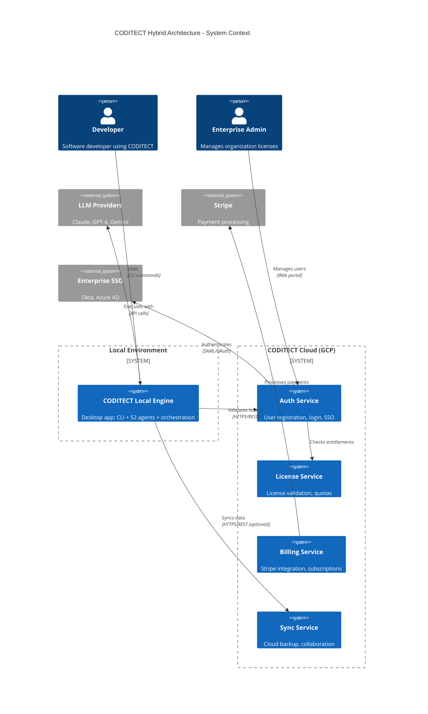
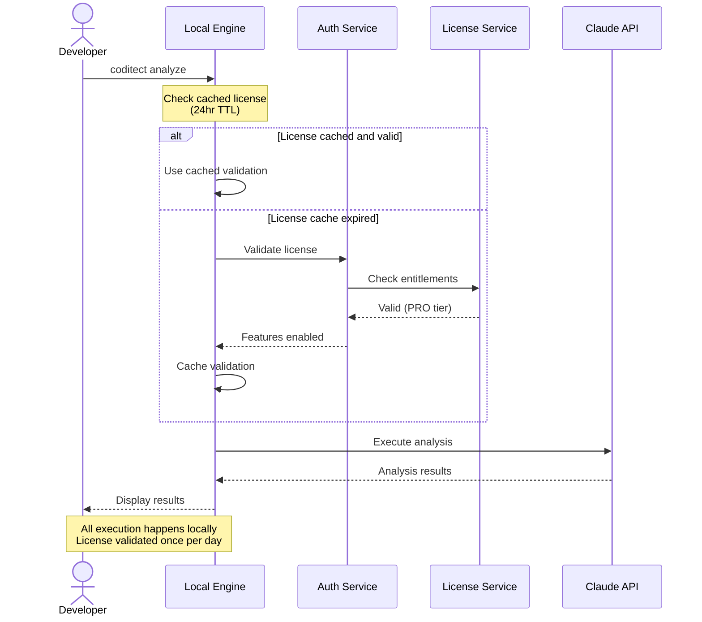
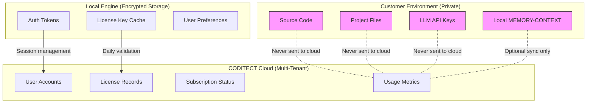
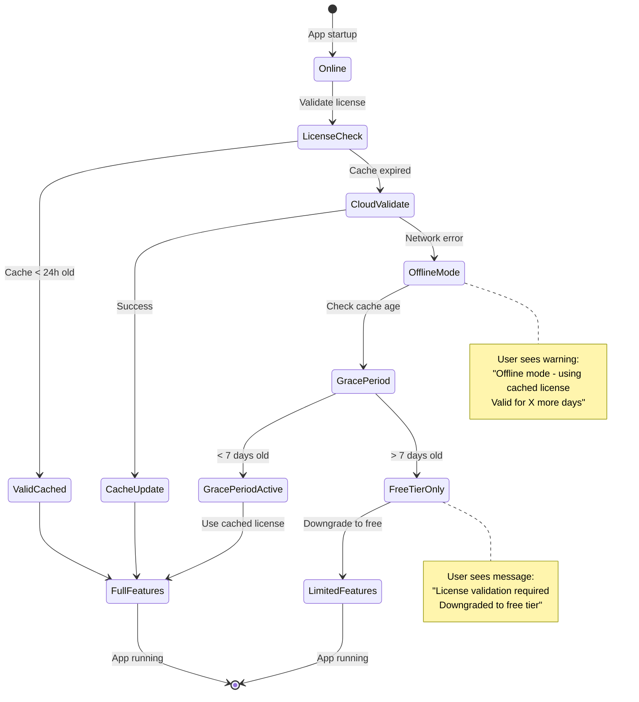

# ADR-002 Diagram 1: Hybrid Architecture Overview

**Related ADR:** [ADR-002: Hybrid Deployment Architecture](../../adrs/ADR-002-hybrid-deployment-architecture.md)

---

## System Context Diagram (C4 Level 1)

This diagram shows the high-level hybrid architecture: local engine + cloud services.



---

## Key Architectural Decisions

### 1. **Local-First Execution**
- All AI agents run locally on developer's machine
- No latency for command execution
- Works offline (with 7-day grace period)
- Customer code never leaves local environment

### 2. **Cloud-Based Management**
- User registration and authentication in cloud
- License validation via cloud API (cached locally)
- Optional cloud sync for collaboration
- Telemetry and analytics (opt-in)

### 3. **Hybrid Benefits**
- ✅ Performance: Local execution speed
- ✅ Privacy: Code stays local
- ✅ Collaboration: Cloud sync for teams
- ✅ Licensing: Cloud-based enforcement
- ✅ Offline: 7-day grace period

---

## Data Flow

### Typical User Session



---

## Deployment Models

### Standard SaaS (Free/Pro/Team)
```
Developer's Machine          CODITECT Cloud (GCP)
┌─────────────────┐         ┌─────────────────────┐
│  Local Engine   │────────▶│  Auth Service       │
│  • CLI          │  HTTPS  │  • Registration     │
│  • 52 Agents    │◀────────│  • License Check    │
│  • SQLite       │         │  • Cloud Sync       │
└─────────────────┘         └─────────────────────┘
```

### Enterprise On-Premise
```
Customer Network
┌──────────────────────────────────────────┐
│  Employee Machines     Internal Cloud    │
│  ┌───────────┐         ┌──────────────┐ │
│  │  Local    │────────▶│  Auth Service│ │
│  │  Engine   │  HTTPS  │  (Kubernetes)│ │
│  └───────────┘◀────────│  • SSO       │ │
│                        │  • License   │ │
│  ┌───────────┐         │  • Sync      │ │
│  │  Local    │────────▶│              │ │
│  │  Engine   │         └──────────────┘ │
│  └───────────┘                          │
│                                         │
│  ← Air-gapped option: no external     │
│     internet required                   │
└──────────────────────────────────────────┘
```

---

## Security Boundaries



**Privacy Guarantees:**
- 🔒 Customer code NEVER sent to CODITECT cloud
- 🔒 LLM API keys stored locally (encrypted)
- 🔒 Project files stay on local machine
- 🔒 MEMORY-CONTEXT synced only if user enables (Pro+)

---

## Offline Mode

### Grace Period Logic



---

**Related Documents:**
- [ADR-002: Hybrid Deployment Architecture](../../adrs/ADR-002-hybrid-deployment-architecture.md)
- [ADR-003: User Registration and Authentication](../../adrs/ADR-003-user-registration-authentication.md)
- [Diagram 2: Deployment Options Comparison](./02-deployment-options.md)
- [Diagram 3: Cloud Services Architecture](./03-cloud-services.md)
