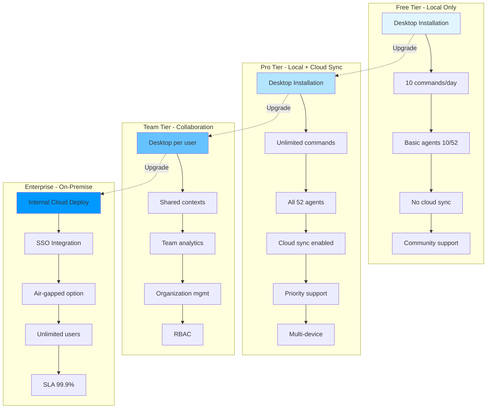
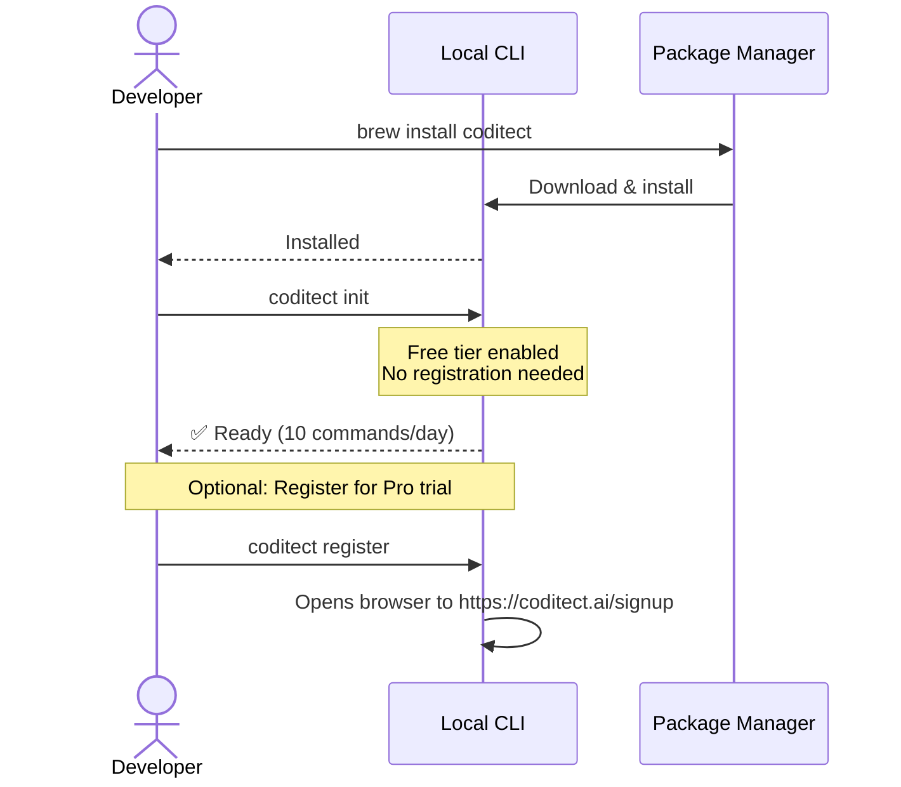
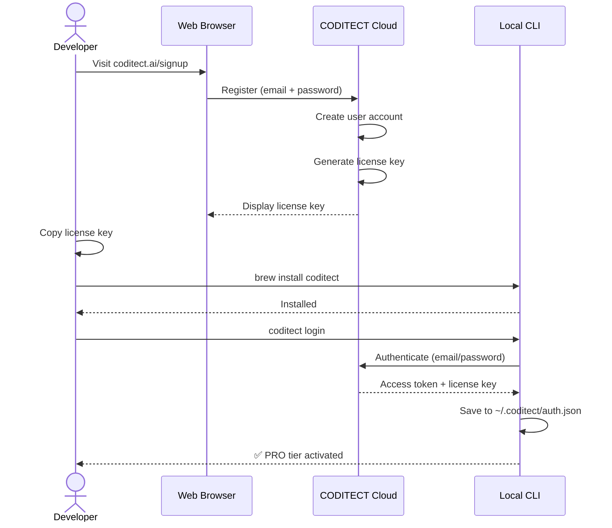
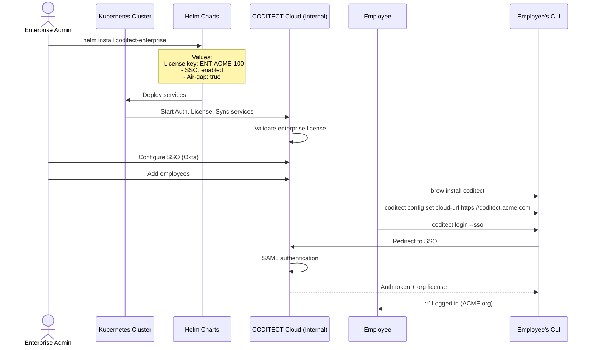
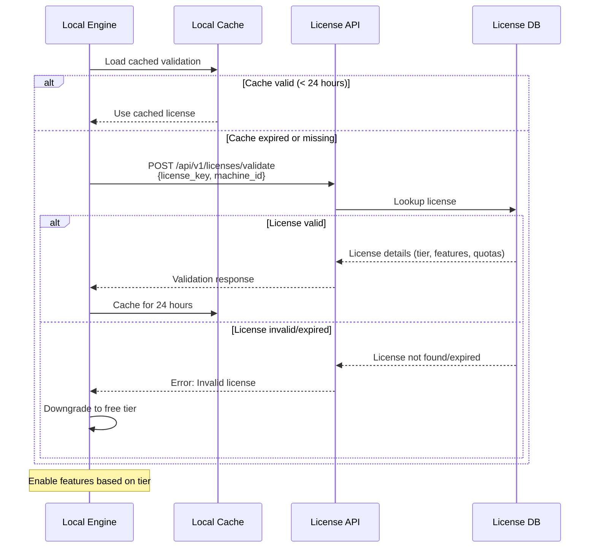
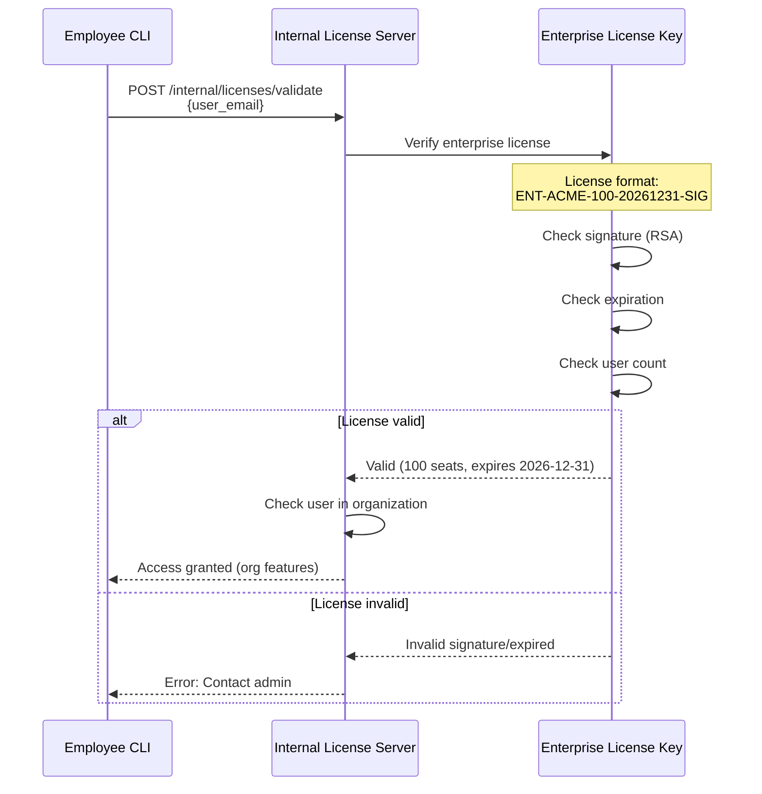
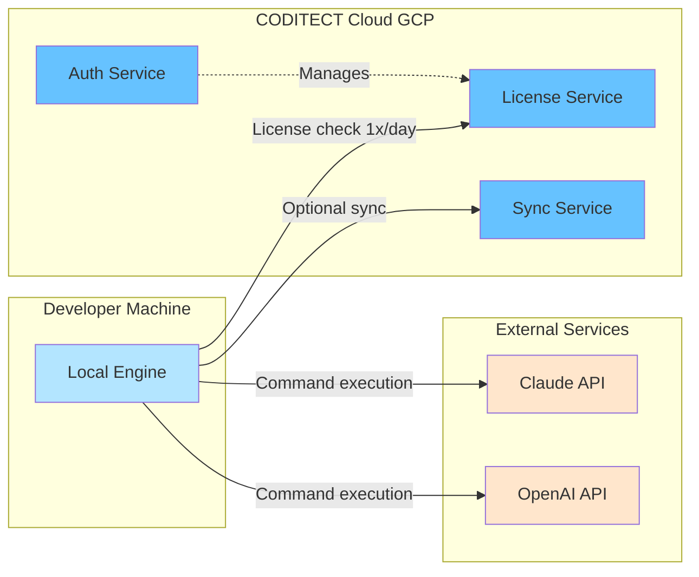
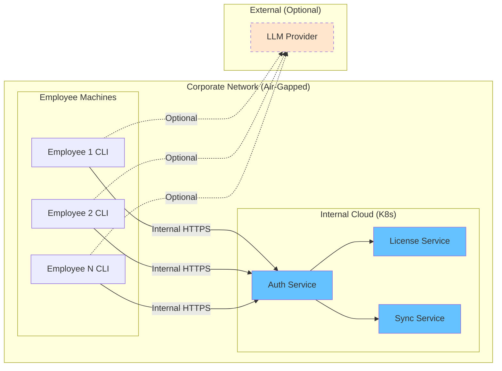
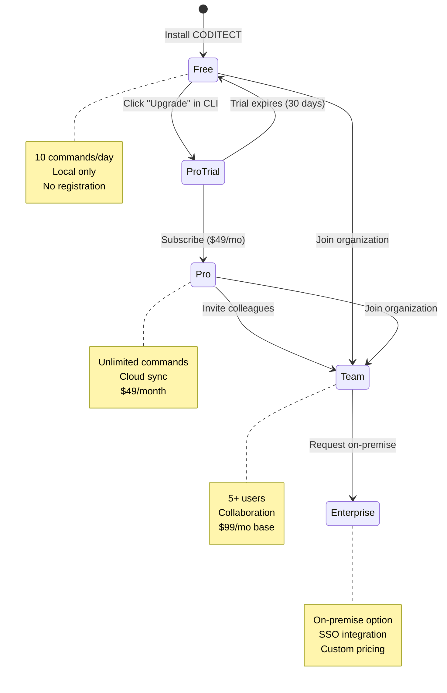

# ADR-002 Diagram 2: Deployment Options Comparison

**Related ADR:** [ADR-002: Hybrid Deployment Architecture](../../adrs/ADR-002-hybrid-deployment-architecture.md)

---

## Subscription Tiers & Deployment Models



---

## Installation Flows by Tier

### Free Tier - No Registration Required



### Pro Tier - Cloud Registration + Local



### Enterprise Tier - On-Premise Deployment



---

## Architecture Comparison Matrix

| Feature | Free | Pro | Team | Enterprise |
|---------|------|-----|------|------------|
| **Deployment** | Local only | Local + Cloud | Local + Cloud | On-Premise |
| **Installation** | `brew install` | `brew install` + signup | `brew install` + org invite | Helm chart |
| **Authentication** | None | Email/OAuth | Email/OAuth | SSO (SAML/OIDC) |
| **License Storage** | Local only | Cloud validated | Cloud validated | Internal server |
| **Data Residency** | 100% local | 100% local | 100% local (+ optional sync) | Customer infrastructure |
| **Internet Required** | No | Yes (daily check) | Yes (daily check) | No (air-gapped option) |
| **Collaboration** | ❌ | ❌ | ✅ Team sync | ✅ Organization sync |
| **Support** | Community | Email | Chat | Dedicated engineer |

---

## License Validation Flows

### Standard (Free/Pro/Team) - Cloud Validation



### Enterprise - On-Premise Validation



---

## Network Communication Patterns

### Standard Deployment (Cloud Connected)



**Communication Frequency:**
- License validation: 1x per 24 hours (cached)
- Cloud sync: On-demand or periodic (if enabled)
- LLM API calls: Per command execution

### Enterprise Deployment (Air-Gapped)



**Communication Patterns:**
- All auth/license traffic stays inside corporate network
- No external internet required for CODITECT features
- Optional: LLM API access (if org policy allows)
- Optional: Self-hosted LLM (Ollama, LM Studio)

---

## Migration Paths

### User Growth Journey



---

## Technical Stack by Deployment

### Local Engine (All Tiers)

```
Programming Language: Python 3.10+
CLI Framework: Click/Typer
Database: SQLite (local MEMORY-CONTEXT)
Encryption: Fernet (license keys, API keys)
Package Management: pip/poetry
Distribution: Homebrew (macOS), Chocolatey (Windows), apt/snap (Linux)
```

### Cloud Services (Pro/Team)

```
Hosting: Google Cloud Platform (GCP)
Regions: us-central1 (primary), europe-west1 (EU), asia-northeast1 (Asia)
API Framework: FastAPI (Python)
Database: Cloud SQL PostgreSQL (multi-tenant)
Cache: Memorystore Redis
Storage: Cloud Storage (GCS)
CDN: Cloud CDN
Monitoring: Cloud Monitoring + Prometheus
Logging: Cloud Logging + Loki
```

### Enterprise On-Premise

```
Container Orchestration: Kubernetes 1.28+
Package Manager: Helm 3.x
Database: PostgreSQL 15+ (self-hosted or Cloud SQL)
Cache: Redis 7+ (self-hosted or Memorystore)
Storage: GCS or S3-compatible (MinIO)
Ingress: Nginx or Istio
Service Mesh: Istio (optional)
Monitoring: Prometheus + Grafana
```

---

**Related Documents:**
- [ADR-002: Hybrid Deployment Architecture](../../adrs/ADR-002-hybrid-deployment-architecture.md)
- [Diagram 1: Hybrid Architecture Overview](./01-hybrid-architecture-overview.md)
- [Diagram 3: Cloud Services Architecture](./03-cloud-services.md)
