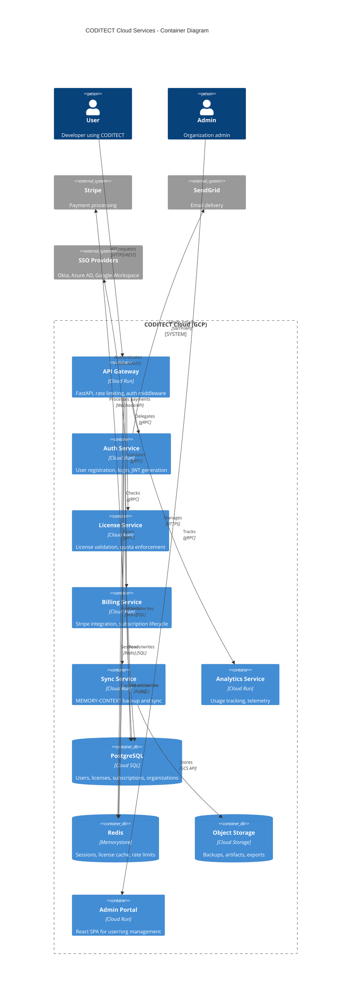
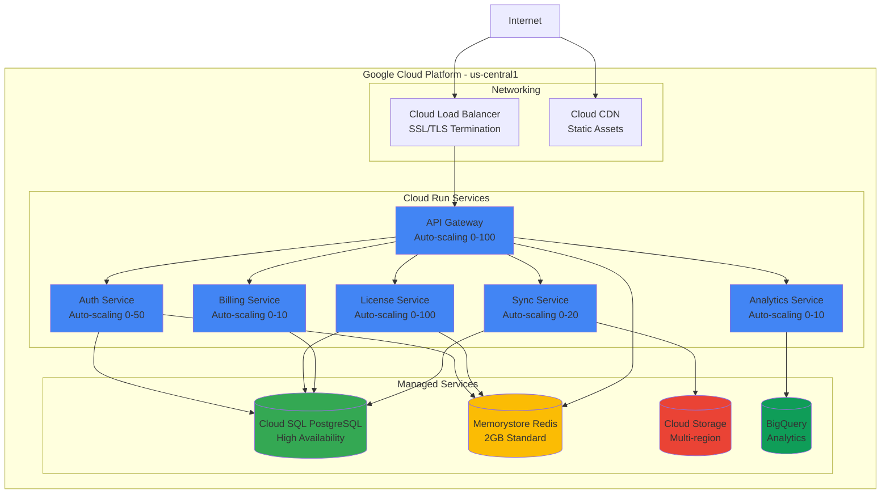
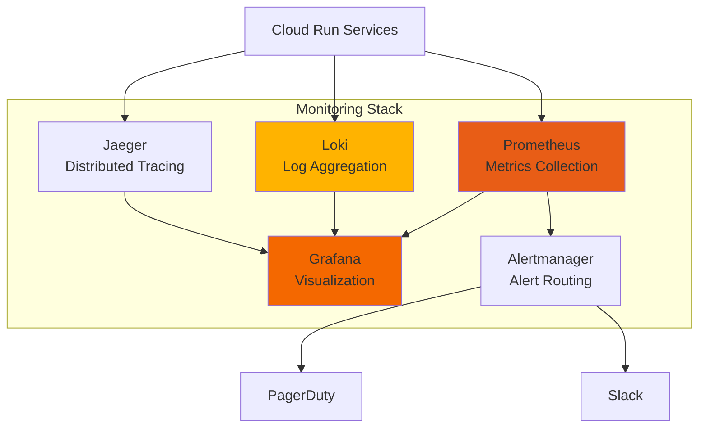

# ADR-002 Diagram 3: Cloud Services Architecture

**Related ADR:** [ADR-002: Hybrid Deployment Architecture](../../adrs/ADR-002-hybrid-deployment-architecture.md)

---

## Cloud Services Container Diagram (C4 Level 2)



---

## Service Details

### API Gateway

**Technology:** FastAPI on Cloud Run
**Responsibilities:**
- Request routing to microservices
- Authentication (JWT validation)
- Rate limiting (per user, per tier)
- Request/response logging
- CORS handling
- API versioning (/api/v1, /api/v2)

**Endpoints:**
```
/api/v1/auth/*          → Auth Service
/api/v1/licenses/*      → License Service
/api/v1/billing/*       → Billing Service
/api/v1/sync/*          → Sync Service
/api/v1/analytics/*     → Analytics Service
```

---

### Auth Service

**Technology:** FastAPI + Firebase Auth
**Database:** PostgreSQL (users table)
**Cache:** Redis (sessions)

**Responsibilities:**
- User registration (email/password, OAuth)
- User login (email/password, OAuth, SSO)
- Email verification
- Password reset
- JWT token generation
- Session management
- MFA (TOTP)

**Database Schema:**
```sql
CREATE TABLE users (
    user_id VARCHAR(64) PRIMARY KEY,
    email VARCHAR(255) UNIQUE NOT NULL,
    email_verified BOOLEAN DEFAULT FALSE,
    password_hash VARCHAR(255),  -- null for OAuth users
    name VARCHAR(255),
    created_at TIMESTAMP DEFAULT NOW(),
    updated_at TIMESTAMP DEFAULT NOW(),
    last_login_at TIMESTAMP,
    mfa_enabled BOOLEAN DEFAULT FALSE,
    mfa_secret TEXT,  -- encrypted TOTP secret
    tier VARCHAR(50) DEFAULT 'FREE',
    organization_id VARCHAR(64),
    FOREIGN KEY (organization_id) REFERENCES organizations(org_id)
);

CREATE INDEX idx_users_email ON users(email);
CREATE INDEX idx_users_org ON users(organization_id);
```

---

### License Service

**Technology:** FastAPI
**Database:** PostgreSQL (licenses table)
**Cache:** Redis (24-hour validation cache)

**Responsibilities:**
- License key generation
- License validation
- Quota enforcement (commands per day)
- Feature flag evaluation
- Device tracking (multi-device limits)
- License revocation

**Database Schema:**
```sql
CREATE TABLE licenses (
    license_key VARCHAR(128) PRIMARY KEY,
    user_id VARCHAR(64) NOT NULL,
    organization_id VARCHAR(64),
    tier VARCHAR(50) NOT NULL,  -- FREE, PRO, TEAM, ENT
    status VARCHAR(50) DEFAULT 'ACTIVE',  -- ACTIVE, EXPIRED, REVOKED
    created_at TIMESTAMP DEFAULT NOW(),
    expires_at TIMESTAMP,  -- NULL = never expires
    max_devices INT DEFAULT 1,
    features JSONB,  -- {"cloud_sync": true, "unlimited_commands": true}
    quotas JSONB,    -- {"commands_per_day": -1}  (-1 = unlimited)
    FOREIGN KEY (user_id) REFERENCES users(user_id),
    FOREIGN KEY (organization_id) REFERENCES organizations(org_id)
);

CREATE TABLE license_validations (
    validation_id BIGSERIAL PRIMARY KEY,
    license_key VARCHAR(128) NOT NULL,
    machine_id VARCHAR(256) NOT NULL,
    validated_at TIMESTAMP DEFAULT NOW(),
    ip_address INET,
    version VARCHAR(50),
    FOREIGN KEY (license_key) REFERENCES licenses(license_key)
);

CREATE INDEX idx_validations_license ON license_validations(license_key, validated_at);
```

**Validation API:**
```http
POST /api/v1/licenses/validate
Authorization: Bearer {jwt_token}

Request:
{
  "license_key": "CODITECT-PRO-A7F3E9D2C4B1-8F2A",
  "machine_id": "sha256(hardware_id)",
  "version": "1.0.0"
}

Response (200 OK):
{
  "valid": true,
  "tier": "PRO",
  "expires_at": "2026-11-23T00:00:00Z",
  "features": {
    "unlimited_commands": true,
    "cloud_sync": true,
    "all_agents": true,
    "mfa": true
  },
  "quotas": {
    "commands_per_day": -1,
    "max_devices": 3
  },
  "cached_until": "2025-11-24T18:00:00Z"
}
```

---

### Billing Service

**Technology:** FastAPI + Stripe SDK
**Database:** PostgreSQL (subscriptions table)

**Responsibilities:**
- Stripe customer creation
- Subscription management (create, update, cancel)
- Webhook handling (payment success, failed, subscription events)
- Invoice generation
- Usage-based billing (Enterprise)
- Subscription lifecycle automation

**Database Schema:**
```sql
CREATE TABLE subscriptions (
    subscription_id VARCHAR(128) PRIMARY KEY,
    user_id VARCHAR(64) NOT NULL,
    organization_id VARCHAR(64),
    stripe_customer_id VARCHAR(128),
    stripe_subscription_id VARCHAR(128),
    tier VARCHAR(50) NOT NULL,
    status VARCHAR(50) NOT NULL,  -- ACTIVE, PAST_DUE, CANCELED, TRIALING
    current_period_start TIMESTAMP,
    current_period_end TIMESTAMP,
    cancel_at_period_end BOOLEAN DEFAULT FALSE,
    trial_end TIMESTAMP,
    created_at TIMESTAMP DEFAULT NOW(),
    updated_at TIMESTAMP DEFAULT NOW(),
    FOREIGN KEY (user_id) REFERENCES users(user_id),
    FOREIGN KEY (organization_id) REFERENCES organizations(org_id)
);

CREATE TABLE invoices (
    invoice_id VARCHAR(128) PRIMARY KEY,
    subscription_id VARCHAR(128) NOT NULL,
    stripe_invoice_id VARCHAR(128),
    amount_cents INT NOT NULL,
    currency VARCHAR(3) DEFAULT 'USD',
    status VARCHAR(50),  -- PAID, OPEN, VOID
    invoice_date TIMESTAMP,
    due_date TIMESTAMP,
    paid_at TIMESTAMP,
    FOREIGN KEY (subscription_id) REFERENCES subscriptions(subscription_id)
);
```

**Stripe Webhook Handling:**
```python
@app.post("/api/v1/billing/webhooks/stripe")
async def stripe_webhook(request: Request):
    """
    Handle Stripe webhooks for subscription lifecycle events.
    """
    payload = await request.body()
    sig_header = request.headers.get("stripe-signature")

    try:
        event = stripe.Webhook.construct_event(
            payload, sig_header, STRIPE_WEBHOOK_SECRET
        )
    except ValueError:
        raise HTTPException(400, "Invalid payload")
    except stripe.error.SignatureVerificationError:
        raise HTTPException(400, "Invalid signature")

    # Handle event
    if event.type == "customer.subscription.created":
        handle_subscription_created(event.data.object)
    elif event.type == "customer.subscription.updated":
        handle_subscription_updated(event.data.object)
    elif event.type == "customer.subscription.deleted":
        handle_subscription_deleted(event.data.object)
    elif event.type == "invoice.paid":
        handle_invoice_paid(event.data.object)
    elif event.type == "invoice.payment_failed":
        handle_payment_failed(event.data.object)

    return {"status": "success"}
```

---

### Sync Service

**Technology:** FastAPI
**Storage:** Cloud Storage (GCS)
**Database:** PostgreSQL (sync metadata)

**Responsibilities:**
- MEMORY-CONTEXT backup
- Project configuration sync
- Conflict resolution (multi-device)
- Incremental sync (delta updates)
- Versioning and rollback

**Database Schema:**
```sql
CREATE TABLE sync_objects (
    object_id VARCHAR(128) PRIMARY KEY,
    user_id VARCHAR(64) NOT NULL,
    object_type VARCHAR(50) NOT NULL,  -- MEMORY_CONTEXT, PROJECT_CONFIG
    object_path VARCHAR(512) NOT NULL,  -- relative path in GCS
    version INT NOT NULL,
    device_id VARCHAR(256),
    checksum VARCHAR(64),  -- SHA-256 of content
    size_bytes BIGINT,
    uploaded_at TIMESTAMP DEFAULT NOW(),
    last_modified TIMESTAMP DEFAULT NOW(),
    deleted BOOLEAN DEFAULT FALSE,
    FOREIGN KEY (user_id) REFERENCES users(user_id)
);

CREATE INDEX idx_sync_user ON sync_objects(user_id, deleted);
CREATE INDEX idx_sync_device ON sync_objects(device_id);
```

**Sync API:**
```http
# Upload MEMORY-CONTEXT
POST /api/v1/sync/upload
Authorization: Bearer {jwt_token}
Content-Type: application/json

{
  "object_type": "MEMORY_CONTEXT",
  "object_path": ".coditect/messages.jsonl",
  "checksum": "sha256:abc123...",
  "device_id": "mac_a7f3e9d2"
}

# Download latest MEMORY-CONTEXT
GET /api/v1/sync/download?object_type=MEMORY_CONTEXT
Authorization: Bearer {jwt_token}

Response (redirect to signed GCS URL):
302 Found
Location: https://storage.googleapis.com/coditect-backups/usr_abc/messages.jsonl?token=...
```

---

### Analytics Service

**Technology:** FastAPI + BigQuery
**Database:** BigQuery (time-series data)

**Responsibilities:**
- Usage tracking (commands executed, agents used)
- Error tracking (failed commands, exceptions)
- Performance metrics (execution time, token usage)
- Feature adoption tracking
- Telemetry aggregation

**BigQuery Schema:**
```sql
CREATE TABLE coditect.usage_events (
    event_id STRING,
    user_id STRING,
    organization_id STRING,
    tier STRING,
    event_type STRING,  -- COMMAND_EXECUTED, AGENT_INVOKED, ERROR
    event_timestamp TIMESTAMP,
    command_name STRING,
    agent_id STRING,
    execution_time_ms INT64,
    tokens_used INT64,
    llm_provider STRING,
    llm_model STRING,
    success BOOLEAN,
    error_type STRING,
    metadata JSON,
    device_id STRING,
    version STRING
)
PARTITION BY DATE(event_timestamp)
CLUSTER BY user_id, tier;
```

**Telemetry Ingestion:**
```http
POST /api/v1/analytics/events
Authorization: Bearer {jwt_token}
Content-Type: application/json

{
  "events": [
    {
      "event_type": "COMMAND_EXECUTED",
      "command_name": "/analyze",
      "agent_id": "code-reviewer",
      "execution_time_ms": 2450,
      "tokens_used": 1250,
      "llm_provider": "anthropic",
      "llm_model": "claude-3-5-haiku",
      "success": true,
      "timestamp": "2025-11-23T18:00:00Z"
    }
  ]
}
```

---

## Infrastructure Diagram



---

## Scalability & Performance

### Auto-Scaling Configuration

```yaml
API Gateway:
  min_instances: 1
  max_instances: 100
  target_cpu: 70%
  target_concurrency: 80
  startup_time: 10s

Auth Service:
  min_instances: 1
  max_instances: 50
  target_cpu: 70%
  startup_time: 5s

License Service:
  min_instances: 2  # Always on (high traffic)
  max_instances: 100
  target_cpu: 60%
  startup_time: 3s  # Fast startup (critical path)

Billing Service:
  min_instances: 0  # Scale to zero (low traffic)
  max_instances: 10
  target_cpu: 70%
  startup_time: 8s

Sync Service:
  min_instances: 0
  max_instances: 20
  target_cpu: 70%
  startup_time: 7s
```

### Performance Targets

| Service | P50 Latency | P95 Latency | P99 Latency | Throughput |
|---------|-------------|-------------|-------------|------------|
| API Gateway | <50ms | <100ms | <200ms | 10K req/s |
| Auth (login) | <100ms | <200ms | <500ms | 1K req/s |
| License (validate) | <50ms | <100ms | <200ms | 5K req/s |
| Billing (webhook) | <200ms | <500ms | <1s | 100 req/s |
| Sync (upload) | <500ms | <1s | <2s | 500 req/s |
| Analytics (ingest) | <100ms | <200ms | <500ms | 2K req/s |

### Caching Strategy

```
License Validation:
- Redis TTL: 24 hours
- Cache key: license:{license_key}
- Cache hit rate target: >90%
- Reduces DB load by 10x

Sessions:
- Redis TTL: 30 days (sliding window)
- Cache key: session:{session_id}
- Cache hit rate: >95%

Rate Limits:
- Redis TTL: 1 minute (rolling window)
- Cache key: ratelimit:{user_id}:{endpoint}
- Atomic increment with INCR
```

---

## Monitoring & Observability

### Cloud Monitoring Dashboards



### Key Metrics

**Golden Signals:**
- **Latency**: Request duration (p50, p95, p99)
- **Traffic**: Requests per second
- **Errors**: Error rate (%)
- **Saturation**: CPU/memory utilization (%)

**Business Metrics:**
- Active users (DAU, MAU)
- License validations per day
- Subscription conversions (Free → Pro)
- Revenue (MRR, ARR)

**Alerts:**
- Error rate > 1% (5 min)
- Latency p95 > 1s (5 min)
- CPU > 80% (10 min)
- Database connections > 90% (5 min)
- License validation failures > 5% (1 min)

---

**Related Documents:**
- [ADR-002: Hybrid Deployment Architecture](../../adrs/ADR-002-hybrid-deployment-architecture.md)
- [ADR-003: User Registration and Authentication](../../adrs/ADR-003-user-registration-authentication.md)
- [Diagram 1: Hybrid Architecture Overview](./01-hybrid-architecture-overview.md)
- [Diagram 2: Deployment Options](./02-deployment-options.md)
