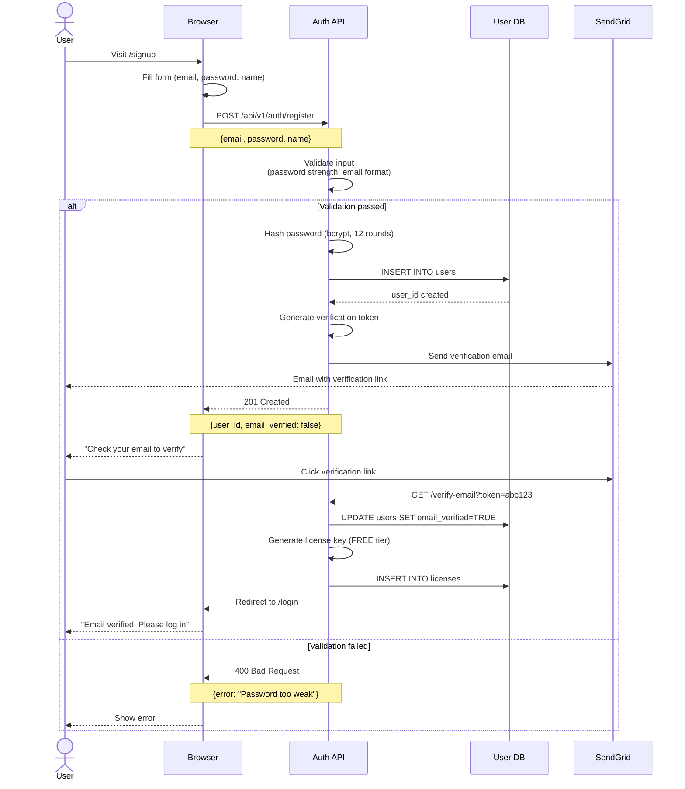
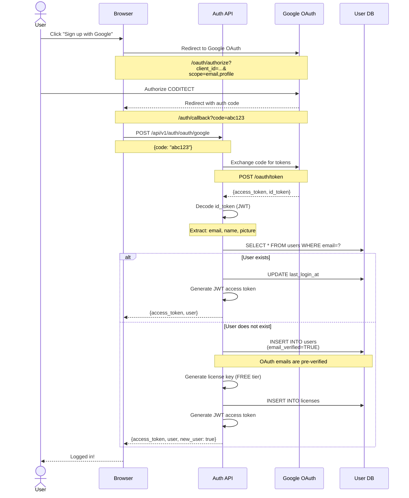
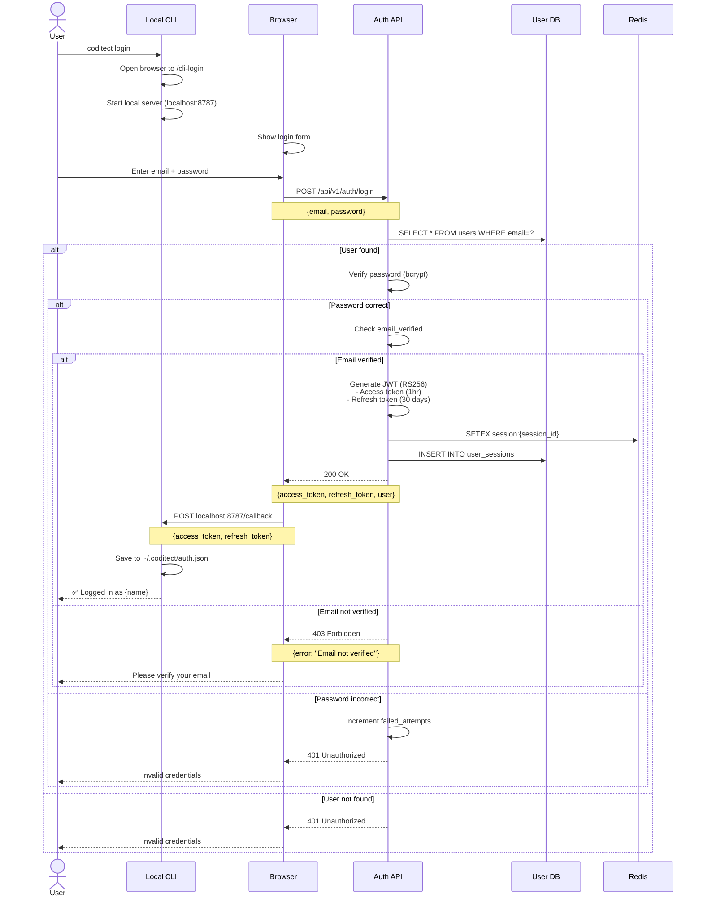
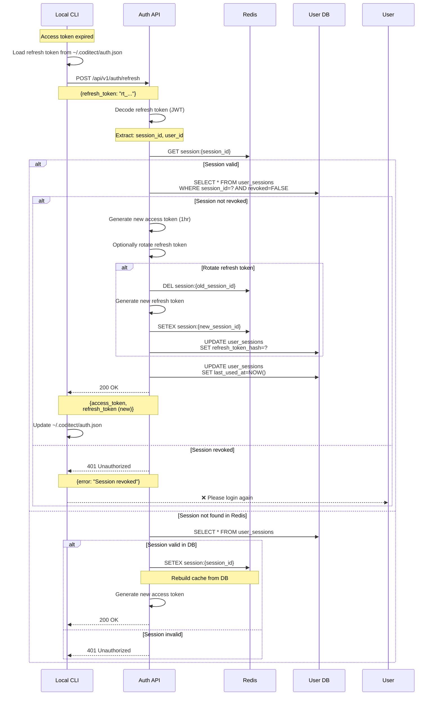
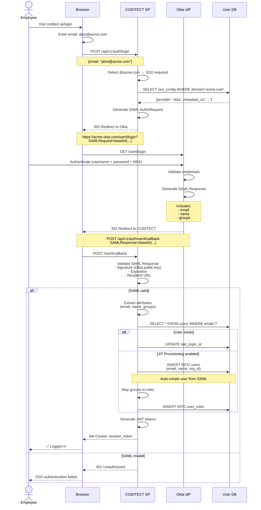
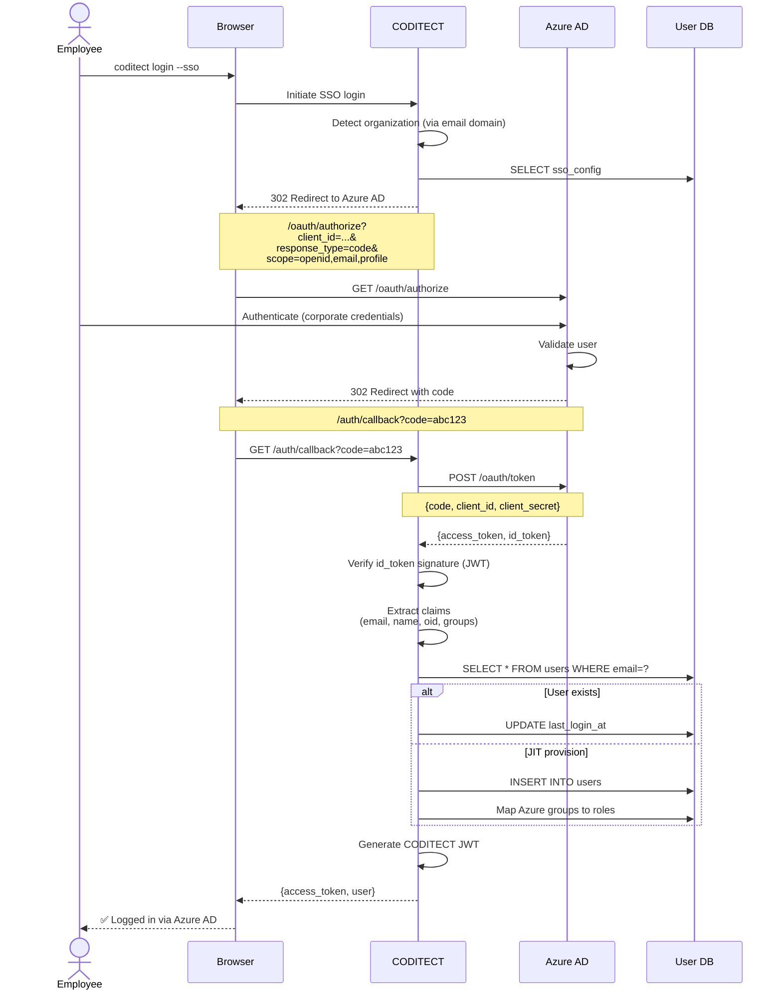
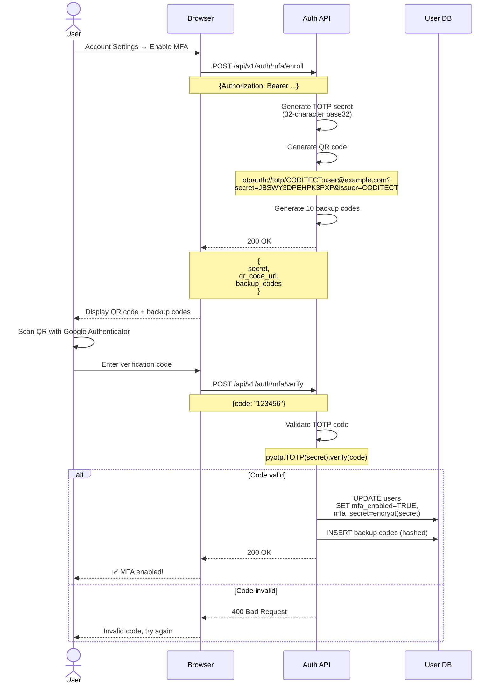
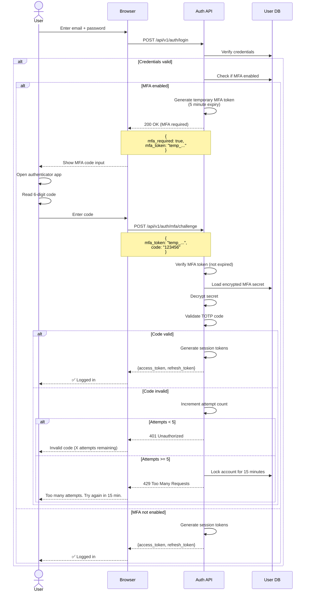
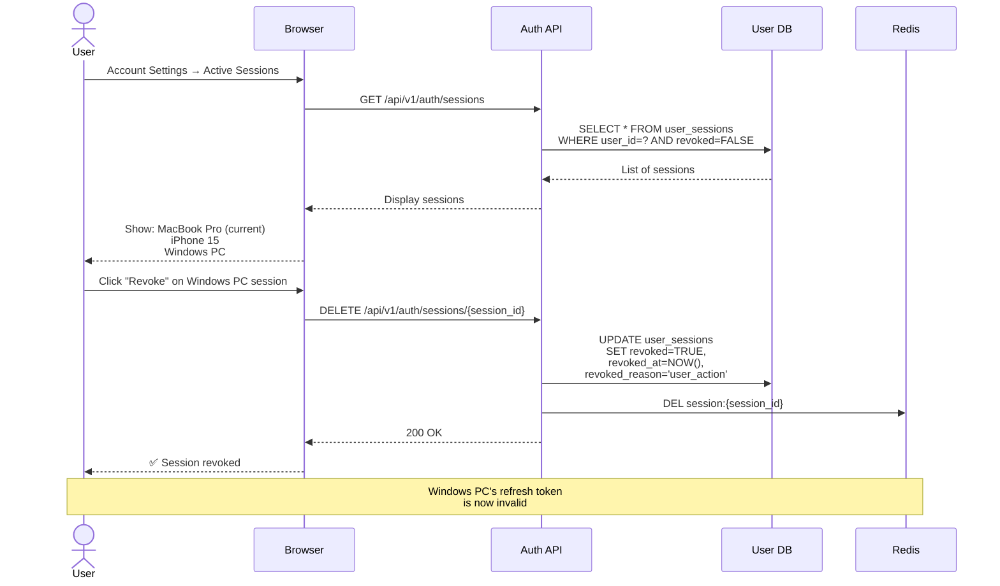

# ADR-003 Diagram 1: Authentication Flows

**Related ADR:** [ADR-003: User Registration and Authentication](../../adrs/ADR-003-user-registration-authentication.md)

---

## User Registration Flow

### Standard Email/Password Registration



---

### Social OAuth Registration (Google)



---

## Authentication Flows

### Email/Password Login



---

### Token Refresh Flow



---

## Enterprise SSO Flows

### SAML 2.0 Authentication



---

### OAuth 2.0 / OIDC (Azure AD)



---

## Multi-Factor Authentication

### MFA Enrollment



---

### MFA Login Challenge



---

## Session Management

### Active Sessions Overview

```mermaid
graph TB
    subgraph "User Account"
        User[user@example.com]
    end

    subgraph "Active Sessions"
        S1[Session 1<br/>MacBook Pro<br/>San Francisco<br/>Chrome]
        S2[Session 2<br/>iPhone 15<br/>San Francisco<br/>Safari]
        S3[Session 3<br/>Windows PC<br/>New York<br/>Edge]
    end

    User --> S1
    User --> S2
    User --> S3

    S1 -->|Refresh token| RT1[rt_abc123...<br/>Expires: 30 days]
    S2 -->|Refresh token| RT2[rt_def456...<br/>Expires: 30 days]
    S3 -->|Refresh token| RT3[rt_ghi789...<br/>Expires: 30 days]

    style S1 fill:#90EE90
    style S2 fill:#90EE90
    style S3 fill:#90EE90
```

### Session Revocation



---

**Related Documents:**
- [ADR-003: User Registration and Authentication](../../adrs/ADR-003-user-registration-authentication.md)
- [Diagram 2: Security Architecture](./02-security-architecture.md)
- [Diagram 3: JWT Token Structure](./03-jwt-tokens.md)
