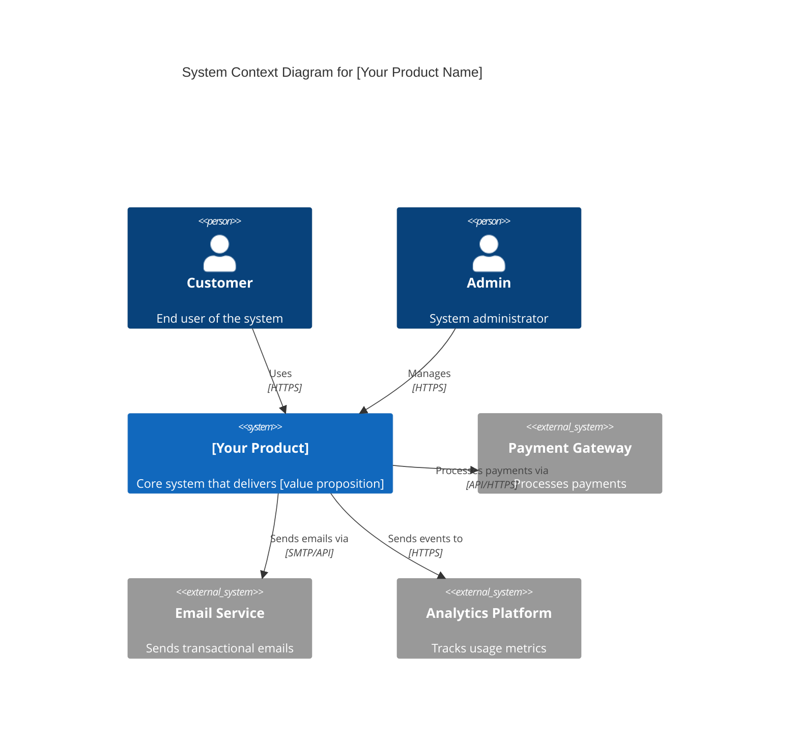
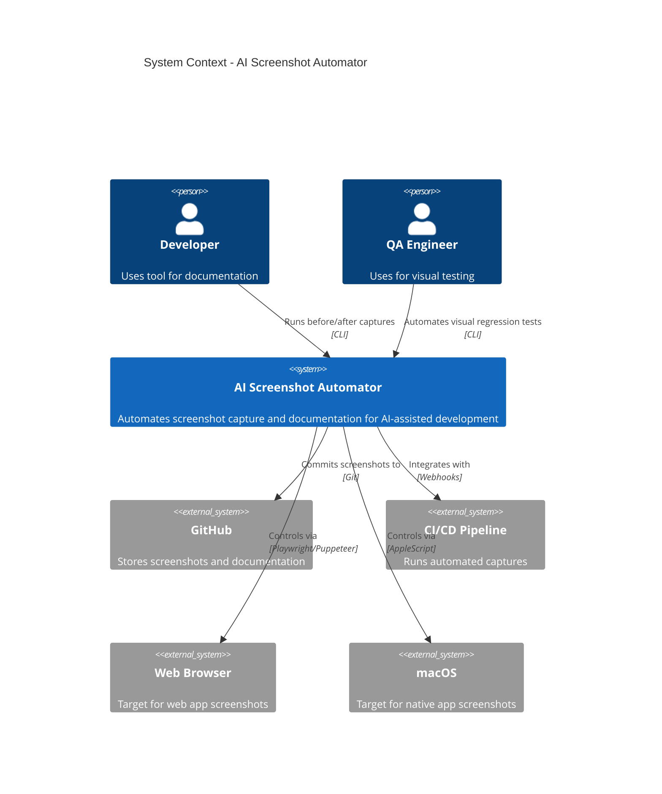
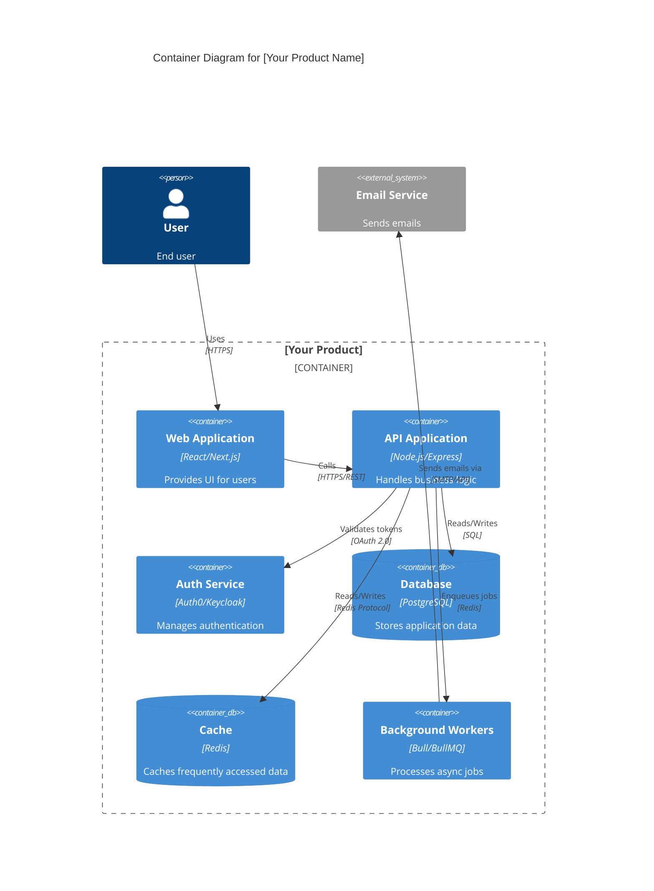
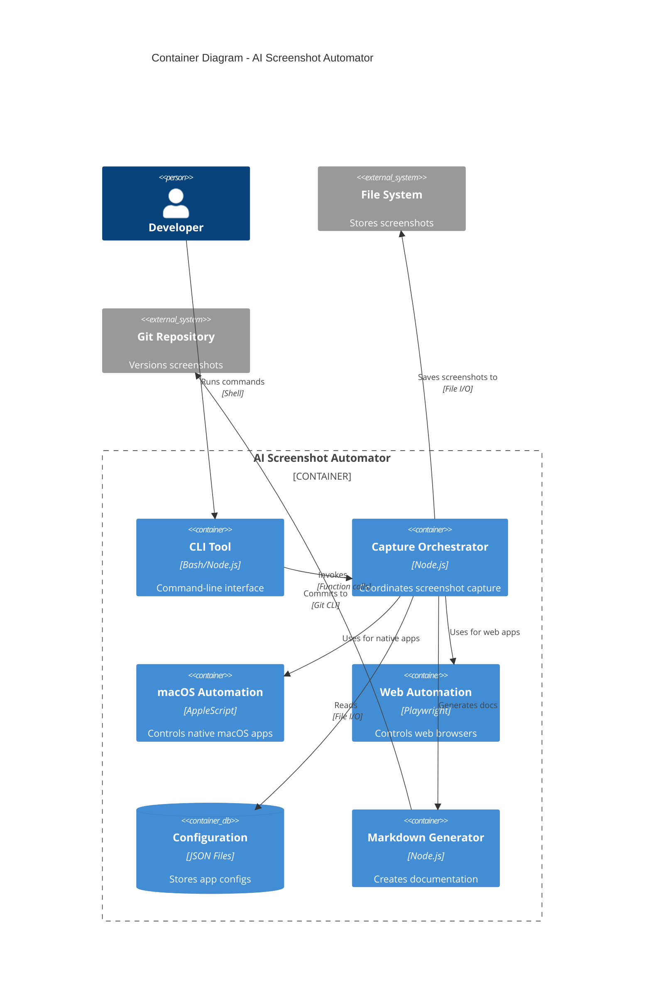
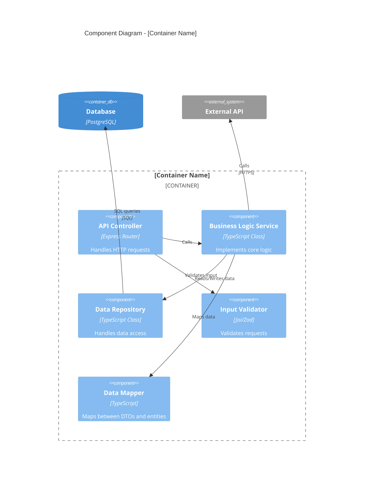
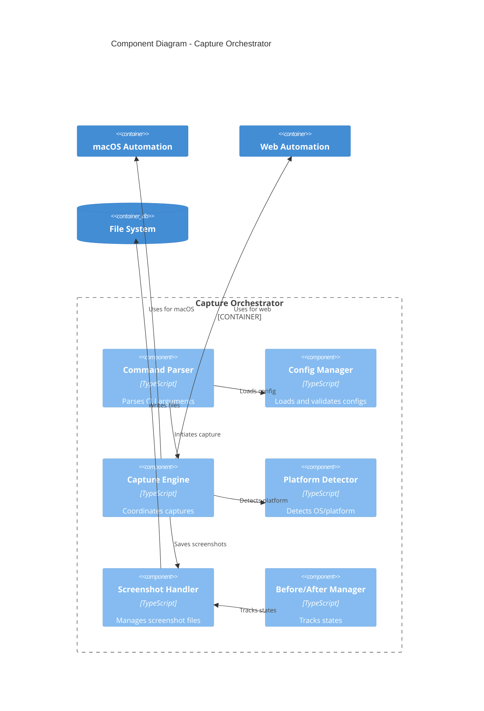
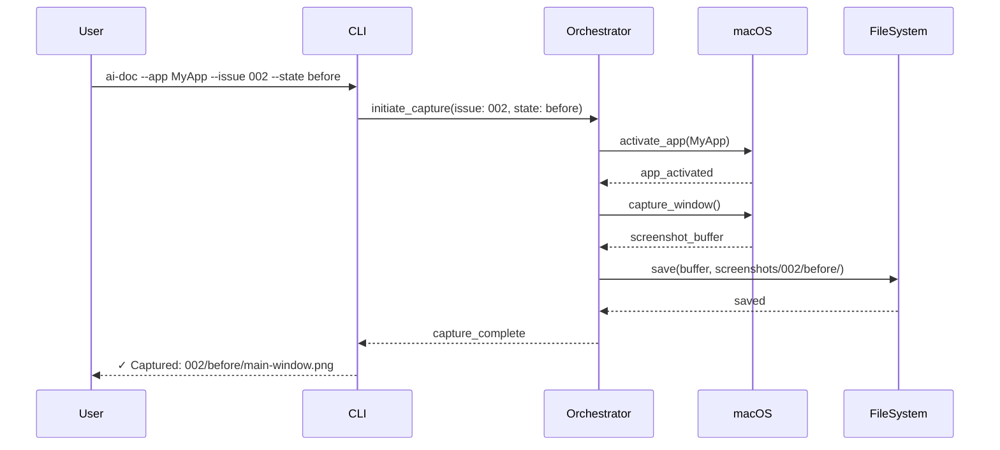
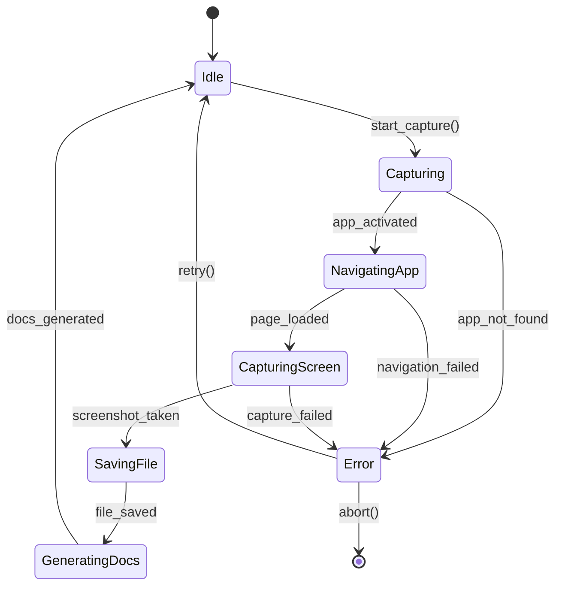
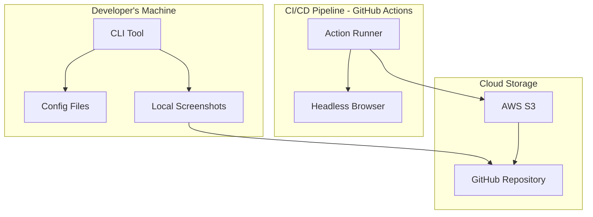

# C4 Model Architecture Methodology

**Copyright © 2025 AZ1.AI INC. All Rights Reserved.**
**Developed by Hal Casteel, Founder/CEO/CTO**
**Part of the AZ1.AI CODITECT Project Management & Development Platform**

---

## Overview

The C4 Model provides a hierarchical approach to visualizing software architecture through four levels of abstraction:

1. **C1: System Context** - The big picture (10,000 foot view)
2. **C2: Container** - High-level technology choices (5,000 foot view)
3. **C3: Component** - Component-level architecture (1,000 foot view)
4. **C4: Code** - Class diagrams and implementation details (ground level)

This methodology ensures **complete architectural clarity** from business stakeholders to developers.

---

## C1: System Context Diagram

### Purpose
Show how your system fits into the world around it - who uses it and what other systems it interacts with.

### Audience
- Business stakeholders
- Product managers
- Executive team
- Non-technical team members

### What to Include
- Your software system (center)
- People who use it (actors/personas)
- External systems it integrates with
- Data flows between systems

### Mermaid Template



### Example: AI Screenshot Automator



**Output**: Save as `/docs/architecture/diagrams/c1-system-context.mmd`

---

## C2: Container Diagram

### Purpose
Show the high-level technology choices and how containers (applications, databases, file systems) interact.

### Audience
- Technical team leads
- DevOps engineers
- Solution architects
- Security team

### What to Include
- Web applications
- Mobile apps
- Desktop applications
- Databases
- File storage
- Message queues
- APIs
- Technology choices for each container

### Mermaid Template



### Example: AI Screenshot Automator



**Output**: Save as `/docs/architecture/diagrams/c2-container.mmd`

---

## C3: Component Diagram

### Purpose
Break down each container into its major components and show their responsibilities and interactions.

### Audience
- Software architects
- Senior developers
- Code reviewers

### What to Include
- Major classes/modules within a container
- Interfaces between components
- External dependencies
- Data flow between components

### Mermaid Template



### Example: AI Screenshot Automator - Capture Orchestrator



**Output**: Save as `/docs/architecture/diagrams/c3-component-[container-name].mmd`

---

## C4: Code Diagram

### Purpose
Show the actual code structure - classes, interfaces, methods, and their relationships.

### Audience
- Developers implementing the code
- Code reviewers
- New team members onboarding

### What to Include
- Class diagrams (UML)
- Interfaces
- Important methods
- Inheritance relationships
- Composition relationships

### Mermaid Template

```mermaid
classDiagram
    class CaptureOrchestrator {
        -ConfigManager config
        -PlatformDetector detector
        -ScreenshotHandler handler
        +capture(options: CaptureOptions): Promise~Result~
        +compareBefore After(issueId: string): Promise~Comparison~
        -selectAutomationEngine(): AutomationEngine
    }

    class ConfigManager {
        -ConfigSchema schema
        +loadConfig(path: string): Config
        +validateConfig(config: Config): boolean
        +getPageConfig(pageName: string): PageConfig
    }

    class PlatformDetector {
        +detectPlatform(): Platform
        +isMacOS(): boolean
        +isWeb(): boolean
        +getBrowserType(): BrowserType
    }

    class ScreenshotHandler {
        -FileSystem fs
        +saveScreenshot(data: Buffer, path: string): Promise~void~
        +getBeforeScreenshot(issueId: string): Promise~string~
        +getAfterScreenshot(issueId: string): Promise~string~
        +generateComparison(before: string, after: string): Promise~Image~
    }

    interface AutomationEngine {
        <<interface>>
        +navigate(page: string): Promise~void~
        +click(selector: string): Promise~void~
        +capture(): Promise~Buffer~
    }

    class MacOSAutomation implements AutomationEngine {
        +navigate(page: string): Promise~void~
        +click(selector: string): Promise~void~
        +capture(): Promise~Buffer~
        -executeAppleScript(script: string): Promise~string~
    }

    class WebAutomation implements AutomationEngine {
        -Browser browser
        -Page page
        +navigate(page: string): Promise~void~
        +click(selector: string): Promise~void~
        +capture(): Promise~Buffer~
    }

    CaptureOrchestrator --> ConfigManager
    CaptureOrchestrator --> PlatformDetector
    CaptureOrchestrator --> ScreenshotHandler
    CaptureOrchestrator --> AutomationEngine
    MacOSAutomation ..|> AutomationEngine
    WebAutomation ..|> AutomationEngine
```

**Output**: Save as `/docs/architecture/diagrams/c4-code-[component-name].mmd`

---

## C4 Workflow Integration

### When to Create Each Diagram

#### Discovery Phase (Week 1-2)
- [ ] **C1: System Context** - During market research
  - Understand external dependencies
  - Map user personas
  - Identify integration points

#### Strategy Phase (Week 2-3)
- [ ] **C2: Container** - During technical architecture planning
  - Choose technology stack
  - Plan data storage
  - Design deployment architecture

#### Planning Phase (Week 3-4)
- [ ] **C3: Component** - Before sprint planning
  - Break down containers into components
  - Define interfaces
  - Plan implementation order

#### Execution Phase (Week 4+)
- [ ] **C4: Code** - During implementation
  - Create for complex components
  - Document class hierarchies
  - Guide code reviews

---

## Mermaid Diagram Standards

### File Naming Convention

```
/docs/architecture/diagrams/
├── c1-system-context.mmd
├── c2-container.mmd
├── c3-component-api.mmd
├── c3-component-frontend.mmd
├── c3-component-worker.mmd
├── c4-code-capture-engine.mmd
└── c4-code-automation-interface.mmd
```

### Rendering Diagrams

**In GitHub/GitLab**:
- Mermaid renders automatically in markdown
- Wrap in code fences with `mermaid` language

**Generating SVG**:
```bash
# Install mermaid CLI
npm install -g @mermaid-js/mermaid-cli

# Generate SVG from .mmd file
mmdc -i c1-system-context.mmd -o c1-system-context.svg

# Generate PNG
mmdc -i c1-system-context.mmd -o c1-system-context.png -b transparent
```

### Diagram Checklist

For each C4 level diagram:

- [ ] Title clearly states what is being shown
- [ ] Legend explains symbols (if complex)
- [ ] Technology choices labeled
- [ ] Relationships show direction and protocol
- [ ] External systems clearly marked
- [ ] Stored in `/docs/architecture/diagrams/`
- [ ] Referenced in architecture documentation
- [ ] Kept up to date with code changes

---

## Advanced C4 Patterns

### Sequence Diagrams for Workflows

Use alongside C4 to show **how** systems interact over time:



### State Machine Diagrams

Show state transitions:



### Deployment Diagrams

Show physical deployment:



---

## C4 → ADR Integration

### Linking Architecture Decisions to Diagrams

When writing ADRs, reference specific C4 diagrams:

**Example ADR**:
```markdown
# ADR-003: Use Playwright for Web Automation

## Context

See C2 Container Diagram (`c2-container.mmd`) - we need a web automation engine for the Web Automation container.

## Decision

We will use Playwright over Puppeteer or Selenium.

## Consequences

### Positive
- See C3 Component Diagram (`c3-component-web-automation.mmd`)
- Unified API across browsers
- Better debugging tools
- Active development

### Updated Diagrams
- `c2-container.mmd` - Updated Web Automation container
- `c3-component-web-automation.mmd` - Created component breakdown
```

---

## C4 Model Checklist

### For Every New Project

- [ ] **Week 1**: Create C1 System Context
  - Identify all external systems
  - Map all user types
  - Document integration points

- [ ] **Week 2**: Create C2 Container
  - Choose technology stack
  - Plan database architecture
  - Design API structure

- [ ] **Week 3**: Create C3 Components (for each container)
  - Break down frontend components
  - Break down API components
  - Break down worker components

- [ ] **Week 4+**: Create C4 Code (for complex components)
  - Document key interfaces
  - Show inheritance hierarchies
  - Guide implementation

### Ongoing Maintenance

- [ ] Update diagrams when architecture changes
- [ ] Review diagrams in code reviews
- [ ] Link diagrams to ADRs
- [ ] Use diagrams in onboarding
- [ ] Generate SVGs for presentations

---

## C4 Model Resources

### Official Resources
- **C4 Model**: https://c4model.com/
- **Mermaid Docs**: https://mermaid.js.org/
- **Mermaid Live Editor**: https://mermaid.live/

### AZ1.AI CODITECT Standards
- All diagrams must use Mermaid (no proprietary tools)
- Store as `.mmd` files in version control
- Generate `.svg` for presentations
- Keep diagrams close to code (in `/docs/architecture/`)
- Update with each architectural change

---

## Copyright Notice

**Copyright © 2025 AZ1.AI INC. All Rights Reserved.**

This C4 Architecture Methodology document is proprietary to AZ1.AI INC. and is part of the AZ1.AI CODITECT Project Management & Development Platform.

**Developed by**: Hal Casteel, Founder/CEO/CTO, AZ1.AI INC.

**Licensed under**: AZ1.AI CODITECT Platform License

**Unauthorized reproduction, distribution, or use is prohibited.**

For licensing inquiries: [Contact Information]

---

**AZ1.AI CODITECT** - Systematic Excellence in Software Development
