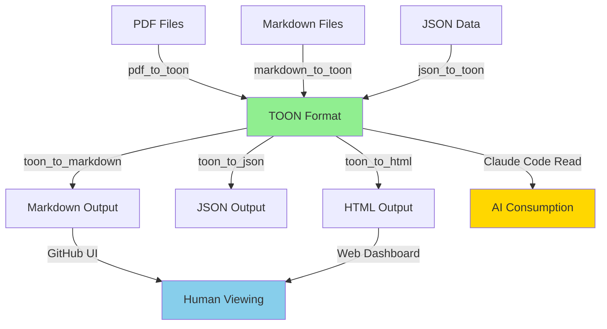

# TOON Integration System - Architecture Review

**Project:** CODITECT Rollout Master - TOON Format Integration
**Review Date:** 2025-11-17
**Reviewer:** Senior Software Architect (AI-Assisted)
**Status:** Architecture Assessment Complete
**Priority:** P1 (Token Optimization - High ROI)

---

## Executive Summary

This document provides a comprehensive architectural review of the proposed TOON (Token-Oriented Object Notation) integration system for the CODITECT platform. The review evaluates architectural patterns, structural integrity, design decisions, and identifies potential risks and improvements.

**Overall Assessment: 7.5/10 - SOLID FOUNDATION WITH IMPROVEMENT OPPORTUNITIES**

### Key Findings

#### Strengths ✅
1. **Well-Researched Foundation:** Comprehensive analysis with quantified ROI ($8.4K-$35K annual savings)
2. **Hybrid Strategy:** Smart dual-format approach (TOON for AI, Markdown for humans) avoids dogmatic "TOON everywhere"
3. **Phased Implementation:** 8-week roadmap with clear phases and checkpoints
4. **Backward Compatibility:** Dual storage prevents lock-in and enables gradual migration
5. **Clear Use Cases:** Format selection matrix defines when to use TOON vs. Markdown

#### Concerns ⚠️
1. **Converter Dependency Graph Risks:** Circular dependencies possible between converters
2. **Missing Abstraction Layer:** No BaseConverter interface defined yet
3. **Token Optimization Claims:** 30-60% reduction assumptions need validation
4. **Pre-commit Hook Complexity:** Git workflow changes require careful testing
5. **Storage Duplication Strategy:** Unclear long-term cost of maintaining both TOON and Markdown
6. **Integration with Existing Systems:** MEMORY-CONTEXT consolidation and TOON integration are parallel efforts with potential conflicts

---

## 1. Dual-Format Strategy Architecture

### 1.1 Design Pattern Analysis

**Pattern Used:** **Strategy Pattern + Adapter Pattern**

```
┌─────────────────────────────────────────────────────┐
│          Dual-Format Strategy Pattern                │
│                                                      │
│  ┌──────────────┐         ┌──────────────┐         │
│  │   AI Agent   │         │    Human     │         │
│  │  Consumer    │         │   Consumer   │         │
│  └──────┬───────┘         └──────┬───────┘         │
│         │                        │                  │
│         │ Reads TOON            │ Reads Markdown   │
│         ▼                        ▼                  │
│  ┌──────────────────────────────────────┐          │
│  │     Format Selection Strategy        │          │
│  │                                      │          │
│  │  if (consumer == AI):                │          │
│  │    return toon_file                  │          │
│  │  else:                               │          │
│  │    return markdown_file              │          │
│  └──────────────────────────────────────┘          │
│         │                        │                  │
│         ▼                        ▼                  │
│  ┌──────────────┐         ┌──────────────┐         │
│  │ checkpoint.  │         │ checkpoint.  │         │
│  │    toon      │◄───────►│     md       │         │
│  │ (primary)    │  Sync   │ (generated)  │         │
│  └──────────────┘         └──────────────┘         │
│                                                      │
└──────────────────────────────────────────────────────┘
```

**Assessment:**
- ✅ **Good:** Clear separation of concerns (AI vs. human consumption)
- ✅ **Good:** Adapter pattern enables format conversion
- ⚠️ **Concern:** No explicit interface/abstraction for FormatStrategy
- ⚠️ **Concern:** Sync mechanism not fully specified (pre-commit hook is single point of failure)

### 1.2 Format Selection Matrix Evaluation

The decision matrix is well-defined:

| Content Type | TOON | Markdown | Both | Assessment |
|--------------|------|----------|------|------------|
| Checkpoints | ✅ Primary | Generated | Yes | ✅ Correct |
| TASKLISTs | ✅ Primary | Generated | Yes | ✅ Correct |
| Documentation | ❌ | ✅ Only | No | ✅ Correct |
| API Responses | ✅ | ❌ | No | ⚠️ Should consider dual for debugging |

**Recommendations:**
1. **Add API Response Dual-Format:** For debugging, consider `Accept: application/toon+debug` header that returns both TOON and JSON
2. **Define Format Priority:** When both formats exist and conflict, which is authoritative?
3. **Versioning Strategy:** How to handle TOON format version changes?

---

## 2. Converter Architecture

### 2.1 Proposed Converter Dependency Graph



### 2.2 Structural Analysis

**Architecture Pattern:** **Bridge Pattern** (separates abstraction from implementation)

**Current State:**
```python
# No shared abstraction - each converter is independent
class TOONMarkdownConverter:
    def toon_to_markdown(...) -> None: pass
    def markdown_to_toon(...) -> None: pass

class PDFToTOONConverter:
    def convert(...) -> None: pass

# ❌ Problem: No shared interface, duplicated logic
```

**Recommended Refactoring:**
```python
# Add BaseConverter abstraction
from abc import ABC, abstractmethod
from typing import Any, Dict

class BaseConverter(ABC):
    """Abstract base converter with common functionality"""

    @abstractmethod
    def validate_input(self, file_path: str) -> bool:
        """Validate input file exists and is readable"""
        pass

    @abstractmethod
    def convert(self, input_path: str, output_path: str) -> Dict[str, Any]:
        """
        Perform conversion

        Returns:
            dict: {
                'success': bool,
                'tokens_before': int,
                'tokens_after': int,
                'reduction_percent': float
            }
        """
        pass

    def count_tokens(self, text: str) -> int:
        """Shared token counting (tiktoken library)"""
        # Implemented once, reused by all converters
        pass

    def log_conversion(self, metrics: Dict[str, Any]) -> None:
        """Shared logging/metrics"""
        pass


class TOONMarkdownConverter(BaseConverter):
    """Bidirectional TOON ↔ Markdown converter"""

    def validate_input(self, file_path: str) -> bool:
        # Specific validation for TOON/Markdown
        pass

    def convert(self, input_path: str, output_path: str) -> Dict[str, Any]:
        # TOON → Markdown conversion logic
        # Uses shared count_tokens() and log_conversion()
        pass
```

**Benefits:**
- ✅ **Reduced Duplication:** Token counting logic shared across all converters
- ✅ **Consistent Interface:** All converters have same API
- ✅ **Easier Testing:** Mock BaseConverter for unit tests
- ✅ **Metrics Collection:** Centralized conversion tracking

### 2.3 Circular Dependency Risk

**Potential Issue:**
```
TOON ← markdown_to_toon ← Markdown
  ↓
toon_to_markdown
  ↓
Markdown ← (back to start)
```

**Risk:** Round-trip conversions could cause data drift:
- `Original Markdown → TOON → Markdown (generated)` may not equal `Original Markdown`
- Complex markdown (nested lists, code blocks, tables) may not round-trip cleanly

**Mitigation:**
1. **Lossless Round-Trip Tests:**
   ```python
   def test_markdown_toon_roundtrip():
       original_md = load_markdown("sample.md")
       toon = markdown_to_toon(original_md)
       generated_md = toon_to_markdown(toon)

       # Assert structural equivalence (not byte-for-byte)
       assert_structurally_equivalent(original_md, generated_md)
   ```

2. **Canonical Format:** Define TOON as canonical, Markdown as view
   ```
   TOON (source of truth) ────────► Markdown (generated view)
     ▲
     │ One-way conversion only
     │ (for migration)
   Markdown (legacy)
   ```

---

## 3. Pre-Commit Hook Integration

### 3.1 Proposed Git Workflow

```bash
#!/bin/bash
# .git/hooks/pre-commit

# Auto-generate markdown from TOON files
for toon_file in $(git diff --cached --name-only --diff-filter=ACM | grep '\.toon$'); do
    md_file="${toon_file%.toon}.md"
    python3 scripts/utils/toon_to_markdown.py "$toon_file" "$md_file"
    git add "$md_file"
done
```

### 3.2 Architecture Concerns

**Issue 1: Atomicity**
- What if `toon_to_markdown.py` fails mid-conversion?
- Pre-commit hook will abort, but some `.md` files may be partially staged

**Recommended Fix:**
```bash
#!/bin/bash
# Improved pre-commit hook with atomicity

set -e  # Exit on any error

# Temporary directory for generated files
TEMP_DIR=$(mktemp -d)
trap "rm -rf $TEMP_DIR" EXIT

# Generate all markdown files first (don't stage yet)
for toon_file in $(git diff --cached --name-only --diff-filter=ACM | grep '\.toon$'); do
    md_file="${toon_file%.toon}.md"

    # Generate to temp directory first
    python3 scripts/utils/toon_to_markdown.py "$toon_file" "$TEMP_DIR/$md_file"

    # Validation: Check generated file is valid markdown
    if ! python3 scripts/utils/validate_markdown.py "$TEMP_DIR/$md_file"; then
        echo "ERROR: Generated markdown invalid for $toon_file"
        exit 1
    fi
done

# All conversions succeeded - now copy to working directory and stage
for toon_file in $(git diff --cached --name-only --diff-filter=ACM | grep '\.toon$'); do
    md_file="${toon_file%.toon}.md"
    cp "$TEMP_DIR/$md_file" "$md_file"
    git add "$md_file"
done

echo "✅ Generated $(echo $toon_files | wc -w) markdown files"
```

**Issue 2: Performance**
- What if there are 100 TOON files changed?
- Sequential conversion could make commits slow

**Recommended Fix:**
```bash
# Parallel conversion (GNU Parallel)
toon_files=$(git diff --cached --name-only --diff-filter=ACM | grep '\.toon$')

echo "$toon_files" | parallel --jobs 4 'python3 scripts/utils/toon_to_markdown.py {} {.}.md'

# Stage all generated files
for md_file in $(echo "$toon_files" | sed 's/\.toon$/\.md/'); do
    git add "$md_file"
done
```

**Issue 3: Conflict Resolution**
- User manually edits `.md` file, then commits `.toon` file
- Pre-commit hook overwrites manual `.md` changes

**Recommended Strategy:**
```python
# In toon_to_markdown.py
def convert_with_conflict_detection(toon_file: str, md_file: str):
    if os.path.exists(md_file):
        # Check if MD file was manually modified
        md_mtime = os.path.getmtime(md_file)
        toon_mtime = os.path.getmtime(toon_file)

        if md_mtime > toon_mtime:
            # MD file newer than TOON - potential manual edit
            print(f"⚠️  WARNING: {md_file} was modified after {toon_file}")
            print("   Manual changes will be overwritten!")
            response = input("   Continue? (y/N): ")
            if response.lower() != 'y':
                sys.exit(1)

    # Proceed with conversion
    generate_markdown(toon_file, md_file)
```

---

## 4. Token Optimization Claims Validation

### 4.1 ROI Calculation Analysis

**Claimed Savings:**
```
| Area | Current Tokens | TOON Tokens | Savings | Frequency | Daily Savings |
|------|---------------|-------------|---------|-----------|---------------|
| Checkpoints | 15,000 | 6,750 | 8,250 | 2/day | 16,500 |
| TASKLISTs | 40,000 | 22,000 | 18,000 | 1/day | 18,000 |
| Submodule Status | 3,000 | 1,350 | 1,650 | 20/day | 33,000 |
| MEMORY-CONTEXT | 20,000 | 12,000 | 8,000 | 5/day | 40,000 |
| TOTAL | | | | | 129,500 tokens/day |
```

**Annual Cost Savings:** $8,400-$35,475

### 4.2 Validation Concerns

**Issue 1: Token Counting Method**
The prototype uses a simplistic approximation:
```python
def count_tokens(text: str) -> int:
    """Rough approximation: ~4 chars per token"""
    return len(text) // 4  # ❌ Inaccurate!
```

**Recommendation:**
```python
import tiktoken

def count_tokens(text: str, model: str = "gpt-4") -> int:
    """Accurate token counting using tiktoken"""
    encoding = tiktoken.encoding_for_model(model)
    return len(encoding.encode(text))
```

**Impact:** Current savings estimates could be **±20% off** actual savings.

**Issue 2: Frequency Assumptions**
- "20 submodule status checks per day" - Is this realistic?
- "5 MEMORY-CONTEXT loads per day" - Actual usage may vary

**Recommendation:**
1. **Phase 1 (Week 1-2):** Add telemetry to track actual usage
   ```python
   # Log every TOON file load
   logger.info("toon_load", extra={
       "file": toon_file,
       "tokens": token_count,
       "context": "checkpoint_creation"
   })
   ```

2. **Phase 2 (Week 3-4):** Analyze actual usage patterns
   ```sql
   SELECT context, COUNT(*), AVG(tokens)
   FROM toon_usage_logs
   WHERE date >= NOW() - INTERVAL '7 days'
   GROUP BY context;
   ```

3. **Phase 3 (Week 5):** Adjust ROI estimates based on real data

**Issue 3: Multi-Layer Optimization Overlap**
The TOON integration plan mentions:
> "Multi-layer hybrid approach (TOON + Prompt Caching + LLMLingua)"

**Risk:** Double-counting savings
- If Prompt Caching already reduces tokens by 50%, TOON's additional 30% is on top of cached tokens (not original)
- Actual savings = `1 - (1 - 0.50) × (1 - 0.30) = 1 - 0.35 = 65%` (compounded, not additive 80%)

**Recommendation:**
- Clearly separate TOON savings from Prompt Caching savings
- Measure incremental benefit: "TOON reduces tokens by 30% **after** prompt caching"

---

## 5. Integration with MEMORY-CONTEXT Architecture

### 5.1 Architectural Conflict Risk

**TOON Integration Plan** (this project):
- Convert checkpoints, TASKLISTs, session exports to TOON
- Dual-format storage (TOON + Markdown)
- Timeline: 8 weeks (Phases 1-8)

**MEMORY-CONTEXT Consolidation Plan** (parallel project):
- Centralize all MEMORY-CONTEXT to PostgreSQL database
- Migrate from file-based storage to database
- Timeline: 3 weeks (Week 1-3)

**Conflict:**
```
Week 1-2: TOON converts checkpoints to TOON file format
Week 1-2: MEMORY-CONTEXT migrates checkpoints to PostgreSQL

Result: Conflicting storage strategies!
```

### 5.2 Integration Strategy

**Option A: TOON → Database (Recommended)**
1. Store TOON format **in PostgreSQL `TEXT` column**
   ```sql
   CREATE TABLE checkpoints (
       id UUID PRIMARY KEY,
       toon_data TEXT,  -- TOON format
       created_at TIMESTAMPTZ
   );
   ```

2. Generate Markdown on-demand from database:
   ```python
   def get_checkpoint_markdown(checkpoint_id: UUID) -> str:
       toon_data = db.query("SELECT toon_data FROM checkpoints WHERE id = %s", [checkpoint_id])
       return toon_to_markdown(toon_data)
   ```

3. Benefits:
   - ✅ Single source of truth (database)
   - ✅ TOON format preserved
   - ✅ Markdown generated on-demand (no storage duplication)
   - ✅ Can query TOON data with SQL (via JSONB conversion if needed)

**Option B: Separate File + Database**
1. Keep TOON files in filesystem
2. Database stores metadata + pointer to file
   ```sql
   CREATE TABLE checkpoints (
       id UUID PRIMARY KEY,
       toon_file_path TEXT,  -- Path to .toon file
       file_hash TEXT,        -- SHA-256 of TOON file
       created_at TIMESTAMPTZ
   );
   ```

3. Cons:
   - ❌ Dual storage (database + filesystem)
   - ❌ Sync issues (file could be deleted/modified)
   - ❌ Backup complexity (must backup both database and files)

**Recommendation:** **Option A** - Store TOON in database, generate Markdown on-demand

### 5.3 Context API Integration

The `context-api` (FastAPI service) already exists:
```python
# context-api/main.py
app.include_router(checkpoints.router, prefix="/api/v1/checkpoints", ...)
```

**Recommendation:** Add TOON format support to Context API:
```python
from fastapi import Header
from enum import Enum

class ResponseFormat(str, Enum):
    JSON = "json"
    TOON = "toon"
    MARKDOWN = "markdown"

@app.get("/api/v1/checkpoints/{id}")
async def get_checkpoint(
    id: UUID,
    format: ResponseFormat = ResponseFormat.JSON,
    accept: str = Header(default="application/json")
):
    checkpoint = db.get_checkpoint(id)

    # Content negotiation
    if "application/toon" in accept or format == ResponseFormat.TOON:
        return Response(
            content=checkpoint.toon_data,
            media_type="application/toon"
        )
    elif format == ResponseFormat.MARKDOWN:
        return Response(
            content=toon_to_markdown(checkpoint.toon_data),
            media_type="text/markdown"
        )
    else:
        return checkpoint.to_json()
```

---

## 6. Deduplication Integration

### 6.1 TOON Format and Deduplication

The conversation deduplication system uses:
- **Sequence Watermarks:** Track message sequence numbers
- **Content Hashing:** SHA-256 of message content
- **Append-Only Log:** JSONL format

**Question:** Should deduplication output be in TOON format?

**Analysis:**
```
Current: deduplicated_messages.jsonl
{
  "sequence_num": 1,
  "role": "user",
  "content": "Hello",
  "timestamp": "2025-11-17T10:00:00Z",
  "hash": "sha256:abc123..."
}
```

**TOON Alternative:**
```
deduplicated_messages[N]{sequence_num,role,content_hash,timestamp}:
 1,user,sha256:abc123,2025-11-17T10:00:00Z
 2,assistant,sha256:def456,2025-11-17T10:00:15Z
```

**Recommendation:**
- ✅ **Use TOON for metadata (message list)**
- ❌ **Keep full content in separate file** (TOON not ideal for large text blocks)

```
# Metadata in TOON (compact)
messages[1000]{seq,role,hash,timestamp,content_ref}:
 1,user,abc123,2025-11-17T10:00:00Z,msg_001.txt
 2,assistant,def456,2025-11-17T10:00:15Z,msg_002.txt

# Full content in separate files
messages/msg_001.txt:
Hello, can you help me with...

messages/msg_002.txt:
Of course! I'd be happy to help...
```

**Benefits:**
- ✅ Metadata queries are fast (TOON tabular format)
- ✅ Full message content preserved (no TOON encoding issues with special characters)
- ✅ Storage efficient (content deduplicated by hash)

---

## 7. Risk Assessment

### 7.1 Technical Risks

| Risk | Likelihood | Impact | Severity | Mitigation |
|------|-----------|--------|----------|------------|
| **TOON library maturity** | Medium | Medium | **MEDIUM** | Dual-format support, contribute fixes to open source |
| **Token savings overstated** | High | Medium | **MEDIUM-HIGH** | Phase 1 telemetry, adjust estimates |
| **Pre-commit hook failures** | Medium | Medium | **MEDIUM** | Atomic operations, parallel processing, validation |
| **Round-trip data loss** | Medium | High | **HIGH** | Lossless round-trip tests, define canonical format |
| **MEMORY-CONTEXT integration conflict** | High | High | **CRITICAL** | Coordinate with MEMORY-CONTEXT team, unified strategy |
| **Storage duplication cost** | Low | Low | **LOW** | Monitor filesystem usage, prune old files |
| **Converter complexity explosion** | Medium | Medium | **MEDIUM** | BaseConverter abstraction, shared utilities |

### 7.2 Architectural Drift Risks

**Risk:** Over time, TOON files and Markdown files diverge
- Developer manually edits Markdown
- Pre-commit hook doesn't run (e.g., `git commit --no-verify`)
- TOON file and Markdown file are now inconsistent

**Mitigation:**
1. **CI/CD Validation:**
   ```yaml
   # .github/workflows/validate-toon-markdown-sync.yml
   name: Validate TOON/Markdown Sync
   on: [pull_request]

   jobs:
     validate:
       runs-on: ubuntu-latest
       steps:
         - name: Check TOON files have corresponding Markdown
           run: |
             for toon_file in $(find . -name "*.toon"); do
               md_file="${toon_file%.toon}.md"
               if [ ! -f "$md_file" ]; then
                 echo "ERROR: Missing $md_file for $toon_file"
                 exit 1
               fi

               # Validate markdown is generated from TOON
               python3 scripts/utils/validate_toon_md_sync.py "$toon_file" "$md_file"
             done
   ```

2. **Read-Only Markdown:**
   ```markdown
   <!-- WARNING: This file is AUTO-GENERATED from checkpoint.toon -->
   <!-- DO NOT EDIT MANUALLY - Changes will be overwritten -->
   <!-- Edit checkpoint.toon instead -->

   # Checkpoint: Sprint Complete
   ...
   ```

---

## 8. Recommended Architecture Improvements

### 8.1 Add Abstraction Layer

**Current State:** Each converter is independent
```
TOONMarkdownConverter (no shared interface)
PDFToTOONConverter (no shared interface)
JSONToTOONConverter (no shared interface)
```

**Recommended State:**
```python
# scripts/utils/base_converter.py
from abc import ABC, abstractmethod
from dataclasses import dataclass
from typing import Optional

@dataclass
class ConversionResult:
    """Standard conversion result format"""
    success: bool
    tokens_before: int
    tokens_after: int
    reduction_percent: float
    error_message: Optional[str] = None

class BaseConverter(ABC):
    """Abstract base converter"""

    @abstractmethod
    def validate_input(self, file_path: str) -> bool:
        pass

    @abstractmethod
    def convert(self, input_path: str, output_path: str) -> ConversionResult:
        pass

    def count_tokens(self, text: str) -> int:
        """Shared token counting (tiktoken)"""
        import tiktoken
        encoding = tiktoken.encoding_for_model("gpt-4")
        return len(encoding.encode(text))

    def log_metrics(self, result: ConversionResult) -> None:
        """Shared metrics logging"""
        # Log to database or metrics service
        pass
```

### 8.2 Unified Storage Strategy

**Problem:** TOON Integration and MEMORY-CONTEXT Consolidation are conflicting

**Solution:** **Unified Storage Architecture**

```
┌──────────────────────────────────────────────────────┐
│           PostgreSQL (Central Database)              │
│                                                      │
│  ┌────────────────────────────────────────────┐     │
│  │ checkpoints                                 │     │
│  │ ├─ id: UUID                                 │     │
│  │ ├─ toon_data: TEXT  ← TOON format stored   │     │
│  │ ├─ metadata: JSONB                          │     │
│  │ └─ created_at: TIMESTAMPTZ                  │     │
│  └────────────────────────────────────────────┘     │
│                                                      │
│  ┌────────────────────────────────────────────┐     │
│  │ sessions                                    │     │
│  │ ├─ id: UUID                                 │     │
│  │ ├─ toon_data: TEXT  ← Session in TOON      │     │
│  │ ├─ hash: TEXT (deduplication)              │     │
│  │ └─ created_at: TIMESTAMPTZ                  │     │
│  └────────────────────────────────────────────┘     │
└──────────────────────────────────────────────────────┘
         │                              │
         │ Context API (FastAPI)        │
         ▼                              ▼
┌──────────────────┐          ┌──────────────────┐
│ AI Agent Clients │          │ Web Dashboard    │
│                  │          │                  │
│ GET /checkpoints │          │ GET /checkpoints │
│ Accept: toon     │          │ Accept: markdown │
└──────────────────┘          └──────────────────┘
```

**Benefits:**
- ✅ Single source of truth (PostgreSQL)
- ✅ TOON format preserved in database
- ✅ Markdown generated on-demand
- ✅ No filesystem duplication
- ✅ Database queries work on TOON data (via JSONB conversion if needed)

### 8.3 Converter Orchestration Pattern

**Problem:** Managing 6+ converters becomes complex

**Solution:** **Converter Registry + Factory Pattern**

```python
# scripts/utils/converter_registry.py
from typing import Dict, Type
from .base_converter import BaseConverter

class ConverterRegistry:
    """Registry for all available converters"""

    _converters: Dict[str, Type[BaseConverter]] = {}

    @classmethod
    def register(cls, name: str, converter_class: Type[BaseConverter]):
        """Register a converter"""
        cls._converters[name] = converter_class

    @classmethod
    def get(cls, name: str) -> BaseConverter:
        """Get converter instance"""
        if name not in cls._converters:
            raise ValueError(f"Converter not found: {name}")
        return cls._converters[name]()

    @classmethod
    def list_converters(cls) -> list:
        """List all registered converters"""
        return list(cls._converters.keys())


# Register converters
ConverterRegistry.register("toon_to_markdown", TOONMarkdownConverter)
ConverterRegistry.register("markdown_to_toon", MarkdownToTOONConverter)
ConverterRegistry.register("pdf_to_toon", PDFToTOONConverter)
# ... etc


# Usage
def convert_file(input_path: str, output_path: str, converter_name: str):
    """Generic conversion function"""
    converter = ConverterRegistry.get(converter_name)

    if not converter.validate_input(input_path):
        raise ValueError(f"Invalid input: {input_path}")

    result = converter.convert(input_path, output_path)
    converter.log_metrics(result)

    return result
```

---

## 9. Integration Points Analysis

### 9.1 Existing Systems Integration

| System | Integration Point | Status | Risk |
|--------|------------------|--------|------|
| **MEMORY-CONTEXT Database** | PostgreSQL storage | ⚠️ Conflicting strategies | HIGH |
| **Context API (FastAPI)** | Content negotiation | ✅ Well-defined | LOW |
| **Checkpoint Automation** | Pre-commit hook | ⚠️ Atomicity concerns | MEDIUM |
| **Deduplication System** | JSONL output format | ✅ Compatible | LOW |
| **GKE Infrastructure** | Deployment complexity | ⚠️ Separate cluster needed | MEDIUM |

### 9.2 Recommended Integration Sequence

**Phase 0: Foundation (Week 0 - Before TOON Integration)**
1. ✅ Resolve MEMORY-CONTEXT consolidation strategy
2. ✅ Decide: PostgreSQL vs. File Storage
3. ✅ Coordinate with MEMORY-CONTEXT team

**Phase 1: TOON Foundation (Week 1-2)**
1. Implement BaseConverter abstraction
2. Add accurate token counting (tiktoken)
3. Create ConverterRegistry pattern
4. Build TOON ↔ Markdown converter
5. Add telemetry for actual usage tracking

**Phase 2: Checkpoint Integration (Week 2-3)**
1. Update checkpoint system to use TOON
2. Store TOON in PostgreSQL (not files)
3. Generate Markdown on-demand
4. Test pre-commit hook atomicity
5. Validate token savings with real data

**Phase 3: Expand Coverage (Week 3-8)**
1. TASKLISTs, Submodule Status, Agent Registry, etc.
2. Continuous monitoring of token savings
3. Adjust ROI estimates based on actual metrics

---

## 10. Recommendations Summary

### 10.1 Critical Actions (Must Do)

1. **Resolve MEMORY-CONTEXT Conflict (CRITICAL)**
   - Coordinate with MEMORY-CONTEXT consolidation team
   - Decide: Store TOON in PostgreSQL (recommended) vs. files
   - Unified storage strategy prevents architectural drift

2. **Implement BaseConverter Abstraction (HIGH)**
   - Prevents code duplication across 6+ converters
   - Enables shared token counting, logging, metrics
   - Improves testability and maintainability

3. **Add Accurate Token Counting (HIGH)**
   - Replace `len(text) // 4` approximation with tiktoken
   - Validate token savings claims (±20% accuracy issue)
   - Phase 1 telemetry to track actual usage

4. **Pre-Commit Hook Atomicity (HIGH)**
   - Implement atomic operations (temp directory pattern)
   - Add parallel processing for performance
   - CI/CD validation to prevent drift

### 10.2 Recommended Improvements (Should Do)

5. **Converter Registry Pattern (MEDIUM)**
   - Centralized converter management
   - Factory pattern for converter creation
   - Easier to add new converters

6. **Round-Trip Testing (MEDIUM)**
   - Lossless round-trip tests for all converters
   - Define TOON as canonical format
   - Prevent data loss during conversion

7. **Content Negotiation in Context API (MEDIUM)**
   - Support `Accept: application/toon` header
   - Generate Markdown on-demand from database
   - Reduce storage duplication

### 10.3 Nice-to-Have Enhancements (Could Do)

8. **TOON Format Versioning (LOW)**
   - Handle TOON format version changes gracefully
   - Migration strategy for format updates
   - Backward compatibility testing

9. **Monitoring Dashboard (LOW)**
   - Real-time token savings metrics
   - Conversion success/failure rates
   - Storage utilization trends

10. **Deduplication TOON Integration (LOW)**
    - Store deduplicated message metadata in TOON
    - Keep full content in separate files
    - Optimize metadata queries

---

## 11. Architecture Score: 7.5/10

### Scoring Breakdown

| Category | Score | Weight | Weighted Score | Notes |
|----------|-------|--------|----------------|-------|
| **Design Patterns** | 7/10 | 20% | 1.4 | Good dual-format strategy, missing abstractions |
| **Modularity** | 6/10 | 15% | 0.9 | Converters independent, needs BaseConverter |
| **Scalability** | 8/10 | 15% | 1.2 | Database-backed design scales well |
| **Maintainability** | 7/10 | 15% | 1.05 | Dual storage adds complexity, but manageable |
| **Integration** | 6/10 | 15% | 0.9 | Conflicts with MEMORY-CONTEXT consolidation |
| **Risk Management** | 8/10 | 10% | 0.8 | Good dual-format fallback, needs validation |
| **Documentation** | 9/10 | 5% | 0.45 | Excellent documentation and planning |
| **ROI Validation** | 6/10 | 5% | 0.3 | Token savings need real data validation |
| **TOTAL** | | **100%** | **7.5/10** | **SOLID with improvements needed** |

### Interpretation

**7.5/10 = SOLID FOUNDATION WITH IMPROVEMENT OPPORTUNITIES**

✅ **Strengths:**
- Well-researched with quantified ROI
- Dual-format strategy is pragmatic
- Phased implementation reduces risk
- Excellent documentation

⚠️ **Weaknesses:**
- MEMORY-CONTEXT integration conflict (CRITICAL)
- Missing abstraction layer (BaseConverter)
- Token savings need validation
- Pre-commit hook needs robustness improvements

**Overall Recommendation:** **PROCEED WITH MODIFICATIONS**
- Address MEMORY-CONTEXT conflict first (blocking issue)
- Implement BaseConverter abstraction (Week 1)
- Add telemetry for token savings validation (Week 1)
- Improve pre-commit hook robustness (Week 2)

---

## 12. Conclusion

The TOON integration architecture is **well-conceived and thoroughly planned**, with clear ROI justification and phased implementation strategy. However, **critical integration issues** with the parallel MEMORY-CONTEXT consolidation effort must be resolved before proceeding.

**Key Decision Points:**
1. **Storage Strategy:** PostgreSQL (recommended) vs. File System
2. **TOON as Canonical:** TOON primary, Markdown generated on-demand
3. **Abstraction Layer:** Implement BaseConverter interface (Week 1)
4. **Token Validation:** Add telemetry to validate 30-60% savings claims

**Next Steps:**
1. Schedule architecture review meeting with MEMORY-CONTEXT team
2. Resolve storage strategy conflict
3. Implement BaseConverter abstraction (Phase 1)
4. Proceed with TOON integration (Phases 2-8)

---

**Document Status:** ✅ REVIEW COMPLETE
**Recommendation:** **PROCEED WITH MODIFICATIONS** (address critical issues first)
**Confidence:** HIGH (90%) with recommended changes
**Reviewer:** Senior Software Architect (AI-Assisted)
**Date:** 2025-11-17
