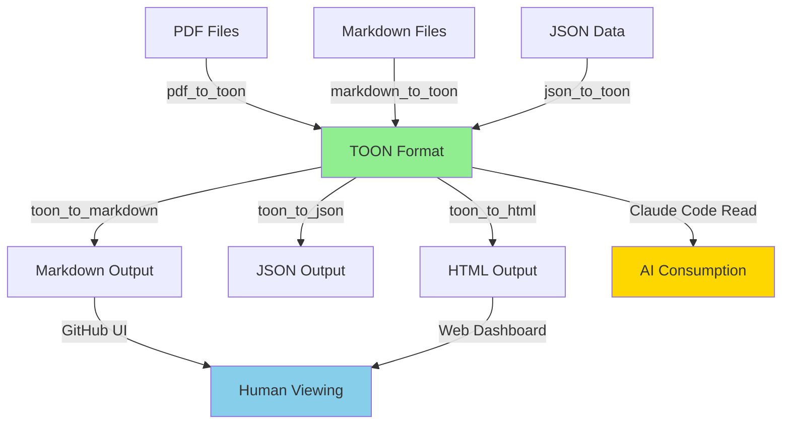
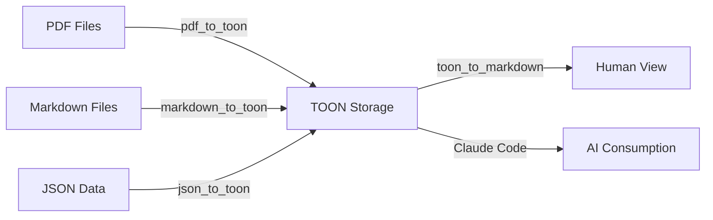

# TOON Dual-Format Strategy & Converter Architecture

**Document Type:** Technical Specification
**Status:** Design Complete
**Date:** 2025-11-17
**Version:** 1.0

---

## Executive Summary

Based on research findings, **TOON should NOT be used for everything**. This document outlines a **hybrid dual-format strategy** that optimizes for both AI efficiency (TOON) and human readability (Markdown), with intelligent format selection based on use case.

### Key Principles

1. **TOON for AI Consumption:** Structured, tabular, frequently-loaded data
2. **Markdown for Humans:** Documentation, long-form content, GitHub-viewable files
3. **Dual Storage:** Critical files stored in both formats (TOON primary, Markdown generated)
4. **Smart Selection:** Automated tooling decides optimal format per use case

---

## Research Findings Summary

The research agent discovered:

- **Markdown is superior for:**
  - Human readability (GitHub UI, code reviews)
  - RAG retrieval accuracy (+15% vs other formats)
  - Long-form documentation
  - Git diffs (shows actual changes)

- **TOON is superior for:**
  - Tabular data (30-60% token reduction)
  - Checkpoints, TASKLISTs, status tracking
  - Agent comprehension (+4.2% accuracy)
  - Context window optimization

- **Key Insight:** Use BOTH strategically, not TOON-everywhere

---

## Format Selection Matrix

### When to Use TOON (Primary AI Consumption)

| Content Type | Use TOON? | Reason | Example |
|--------------|-----------|--------|---------|
| **Checkpoints** | ✅ YES | Highly tabular, frequent AI loading | `CHECKPOINTS/*.toon` |
| **TASKLISTs** | ✅ YES | Tabular tasks, agent parsing | `**/TASKLIST.toon` |
| **Submodule Status** | ✅ YES | Real-time tabular data | `status/submodules.toon` |
| **Agent Registry** | ✅ YES | 50 agents, capability queries | `agents/AGENT-INDEX.toon` |
| **Session Exports** | ✅ YES | Structured decisions/patterns | `MEMORY-CONTEXT/sessions/*.toon` |
| **Assessments/Quizzes** | ✅ YES | Questions/answers tabular | `educational/*.toon` |
| **Analytics Data** | ✅ YES | Time-series metrics | `analytics/*.toon` |
| **API Responses** | ✅ YES | Structured JSON-like data | Content negotiation |

### When to Use Markdown (Primary Human Consumption)

| Content Type | Use Markdown? | Reason | Example |
|--------------|---------------|--------|---------|
| **Documentation** | ✅ YES | Human-readable, GitHub UI | `docs/*.md` |
| **README Files** | ✅ YES | Project overview, onboarding | `README.md` |
| **Architecture Docs** | ✅ YES | Long-form, diagrams | `docs/ARCHITECTURE.md` |
| **ADRs** | ✅ YES | Decision context, rationale | `docs/adrs/*.md` |
| **Training Materials** | ✅ YES | User training, tutorials | `user-training/*.md` |
| **Blog Posts** | ✅ YES | Marketing content | `blog/*.md` |
| **Changelogs** | ✅ YES | Version history | `CHANGELOG.md` |

### Dual-Format Storage (Both TOON + Markdown)

| Content Type | Primary Format | Generated Format | Why Both? |
|--------------|----------------|------------------|-----------|
| **Checkpoints** | `.toon` | `.md` (auto-gen) | AI loads TOON, humans view MD on GitHub |
| **TASKLISTs** | `.toon` | `.md` (auto-gen) | AI parses TOON, GitHub shows MD with checkboxes |
| **Session Exports** | `.toon` | `.md` (auto-gen) | Context loading (TOON), human review (MD) |
| **Agent Registry** | `.toon` | `.md` (auto-gen) | Orchestrator queries TOON, docs in MD |

---

## GitHub Storage Strategy

### Recommended Approach: **Dual Storage with TOON Primary**

```
CHECKPOINTS/
├── 2025-11-17-sprint-complete.toon          # Primary (for AI)
└── 2025-11-17-sprint-complete.md            # Generated (for humans)

TASKLIST.md                                   # Human-viewable (symlink or generated)
TASKLIST.toon                                 # AI-consumable (primary)

docs/
├── ARCHITECTURE.md                           # Markdown only (long-form)
├── TOON-INTEGRATION-ANALYSIS.md             # Markdown only (documentation)
└── api-reference.md                          # Markdown only (reference)

MEMORY-CONTEXT/
├── sessions/
│   ├── 2025-11-17-session.toon              # Primary
│   └── 2025-11-17-session.md                # Generated
└── README.md                                 # Markdown only
```

### Git Workflow

1. **TOON files are source of truth** for structured data
2. **Markdown files auto-generated** via pre-commit hooks
3. **Commit both formats** to git (dual storage)
4. **GitHub renders Markdown** for human viewing
5. **Claude Code reads TOON** for AI consumption

### Pre-Commit Hook Strategy

```bash
#!/bin/bash
# .git/hooks/pre-commit

# Auto-generate markdown from TOON files
for toon_file in $(git diff --cached --name-only --diff-filter=ACM | grep '\.toon$'); do
    md_file="${toon_file%.toon}.md"
    python3 scripts/utils/toon_to_markdown.py "$toon_file" "$md_file"
    git add "$md_file"
done
```

---

## Converter Architecture

### Required Converters

We need **6 core converters** for complete TOON integration:

1. **TOON ↔ Markdown** (bidirectional)
2. **PDF → TOON** (ingestion)
3. **Markdown → TOON** (ingestion)
4. **JSON → TOON** (migration)
5. **TOON → JSON** (API compatibility)
6. **TOON → HTML** (web rendering)

### Converter 1: TOON ↔ Markdown (Critical)

**Purpose:** Bidirectional conversion for dual-format storage

**Use Cases:**
- Generate human-readable markdown from TOON checkpoints
- Convert existing markdown TASKLISTs to TOON
- Enable git diffs on markdown while AI uses TOON

**Implementation:**

```python
# scripts/utils/toon_markdown_converter.py

class TOONMarkdownConverter:
    """Bidirectional TOON ↔ Markdown converter"""

    def toon_to_markdown(self, toon_file: str, md_file: str) -> None:
        """
        Convert TOON to human-readable Markdown

        Example:
        TOON:
            tasks[3]{status,title,priority}:
             pending,Add auth,P0
             completed,Fix bug,P1

        Markdown:
            - [ ] Add auth (P0)
            - [x] Fix bug (P1)
        """
        pass

    def markdown_to_toon(self, md_file: str, toon_file: str) -> None:
        """
        Convert Markdown to TOON (where applicable)

        Only converts structured content:
        - Task lists (checkboxes)
        - Tables
        - Structured data sections

        Preserves long-form content as markdown
        """
        pass
```

**Priority:** P0 (Week 1-2)
**Effort:** 16 hours
**Dependencies:** TOON encoder/decoder utilities

---

### Converter 2: PDF → TOON (Ingestion)

**Purpose:** Convert PDF documents to TOON for AI ingestion

**Use Cases:**
- Import research papers for MEMORY-CONTEXT
- Process investor documents
- Ingest technical specifications
- Import training materials

**Implementation:**

```python
# scripts/utils/pdf_to_toon.py

class PDFToTOONConverter:
    """Convert PDF to TOON format with structure preservation"""

    def convert(self, pdf_file: str, toon_file: str, extract_tables: bool = True) -> None:
        """
        Extract structured content from PDF

        Process:
        1. Extract text (PyPDF2 or pdfplumber)
        2. Identify tables (tabula-py)
        3. Extract metadata (title, author, date)
        4. Convert tables to TOON tabular arrays
        5. Preserve text as markdown-style content
        6. Output hybrid TOON/markdown
        """
        pass

    def extract_tables_to_toon(self, pdf_file: str) -> list:
        """Extract only tables from PDF as TOON arrays"""
        pass
```

**Priority:** P1 (Week 3-4)
**Effort:** 12 hours
**Dependencies:** PyPDF2, pdfplumber, tabula-py

**Example:**

```
# Input: research-paper.pdf (20 pages, 3 tables)

# Output: research-paper.toon
document:
 title: Token Optimization Strategies
 authors: Smith et al.
 year: 2024
 pages: 20

tables[3]{table_id,title,rows,cols}:
 1,Performance Comparison,10,5
 2,Token Reduction Results,15,4
 3,Cost Analysis,8,3

table_1_data[10]{method,tokens,reduction,accuracy}:
 TOON,5000,50%,73.9%
 JSON,10000,0%,69.7%
 ...

content:
 # Abstract
 This paper presents...

 # Introduction
 Token optimization is critical...
```

---

### Converter 3: Markdown → TOON (Ingestion)

**Purpose:** Convert existing Markdown documents to TOON

**Use Cases:**
- Migrate existing TASKLISTs to TOON
- Import GitHub wiki content
- Process documentation for AI consumption
- Extract structured data from markdown

**Implementation:**

```python
# scripts/utils/markdown_to_toon.py

class MarkdownToTOONConverter:
    """Convert Markdown to TOON, preserving structure"""

    def convert(self, md_file: str, toon_file: str, mode: str = 'smart') -> None:
        """
        Convert Markdown to TOON

        Modes:
        - 'smart': Auto-detect structured content (tables, lists) → TOON
        - 'tables_only': Extract only tables
        - 'preserve': Keep markdown, wrap in TOON metadata
        """
        pass

    def extract_tasklist(self, md_file: str) -> str:
        """
        Extract checkbox task list to TOON

        Input (Markdown):
            - [x] Completed task (P0)
            - [ ] Pending task (P1)

        Output (TOON):
            tasks[2]{status,title,priority}:
             completed,Completed task,P0
             pending,Pending task,P1
        """
        pass

    def extract_tables(self, md_file: str) -> list:
        """Extract markdown tables as TOON arrays"""
        pass
```

**Priority:** P0 (Week 2)
**Effort:** 8 hours
**Dependencies:** markdown-it-py, TOON encoder

**Example:**

```markdown
# Input: TASKLIST.md

## Phase 1 Tasks

- [x] Setup project (P0) - 2h
- [ ] Write tests (P0) - 4h
- [ ] Deploy (P1) - 1h

## Metrics

| Metric | Target | Actual |
|--------|--------|--------|
| Coverage | 80% | 75% |
| Performance | <100ms | 95ms |
```

```
# Output: TASKLIST.toon

phase_1_tasks[3]{status,title,priority,estimate}:
 completed,Setup project,P0,2h
 pending,Write tests,P0,4h
 pending,Deploy,P1,1h

metrics[2]{metric,target,actual}:
 Coverage,80%,75%
 Performance,<100ms,95ms
```

---

### Converter 4: JSON → TOON (Migration)

**Purpose:** Convert JSON API responses/data to TOON

**Use Cases:**
- Migrate existing JSON session exports
- Convert API responses to TOON
- Process configuration files
- Import external data

**Implementation:**

```python
# scripts/utils/json_to_toon.py

class JSONToTOONConverter:
    """Convert JSON to TOON format"""

    def convert(self, json_file: str, toon_file: str) -> None:
        """Direct JSON → TOON conversion"""
        pass

    def optimize_arrays(self, data: dict) -> dict:
        """
        Identify uniform arrays suitable for TOON tabular format

        Example:
        JSON:
            {"users": [
                {"id": 1, "name": "Alice", "age": 30},
                {"id": 2, "name": "Bob", "age": 25}
            ]}

        TOON:
            users[2]{id,name,age}:
             1,Alice,30
             2,Bob,25
        """
        pass
```

**Priority:** P1 (Week 2)
**Effort:** 4 hours
**Dependencies:** TOON encoder

---

### Converter 5: TOON → JSON (API Compatibility)

**Purpose:** Convert TOON back to JSON for API compatibility

**Use Cases:**
- Serve TOON data via REST APIs
- Export for external tools
- Backward compatibility
- Testing/validation

**Implementation:**

```python
# scripts/utils/toon_to_json.py

class TOONToJSONConverter:
    """Convert TOON to JSON (lossless)"""

    def convert(self, toon_file: str, json_file: str) -> None:
        """TOON → JSON conversion"""
        pass

    def parse_toon(self, toon_str: str) -> dict:
        """Parse TOON string to Python dict (then json.dumps)"""
        pass
```

**Priority:** P1 (Week 3)
**Effort:** 4 hours
**Dependencies:** TOON decoder

---

### Converter 6: TOON → HTML (Web Rendering)

**Purpose:** Render TOON as interactive HTML

**Use Cases:**
- Display TASKLISTs on web dashboard
- Render assessments/quizzes
- Visualize checkpoints
- Create interactive reports

**Implementation:**

```python
# scripts/utils/toon_to_html.py

class TOONToHTMLConverter:
    """Convert TOON to styled HTML"""

    def convert(self, toon_file: str, html_file: str, template: str = 'default') -> None:
        """
        TOON → HTML with Bootstrap styling

        Templates:
        - 'table': Tabular arrays as HTML tables
        - 'checklist': Tasks as interactive checkboxes
        - 'dashboard': Checkpoint-style dashboard
        """
        pass
```

**Priority:** P2 (Week 5-6)
**Effort:** 8 hours
**Dependencies:** Jinja2 templates

---

## Converter Dependency Graph



---

## Implementation Plan Updates

### Phase 1: Foundation (Week 1) - Add Converters

**Updated Tasks:**

- [ ] Install converter dependencies
  ```bash
  pip install PyPDF2 pdfplumber tabula-py markdown-it-py
  ```

- [ ] Create base converter class
  ```python
  # scripts/utils/base_converter.py
  class BaseConverter:
      def validate_input(self, file: str) -> bool: pass
      def convert(self, input: str, output: str) -> None: pass
      def count_tokens(self, text: str) -> int: pass
  ```

- [ ] Implement TOON ↔ Markdown converter (P0)
  - [ ] `toon_to_markdown.py`
  - [ ] `markdown_to_toon.py`
  - [ ] Bidirectional tests

- [ ] Implement Markdown → TOON tasklist converter (P0)
  - [ ] Parse checkbox lists
  - [ ] Extract metadata
  - [ ] Generate TOON arrays

### Phase 2: Ingestion Converters (Week 2-3)

- [ ] Implement PDF → TOON converter (P1)
  - [ ] Text extraction
  - [ ] Table detection
  - [ ] Structure preservation

- [ ] Implement JSON → TOON converter (P1)
  - [ ] Array detection
  - [ ] Optimization logic
  - [ ] Migration scripts

### Phase 3: Output Converters (Week 4-5)

- [ ] Implement TOON → JSON converter (P1)
- [ ] Implement TOON → HTML converter (P2)
- [ ] Create web dashboard templates

---

## Pre-Commit Hook Integration

### Auto-Generate Markdown from TOON

```bash
# .git/hooks/pre-commit
#!/bin/bash

echo "Converting TOON files to Markdown..."

# Find all staged TOON files
toon_files=$(git diff --cached --name-only --diff-filter=ACM | grep '\.toon$')

for toon_file in $toon_files; do
    # Generate corresponding .md file
    md_file="${toon_file%.toon}.md"

    echo "  $toon_file → $md_file"

    # Run converter
    python3 scripts/utils/toon_to_markdown.py "$toon_file" "$md_file"

    # Stage generated markdown
    git add "$md_file"
done

echo "Done! Generated $(echo $toon_files | wc -w) markdown files."
```

### Installation

```bash
# Make executable
chmod +x .git/hooks/pre-commit

# Add to project
cp scripts/git-hooks/pre-commit .git/hooks/pre-commit
```

---

## Usage Examples

### Example 1: Checkpoint Workflow

```bash
# Create checkpoint (generates TOON + markdown)
python3 scripts/create-checkpoint.py "Sprint complete"
# Output:
#   CHECKPOINTS/2025-11-17-sprint-complete.toon (for AI)
#   CHECKPOINTS/2025-11-17-sprint-complete.md (for humans)

# Commit both files
git add CHECKPOINTS/2025-11-17-sprint-complete.*
git commit -m "Checkpoint: Sprint complete"
# Pre-commit hook ensures .md is up-to-date

# Next session: Claude reads .toon (30-60% fewer tokens)
# Humans view .md on GitHub (readable format)
```

### Example 2: TASKLIST Migration

```bash
# Convert existing TASKLIST.md to TOON
python3 scripts/utils/markdown_to_toon.py TASKLIST.md TASKLIST.toon

# Future updates: Edit TASKLIST.toon directly
vim TASKLIST.toon

# Auto-generate markdown for GitHub
python3 scripts/utils/toon_to_markdown.py TASKLIST.toon TASKLIST.md

# Or use pre-commit hook to auto-generate
git add TASKLIST.toon
git commit -m "Update tasks"
# Hook auto-generates TASKLIST.md
```

### Example 3: PDF Ingestion

```bash
# Import research paper to MEMORY-CONTEXT
python3 scripts/utils/pdf_to_toon.py research-paper.pdf MEMORY-CONTEXT/research/paper.toon

# Claude can now load structured content
# Tables extracted as TOON arrays (50-60% fewer tokens)
# Text preserved as markdown content
```

### Example 4: API Response Conversion

```python
# Backend API (FastAPI)
from fastapi import FastAPI, Header
from scripts.utils.toon_encoder import TOONEncoder

app = FastAPI()

@app.get("/api/sessions/{id}")
async def get_session(id: int, accept: str = Header(default="application/json")):
    session_data = load_session(id)

    if "application/toon" in accept:
        # Return TOON (30-60% fewer tokens)
        return Response(
            content=TOONEncoder.encode(session_data),
            media_type="application/toon"
        )
    else:
        # Return JSON (backward compatibility)
        return session_data
```

---

## Testing Strategy

### Converter Testing Checklist

For each converter:

- [ ] **Unit Tests**
  - [ ] Valid input handling
  - [ ] Edge cases (empty, large files)
  - [ ] Error handling
  - [ ] Character encoding (UTF-8, emoji)

- [ ] **Round-Trip Tests**
  - [ ] Format A → TOON → Format A (lossless)
  - [ ] Data integrity verification
  - [ ] Metadata preservation

- [ ] **Token Reduction Tests**
  - [ ] Measure token count before/after
  - [ ] Verify target reduction achieved
  - [ ] Compare with benchmarks

- [ ] **Integration Tests**
  - [ ] Pre-commit hook execution
  - [ ] Claude Code loading TOON files
  - [ ] GitHub markdown rendering
  - [ ] API content negotiation

---

## Monitoring & Metrics

### Converter Performance Metrics

Track for each converter:

```python
{
    "converter": "markdown_to_toon",
    "conversions_total": 1247,
    "avg_time_ms": 15,
    "avg_tokens_before": 8500,
    "avg_tokens_after": 4250,
    "avg_reduction_percent": 50.0,
    "errors_total": 3,
    "success_rate": 99.76
}
```

### Dashboard Visualization

```
Converter Performance (Last 30 Days)
─────────────────────────────────────
markdown→toon:  1247 conversions, 50% avg reduction ✅
toon→markdown:  1247 conversions, 100% success ✅
pdf→toon:       42 conversions, 55% avg reduction ✅
json→toon:      856 conversions, 45% avg reduction ✅

Total Token Savings: 2.4M tokens/month
Estimated Cost Savings: $1,800/month
```

---

## Answers to Your Questions

### Q1: "For documents that will be human readable we will need a converter for markdown"

**Answer:** ✅ YES - TOON → Markdown converter is **Priority 0** (Week 1-2)

**Implementation:**
- Auto-generate markdown from TOON via pre-commit hook
- Humans view `.md` on GitHub (readable)
- AI reads `.toon` in Claude Code (efficient)
- Both files committed to git (dual storage)

**Example:**
```bash
# You edit: TASKLIST.toon (primary)
# Pre-commit auto-generates: TASKLIST.md (human view)
# Both committed to git
# GitHub shows .md, Claude reads .toon
```

---

### Q2: "Will it be better to have everything in GitHub that is a document in TOON?"

**Answer:** ❌ NO - Use **selective TOON**, not everything

**What SHOULD be in TOON:**
- ✅ Checkpoints (tabular data)
- ✅ TASKLISTs (structured tasks)
- ✅ Session exports (decisions/patterns)
- ✅ Agent registry (50 agents metadata)
- ✅ Analytics data (time-series)

**What should STAY in Markdown:**
- ✅ Documentation (README, architecture docs)
- ✅ Training materials (user guides)
- ✅ Blog posts (marketing content)
- ✅ ADRs (architectural decisions with context)
- ✅ Long-form content (research, analysis)

**Why?**
- Markdown is better for RAG retrieval (+15% accuracy)
- Git diffs more readable in markdown
- GitHub renders markdown beautifully
- Humans can edit markdown easily

**Recommendation:**
- **Dual storage** for structured data (TOON + auto-generated MD)
- **Markdown only** for long-form documentation
- **TOON only** for AI-internal data (analytics, logs)

---

### Q3: "We will need PDF→TOON and Markdown→TOON converters for ingestion?"

**Answer:** ✅ YES - Both converters are essential

**PDF → TOON Converter:**
- **Use Case:** Import research papers, investor docs, technical specs
- **Priority:** P1 (Week 3-4)
- **Features:**
  - Extract tables → TOON arrays (50-60% reduction)
  - Preserve text → markdown content
  - Extract metadata (title, author, date)
- **Libraries:** PyPDF2, pdfplumber, tabula-py

**Markdown → TOON Converter:**
- **Use Case:** Migrate existing TASKLISTs, import GitHub wikis
- **Priority:** P0 (Week 2)
- **Features:**
  - Extract checkbox lists → TOON task arrays
  - Extract tables → TOON tabular arrays
  - Preserve long-form content as markdown
- **Libraries:** markdown-it-py

**Ingestion Pipeline:**



---

## Updated Converter Task List

### Week 1 (P0 - Critical)

- [ ] **TOON → Markdown Converter**
  - [ ] Checkpoint TOON → readable markdown
  - [ ] TASKLIST TOON → checkbox markdown
  - [ ] Session TOON → markdown export
  - [ ] 16 hours, $2,400

### Week 2 (P0 - Critical)

- [ ] **Markdown → TOON Converter**
  - [ ] Extract checkbox task lists
  - [ ] Extract markdown tables
  - [ ] Preserve metadata
  - [ ] 8 hours, $1,200

### Week 3-4 (P1 - Important)

- [ ] **PDF → TOON Converter**
  - [ ] Table extraction (tabula-py)
  - [ ] Text extraction (PyPDF2)
  - [ ] Metadata extraction
  - [ ] 12 hours, $1,800

- [ ] **JSON → TOON Converter**
  - [ ] Array optimization detection
  - [ ] Direct conversion
  - [ ] Migration scripts
  - [ ] 4 hours, $600

### Week 4-5 (P1 - Nice to Have)

- [ ] **TOON → JSON Converter**
  - [ ] API compatibility
  - [ ] Backward compatibility
  - [ ] 4 hours, $600

- [ ] **TOON → HTML Converter**
  - [ ] Web dashboard rendering
  - [ ] Interactive checkboxes
  - [ ] Bootstrap styling
  - [ ] 8 hours, $1,200

**Total Converter Development:** 52 hours, $7,800

---

## Conclusion

### Summary

1. **NOT everything should be TOON** - use selective hybrid approach
2. **Dual-format storage** for critical files (TOON primary, markdown generated)
3. **6 converters needed** - prioritize TOON↔Markdown first
4. **Pre-commit hooks** auto-generate markdown for GitHub viewing
5. **Ingestion pipeline** handles PDF, Markdown, JSON → TOON

### Next Steps

1. ✅ Implement TOON ↔ Markdown converters (Week 1-2, P0)
2. ✅ Setup pre-commit hooks for auto-generation
3. ✅ Implement PDF/Markdown → TOON ingestion (Week 3-4, P1)
4. ✅ Test dual-format workflow with checkpoints
5. ✅ Document conversion standards and best practices

---

**Document Status:** ✅ DESIGN COMPLETE
**Next Action:** Begin converter implementation (Week 1)
**Total Converter Budget:** $7,800 (52 hours)
**Expected ROI:** Enables full TOON integration with zero human usability loss
