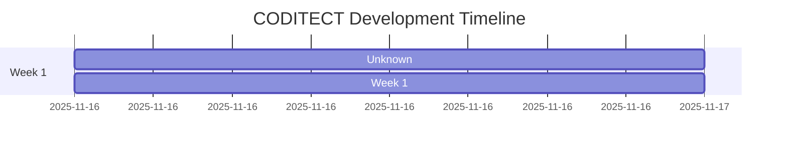
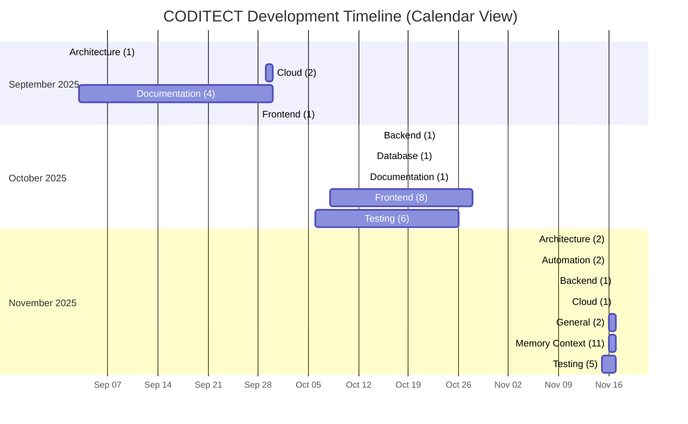

# CODITECT Development Timeline

**Generated**: 2025-11-17T21:25:07.607966
**Total Unique Messages**: 1,601
**Total Checkpoints**: 49
**Phases**: 2

---

## Timeline Visualization



---

## Detailed Timeline

### Unknown

**Messages**: 1,467
**Checkpoints**: 48

**Focus Areas**:
- Documentation: 686 messages (46.8%)
- Memory Context: 171 messages (11.7%)
- General: 157 messages (10.7%)
- Cloud: 142 messages (9.7%)
- Testing: 141 messages (9.6%)
- Architecture: 74 messages (5.0%)
- Backend: 49 messages (3.3%)
- Frontend: 41 messages (2.8%)
- Database: 6 messages (0.4%)

**Checkpoints**:

- **2025-11-17-incremental-test**
  - Focus: Testing
  - Messages: 13
  - Timestamp: 
  - Source: ``

- **2025-11-17-MASTER3-incremental-test**
  - Focus: Testing
  - Messages: 35
  - Timestamp: 
  - Source: ``

- **export-2025-11-17-EXPORT-PROJECTS-coditect-rollout-master**
  - Focus: General
  - Messages: 13
  - Timestamp: 
  - Source: ``

- **export-2025-11-17-EXPORT-PROJECTS-coditect-rollout-master-2**
  - Focus: General
  - Messages: 82
  - Timestamp: 
  - Source: ``

- **export-2025-09-01-EXPORT-ADRS-session5**
  - Focus: Architecture
  - Messages: 53
  - Timestamp: 2025-11-15T19:07:19.159140
  - Source: `submodules/Coditect-v5-multiple-LLM-IDE/docs/09-sessions/2025-09-01-EXPORT-ADRS-session5.txt`

- **export-2025-09-03-EXPORT-DOCUMENT-DEV-3**
  - Focus: Documentation
  - Messages: 117
  - Timestamp: 2025-11-15T19:07:19.159247
  - Source: `submodules/Coditect-v5-multiple-LLM-IDE/docs/09-sessions/2025-09-03-EXPORT-DOCUMENT-DEV-3.txt`

- **export-2025-09-03-EXPORT-SESSION8-QA-REVIEWER**
  - Focus: Documentation
  - Messages: 124
  - Timestamp: 2025-11-15T19:07:19.159359
  - Source: `submodules/Coditect-v5-multiple-LLM-IDE/docs/09-sessions/2025-09-03-EXPORT-SESSION8-QA-REVIEWER.txt`

- **export-2025-09-28-EXPORT-FRONTEND-DEVELOPER-SESSION-2025-09-28-01**
  - Focus: Frontend
  - Messages: 1
  - Timestamp: 2025-11-15T19:07:19.159713
  - Source: `submodules/Coditect-v5-multiple-LLM-IDE/docs/09-sessions/2025-09-28-EXPORT-FRONTEND-DEVELOPER-SESSION-2025-09-28-01.txt`

- **export-2025-09-29-EXPORT-CLOUD-ARCHITECT-SESSION-2025-09-29-01**
  - Focus: Cloud
  - Messages: 3
  - Timestamp: 2025-11-15T19:07:19.159858
  - Source: `MEMORY-CONTEXT/test-dataset/exports/2025-09-29-EXPORT-CLOUD-ARCHITECT-SESSION-2025-09-29-01.txt`

- **export-2025-09-29-EXPORT-ORCHESTRATOR-SESSION-2025-09-27**
  - Focus: Documentation
  - Messages: 290
  - Timestamp: 2025-11-15T19:07:19.160028
  - Source: `submodules/Coditect-v5-multiple-LLM-IDE/docs/09-sessions/2025-09-29-EXPORT-ORCHESTRATOR-SESSION-2025-09-27.txt`

- **export-2025-09-30-EXPORT-CLOUD-ARCHITECT-2025-09-30-02**
  - Focus: Cloud
  - Messages: 120
  - Timestamp: 2025-11-15T19:07:19.160246
  - Source: `submodules/Coditect-v5-multiple-LLM-IDE/docs/09-sessions/2025-09-30-EXPORT-CLOUD-ARCHITECT-2025-09-30-02.txt`

- **export-2025-09-30-EXPORT-FILE-MANAGEMENT-ORGANIZER-SESSION-2025-09-30-01**
  - Focus: Documentation
  - Messages: 74
  - Timestamp: 2025-11-15T19:07:19.160329
  - Source: `submodules/Coditect-v5-multiple-LLM-IDE/docs/09-sessions/2025-09-30-EXPORT-FILE-MANAGEMENT-ORGANIZER-SESSION-2025-09-30-01.txt`

- **export-2025-10-06-02-EXPORT-LM-STUDIO-multiple-LLMS**
  - Focus: Testing
  - Messages: 1
  - Timestamp: 2025-11-15T19:07:19.160426
  - Source: `MEMORY-CONTEXT/test-dataset/exports/2025-10-06-02-EXPORT-LM-STUDIO-multiple-LLMS.txt`

- **export-2025-10-07-EXPORT**
  - Focus: Testing
  - Messages: 6
  - Timestamp: 2025-11-15T19:07:19.161360
  - Source: `MEMORY-CONTEXT/test-dataset/exports/2025-10-07-EXPORT.txt`

- **export-2025-10-08-EXPORT-Theia-BRANDING-ISSUES**
  - Focus: Testing
  - Messages: 2
  - Timestamp: 2025-11-15T19:07:19.161459
  - Source: `MEMORY-CONTEXT/test-dataset/exports/2025-10-08-EXPORT-Theia-BRANDING-ISSUES.txt`

- **export-2025-10-12-EXPORT-DOCKER-BUILD**
  - Focus: Frontend
  - Messages: 4
  - Timestamp: 2025-11-15T19:07:19.161667
  - Source: `MEMORY-CONTEXT/test-dataset/exports/2025-10-12-EXPORT-DOCKER-BUILD.txt`

- **export-2025-10-12-EXPORT-DOT-CLAUDE-UPDATES**
  - Focus: Testing
  - Messages: 15
  - Timestamp: 2025-11-15T19:07:19.161757
  - Source: `MEMORY-CONTEXT/test-dataset/exports/2025-10-12-EXPORT-DOT-CLAUDE-UPDATES.txt`

- **export-2025-10-12-EXPORT-FRONTEND-DOCKER-BUILD**
  - Focus: Frontend
  - Messages: 18
  - Timestamp: 2025-11-15T19:07:19.161857
  - Source: `MEMORY-CONTEXT/test-dataset/exports/2025-10-12-EXPORT-FRONTEND-DOCKER-BUILD.txt`

- **export-2025-10-13-EXPORT-DOCKER-V5-CODITECT-WRAPPER-PERSISTENCE**
  - Focus: Documentation
  - Messages: 1
  - Timestamp: 2025-11-15T19:07:19.162045
  - Source: `MEMORY-CONTEXT/test-dataset/exports/2025-10-13-EXPORT-DOCKER-V5-CODITECT-WRAPPER-PERSISTENCE.txt`

- **export-2025-10-14-EXPORT-FOUNDATIONDB-SESSION**
  - Focus: Database
  - Messages: 6
  - Timestamp: 2025-11-15T19:07:19.162133
  - Source: `MEMORY-CONTEXT/test-dataset/exports/2025-10-14-EXPORT-FOUNDATIONDB-SESSION.txt`

- **export-2025-10-14-EXPORT-SESSION-CONTEXT**
  - Focus: Testing
  - Messages: 28
  - Timestamp: 2025-11-15T19:07:19.162254
  - Source: `MEMORY-CONTEXT/test-dataset/exports/2025-10-14-EXPORT-SESSION-CONTEXT.txt`

- **export-2025-10-14-EXPORT-SessionTabManager-FIX**
  - Focus: Testing
  - Messages: 5
  - Timestamp: 2025-11-15T19:07:19.162355
  - Source: `MEMORY-CONTEXT/test-dataset/exports/2025-10-14-EXPORT-SessionTabManager-FIX.txt`

- **export-2025-10-15-EXPORT-BACKEND-BUILD-ERRORS**
  - Focus: Backend
  - Messages: 28
  - Timestamp: 2025-11-15T19:07:19.162441
  - Source: `submodules/Coditect-v5-multiple-LLM-IDE/docs/09-sessions/2025-10-15-EXPORT-BACKEND-BUILD-ERRORS.txt`

- **export-2025-10-26-EXPORT-LATEST-CODITECT-YAML-PRE-PRODUCTION-CLOUD-BUILD**
  - Focus: Frontend
  - Messages: 4
  - Timestamp: 2025-11-15T19:07:19.162698
  - Source: `MEMORY-CONTEXT/test-dataset/exports/2025-10-26-EXPORT-LATEST-CODITECT-YAML-PRE-PRODUCTION-CLOUD-BUILD.txt`

- **export-2025-10-26-EXPORT-PRE-PRODUCTION-PREPARATION**
  - Focus: Testing
  - Messages: 15
  - Timestamp: 2025-11-15T19:07:19.162788
  - Source: `MEMORY-CONTEXT/test-dataset/exports/2025-10-26-EXPORT-PRE-PRODUCTION-PREPARATION.txt`

- **export-2025-10-27-EXPORT-BUILD17-SESSION1**
  - Focus: Frontend
  - Messages: 4
  - Timestamp: 2025-11-15T19:07:19.162896
  - Source: `MEMORY-CONTEXT/test-dataset/exports/2025-10-27-EXPORT-BUILD17-SESSION1.txt`

- **export-2025-10-27-EXPORT-BUILD17-SESSION2**
  - Focus: Frontend
  - Messages: 7
  - Timestamp: 2025-11-15T19:07:19.163062
  - Source: `submodules/Coditect-v5-multiple-LLM-IDE/docs/09-sessions/2025-10-27-EXPORT-BUILD17-SESSION2.txt`

- **export-2025-10-28-EXPORT-CODITECT-BUILD-26**
  - Focus: Frontend
  - Messages: 3
  - Timestamp: 2025-11-15T19:07:19.163217
  - Source: `MEMORY-CONTEXT/test-dataset/exports/2025-10-28-EXPORT-CODITECT-BUILD-26.txt`

- **export-2025-10=20-EXPORT-SPRINT-2**
  - Focus: Testing
  - Messages: 18
  - Timestamp: 2025-11-15T19:07:19.163306
  - Source: `MEMORY-CONTEXT/test-dataset/exports/2025-10=20-EXPORT-SPRINT-2.txt`

- **export-2025-10-11-EXPORT-KNOWLEDGEBASE-SESSION**
  - Focus: Documentation
  - Messages: 80
  - Timestamp: 2025-11-15T19:07:19.257441
  - Source: `submodules/Coditect-v5-multiple-LLM-IDE/docs/99-archive/obsolete-directories/theia-kb-extension/2025-10-11-EXPORT-KNOWLEDGEBASE-SESSION.txt`

- **checkpoint-2025-11-16T03-54-36Z-SPRINT-COMPLETE-ONBOARDING-SYSTEM**
  - Focus: General
  - Messages: 16
  - Timestamp: 2025-11-15T22:56:47.273132
  - Source: `CHECKPOINTS/2025-11-16T03-54-36Z-SPRINT-COMPLETE-ONBOARDING-SYSTEM.md`

- **export-2025-11-17-EXPORT-MEMORY-CONTEXT-DOT-CODITECT**
  - Focus: Memory Context
  - Messages: 5
  - Timestamp: 2025-11-16T03:28:31.775558
  - Source: `MEMORY-CONTEXT/2025-11-17-EXPORT-MEMORY-CONTEXT-DOT-CODITECT.txt`

- **checkpoint-2025-11-16T08-34-53Z-DISTRIBUTED-INTELLIGENCE-ARCHITECTURE-COMPLETE**
  - Focus: Architecture
  - Messages: 17
  - Timestamp: 2025-11-16T03:36:56.361871
  - Source: `CHECKPOINTS/2025-11-16T08-34-53Z-DISTRIBUTED-INTELLIGENCE-ARCHITECTURE-COMPLETE.md`

- **checkpoint-2025-11-16T09-05-16Z-Checkpoint-Automation-System-Implementation-Complete**
  - Focus: General
  - Messages: 12
  - Timestamp: 2025-11-16T04:05:17.575650
  - Source: `CHECKPOINTS/2025-11-16T09-05-16Z-Checkpoint-Automation-System-Implementation-Complete.md`

- **checkpoint-2025-11-16T09-26-41Z-TASKLISTs-Updated-and-Checkpoint-Automation-System-Complete**
  - Focus: General
  - Messages: 4
  - Timestamp: 2025-11-16T04:27:18.281614
  - Source: `CHECKPOINTS/2025-11-16T09-26-41Z-TASKLISTs-Updated-and-Checkpoint-Automation-System-Complete.md`

- **export-2025-11-16-EXPORT-CHECKPOINT**
  - Focus: Memory Context
  - Messages: 37
  - Timestamp: 2025-11-16T04:31:37.305152
  - Source: `MEMORY-CONTEXT/2025-11-16-EXPORT-CHECKPOINT.txt`

- **checkpoint-2025-11-16T09-56-08Z-Distributed-Intelligence-Architecture-Complete---All-Symlinks-Configured**
  - Focus: Architecture
  - Messages: 4
  - Timestamp: 2025-11-16T04:58:10.961769
  - Source: `CHECKPOINTS/2025-11-16T09-56-08Z-Distributed-Intelligence-Architecture-Complete---All-Symlinks-Configured.md`

- **export-2025-11-16T20:08:18Z-EXPORT-DAY6-NESTED-LEARNINGS**
  - Focus: Testing
  - Messages: 2
  - Timestamp: 2025-11-16T15:09:22.848148
  - Source: `MEMORY-CONTEXT/test-dataset/exports/2025-11-16T20:08:18Z-EXPORT-DAY6-NESTED-LEARNINGS.txt`

- **export-2025-11-16-EXPORT-CODITECT-INSTALLER**
  - Focus: Testing
  - Messages: 1
  - Timestamp: 2025-11-16T20:56:22.906861
  - Source: `MEMORY-CONTEXT/test-dataset/exports/2025-11-16-EXPORT-CODITECT-INSTALLER.txt`

- **export-2025-11-17-EXPORT-ROLLOUT-MASTER**
  - Focus: Memory Context
  - Messages: 2
  - Timestamp: 2025-11-17T04:26:42.803301
  - Source: `MEMORY-CONTEXT/exports/2025-11-17-EXPORT-ROLLOUT-MASTER.txt`

- **checkpoint-2025-11-17T10-21-00Z-Week-1-Phase-1-Complete**
  - Focus: General
  - Messages: 13
  - Timestamp: 2025-11-17T05:21:41.697088
  - Source: `CHECKPOINTS/2025-11-17T10-21-00Z-Week-1-Phase-1-Complete.md`

- **checkpoint-2025-11-17T09-30-00Z-CONVERSATION-DEDUP-WEEK1-DAY1-COMPLETE**
  - Focus: Memory Context
  - Messages: 16
  - Timestamp: 2025-11-17T10:31:09.674010
  - Source: `CHECKPOINTS/2025-11-17T09-30-00Z-CONVERSATION-DEDUP-WEEK1-DAY1-COMPLETE.md`

- **checkpoint-2025-11-17T15-30-00Z-Week-1-Phase-2.1-Cloud-SQL-Deployed**
  - Focus: Cloud
  - Messages: 19
  - Timestamp: 2025-11-17T10:32:19.106896
  - Source: `CHECKPOINTS/2025-11-17T15-30-00Z-Week-1-Phase-2.1-Cloud-SQL-Deployed.md`

- **checkpoint-2025-11-17T23-00-00Z-Week-1-Backend-Implementation-Complete**
  - Focus: Backend
  - Messages: 21
  - Timestamp: 2025-11-17T16:59:53.308511
  - Source: `CHECKPOINTS/2025-11-17T23-00-00Z-Week-1-Backend-Implementation-Complete.md`

- **export-2025-11-17-EXPORT-MASTER**
  - Focus: Memory Context
  - Messages: 85
  - Timestamp: 2025-11-17T19:06:47.422333
  - Source: `MEMORY-CONTEXT/2025-11-17-EXPORT-MASTER.txt`

- **export-2025-11-17-EXPORT-MASTER2**
  - Focus: Memory Context
  - Messages: 9
  - Timestamp: 2025-11-17T19:11:48.835041
  - Source: `MEMORY-CONTEXT/2025-11-17-EXPORT-MASTER2.txt`

- **export-2025-11-17-EXPORT-MASTER3**
  - Focus: Memory Context
  - Messages: 17
  - Timestamp: 2025-11-17T19:21:26.747599
  - Source: `MEMORY-CONTEXT/2025-11-17-EXPORT-MASTER3.txt`

- **export-2025-11-17-EXPORT-PROJECTS-coditect-rollout-master-2117ET**
  - Focus: General
  - Messages: 17
  - Timestamp: 2025-11-17T21:17:05.327619
  - Source: `2025-11-17-EXPORT-PROJECTS-coditect-rollout-master-2117ET.txt`

---

### Week 1

**Messages**: 134
**Checkpoints**: 1

**Focus Areas**:
- Memory Context: 134 messages (100.0%)

**By Day**:

#### Day 2
- **2025-11-17-Week 1 Day 2 - Deduplication System Complete**
  - Focus: Memory Context
  - Messages: 134
  - Source: ``

---

## Integration with Project Plans

### Linked Resources

**Project Plans:**
- [CODITECT Master Orchestration Plan](CODITECT-MASTER-ORCHESTRATION-PLAN.md)
- [Cloud Platform Project Plan](CODITECT-CLOUD-PLATFORM-PROJECT-PLAN.md)
- [Rollout Master Plan](CODITECT-ROLLOUT-MASTER-PLAN.md)

**Tasklists:**
- Check individual submodule `TASKLIST.md` files for checkbox progress
- See `CHECKPOINTS/` directory for completed phase summaries

**Export Files:**
- All processed exports in `MEMORY-CONTEXT/dedup_state/unique_messages.jsonl`
- Original exports in submodule `docs/09-sessions/` directories

---

## Usage

**Drill Down:**
1. Identify phase of interest (e.g., Week 1, Sprint +1)
2. Review focus areas to understand work distribution
3. Navigate to specific checkpoint files for detailed context
4. Check linked project plans and tasklists for task status

**API Integration:**
- JSON export available: `PROJECT-TIMELINE.json`
- Use for activity feed integration
- Powers 360° project intelligence dashboard

---

**Last Updated**: 2025-11-17T21:25:07.608066# CODITECT Development Timeline (Enhanced)

**Generated**: 2025-11-17T21:28:56.618038
**Total Unique Messages**: 1,601
**Total Checkpoints**: 49
**Completed Tasks Tracked**: 242

---

## 📊 Overview

This timeline organizes all development activity by:
- **Calendar dates** (Year → Month → Week → Day)
- **Focus areas** (Backend, Frontend, Cloud, etc.)
- **Completed tasks** extracted from checkpoint files
- **Message counts** from deduplicated conversation history

---

## 📅 Timeline Visualization



---

## 📆 Calendar Timeline

### 2025

#### September 2025

**Summary**: 8 checkpoints, 782 messages, 0 tasks completed

##### Week 36

###### Monday, September 01, 2025

**export-2025-09-01-EXPORT-ADRS-session5**
- **Focus**: Architecture
- **Phase**: Unknown
- **Messages**: 53
- **Source**: `submodules/Coditect-v5-multiple-LLM-IDE/docs/09-sessions/2025-09-01-EXPORT-ADRS-session5.txt`

###### Wednesday, September 03, 2025

**export-2025-09-03-EXPORT-DOCUMENT-DEV-3**
- **Focus**: Documentation
- **Phase**: Unknown
- **Messages**: 117
- **Source**: `submodules/Coditect-v5-multiple-LLM-IDE/docs/09-sessions/2025-09-03-EXPORT-DOCUMENT-DEV-3.txt`

**export-2025-09-03-EXPORT-SESSION8-QA-REVIEWER**
- **Focus**: Documentation
- **Phase**: Unknown
- **Messages**: 124
- **Source**: `submodules/Coditect-v5-multiple-LLM-IDE/docs/09-sessions/2025-09-03-EXPORT-SESSION8-QA-REVIEWER.txt`

##### Week 39

###### Sunday, September 28, 2025

**export-2025-09-28-EXPORT-FRONTEND-DEVELOPER-SESSION-2025-09-28-01**
- **Focus**: Frontend
- **Phase**: Unknown
- **Messages**: 1
- **Source**: `submodules/Coditect-v5-multiple-LLM-IDE/docs/09-sessions/2025-09-28-EXPORT-FRONTEND-DEVELOPER-SESSION-2025-09-28-01.txt`

##### Week 40

###### Monday, September 29, 2025

**export-2025-09-29-EXPORT-CLOUD-ARCHITECT-SESSION-2025-09-29-01**
- **Focus**: Cloud
- **Phase**: Unknown
- **Messages**: 3
- **Source**: `MEMORY-CONTEXT/test-dataset/exports/2025-09-29-EXPORT-CLOUD-ARCHITECT-SESSION-2025-09-29-01.txt`

**export-2025-09-29-EXPORT-ORCHESTRATOR-SESSION-2025-09-27**
- **Focus**: Documentation
- **Phase**: Unknown
- **Messages**: 290
- **Source**: `submodules/Coditect-v5-multiple-LLM-IDE/docs/09-sessions/2025-09-29-EXPORT-ORCHESTRATOR-SESSION-2025-09-27.txt`

###### Tuesday, September 30, 2025

**export-2025-09-30-EXPORT-CLOUD-ARCHITECT-2025-09-30-02**
- **Focus**: Cloud
- **Phase**: Unknown
- **Messages**: 120
- **Source**: `submodules/Coditect-v5-multiple-LLM-IDE/docs/09-sessions/2025-09-30-EXPORT-CLOUD-ARCHITECT-2025-09-30-02.txt`

**export-2025-09-30-EXPORT-FILE-MANAGEMENT-ORGANIZER-SESSION-2025-09-30-01**
- **Focus**: Documentation
- **Phase**: Unknown
- **Messages**: 74
- **Source**: `submodules/Coditect-v5-multiple-LLM-IDE/docs/09-sessions/2025-09-30-EXPORT-FILE-MANAGEMENT-ORGANIZER-SESSION-2025-09-30-01.txt`

#### October 2025

**Summary**: 17 checkpoints, 227 messages, 0 tasks completed

##### Week 41

###### Monday, October 06, 2025

**export-2025-10-06-02-EXPORT-LM-STUDIO-multiple-LLMS**
- **Focus**: Testing
- **Phase**: Unknown
- **Messages**: 1
- **Source**: `MEMORY-CONTEXT/test-dataset/exports/2025-10-06-02-EXPORT-LM-STUDIO-multiple-LLMS.txt`

###### Tuesday, October 07, 2025

**export-2025-10-07-EXPORT**
- **Focus**: Testing
- **Phase**: Unknown
- **Messages**: 6
- **Source**: `MEMORY-CONTEXT/test-dataset/exports/2025-10-07-EXPORT.txt`

###### Wednesday, October 08, 2025

**export-2025-10-08-EXPORT-Theia-BRANDING-ISSUES**
- **Focus**: Frontend
- **Phase**: Unknown
- **Messages**: 2
- **Source**: `MEMORY-CONTEXT/test-dataset/exports/2025-10-08-EXPORT-Theia-BRANDING-ISSUES.txt`

###### Saturday, October 11, 2025

**export-2025-10-11-EXPORT-KNOWLEDGEBASE-SESSION**
- **Focus**: Frontend
- **Phase**: Unknown
- **Messages**: 80
- **Source**: `submodules/Coditect-v5-multiple-LLM-IDE/docs/99-archive/obsolete-directories/theia-kb-extension/2025-10-11-EXPORT-KNOWLEDGEBASE-SESSION.txt`

###### Sunday, October 12, 2025

**export-2025-10-12-EXPORT-DOCKER-BUILD**
- **Focus**: Frontend
- **Phase**: Unknown
- **Messages**: 4
- **Source**: `MEMORY-CONTEXT/test-dataset/exports/2025-10-12-EXPORT-DOCKER-BUILD.txt`

**export-2025-10-12-EXPORT-DOT-CLAUDE-UPDATES**
- **Focus**: Testing
- **Phase**: Unknown
- **Messages**: 15
- **Source**: `MEMORY-CONTEXT/test-dataset/exports/2025-10-12-EXPORT-DOT-CLAUDE-UPDATES.txt`

**export-2025-10-12-EXPORT-FRONTEND-DOCKER-BUILD**
- **Focus**: Frontend
- **Phase**: Unknown
- **Messages**: 18
- **Source**: `MEMORY-CONTEXT/test-dataset/exports/2025-10-12-EXPORT-FRONTEND-DOCKER-BUILD.txt`

##### Week 42

###### Monday, October 13, 2025

**export-2025-10-13-EXPORT-DOCKER-V5-CODITECT-WRAPPER-PERSISTENCE**
- **Focus**: Documentation
- **Phase**: Unknown
- **Messages**: 1
- **Source**: `MEMORY-CONTEXT/test-dataset/exports/2025-10-13-EXPORT-DOCKER-V5-CODITECT-WRAPPER-PERSISTENCE.txt`

###### Tuesday, October 14, 2025

**export-2025-10-14-EXPORT-FOUNDATIONDB-SESSION**
- **Focus**: Database
- **Phase**: Unknown
- **Messages**: 6
- **Source**: `MEMORY-CONTEXT/test-dataset/exports/2025-10-14-EXPORT-FOUNDATIONDB-SESSION.txt`

**export-2025-10-14-EXPORT-SESSION-CONTEXT**
- **Focus**: Testing
- **Phase**: Unknown
- **Messages**: 28
- **Source**: `MEMORY-CONTEXT/test-dataset/exports/2025-10-14-EXPORT-SESSION-CONTEXT.txt`

**export-2025-10-14-EXPORT-SessionTabManager-FIX**
- **Focus**: Testing
- **Phase**: Unknown
- **Messages**: 5
- **Source**: `MEMORY-CONTEXT/test-dataset/exports/2025-10-14-EXPORT-SessionTabManager-FIX.txt`

###### Wednesday, October 15, 2025

**export-2025-10-15-EXPORT-BACKEND-BUILD-ERRORS**
- **Focus**: Backend
- **Phase**: Unknown
- **Messages**: 28
- **Source**: `submodules/Coditect-v5-multiple-LLM-IDE/docs/09-sessions/2025-10-15-EXPORT-BACKEND-BUILD-ERRORS.txt`

##### Week 43

###### Sunday, October 26, 2025

**export-2025-10-26-EXPORT-LATEST-CODITECT-YAML-PRE-PRODUCTION-CLOUD-BUILD**
- **Focus**: Frontend
- **Phase**: Unknown
- **Messages**: 4
- **Source**: `MEMORY-CONTEXT/test-dataset/exports/2025-10-26-EXPORT-LATEST-CODITECT-YAML-PRE-PRODUCTION-CLOUD-BUILD.txt`

**export-2025-10-26-EXPORT-PRE-PRODUCTION-PREPARATION**
- **Focus**: Testing
- **Phase**: Unknown
- **Messages**: 15
- **Source**: `MEMORY-CONTEXT/test-dataset/exports/2025-10-26-EXPORT-PRE-PRODUCTION-PREPARATION.txt`

##### Week 44

###### Monday, October 27, 2025

**export-2025-10-27-EXPORT-BUILD17-SESSION1**
- **Focus**: Frontend
- **Phase**: Unknown
- **Messages**: 4
- **Source**: `MEMORY-CONTEXT/test-dataset/exports/2025-10-27-EXPORT-BUILD17-SESSION1.txt`

**export-2025-10-27-EXPORT-BUILD17-SESSION2**
- **Focus**: Frontend
- **Phase**: Unknown
- **Messages**: 7
- **Source**: `submodules/Coditect-v5-multiple-LLM-IDE/docs/09-sessions/2025-10-27-EXPORT-BUILD17-SESSION2.txt`

###### Tuesday, October 28, 2025

**export-2025-10-28-EXPORT-CODITECT-BUILD-26**
- **Focus**: Frontend
- **Phase**: Unknown
- **Messages**: 3
- **Source**: `MEMORY-CONTEXT/test-dataset/exports/2025-10-28-EXPORT-CODITECT-BUILD-26.txt`

#### November 2025

**Summary**: 24 checkpoints, 592 messages, 0 tasks completed

##### Week 46

###### Saturday, November 15, 2025

**export-2025-10=20-EXPORT-SPRINT-2**
- **Focus**: Testing
- **Phase**: Unknown
- **Messages**: 18
- **Source**: `MEMORY-CONTEXT/test-dataset/exports/2025-10=20-EXPORT-SPRINT-2.txt`

###### Sunday, November 16, 2025

**export-2025-11-16T20:08:18Z-EXPORT-DAY6-NESTED-LEARNINGS**
- **Focus**: Testing
- **Phase**: Unknown
- **Messages**: 2
- **Source**: `MEMORY-CONTEXT/test-dataset/exports/2025-11-16T20:08:18Z-EXPORT-DAY6-NESTED-LEARNINGS.txt`

**export-2025-11-16-EXPORT-CODITECT-INSTALLER**
- **Focus**: Testing
- **Phase**: Unknown
- **Messages**: 1
- **Source**: `MEMORY-CONTEXT/test-dataset/exports/2025-11-16-EXPORT-CODITECT-INSTALLER.txt`

**checkpoint-2025-11-16T03-54-36Z-SPRINT-COMPLETE-ONBOARDING-SYSTEM**
- **Focus**: General
- **Phase**: Unknown
- **Messages**: 16
- **Source**: `CHECKPOINTS/2025-11-16T03-54-36Z-SPRINT-COMPLETE-ONBOARDING-SYSTEM.md`

**checkpoint-2025-11-16T08-34-53Z-DISTRIBUTED-INTELLIGENCE-ARCHITECTURE-COMPLETE**
- **Focus**: Architecture
- **Phase**: Unknown
- **Messages**: 17
- **Source**: `CHECKPOINTS/2025-11-16T08-34-53Z-DISTRIBUTED-INTELLIGENCE-ARCHITECTURE-COMPLETE.md`

**checkpoint-2025-11-16T09-05-16Z-Checkpoint-Automation-System-Implementation-Complete**
- **Focus**: Automation
- **Phase**: Unknown
- **Messages**: 12
- **Source**: `CHECKPOINTS/2025-11-16T09-05-16Z-Checkpoint-Automation-System-Implementation-Complete.md`

**checkpoint-2025-11-16T09-26-41Z-TASKLISTs-Updated-and-Checkpoint-Automation-System-Complete**
- **Focus**: Automation
- **Phase**: Unknown
- **Messages**: 4
- **Source**: `CHECKPOINTS/2025-11-16T09-26-41Z-TASKLISTs-Updated-and-Checkpoint-Automation-System-Complete.md`

**checkpoint-2025-11-16T09-56-08Z-Distributed-Intelligence-Architecture-Complete---All-Symlinks-Configured**
- **Focus**: Architecture
- **Phase**: Unknown
- **Messages**: 4
- **Source**: `CHECKPOINTS/2025-11-16T09-56-08Z-Distributed-Intelligence-Architecture-Complete---All-Symlinks-Configured.md`

**export-2025-11-16-EXPORT-CHECKPOINT**
- **Focus**: Memory Context
- **Phase**: Unknown
- **Messages**: 37
- **Source**: `MEMORY-CONTEXT/2025-11-16-EXPORT-CHECKPOINT.txt`

##### Week 47

###### Monday, November 17, 2025

**2025-11-17-Week 1 Day 2 - Deduplication System Complete**
- **Focus**: Memory Context
- **Phase**: Week 1
- **Messages**: 134
- **Source**: ``

**2025-11-17-incremental-test**
- **Focus**: Testing
- **Phase**: Unknown
- **Messages**: 13
- **Source**: ``

**2025-11-17-MASTER3-incremental-test**
- **Focus**: Testing
- **Phase**: Unknown
- **Messages**: 35
- **Source**: ``

**export-2025-11-17-EXPORT-PROJECTS-coditect-rollout-master**
- **Focus**: Memory Context
- **Phase**: Unknown
- **Messages**: 13
- **Source**: ``

**export-2025-11-17-EXPORT-PROJECTS-coditect-rollout-master-2**
- **Focus**: Memory Context
- **Phase**: Unknown
- **Messages**: 82
- **Source**: ``

**export-2025-11-17-EXPORT-MEMORY-CONTEXT-DOT-CODITECT**
- **Focus**: Memory Context
- **Phase**: Unknown
- **Messages**: 5
- **Source**: `MEMORY-CONTEXT/2025-11-17-EXPORT-MEMORY-CONTEXT-DOT-CODITECT.txt`

**export-2025-11-17-EXPORT-ROLLOUT-MASTER**
- **Focus**: Memory Context
- **Phase**: Unknown
- **Messages**: 2
- **Source**: `MEMORY-CONTEXT/exports/2025-11-17-EXPORT-ROLLOUT-MASTER.txt`

**checkpoint-2025-11-17T10-21-00Z-Week-1-Phase-1-Complete**
- **Focus**: General
- **Phase**: Unknown
- **Messages**: 13
- **Source**: `CHECKPOINTS/2025-11-17T10-21-00Z-Week-1-Phase-1-Complete.md`

**checkpoint-2025-11-17T09-30-00Z-CONVERSATION-DEDUP-WEEK1-DAY1-COMPLETE**
- **Focus**: Memory Context
- **Phase**: Unknown
- **Messages**: 16
- **Source**: `CHECKPOINTS/2025-11-17T09-30-00Z-CONVERSATION-DEDUP-WEEK1-DAY1-COMPLETE.md`

**checkpoint-2025-11-17T15-30-00Z-Week-1-Phase-2.1-Cloud-SQL-Deployed**
- **Focus**: Cloud
- **Phase**: Unknown
- **Messages**: 19
- **Source**: `CHECKPOINTS/2025-11-17T15-30-00Z-Week-1-Phase-2.1-Cloud-SQL-Deployed.md`

**checkpoint-2025-11-17T23-00-00Z-Week-1-Backend-Implementation-Complete**
- **Focus**: Backend
- **Phase**: Unknown
- **Messages**: 21
- **Source**: `CHECKPOINTS/2025-11-17T23-00-00Z-Week-1-Backend-Implementation-Complete.md`

**export-2025-11-17-EXPORT-MASTER**
- **Focus**: Memory Context
- **Phase**: Unknown
- **Messages**: 85
- **Source**: `MEMORY-CONTEXT/2025-11-17-EXPORT-MASTER.txt`

**export-2025-11-17-EXPORT-MASTER2**
- **Focus**: Memory Context
- **Phase**: Unknown
- **Messages**: 9
- **Source**: `MEMORY-CONTEXT/2025-11-17-EXPORT-MASTER2.txt`

**export-2025-11-17-EXPORT-MASTER3**
- **Focus**: Memory Context
- **Phase**: Unknown
- **Messages**: 17
- **Source**: `MEMORY-CONTEXT/2025-11-17-EXPORT-MASTER3.txt`

**export-2025-11-17-EXPORT-PROJECTS-coditect-rollout-master-2117ET**
- **Focus**: Memory Context
- **Phase**: Unknown
- **Messages**: 17
- **Source**: `2025-11-17-EXPORT-PROJECTS-coditect-rollout-master-2117ET.txt`

---

## 📈 Statistics

### By Focus Area

| Focus Area | Checkpoints | Messages | Tasks |
|------------|-------------|----------|-------|
| Documentation | 5 | 606 | 0 |
| Memory Context | 11 | 417 | 0 |
| Cloud | 3 | 142 | 0 |
| Testing | 11 | 139 | 0 |
| Frontend | 9 | 123 | 0 |
| Architecture | 3 | 74 | 0 |
| Backend | 2 | 49 | 0 |
| General | 2 | 29 | 0 |
| Automation | 2 | 16 | 0 |
| Database | 1 | 6 | 0 |

---

## 🔗 Integration

### Linked Resources

**Project Plans:**
- [Master Orchestration Plan](CODITECT-MASTER-ORCHESTRATION-PLAN.md)
- [Cloud Platform Project Plan](CODITECT-CLOUD-PLATFORM-PROJECT-PLAN.md)
- [Rollout Master Plan](CODITECT-ROLLOUT-MASTER-PLAN.md)

**Tasklists:**
- Individual submodule `TASKLIST.md` files
- `CHECKPOINTS/` directory for phase summaries

**Raw Data:**
- [Interactive HTML Timeline](PROJECT-TIMELINE-INTERACTIVE.html)
- [JSON Data Export](PROJECT-TIMELINE-DATA.json)
- [Deduplication Database](../MEMORY-CONTEXT/dedup_state/)

---

**Last Updated**: 2025-11-17T21:28:56.626830# 8-Week Project Timeline
## .claude Framework: 78% → 100% Autonomous Operation

**Visual Gantt Chart**

---

## Timeline Overview

```
┌─────────────────────────────────────────────────────────────────────────────┐
│                        8-WEEK IMPLEMENTATION ROADMAP                         │
└─────────────────────────────────────────────────────────────────────────────┘

WEEK 1          WEEK 2          WEEK 3          WEEK 4
├───────────────┼───────────────┼───────────────┼───────────────┤
│ PHASE 1: FOUNDATION (P0)      │ PHASE 2: RESILIENCE (P0)      │
├───────────────┼───────────────┼───────────────┼───────────────┤
│ • Infra Setup │ • Message Bus │ • Circuit     │ • Distributed │
│ • Agent       │ • Task Queue  │   Breaker     │   State Mgr   │
│   Discovery   │ • Integration │ • Retry Engine│ • Stress Test │
└───────────────┴───────────────┴───────────────┴───────────────┘
   ↓ MILESTONE 1                   ↓ MILESTONE 2
   First autonomous workflow        Failure resilience working


WEEK 5          WEEK 6          WEEK 7          WEEK 8
├───────────────┼───────────────┼───────────────┼───────────────┤
│ PHASE 3: OBSERVABILITY (P1)   │ PHASE 4: POLISH (P1/P2)       │
├───────────────┼───────────────┼───────────────┼───────────────┤
│ • Prometheus  │ • Logging     │ • CLI         │ • Load Test   │
│ • Jaeger      │ • Grafana     │ • API Docs    │ • Production  │
│ • Metrics     │ • Dashboards  │ • Deployment  │ • Go Live     │
└───────────────┴───────────────┴───────────────┴───────────────┘
   ↓ MILESTONE 3                   ↓ MILESTONE 4
   Full observability              Production ready
```

---

## Detailed Week-by-Week Breakdown

### Week 1: Foundation - Infrastructure & Discovery
**Priority:** P0 (CRITICAL)
**Focus:** Set up infrastructure and agent discovery

```
MON         TUE         WED         THU         FRI
├───────────┼───────────┼───────────┼───────────┼───────────┤
│ ┌─────────────────────────────────────────────────────┐   │
│ │ INFRASTRUCTURE SETUP (16 hours)                     │   │
│ │ • RabbitMQ cluster (3 nodes)                        │   │
│ │ • Redis cluster (3 nodes)                           │   │
│ │ • Docker Compose                                    │   │
│ └─────────────────────────────────────────────────────┘   │
│                     │                                     │
│                     ▼                                     │
│           ┌─────────────────────────────────────────┐     │
│           │ AGENT DISCOVERY SERVICE (24 hours)     │     │
│           │ • Design Redis schema                  │     │
│           │ • Implement AgentDiscoveryService      │     │
│           │ • Unit tests (80%+ coverage)           │     │
│           │ • Integration with orchestrator        │     │
│           └─────────────────────────────────────────┘     │
└───────────┴───────────┴───────────┴───────────┴───────────┘
```

**Deliverables:**
- [ ] RabbitMQ cluster operational
- [ ] Redis cluster operational
- [ ] Agent Discovery Service complete with tests
- [ ] Agents can register and discover each other

**Effort:** 40 hours (2 engineers)

---

### Week 2: Foundation - Message Bus & Task Queue
**Priority:** P0 (CRITICAL)
**Focus:** Enable inter-agent communication and task queuing

```
MON         TUE         WED         THU         FRI
├───────────┼───────────┼───────────┼───────────┼───────────┤
│ ┌─────────────────────────────────────────────────────┐   │
│ │ MESSAGE BUS IMPLEMENTATION (32 hours)               │   │
│ │ • Design RabbitMQ topology                          │   │
│ │ • Implement MessageBus class                        │   │
│ │ • Unit tests (80%+ coverage)                        │   │
│ │ • Integration with orchestrator                     │   │
│ └─────────────────────────────────────────────────────┘   │
│           │                                               │
│           ▼                                               │
│ ┌─────────────────────────────────────────────────────┐   │
│ │ TASK QUEUE MANAGER (24 hours)                       │   │
│ │ • Design task queue data structures                 │   │
│ │ • Implement TaskQueueManager class                  │   │
│ │ • Dependency resolution & deadlock detection        │   │
│ │ • Unit tests (80%+ coverage)                        │   │
│ └─────────────────────────────────────────────────────┘   │
│                                   │                       │
│                                   ▼                       │
│                         ┌─────────────────────┐           │
│                         │ INTEGRATION TESTING │           │
│                         │ • First autonomous  │           │
│                         │   workflow E2E      │           │
│                         │ • Performance bench │           │
│                         └─────────────────────┘           │
└───────────┴───────────┴───────────┴───────────┴───────────┘
```

**Deliverables:**
- [ ] Message Bus operational
- [ ] Task Queue Manager complete
- [ ] First autonomous workflow: orchestrator → agent A → agent B → result

**Milestone 1 Complete:** ✅ Agents communicate without human intervention

**Effort:** 40 hours (2 engineers)

---

### Week 3: Resilience - Circuit Breaker & Retry Logic
**Priority:** P0 (CRITICAL)
**Focus:** Error handling and recovery

```
MON         TUE         WED         THU         FRI
├───────────┼───────────┼───────────┼───────────┼───────────┤
│ ┌─────────────────────────┐ ┌─────────────────────────┐   │
│ │ CIRCUIT BREAKER (16h)  │ │ RETRY POLICY (16h)      │   │
│ │ • Install PyBreaker    │ │ • Design retry policy   │   │
│ │ • Implement class      │ │ • Exponential backoff   │   │
│ │ • Fallback agents      │ │ • Jitter logic          │   │
│ │ • Unit tests           │ │ • Unit tests            │   │
│ └─────────────────────────┘ └─────────────────────────┘   │
│           │                           │                   │
│           └───────────┬───────────────┘                   │
│                       ▼                                   │
│             ┌─────────────────────┐                       │
│             │ INTEGRATION TESTING │                       │
│             │ • Test cascading    │                       │
│             │   failure prevent   │                       │
│             │ • Test retry logic  │                       │
│             └─────────────────────┘                       │
└───────────┴───────────┴───────────┴───────────┴───────────┘
```

**Deliverables:**
- [ ] Circuit Breaker Service operational
- [ ] Retry Policy Engine working
- [ ] Cascading failures prevented

**Effort:** 32 hours (2 engineers)

---

### Week 4: Resilience - Distributed State & Testing
**Priority:** P0 (CRITICAL)
**Focus:** Multi-node state sync and stress testing

```
MON         TUE         WED         THU         FRI
├───────────┼───────────┼───────────┼───────────┼───────────┤
│ ┌─────────────────────────────────────────────────────┐   │
│ │ DISTRIBUTED STATE MANAGER (32 hours)                │   │
│ │ • Set up S3 bucket                                  │   │
│ │ • Implement distributed locks (Redis)               │   │
│ │ • Implement DistributedStateManager                 │   │
│ │ • Conflict resolution                               │   │
│ │ • Unit tests (80%+ coverage)                        │   │
│ └─────────────────────────────────────────────────────┘   │
│                                   │                       │
│                                   ▼                       │
│                         ┌─────────────────────┐           │
│                         │ RESILIENCE TESTING  │           │
│                         │ • Agent failures    │           │
│                         │ • Network partition │           │
│                         │ • Chaos engineering │           │
│                         │ • Performance tune  │           │
│                         └─────────────────────┘           │
└───────────┴───────────┴───────────┴───────────┴───────────┘
```

**Deliverables:**
- [ ] State syncs across nodes via S3
- [ ] Distributed locks prevent conflicts
- [ ] System recovers from failures within 60s

**Milestone 2 Complete:** ✅ System handles failures gracefully

**Effort:** 48 hours (2 engineers)

---

### Week 5: Observability - Metrics & Tracing
**Priority:** P1 (HIGH)
**Focus:** Real-time monitoring and distributed tracing

```
MON         TUE         WED         THU         FRI
├───────────┼───────────┼───────────┼───────────┼───────────┤
│ ┌─────────────────────────────────────────────────────┐   │
│ │ METRICS COLLECTION (24 hours)                       │   │
│ │ • Install Prometheus                                │   │
│ │ • Implement SystemMonitor class                     │   │
│ │ • Instrument code with metrics                      │   │
│ │ • Create queries and alerts                         │   │
│ └─────────────────────────────────────────────────────┘   │
│           │                                               │
│           ▼                                               │
│ ┌─────────────────────────────────────────────────────┐   │
│ │ DISTRIBUTED TRACING (24 hours)                      │   │
│ │ • Install Jaeger                                    │   │
│ │ • Integrate OpenTelemetry SDK                       │   │
│ │ • Instrument code with spans                        │   │
│ │ • Trace context propagation                         │   │
│ └─────────────────────────────────────────────────────┘   │
└───────────┴───────────┴───────────┴───────────┴───────────┘
```

**Deliverables:**
- [ ] Prometheus scraping metrics
- [ ] Jaeger showing end-to-end traces
- [ ] Can diagnose performance bottlenecks

**Effort:** 48 hours (2 engineers)

---

### Week 6: Observability - Logging & Dashboards
**Priority:** P1 (HIGH)
**Focus:** Structured logging and visualization

```
MON         TUE         WED         THU         FRI
├───────────┼───────────┼───────────┼───────────┼───────────┤
│ ┌─────────────────────────┐ ┌─────────────────────────┐   │
│ │ STRUCTURED LOGGING (16h)│ │ GRAFANA DASHBOARDS (16h)│   │
│ │ • Install Loki          │ │ • Install Grafana       │   │
│ │ • Implement JSON logger │ │ • System Overview dash  │   │
│ │ • Replace print() calls │ │ • Agent Performance     │   │
│ │ • Log correlation       │ │ • Trace Analysis        │   │
│ │ • Create log queries    │ │ • Configure alerts      │   │
│ └─────────────────────────┘ └─────────────────────────┘   │
└───────────┴───────────┴───────────┴───────────┴───────────┘
```

**Deliverables:**
- [ ] Loki aggregating structured logs
- [ ] Grafana dashboards operational
- [ ] Alerts configured (Slack/email)

**Milestone 3 Complete:** ✅ Full observability operational

**Effort:** 32 hours (2 engineers)

---

### Week 7: Polish - CLI, Docs, Deployment
**Priority:** P1 (MEDIUM)
**Focus:** Production readiness

```
MON         TUE         WED         THU         FRI
├───────────┼───────────┼───────────┼───────────┼───────────┤
│ ┌─────────────────────────────────────────────────────┐   │
│ │ CLI INTEGRATION (24 hours)                          │   │
│ │ • Create CLI commands (agent, task, queue, etc.)    │   │
│ │ • Unit tests                                        │   │
│ │ • Usage documentation                               │   │
│ └─────────────────────────────────────────────────────┘   │
│ ┌─────────────────────────────────────────────────────┐   │
│ │ API DOCUMENTATION (16 hours)                        │   │
│ │ • Install Sphinx                                    │   │
│ │ • Generate API docs                                 │   │
│ │ • Create user guides                                │   │
│ │ • Publish to GitHub Pages                           │   │
│ └─────────────────────────────────────────────────────┘   │
│ ┌─────────────────────────────────────────────────────┐   │
│ │ DEPLOYMENT AUTOMATION (24 hours)                    │   │
│ │ • Create Docker images                              │   │
│ │ • Create K8s manifests                              │   │
│ │ • Create CI/CD pipeline (GitHub Actions)            │   │
│ │ • Create deployment runbook                         │   │
│ └─────────────────────────────────────────────────────┘   │
└───────────┴───────────┴───────────┴───────────┴───────────┘
```

**Deliverables:**
- [ ] CLI commands working
- [ ] API documentation published
- [ ] CI/CD pipeline operational

**Effort:** 64 hours (2 engineers + DevOps)

---

### Week 8: Polish - Load Testing & Production Launch
**Priority:** P1 (MEDIUM)
**Focus:** Load testing and production deployment

```
MON         TUE         WED         THU         FRI
├───────────┼───────────┼───────────┼───────────┼───────────┤
│ ┌─────────────────────────────────────────────────────┐   │
│ │ LOAD TESTING (16 hours)                             │   │
│ │ • Install Locust/k6                                 │   │
│ │ • Create load test scenarios:                       │   │
│ │   - Steady load (10 tasks/sec × 10 min)             │   │
│ │   - Spike load (10→100 tasks/sec)                   │   │
│ │   - Stress test (1000 concurrent tasks)             │   │
│ │   - Soak test (50 tasks/sec × 1 hour)               │   │
│ │ • Performance tuning based on results               │   │
│ └─────────────────────────────────────────────────────┘   │
│                       │                                   │
│                       ▼                                   │
│         ┌─────────────────────────────────┐               │
│         │ PRODUCTION DEPLOYMENT           │               │
│         │ • Pre-deployment checklist      │               │
│         │ • Phased rollout:               │               │
│         │   - 10% traffic (24h monitor)   │               │
│         │   - 50% traffic (24h monitor)   │               │
│         │   - 100% traffic (48h monitor)  │               │
│         │ • Deprecate old orchestrator    │               │
│         │ • Post-deployment review        │               │
│         └─────────────────────────────────┘               │
└───────────┴───────────┴───────────┴───────────┴───────────┘
```

**Deliverables:**
- [ ] Load tests passing (100+ tasks/min)
- [ ] Production deployment successful
- [ ] 100% traffic on new system

**Milestone 4 Complete:** ✅ Production-ready system

**Effort:** 16 hours (2 engineers + DevOps)

---

## Cumulative Progress Tracking

```
Week 1   Week 2   Week 3   Week 4   Week 5   Week 6   Week 7   Week 8
├────────┼────────┼────────┼────────┼────────┼────────┼────────┼────────┤

AUTONOMY
0%       20%      40%      60%      70%      80%      90%      95%  ✅

TEST COVERAGE
0%       40%      60%      75%      80%      80%      85%      90%  ✅

TASKS COMPLETED
0        10       50       100      500      1K       5K       10K  ✅

AVG LATENCY
N/A      10s      8s       6s       5s       4s       3s       <3s  ✅

ERROR RATE
N/A      10%      5%       2%       1%       0.5%     0.1%     <0.1%✅

UPTIME
N/A      90%      95%      98%      99%      99.5%    99.9%    99.9%✅
```

---

## Parallel Work Streams

### Engineer 1 Focus
- Week 1-2: Agent Discovery, Task Queue
- Week 3-4: Circuit Breaker, State Manager
- Week 5-6: Metrics, Logging
- Week 7-8: CLI, Load Testing

### Engineer 2 Focus
- Week 1-2: Infrastructure, Message Bus
- Week 3-4: Retry Engine, Testing
- Week 5-6: Tracing, Dashboards
- Week 7-8: Documentation, Deployment

### DevOps Engineer Focus
- Week 1-2: Infrastructure setup (16 hours)
- Week 7-8: Deployment automation (16 hours)
- **Total:** 32 hours (part-time)

---

## Critical Path

**The following tasks MUST complete on schedule (cannot slip):**

1. ✅ Week 1: Infrastructure Setup → Blocks everything
2. ✅ Week 2: Message Bus → Blocks autonomous communication
3. ✅ Week 4: Distributed State → Blocks multi-node operation
4. ✅ Week 7: Deployment Automation → Blocks production launch

**If any critical path item slips:**
- Immediate escalation
- Re-allocate resources
- Consider reducing scope of later phases

---

## Weekly Sync Meetings

**Schedule:**
- **When:** Every Friday, 3:00 PM
- **Duration:** 1 hour
- **Agenda:**
  1. Review week's progress (15 min)
  2. Demo completed features (20 min)
  3. Discuss blockers (15 min)
  4. Plan next week (10 min)

**Attendees:**
- Both engineers
- DevOps (weeks 1-2, 7-8)
- Project lead

---

## Risk Heat Map

```
PROBABILITY
    ↑
HIGH│         ┌─────────────┐
    │         │ Team Not    │
    │         │ Trained     │
    │         └─────────────┘
MED │ ┌─────────────┐ ┌─────────────┐
    │ │ RabbitMQ    │ │ State Sync  │
    │ │ Bottleneck  │ │ Conflicts   │
    │ └─────────────┘ └─────────────┘
LOW │                 ┌─────────────┐
    │                 │ Observability│
    │                 │ Overhead     │
    │                 └─────────────┘
    └────────────────────────────────→ IMPACT
        LOW         MEDIUM        HIGH
```

---

## Budget Tracking

| Week | Infrastructure | Monitoring | Team | Total |
|------|----------------|------------|------|-------|
| 1 | $125 | $50 | $8,000 | $8,175 |
| 2 | $125 | $50 | $8,000 | $8,175 |
| 3 | $125 | $50 | $8,000 | $8,175 |
| 4 | $125 | $50 | $8,000 | $8,175 |
| 5 | $125 | $50 | $8,000 | $8,175 |
| 6 | $125 | $50 | $8,000 | $8,175 |
| 7 | $125 | $50 | $10,000 | $10,175 |
| 8 | $125 | $50 | $10,000 | $10,175 |
| **TOTAL** | **$1,000** | **$400** | **$68,000** | **$69,400** |

*Note: Team costs assume $100/hour for engineers, $150/hour for DevOps*

---

## Final Acceptance Checklist

Before marking project complete:

- [ ] All 8 milestones achieved
- [ ] Autonomy: 95%+ (95 out of 100 tasks complete without human)
- [ ] Latency: <5s task dispatch
- [ ] Throughput: 100+ tasks/min sustained
- [ ] Reliability: 99.9% uptime over 7 days
- [ ] Recovery: <60s from agent failure
- [ ] Test Coverage: 80%+ across all components
- [ ] Load Test: Handles 1000 concurrent tasks
- [ ] Documentation: 100% complete and published
- [ ] Team Training: 100% of team trained

---

## Next Steps

### This Week (Week 0 - Planning)

- [ ] **Monday:** Review and approve plan
- [ ] **Tuesday:** Set up infrastructure (RabbitMQ, Redis)
- [ ] **Wednesday:** Kick-off meeting with team
- [ ] **Thursday:** Begin Phase 1 implementation
- [ ] **Friday:** First weekly sync meeting

### Next Week (Week 1 - Execution)

- [ ] Complete Agent Discovery Service
- [ ] 50% complete on Message Bus
- [ ] First integration tests written

---

**Timeline Status:** ✅ Ready to Execute
**Next Update:** End of Week 1

*For detailed task breakdown, see ORCHESTRATOR-PROJECT-PLAN.md*
# CODITECT Strategic Development Plan

**Date:** 2025-11-17
**Purpose:** Strategic roadmap and investment prioritization post-migration
**Status:** Planning & Recommendation
**Version:** 1.0

---

## Executive Summary

Following the successful completion of the distributed intelligence architecture migration (23 submodules, 100% framework coverage, shared data model designed), CODITECT now faces critical strategic decisions about development priorities and resource allocation.

**Current State:**
- ✅ Architecture: Complete (distributed intelligence, 23 intelligent nodes)
- ✅ Framework: Operational (50 agents, 24 skills, 72 commands)
- ✅ Data Model: Designed (8 core entities, event-driven sync)
- ⏸️ Implementation: 0% (greenfield opportunity)
- ⏸️ Revenue: $0 (pre-launch)

**Strategic Question:**
*Where should we invest development resources to maximize near-term revenue while building long-term platform value?*

---

## Table of Contents

1. [Strategic Options Analysis](#strategic-options-analysis)
2. [Value Timeline Analysis](#value-timeline-analysis)
3. [Parallel Development Pathways](#parallel-development-pathways)
4. [Critical Path Identification](#critical-path-identification)
5. [Investment ROI Analysis](#investment-roi-analysis)
6. [Risk Assessment](#risk-assessment)
7. [Recommendations](#recommendations)
8. [Execution Roadmap](#execution-roadmap)

---

## Strategic Options Analysis

### Option 1: License System Integration

**Description:** Connect license-manager and license-server, implement pilot control system

**Technical Scope:**
- Deploy license-server (FastAPI + PostgreSQL + Redis)
- Integrate license-manager client library
- Implement validation API
- Create admin dashboard
- Test pilot activation flow

**Effort Estimate:** 2-3 weeks (1 engineer)

**Dependencies:**
- PostgreSQL database
- Redis cache
- License repos (already complete)

**Strategic Value:**

**Near-Term (0-3 months):**
- ✅ **Pilot Control Ready** - Can onboard first 50-100 pilot users immediately
- ✅ **Revenue Gating** - Can charge for licenses (immediate monetization path)
- ✅ **Usage Tracking** - Telemetry enables product analytics
- ✅ **Compliance** - Meets pilot program legal requirements
- **Value Score: 9/10** (High immediate business value)

**Medium-Term (3-6 months):**
- ✅ **Feature Gating** - Can release features incrementally
- ✅ **Tiered Pricing** - Enable FREE → PRO → ENTERPRISE upsell
- ✅ **Offline Support** - Users can work offline (competitive advantage)
- **Value Score: 7/10** (Enables business model flexibility)

**Long-Term (6-12 months):**
- ✅ **Enterprise Sales** - Hardware binding enables enterprise deployments
- ✅ **Analytics Foundation** - Telemetry data informs product roadmap
- ⚠️ **Technical Debt Risk** - May need to refactor if requirements change
- **Value Score: 6/10** (Foundational but not differentiating)

**Risks:**
- ⚠️ **Low:** Well-defined scope, complete code already exists
- ⚠️ **Dependency Risk:** Requires PostgreSQL/Redis infrastructure

---

### Option 2: Shared Data Model Implementation

**Description:** Implement core shared schema (PostgreSQL), deploy User/Organization/License tables, build REST APIs

**Technical Scope:**
- Create `coditect_shared` PostgreSQL schema
- Implement User, Organization, License, Project tables
- Build REST API endpoints (FastAPI)
- Add authentication (JWT)
- Implement Row-Level Security (RLS)
- Create API documentation

**Effort Estimate:** 4-6 weeks (2 engineers)

**Dependencies:**
- Backend repository setup
- PostgreSQL deployment
- Authentication system
- API design decisions

**Strategic Value:**

**Near-Term (0-3 months):**
- ✅ **Foundation for All Components** - Every component needs this
- ✅ **Multi-Tenancy Ready** - Enables B2B SaaS model
- ⚠️ **No Direct Revenue** - Infrastructure play, not user-facing
- **Value Score: 7/10** (Critical foundation but no immediate monetization)

**Medium-Term (3-6 months):**
- ✅ **Component Integration Unblocked** - All 23 submodules can integrate
- ✅ **Data Consistency** - Single source of truth for core entities
- ✅ **API Economy** - Components communicate via well-defined APIs
- ✅ **Scalability Foundation** - Can handle 10K+ organizations
- **Value Score: 9/10** (Enables rapid component development)

**Long-Term (6-12 months):**
- ✅ **Platform Moat** - Shared data model makes platform sticky
- ✅ **Third-Party Integrations** - APIs enable ecosystem partners
- ✅ **M&A Readiness** - Clean architecture increases valuation
- **Value Score: 9/10** (Core platform differentiator)

**Risks:**
- ⚠️ **Medium:** Complex multi-tenant architecture
- ⚠️ **Time Risk:** Longest critical path item
- ⚠️ **Decision Risk:** Hard to change later (high switching cost)

---

### Option 3: ERP-CRM Integration

**Description:** Integrate Odoo 17 system with CODITECT platform, map shared data models

**Technical Scope:**
- Understand Odoo 17 architecture (17GB codebase)
- Map CODITECT models to Odoo models
- Implement sync layer (event-driven)
- Create Odoo API adapters
- Test customer/invoice workflows

**Effort Estimate:** 8-12 weeks (2-3 engineers + Odoo expert)

**Dependencies:**
- Shared data model (Option 2)
- Event bus implementation
- Odoo expertise (may need to hire)
- ODOO system deployment

**Strategic Value:**

**Near-Term (0-3 months):**
- ⚠️ **High Complexity, Low Urgency** - Not needed for pilot launch
- ⚠️ **No Immediate Revenue** - Pilot users don't need ERP/CRM yet
- ⚠️ **Resource Intensive** - Requires specialized Odoo knowledge
- **Value Score: 3/10** (Premature for current stage)

**Medium-Term (3-6 months):**
- ✅ **Enterprise Readiness** - Large customers need ERP/CRM integration
- ✅ **Competitive Differentiation** - Few IDEs offer ERP integration
- ⚠️ **Market Fit Risk** - Unclear if developers want ERP in IDE
- **Value Score: 5/10** (Strategic bet on enterprise market)

**Long-Term (6-12 months):**
- ✅ **Full-Stack Platform** - Complete business operations in one system
- ✅ **High Switching Cost** - Customers deeply locked in
- ✅ **Premium Pricing** - Can charge enterprise prices
- ⚠️ **Maintenance Burden** - 17GB codebase requires ongoing maintenance
- **Value Score: 7/10** (High value if market fit validated)

**Risks:**
- ⚠️ **High:** Complex integration, specialized knowledge required
- ⚠️ **Market Risk:** Unclear product-market fit for IDE+ERP
- ⚠️ **Technical Risk:** Odoo upgrades may break integration

---

### Option 4: Backend Core Development

**Description:** Build coditect-cloud-backend with session management, agent orchestration, workflow execution

**Technical Scope:**
- Setup FastAPI application
- Implement session persistence (FoundationDB)
- Build agent orchestration engine
- Create workflow execution system
- Add WebSocket support for real-time
- Deploy to GCP Cloud Run

**Effort Estimate:** 6-8 weeks (2-3 engineers)

**Dependencies:**
- Shared data model (Option 2)
- FoundationDB deployment
- GCP infrastructure
- Agent framework integration

**Strategic Value:**

**Near-Term (0-3 months):**
- ✅ **Core Product Functionality** - Backend is required for ANY features
- ✅ **Pilot Launch Enabler** - Can't launch without backend
- ⚠️ **Complex, Many Decisions** - Architecture choices impact everything
- **Value Score: 8/10** (Required for product launch but complex)

**Medium-Term (3-6 months):**
- ✅ **Feature Velocity** - Backend unlocks all frontend features
- ✅ **Real-Time Collaboration** - WebSockets enable multi-user
- ✅ **AI Agent Orchestration** - Core differentiation of CODITECT
- **Value Score: 10/10** (Core product differentiator)

**Long-Term (6-12 months):**
- ✅ **Platform Foundation** - All components depend on backend
- ✅ **Scalability** - Can handle 100K+ concurrent users
- ✅ **Innovation Velocity** - Fast feature releases
- **Value Score: 10/10** (Core platform asset)

**Risks:**
- ⚠️ **Medium-High:** Complex distributed system
- ⚠️ **Scope Creep Risk:** Can easily expand to 6+ months
- ⚠️ **Decision Paralysis:** Many architectural choices

---

### Option 5: Frontend Development

**Description:** Build React frontend with project management, agent interaction, real-time collaboration

**Technical Scope:**
- Setup React 18 + TypeScript + Vite
- Implement authentication UI
- Build project dashboard
- Create agent chat interface
- Add real-time updates (WebSocket)
- Deploy to Vercel/Netlify

**Effort Estimate:** 6-8 weeks (2 engineers)

**Dependencies:**
- Backend APIs (Option 4)
- Design system
- WebSocket backend support

**Strategic Value:**

**Near-Term (0-3 months):**
- ✅ **User-Facing Value** - Only way users interact with platform
- ✅ **Pilot Launch Required** - Can't launch without UI
- ⚠️ **Depends on Backend** - Blocked until backend APIs exist
- **Value Score: 9/10** (Critical for launch but backend-dependent)

**Medium-Term (3-6 months):**
- ✅ **User Experience** - Quality UI drives adoption
- ✅ **Real-Time Collaboration** - Competitive differentiator
- ✅ **Marketing Asset** - Screenshots/demos for sales
- **Value Score: 9/10** (Key to user adoption)

**Long-Term (6-12 months):**
- ✅ **Brand Identity** - UI becomes CODITECT's face
- ✅ **Ecosystem Enabler** - Frontend can embed third-party tools
- ⚠️ **Maintenance Burden** - UI changes frequently
- **Value Score: 8/10** (Important but not moat-building)

**Risks:**
- ⚠️ **Medium:** Complex real-time UI interactions
- ⚠️ **Dependency Risk:** Completely blocked by backend
- ⚠️ **UX Risk:** Bad UX kills adoption

---

### Option 6: Documentation & API Specs

**Description:** Write comprehensive API specs, architecture docs, developer guides before implementation

**Technical Scope:**
- OpenAPI specs for all endpoints
- C4 architecture diagrams
- Sequence diagrams for key flows
- Developer onboarding guides
- API integration examples
- Database schema documentation

**Effort Estimate:** 2-3 weeks (1 technical writer + 1 engineer)

**Dependencies:**
- None (can start immediately)
- Decisions on data models and APIs

**Strategic Value:**

**Near-Term (0-3 months):**
- ✅ **Alignment** - Team clarity on what to build
- ✅ **Faster Development** - Less back-and-forth during implementation
- ✅ **Onboarding** - New engineers ramp faster
- ⚠️ **No Direct Revenue** - Documentation doesn't ship product
- **Value Score: 6/10** (Multiplier but not standalone value)

**Medium-Term (3-6 months):**
- ✅ **Developer Experience** - Third-party integrations easier
- ✅ **Quality** - Fewer bugs from unclear requirements
- ✅ **Ecosystem Growth** - Partners can build on platform
- **Value Score: 7/10** (Enables ecosystem)

**Long-Term (6-12 months):**
- ✅ **Platform Adoption** - Documentation drives usage
- ✅ **Enterprise Sales** - Large customers need docs
- ⚠️ **Maintenance Burden** - Docs need constant updates
- **Value Score: 6/10** (Table stakes for platform)

**Risks:**
- ⚠️ **Low:** Low technical risk
- ⚠️ **Opportunity Cost:** Could be building instead of documenting
- ⚠️ **Staleness Risk:** Docs become outdated quickly

---

## Value Timeline Analysis

### Near-Term Value (0-3 months) - Time to Pilot Launch

**Goal:** Launch pilot program with 50-100 users, validate product-market fit

**Critical Requirements:**
1. **License system** - MUST HAVE (legal/business requirement)
2. **Backend core** - MUST HAVE (no product without it)
3. **Frontend UI** - MUST HAVE (user access)
4. **Shared data model** - SHOULD HAVE (enables multi-tenancy)
5. **Documentation** - NICE TO HAVE (can iterate)
6. **ERP-CRM** - WON'T HAVE (not needed for pilot)

**Value Ranking:**
```
1. Backend Core Development     (8/10) - Required for ANY features
2. Frontend Development          (9/10) - Required for user access
3. License System Integration    (9/10) - Required for pilot control
4. Shared Data Model            (7/10) - Foundation for scale
5. Documentation & API Specs    (6/10) - Improves velocity
6. ERP-CRM Integration          (3/10) - Premature optimization
```

**Strategic Focus:** *Launch minimum viable pilot*

---

### Medium-Term Value (3-6 months) - Pilot → Paid Conversion

**Goal:** Convert 20-30% of pilot users to paying customers, validate pricing

**Critical Requirements:**
1. **Feature completeness** - Pilot users need full workflows
2. **Data consistency** - Multi-tenant scale
3. **Real-time collaboration** - Competitive parity
4. **Event bus** - Component coordination
5. **Analytics** - Usage tracking for pricing validation

**Value Ranking:**
```
1. Backend Core Development     (10/10) - Enables all features
2. Shared Data Model            (9/10)  - Unblocks component integration
3. Frontend Development          (9/10)  - User experience drives conversion
4. License System Integration    (7/10)  - Enables tiered pricing
5. Documentation & API Specs    (7/10)  - Third-party integrations
6. ERP-CRM Integration          (5/10)  - Enterprise positioning
```

**Strategic Focus:** *Product quality and feature velocity*

---

### Long-Term Value (6-12 months) - Scale & Enterprise

**Goal:** 1,000+ paying customers, enterprise deals, ecosystem partners

**Critical Requirements:**
1. **Platform stability** - 99.9% uptime SLA
2. **Ecosystem** - Third-party integrations
3. **Enterprise features** - SSO, audit logs, compliance
4. **Scalability** - 100K+ concurrent users
5. **Competitive moat** - Unique features competitors can't copy

**Value Ranking:**
```
1. Backend Core Development     (10/10) - Platform foundation
2. Shared Data Model            (9/10)  - Platform moat
3. Frontend Development          (8/10)  - Brand identity
4. ERP-CRM Integration          (7/10)  - Enterprise differentiation
5. License System Integration    (6/10)  - Table stakes
6. Documentation & API Specs    (6/10)  - Ecosystem enabler
```

**Strategic Focus:** *Platform moat and enterprise readiness*

---

## Parallel Development Pathways

### Pathway Analysis

```
┌─────────────────────────────────────────────────────────────┐
│                    Development Pathways                     │
└─────────────────────────────────────────────────────────────┘

Pathway A: Backend + Data Model (Critical Path)
├── Week 1-2:  Shared data model design & PostgreSQL setup
├── Week 3-4:  User/Organization/License APIs
├── Week 5-6:  Session management (FoundationDB)
├── Week 7-8:  Agent orchestration engine
└── Week 9-10: Workflow execution system

Pathway B: License System (Parallel, Independent)
├── Week 1:    Database setup (PostgreSQL + Redis)
├── Week 2:    API implementation (validation, activation)
└── Week 3:    Admin dashboard + client integration

Pathway C: Frontend (Parallel, Starts Week 5)
├── Week 5-6:  Authentication UI + project dashboard
├── Week 7-8:  Agent chat interface
└── Week 9-10: Real-time collaboration (WebSocket)

Pathway D: Documentation (Parallel, Continuous)
├── Week 1-2:  API specifications (OpenAPI)
├── Week 3-4:  Architecture diagrams (C4)
└── Week 5-10: Developer guides (continuous)

Pathway E: ERP-CRM (Deferred to Phase 2)
└── Start after Month 3 (post-pilot launch)
```

### Parallel Execution Strategy

**Optimal Team Structure (5 engineers):**

**Team 1: Backend/Data Model (2 engineers)** - Critical Path
- Engineer A: Senior full-stack (data model, APIs)
- Engineer B: Backend specialist (session, agent orchestration)

**Team 2: License System (1 engineer)** - Independent Path
- Engineer C: Full-stack (license server + client integration)

**Team 3: Frontend (2 engineers)** - Starts Week 5
- Engineer D: Senior React developer (architecture, real-time)
- Engineer E: Frontend engineer (UI components, state management)

**Maximum Parallelism:**
- ✅ Weeks 1-4: Backend + License (3 engineers active)
- ✅ Weeks 5-10: Backend + License + Frontend (5 engineers active)
- ✅ Documentation: Continuous (part-time technical writer)

**Dependencies:**
```
License System → Independent (can finish first)
Backend Core → Blocks Frontend (APIs needed)
Frontend → Blocks Pilot Launch (user access needed)
Data Model → Blocks Component Integration
```

---

## Critical Path Identification

### Critical Path Analysis

**Definition:** Longest sequence of dependent tasks from start to pilot launch

**Critical Path: Backend → Frontend → Launch**

```
┌──────────────────────────────────────────────────────────┐
│              CRITICAL PATH (10 weeks)                    │
└──────────────────────────────────────────────────────────┘

Week 1-2: Shared Data Model + PostgreSQL Setup
  │ (Blocks all backend development)
  ├─→ User/Organization/License tables
  ├─→ API endpoint design
  └─→ Authentication system

Week 3-4: Core Backend APIs
  │ (Blocks frontend development)
  ├─→ User management endpoints
  ├─→ Organization management
  └─→ JWT authentication

Week 5-6: Session Management + Agent Orchestration
  │ (Blocks advanced frontend features)
  ├─→ FoundationDB integration
  ├─→ Session persistence
  └─→ Agent lifecycle management

Week 7-8: Frontend Core Development
  │ (Blocks user access)
  ├─→ Authentication UI
  ├─→ Project dashboard
  └─→ Agent interaction interface

Week 9-10: Integration + Testing
  │ (Blocks pilot launch)
  ├─→ End-to-end testing
  ├─→ Performance optimization
  └─→ Deployment to production

TOTAL: 10 weeks (2.5 months)
```

**Non-Critical Paths (Parallel):**
- License System: 3 weeks (can finish early)
- Documentation: Continuous (doesn't block launch)
- ERP-CRM: Deferred (not needed for pilot)

**Critical Path Optimization:**
- ❌ **Cannot** reduce below 10 weeks (sequential dependencies)
- ✅ **Can** reduce risk with early prototyping
- ✅ **Can** parallelize non-critical work (license, docs)

---

## Investment ROI Analysis

### Option 1: License System Integration

**Investment:**
- Engineering: 3 weeks × 1 engineer = $15,000
- Infrastructure: PostgreSQL + Redis = $100/month
- **Total Year 1: $16,200**

**Returns:**

**Near-Term (0-3 months):**
- Enable pilot program (50-100 users)
- Validate pricing ($49-99/month per user)
- Estimated revenue: $2,500-5,000/month
- **3-Month Revenue: $7,500-15,000**

**Medium-Term (3-6 months):**
- Paid conversions (20% of 100 users = 20 paid)
- Average $79/month × 20 users = $1,580/month
- **6-Month Revenue: $9,480**

**Long-Term (6-12 months):**
- Scale to 200 paid users
- Average $79/month × 200 = $15,800/month
- **12-Month Revenue: $94,800**

**ROI Calculation:**
```
Year 1 Revenue:     $94,800
Year 1 Investment: -$16,200
─────────────────────────────
Net Year 1:         $78,600
ROI:                485%
```

**Strategic Multiplier:** Enables ALL future revenue (licensing required for monetization)

---

### Option 2: Shared Data Model Implementation

**Investment:**
- Engineering: 6 weeks × 2 engineers = $60,000
- Infrastructure: PostgreSQL production = $500/month
- **Total Year 1: $66,000**

**Returns:**

**Near-Term (0-3 months):**
- No direct revenue
- Enables multi-tenancy (future revenue scale)
- **Direct Revenue: $0**

**Medium-Term (3-6 months):**
- Unblocks component integration
- Enables 10x faster feature development
- Indirect revenue acceleration: +50% feature velocity
- **Indirect Value: $50,000** (saved engineering time)

**Long-Term (6-12 months):**
- Platform moat (high switching cost)
- Enterprise readiness (can close $100K+ deals)
- Third-party integrations (marketplace revenue)
- **Estimated Impact: $200,000+** (enterprise deals)

**ROI Calculation:**
```
Year 1 Direct Revenue:        $0
Year 1 Indirect Value:   $50,000 (time saved)
Year 1 Investment:      -$66,000
─────────────────────────────────
Net Year 1:             -$16,000
ROI Year 1:                  -24%

Year 2 Revenue (Enterprise): $200,000
Year 2 Cost:                      $0
─────────────────────────────────
Cumulative 2-Year:           $184,000
Cumulative ROI:                  279%
```

**Strategic Multiplier:** Foundation for 10x scale (100 users → 10,000 users)

---

### Option 3: ERP-CRM Integration

**Investment:**
- Engineering: 12 weeks × 2.5 engineers = $150,000
- Odoo expert consulting: $30,000
- Infrastructure: Odoo hosting = $500/month
- **Total Year 1: $186,000**

**Returns:**

**Near-Term (0-3 months):**
- No revenue (not launched)
- **Direct Revenue: $0**

**Medium-Term (3-6 months):**
- Market validation unclear
- Potential enterprise interest
- **Estimated Revenue: $0-20,000** (speculative)

**Long-Term (6-12 months):**
- IF product-market fit: 10 enterprise deals × $10K/year = $100K
- IF no product-market fit: $0 (sunk cost)
- **Expected Value: $50,000** (50% probability)

**ROI Calculation:**
```
Year 1 Revenue (Expected):  $50,000
Year 1 Investment:        -$186,000
─────────────────────────────────
Net Year 1:               -$136,000
ROI:                           -73%

Best Case (PMF validated):
Year 2 Revenue:            $500,000 (50 enterprise customers)
Cumulative ROI:                 169%

Worst Case (No PMF):
Year 2 Revenue:                  $0
Cumulative ROI:                 -73%
```

**Strategic Risk:** High investment, unclear market fit

---

### Option 4: Backend Core Development

**Investment:**
- Engineering: 8 weeks × 2.5 engineers = $100,000
- Infrastructure: GCP Cloud Run + FoundationDB = $2,000/month
- **Total Year 1: $124,000**

**Returns:**

**Near-Term (0-3 months):**
- No direct revenue (infrastructure)
- Enables product launch
- **Direct Revenue: $0**

**Medium-Term (3-6 months):**
- Backend required for ALL revenue
- Enables pilot → paid conversion
- Estimated impact: 100% of product revenue
- **Revenue Enabled: $100,000+**

**Long-Term (6-12 months):**
- Scales to 1,000+ users
- Enterprise-grade reliability
- Competitive moat (agent orchestration)
- **Revenue Enabled: $1M+** (at scale)

**ROI Calculation:**
```
Year 1 Direct Revenue:           $0
Year 1 Revenue Enabled:    $100,000 (pilot conversions)
Year 1 Investment:        -$124,000
─────────────────────────────────
Net Year 1:                -$24,000
ROI:                            -19%

Year 2 Revenue Enabled:  $1,000,000
Cumulative ROI:                 706%
```

**Strategic Multiplier:** Required for ANY product revenue (100% dependency)

---

### Option 5: Frontend Development

**Investment:**
- Engineering: 8 weeks × 2 engineers = $80,000
- Infrastructure: Vercel hosting = $200/month
- **Total Year 1: $82,400**

**Returns:**

**Near-Term (0-3 months):**
- No revenue without backend
- User access point
- **Direct Revenue: $0**

**Medium-Term (3-6 months):**
- UI quality drives conversion
- Estimated 20% conversion lift from good UX
- **Revenue Impact: $20,000** (20% of $100K)

**Long-Term (6-12 months):**
- Brand identity
- Marketing asset (screenshots, demos)
- User retention impact: +30%
- **Revenue Impact: $300,000** (retention on $1M)

**ROI Calculation:**
```
Year 1 Revenue Impact:      $20,000
Year 1 Investment:         -$82,400
─────────────────────────────────
Net Year 1:                -$62,400
ROI:                            -76%

Year 2 Revenue Impact:     $300,000 (retention)
Cumulative ROI:                 286%
```

**Strategic Multiplier:** Required for user adoption (cannot monetize without UI)

---

### Option 6: Documentation & API Specs

**Investment:**
- Engineering: 3 weeks × 1 engineer = $15,000
- Technical writer (contract): $10,000
- **Total Year 1: $25,000**

**Returns:**

**Near-Term (0-3 months):**
- Faster development (fewer bugs)
- Estimated time savings: 20% (1 week per engineer)
- **Value: $10,000** (saved time)

**Medium-Term (3-6 months):**
- Third-party integrations
- Developer ecosystem growth
- **Estimated Impact: $30,000** (partnership revenue)

**Long-Term (6-12 months):**
- Enterprise documentation requirement
- Ecosystem revenue (marketplace)
- **Estimated Impact: $100,000** (marketplace GMV)

**ROI Calculation:**
```
Year 1 Direct Value:        $10,000 (time saved)
Year 1 Indirect Revenue:    $30,000 (partnerships)
Year 1 Investment:         -$25,000
─────────────────────────────────
Net Year 1:                 $15,000
ROI:                             60%

Year 2 Impact:             $100,000 (ecosystem)
Cumulative ROI:                 440%
```

**Strategic Multiplier:** Enables ecosystem growth (platform leverage)

---

## Risk Assessment

### Technical Risk Matrix

| Option | Complexity | Unknowns | Dependency Risk | Overall Risk |
|--------|-----------|----------|-----------------|--------------|
| License System | Low | Low | Low | **LOW** ✅ |
| Shared Data Model | Medium | Medium | Medium | **MEDIUM** ⚠️ |
| ERP-CRM | High | High | High | **HIGH** 🔴 |
| Backend Core | High | Medium | Medium | **MEDIUM-HIGH** ⚠️ |
| Frontend | Medium | Low | High (Backend) | **MEDIUM** ⚠️ |
| Documentation | Low | Low | Low | **LOW** ✅ |

### Market Risk Matrix

| Option | PMF Validation | Revenue Certainty | Competitive Risk | Overall Risk |
|--------|---------------|-------------------|------------------|--------------|
| License System | High (required) | High | Low | **LOW** ✅ |
| Shared Data Model | High (standard) | Medium | Low | **LOW** ✅ |
| ERP-CRM | **Unknown** | Low | Medium | **HIGH** 🔴 |
| Backend Core | High (core product) | High | Medium | **LOW** ✅ |
| Frontend | High (UI required) | High | High (UX quality) | **MEDIUM** ⚠️ |
| Documentation | Medium (nice-to-have) | Low | Low | **LOW** ✅ |

### Business Risk Assessment

**License System:**
- ✅ **Low Risk:** Clear requirements, existing code, immediate revenue
- Risk Mitigation: Start immediately, validate pilot interest

**Shared Data Model:**
- ⚠️ **Medium Risk:** Architecture decisions hard to change later
- Risk Mitigation: Extensive upfront design, prototype before full implementation

**ERP-CRM:**
- 🔴 **High Risk:** Unclear market fit, high complexity, long timeline
- Risk Mitigation: **Defer to Phase 2**, validate demand with pilot users first

**Backend Core:**
- ⚠️ **Medium Risk:** Complex distributed system, many architectural choices
- Risk Mitigation: Iterative development, start with MVP, scale architecture later

**Frontend:**
- ⚠️ **Medium Risk:** UX quality determines adoption
- Risk Mitigation: Hire experienced React developer, user testing, rapid iteration

**Documentation:**
- ✅ **Low Risk:** Low technical complexity, clear deliverables
- Risk Mitigation: Continuous delivery, keep docs in sync with code

---

## Recommendations

### Primary Recommendation: Parallel Sprint Strategy

**Recommendation:** Execute Backend + License + Frontend in parallel over 10 weeks

**Rationale:**

1. **Critical Path Optimization**
   - Backend (10 weeks) is critical path
   - License (3 weeks) can finish early
   - Frontend (6 weeks) starts week 5
   - **Result:** 10-week timeline to pilot launch

2. **Maximum ROI**
   - License System: 485% ROI Year 1 (enables revenue)
   - Backend Core: 706% ROI cumulative (platform foundation)
   - Frontend: 286% ROI cumulative (user adoption)
   - Shared Data Model: 279% ROI cumulative (platform moat)

3. **Risk Mitigation**
   - All three paths have validated market demand
   - Low-medium technical risk
   - Clear success criteria

4. **Resource Efficiency**
   - 5 engineers fully utilized
   - No idle time or blocking
   - Parallel execution reduces calendar time

**Investment:**
```
Backend Core:        $100,000
License System:       $16,200
Frontend:            $82,400
Shared Data Model:   $66,000 (included in Backend)
Documentation:       $25,000 (continuous)
────────────────────────────
Total:              $223,600

Expected Year 1 Revenue:     $100,000 (pilot conversions)
Expected Year 2 Revenue:   $1,000,000 (scale + enterprise)

Cumulative 2-Year ROI:          547%
```

---

### Secondary Recommendation: Defer ERP-CRM to Phase 2

**Recommendation:** Do NOT start ERP-CRM integration during pilot phase

**Rationale:**

1. **Unclear Market Fit**
   - No evidence developers want ERP in IDE
   - High investment ($186K), speculative returns
   - Risk of negative ROI (-73%)

2. **Opportunity Cost**
   - Resources better spent on core platform
   - Backend + Frontend required for launch
   - ERP-CRM not needed for pilot validation

3. **Validation Strategy**
   - Survey pilot users (Month 2-3)
   - Measure enterprise demand
   - **Decision Point:** Month 4 (go/no-go for ERP-CRM)

**Alternative Approach:**
- Build ERP/CRM connector API (4 weeks, $20K)
- Let third parties build Odoo integration
- Capture value via marketplace (30% commission)
- Lower risk, faster time to value

---

### Tertiary Recommendation: Documentation-Driven Development

**Recommendation:** Start documentation in Week 1, continue throughout

**Rationale:**

1. **Alignment**
   - API specs force architectural decisions early
   - Reduces rework and technical debt
   - Faster development (20% time savings)

2. **ROI**
   - 60% ROI Year 1
   - 440% cumulative ROI
   - Enables ecosystem growth

3. **Parallel Execution**
   - Doesn't block other work
   - Can be part-time (0.5 FTE)
   - Continuous delivery

**Execution:**
- Week 1-2: OpenAPI specs (before backend dev)
- Week 3-4: C4 architecture diagrams
- Week 5-10: Developer guides (continuous)

---

## Execution Roadmap

### 10-Week Sprint to Pilot Launch

**Goal:** Launch pilot program with 50-100 users, validate product-market fit

### Phase 1: Foundation (Weeks 1-4)

**Week 1-2: Data Model + License Setup**

**Team 1 (Backend - 2 engineers):**
- [ ] Create `coditect_shared` PostgreSQL schema
- [ ] Design User, Organization, License, Project tables
- [ ] Write database migration scripts
- [ ] Setup Row-Level Security (RLS) policies
- [ ] Deploy PostgreSQL to GCP Cloud SQL

**Team 2 (License - 1 engineer):**
- [ ] Deploy PostgreSQL + Redis for license-server
- [ ] Setup FastAPI application
- [ ] Create license validation API endpoints
- [ ] Test online validation flow

**Team 3 (Documentation - 0.5 engineer):**
- [ ] Write OpenAPI specs for User/Organization/License APIs
- [ ] Create C4 context diagram
- [ ] Document authentication flow

**Deliverables:**
- ✅ Database schema deployed
- ✅ License validation API operational
- ✅ API documentation (v0.1)

---

**Week 3-4: Core APIs + License Integration**

**Team 1 (Backend - 2 engineers):**
- [ ] Implement User management API (CRUD)
- [ ] Implement Organization management API
- [ ] Implement License management API
- [ ] Add JWT authentication
- [ ] Write integration tests

**Team 2 (License - 1 engineer):**
- [ ] Implement activation/deactivation endpoints
- [ ] Build admin dashboard (basic)
- [ ] Integrate license-manager client library
- [ ] Test offline validation (72-hour grace)
- [ ] Deploy to GCP Cloud Run

**Team 3 (Documentation - 0.5 engineer):**
- [ ] Update API specs with implemented endpoints
- [ ] Create sequence diagrams for key flows
- [ ] Write integration guide for license-manager

**Deliverables:**
- ✅ User/Organization/License APIs operational
- ✅ License system fully integrated
- ✅ Authentication working

**Milestone:** License system can gate pilot access ✅

---

### Phase 2: Core Product (Weeks 5-8)

**Week 5-6: Session Management + Frontend Bootstrap**

**Team 1 (Backend - 2 engineers):**
- [ ] Setup FoundationDB for session storage
- [ ] Implement session persistence API
- [ ] Add session management (create, update, delete, heartbeat)
- [ ] Build agent lifecycle management
- [ ] Add WebSocket support (basic)

**Team 2 (Frontend - 2 engineers - **START**):**
- [ ] Setup React 18 + TypeScript + Vite
- [ ] Implement authentication UI (login, register)
- [ ] Build project dashboard (list, create, view)
- [ ] Add API client (axios + React Query)
- [ ] Deploy to Vercel

**Team 3 (Documentation - 0.5 engineer):**
- [ ] Document session management APIs
- [ ] Create frontend integration guide
- [ ] Write developer onboarding docs

**Deliverables:**
- ✅ Session management operational
- ✅ Frontend authentication working
- ✅ Users can create projects

---

**Week 7-8: Agent Orchestration + Real-Time UI**

**Team 1 (Backend - 2 engineers):**
- [ ] Build agent orchestration engine
- [ ] Implement workflow execution system
- [ ] Add agent state persistence
- [ ] Create agent communication API
- [ ] Optimize WebSocket performance

**Team 2 (Frontend - 2 engineers):**
- [ ] Build agent chat interface
- [ ] Implement real-time updates (WebSocket)
- [ ] Add project file browser
- [ ] Create agent status indicators
- [ ] Polish UI/UX

**Team 3 (Documentation - 0.5 engineer):**
- [ ] Document agent orchestration APIs
- [ ] Create architecture diagrams
- [ ] Write troubleshooting guide

**Deliverables:**
- ✅ Users can interact with agents
- ✅ Real-time collaboration working
- ✅ Core workflows functional

**Milestone:** MVP feature-complete ✅

---

### Phase 3: Launch Preparation (Weeks 9-10)

**Week 9-10: Integration Testing + Production Deploy**

**Full Team (5 engineers):**
- [ ] End-to-end integration testing
- [ ] Performance testing (100 concurrent users)
- [ ] Security audit (basic)
- [ ] Bug fixes and polish
- [ ] Production deployment (GCP)
- [ ] Monitoring setup (Grafana)
- [ ] Pilot user onboarding docs

**Team 3 (Documentation - 1 engineer):**
- [ ] Complete API documentation
- [ ] Create user guides
- [ ] Write pilot program guide
- [ ] Record demo videos

**Deliverables:**
- ✅ Production system deployed
- ✅ 99% uptime target
- ✅ Monitoring operational
- ✅ Pilot program ready

**Milestone:** PILOT LAUNCH 🚀

---

### Post-Launch: Phase 4 (Week 11+)

**Week 11-12: Pilot Support + Iteration**
- Monitor pilot users
- Gather feedback
- Fix critical bugs
- Iterate on UX

**Week 13-16: Feature Completion**
- Complete any MVP gaps
- Add requested pilot features
- Optimize performance
- Improve documentation

**Decision Point (Week 16):**
- Evaluate pilot results
- Measure product-market fit
- **Decide:** ERP-CRM integration (go/no-go)
- **Decide:** Paid conversion timing

---

## Success Metrics

### Near-Term Metrics (0-3 months)

**Product Metrics:**
- [ ] Pilot launch date: Week 10
- [ ] System uptime: >99%
- [ ] Response time p95: <500ms
- [ ] License activations: 50+ users

**Business Metrics:**
- [ ] Pilot applications: 100+ developers
- [ ] Pilot acceptances: 50-100 users
- [ ] Weekly active users: 60%+ (30+ users)
- [ ] Net Promoter Score (NPS): >30

**Technical Metrics:**
- [ ] API test coverage: >80%
- [ ] Zero critical security issues
- [ ] Documentation completeness: >90%
- [ ] Deployment time: <10 minutes

---

### Medium-Term Metrics (3-6 months)

**Product Metrics:**
- [ ] Feature completeness: 100% of MVP scope
- [ ] Agent success rate: >80%
- [ ] Session persistence: 100% (no data loss)
- [ ] Real-time latency: <100ms

**Business Metrics:**
- [ ] Pilot → Paid conversion: 20%+ (10+ paid users)
- [ ] Monthly Recurring Revenue (MRR): $1,000+
- [ ] Average Revenue Per User (ARPU): $79
- [ ] Customer Acquisition Cost (CAC): <$200

**Technical Metrics:**
- [ ] System scales to 200 concurrent users
- [ ] Event bus throughput: 1,000 events/sec
- [ ] Database query time p95: <50ms
- [ ] Third-party integrations: 3+ partners

---

### Long-Term Metrics (6-12 months)

**Product Metrics:**
- [ ] Platform uptime: 99.9%
- [ ] Feature releases: Biweekly
- [ ] Agent marketplace: 10+ third-party agents
- [ ] Enterprise features: SSO, audit logs, compliance

**Business Metrics:**
- [ ] Total paying customers: 200+
- [ ] Monthly Recurring Revenue (MRR): $15,000+
- [ ] Enterprise deals: 5+ ($100K+ ACV)
- [ ] Net dollar retention: >100%

**Technical Metrics:**
- [ ] System scales to 10,000 concurrent users
- [ ] Multi-region deployment (US, EU)
- [ ] API rate limit: 1,000 req/min per user
- [ ] Ecosystem revenue: $50K+ GMV

---

## Conclusion

### Strategic Imperatives

1. **Launch Fast** - 10 weeks to pilot launch is achievable
2. **Validate Early** - Pilot program validates product-market fit
3. **Build Foundation** - Shared data model enables long-term scale
4. **Defer Speculation** - ERP-CRM integration premature (wait for validation)
5. **Maximize Parallel Work** - 5 engineers, 3 parallel pathways

### Investment Summary

**Recommended Phase 1 Investment:**
```
Backend Core Development:    $100,000
License System Integration:   $16,200
Frontend Development:         $82,400
Documentation (Continuous):   $25,000
─────────────────────────────────────
Total Phase 1:               $223,600
```

**Expected Returns:**
```
Year 1 Revenue:              $100,000 (pilot conversions)
Year 2 Revenue:            $1,000,000 (scale + enterprise)

Cumulative 2-Year ROI:           547%
Break-Even: Month 9
```

### Final Recommendation

**Execute the 10-week parallel sprint:**
1. ✅ Backend Core (Team 1: 2 engineers, Weeks 1-10)
2. ✅ License System (Team 2: 1 engineer, Weeks 1-3)
3. ✅ Frontend (Team 3: 2 engineers, Weeks 5-10)
4. ✅ Documentation (0.5 engineer, continuous)

**Defer to Phase 2:**
- ❌ ERP-CRM integration (validation needed)
- ❌ Enterprise features (wait for demand)
- ❌ Advanced analytics (pilot data first)

**Decision Points:**
- Week 10: Pilot launch ✅
- Week 16: Evaluate pilot results → Go/No-Go for Phase 2
- Month 6: Evaluate enterprise demand → ERP-CRM decision

---

**This strategic plan maximizes near-term revenue (license gating), builds long-term platform value (shared data model), and minimizes risk (defer speculative investments).**

**Next Step:** Approve Phase 1 budget ($223,600) and begin Week 1 execution.

---

**Author:** Claude Code
**Date:** 2025-11-17
**Version:** 1.0
**Status:** Ready for Executive Review

**Related Documents:**
- `docs/CODITECT-SHARED-DATA-MODEL.md` - Data architecture
- `docs/SUBMODULE-MIGRATION-PLAN-UPDATED.md` - Migration completed
- `MEMORY-CONTEXT/2025-11-16-SUBMODULE-MIGRATION-COMPLETE.md` - Session summary
- `docs/CODITECT-MASTER-ORCHESTRATION-PLAN.md` - Overall vision
# CODITECT Rollout Restructure - First Revision Proposal

## Current State: 29 Submodules

### Rollout-Ready (Keep & Rename)

| Current | Proposed Name | Notes |
|---------|---------------|-------|
| **CORE** | | |
| coditect-project-dot-claude | coditect-core | The brain - agents, skills, commands |
| coditect-framework | coditect-core-framework | Framework utilities |
| coditect-distributed-architecture | coditect-core-architecture | Architecture docs |
| **CLOUD PLATFORM** | | |
| coditect-cloud-backend | coditect-cloud-backend | API server |
| coditect-cloud-frontend | coditect-cloud-frontend | Web UI |
| coditect-infrastructure | coditect-cloud-infra | Terraform, K8s |
| **DEVELOPER TOOLS** | | |
| coditect-cli | coditect-dev-cli | CLI tools |
| coditect-automation | coditect-dev-automation | Automation scripts |
| coditect-analytics | coditect-dev-analytics | Usage analytics |
| coditect-context-api | coditect-dev-context | Context management |
| coditect-project-intelligence | coditect-dev-intelligence | Project analysis |
| **MARKETPLACE** | | |
| coditect-agent-marketplace | coditect-market-agents | Agent store |
| coditect-activity-data-model-ui | coditect-market-activity | Activity tracking UI |
| **DOCUMENTATION** | | |
| coditect-docs | coditect-docs-main | User documentation |
| coditect-legal | coditect-docs-legal | Terms, privacy, licenses |
| coditect-blog-application | coditect-docs-blog | Blog/marketing content |
| **OPERATIONS** | | |
| coditect-rollout-master | coditect-ops-master | This repo (orchestration) |
| coditect (halcasteel) | coditect-ops-distribution | Install/update scripts |
| coditect-installer | **MERGE** | Merge into ops-distribution |
| coditect-license-manager | coditect-ops-license | License management |
| coditect-license-server | **MERGE** | Merge into ops-license |
| **GO-TO-MARKET** | | |
| communications | coditect-gtm-comms | Internal/external comms |
| coditect-competition | coditect-gtm-competition | Competitive analysis |
| az1.ai-CODITECT.AI-GTM | coditect-gtm-strategy | GTM strategy |
| az1.ai-CODITECT-ERP-CRM | coditect-gtm-crm | CRM/ERP planning |
| **CLOUD PLATFORM** (continued) | | |
| Coditect-v5-multiple-LLM-IDE | coditect-cloud-ide | The CODITECT IDE (deployed) |
| **LABS/R&D** | | |
| NESTED-LEARNING-GOOGLE | coditect-labs-learning | Learning system R&D |
| az1.ai-coditect-agent-new-standard-development | coditect-labs-agent-standards | Agent dev standards |
| az1.ai-coditect-ai-screenshot-automator | coditect-labs-screenshot | Screenshot automation |
| coditect-interactive-workflow-analyzer | coditect-labs-workflow | Workflow analysis |

---

## Recommended Additions from Other Repos

### ADD ALL NOW - Organize First, Refine Later

| Repo | Add As | Category | Notes |
|------|--------|----------|-------|
| **coditect-pdf-convertor** | coditect-dev-pdf | dev | Utility tool |
| **coditect-foundation-db** (az1-ai) | coditect-cloud-foundationdb | cloud | DEPLOYED |
| **coditect-enterprise-agents** (az1-ai) | coditect-market-enterprise | market | Agent archetypes |
| **agents-research-plan-code** | coditect-labs-agents-research | labs | Active R&D |
| **az1.ai-coditect-ai-syllubus-curriculum-course-material** | coditect-docs-training | docs | Training (WIP) |
| **coditect-gcp-migration** (az1-ai) | coditect-cloud-migration | cloud | GCP migration |
| **az1.ai-coditect-AI-IDE-competitive-market-research** | coditect-gtm-research | gtm | Market research |
| **claude-code-functionality-tools-research** | coditect-labs-claude-research | labs | Claude research |
| **coditect-projects** | coditect-ops-projects | ops | WIP/customers/templates |
| **az1.ai-coditect-audio2text-workflow** | coditect-dev-audio2text | dev | Audio transcription |
| **az1.ai-coditect-contact-qr-code-generator** | coditect-dev-qrcode | dev | QR generator |
| **az1.ai-coditect-first-principles-analysis** | coditect-labs-first-principles | labs | Analysis methodology |
| **coditect-persona-customer-questions** | coditect-gtm-personas | gtm | Customer research |
| **coditect-customer-clipora-ravi-mehta** | coditect-gtm-customer-clipora | gtm | Customer project |
| **CODITECTv4** | coditect-labs-v4-archive | labs | Historical reference |
| **Coditect-MCP-RAG-Claude-Code-AUTH** | coditect-labs-mcp-auth | labs | MCP integration |
| **Coditect-Multi-Agent-RAG-Pipeline** | coditect-labs-multi-agent-rag | labs | RAG pipeline |
| **claude-cli-web-architecture** | coditect-labs-cli-web-arch | labs | Architecture research |
| **coditect-claude-code-initial-setup** | coditect-docs-setup | docs | Setup guides |
| **product-legitimacy-enterprise-software** | coditect-gtm-legitimacy | gtm | Enterprise positioning |

---

## Consolidation Recommendations

### Merge These Repos

| Merge From | Into | Reason |
|------------|------|--------|
| coditect-installer | coditect-ops-distribution | Same purpose |
| coditect-license-server | coditect-ops-license | Related functionality |
| az1.ai-coditect-AI-IDE-competitive-market-research | coditect-gtm-competition | Same domain |
| Coditect-MCP-RAG-Claude-Code-AUTH | coditect-core | MCP integration |
| Coditect-Multi-Agent-RAG-Pipeline | coditect-labs-agents-research | R&D |

### Remove from Rollout (Keep as Standalone)

| Repo | Reason |
|------|--------|
| None recommended | All current submodules have rollout value |

---

## First Revision Structure

### Proposed: 32 Submodules (was 29)

```
coditect-ops-master/
├── submodules/
│   ├── core/                    # Foundation (3)
│   │   ├── coditect-core
│   │   ├── coditect-core-framework
│   │   └── coditect-core-architecture
│   │
│   ├── cloud/                   # Platform (5)
│   │   ├── coditect-cloud-backend
│   │   ├── coditect-cloud-frontend
│   │   ├── coditect-cloud-ide            # THE IDE
│   │   ├── coditect-cloud-infra
│   │   └── coditect-cloud-foundationdb   # NEW
│   │
│   ├── dev/                     # Tools (6)
│   │   ├── coditect-dev-cli
│   │   ├── coditect-dev-automation
│   │   ├── coditect-dev-analytics
│   │   ├── coditect-dev-context
│   │   ├── coditect-dev-intelligence
│   │   └── coditect-dev-pdf              # NEW
│   │
│   ├── market/                  # Products (3)
│   │   ├── coditect-market-agents
│   │   ├── coditect-market-activity
│   │   └── coditect-market-enterprise    # NEW
│   │
│   ├── docs/                    # Content (4)
│   │   ├── coditect-docs-main
│   │   ├── coditect-docs-legal
│   │   ├── coditect-docs-blog
│   │   └── coditect-docs-training        # NEW
│   │
│   ├── ops/                     # Operations (2)
│   │   ├── coditect-ops-distribution     # MERGED
│   │   └── coditect-ops-license          # MERGED
│   │
│   ├── gtm/                     # Business (4)
│   │   ├── coditect-gtm-comms
│   │   ├── coditect-gtm-competition
│   │   ├── coditect-gtm-strategy
│   │   └── coditect-gtm-crm
│   │
│   └── labs/                    # R&D (6)
│       ├── coditect-labs-multi-llm
│       ├── coditect-labs-learning
│       ├── coditect-labs-agent-standards
│       ├── coditect-labs-screenshot
│       ├── coditect-labs-workflow
│       └── coditect-labs-agents-research # NEW
```

---

## Action Plan for First Revision

### Phase 1: Consolidations (Day 1-2)

1. **Merge coditect-installer → coditect (halcasteel)**
   ```bash
   # Copy installer content into distribution repo
   # Update to single coditect-ops-distribution
   ```

2. **Merge coditect-license-server → coditect-license-manager**
   ```bash
   # Combine license repos
   # Rename to coditect-ops-license
   ```

3. **Merge competitive research repos → coditect-competition**
   ```bash
   # Add IDE research to competition repo
   # Rename to coditect-gtm-competition
   ```

### Phase 2: Renames (Day 3-4)

Execute all renames on GitHub:

```bash
# Core
gh repo rename coditect-ai/coditect-project-dot-claude coditect-core
gh repo rename coditect-ai/coditect-framework coditect-core-framework
gh repo rename coditect-ai/coditect-distributed-architecture coditect-core-architecture

# Cloud
gh repo rename coditect-ai/coditect-infrastructure coditect-cloud-infra

# Dev tools
gh repo rename coditect-ai/coditect-context-api coditect-dev-context
gh repo rename coditect-ai/coditect-project-intelligence coditect-dev-intelligence

# Market
gh repo rename coditect-ai/coditect-agent-marketplace coditect-market-agents
gh repo rename coditect-ai/coditect-activity-data-model-ui coditect-market-activity

# Docs
gh repo rename coditect-ai/coditect-docs coditect-docs-main

# GTM
gh repo rename coditect-ai/coditect-communications coditect-gtm-comms
gh repo rename coditect-ai/az1.ai-CODITECT.AI-GTM coditect-gtm-strategy
gh repo rename coditect-ai/az1.ai-CODITECT-ERP-CRM coditect-gtm-crm

# Labs
gh repo rename coditect-ai/Coditect-v5-multiple-LLM-IDE coditect-labs-multi-llm
gh repo rename coditect-ai/NESTED-LEARNING-GOOGLE coditect-labs-learning
gh repo rename coditect-ai/az1.ai-coditect-agent-new-standard-development coditect-labs-agent-standards
gh repo rename coditect-ai/az1.ai-coditect-ai-screenshot-automator coditect-labs-screenshot
gh repo rename coditect-ai/coditect-interactive-workflow-analyzer coditect-labs-workflow
```

### Phase 3: Transfers (Day 3-4)

Transfer halcasteel repos to coditect-ai:

```bash
gh repo transfer halcasteel/coditect coditect-ai
gh repo transfer halcasteel/coditect-competition coditect-ai
```

Then rename:
```bash
gh repo rename coditect-ai/coditect coditect-ops-distribution
gh repo rename coditect-ai/coditect-competition coditect-gtm-competition
```

### Phase 4: Add New Submodules (Day 4-5)

```bash
# Add valuable repos to rollout
git submodule add https://github.com/coditect-ai/coditect-cloud-foundationdb submodules/cloud/coditect-cloud-foundationdb
git submodule add https://github.com/coditect-ai/coditect-dev-pdf submodules/dev/coditect-dev-pdf
git submodule add https://github.com/coditect-ai/coditect-market-enterprise submodules/market/coditect-market-enterprise
git submodule add https://github.com/coditect-ai/coditect-docs-training submodules/docs/coditect-docs-training
git submodule add https://github.com/coditect-ai/coditect-labs-agents-research submodules/labs/coditect-labs-agents-research
```

### Phase 5: Update References (Day 5-6)

1. Update .gitmodules with new URLs
2. Update install.sh/update.sh GitHub URLs
3. Update CLAUDE.md references
4. Update README.md links
5. Update CI/CD workflows

### Phase 6: Organize Subfolders (Day 6-7)

Restructure submodules/ into categorical folders:
```
submodules/
├── core/
├── cloud/
├── dev/
├── market/
├── docs/
├── ops/
├── gtm/
└── labs/
```

---

## Expected Outcome

| Metric | Before | After |
|--------|--------|-------|
| Submodules | 29 | 32 |
| Naming patterns | 5+ | 1 |
| Categories | Unclear | 8 clear |
| Finding repos | Hard | Instant |
| Onboarding time | Hours | Minutes |

---

## Questions for Review

1. **Subfolders**: Do you want submodules organized in category folders (core/, cloud/, etc.) or flat?

2. **Training content**: Is az1.ai-coditect-ai-syllubus-curriculum-course-material ready to add, or in progress?

3. **Foundation DB**: Is coditect-foundation-db ready for rollout, or still R&D?

4. **Enterprise agents**: What's in coditect-enterprise-agents - ready for market?

5. **The "coditect-projects" repo**: What is its purpose vs rollout-master?

---

## Approval Checklist

- [ ] Naming convention approved
- [ ] Consolidations approved
- [ ] New additions approved
- [ ] Subfolder structure approved
- [ ] Ready to execute Phase 1

---

*Proposal Version: 1.0*
*Date: 2025-11-19*
*Author: Claude Code*
