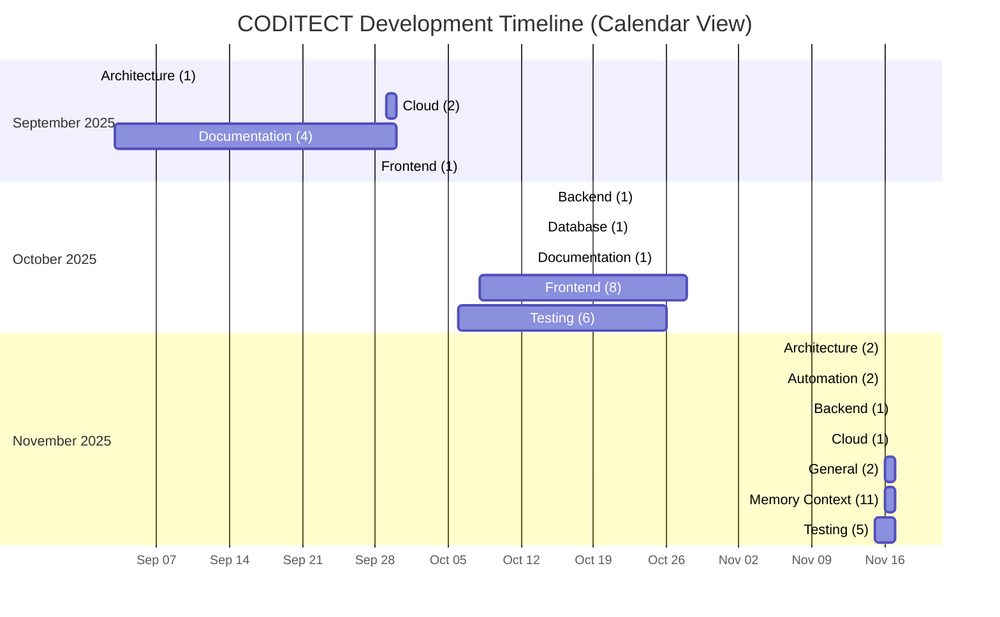

# CODITECT Development Timeline (Enhanced)

**Generated**: 2025-11-17T21:28:56.618038
**Total Unique Messages**: 1,601
**Total Checkpoints**: 49
**Completed Tasks Tracked**: 242

---

## 📊 Overview

This timeline organizes all development activity by:
- **Calendar dates** (Year → Month → Week → Day)
- **Focus areas** (Backend, Frontend, Cloud, etc.)
- **Completed tasks** extracted from checkpoint files
- **Message counts** from deduplicated conversation history

---

## 📅 Timeline Visualization

---

## 📆 Calendar Timeline

### 2025

#### September 2025

**Summary**: 8 checkpoints, 782 messages, 0 tasks completed

##### Week 36

###### Monday, September 01, 2025

**export-2025-09-01-EXPORT-ADRS-session5**
- **Focus**: Architecture
- **Phase**: Unknown
- **Messages**: 53
- **Source**: `submodules/Coditect-v5-multiple-LLM-IDE/docs/09-sessions/2025-09-01-EXPORT-ADRS-session5.txt`

###### Wednesday, September 03, 2025

**export-2025-09-03-EXPORT-DOCUMENT-DEV-3**
- **Focus**: Documentation
- **Phase**: Unknown
- **Messages**: 117
- **Source**: `submodules/Coditect-v5-multiple-LLM-IDE/docs/09-sessions/2025-09-03-EXPORT-DOCUMENT-DEV-3.txt`

**export-2025-09-03-EXPORT-SESSION8-QA-REVIEWER**
- **Focus**: Documentation
- **Phase**: Unknown
- **Messages**: 124
- **Source**: `submodules/Coditect-v5-multiple-LLM-IDE/docs/09-sessions/2025-09-03-EXPORT-SESSION8-QA-REVIEWER.txt`

##### Week 39

###### Sunday, September 28, 2025

**export-2025-09-28-EXPORT-FRONTEND-DEVELOPER-SESSION-2025-09-28-01**
- **Focus**: Frontend
- **Phase**: Unknown
- **Messages**: 1
- **Source**: `submodules/Coditect-v5-multiple-LLM-IDE/docs/09-sessions/2025-09-28-EXPORT-FRONTEND-DEVELOPER-SESSION-2025-09-28-01.txt`

##### Week 40

###### Monday, September 29, 2025

**export-2025-09-29-EXPORT-CLOUD-ARCHITECT-SESSION-2025-09-29-01**
- **Focus**: Cloud
- **Phase**: Unknown
- **Messages**: 3
- **Source**: `MEMORY-CONTEXT/test-dataset/exports/2025-09-29-EXPORT-CLOUD-ARCHITECT-SESSION-2025-09-29-01.txt`

**export-2025-09-29-EXPORT-ORCHESTRATOR-SESSION-2025-09-27**
- **Focus**: Documentation
- **Phase**: Unknown
- **Messages**: 290
- **Source**: `submodules/Coditect-v5-multiple-LLM-IDE/docs/09-sessions/2025-09-29-EXPORT-ORCHESTRATOR-SESSION-2025-09-27.txt`

###### Tuesday, September 30, 2025

**export-2025-09-30-EXPORT-CLOUD-ARCHITECT-2025-09-30-02**
- **Focus**: Cloud
- **Phase**: Unknown
- **Messages**: 120
- **Source**: `submodules/Coditect-v5-multiple-LLM-IDE/docs/09-sessions/2025-09-30-EXPORT-CLOUD-ARCHITECT-2025-09-30-02.txt`

**export-2025-09-30-EXPORT-FILE-MANAGEMENT-ORGANIZER-SESSION-2025-09-30-01**
- **Focus**: Documentation
- **Phase**: Unknown
- **Messages**: 74
- **Source**: `submodules/Coditect-v5-multiple-LLM-IDE/docs/09-sessions/2025-09-30-EXPORT-FILE-MANAGEMENT-ORGANIZER-SESSION-2025-09-30-01.txt`

#### October 2025

**Summary**: 17 checkpoints, 227 messages, 0 tasks completed

##### Week 41

###### Monday, October 06, 2025

**export-2025-10-06-02-EXPORT-LM-STUDIO-multiple-LLMS**
- **Focus**: Testing
- **Phase**: Unknown
- **Messages**: 1
- **Source**: `MEMORY-CONTEXT/test-dataset/exports/2025-10-06-02-EXPORT-LM-STUDIO-multiple-LLMS.txt`

###### Tuesday, October 07, 2025

**export-2025-10-07-EXPORT**
- **Focus**: Testing
- **Phase**: Unknown
- **Messages**: 6
- **Source**: `MEMORY-CONTEXT/test-dataset/exports/2025-10-07-EXPORT.txt`

###### Wednesday, October 08, 2025

**export-2025-10-08-EXPORT-Theia-BRANDING-ISSUES**
- **Focus**: Frontend
- **Phase**: Unknown
- **Messages**: 2
- **Source**: `MEMORY-CONTEXT/test-dataset/exports/2025-10-08-EXPORT-Theia-BRANDING-ISSUES.txt`

###### Saturday, October 11, 2025

**export-2025-10-11-EXPORT-KNOWLEDGEBASE-SESSION**
- **Focus**: Frontend
- **Phase**: Unknown
- **Messages**: 80
- **Source**: `submodules/Coditect-v5-multiple-LLM-IDE/docs/99-archive/obsolete-directories/theia-kb-extension/2025-10-11-EXPORT-KNOWLEDGEBASE-SESSION.txt`

###### Sunday, October 12, 2025

**export-2025-10-12-EXPORT-DOCKER-BUILD**
- **Focus**: Frontend
- **Phase**: Unknown
- **Messages**: 4
- **Source**: `MEMORY-CONTEXT/test-dataset/exports/2025-10-12-EXPORT-DOCKER-BUILD.txt`

**export-2025-10-12-EXPORT-DOT-CLAUDE-UPDATES**
- **Focus**: Testing
- **Phase**: Unknown
- **Messages**: 15
- **Source**: `MEMORY-CONTEXT/test-dataset/exports/2025-10-12-EXPORT-DOT-CLAUDE-UPDATES.txt`

**export-2025-10-12-EXPORT-FRONTEND-DOCKER-BUILD**
- **Focus**: Frontend
- **Phase**: Unknown
- **Messages**: 18
- **Source**: `MEMORY-CONTEXT/test-dataset/exports/2025-10-12-EXPORT-FRONTEND-DOCKER-BUILD.txt`

##### Week 42

###### Monday, October 13, 2025

**export-2025-10-13-EXPORT-DOCKER-V5-CODITECT-WRAPPER-PERSISTENCE**
- **Focus**: Documentation
- **Phase**: Unknown
- **Messages**: 1
- **Source**: `MEMORY-CONTEXT/test-dataset/exports/2025-10-13-EXPORT-DOCKER-V5-CODITECT-WRAPPER-PERSISTENCE.txt`

###### Tuesday, October 14, 2025

**export-2025-10-14-EXPORT-FOUNDATIONDB-SESSION**
- **Focus**: Database
- **Phase**: Unknown
- **Messages**: 6
- **Source**: `MEMORY-CONTEXT/test-dataset/exports/2025-10-14-EXPORT-FOUNDATIONDB-SESSION.txt`

**export-2025-10-14-EXPORT-SESSION-CONTEXT**
- **Focus**: Testing
- **Phase**: Unknown
- **Messages**: 28
- **Source**: `MEMORY-CONTEXT/test-dataset/exports/2025-10-14-EXPORT-SESSION-CONTEXT.txt`

**export-2025-10-14-EXPORT-SessionTabManager-FIX**
- **Focus**: Testing
- **Phase**: Unknown
- **Messages**: 5
- **Source**: `MEMORY-CONTEXT/test-dataset/exports/2025-10-14-EXPORT-SessionTabManager-FIX.txt`

###### Wednesday, October 15, 2025

**export-2025-10-15-EXPORT-BACKEND-BUILD-ERRORS**
- **Focus**: Backend
- **Phase**: Unknown
- **Messages**: 28
- **Source**: `submodules/Coditect-v5-multiple-LLM-IDE/docs/09-sessions/2025-10-15-EXPORT-BACKEND-BUILD-ERRORS.txt`

##### Week 43

###### Sunday, October 26, 2025

**export-2025-10-26-EXPORT-LATEST-CODITECT-YAML-PRE-PRODUCTION-CLOUD-BUILD**
- **Focus**: Frontend
- **Phase**: Unknown
- **Messages**: 4
- **Source**: `MEMORY-CONTEXT/test-dataset/exports/2025-10-26-EXPORT-LATEST-CODITECT-YAML-PRE-PRODUCTION-CLOUD-BUILD.txt`

**export-2025-10-26-EXPORT-PRE-PRODUCTION-PREPARATION**
- **Focus**: Testing
- **Phase**: Unknown
- **Messages**: 15
- **Source**: `MEMORY-CONTEXT/test-dataset/exports/2025-10-26-EXPORT-PRE-PRODUCTION-PREPARATION.txt`

##### Week 44

###### Monday, October 27, 2025

**export-2025-10-27-EXPORT-BUILD17-SESSION1**
- **Focus**: Frontend
- **Phase**: Unknown
- **Messages**: 4
- **Source**: `MEMORY-CONTEXT/test-dataset/exports/2025-10-27-EXPORT-BUILD17-SESSION1.txt`

**export-2025-10-27-EXPORT-BUILD17-SESSION2**
- **Focus**: Frontend
- **Phase**: Unknown
- **Messages**: 7
- **Source**: `submodules/Coditect-v5-multiple-LLM-IDE/docs/09-sessions/2025-10-27-EXPORT-BUILD17-SESSION2.txt`

###### Tuesday, October 28, 2025

**export-2025-10-28-EXPORT-CODITECT-BUILD-26**
- **Focus**: Frontend
- **Phase**: Unknown
- **Messages**: 3
- **Source**: `MEMORY-CONTEXT/test-dataset/exports/2025-10-28-EXPORT-CODITECT-BUILD-26.txt`

#### November 2025

**Summary**: 24 checkpoints, 592 messages, 0 tasks completed

##### Week 46

###### Saturday, November 15, 2025

**export-2025-10=20-EXPORT-SPRINT-2**
- **Focus**: Testing
- **Phase**: Unknown
- **Messages**: 18
- **Source**: `MEMORY-CONTEXT/test-dataset/exports/2025-10=20-EXPORT-SPRINT-2.txt`

###### Sunday, November 16, 2025

**export-2025-11-16T20:08:18Z-EXPORT-DAY6-NESTED-LEARNINGS**
- **Focus**: Testing
- **Phase**: Unknown
- **Messages**: 2
- **Source**: `MEMORY-CONTEXT/test-dataset/exports/2025-11-16T20:08:18Z-EXPORT-DAY6-NESTED-LEARNINGS.txt`

**export-2025-11-16-EXPORT-CODITECT-INSTALLER**
- **Focus**: Testing
- **Phase**: Unknown
- **Messages**: 1
- **Source**: `MEMORY-CONTEXT/test-dataset/exports/2025-11-16-EXPORT-CODITECT-INSTALLER.txt`

**checkpoint-2025-11-16T03-54-36Z-SPRINT-COMPLETE-ONBOARDING-SYSTEM**
- **Focus**: General
- **Phase**: Unknown
- **Messages**: 16
- **Source**: `CHECKPOINTS/2025-11-16T03-54-36Z-SPRINT-COMPLETE-ONBOARDING-SYSTEM.md`

**checkpoint-2025-11-16T08-34-53Z-DISTRIBUTED-INTELLIGENCE-ARCHITECTURE-COMPLETE**
- **Focus**: Architecture
- **Phase**: Unknown
- **Messages**: 17
- **Source**: `CHECKPOINTS/2025-11-16T08-34-53Z-DISTRIBUTED-INTELLIGENCE-ARCHITECTURE-COMPLETE.md`

**checkpoint-2025-11-16T09-05-16Z-Checkpoint-Automation-System-Implementation-Complete**
- **Focus**: Automation
- **Phase**: Unknown
- **Messages**: 12
- **Source**: `CHECKPOINTS/2025-11-16T09-05-16Z-Checkpoint-Automation-System-Implementation-Complete.md`

**checkpoint-2025-11-16T09-26-41Z-TASKLISTs-Updated-and-Checkpoint-Automation-System-Complete**
- **Focus**: Automation
- **Phase**: Unknown
- **Messages**: 4
- **Source**: `CHECKPOINTS/2025-11-16T09-26-41Z-TASKLISTs-Updated-and-Checkpoint-Automation-System-Complete.md`

**checkpoint-2025-11-16T09-56-08Z-Distributed-Intelligence-Architecture-Complete---All-Symlinks-Configured**
- **Focus**: Architecture
- **Phase**: Unknown
- **Messages**: 4
- **Source**: `CHECKPOINTS/2025-11-16T09-56-08Z-Distributed-Intelligence-Architecture-Complete---All-Symlinks-Configured.md`

**export-2025-11-16-EXPORT-CHECKPOINT**
- **Focus**: Memory Context
- **Phase**: Unknown
- **Messages**: 37
- **Source**: `MEMORY-CONTEXT/2025-11-16-EXPORT-CHECKPOINT.txt`

##### Week 47

###### Monday, November 17, 2025

**2025-11-17-Week 1 Day 2 - Deduplication System Complete**
- **Focus**: Memory Context
- **Phase**: Week 1
- **Messages**: 134
- **Source**: ``

**2025-11-17-incremental-test**
- **Focus**: Testing
- **Phase**: Unknown
- **Messages**: 13
- **Source**: ``

**2025-11-17-MASTER3-incremental-test**
- **Focus**: Testing
- **Phase**: Unknown
- **Messages**: 35
- **Source**: ``

**export-2025-11-17-EXPORT-PROJECTS-coditect-rollout-master**
- **Focus**: Memory Context
- **Phase**: Unknown
- **Messages**: 13
- **Source**: ``

**export-2025-11-17-EXPORT-PROJECTS-coditect-rollout-master-2**
- **Focus**: Memory Context
- **Phase**: Unknown
- **Messages**: 82
- **Source**: ``

**export-2025-11-17-EXPORT-MEMORY-CONTEXT-DOT-CODITECT**
- **Focus**: Memory Context
- **Phase**: Unknown
- **Messages**: 5
- **Source**: `MEMORY-CONTEXT/2025-11-17-EXPORT-MEMORY-CONTEXT-DOT-CODITECT.txt`

**export-2025-11-17-EXPORT-ROLLOUT-MASTER**
- **Focus**: Memory Context
- **Phase**: Unknown
- **Messages**: 2
- **Source**: `MEMORY-CONTEXT/exports/2025-11-17-EXPORT-ROLLOUT-MASTER.txt`

**checkpoint-2025-11-17T10-21-00Z-Week-1-Phase-1-Complete**
- **Focus**: General
- **Phase**: Unknown
- **Messages**: 13
- **Source**: `CHECKPOINTS/2025-11-17T10-21-00Z-Week-1-Phase-1-Complete.md`

**checkpoint-2025-11-17T09-30-00Z-CONVERSATION-DEDUP-WEEK1-DAY1-COMPLETE**
- **Focus**: Memory Context
- **Phase**: Unknown
- **Messages**: 16
- **Source**: `CHECKPOINTS/2025-11-17T09-30-00Z-CONVERSATION-DEDUP-WEEK1-DAY1-COMPLETE.md`

**checkpoint-2025-11-17T15-30-00Z-Week-1-Phase-2.1-Cloud-SQL-Deployed**
- **Focus**: Cloud
- **Phase**: Unknown
- **Messages**: 19
- **Source**: `CHECKPOINTS/2025-11-17T15-30-00Z-Week-1-Phase-2.1-Cloud-SQL-Deployed.md`

**checkpoint-2025-11-17T23-00-00Z-Week-1-Backend-Implementation-Complete**
- **Focus**: Backend
- **Phase**: Unknown
- **Messages**: 21
- **Source**: `CHECKPOINTS/2025-11-17T23-00-00Z-Week-1-Backend-Implementation-Complete.md`

**export-2025-11-17-EXPORT-MASTER**
- **Focus**: Memory Context
- **Phase**: Unknown
- **Messages**: 85
- **Source**: `MEMORY-CONTEXT/2025-11-17-EXPORT-MASTER.txt`

**export-2025-11-17-EXPORT-MASTER2**
- **Focus**: Memory Context
- **Phase**: Unknown
- **Messages**: 9
- **Source**: `MEMORY-CONTEXT/2025-11-17-EXPORT-MASTER2.txt`

**export-2025-11-17-EXPORT-MASTER3**
- **Focus**: Memory Context
- **Phase**: Unknown
- **Messages**: 17
- **Source**: `MEMORY-CONTEXT/2025-11-17-EXPORT-MASTER3.txt`

**export-2025-11-17-EXPORT-PROJECTS-coditect-rollout-master-2117ET**
- **Focus**: Memory Context
- **Phase**: Unknown
- **Messages**: 17
- **Source**: `2025-11-17-EXPORT-PROJECTS-coditect-rollout-master-2117ET.txt`

---

## 📈 Statistics

### By Focus Area

| Focus Area | Checkpoints | Messages | Tasks |
|------------|-------------|----------|-------|
| Documentation | 5 | 606 | 0 |
| Memory Context | 11 | 417 | 0 |
| Cloud | 3 | 142 | 0 |
| Testing | 11 | 139 | 0 |
| Frontend | 9 | 123 | 0 |
| Architecture | 3 | 74 | 0 |
| Backend | 2 | 49 | 0 |
| General | 2 | 29 | 0 |
| Automation | 2 | 16 | 0 |
| Database | 1 | 6 | 0 |

---

## 🔗 Integration

### Linked Resources

**Project Plans:**
- [Master Orchestration Plan](CODITECT-MASTER-ORCHESTRATION-PLAN.md)
- [Cloud Platform Project Plan](CODITECT-CLOUD-PLATFORM-PROJECT-PLAN.md)
- [Rollout Master Plan](CODITECT-ROLLOUT-MASTER-PLAN.md)

**Tasklists:**
- Individual submodule `TASKLIST.md` files
- `CHECKPOINTS/` directory for phase summaries

**Raw Data:**
- [Interactive HTML Timeline](PROJECT-TIMELINE-INTERACTIVE.html)
- [JSON Data Export](PROJECT-TIMELINE-DATA.json)
- [Deduplication Database](../MEMORY-CONTEXT/dedup_state/)

---

**Last Updated**: 2025-11-17T21:28:56.626830