# ADR: CODITECT Export-Dedup System Architecture

**Status:** Implemented
**Date:** 2025-11-24
**Author:** AZ1.AI INC (Hal Casteel)
**Framework:** CODITECT v1.0

---

## Executive Summary

The CODITECT Export-Dedup System is a comprehensive, fully-automated workflow that processes Claude Code session exports, deduplicates messages using SHA-256 hashing, creates checkpoints, organizes messages by checkpoint, maintains dashboard indexes, and commits all changes to git across the master repository and all 45+ submodules.

**Key Capabilities:**
- 100% automated from export to git push
- SHA-256 deduplication with collision detection
- Rolling log with 5000-line limit
- Comprehensive git staging with critical file verification
- Dashboard indexing (MANIFEST.json files)
- Multi-repository commit/push automation
- Complete audit trail with step-by-step logging

---

## Table of Contents

1. [System Overview](#system-overview)
2. [Complete Architecture](#complete-architecture)
3. [Script Inventory](#script-inventory)
4. [Function Catalog](#function-catalog)
5. [Workflow Execution Flow](#workflow-execution-flow)
6. [Logging Architecture](#logging-architecture)
7. [Dashboard Indexing](#dashboard-indexing)
8. [Git Automation](#git-automation)
9. [Data Structures](#data-structures)
10. [Verification & Audit](#verification--audit)
11. [Error Handling](#error-handling)
12. [Decision Rationale](#decision-rationale)

---

## 1. System Overview

### Purpose

The Export-Dedup System ensures:
1. **No duplicate messages** are stored across sessions
2. **Complete checkpoint history** is maintained
3. **Dashboard indexes** are always current (MANIFEST.json)
4. **All git repositories** (master + 45 submodules) are committed and pushed
5. **Complete audit trail** exists for verification

### Key Design Principles

1. **Comprehensive Logging** - Every operation logged with success/error status
2. **Atomic Operations** - Temp files + rename for safe writes
3. **Critical Path Verification** - Explicit checks for dashboard dependencies
4. **Graceful Degradation** - Fallbacks when optional components unavailable
5. **Idempotency** - Safe to re-run without data corruption

---

## 2. Complete Architecture

### System Diagram


---

## 3. Script Inventory

### 3.1 Main Scripts

| Script | Location | Lines | Purpose | Git Operations |
|--------|----------|-------|---------|----------------|
| **export-dedup.py** | `scripts/` | 950+ | Main orchestrator for entire workflow | None (calls create-checkpoint.py) |
| **create-checkpoint.py** | `scripts/` | 1200+ | Creates checkpoints, commits to git | **git add, git commit, git push** |
| **message_deduplicator.py** | `scripts/core/` | 800+ | SHA-256 deduplication engine | None |

### 3.2 Utility Modules (NEW - 2025-11-24)

| Module | Location | Lines | Purpose |
|--------|----------|-------|---------|
| **rolling_log_handler.py** | `scripts/core/` | 238 | Rolling log with 5000-line limit |
| **git_staging_manager.py** | `scripts/core/` | 402 | Comprehensive git staging + verification |
| **git_repository_scanner.py** | `scripts/core/` | 340 | Discovers all git repos under PROJECTS/ |

### 3.3 Supporting Scripts

| Script | Location | Purpose |
|--------|----------|---------|
| **checkpoint-with-submodules.py** | `scripts/` | Multi-submodule git automation |
| **coditect-git-helper.py** | `scripts/` | Git utility functions |

---

## 4. Function Catalog

### 4.1 export-dedup.py Functions

#### Setup & Configuration

```python
def setup_logging(log_dir: Path) -> logging.Logger
```
**Purpose:** Initialize rolling log handler with 5000-line limit
**Calls:** `setup_rolling_logger()` from rolling_log_handler.py
**Returns:** Logger instance with file + console handlers
**Log Output:** "Rolling log initialized: {log_file} (max 5000 lines)"

#### Logging Helpers

```python
def log_step_start(step_num: int, step_name: str, logger: logging.Logger) -> datetime
```
**Purpose:** Mark beginning of workflow step with timestamp
**Returns:** Start time for duration calculation
**Log Output:**
```
============================================================
Step {step_num}: {step_name}
============================================================
```

```python
def log_step_success(step_num: int, step_name: str, start_time: datetime, logger: logging.Logger) -> None
```
**Purpose:** Mark successful step completion with duration
**Log Output:** `✅ Step {step_num} complete: {step_name} ({duration}s)`

```python
def log_step_error(step_num: int, step_name: str, error: Exception, logger: logging.Logger) -> None
```
**Purpose:** Log step failure with error details
**Log Output:**
```
❌ Step {step_num} failed: {step_name}
   Error: {error_message}
```

```python
def log_checkpoint(message: str, logger: logging.Logger) -> None
```
**Purpose:** Log verification checkpoint (DEBUG level)
**Log Output:** `✓ CHECKPOINT: {message}`

```python
def log_verification_success(what: str, details: str, logger: logging.Logger) -> None
```
**Purpose:** Log successful verification
**Log Output:**
```
  ✓ Verified: {what}
     Details: {details}
```

```python
def log_verification_failure(what: str, details: str, logger: logging.Logger) -> None
```
**Purpose:** Log verification failure
**Log Output:**
```
  ✗ Verification failed: {what}
     Details: {details}
```

#### Environment Validation

```python
def validate_environment(repo_root: Path, memory_context_dir: Path, logger: logging.Logger) -> None
```
**Purpose:** Pre-flight checks before operations start
**Validates:**
- Disk space (≥100MB free)
- Write permissions to MEMORY-CONTEXT
- Dedup state directory structure
- Required files exist

**Log Output:**
```
✓ CHECKPOINT: Starting environment validation
  ✓ Verified: Disk space
     Details: {free_mb}MB available
  ✓ Verified: Write permissions
     Details: MEMORY-CONTEXT is writable
  ✓ Verified: Dedup state
     Details: Directory structure valid
✓ CHECKPOINT: Environment validation complete
```

#### File Operations

```python
def compute_file_checksum(filepath: Path) -> str
```
**Purpose:** Compute SHA-256 checksum for file integrity
**Returns:** Hex digest of file contents
**Log Output:**
```
✓ CHECKPOINT: Computing checksum for {filename}
✓ CHECKPOINT: Checksum computed: {checksum[:16]}...
```

```python
def create_backup(filepath: Path, logger: logging.Logger) -> Path
```
**Purpose:** Create timestamped backup with verification
**Returns:** Path to backup file
**Verifies:** File size matches original
**Log Output:**
```
✓ CHECKPOINT: Creating backup of {filename}
✓ CHECKPOINT: Original file size: {size} bytes
✓ CHECKPOINT: Backup file created: {backup_name}
  ✓ Verified: Backup created
     Details: {backup_name} ({size} bytes)
```

```python
def atomic_write(filepath: Path, content: str, logger: logging.Logger) -> None
```
**Purpose:** Safely write file using temp + rename pattern
**Process:** temp file → write → verify → atomic rename
**Verifies:** Temp file size before rename
**Log Output:**
```
✓ CHECKPOINT: Atomically writing {filename} ({size} bytes)
✓ CHECKPOINT: Created temp file: {temp_name}
✓ CHECKPOINT: Content written to temp file
✓ CHECKPOINT: Temp file size: {size} bytes
✓ CHECKPOINT: Atomic rename complete: {temp_name} → {filename}
  ✓ Verified: Atomic write
     Details: {filename} ({size} bytes)
```

```python
def verify_data_integrity(
    original_checksum: str,
    processed_file: Path,
    logger: logging.Logger
) -> None
```
**Purpose:** Comprehensive integrity verification after processing
**Checks:**
- File exists
- File not empty
- File readable (first + last byte)
- Checksum computation succeeds

**Log Output:**
```
✓ CHECKPOINT: Verifying data integrity for {filename}
✓ CHECKPOINT: File exists
✓ CHECKPOINT: File size: {size} bytes
✓ CHECKPOINT: Processed checksum: {checksum[:16]}...
  ✓ Verified: Data integrity
     Details: {filename} valid ({size} bytes)
```

#### Export File Discovery

```python
def find_all_exports(repo_root: Path, memory_context_dir: Path, logger: logging.Logger) -> list
```
**Purpose:** Multi-location recursive search for export files
**Search Locations:**
- Repo root (shallow)
- MEMORY-CONTEXT (shallow)
- Current working directory (recursive)
- All submodules (recursive)
- ~/Downloads (last 24h)
- ~/Desktop (last 24h)
- /tmp (last 24h)

**Excludes:**
- exports-archive (already processed)
- .git directories
- node_modules, venv, __pycache__
- build, dist directories

**Returns:** List of export file paths (sorted newest first)
**Log Output:**
```
  Searching for export files...
  • Found: {filename} ({age}) in {location}
  • Found: {filename} ({age}) in {location}
  Total: {count} export files found
```

```python
def find_latest_export(repo_root: Path, memory_context_dir: Path, logger: logging.Logger) -> Optional[Path]
```
**Purpose:** Find most recent export file
**Returns:** Path to latest export or None
**Log Output:** `Latest export: {filename} ({age})`

#### Archive Management

```python
def archive_export(export_file: Path, archive_dir: Path, logger: logging.Logger) -> Path
```
**Purpose:** Move processed export to archive with collision handling
**Collision Strategy:** Append timestamp suffix if file exists
**Verifies:** Archive successful before deleting source
**Log Output:**
```
  Archiving: {filename}
  Destination: {archive_path}
✓ Archived successfully
```

#### Main Workflow

```python
def run_export_dedup(
    description: str = None,
    checkpoint_only: bool = False,
    auto_compact: bool = False,
    yes: bool = False,
    archive: bool = True,
    logger: Optional[logging.Logger] = None
) -> int
```
**Purpose:** Main orchestrator executing all workflow steps
**Parameters:**
- `description`: Checkpoint description (prompt if None)
- `checkpoint_only`: Skip deduplication step
- `auto_compact`: Prompt for /compact after completion
- `yes`: Auto-accept prompts (non-interactive)
- `archive`: Move exports to archive
- `logger`: Logger instance (create if None)

**Returns:** Exit code (0=success, 1=error, 130=interrupted)

**Workflow Steps:**
1. **Step 0: Environment Validation** (validate_environment)
2. **Step 1: Find Export Files** (find_all_exports)
3. **Step 2: Deduplicate Messages** (MessageDeduplicator.process_export)
4. **Step 3: Archive Exports** (archive_export)
5. **Step 4: Create Checkpoint** (subprocess: create-checkpoint.py)
6. **Step 5: Organize by Checkpoint** (automatic via deduplicator)
7. **Step 6: Update Consolidated Backup** (automatic)
8. **Step 7: Update Dashboard Indexes** (MANIFEST.json updates)
9. **Step 8: Git Operations** (via create-checkpoint.py)

**Log Output for Each Step:**
```
============================================================
Step {N}: {Step Name}
============================================================
[Step-specific log messages]
✅ Step {N} complete: {Step Name} ({duration}s)
```

---

### 4.2 create-checkpoint.py Functions

#### Git Operations

```python
def commit_changes(self, checkpoint_filename: str, sprint_description: str) -> None
```
**Purpose:** Comprehensive git staging and commit with all files
**Process:**
1. Initialize GitStagingManager
2. Stage ALL modified/untracked/deleted files
3. Verify critical files (MANIFEST.json, checkpoint_index.json, etc.)
4. Recover any missing critical files
5. Create commit with checkpoint message
6. Log complete file list

**Calls:** `GitStagingManager.stage_all_changes(include_untracked=True)`

**Git Commands:**
```bash
git add -u                              # Stage all tracked changes
git add <file>                          # Stage each untracked file
git add <critical_path>                 # Recover missing critical files
git diff --name-only --cached           # Final verification
git commit -m "..."                     # Create commit
```

**Log Output:**
```
Using comprehensive git staging manager...
============================================================
Starting comprehensive git staging
============================================================
✓ Detected {n} modified, {m} untracked, {p} deleted files
  Modified: {file1}, {file2}, ...
  Untracked: {file3}, {file4}, ...
============================================================
Staging modified and deleted files
============================================================
Running: git add -u
✓ Staged {n} tracked file changes
  ✓ Staged (modified): {file}
  ✓ Staged (deleted): {file}
============================================================
Staging untracked files
============================================================
  ✓ Staged (untracked): {file}
✓ Staged {m} untracked files
============================================================
Verifying critical files are staged
============================================================
✓ All critical files verified staged
============================================================
Final staging verification
============================================================
✓ Git reports {total} files staged
============================================================
Git Staging Summary
============================================================
Status: ✅ SUCCESS
Files staged: {count}
Files skipped: {count}
Errors: {count}
```

```python
def push_changes(self) -> None
```
**Purpose:** Push commits to remote with parent repo handling
**Process:**
1. Detect if in submodule
2. Push current repository
3. If submodule: update parent repo pointer, commit, push parent

**Git Commands:**
```bash
git push                                 # Push current repo
cd ../..                                 # Navigate to parent
git add <submodule_path>                 # Update submodule pointer
git commit -m "Update submodule: ..."    # Commit pointer update
git push                                 # Push parent repo
```

**Log Output:**
```
Pushing changes to remote...
✓ Pushed to remote successfully

[If submodule]
Detected submodule: updating parent repository
  Updating submodule pointer in parent repo
  ✓ Parent repository updated
  ✓ Pushed parent repository
```

---

### 4.3 MessageDeduplicator Functions (message_deduplicator.py)

```python
def process_export(self, export_data: dict, checkpoint_id: str) -> Tuple[List[dict], dict]
```
**Purpose:** Deduplicate messages using SHA-256 hashing
**Process:**
1. Parse export JSON
2. For each message:
   - Compute SHA-256 hash
   - Check against global hash table
   - If new: add to unique messages
   - If duplicate: filter out
3. Update global_hashes.json
4. Update unique_messages.jsonl
5. Update checkpoint_index.json

**Returns:** (new_messages, stats)

**Stats Dictionary:**
```python
{
    'total_messages': int,
    'new_unique': int,
    'duplicates_filtered': int,
    'dedup_rate': float,
    'global_unique_count': int
}
```

**Log Output:**
```
Processing export: {filename}
  Total messages: {total}
  Computing hashes...
  Checking global hash table...
  New unique messages: {new}
  Duplicates filtered: {dups}
  Deduplication rate: {rate}%
  Global unique count: {count}
```

```python
def compute_message_hash(self, message: dict) -> str
```
**Purpose:** Compute SHA-256 hash of message content
**Includes:** role, content, timestamp
**Excludes:** Metadata that may vary
**Returns:** Hex digest (64 characters)

```python
def update_checkpoint_index(self, checkpoint_id: str, stats: dict) -> None
```
**Purpose:** Maintain checkpoint → message count mapping
**File:** `MEMORY-CONTEXT/dedup_state/checkpoint_index.json`
**Structure:**
```json
{
  "2025-11-24-Description": {
    "total_messages": 150,
    "new_unique": 75,
    "duplicates_filtered": 75,
    "dedup_rate": 50.0,
    "timestamp": "2025-11-24T16:33:00Z"
  }
}
```

---

### 4.4 GitStagingManager Functions (git_staging_manager.py)

```python
def get_modified_files(self) -> Tuple[Set[str], Set[str], Set[str]]
```
**Purpose:** Detect ALL file changes using git status
**Git Command:** `git status --porcelain`
**Returns:** (modified_files, untracked_files, deleted_files)
**Log Output:**
```
Detecting modified files with git status
✓ Detected {n} modified, {m} untracked, {p} deleted files
  Modified: {file1}, {file2}, ...
  Untracked: {file3}, {file4}, ...
  Deleted: {file5}, {file6}, ...
```

```python
def verify_critical_files_staged(self, staged_files: Set[str]) -> List[str]
```
**Purpose:** Ensure critical files not missed during staging
**Critical Paths:**
- `MEMORY-CONTEXT/checkpoints/`
- `MEMORY-CONTEXT/dedup_state/checkpoint_index.json`
- `MEMORY-CONTEXT/messages/MANIFEST.json` (dashboard)
- `MEMORY-CONTEXT/messages/by-checkpoint/MANIFEST.json` (dashboard)
- `MEMORY-CONTEXT/dedup_state/global_hashes.json`
- `MEMORY-CONTEXT/dedup_state/unique_messages.jsonl`
- `MEMORY-CONTEXT/messages/`
- `MEMORY-CONTEXT/sessions/`
- `MEMORY-CONTEXT/backups/`
- `README.md`
- `CLAUDE.md`
- `.coditect/`

**Process:**
1. Check if each critical path in staged files
2. If missing: check if file actually modified
3. If modified but not staged: add to missing list

**Returns:** List of missing critical files
**Log Output:**
```
Verifying critical files are staged
⚠️  Critical file modified but not staged: {path}
✓ All critical files verified staged
```

```python
def stage_all_changes(self, include_untracked: bool = True) -> GitStagingResult
```
**Purpose:** Comprehensive git staging with verification
**Process:**
1. Detect all modified/untracked/deleted files
2. Stage tracked files: `git add -u`
3. Stage untracked files individually
4. Verify critical files
5. Recover missing critical files
6. Final verification: `git diff --cached`

**Returns:** GitStagingResult dataclass
**Log Output:** See commit_changes() log output above

---

### 4.5 GitRepositoryScanner Functions (git_repository_scanner.py)

```python
def find_all_repositories(self) -> List[GitRepository]
```
**Purpose:** Recursively discover ALL git repositories
**Search:** `root_path.rglob('.git')`
**Process:**
1. Find all .git directories
2. Skip .git files (submodule pointers)
3. Analyze each repository
4. Deduplicate by resolved path
5. Sort by path

**Returns:** List of GitRepository objects
**Log Output:**
```
============================================================
Scanning for git repositories under: {root_path}
============================================================
Found repo: {name} at {path}
Found repo: {name} at {path}
✓ Found {count} git repositories

============================================================
Repository Summary
============================================================
Master repositories: {count}
Submodules: {count}
Repositories with changes: {count}

============================================================
Repositories with Uncommitted Changes
============================================================

📦 {repo_name}
   Path: {path}
   Branch: {branch}
   Type: Master / Submodule
   Modified files: {count}
     • {file}
   Untracked files: {count}
     • {file}
```

```python
def _analyze_repository(self, repo_path: Path) -> Optional[GitRepository]
```
**Purpose:** Get detailed status of single repository
**Analyzes:**
- Repository name
- Is submodule? (check .git file, .gitmodules)
- Current branch: `git rev-parse --abbrev-ref HEAD`
- Modified/untracked files: `git status --porcelain`

**Returns:** GitRepository dataclass or None

---

### 4.6 RollingLineFileHandler Functions (rolling_log_handler.py)

```python
def emit(self, record)
```
**Purpose:** Write log record and trigger trim if needed
**Process:**
1. Write record using parent FileHandler
2. Increment line count
3. If line_count > max_lines: trigger trim

**Log Output:** (Standard logging format)

```python
def _trim_old_lines(self)
```
**Purpose:** Remove oldest lines when limit exceeded
**Process:**
1. Flush and close file handle
2. Read all lines
3. Keep most recent 80% (4000 of 5000)
4. Add trim marker at top
5. Write back
6. Reopen file handle

**Trim Marker:**
```
================================================================================
[LOG TRIMMED - Removed {n} oldest lines]
[Keeping most recent {kept} of {total} total lines]
[Max capacity: 5000 lines]
================================================================================
```

```python
def setup_rolling_logger(
    log_file: Path,
    logger_name: str = "export_dedup",
    max_lines: int = 5000,
    console_level: int = logging.INFO,
    file_level: int = logging.DEBUG
) -> logging.Logger
```
**Purpose:** Initialize logger with rolling file handler
**Creates:**
- RollingLineFileHandler (file output, DEBUG level)
- StreamHandler (console output, INFO level)

**Returns:** Configured logger instance

---

## 5. Workflow Execution Flow

### 5.1 Complete Execution Sequence

```mermaid
sequenceDiagram
    actor User
    participant Export as export-dedup.py
    participant Log as RollingLogHandler
    participant Dedup as MessageDeduplicator
    participant Check as create-checkpoint.py
    participant Stage as GitStagingManager
    participant Git as Git Commands

    User->>Export: python3 export-dedup.py "Description"
    Export->>Log: Initialize rolling log (5000 lines)
    Log-->>Export: Logger instance

    rect rgb(200, 220, 255)
        Note over Export: Step 0: Environment Validation
        Export->>Export: validate_environment()
        Export->>Log: ✓ Disk space: 1024MB
        Export->>Log: ✓ Write permissions OK
        Export->>Log: ✓ Dedup state valid
    end

    rect rgb(255, 220, 200)
        Note over Export: Step 1: Find Export Files
        Export->>Export: find_all_exports()
        Export->>Log: Searching: repo root, MEMORY-CONTEXT, submodules...
        Export->>Log: ✓ Found 3 export files
        Export->>Log: → [2m] export-2025-11-24.txt (repo root)
    end

    rect rgb(220, 255, 200)
        Note over Export,Dedup: Step 2: Deduplicate Messages
        Export->>Dedup: process_export(export_data, checkpoint_id)
        Dedup->>Dedup: Parse JSON export

        loop Each message in export
            Dedup->>Dedup: compute_message_hash(message)
            Dedup->>Dedup: Check global_hashes.json
            alt New message
                Dedup->>Dedup: Add to unique_messages.jsonl
                Dedup->>Dedup: Update global_hashes.json
            else Duplicate
                Dedup->>Dedup: Filter out
            end
        end

        Dedup->>Dedup: Update checkpoint_index.json
        Dedup-->>Export: (new_messages, stats)
        Export->>Log: Total: 150, New: 75, Dupes: 75 (50% dedup)
    end

    rect rgb(255, 255, 200)
        Note over Export: Step 3: Archive Exports
        Export->>Export: archive_export(export_file)
        Export->>Log: ✓ Archived: export-2025-11-24.txt
    end

    rect rgb(220, 220, 255)
        Note over Export,Check: Step 4: Create Checkpoint
        Export->>Check: subprocess: create-checkpoint.py --auto-commit

        Check->>Check: Generate checkpoint document
        Check->>Check: Update README.md
        Check->>Log: Checkpoint: CHECKPOINT-2025-11-24-Description.md

        rect rgb(200, 200, 255)
            Note over Check,Stage: Git Staging Phase
            Check->>Stage: GitStagingManager.stage_all_changes()

            Stage->>Git: git status --porcelain
            Git-->>Stage: M file1\n M file2\n?? file3
            Stage->>Log: ✓ Detected 2 modified, 1 untracked, 0 deleted

            Stage->>Git: git add -u
            Git-->>Stage: (success)
            Stage->>Log: ✓ Staged 2 tracked file changes

            Stage->>Git: git add file3
            Git-->>Stage: (success)
            Stage->>Log: ✓ Staged (untracked): file3

            Stage->>Stage: verify_critical_files_staged()
            Stage->>Log: Verifying critical files...

            alt Critical file missing
                Stage->>Git: git add MEMORY-CONTEXT/messages/MANIFEST.json
                Git-->>Stage: (success)
                Stage->>Log: ✓ Recovered and staged: MANIFEST.json
            end

            Stage->>Git: git diff --name-only --cached
            Git-->>Stage: file1\nfile2\nfile3\nMANIFEST.json
            Stage->>Log: ✓ Git reports 4 files staged

            Stage->>Log: ✅ SUCCESS: 4 staged, 0 skipped, 0 errors
            Stage-->>Check: GitStagingResult(success=True)
        end

        Check->>Git: git commit -m "Create checkpoint: Description"
        Git-->>Check: (success)
        Check->>Log: ✓ Committed checkpoint to git

        Check->>Git: git push
        Git-->>Check: (success)
        Check->>Log: ✓ Pushed to remote

        Check-->>Export: (return 0)
        Export->>Log: ✓ Checkpoint created successfully
    end

    rect rgb(255, 220, 255)
        Note over Export: Step 5-7: Organize & Index
        Export->>Export: Organize messages by checkpoint
        Export->>Export: Update consolidated backup
        Export->>Export: Update MANIFEST.json files
        Export->>Log: ✓ Dashboard indexes updated
    end

    Export->>Log: ✅ Export, dedup, organization complete!
    Export-->>User: Exit code 0 (success)
```



### 5.2 Step-by-Step Narrative

#### Step 0: Environment Validation

**Function:** `validate_environment()`
**Purpose:** Pre-flight checks to prevent failures mid-execution

**Checks:**
1. **Disk Space**: Verify ≥100MB free
   - Uses: `shutil.disk_usage()`
   - Logs: `✓ Verified: Disk space - {free_mb}MB available`
   - Fails: If <100MB free

2. **Write Permissions**: Test write access to MEMORY-CONTEXT
   - Creates: `.write-test` file
   - Deletes: Test file after verification
   - Logs: `✓ Verified: Write permissions - MEMORY-CONTEXT is writable`
   - Fails: If cannot write

3. **Dedup State Structure**: Verify required directories exist
   - Checks: `dedup_state/` directory
   - Warns: If missing files (creates on first run)
   - Logs: `✓ Verified: Dedup state - Directory structure valid`

**Log Example:**
```
✓ CHECKPOINT: Starting environment validation
  ✓ Verified: Disk space
     Details: 15234.5MB available
  ✓ Verified: Write permissions
     Details: MEMORY-CONTEXT is writable
  ✓ Verified: Dedup state
     Details: Directory structure valid
✓ CHECKPOINT: Environment validation complete
```

#### Step 1: Find Export Files

**Function:** `find_all_exports()`
**Purpose:** Locate all unprocessed export files

**Search Strategy:**
1. **Repo Root** (shallow scan)
   - Pattern: `*EXPORT*.txt`
   - Age: Any
   - Log: `Searching repo root: {repo_root}`

2. **MEMORY-CONTEXT** (shallow scan)
   - Pattern: `*EXPORT*.txt`, `*export*.txt`
   - Excludes: `exports-archive/`
   - Log: `Searching MEMORY-CONTEXT: {memory_context_dir}`

3. **Current Working Directory** (recursive)
   - Pattern: `*EXPORT*.txt`
   - Max depth: 5 levels
   - Log: `Searching current directory: {cwd}`

4. **Submodules** (recursive)
   - All directories under `submodules/`
   - Pattern: `*EXPORT*.txt`
   - Log: `Searching submodules (recursive)`

5. **Common Temp Locations**
   - `~/Downloads` (last 24h only)
   - `~/Desktop` (last 24h only)
   - `/tmp` (last 24h only)
   - Log: `Searching common temp locations`

**Deduplication:**
- Uses: `(st_dev, st_ino)` tuple for inode-based dedup
- Handles: Symlinks, hardlinks correctly

**Sorting:**
- Orders: Newest first (by mtime)
- Returns: List of Path objects

**Log Example:**
```
============================================================
Step 1: Finding Export Files
============================================================
  Searching:
    • Repo root: /Users/user/PROJECTS/coditect-rollout-master
    • MEMORY-CONTEXT: /Users/user/PROJECTS/.../MEMORY-CONTEXT
    • Current directory: /Users/user/PROJECTS/...
    • Submodules (recursive)
    • Common temp locations

✓ Found 3 export file(s)

  → [2m] 2025-11-24-EXPORT-SESSION.txt
     Location: repo root
    [5m] 2025-11-23-EXPORT-SESSION.txt
     Location: MEMORY-CONTEXT
    [1h] 2025-11-22-EXPORT-SESSION.txt
     Location: submodules/core/coditect-core

✓ Recent export (< 5 min old)
```

#### Step 2: Deduplicate Messages

**Function:** `MessageDeduplicator.process_export()`
**Purpose:** Filter duplicate messages using SHA-256 hashing

**Process:**

1. **Parse Export JSON**
   - Read: Export file
   - Parse: JSON structure
   - Extract: Messages array
   - Log: `Processing export: {filename}`

2. **Hash Each Message**
   - Compute: SHA-256 hash of (role + content + timestamp)
   - Format: Hex digest (64 characters)
   - Log: `Computing hashes for {count} messages...`

3. **Check Global Hash Table**
   - Load: `global_hashes.json` (hash → checkpoint mapping)
   - Check: Each message hash against table
   - Log: `Checking global hash table...`

4. **Classify Messages**
   - **New Unique**: Hash not in table
     - Add to: `unique_messages.jsonl`
     - Update: `global_hashes.json`
     - Log: `New unique message: {hash[:16]}...`

   - **Duplicate**: Hash already in table
     - Filter: Do not add to unique messages
     - Log: `Duplicate filtered: {hash[:16]}... (from {checkpoint})`

5. **Update Indexes**
   - `global_hashes.json`: Add new hash → checkpoint mappings
   - `unique_messages.jsonl`: Append new unique messages
   - `checkpoint_index.json`: Update checkpoint statistics

**Log Example:**
```
============================================================
Step 2: Deduplicating Messages
============================================================

  Processing 1/3: 2025-11-24-EXPORT-SESSION.txt

✓ CHECKPOINT: Creating backup of export file
✓ CHECKPOINT: Backup file created: 2025-11-24-EXPORT-SESSION.txt.backup-20251124-163300
  ✓ Verified: Backup created
     Details: 2025-11-24-EXPORT-SESSION.txt.backup-20251124-163300 (45678 bytes)

  Parsing export file...
  Total messages in export: 150
  Computing message hashes...
  Checking global hash table...

  Processing messages:
    New unique: 75
    Duplicates filtered: 75
    Deduplication rate: 50.0%

  Updating dedup state...
  ✓ Updated: global_hashes.json
  ✓ Updated: unique_messages.jsonl
  ✓ Updated: checkpoint_index.json

  📊 Deduplication Summary:
    Total messages: 150
    New unique: 75
    Duplicates filtered: 75
    Dedup rate: 50.0%
    Global unique count: 7,507

✅ Step 2 complete: Deduplicating Messages (2.34s)
```

#### Step 3: Archive Exports

**Function:** `archive_export()`
**Purpose:** Move processed exports to archive directory

**Process:**

1. **Prepare Archive Path**
   - Destination: `MEMORY-CONTEXT/exports-archive/`
   - Filename: Original name preserved
   - Log: `Archiving: {filename}`

2. **Handle Collisions**
   - If exists: Append timestamp suffix
   - Format: `{name}.{timestamp}{ext}`
   - Log: `Collision detected, using: {new_name}`

3. **Move File**
   - Uses: `shutil.move()` for atomic operation
   - Verifies: File exists at destination
   - Log: `✓ Archived: {filename} → {archive_path}`

4. **Cleanup Source**
   - Removes: Original export file
   - Verifies: Source no longer exists
   - Log: `✓ Removed source file`

**Log Example:**
```
============================================================
Step 3: Archiving export files
============================================================

  Archiving: 2025-11-24-EXPORT-SESSION.txt
  Destination: MEMORY-CONTEXT/exports-archive/
  ✓ Archived: 2025-11-24-EXPORT-SESSION.txt → exports-archive/2025-11-24-EXPORT-SESSION.txt

  Archiving: 2025-11-23-EXPORT-SESSION.txt
  ✓ Archived: 2025-11-23-EXPORT-SESSION.txt → exports-archive/2025-11-23-EXPORT-SESSION.txt

  Total archived: 3 file(s)

✅ Step 3 complete: Archiving export files (0.12s)
```

#### Step 4: Create Checkpoint

**Function:** `create-checkpoint.py` (subprocess call)
**Purpose:** Generate checkpoint document and commit to git

**Process:**

1. **Generate Checkpoint Document**
   - Template: ISO-DATETIME + description
   - Filename: `CHECKPOINT-2025-11-24-Description.md`
   - Content: Sprint summary, task updates, git status
   - Log: `Generating checkpoint document...`

2. **Update README.md**
   - Add: Checkpoint reference at top
   - Format: `## Latest Checkpoint: [link]`
   - Log: `✓ Updated README.md`

3. **Git Staging (GitStagingManager)**
   - Detect: All modified/untracked files
   - Stage: Tracked files with `git add -u`
   - Stage: Untracked files individually
   - Verify: Critical files (MANIFEST.json, checkpoint_index.json)
   - Recover: Any missing critical files
   - Final check: `git diff --cached`
   - Log: Complete staging details (see sequence diagram)

4. **Git Commit**
   - Message: Multi-line with checkpoint details
   - Includes: Checkpoint filename, timestamp, updates list
   - Command: `git commit -m "..."`
   - Log: `✓ Committed checkpoint to git`

5. **Git Push**
   - Push: Current repository to remote
   - Command: `git push`
   - Log: `✓ Pushed to remote`

6. **Parent Repo Update** (if submodule)
   - Navigate: To parent repository
   - Stage: Submodule pointer update
   - Commit: Parent repository
   - Push: Parent repository
   - Log: `✓ Parent repository updated`

**Log Example:**
```
============================================================
Step 4: Creating checkpoint
============================================================

Running: create-checkpoint.py "Enhanced logging system" --auto-commit

[create-checkpoint.py output]
Generating checkpoint document...
  Checkpoint: CHECKPOINT-2025-11-24-Enhanced-logging-system.md

Updating README.md...
  ✓ Updated README.md with checkpoint reference

Using comprehensive git staging manager...
============================================================
Starting comprehensive git staging
============================================================
Detecting modified files with git status
✓ Detected 5 modified, 3 untracked, 0 deleted files
  Modified: export-dedup.py, create-checkpoint.py, README.md, ...
  Untracked: rolling_log_handler.py, git_staging_manager.py, ...

============================================================
Staging modified and deleted files
============================================================
Running: git add -u
✓ Staged 5 tracked file changes
  ✓ Staged (modified): scripts/export-dedup.py
  ✓ Staged (modified): scripts/create-checkpoint.py
  ✓ Staged (modified): README.md
  ✓ Staged (modified): MEMORY-CONTEXT/dedup_state/checkpoint_index.json
  ✓ Staged (modified): MEMORY-CONTEXT/messages/MANIFEST.json

============================================================
Staging untracked files
============================================================
Staging: scripts/core/rolling_log_handler.py
  ✓ Staged (untracked): scripts/core/rolling_log_handler.py
Staging: scripts/core/git_staging_manager.py
  ✓ Staged (untracked): scripts/core/git_staging_manager.py
Staging: scripts/core/git_repository_scanner.py
  ✓ Staged (untracked): scripts/core/git_repository_scanner.py
✓ Staged 3 untracked files

============================================================
Verifying critical files are staged
============================================================
Verifying critical files are staged
  Checking: MEMORY-CONTEXT/checkpoints/
  Checking: MEMORY-CONTEXT/dedup_state/checkpoint_index.json
  Checking: MEMORY-CONTEXT/messages/MANIFEST.json
  Checking: MEMORY-CONTEXT/messages/by-checkpoint/MANIFEST.json
  Checking: MEMORY-CONTEXT/dedup_state/global_hashes.json
✓ All critical files verified staged

============================================================
Final staging verification
============================================================
Running: git diff --name-only --cached
✓ Git reports 8 files staged

Staged files: CHECKPOINT-2025-11-24-Enhanced-logging-system.md, README.md, scripts/export-dedup.py, scripts/create-checkpoint.py, scripts/core/rolling_log_handler.py, scripts/core/git_staging_manager.py, scripts/core/git_repository_scanner.py, MEMORY-CONTEXT/dedup_state/checkpoint_index.json

============================================================
Git Staging Summary
============================================================
Status: ✅ SUCCESS
Files staged: 8
Files skipped: 0
Errors: 0

✅ Staged 8 files comprehensively

Creating commit...
Running: git commit -m "Create checkpoint: Enhanced logging system

Automated checkpoint creation via create-checkpoint.py

Checkpoint: CHECKPOINT-2025-11-24-Enhanced-logging-system.md
Timestamp: 2025-11-24T16:33:00Z
Status: ✅ CHECKPOINT COMPLETE

Updates:
- Created checkpoint document
- Updated README.md with checkpoint reference
- Added rolling log handler (5000-line limit)
- Added comprehensive git staging manager
- Added git repository scanner
- Updated export-dedup.py with rolling log
- Updated create-checkpoint.py with GitStagingManager

🤖 Generated with CODITECT Checkpoint Automation System"

[main abc1234] Create checkpoint: Enhanced logging system
 8 files changed, 980 insertions(+), 35 deletions(-)
 create mode 100644 CHECKPOINT-2025-11-24-Enhanced-logging-system.md
 create mode 100644 scripts/core/rolling_log_handler.py
 create mode 100644 scripts/core/git_staging_manager.py
 create mode 100644 scripts/core/git_repository_scanner.py

✓ Committed checkpoint to git

Pushing changes to remote...
Running: git push
To github.com:coditect-ai/coditect-core.git
   def5678..abc1234  main -> main
✓ Pushed to remote successfully

Checkpoint created successfully!

✓ Checkpoint created successfully

✅ Step 4 complete: Creating checkpoint (12.45s)
```

#### Step 5-7: Organization & Indexing

**Functions:** Multiple internal operations
**Purpose:** Organize messages and update dashboard indexes

**Step 5: Organize by Checkpoint**
- Action: Move messages to checkpoint-specific directories
- Structure: `MEMORY-CONTEXT/messages/by-checkpoint/{checkpoint-id}/`
- Updates: Message file organization
- Log: `Organizing messages by checkpoint...`

**Step 6: Update Consolidated Backup**
- File: `MEMORY-CONTEXT/backups/CONSOLIDATED-ALL-MESSAGES-{timestamp}.jsonl`
- Contains: All unique messages from all checkpoints
- Format: JSON Lines (one message per line)
- Log: `✓ Updated consolidated backup`

**Step 7: Update Dashboard Indexes**
- Updates TWO critical MANIFEST.json files:

**MANIFEST.json #1: Main Messages Index**
```json
// MEMORY-CONTEXT/messages/MANIFEST.json
{
  "last_updated": "2025-11-24T16:33:00Z",
  "total_checkpoints": 127,
  "total_unique_messages": 7507,
  "checkpoints": [
    {
      "id": "2025-11-24-Enhanced-logging-system",
      "date": "2025-11-24",
      "description": "Enhanced logging system",
      "message_count": 75,
      "file": "by-checkpoint/2025-11-24-Enhanced-logging-system.jsonl"
    }
  ]
}
```

**MANIFEST.json #2: By-Checkpoint Index**
```json
// MEMORY-CONTEXT/messages/by-checkpoint/MANIFEST.json
{
  "last_updated": "2025-11-24T16:33:00Z",
  "checkpoint_count": 127,
  "checkpoints": {
    "2025-11-24-Enhanced-logging-system": {
      "message_count": 75,
      "new_unique": 75,
      "duplicates_filtered": 75,
      "dedup_rate": 50.0,
      "timestamp": "2025-11-24T16:33:00Z"
    }
  }
}
```

**Log Example:**
```
============================================================
Step 5: Organizing messages by checkpoint
============================================================
  Creating directory: MEMORY-CONTEXT/messages/by-checkpoint/2025-11-24-Enhanced-logging-system/
  Moving 75 messages to checkpoint directory
  ✓ Messages organized

============================================================
Step 6: Updating consolidated backup
============================================================
  Reading all unique messages...
  Writing consolidated backup...
  ✓ Updated: MEMORY-CONTEXT/backups/CONSOLIDATED-ALL-MESSAGES-2025-11-24T16-33-00Z.jsonl
  Total unique messages: 7,507

============================================================
Step 7: Updating dashboard indexes
============================================================
  Updating MANIFEST.json files...

  ✓ Updated: MEMORY-CONTEXT/messages/MANIFEST.json
     Checkpoints: 127
     Total messages: 7,507

  ✓ Updated: MEMORY-CONTEXT/messages/by-checkpoint/MANIFEST.json
     Checkpoint count: 127
     Latest: 2025-11-24-Enhanced-logging-system (75 messages)

✅ Steps 5-7 complete: Organization & Indexing (1.23s)
```

---

## 6. Logging Architecture

### 6.1 Rolling Log System

**Implementation:** `RollingLineFileHandler` class
**Max Lines:** 5000
**Trim Strategy:** Remove oldest 20% when limit exceeded (keep 4000)
**Location:** `MEMORY-CONTEXT/logs/export-dedup.log`

**Log Levels:**
- **DEBUG**: Detailed operation logs, checkpoints, file operations
- **INFO**: Major step progress, summary statistics
- **WARNING**: Non-critical issues, recoverable errors
- **ERROR**: Critical failures requiring attention

**Format:**
```
YYYY-MM-DD HH:MM:SS - logger_name - LEVEL - message
```

**Example Log Output:**
```
2025-11-24 16:33:00 - export_dedup - INFO - ============================================================
2025-11-24 16:33:00 - export_dedup - INFO - CODITECT Export & Deduplicate Workflow
2025-11-24 16:33:00 - export_dedup - INFO - ============================================================
2025-11-24 16:33:00 - export_dedup - DEBUG - ✓ CHECKPOINT: Starting environment validation
2025-11-24 16:33:00 - export_dedup - INFO -   ✓ Verified: Disk space
2025-11-24 16:33:00 - export_dedup - DEBUG -      Details: 15234.5MB available
2025-11-24 16:33:02 - export_dedup - INFO - ============================================================
2025-11-24 16:33:02 - export_dedup - INFO - Step 1: Finding Export Files
2025-11-24 16:33:02 - export_dedup - INFO - ============================================================
```

**Trim Marker Example:**
```
================================================================================
[LOG TRIMMED - Removed 1000 oldest lines]
[Keeping most recent 4000 of 5000 total lines]
[Max capacity: 5000 lines]
================================================================================
2025-11-24 12:00:00 - export_dedup - INFO - [Most recent log entries continue here]
```

### 6.2 Logging Hierarchy

```
export_dedup (root logger)
├─ File Handler: export-dedup.log (DEBUG level)
│  └─ RollingLineFileHandler (5000 lines max)
└─ Console Handler: stdout (INFO level)
   └─ StreamHandler (user-friendly output)
```

### 6.3 Verification Checkpoints

**Checkpoint Categories:**

1. **Environment Checkpoints**
   - Disk space check
   - Write permissions
   - Directory structure

2. **File Operation Checkpoints**
   - Backup creation
   - File write (temp file created, written, renamed)
   - File integrity verification

3. **Git Operation Checkpoints**
   - Files detected
   - Files staged
   - Critical files verified
   - Commit created
   - Push successful

4. **Deduplication Checkpoints**
   - Export parsed
   - Hashes computed
   - Global table checked
   - Unique messages added
   - Indexes updated

**Log Checkpoint Pattern:**
```python
log_checkpoint("Operation about to start", logger)
# ... perform operation ...
log_verification_success("Operation", "Details", logger)
# OR
log_verification_failure("Operation", "Error details", logger)
```

### 6.4 Complete Log Verification Checklist

**To verify successful execution, check logs for:**

**Step 0 - Environment:**
- [ ] `✓ CHECKPOINT: Starting environment validation`
- [ ] `✓ Verified: Disk space`
- [ ] `✓ Verified: Write permissions`
- [ ] `✓ Verified: Dedup state`
- [ ] `✓ CHECKPOINT: Environment validation complete`

**Step 1 - Export Discovery:**
- [ ] `Step 1: Finding Export Files`
- [ ] `✓ Found {n} export file(s)`
- [ ] `✓ Recent export (< 5 min old)` OR `⚠️ Latest export is {m} minutes old`

**Step 2 - Deduplication:**
- [ ] `Step 2: Deduplicating Messages`
- [ ] `Processing {n}/{total}: {filename}`
- [ ] `✓ CHECKPOINT: Creating backup`
- [ ] `✓ Verified: Backup created`
- [ ] `Total messages: {count}`
- [ ] `New unique: {count}`
- [ ] `Duplicates filtered: {count}`
- [ ] `Dedup rate: {rate}%`
- [ ] `✓ Updated: global_hashes.json`
- [ ] `✓ Updated: unique_messages.jsonl`
- [ ] `✓ Updated: checkpoint_index.json`

**Step 3 - Archive:**
- [ ] `Step 3: Archiving export files`
- [ ] `✓ Archived: {filename} → {archive_path}`
- [ ] `Total archived: {n} file(s)`

**Step 4 - Checkpoint & Git:**
- [ ] `Step 4: Creating checkpoint`
- [ ] `Using comprehensive git staging manager`
- [ ] `✓ Detected {n} modified, {m} untracked, {p} deleted files`
- [ ] `✓ Staged {n} tracked file changes`
- [ ] `✓ Staged {m} untracked files`
- [ ] `✓ All critical files verified staged`
- [ ] `✓ Git reports {total} files staged`
- [ ] `Status: ✅ SUCCESS`
- [ ] `✓ Committed checkpoint to git`
- [ ] `✓ Pushed to remote successfully`

**Step 5-7 - Organization:**
- [ ] `Step 5: Organizing messages by checkpoint`
- [ ] `✓ Messages organized`
- [ ] `Step 6: Updating consolidated backup`
- [ ] `✓ Updated: CONSOLIDATED-ALL-MESSAGES-{timestamp}.jsonl`
- [ ] `Step 7: Updating dashboard indexes`
- [ ] `✓ Updated: MEMORY-CONTEXT/messages/MANIFEST.json`
- [ ] `✓ Updated: MEMORY-CONTEXT/messages/by-checkpoint/MANIFEST.json`

**Final Success:**
- [ ] `✅ Export, deduplication, and organization complete!`
- [ ] `✅ All modified submodules committed + pushed`

---

## 7. Dashboard Indexing

### 7.1 MANIFEST.json Files

**Purpose:** Enable dashboard to quickly locate and display messages by checkpoint without parsing all message files.

**Two Critical Files:**

1. **Main Messages Index**
   - Path: `MEMORY-CONTEXT/messages/MANIFEST.json`
   - Purpose: Global index of all checkpoints and message locations
   - Used by: Dashboard main view, search functionality

2. **By-Checkpoint Index**
   - Path: `MEMORY-CONTEXT/messages/by-checkpoint/MANIFEST.json`
   - Purpose: Checkpoint-specific metadata and statistics
   - Used by: Checkpoint detail views, analytics

### 7.2 MANIFEST.json Structure

**Main Messages Index:**
```json
{
  "version": "1.0",
  "last_updated": "2025-11-24T16:33:00Z",
  "total_checkpoints": 127,
  "total_unique_messages": 7507,
  "checkpoints": [
    {
      "id": "2025-11-24-Enhanced-logging-system",
      "date": "2025-11-24",
      "description": "Enhanced logging system",
      "message_count": 75,
      "new_unique": 75,
      "duplicates_filtered": 75,
      "dedup_rate": 50.0,
      "timestamp": "2025-11-24T16:33:00Z",
      "file": "by-checkpoint/2025-11-24-Enhanced-logging-system.jsonl"
    },
    {
      "id": "2025-11-23-Git-automation-improvements",
      "date": "2025-11-23",
      "description": "Git automation improvements",
      "message_count": 120,
      "new_unique": 98,
      "duplicates_filtered": 22,
      "dedup_rate": 18.3,
      "timestamp": "2025-11-23T14:22:15Z",
      "file": "by-checkpoint/2025-11-23-Git-automation-improvements.jsonl"
    }
  ]
}
```

**By-Checkpoint Index:**
```json
{
  "version": "1.0",
  "last_updated": "2025-11-24T16:33:00Z",
  "checkpoint_count": 127,
  "checkpoints": {
    "2025-11-24-Enhanced-logging-system": {
      "message_count": 75,
      "new_unique": 75,
      "duplicates_filtered": 75,
      "dedup_rate": 50.0,
      "timestamp": "2025-11-24T16:33:00Z",
      "export_file": "2025-11-24-EXPORT-SESSION.txt",
      "archive_path": "exports-archive/2025-11-24-EXPORT-SESSION.txt",
      "messages_file": "2025-11-24-Enhanced-logging-system.jsonl"
    },
    "2025-11-23-Git-automation-improvements": {
      "message_count": 120,
      "new_unique": 98,
      "duplicates_filtered": 22,
      "dedup_rate": 18.3,
      "timestamp": "2025-11-23T14:22:15Z",
      "export_file": "2025-11-23-EXPORT-SESSION.txt",
      "archive_path": "exports-archive/2025-11-23-EXPORT-SESSION.txt",
      "messages_file": "2025-11-23-Git-automation-improvements.jsonl"
    }
  }
}
```

### 7.3 Index Update Process

**Timing:** Updated after message organization (Step 7)

**Update Sequence:**
1. Read existing MANIFEST.json files
2. Add/update entry for current checkpoint
3. Recalculate totals (checkpoint count, message count)
4. Update timestamp
5. Atomic write (temp + rename)
6. Verify file integrity

**Verification:**
- Files must be valid JSON
- Checkpoint count must match checkpoint_index.json
- Total messages must match unique_messages.jsonl line count
- All referenced message files must exist

**Log Output:**
```
Updating dashboard indexes...
  Reading: MEMORY-CONTEXT/messages/MANIFEST.json
  Adding checkpoint: 2025-11-24-Enhanced-logging-system
  Recalculating totals...
    Total checkpoints: 127
    Total unique messages: 7,507
  ✓ CHECKPOINT: Atomically writing MANIFEST.json
  ✓ Verified: Atomic write - MANIFEST.json (4567 bytes)

  Reading: MEMORY-CONTEXT/messages/by-checkpoint/MANIFEST.json
  Adding checkpoint metadata
  ✓ CHECKPOINT: Atomically writing MANIFEST.json
  ✓ Verified: Atomic write - MANIFEST.json (8901 bytes)

✓ Updated: Dashboard indexes
```

---

## 8. Git Automation

### 8.1 Git Workflow Overview

```mermaid
graph TD
    A[export-dedup.py completes Step 3] --> B[Call create-checkpoint.py]
    B --> C[Generate checkpoint document]
    C --> D[Update README.md]
    D --> E[Initialize GitStagingManager]

    E --> F[Stage 1: Detect Files<br/>git status --porcelain]
    F --> G[Modified: {n} files<br/>Untracked: {m} files<br/>Deleted: {p} files]

    G --> H[Stage 2: Stage Tracked<br/>git add -u]
    H --> I[✓ Staged {n} tracked files]

    I --> J[Stage 3: Stage Untracked<br/>git add file1, file2, ...]
    J --> K[✓ Staged {m} untracked files]

    K --> L{Stage 4: Verify<br/>Critical Files}
    L -->|Missing| M[Recover Files<br/>git add path]
    L -->|OK| N[Stage 5: Final Check<br/>git diff --cached]
    M --> N

    N --> O{All Files<br/>Staged?}
    O -->|No| P[ERROR: Staging failed]
    O -->|Yes| Q[git commit -m message]

    Q --> R[git push]
    R --> S{In Submodule?}
    S -->|No| T[Done]
    S -->|Yes| U[Navigate to parent]
    U --> V[git add submodule/path]
    V --> W[git commit -m update]
    W --> X[git push parent]
    X --> T

    style E fill:#9ff
    style L fill:#ff9
    style O fill:#f99
    style Q fill:#9f9
    style R fill:#9f9
```

### 8.2 Critical Files List

**Critical Paths Verified During Staging:**

| Path | Purpose | Category |
|------|---------|----------|
| `MEMORY-CONTEXT/checkpoints/` | Checkpoint documents | Documentation |
| `MEMORY-CONTEXT/dedup_state/checkpoint_index.json` | Checkpoint→message mapping | Index |
| `MEMORY-CONTEXT/messages/MANIFEST.json` | **Dashboard main index** | Dashboard |
| `MEMORY-CONTEXT/messages/by-checkpoint/MANIFEST.json` | **Dashboard checkpoint index** | Dashboard |
| `MEMORY-CONTEXT/dedup_state/global_hashes.json` | Hash→checkpoint mapping | Dedup State |
| `MEMORY-CONTEXT/dedup_state/unique_messages.jsonl` | All unique messages | Dedup State |
| `MEMORY-CONTEXT/messages/` | Message storage | Storage |
| `MEMORY-CONTEXT/sessions/` | Session exports | Storage |
| `MEMORY-CONTEXT/backups/` | Consolidated backups | Backup |
| `README.md` | Repository README | Documentation |
| `CLAUDE.md` | AI instructions | Documentation |
| `.coditect/` | Framework scripts | Framework |

**Why Critical Files Matter:**

1. **Dashboard Dependencies**
   - MANIFEST.json files must be committed for dashboard to work
   - Missing these files breaks dashboard functionality
   - Users cannot view messages without indexes

2. **Deduplication Integrity**
   - global_hashes.json must be committed for dedup to work across sessions
   - Missing this file causes duplicate messages in future runs
   - checkpoint_index.json maintains checkpoint history

3. **Data Consistency**
   - All files must be committed together atomically
   - Partial commits lead to inconsistent state
   - Verification ensures no files missed

### 8.3 Git Command Sequence

**Detected by `GitStagingManager`:**
```bash
# 1. Detect all changes
git status --porcelain

# Output example:
# M  scripts/export-dedup.py
# M  scripts/create-checkpoint.py
# M  MEMORY-CONTEXT/dedup_state/checkpoint_index.json
# M  MEMORY-CONTEXT/messages/MANIFEST.json
# ?? scripts/core/rolling_log_handler.py
# ?? scripts/core/git_staging_manager.py

# 2. Stage tracked files
git add -u

# 3. Stage untracked files (one by one for logging)
git add scripts/core/rolling_log_handler.py
git add scripts/core/git_staging_manager.py

# 4. Verify critical files (example: MANIFEST.json missing)
git status --porcelain MEMORY-CONTEXT/messages/MANIFEST.json

# Output if missing:
# M  MEMORY-CONTEXT/messages/MANIFEST.json

# 5. Recover missing critical file
git add MEMORY-CONTEXT/messages/MANIFEST.json

# 6. Final verification
git diff --name-only --cached

# Output: List of all staged files
# CHECKPOINT-2025-11-24-Enhanced-logging-system.md
# README.md
# scripts/export-dedup.py
# scripts/create-checkpoint.py
# scripts/core/rolling_log_handler.py
# scripts/core/git_staging_manager.py
# scripts/core/git_repository_scanner.py
# MEMORY-CONTEXT/dedup_state/checkpoint_index.json
# MEMORY-CONTEXT/messages/MANIFEST.json
```

**Executed by `create-checkpoint.py`:**
```bash
# 7. Create commit
git commit -m "Create checkpoint: Enhanced logging system

Automated checkpoint creation via create-checkpoint.py

Checkpoint: CHECKPOINT-2025-11-24-Enhanced-logging-system.md
Timestamp: 2025-11-24T16:33:00Z
Status: ✅ CHECKPOINT COMPLETE

Updates:
- Created checkpoint document
- Updated README.md with checkpoint reference
- Added rolling log handler (5000-line limit)
- Added comprehensive git staging manager
- Updated export-dedup.py with rolling log

🤖 Generated with CODITECT Checkpoint Automation System"

# Output:
# [main abc1234] Create checkpoint: Enhanced logging system
#  8 files changed, 980 insertions(+), 35 deletions(-)

# 8. Push to remote
git push

# Output:
# To github.com:coditect-ai/coditect-core.git
#    def5678..abc1234  main -> main

# 9. If submodule: Update parent repository
cd ../..
git add submodules/core/coditect-core
git commit -m "Update coditect-core submodule: Enhanced logging system"
git push

# Output:
# [main xyz9876] Update coditect-core submodule: Enhanced logging system
#  1 file changed, 1 insertion(+), 1 deletion(-)
```

### 8.4 Multi-Repository Tracking

**Repository Structure:**
```
PROJECTS/
├── coditect-rollout-master/          [Master Repo]
│   ├── .git/
│   ├── submodules/
│   │   ├── core/
│   │   │   ├── coditect-core/        [Submodule - where changes occur]
│   │   │   │   ├── .git              [File pointing to parent .git]
│   │   │   │   └── scripts/
│   │   │   │       ├── export-dedup.py
│   │   │   │       └── create-checkpoint.py
│   │   ├── cloud/
│   │   │   ├── coditect-cloud-backend/  [Submodule]
│   │   │   └── coditect-cloud-frontend/ [Submodule]
│   │   └── [43 more submodules]
```

**Git Operations by Repository:**

**Submodule (coditect-core) Operations:**
1. Changes made in: `submodules/core/coditect-core/`
2. Git staging: `GitStagingManager` stages ALL files
3. Git commit: Creates commit in submodule
4. Git push: Pushes submodule to remote
5. Result: Submodule at new commit hash (abc1234)

**Parent Repository Operations:**
1. Detects: Submodule pointer changed (def5678 → abc1234)
2. Stages: Submodule path (`git add submodules/core/coditect-core`)
3. Commits: Parent repo with submodule update
4. Pushes: Parent repo to remote
5. Result: Parent tracks new submodule commit

**Verification Log:**
```
[Submodule: coditect-core]
  Current commit: def5678
  Changed files: 8
  ✓ Staged 8 files
  ✓ Committed: abc1234
  ✓ Pushed to github.com:coditect-ai/coditect-core.git

[Parent: coditect-rollout-master]
  Detected submodule change: coditect-core (def5678 → abc1234)
  ✓ Staged submodule pointer update
  ✓ Committed parent repository
  ✓ Pushed to github.com:coditect-ai/coditect-rollout-master.git
```

---

## 9. Data Structures

### 9.1 Deduplication State Files

**global_hashes.json:**
```json
{
  "version": "1.0",
  "hash_count": 7507,
  "hashes": {
    "a1b2c3d4e5f6...": {
      "checkpoint_id": "2025-11-24-Enhanced-logging-system",
      "timestamp": "2025-11-24T16:33:00Z",
      "message_index": 42
    },
    "f6e5d4c3b2a1...": {
      "checkpoint_id": "2025-11-23-Git-automation",
      "timestamp": "2025-11-23T14:22:15Z",
      "message_index": 15
    }
  }
}
```

**unique_messages.jsonl:**
```jsonl
{"role": "user", "content": "message text", "timestamp": "2025-11-24T16:30:00Z", "hash": "a1b2c3d4e5f6...", "checkpoint_id": "2025-11-24-Enhanced-logging-system"}
{"role": "assistant", "content": "response text", "timestamp": "2025-11-24T16:30:15Z", "hash": "b2c3d4e5f6a1...", "checkpoint_id": "2025-11-24-Enhanced-logging-system"}
```

**checkpoint_index.json:**
```json
{
  "version": "1.0",
  "checkpoint_count": 127,
  "checkpoints": {
    "2025-11-24-Enhanced-logging-system": {
      "total_messages": 150,
      "new_unique": 75,
      "duplicates_filtered": 75,
      "dedup_rate": 50.0,
      "timestamp": "2025-11-24T16:33:00Z",
      "export_file": "2025-11-24-EXPORT-SESSION.txt"
    }
  }
}
```

### 9.2 GitStagingResult Dataclass

```python
@dataclass
class GitStagingResult:
    """Result of git staging operation."""
    success: bool
    files_staged: List[str] = field(default_factory=list)
    files_skipped: List[str] = field(default_factory=list)
    errors: List[str] = field(default_factory=list)
    total_files: int = 0
```

**Example:**
```python
GitStagingResult(
    success=True,
    files_staged=[
        "CHECKPOINT-2025-11-24-Enhanced-logging-system.md",
        "README.md",
        "scripts/export-dedup.py",
        "scripts/create-checkpoint.py",
        "scripts/core/rolling_log_handler.py",
        "scripts/core/git_staging_manager.py",
        "scripts/core/git_repository_scanner.py",
        "MEMORY-CONTEXT/dedup_state/checkpoint_index.json"
    ],
    files_skipped=[],
    errors=[],
    total_files=8
)
```

### 9.3 GitRepository Dataclass

```python
@dataclass
class GitRepository:
    """Represents a discovered git repository."""
    path: Path
    name: str
    is_submodule: bool
    is_dirty: bool
    branch: str
    has_uncommitted: bool
    modified_files: List[str] = field(default_factory=list)
    untracked_files: List[str] = field(default_factory=list)
```

**Example:**
```python
GitRepository(
    path=Path("/Users/user/PROJECTS/coditect-rollout-master/submodules/core/coditect-core"),
    name="coditect-core",
    is_submodule=True,
    is_dirty=True,
    branch="main",
    has_uncommitted=True,
    modified_files=[
        "scripts/export-dedup.py",
        "scripts/create-checkpoint.py"
    ],
    untracked_files=[
        "scripts/core/rolling_log_handler.py",
        "scripts/core/git_staging_manager.py"
    ]
)
```

---

## 10. Verification & Audit

### 10.1 Complete Verification Checklist

**Pre-Execution Verification:**
```bash
# 1. Check log file exists and is accessible
ls -lh MEMORY-CONTEXT/logs/export-dedup.log

# 2. Check dedup state files exist
ls -lh MEMORY-CONTEXT/dedup_state/

# Expected files:
# - checkpoint_index.json
# - global_hashes.json
# - unique_messages.jsonl

# 3. Check dashboard indexes exist
ls -lh MEMORY-CONTEXT/messages/MANIFEST.json
ls -lh MEMORY-CONTEXT/messages/by-checkpoint/MANIFEST.json

# 4. Check git status clean
cd submodules/core/coditect-core
git status
# Expected: "nothing to commit, working tree clean"
```

**Post-Execution Verification:**
```bash
# 1. Check log file for success markers
grep "✅ Export, deduplication, and organization complete" MEMORY-CONTEXT/logs/export-dedup.log
# Expected: Should find line with success message

# 2. Verify all steps completed
grep "Step [0-9].*complete" MEMORY-CONTEXT/logs/export-dedup.log | wc -l
# Expected: 8 lines (steps 0-7 plus final success)

# 3. Check no errors in log
grep "❌" MEMORY-CONTEXT/logs/export-dedup.log
# Expected: No output (no errors)

# 4. Verify checkpoint created
ls -lt MEMORY-CONTEXT/checkpoints/ | head -5
# Expected: New checkpoint file at top

# 5. Verify git commit exists
cd submodules/core/coditect-core
git log -1 --oneline
# Expected: "abc1234 Create checkpoint: <description>"

# 6. Verify git push succeeded
git log origin/main -1 --oneline
# Expected: Same commit as local

# 7. Verify parent repo updated (if submodule)
cd ../../..
git diff HEAD submodules/core/coditect-core
# Expected: No diff (pointer already updated)

# 8. Verify dashboard indexes updated
cat MEMORY-CONTEXT/messages/MANIFEST.json | jq '.last_updated'
# Expected: Recent timestamp (within last few minutes)

# 9. Verify checkpoint in index
cat MEMORY-CONTEXT/messages/MANIFEST.json | jq '.checkpoints | length'
# Expected: Total checkpoint count increased by 1

# 10. Verify message count matches
cat MEMORY-CONTEXT/dedup_state/checkpoint_index.json | jq '.checkpoints | to_entries | last | .value.new_unique'
# Expected: Same as log output for new unique messages
```

### 10.2 Critical File Verification

**Automated Verification Script:**
```bash
#!/bin/bash
# verify-export-dedup.sh - Verify export-dedup execution

REPO_ROOT="/Users/user/PROJECTS/coditect-rollout-master"
LOG_FILE="$REPO_ROOT/MEMORY-CONTEXT/logs/export-dedup.log"
CHECKPOINT_DIR="$REPO_ROOT/MEMORY-CONTEXT/checkpoints"
DEDUP_STATE="$REPO_ROOT/MEMORY-CONTEXT/dedup_state"
MESSAGES_DIR="$REPO_ROOT/MEMORY-CONTEXT/messages"

echo "=== Export-Dedup Verification ==="
echo

# 1. Check log file
echo "1. Checking log file..."
if [ -f "$LOG_FILE" ]; then
    echo "   ✓ Log file exists"

    # Check for success marker
    if grep -q "✅ Export, deduplication, and organization complete" "$LOG_FILE"; then
        echo "   ✓ Success marker found"
    else
        echo "   ✗ Success marker NOT found"
        exit 1
    fi

    # Check for errors
    ERROR_COUNT=$(grep -c "❌" "$LOG_FILE")
    if [ "$ERROR_COUNT" -eq 0 ]; then
        echo "   ✓ No errors in log"
    else
        echo "   ✗ Found $ERROR_COUNT errors in log"
        exit 1
    fi
else
    echo "   ✗ Log file missing"
    exit 1
fi

# 2. Check dedup state files
echo
echo "2. Checking dedup state files..."
for file in checkpoint_index.json global_hashes.json unique_messages.jsonl; do
    if [ -f "$DEDUP_STATE/$file" ]; then
        echo "   ✓ $file exists"
    else
        echo "   ✗ $file missing"
        exit 1
    fi
done

# 3. Check dashboard indexes
echo
echo "3. Checking dashboard indexes..."
for file in MANIFEST.json messages/by-checkpoint/MANIFEST.json; do
    if [ -f "$MESSAGES_DIR/$file" ]; then
        echo "   ✓ $file exists"

        # Verify JSON valid
        if jq empty "$MESSAGES_DIR/$file" 2>/dev/null; then
            echo "   ✓ $file valid JSON"
        else
            echo "   ✗ $file invalid JSON"
            exit 1
        fi
    else
        echo "   ✗ $file missing"
        exit 1
    fi
done

# 4. Check latest checkpoint
echo
echo "4. Checking latest checkpoint..."
LATEST_CHECKPOINT=$(ls -t "$CHECKPOINT_DIR"/*.md 2>/dev/null | head -1)
if [ -n "$LATEST_CHECKPOINT" ]; then
    echo "   ✓ Latest checkpoint: $(basename "$LATEST_CHECKPOINT")"

    # Check if committed
    cd "$REPO_ROOT/submodules/core/coditect-core" || exit 1
    if git ls-files --error-unmatch "$(basename "$LATEST_CHECKPOINT")" &>/dev/null; then
        echo "   ✓ Checkpoint committed to git"
    else
        echo "   ✗ Checkpoint NOT committed"
        exit 1
    fi
else
    echo "   ✗ No checkpoint found"
    exit 1
fi

# 5. Check git status
echo
echo "5. Checking git status..."
cd "$REPO_ROOT/submodules/core/coditect-core" || exit 1
if [ -z "$(git status --porcelain)" ]; then
    echo "   ✓ Working tree clean"
else
    echo "   ⚠  Uncommitted changes exist:"
    git status --short
fi

# 6. Check git push
echo
echo "6. Checking git push..."
LOCAL_COMMIT=$(git rev-parse main)
REMOTE_COMMIT=$(git rev-parse origin/main)
if [ "$LOCAL_COMMIT" = "$REMOTE_COMMIT" ]; then
    echo "   ✓ Local and remote in sync"
else
    echo "   ✗ Local and remote NOT in sync"
    echo "     Local:  $LOCAL_COMMIT"
    echo "     Remote: $REMOTE_COMMIT"
    exit 1
fi

echo
echo "=== All Verifications Passed ✅ ==="
```

### 10.3 Audit Trail Analysis

**Log Analysis Queries:**

```bash
# 1. Count total steps executed
grep -c "Step [0-9]:" MEMORY-CONTEXT/logs/export-dedup.log

# 2. Extract deduplication statistics
grep "Dedup rate:" MEMORY-CONTEXT/logs/export-dedup.log | tail -1

# 3. List all files staged
grep "✓ Staged" MEMORY-CONTEXT/logs/export-dedup.log | wc -l

# 4. Check for critical file verification
grep "✓ All critical files verified staged" MEMORY-CONTEXT/logs/export-dedup.log

# 5. Extract execution duration
grep "✅ Step.*complete" MEMORY-CONTEXT/logs/export-dedup.log | awk '{print $NF}'

# 6. List all verification checkpoints
grep "✓ CHECKPOINT:" MEMORY-CONTEXT/logs/export-dedup.log | wc -l

# 7. Check for any warnings
grep "⚠️" MEMORY-CONTEXT/logs/export-dedup.log

# 8. Extract commit hash
grep "git commit" MEMORY-CONTEXT/logs/export-dedup.log -A 3 | grep "\[main"

# 9. Verify push success
grep "Pushed to remote" MEMORY-CONTEXT/logs/export-dedup.log

# 10. Calculate total unique messages
jq '.hash_count' MEMORY-CONTEXT/dedup_state/global_hashes.json
```

**Dashboard Index Verification:**

```bash
# 1. Verify checkpoint count consistency
MANIFEST_COUNT=$(jq '.total_checkpoints' MEMORY-CONTEXT/messages/MANIFEST.json)
INDEX_COUNT=$(jq '.checkpoint_count' MEMORY-CONTEXT/dedup_state/checkpoint_index.json)

if [ "$MANIFEST_COUNT" -eq "$INDEX_COUNT" ]; then
    echo "✓ Checkpoint counts match: $MANIFEST_COUNT"
else
    echo "✗ Checkpoint count mismatch: MANIFEST=$MANIFEST_COUNT, INDEX=$INDEX_COUNT"
fi

# 2. Verify message count consistency
MANIFEST_MESSAGES=$(jq '.total_unique_messages' MEMORY-CONTEXT/messages/MANIFEST.json)
HASH_COUNT=$(jq '.hash_count' MEMORY-CONTEXT/dedup_state/global_hashes.json)

if [ "$MANIFEST_MESSAGES" -eq "$HASH_COUNT" ]; then
    echo "✓ Message counts match: $MANIFEST_MESSAGES"
else
    echo "✗ Message count mismatch: MANIFEST=$MANIFEST_MESSAGES, HASHES=$HASH_COUNT"
fi

# 3. Verify latest checkpoint in all indexes
LATEST_CHECKPOINT=$(jq -r '.checkpoints[0].id' MEMORY-CONTEXT/messages/MANIFEST.json)
echo "Latest checkpoint: $LATEST_CHECKPOINT"

# Check in by-checkpoint MANIFEST
if jq -e ".checkpoints[\"$LATEST_CHECKPOINT\"]" MEMORY-CONTEXT/messages/by-checkpoint/MANIFEST.json &>/dev/null; then
    echo "✓ Found in by-checkpoint MANIFEST"
else
    echo "✗ Missing from by-checkpoint MANIFEST"
fi

# Check in checkpoint_index
if jq -e ".checkpoints[\"$LATEST_CHECKPOINT\"]" MEMORY-CONTEXT/dedup_state/checkpoint_index.json &>/dev/null; then
    echo "✓ Found in checkpoint_index"
else
    echo "✗ Missing from checkpoint_index"
fi

# 4. Verify message files exist
jq -r '.checkpoints[].file' MEMORY-CONTEXT/messages/MANIFEST.json | while read -r file; do
    if [ -f "MEMORY-CONTEXT/messages/$file" ]; then
        echo "✓ Message file exists: $file"
    else
        echo "✗ Message file missing: $file"
    fi
done
```

---

## 11. Error Handling

### 11.1 Exception Hierarchy

```python
ExportDedupError (Base)
├── SourceFileError (Export file issues)
├── HashCollisionError (SHA-256 collision detected)
├── DedupError (Deduplication processing failure)
├── BackupError (Backup creation/restoration failure)
├── OutputError (Output file write failure)
├── DataIntegrityError (Integrity verification failure)
└── GitOperationError (Git staging/commit failure)
```

### 11.2 Error Recovery Strategies

| Error Type | Recovery Strategy | Log Pattern |
|------------|------------------|-------------|
| **Export Not Found** | Prompt user to run /export | `⚠️  No export files found!` |
| **Old Export** | Warn and prompt to continue | `⚠️  Latest export is {age} minutes old` |
| **Hash Collision** | Fatal error, requires investigation | `❌ Hash collision detected` |
| **Backup Failed** | Stop processing, preserve original | `❌ Failed to create backup` |
| **Write Failed** | Clean up temp file, report error | `❌ Failed to write {file}` |
| **Integrity Failed** | Restore from backup | `✗ Verification failed: {what}` |
| **Git Staging Failed** | Show detailed error, exit | `❌ Git staging failed with {n} errors` |
| **Critical File Missing** | Attempt recovery with explicit git add | `⚠️  Critical file modified but not staged` |
| **Commit Failed** | Leave changes staged for manual commit | `❌ Git commit failed` |
| **Push Failed** | Leave committed locally for manual push | `⚠️  Git push failed` |

### 11.3 Graceful Exit

**Signal Handling:**
- Catches: SIGINT (Ctrl+C), SIGTERM
- Behavior: Complete current step, cleanup, exit gracefully
- Log: `⚠️  Interrupt received, cleaning up...`
- Exit Code: 130 (interrupted)

**Cleanup on Exit:**
- Remove backup files (if successful)
- Close log file handlers
- Flush pending writes
- Log final status

---

## 12. Decision Rationale

### 12.1 Why SHA-256 for Deduplication?

**Decision:** Use SHA-256 hashing for message deduplication

**Alternatives Considered:**
1. **Exact string comparison** - Too slow for large datasets
2. **MD5 hashing** - Security concerns, collision risk
3. **Content-addressable storage** - Overly complex

**Rationale:**
- **Collision Probability**: Negligible (1 in 2^256)
- **Performance**: Fast computation (~100K messages/sec)
- **Storage**: 64-character hex string (32 bytes)
- **Security**: Industry-standard cryptographic hash
- **Verification**: Can detect data corruption

**Collision Detection:**
- If collision detected: Fatal error (manual investigation required)
- Probability: Extremely unlikely (less than asteroid collision)
- Log: `❌ Hash collision detected: {hash}`

### 12.2 Why Rolling Log with 5000-Line Limit?

**Decision:** Implement custom RollingLineFileHandler with line-based trimming

**Alternatives Considered:**
1. **RotatingFileHandler** (size-based) - Could split mid-line
2. **Unlimited growth** - Log files could reach gigabytes
3. **Daily log rotation** - Would lose old logs

**Rationale:**
- **Consistency**: Always maintain recent history
- **Predictability**: Log file never exceeds ~5MB
- **Readability**: Never splits lines
- **Simplicity**: Single log file (not multiple rotated files)
- **Debugging**: Recent execution always available

**Trim Strategy:**
- **Trigger**: When exceeds 5000 lines
- **Action**: Keep most recent 4000 lines (80%)
- **Buffer**: 1000-line buffer before next trim
- **Marker**: Clear indication of what was removed

### 12.3 Why Comprehensive Git Staging?

**Decision:** Implement GitStagingManager with critical file verification

**Problem:** Previous implementation missed files frequently
- MANIFEST.json files not staged → dashboard broken
- checkpoint_index.json not staged → tracking broken
- Dedup state files not staged → dedup broken

**Solution:**
1. **Detect ALL changes**: `git status --porcelain`
2. **Stage ALL files**: `git add -u` + individual untracked files
3. **Verify critical paths**: Explicit check for dashboard dependencies
4. **Recover missing files**: Explicit `git add` for critical files
5. **Final verification**: `git diff --cached` confirms all staged

**Rationale:**
- **Reliability**: Never miss critical files
- **Auditability**: Complete log of what was staged
- **Verification**: Multiple checkpoints ensure success
- **Recovery**: Automatic recovery of missing critical files

### 12.4 Why Two MANIFEST.json Files?

**Decision:** Maintain separate MANIFEST.json for main messages and by-checkpoint

**Alternatives Considered:**
1. **Single MANIFEST.json** - Would be very large, slow to parse
2. **No index** - Dashboard would need to scan all message files
3. **Database** - Overly complex, requires separate service

**Rationale:**

**Main MANIFEST.json** (`MEMORY-CONTEXT/messages/MANIFEST.json`):
- **Purpose**: Global index for dashboard
- **Size**: ~100KB for 100+ checkpoints
- **Performance**: Fast to parse, enables quick navigation
- **Updates**: Only when new checkpoint created

**By-Checkpoint MANIFEST.json** (`MEMORY-CONTEXT/messages/by-checkpoint/MANIFEST.json`):
- **Purpose**: Checkpoint-specific metadata
- **Size**: ~200KB for 100+ checkpoints (more detailed)
- **Performance**: Fast to query specific checkpoint
- **Updates**: Same as main MANIFEST.json

**Benefits:**
- Dashboard loads in <1s (vs. scanning all message files)
- Search functionality can use index
- Analytics can compute from indexes
- No database required

### 12.5 Why Atomic File Writes?

**Decision:** Use temp file + rename pattern for all writes

**Alternatives Considered:**
1. **Direct write** - Risk of partial writes if process killed
2. **Write + fsync** - Slower, still not atomic
3. **Database transactions** - Overly complex

**Rationale:**
- **Atomic**: Rename is atomic on all filesystems
- **Safe**: Never leaves partially-written file
- **Fast**: No fsync required
- **Simple**: Easy to implement and understand

**Pattern:**
```python
temp_file = tempfile.mkstemp(dir=filepath.parent)
write(temp_file, content)
verify(temp_file)
rename(temp_file, filepath)  # Atomic operation
```

### 12.6 Why Subprocess Call to create-checkpoint.py?

**Decision:** Call create-checkpoint.py as subprocess from export-dedup.py

**Alternatives Considered:**
1. **Import as module** - Would share state, risk of interference
2. **Duplicate code** - Would violate DRY principle
3. **Single monolithic script** - Would be too large, hard to maintain

**Rationale:**
- **Separation of Concerns**: Export-dedup handles dedup, create-checkpoint handles checkpoints
- **Reusability**: create-checkpoint.py can be called independently
- **Isolation**: Separate process, separate memory, separate failures
- **Logging**: Clear separation in logs
- **Testing**: Easier to test independently

**Communication:**
- **Input**: Description passed as command-line argument
- **Output**: Return code (0=success, non-zero=failure)
- **Logs**: Captured via stdout/stderr
- **Verification**: Check return code + log analysis

---

## 13. Performance Characteristics

### 13.1 Execution Time Breakdown

**Typical Execution (150 messages, 7500 unique total):**

| Step | Operation | Time | % Total |
|------|-----------|------|---------|
| 0 | Environment Validation | 0.05s | 0.4% |
| 1 | Find Export Files | 0.3s | 2.4% |
| 2 | Deduplicate Messages | 2.5s | 19.8% |
| 3 | Archive Exports | 0.1s | 0.8% |
| 4 | Create Checkpoint | 12.5s | 99.2% |
| - | Generate Checkpoint Doc | 0.5s | 4.0% |
| - | Git Status/Staging | 3.0s | 23.8% |
| - | Git Commit | 1.0s | 7.9% |
| - | Git Push | 8.0s | 63.5% |
| 5-7 | Organization & Indexing | 1.2s | 9.5% |
| **Total** | | **12.6s** | **100%** |

**Bottlenecks:**
1. **Git Push** (63.5%) - Network latency to GitHub
2. **Git Staging** (23.8%) - Detecting and staging all files
3. **Deduplication** (19.8%) - SHA-256 computation for 150 messages
4. **Organization** (9.5%) - Moving/copying message files

### 13.2 Scalability Analysis

**Message Count Scaling:**

| Message Count | Dedup Time | Total Time | Notes |
|---------------|------------|------------|-------|
| 100 | 1.5s | 11.5s | Baseline |
| 500 | 7.5s | 17.5s | Linear scaling |
| 1000 | 15.0s | 25.0s | Still acceptable |
| 5000 | 75.0s | 85.0s | Consider optimization |

**Optimization Strategies for Large Exports:**
1. **Parallel Hashing**: Compute hashes in thread pool
2. **Incremental Index Updates**: Only update changed entries
3. **Batch File Operations**: Group file moves
4. **Compressed Archives**: Use gzip for archived exports

**File Count Scaling:**

| Total Unique Messages | Hash Table Size | Lookup Time |
|-----------------------|-----------------|-------------|
| 1,000 | 32 KB | <0.001s |
| 10,000 | 320 KB | <0.01s |
| 100,000 | 3.2 MB | <0.1s |
| 1,000,000 | 32 MB | <1s |

**Current State:** 7,507 unique messages = ~240 KB hash table

---

## 14. Future Enhancements

### 14.1 Planned Improvements

**Priority 1 - Next Release:**
1. **Parallel Deduplication** - Process multiple exports concurrently
2. **Progress Bar** - Visual progress for long operations
3. **Dry Run Mode** - Preview what would be staged/committed
4. **Selective Staging** - Option to exclude certain paths

**Priority 2 - Future Releases:**
1. **Compression** - Compress archived exports (save ~70% space)
2. **Index Optimization** - More efficient MANIFEST.json structure
3. **Hash Algorithm Options** - Support for SHA3, BLAKE2
4. **Database Backend** - Optional SQLite for very large installations

**Priority 3 - Nice to Have:**
1. **Web Dashboard** - Real-time visualization of dedup statistics
2. **Metrics Export** - Prometheus metrics for monitoring
3. **Webhook Notifications** - Notify on checkpoint creation
4. **Multi-Repo Automation** - Coordinate commits across all 45 submodules

### 14.2 Known Limitations

**Current Limitations:**

1. **Single-Threaded Deduplication**
   - Impact: Slow for >1000 messages
   - Workaround: None (run overnight if needed)
   - Fix: Implement parallel hashing

2. **No Incremental Updates**
   - Impact: Rewrites entire MANIFEST.json each time
   - Workaround: None
   - Fix: Implement incremental index updates

3. **Git Push Blocking**
   - Impact: Waits for network (can be 5-10s)
   - Workaround: Background push (risky)
   - Fix: Async push with verification

4. **No Rollback Mechanism**
   - Impact: Cannot undo checkpoint creation
   - Workaround: Manual git revert
   - Fix: Implement checkpoint rollback

5. **Single Export Format**
   - Impact: Only supports Claude Code exports
   - Workaround: None
   - Fix: Support multiple export formats

---

## 15. Testing Strategy

### 15.1 Unit Tests

**Test Coverage:**

1. **rolling_log_handler.py**
   - Test log trimming at 5000 lines
   - Test trim marker insertion
   - Test concurrent writes
   - Test file handle recovery

2. **git_staging_manager.py**
   - Test file detection (modified/untracked/deleted)
   - Test critical file verification
   - Test missing file recovery
   - Test final verification

3. **git_repository_scanner.py**
   - Test repository discovery
   - Test submodule detection
   - Test status analysis
   - Test deduplication of symlinks

4. **message_deduplicator.py**
   - Test SHA-256 computation
   - Test duplicate detection
   - Test hash collision handling
   - Test index updates

5. **export-dedup.py**
   - Test export discovery
   - Test backup creation
   - Test atomic write
   - Test integrity verification

### 15.2 Integration Tests

**Test Scenarios:**

1. **Happy Path**
   - Fresh export → dedup → checkpoint → commit → push
   - Verify all files staged
   - Verify all indexes updated
   - Verify git push succeeded

2. **Duplicate Messages**
   - Export with 100% duplicates
   - Verify all filtered
   - Verify no new messages added

3. **Missing Critical Files**
   - Simulate missing MANIFEST.json
   - Verify recovery mechanism triggers
   - Verify file recovered and staged

4. **Old Export**
   - Export >5 minutes old
   - Verify warning shown
   - Verify user prompted

5. **Failed Git Push**
   - Simulate network failure
   - Verify graceful degradation
   - Verify local commit preserved

6. **Interrupted Execution**
   - Send SIGINT mid-execution
   - Verify cleanup occurred
   - Verify no corrupt files

### 15.3 End-to-End Tests

**Full Workflow Tests:**

```bash
# Test 1: Complete workflow
./test-export-dedup.sh

# Executes:
# 1. Create test export file
# 2. Run export-dedup.py
# 3. Verify log output
# 4. Verify files staged
# 5. Verify commit created
# 6. Verify push succeeded
# 7. Verify indexes updated
# 8. Cleanup test data

# Expected: All verifications pass

# Test 2: Multiple exports
./test-multiple-exports.sh

# Executes:
# 1. Create 3 test exports
# 2. Run export-dedup.py
# 3. Verify all 3 processed
# 4. Verify dedup across all 3
# 5. Verify single commit created

# Expected: 3 exports processed, deduplicated together

# Test 3: Submodule updates
./test-submodule-updates.sh

# Executes:
# 1. Make changes in submodule
# 2. Run create-checkpoint.py
# 3. Verify submodule committed
# 4. Verify parent repo updated
# 5. Verify both pushed

# Expected: Submodule and parent both updated
```

---

## 16. Glossary

**Terms:**

- **Export File**: Text file created by Claude Code's /export command containing conversation messages
- **Deduplication**: Process of removing duplicate messages using SHA-256 hash comparison
- **Checkpoint**: Snapshot of project state at a specific point in time with associated documentation
- **MANIFEST.json**: Index file enabling fast dashboard navigation without parsing all message files
- **Critical Files**: Files that must be committed for system to function (MANIFEST.json, checkpoint_index.json, etc.)
- **Rolling Log**: Log file that automatically trims oldest entries when exceeding line limit
- **Atomic Write**: File write operation using temp file + rename for safety against corruption
- **Git Staging**: Process of marking files to be included in next git commit
- **Submodule Pointer**: Git reference tracking which commit a submodule should use

---

## 17. References

**Related Documentation:**

1. **scripts/README.md** - Overview of all CODITECT scripts
2. **scripts/core/README.md** - Core utility modules documentation
3. **MEMORY-CONTEXT/README.md** - Memory context system documentation
4. **Git Submodules**: https://git-scm.com/book/en/v2/Git-Tools-Submodules
5. **SHA-256**: https://en.wikipedia.org/wiki/SHA-2
6. **Atomic File Operations**: https://lwn.net/Articles/457667/

---

## Document History

| Version | Date | Author | Changes |
|---------|------|--------|---------|
| 1.0 | 2025-11-24 | Hal Casteel | Initial comprehensive ADR |

---

**END OF ADR**
