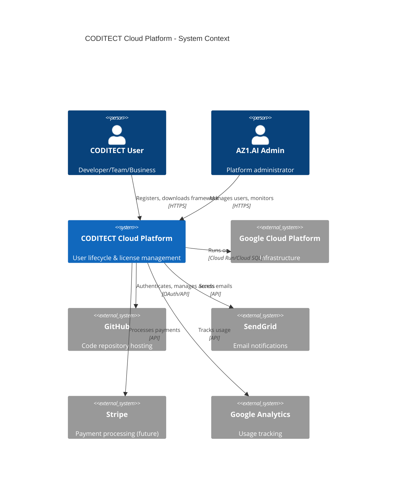
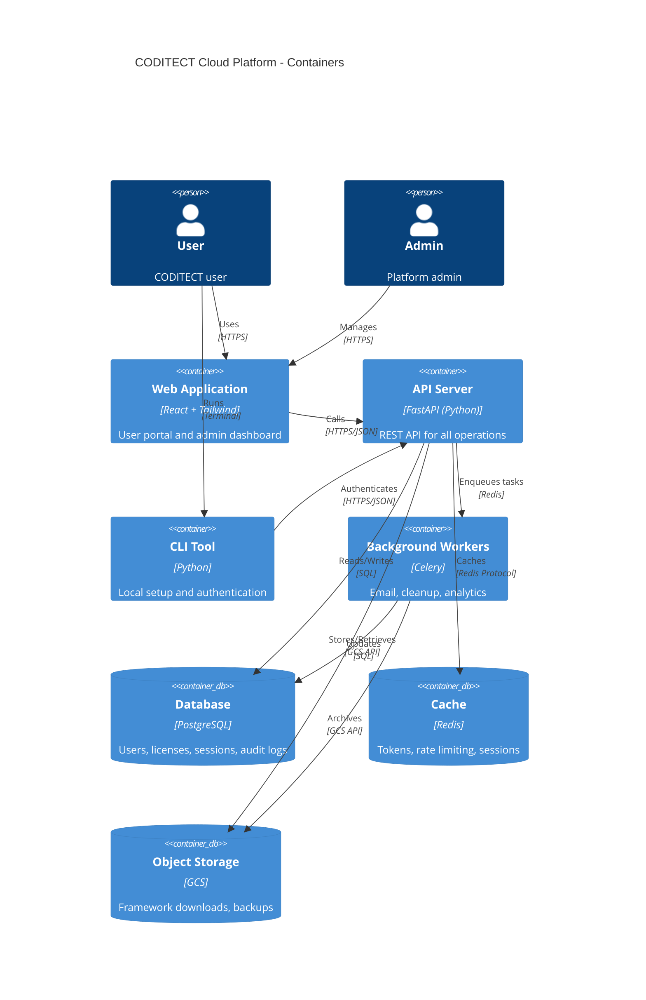

# CODITECT Cloud Platform - Project Plan

**Copyright © 2025 AZ1.AI INC. All Rights Reserved.**
**Developed by Hal Casteel, Founder/CEO/CTO, AZ1.AI INC.**

**Project Type:** SaaS Platform Development
**Status:** Phase 1 - Discovery & Planning
**Last Updated:** 2025-11-15

---

## Executive Summary

**Problem**: Need centralized onboarding, licensing, and lifecycle management for CODITECT users (individuals, teams, businesses, consultants, auditors)

**Solution**: CODITECT Cloud Platform - GCP-based SaaS for user registration, license management, IP protection, session tracking, and automated offboarding

**Market**: Foundation for AZ1.AI INC. commercial rollout

**Strategic Importance**:
- Protects AZ1.AI CODITECT IP (framework, code, training, documentation)
- Enables scalable user management
- Provides audit trail for compliance
- Foundation for future monetization

---

## Product Vision

### Core Platform Features

**User Lifecycle Management**:
- Registration with email verification
- Profile management (individual/team/business)
- License agreement acceptance (EULA)
- NDA acceptance and tracking
- Token-based authentication
- Automated offboarding with IP revocation

**Admin Control Panel**:
- User approval workflow
- License management
- Usage analytics
- Session monitoring
- Audit logging
- Bulk operations (approve/suspend/offboard)

**Download & Access Control**:
- Token-based CODITECT framework downloads
- Version-controlled releases
- Session tracking and limits
- IP-restricted access on offboarding

**Integration Points**:
- Python CLI tool for local setup
- Git authentication for private repos
- LLM CLI integration (Claude Code, etc.)
- Usage telemetry (opt-in)

---

## Phase 1: Discovery & Validation

### Value Proposition

**For AZ1.AI INC.**:
- IP protection and compliance
- Scalable user onboarding
- Usage analytics and insights
- Revenue foundation (future monetization)
- Professional brand image

**For CODITECT Users**:
- Simple onboarding process
- Secure access to framework
- Clear licensing terms
- Professional support channel
- Version updates and notifications

### Ideal Customer Profile (ICP)

**Tier 1: Early Adopters** (Current)
- Individual developers
- Small teams (2-5 people)
- Tech-savvy, willing to provide feedback
- Free tier with usage limits

**Tier 2: Professional Users** (Q1 2026)
- Mid-size teams (5-50 people)
- Consultants and agencies
- Paid tier with extended features

**Tier 3: Enterprise** (Q2 2026+)
- Large organizations (50+ developers)
- Custom licensing and SLAs
- Private deployment options

### Market Opportunity

**TAM** (Total Addressable Market): $10B
- Developer tools and platform market

**SAM** (Serviceable Addressable Market): $500M
- AI-assisted development tools segment

**SOM** (Serviceable Obtainable Market): $5M
- Realistic Year 1 target (1% of SAM)

### Competitive Analysis

| Competitor | Strengths | Weaknesses | Our Advantage |
|------------|-----------|------------|---------------|
| GitHub Education | Free for students | No IP protection | Full lifecycle mgmt |
| Figma Teams | Great user mgmt | Design-only | Development focus |
| JetBrains License Server | Enterprise-ready | Complex setup | Cloud-native, simple |
| Auth0 | Auth specialist | Not tailored | Domain-specific |

**Our Moat**:
- Integrated with CODITECT framework
- IP protection built-in
- Developer-first UX
- AI-powered insights

---

## Phase 2: Technical Architecture

### System Architecture (C4 Model)

#### C1: System Context



#### C2: Container Diagram



### Technology Stack

**Frontend**:
- React 18+ (UI framework)
- TailwindCSS (styling)
- Vite (build tool)
- React Router (navigation)
- TanStack Query (data fetching)
- Zustand (state management)

**Backend**:
- FastAPI (Python 3.11+)
- SQLAlchemy 2.0 (ORM)
- Alembic (migrations)
- Pydantic (validation)
- Celery (background tasks)
- Redis (caching + queue)

**Database**:
- PostgreSQL 15+ (primary database)
- Redis 7+ (cache + sessions)
- Google Cloud Storage (file storage)

**Infrastructure (GCP)**:
- Cloud Run (API + web hosting)
- Cloud SQL (PostgreSQL)
- Cloud Storage (files)
- Cloud CDN (static assets)
- Cloud Logging (audit trails)
- Secret Manager (credentials)
- Cloud Scheduler (cron jobs)

**External Services**:
- GitHub OAuth (authentication)
- SendGrid (email)
- Stripe (payments - future)
- Google Analytics (usage tracking)

### Database Schema

```sql
-- Users
CREATE TABLE users (
    id UUID PRIMARY KEY DEFAULT gen_random_uuid(),
    email VARCHAR(255) UNIQUE NOT NULL,
    email_verified BOOLEAN DEFAULT FALSE,
    github_id INTEGER UNIQUE,
    github_username VARCHAR(255),
    full_name VARCHAR(255),
    organization VARCHAR(255),
    user_type VARCHAR(50) NOT NULL, -- 'individual', 'team', 'business', 'consultant', 'auditor'
    status VARCHAR(50) NOT NULL DEFAULT 'pending', -- 'pending', 'active', 'suspended', 'offboarded'
    created_at TIMESTAMP DEFAULT NOW(),
    updated_at TIMESTAMP DEFAULT NOW(),
    last_login_at TIMESTAMP,
    offboarded_at TIMESTAMP,
    offboard_reason TEXT
);

-- License Agreements
CREATE TABLE license_agreements (
    id UUID PRIMARY KEY DEFAULT gen_random_uuid(),
    user_id UUID REFERENCES users(id),
    agreement_type VARCHAR(50) NOT NULL, -- 'eula', 'nda'
    version VARCHAR(50) NOT NULL,
    accepted_at TIMESTAMP NOT NULL,
    ip_address INET,
    user_agent TEXT,
    document_hash VARCHAR(64) -- SHA-256 of agreement text
);

-- Access Tokens
CREATE TABLE access_tokens (
    id UUID PRIMARY KEY DEFAULT gen_random_uuid(),
    user_id UUID REFERENCES users(id),
    token_hash VARCHAR(64) UNIQUE NOT NULL, -- SHA-256
    token_prefix VARCHAR(10) NOT NULL, -- First 8 chars for identification
    description VARCHAR(255),
    scopes TEXT[], -- ['framework:download', 'api:read', 'api:write']
    expires_at TIMESTAMP,
    last_used_at TIMESTAMP,
    created_at TIMESTAMP DEFAULT NOW(),
    revoked_at TIMESTAMP,
    revoke_reason TEXT
);

-- Framework Downloads
CREATE TABLE framework_downloads (
    id UUID PRIMARY KEY DEFAULT gen_random_uuid(),
    user_id UUID REFERENCES users(id),
    token_id UUID REFERENCES access_tokens(id),
    version VARCHAR(50) NOT NULL,
    download_url TEXT NOT NULL,
    ip_address INET,
    user_agent TEXT,
    downloaded_at TIMESTAMP DEFAULT NOW()
);

-- User Sessions
CREATE TABLE user_sessions (
    id UUID PRIMARY KEY DEFAULT gen_random_uuid(),
    user_id UUID REFERENCES users(id),
    token_id UUID REFERENCES access_tokens(id),
    session_type VARCHAR(50), -- 'web', 'cli', 'api'
    started_at TIMESTAMP DEFAULT NOW(),
    ended_at TIMESTAMP,
    duration_seconds INTEGER,
    ip_address INET,
    user_agent TEXT,
    metadata JSONB -- flexible session data
);

-- Audit Logs
CREATE TABLE audit_logs (
    id UUID PRIMARY KEY DEFAULT gen_random_uuid(),
    user_id UUID REFERENCES users(id),
    action VARCHAR(100) NOT NULL, -- 'user.registered', 'license.accepted', 'user.offboarded', etc.
    resource_type VARCHAR(50),
    resource_id UUID,
    old_values JSONB,
    new_values JSONB,
    ip_address INET,
    user_agent TEXT,
    created_at TIMESTAMP DEFAULT NOW()
);

-- Admin Users
CREATE TABLE admin_users (
    id UUID PRIMARY KEY DEFAULT gen_random_uuid(),
    user_id UUID REFERENCES users(id) UNIQUE,
    role VARCHAR(50) NOT NULL, -- 'super_admin', 'admin', 'viewer'
    granted_by UUID REFERENCES admin_users(id),
    granted_at TIMESTAMP DEFAULT NOW(),
    revoked_at TIMESTAMP
);

-- Indexes
CREATE INDEX idx_users_email ON users(email);
CREATE INDEX idx_users_status ON users(status);
CREATE INDEX idx_users_type ON users(user_type);
CREATE INDEX idx_tokens_user ON access_tokens(user_id);
CREATE INDEX idx_tokens_hash ON access_tokens(token_hash);
CREATE INDEX idx_downloads_user ON framework_downloads(user_id);
CREATE INDEX idx_sessions_user ON user_sessions(user_id);
CREATE INDEX idx_audit_user ON audit_logs(user_id);
CREATE INDEX idx_audit_created ON audit_logs(created_at);
```

---

## Phase 3: Implementation Plan

### Sprint 1-2: Foundation (Weeks 1-2)

**Goal**: Basic infrastructure and authentication

**Tasks**:
- [x] Create project plan
- [ ] Setup GCP project and billing
- [ ] Configure Cloud SQL (PostgreSQL)
- [ ] Configure Cloud Storage buckets
- [ ] Setup Cloud Run services (API + web)
- [ ] Implement database schema
- [ ] Create Alembic migrations
- [ ] Setup GitHub OAuth integration
- [ ] Build basic FastAPI app structure
- [ ] Implement user registration endpoint
- [ ] Implement email verification flow
- [ ] Write unit tests for auth

**Deliverables**:
- Working GCP infrastructure
- User registration + email verification
- GitHub OAuth login
- Basic API with auth

**Time Estimate**: 80 hours

---

### Sprint 3-4: License & Token Management (Weeks 3-4)

**Goal**: License agreements and token generation

**Tasks**:
- [ ] Create EULA document template
- [ ] Create NDA document template
- [ ] Implement license acceptance flow
- [ ] Build token generation system
- [ ] Implement token authentication
- [ ] Create admin approval workflow
- [ ] Build user profile management
- [ ] Setup SendGrid email templates
- [ ] Implement token revocation
- [ ] Write integration tests

**Deliverables**:
- License acceptance system
- Token-based authentication
- Admin approval workflow
- Email notifications

**Time Estimate**: 70 hours

---

### Sprint 5-6: Download & Session Tracking (Weeks 5-6)

**Goal**: Framework downloads and session management

**Tasks**:
- [ ] Build framework download endpoint
- [ ] Implement signed URL generation (GCS)
- [ ] Create version management system
- [ ] Build session tracking system
- [ ] Implement usage analytics
- [ ] Create audit logging system
- [ ] Build CLI tool (Python)
- [ ] CLI authentication flow
- [ ] CLI framework download
- [ ] Write E2E tests

**Deliverables**:
- Secure framework downloads
- Session tracking
- Python CLI tool
- Audit logging

**Time Estimate**: 80 hours

---

### Sprint 7-8: Admin Dashboard (Weeks 7-8)

**Goal**: Admin control panel

**Tasks**:
- [ ] Build React frontend structure
- [ ] Create admin dashboard UI
- [ ] User list and search
- [ ] User approval interface
- [ ] License management UI
- [ ] Session monitoring dashboard
- [ ] Audit log viewer
- [ ] Bulk operations UI
- [ ] Analytics dashboard
- [ ] Deploy to Cloud Run

**Deliverables**:
- Complete admin dashboard
- User management interface
- Analytics and monitoring
- Production deployment

**Time Estimate**: 90 hours

---

### Sprint 9-10: User Portal & Offboarding (Weeks 9-10)

**Goal**: User-facing portal and offboarding flow

**Tasks**:
- [ ] Build user portal UI
- [ ] Profile management page
- [ ] Token management interface
- [ ] Download history view
- [ ] Session history view
- [ ] Implement offboarding flow
- [ ] Token revocation automation
- [ ] Access cleanup scripts
- [ ] Build feedback collection
- [ ] Beta testing

**Deliverables**:
- User self-service portal
- Offboarding automation
- IP revocation system
- Beta-ready platform

**Time Estimate**: 70 hours

---

### Sprint 11-12: Polish & Launch (Weeks 11-12)

**Goal**: Production readiness

**Tasks**:
- [ ] Security audit
- [ ] Performance optimization
- [ ] Load testing
- [ ] Documentation (user + admin)
- [ ] Onboarding tutorial
- [ ] Setup monitoring (Cloud Logging)
- [ ] Setup alerts
- [ ] Backup and disaster recovery
- [ ] Legal review (EULA/NDA)
- [ ] Public launch

**Deliverables**:
- Production-ready platform
- Complete documentation
- Monitoring and alerting
- Legal compliance
- Public launch

**Time Estimate**: 60 hours

---

## Total Project Estimate

**Duration**: 12 weeks (3 months)
**Total Engineering Hours**: 450 hours
**Team**: 2 full-stack engineers + 1 DevOps engineer (part-time)

**Budget Estimate**:
- Engineering: $135,000 (450 hours @ $300/hour blended rate)
- GCP Infrastructure: $500/month × 3 months = $1,500
- External Services: $200/month × 3 months = $600
- Legal (EULA/NDA review): $5,000
- **Total**: $142,100

---

## Architecture Decision Records (ADRs)

### ADR-001: Use FastAPI for Backend

**Status**: Accepted
**Date**: 2025-11-15

**Context**: Need high-performance Python backend with modern features

**Decision**: Use FastAPI

**Rationale**:
- Native async support (handles concurrent users)
- Automatic OpenAPI documentation
- Pydantic validation (type safety)
- Excellent performance (comparable to Go/Node)
- Growing ecosystem
- Team has Python expertise

**Alternatives Considered**:
- Flask: Too basic, no async
- Django: Too opinionated, slower
- Go/Fiber: Team lacks Go expertise

---

### ADR-002: Use PostgreSQL for Primary Database

**Status**: Accepted
**Date**: 2025-11-15

**Context**: Need ACID-compliant database for user/license data

**Decision**: PostgreSQL on Cloud SQL

**Rationale**:
- ACID compliance (critical for licensing)
- JSON support (flexible metadata)
- Full-text search
- GCP Cloud SQL integration
- Mature ecosystem
- Strong audit capabilities

**Alternatives Considered**:
- MySQL: Less robust JSON support
- MongoDB: No ACID guarantees
- Firestore: Limited query capabilities

---

### ADR-003: Use React for Frontend

**Status**: Accepted
**Date**: 2025-11-15

**Context**: Need modern, maintainable frontend

**Decision**: React 18+ with TailwindCSS

**Rationale**:
- Large ecosystem
- Excellent performance (React 18+)
- TailwindCSS for rapid UI development
- Strong typing with TypeScript
- Easy to hire React developers
- Great dev tooling

**Alternatives Considered**:
- Vue: Smaller ecosystem
- Svelte: Less mature, harder to hire
- Angular: Too complex for this use case

---

### ADR-004: Use Token-Based Authentication

**Status**: Accepted
**Date**: 2025-11-15

**Context**: Need secure, scalable authentication for CLI + web

**Decision**: JWT for web sessions, long-lived tokens for CLI/API

**Rationale**:
- Stateless authentication (scales easily)
- Works across web + CLI
- Can revoke tokens (stored in DB)
- GitHub OAuth for primary login
- Granular scopes for access control

**Alternatives Considered**:
- Session cookies only: Doesn't work for CLI
- OAuth2 only: Too complex for CLI use case
- API keys only: Less secure for web

---

### ADR-005: Deploy on GCP Cloud Run

**Status**: Accepted
**Date**: 2025-11-15

**Context**: Need serverless, scalable hosting

**Decision**: GCP Cloud Run for API + web hosting

**Rationale**:
- Auto-scaling (0 to N instances)
- Pay-per-use (cost-effective for startup)
- Container-based (flexible deployments)
- Integrated with GCP services
- HTTPS out of the box
- Easy CI/CD with Cloud Build

**Alternatives Considered**:
- Kubernetes: Too complex for initial scale
- Compute Engine: Manual scaling, higher cost
- AWS Lambda: Team prefers GCP
- Heroku: Less control, higher cost at scale

---

## Success Metrics

### Phase 1 (Pilot - Month 1-3)

- [ ] 20+ users registered
- [ ] 100% license acceptance rate
- [ ] Zero security incidents
- [ ] < 2 second API response time (p95)
- [ ] 99.5% uptime

### Phase 2 (Growth - Month 4-6)

- [ ] 100+ active users
- [ ] 5+ team/business accounts
- [ ] NPS score > 50
- [ ] < 5% offboarding rate
- [ ] 99.9% uptime

### Phase 3 (Scale - Month 7-12)

- [ ] 500+ active users
- [ ] 20+ paid accounts (when monetization launches)
- [ ] Revenue: $50K+ ARR
- [ ] < 3% churn rate
- [ ] 99.95% uptime

---

## Risk Assessment

### Technical Risks

| Risk | Probability | Impact | Mitigation |
|------|-------------|--------|------------|
| GCP outage | Low | High | Multi-region deployment, backups |
| Security breach | Medium | Critical | Security audit, penetration testing |
| Scale issues | Medium | Medium | Load testing, auto-scaling |
| Data loss | Low | Critical | Automated backups, point-in-time recovery |

### Business Risks

| Risk | Probability | Impact | Mitigation |
|------|-------------|--------|------------|
| Low adoption | Medium | High | Strong onboarding, early user feedback |
| IP leakage | Low | Critical | Strong legal agreements, token revocation |
| Competitor copy | Medium | Medium | Fast iteration, unique value proposition |
| Compliance issues | Low | High | Legal review, audit logging |

---

## Next Steps

### Immediate (This Week)

- [x] Complete project plan
- [ ] Review and approve architecture
- [ ] Setup GCP organization and project
- [ ] Create GitHub repository (coditect-cloud-platform)
- [ ] Begin Sprint 1: Foundation setup

### Week 2

- [ ] Complete database schema implementation
- [ ] Build basic FastAPI structure
- [ ] Setup GitHub OAuth
- [ ] Implement user registration

### Month 1 Milestone

- [ ] MVP deployed to GCP
- [ ] First 10 pilot users onboarded
- [ ] Basic admin dashboard functional
- [ ] CLI tool working

---

## Appendix

### URL Structure

**Production**: `https://cloud.coditect.ai` or `https://platform.az1.ai`

**API**: `https://api.cloud.coditect.ai/v1`

**Endpoints**:
- `/auth/register` - User registration
- `/auth/login` - Login via GitHub OAuth
- `/auth/verify-email` - Email verification
- `/licenses/accept` - Accept EULA/NDA
- `/tokens/create` - Generate access token
- `/tokens/revoke` - Revoke token
- `/framework/download` - Download CODITECT framework
- `/admin/users` - User management (admin only)
- `/admin/audit-logs` - Audit log viewer (admin only)

### CLI Usage

```bash
# Install
pip install coditect-cli

# Login
coditect login
# Opens browser for GitHub OAuth

# Download framework
coditect download
# Downloads latest CODITECT framework to ~/PROJECTS/.coditect

# Check status
coditect status
# Shows license status, token expiry, current version

# Logout / offboard
coditect logout
```

---

**Copyright © 2025 AZ1.AI INC. All Rights Reserved.**
**Developed by Hal Casteel, Founder/CEO/CTO, AZ1.AI INC.**

**Project Status**: Phase 1 - Planning Complete ✅
**Next Milestone**: GCP Setup + Sprint 1 Foundation
**Target Launch**: Q1 2026 (3 months from start)
