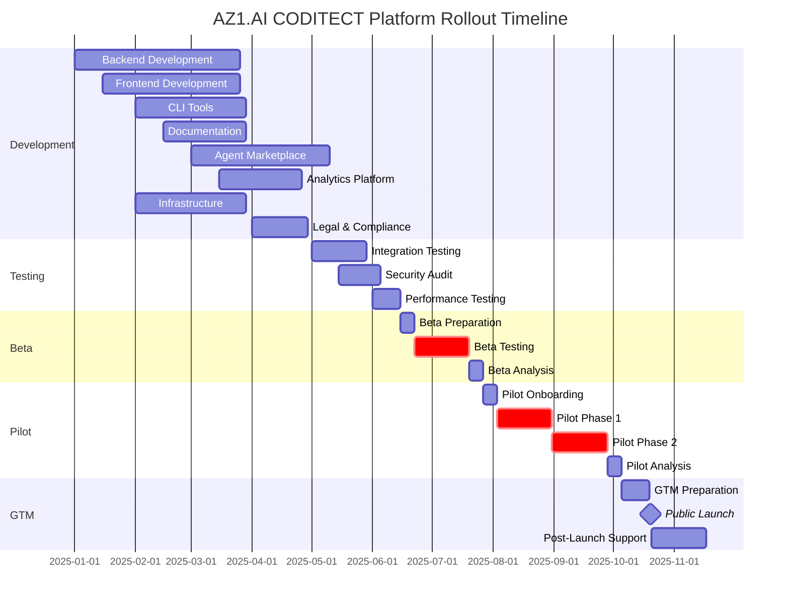

# AZ1.AI CODITECT Master Orchestration & Governance Plan

**Document Version:** 1.0
**Last Updated:** 2025-11-15
**Document Owner:** Hal Casteel, Founder/CEO/CTO, AZ1.AI INC.
**Status:** DRAFT - Pending Executive Approval

---

## Executive Summary

This Master Orchestration & Governance Plan provides the strategic framework for transitioning the AZ1.AI CODITECT platform from internal development through beta testing, pilot program, and ultimately to full Go-to-Market (GTM). This document complements the technical CODITECT-ROLLOUT-MASTER-PLAN.md with governance structures, phase gates, success criteria, and risk management frameworks.

**Key Milestones:**
- **Beta Launch:** Month 7 (4 weeks, 10-20 internal users)
- **Pilot Launch:** Month 8 (8 weeks, 50-100 external early adopters)
- **GTM Launch:** Month 10 (public availability, unlimited users)

**Total Timeline:** 10 months from development kickoff to public launch
**Investment Required:** $884K (development) + $150K (beta/pilot operations) = $1.034M

---

## Table of Contents

1. [Phase Overview](#phase-overview)
2. [Governance Framework](#governance-framework)
3. [Phase 1: Development (Months 1-6)](#phase-1-development)
4. [Phase 2: Beta Testing (Month 7)](#phase-2-beta-testing)
5. [Phase 3: Pilot Program (Months 8-9)](#phase-3-pilot-program)
6. [Phase 4: Go-to-Market (Month 10+)](#phase-4-go-to-market)
7. [Success Metrics & KPIs](#success-metrics--kpis)
8. [Risk Management](#risk-management)
9. [Decision Authority Matrix](#decision-authority-matrix)
10. [Phase Gate Criteria](#phase-gate-criteria)
11. [Communication Plan](#communication-plan)
12. [Budget & Resource Allocation](#budget--resource-allocation)

---

## Phase Overview

### Phase Definitions

| Phase | Duration | User Base | Primary Goal | Key Deliverable |
|-------|----------|-----------|--------------|-----------------|
| **Development** | 6 months | Internal team | Build core platform | Functional MVP |
| **Beta Testing** | 4 weeks | 10-20 internal users | Validate core functionality | Stability report |
| **Pilot Program** | 8 weeks | 50-100 external users | Validate market fit | Product-market fit report |
| **Go-to-Market** | Ongoing | Unlimited | Scale adoption | Revenue & growth |

---

## Governance Framework

### Executive Steering Committee

**Purpose:** Strategic oversight, phase gate approvals, resource allocation

**Members:**
- Hal Casteel (Founder/CEO/CTO) - Chair
- VP Engineering (TBD)
- VP Product (TBD)
- VP Sales & Marketing (TBD)
- Legal Counsel (TBD)

**Cadence:**
- Weekly during Development & Beta
- Bi-weekly during Pilot
- Monthly post-GTM

**Decision Authority:**
- Phase gate approvals (unanimous required)
- Budget changes >$50K
- Roadmap changes affecting GTM timeline
- Strategic partnerships

### Program Management Office (PMO)

**Purpose:** Day-to-day execution, cross-project coordination, issue escalation

**Structure:**
- **Program Manager** (dedicated full-time)
  - Oversees all 8 technical projects
  - Manages dependencies and blockers
  - Reports to Executive Steering Committee

- **Technical Lead** (Hal Casteel initially)
  - Architecture decisions
  - Code reviews and quality gates
  - Technical escalations

- **Product Manager** (TBD - Month 3)
  - User experience and feature prioritization
  - Beta/Pilot program management
  - User feedback incorporation

- **QA Lead** (TBD - Month 5)
  - Test strategy and execution
  - Quality gate enforcement
  - Beta/Pilot quality monitoring

**Cadence:**
- Daily standups (15 min)
- Weekly sprint reviews
- Monthly retrospectives

### Quality Assurance Board

**Purpose:** Enforce quality gates, approve phase transitions

**Members:**
- Technical Lead
- QA Lead
- Security Lead (external consultant)
- 2 Senior Engineers (rotating)

**Cadence:**
- Before each phase gate
- Ad-hoc for critical issues

**Decision Authority:**
- Go/no-go for phase transitions
- Quality standards and thresholds
- Defect severity classification

---

## Phase 1: Development (Months 1-6)

### Objectives

1. **Build MVP:** Deliver functional platform with core features
2. **Technical Foundation:** Establish scalable, secure architecture
3. **Documentation:** Create comprehensive user and admin documentation
4. **Legal Framework:** Finalize EULA, NDA, Terms of Service

### Key Activities

#### Month 1-2: Foundation
- Project setup and repository creation
- Infrastructure provisioning (GCP, GitHub, CI/CD)
- Database schema design and implementation
- Authentication system (OAuth, JWT, token management)

#### Month 3-4: Core Features
- User registration and onboarding flows
- License acceptance and tracking
- CODITECT framework download mechanism
- Session management and tracking
- Admin control panel

#### Month 5-6: Integration & Polish
- Frontend-backend integration
- CLI tool integration with cloud platform
- Documentation site completion
- Security hardening
- Performance optimization

### Success Criteria

| Criterion | Target | Measurement |
|-----------|--------|-------------|
| **Code Coverage** | >80% | Automated testing |
| **API Response Time** | <200ms (p95) | Load testing |
| **Security Vulnerabilities** | 0 critical, <5 high | Security audit |
| **Documentation Completeness** | 100% core features | Manual review |
| **Uptime** | >99.5% | Monitoring |

### Exit Criteria (Development → Beta Gate)

✅ All 8 projects deployed to staging environment
✅ Security audit passed with no critical findings
✅ Performance benchmarks met (1000 concurrent users)
✅ User documentation complete
✅ Admin documentation complete
✅ Legal documents finalized and reviewed
✅ Monitoring and alerting operational
✅ Incident response procedures documented
✅ Beta test plan approved by Steering Committee

---

## Phase 2: Beta Testing (Month 7)

### Objectives

1. **Validate Core Functionality:** Ensure all critical user journeys work end-to-end
2. **Identify Bugs:** Find and fix critical and high-priority defects
3. **Gather Feedback:** Collect qualitative feedback on UX and workflows
4. **Stress Test:** Validate platform stability under realistic load

### Beta User Profile

**Target:** 10-20 internal users (AZ1.AI team members + trusted advisors)

**Composition:**
- 5 engineers (technical power users)
- 5 product/business users (representative of target market)
- 5 novice users (minimal Git/CLI experience)
- 5 external advisors (under NDA)

**Recruitment:**
- Internal: Direct invitation
- External: Personal outreach from Hal Casteel

### Beta Test Plan

#### Week 1: Onboarding
- User registration and license acceptance
- CODITECT framework download and setup
- CLI installation and configuration
- First project creation (guided tutorial)

**Success Metrics:**
- 100% successful registrations
- <5 min average onboarding time
- 0 critical setup blockers

#### Week 2: Core Workflows
- Create 3 projects using CODITECT methodology
- Use Git helper for session management
- Submit feedback via integrated form
- Test admin panel (1-2 designated admins)

**Success Metrics:**
- 80% task completion rate
- <10 P1/P2 bugs per user
- >70% positive sentiment in feedback

#### Week 3: Advanced Features
- Agent marketplace browsing and installation
- Analytics dashboard usage
- Team collaboration features (if 2+ users per team)
- Offboarding simulation (2 users)

**Success Metrics:**
- All advanced features exercised
- Access revocation verified on offboarding
- <5 P1/P2 bugs in advanced features

#### Week 4: Stability & Performance
- Sustained usage (daily active use)
- Concurrent session testing (all users active simultaneously)
- Data export and backup testing
- Final feedback collection

**Success Metrics:**
- >90% daily active users
- 0 critical errors during concurrent load
- Platform uptime >99%

### Beta Feedback Collection

**Methods:**
- Daily Slack channel for issues and questions
- Weekly 1:1 interviews (30 min each)
- End-of-week survey (NPS, feature ratings, open feedback)
- Analytics data (usage patterns, feature adoption)

**Analysis:**
- Daily bug triage and prioritization
- Weekly synthesis of qualitative feedback
- End-of-beta comprehensive report

### Exit Criteria (Beta → Pilot Gate)

✅ <5 outstanding P1 bugs (none critical)
✅ >80% of beta users completed all core workflows
✅ NPS score >40 (promoters - detractors)
✅ All critical bugs resolved
✅ Documentation updated based on beta feedback
✅ Performance targets met under beta load
✅ Security re-audit passed (if any security issues found)
✅ Offboarding workflow validated (access revoked successfully)
✅ Pilot test plan approved by Steering Committee
✅ Legal documents updated if needed

**Go/No-Go Decision:** Executive Steering Committee vote (unanimous required)

---

## Phase 3: Pilot Program (Months 8-9)

### Objectives

1. **Validate Product-Market Fit:** Confirm target users find value in CODITECT
2. **Scale Testing:** Ensure platform handles 50-100 concurrent users
3. **Refine Onboarding:** Optimize user experience for diverse user types
4. **Build Case Studies:** Document success stories for GTM marketing
5. **Validate Business Model:** Test pricing, licensing, and support models

### Pilot User Profile

**Target:** 50-100 external users across diverse segments

**Composition:**
- **Individual Developers** (20 users): Freelancers, side projects
- **Small Teams** (10 teams, 30 users): Startups, small agencies (2-5 people)
- **Businesses** (5 companies, 25 users): Mid-size companies (10-50 employees)
- **Consultants** (10 users): Independent consultants, fractional CTOs
- **Auditors/Advisors** (5 users): Code reviewers, technical due diligence

**Recruitment Strategy:**
- Invite-only via application form
- Target: AI/ML engineers, DevOps teams, SaaS startups
- Channels: LinkedIn, Twitter/X, Hacker News, personal network
- Incentive: Free access during pilot + discounted pricing at GTM

### Pilot Program Structure

#### Phase 3A: Pilot Wave 1 (Weeks 1-4)

**Focus:** Controlled rollout with close monitoring

**User Count:** 25 users (5 from each segment)

**Activities:**
- Week 1: Onboarding and initial setup
- Week 2-3: Active usage and feedback collection
- Week 4: Advanced features and team collaboration

**Support Model:**
- Daily office hours (1 hour)
- Dedicated Slack channel
- 1:1 onboarding calls (30 min per user)
- Weekly group Q&A sessions

**Success Metrics:**
- >90% onboarding completion rate
- >60% weekly active users (WAU)
- <20 P1/P2 bugs reported
- NPS >50

#### Phase 3B: Pilot Wave 2 (Weeks 5-8)

**Focus:** Scale testing and business model validation

**User Count:** 75 users total (50 new users)

**Activities:**
- Week 5: Wave 2 onboarding
- Week 6-7: Full platform usage, all features
- Week 8: Business model testing (introduce pricing tiers)

**Support Model:**
- 3x weekly office hours (1 hour each)
- Community Slack channel (peer-to-peer support)
- Self-service documentation and video tutorials
- Email support (24-hour response SLA)

**Success Metrics:**
- >85% onboarding completion rate
- >50% weekly active users (WAU)
- <30 P1/P2 bugs reported (cumulative)
- NPS >60
- >40% willing to pay at proposed pricing

### Pilot Pricing Model Testing

**Proposed Tiers** (pilot pricing, 50% off GTM pricing):

| Tier | Target | Pilot Price | GTM Price | Features |
|------|--------|-------------|-----------|----------|
| **Individual** | Developers | $25/month | $49/month | 1 user, unlimited projects, community support |
| **Team** | 2-10 users | $100/month | $199/month | Up to 10 users, shared projects, email support |
| **Business** | 10-50 users | $400/month | $799/month | Up to 50 users, priority support, SLA |
| **Enterprise** | 50+ users | Custom | Custom | Unlimited users, dedicated support, on-prem option |

**Conversion Goal:** 40% of pilot users commit to paid plan at GTM

### Pilot Feedback Collection

**Quantitative:**
- Daily usage analytics (feature adoption, time-on-platform)
- Weekly surveys (5 min, feature ratings)
- End-of-pilot NPS and satisfaction survey
- Conversion tracking (willingness to pay)

**Qualitative:**
- Bi-weekly user interviews (10 users per week, 30 min)
- Case study development (3-5 power users)
- Community Slack sentiment analysis
- Support ticket analysis

### Case Study Development

**Goal:** 3-5 detailed case studies for GTM marketing

**Profile:**
- 1 individual developer (freelancer success story)
- 1 small team (startup rapid development)
- 1 business (enterprise efficiency gains)
- 1 consultant (client delivery improvement)
- 1 auditor (code review workflow)

**Format:**
- Before/After analysis (metrics: time saved, quality improved)
- Quotes and testimonials
- Video interviews (optional)
- Written narrative (800-1200 words)

### Exit Criteria (Pilot → GTM Gate)

✅ >50 active pilot users at end of Phase 3B
✅ <10 outstanding P1/P2 bugs (none critical)
✅ NPS >60
✅ >70% weekly active users (WAU) in final 2 weeks
✅ >40% conversion commitment to paid plans
✅ Platform uptime >99.5% during pilot
✅ All 5 user segments successfully onboarded and active
✅ 3-5 case studies completed and approved
✅ Support playbook documented and tested
✅ Pricing model validated (survey + conversion data)
✅ GTM marketing materials ready (website, deck, collateral)
✅ Sales and support team hired and trained
✅ Legal documents finalized for public use
✅ Security audit passed (if any changes since beta)

**Go/No-Go Decision:** Executive Steering Committee vote (unanimous required)

---

## Phase 4: Go-to-Market (Month 10+)

### Objectives

1. **Public Launch:** Make platform available to all users
2. **Scale Acquisition:** Drive user growth through marketing and sales
3. **Optimize Conversion:** Convert free users to paid plans
4. **Build Community:** Establish user community and ecosystem
5. **Continuous Improvement:** Iterate based on production data

### GTM Strategy

#### Launch Tactics

**Week 1: Soft Launch**
- Announce to pilot users (remove invite-only gate)
- Publish case studies and testimonials
- Activate SEO/SEM campaigns
- Announce on social media (LinkedIn, Twitter/X)

**Week 2-4: Public Launch**
- Product Hunt launch (aim for #1 Product of the Day)
- Hacker News post (Show HN: CODITECT)
- Press outreach (TechCrunch, VentureBeat, etc.)
- Webinar series (1 per week)
- Conference sponsorships (if budget allows)

**Week 5-8: Growth Acceleration**
- Content marketing (blog posts, tutorials, videos)
- Partnership outreach (IDE plugins, AI tool integrations)
- Community building (Discord, Slack, forums)
- Referral program launch
- Free tier optimization (convert to paid)

#### Marketing Channels

| Channel | Budget (Mo 1-3) | Expected CAC | Expected Conversion |
|---------|-----------------|--------------|---------------------|
| **SEO/Content** | $10K/month | $50 | 5% (organic) |
| **SEM (Google Ads)** | $15K/month | $120 | 3% |
| **Social Media Ads** | $10K/month | $80 | 4% |
| **Partnerships** | $5K/month | $30 | 8% |
| **Events/Webinars** | $10K/month | $100 | 6% |
| **Total** | $50K/month | $76 (blended) | 5.2% (blended) |

**Projected Acquisition (Month 1-3):**
- Month 1: 200 new users (100 free, 100 paid)
- Month 2: 500 new users (250 free, 250 paid)
- Month 3: 1,000 new users (500 free, 500 paid)

#### Pricing & Monetization

**Free Tier** (lead generation):
- 1 user, 3 projects, community support
- Goal: 60% of signups → convert 10% to paid within 90 days

**Paid Tiers** (GTM pricing):
- Individual: $49/month
- Team: $199/month (10 users)
- Business: $799/month (50 users)
- Enterprise: Custom pricing

**Revenue Projections (Month 1-6):**
- Month 1: $5K MRR (100 paid users @ $50 avg)
- Month 3: $50K MRR (850 paid users)
- Month 6: $150K MRR (2,500 paid users)

### Post-Launch Operations

#### Support Model

**Tiers:**
- **Community Support** (free tier): Docs, community forum, 72-hour email response
- **Email Support** (individual/team): 24-hour response, 8-hour for critical
- **Priority Support** (business): 4-hour response, 1-hour for critical
- **Dedicated Support** (enterprise): Named support engineer, 30-min response

**Team:**
- 2 support engineers (Month 1)
- 5 support engineers (Month 3)
- 10 support engineers (Month 6)

#### Product Roadmap (Post-GTM)

**Q1 (Months 1-3):**
- IDE plugins (VS Code, IntelliJ)
- Mobile app (iOS, Android)
- Slack/Discord integrations
- Enhanced analytics dashboard

**Q2 (Months 4-6):**
- Enterprise features (SSO, SCIM, audit logs)
- API for third-party integrations
- Agent marketplace curation and quality
- Localization (Spanish, French, German)

**Q3 (Months 7-9):**
- On-premise deployment option
- Advanced collaboration features
- AI-powered code review
- Compliance certifications (SOC 2, ISO 27001)

### Success Metrics (First 6 Months)

| Metric | Month 1 | Month 3 | Month 6 | Target |
|--------|---------|---------|---------|--------|
| **Total Users** | 200 | 1,200 | 4,000 | 4,000+ |
| **Paid Users** | 100 | 850 | 2,500 | 2,500+ |
| **MRR** | $5K | $50K | $150K | $150K+ |
| **Churn Rate** | N/A | <5% | <5% | <5% |
| **NPS** | 60+ | 70+ | 75+ | 70+ |
| **CAC** | $100 | $80 | $70 | <$75 |
| **LTV:CAC** | N/A | 3:1 | 5:1 | >3:1 |
| **Support Ticket Volume** | 50/week | 200/week | 500/week | Handle within SLA |

---

## Success Metrics & KPIs

### North Star Metric

**Weekly Active Users (WAU)** - Measures platform adoption and stickiness

**Target Progression:**
- Beta: 15 WAU (75% of beta users)
- Pilot: 70 WAU (70% of pilot users)
- GTM Month 1: 140 WAU (70% of total users)
- GTM Month 6: 3,000 WAU (75% of total users)

### Product Metrics

| Category | Metric | Beta Target | Pilot Target | GTM Month 6 Target |
|----------|--------|-------------|--------------|---------------------|
| **Adoption** | Onboarding completion rate | >90% | >85% | >80% |
| **Engagement** | Weekly Active Users (WAU) | 75% | 70% | 75% |
| **Engagement** | Projects created per user | 3+ | 5+ | 10+ |
| **Engagement** | Sessions per user per week | 3+ | 4+ | 5+ |
| **Quality** | Critical bugs per release | 0 | 0 | 0 |
| **Quality** | Platform uptime | >99.5% | >99.5% | >99.9% |
| **Satisfaction** | NPS | >40 | >60 | >70 |
| **Satisfaction** | Support ticket resolution time | N/A | <24 hours | <12 hours |

### Business Metrics

| Category | Metric | Pilot Target | GTM Month 3 Target | GTM Month 6 Target |
|----------|--------|--------------|---------------------|---------------------|
| **Revenue** | MRR | $0 (free pilot) | $50K | $150K |
| **Revenue** | ARPU | N/A | $58 | $60 |
| **Acquisition** | New users per month | 75 (pilot) | 500 | 1,000 |
| **Acquisition** | CAC | N/A | $80 | $70 |
| **Retention** | Churn rate (monthly) | N/A | <5% | <5% |
| **Retention** | LTV:CAC ratio | N/A | 3:1 | 5:1 |
| **Conversion** | Free to paid conversion | 40% commit | 10% (90 days) | 15% (90 days) |

### Operational Metrics

| Category | Metric | Beta Target | Pilot Target | GTM Month 6 Target |
|----------|--------|-------------|--------------|---------------------|
| **Performance** | API response time (p95) | <200ms | <200ms | <150ms |
| **Performance** | Page load time (p95) | <2s | <2s | <1.5s |
| **Scalability** | Concurrent users supported | 20 | 100 | 1,000 |
| **Security** | Critical vulnerabilities | 0 | 0 | 0 |
| **Security** | Time to patch high vulns | N/A | <48 hours | <24 hours |

---

## Risk Management

### Risk Register

| Risk ID | Risk Description | Probability | Impact | Mitigation Strategy | Owner |
|---------|------------------|-------------|--------|---------------------|-------|
| **R1** | Development delays push back beta launch | Medium | High | Buffer time built into schedule; weekly progress reviews | Program Manager |
| **R2** | Security vulnerability discovered in beta/pilot | Low | Critical | Security audit before each phase; bug bounty program | Security Lead |
| **R3** | Low beta/pilot user engagement | Medium | High | Carefully select engaged users; provide incentives | Product Manager |
| **R4** | Poor product-market fit (low NPS, conversion) | Medium | Critical | Extensive user research pre-beta; rapid iteration on feedback | CEO/Product Manager |
| **R5** | Scalability issues at pilot scale | Low | High | Load testing before pilot; gradual rollout (Wave 1 → Wave 2) | Technical Lead |
| **R6** | Legal/compliance issues (EULA, NDA, data privacy) | Low | Critical | Legal review before beta; privacy audit; SOC 2 prep | Legal Counsel |
| **R7** | Competitor launches similar product during pilot | Medium | Medium | Differentiate with AI-first approach; build community early | CEO/VP Marketing |
| **R8** | Key personnel departure (Hal, engineers) | Low | Critical | Document tribal knowledge; cross-train team | CEO/Program Manager |
| **R9** | Budget overruns | Medium | Medium | Monthly budget reviews; contingency fund (15%) | CFO/Program Manager |
| **R10** | Infrastructure outages (GCP, GitHub) | Low | High | Multi-region deployment; robust monitoring and alerting | DevOps Lead |

### Risk Response Plans

#### R1: Development Delays
- **Trigger:** Any project >2 weeks behind schedule
- **Response:**
  1. Daily standup review of blockers
  2. Reallocate resources from lower-priority projects
  3. Descope non-critical features to maintain timeline
  4. Escalate to Steering Committee if >1 month delay risk
- **Contingency:** Push beta launch by 2 weeks max; compress beta to 3 weeks if needed

#### R2: Security Vulnerability
- **Trigger:** Critical or high-severity vulnerability discovered
- **Response:**
  1. Immediate platform freeze (no new features)
  2. Convene security response team within 4 hours
  3. Patch developed and tested within 24-48 hours
  4. All users notified within 24 hours if data exposure risk
  5. Post-mortem and process improvement
- **Contingency:** Pause phase transition until resolved

#### R4: Poor Product-Market Fit
- **Trigger:** NPS <40 in beta OR <50 in pilot OR <40% conversion in pilot
- **Response:**
  1. Deep-dive user interviews (10+ users)
  2. Analyze usage data for patterns
  3. Rapid prototyping of UX improvements
  4. Consider pivot to different user segment if necessary
- **Contingency:** Extend pilot by 4 weeks to validate improvements; consider beta 2.0 with revised feature set

#### R6: Legal/Compliance Issues
- **Trigger:** User raises legal concern OR audit identifies gap
- **Response:**
  1. Immediate legal counsel consultation
  2. Pause affected workflows (e.g., data collection)
  3. Update terms and re-obtain user consent if necessary
  4. Communicate transparently with users
- **Contingency:** Delay GTM launch until resolved; offer users option to delete data

---

## Decision Authority Matrix

### Phase Gate Approvals

| Decision | Authority | Backup Authority | Notes |
|----------|-----------|------------------|-------|
| **Development → Beta** | Executive Steering Committee (unanimous) | N/A | Quality Assurance Board must recommend approval |
| **Beta → Pilot** | Executive Steering Committee (unanimous) | N/A | Quality Assurance Board must recommend approval |
| **Pilot → GTM** | Executive Steering Committee (unanimous) | N/A | Quality Assurance Board must recommend approval |

### Operational Decisions

| Decision Type | Authority | Approval Required | Notes |
|---------------|-----------|-------------------|-------|
| **Budget changes <$10K** | Program Manager | CEO approval | Weekly report to Steering Committee |
| **Budget changes $10K-$50K** | CEO | CFO approval | Steering Committee notification |
| **Budget changes >$50K** | Steering Committee | Unanimous vote | Board notification if >$100K |
| **Roadmap changes (minor)** | Product Manager | Technical Lead approval | Does not affect phase timeline |
| **Roadmap changes (major)** | Steering Committee | Unanimous vote | Affects phase timeline or core features |
| **Marketing campaigns** | VP Marketing | CEO approval | Budget within allocated limits |
| **Partnership agreements** | CEO | Legal review | Steering Committee notification |
| **Pricing changes** | CEO | Steering Committee majority | User communication plan required |
| **Security incidents (P1)** | Technical Lead | CEO notification | Immediate response, post-mortem to Steering Committee |
| **User offboarding disputes** | Legal Counsel | CEO escalation | Document all decisions |

### Escalation Path

1. **Operational Issue** → Program Manager → CEO → Steering Committee
2. **Technical Issue** → Technical Lead → CEO → Steering Committee
3. **Legal Issue** → Legal Counsel → CEO → Steering Committee
4. **User Issue** → Support → Product Manager → CEO
5. **Security Issue** → Security Lead → Technical Lead → CEO → Steering Committee (if critical)

---

## Phase Gate Criteria

### Gate 1: Development → Beta

**Timing:** End of Month 6

**Checklist:**

**Technical Readiness:**
- [ ] All 8 projects deployed to staging environment
- [ ] Integration testing passed (100% critical paths)
- [ ] Security audit completed with 0 critical, <5 high findings
- [ ] Performance benchmarks met (1000 concurrent users, <200ms API response)
- [ ] Monitoring and alerting operational (PagerDuty, Datadog)
- [ ] Disaster recovery tested (RTO <1 hour, RPO <15 min)
- [ ] Data backup and restore tested

**Product Readiness:**
- [ ] All core user journeys functional (registration, onboarding, project creation, session management)
- [ ] User documentation complete (installation, tutorials, FAQs)
- [ ] Admin documentation complete (user management, offboarding, support)
- [ ] Beta test plan documented and approved
- [ ] Beta feedback collection tools ready (surveys, Slack, analytics)

**Legal & Compliance:**
- [ ] EULA finalized and reviewed by legal counsel
- [ ] NDA finalized and reviewed by legal counsel
- [ ] Terms of Service finalized
- [ ] Privacy Policy finalized (GDPR, CCPA compliant)
- [ ] Data Processing Agreement (DPA) ready for business users

**Operational Readiness:**
- [ ] Beta user list finalized (10-20 users identified and confirmed)
- [ ] Support plan documented (Slack channel, office hours schedule)
- [ ] Incident response procedures documented
- [ ] Rollback plan documented

**Governance:**
- [ ] Quality Assurance Board recommends approval
- [ ] Executive Steering Committee unanimous vote

**Go/No-Go Decision:** If ANY critical item unchecked → NO GO

---

### Gate 2: Beta → Pilot

**Timing:** End of Month 7 (after 4-week beta)

**Checklist:**

**Beta Success Metrics:**
- [ ] NPS >40 (minimum threshold for pilot)
- [ ] >80% of beta users completed all core workflows
- [ ] <5 outstanding P1 bugs (0 critical)
- [ ] Platform uptime >99.5% during beta
- [ ] 100% successful license acceptance and tracking
- [ ] Offboarding workflow validated (2+ test users successfully offboarded)

**Technical Improvements:**
- [ ] All critical beta bugs resolved
- [ ] All high-priority beta bugs resolved or deferred with mitigation
- [ ] Performance targets met under beta load
- [ ] Security re-audit passed (if any security issues found in beta)
- [ ] Scalability testing passed (100 concurrent users)

**Product Improvements:**
- [ ] Documentation updated based on beta feedback
- [ ] UX improvements implemented based on beta feedback (top 3 issues)
- [ ] Onboarding flow optimized (reduced friction points)
- [ ] Admin panel enhanced based on admin feedback

**Pilot Preparation:**
- [ ] Pilot test plan documented and approved
- [ ] Pilot user recruitment plan ready (application form, outreach strategy)
- [ ] Pilot support plan documented (office hours, Slack, email)
- [ ] Case study framework defined (selection criteria, interview guide)
- [ ] Pricing model finalized for testing

**Legal & Compliance:**
- [ ] Legal documents updated if needed based on beta feedback
- [ ] Privacy audit passed (if data handling changed)

**Governance:**
- [ ] Quality Assurance Board recommends approval
- [ ] Executive Steering Committee unanimous vote

**Go/No-Go Decision:** If NPS <40 OR >5 P1 bugs → NO GO (extend beta)

---

### Gate 3: Pilot → GTM

**Timing:** End of Month 9 (after 8-week pilot)

**Checklist:**

**Pilot Success Metrics:**
- [ ] NPS >60 (minimum threshold for GTM)
- [ ] >50 active pilot users at end of pilot
- [ ] >70% weekly active users (WAU) in final 2 weeks
- [ ] >40% conversion commitment to paid plans
- [ ] Platform uptime >99.5% during pilot
- [ ] <10 outstanding P1/P2 bugs (0 critical)

**Technical Readiness:**
- [ ] All critical pilot bugs resolved
- [ ] Scalability testing passed (1000 concurrent users)
- [ ] Multi-region deployment ready (US, EU)
- [ ] Payment processing integrated and tested (Stripe)
- [ ] Billing system operational (subscription management, invoicing)
- [ ] SLA monitoring operational (uptime, response times)

**Product Readiness:**
- [ ] All 5 user segments successfully onboarded and active
- [ ] Documentation complete for all user types
- [ ] Self-service onboarding tested and optimized
- [ ] Free tier vs. paid tier feature matrix finalized
- [ ] Product roadmap (6 months) defined and communicated

**Marketing & Sales Readiness:**
- [ ] 3-5 case studies completed and approved
- [ ] Marketing website live (www.coditect.ai)
- [ ] Launch blog post and press release ready
- [ ] Social media accounts active and content calendar ready
- [ ] Product Hunt and Hacker News posts prepared
- [ ] Paid advertising campaigns ready (Google, LinkedIn)

**Support & Operations Readiness:**
- [ ] Support team hired and trained (2+ support engineers)
- [ ] Support playbook documented and tested
- [ ] Ticketing system operational (Zendesk or similar)
- [ ] Community platform ready (Discord/Slack)
- [ ] SLA response times defined and tested

**Legal & Compliance:**
- [ ] Legal documents finalized for public use
- [ ] Privacy audit passed
- [ ] Terms of Service reviewed for all pricing tiers
- [ ] Refund policy defined
- [ ] Data retention and deletion policies documented

**Business Readiness:**
- [ ] Pricing validated (survey + conversion data)
- [ ] Revenue projections modeled (conservative, base, optimistic)
- [ ] Cash flow projections for 6 months post-GTM
- [ ] Hiring plan ready (support, sales, engineering scale-up)

**Governance:**
- [ ] Quality Assurance Board recommends approval
- [ ] Executive Steering Committee unanimous vote

**Go/No-Go Decision:** If NPS <60 OR <40% conversion OR >10 P1/P2 bugs → NO GO (extend pilot)

---

## Communication Plan

### Internal Communication

#### Development Phase
- **Daily:** Standup (Slack or 15-min video)
- **Weekly:** Sprint review (1 hour, demo progress)
- **Monthly:** Steering Committee meeting (2 hours, strategic review)
- **Ad-hoc:** Blocker escalations (Slack #engineering-blockers)

#### Beta Phase
- **Daily:** Beta triage meeting (30 min, review bugs and feedback)
- **Weekly:** Steering Committee meeting (1 hour, beta progress)
- **End-of-phase:** Beta retrospective (2 hours, lessons learned)

#### Pilot Phase
- **Daily:** Support triage (30 min, review tickets and Slack)
- **Bi-weekly:** Steering Committee meeting (1 hour, pilot progress)
- **End-of-phase:** Pilot retrospective (2 hours, lessons learned)

#### GTM Phase
- **Weekly:** Growth meeting (1 hour, marketing/sales/product)
- **Bi-weekly:** Steering Committee meeting (1 hour, GTM metrics)
- **Monthly:** All-hands (1 hour, company update)

### External Communication

#### Beta Users
- **Onboarding:** Welcome email with setup guide and Slack invite
- **Weekly:** Office hours (1 hour, open Q&A)
- **Weekly:** Beta update email (bug fixes, new features, asks)
- **End-of-phase:** Thank you email with pilot invitation

#### Pilot Users
- **Onboarding:** Welcome email with setup guide and Slack invite
- **3x weekly:** Office hours (1 hour, open Q&A)
- **Bi-weekly:** Pilot update email (progress, new features, case study requests)
- **End-of-phase:** Thank you email with GTM pricing offer

#### GTM Users
- **Onboarding:** Automated welcome email sequence (day 0, 1, 3, 7, 14, 30)
- **Monthly:** Product update newsletter (new features, tips, case studies)
- **Quarterly:** User survey (NPS, feature requests, satisfaction)
- **Ad-hoc:** Service status updates (incidents, maintenance)

### Press & Media

#### Beta Phase
- No external communication (NDA)

#### Pilot Phase
- No proactive press (invite-only)
- Reactive only if inbound inquiries

#### GTM Launch
- **Week -2:** Press release to tech media (TechCrunch, VentureBeat, etc.)
- **Week -1:** Embargo briefings with select journalists
- **Week 0:** Launch announcement on social media, blog, Product Hunt
- **Week 1-4:** Ongoing PR outreach and follow-ups
- **Month 2+:** Quarterly press updates (metrics, new features, funding if applicable)

---

## Budget & Resource Allocation

### Development Budget (Months 1-6)

| Category | Budget | Notes |
|----------|--------|-------|
| **Engineering** | $720K | 6 engineers × $120K/year × 6 months |
| **Infrastructure** | $30K | GCP, GitHub, CI/CD, monitoring |
| **Tools & Licenses** | $15K | Development tools, SaaS subscriptions |
| **Security Audit** | $25K | External security firm |
| **Legal** | $50K | EULA, NDA, terms, privacy policy |
| **Contingency (15%)** | $126K | Buffer for overruns |
| **Total** | $966K | |

### Beta Budget (Month 7)

| Category | Budget | Notes |
|----------|--------|-------|
| **Engineering** | $120K | 6 engineers × $120K/year × 1 month |
| **Infrastructure** | $5K | GCP, monitoring |
| **User Incentives** | $5K | Swag, gift cards for beta users |
| **Tools** | $2K | Survey tools, analytics |
| **Contingency (10%)** | $13K | |
| **Total** | $145K | |

### Pilot Budget (Months 8-9)

| Category | Budget | Notes |
|----------|--------|-------|
| **Engineering** | $240K | 6 engineers × $120K/year × 2 months |
| **Product Management** | $35K | 1 PM × $105K/year × 2 months |
| **Support** | $30K | 1 support engineer × $90K/year × 2 months |
| **Infrastructure** | $15K | GCP scale-up, monitoring |
| **Marketing** | $20K | Pilot recruitment, case study production |
| **User Incentives** | $10K | Discounted pricing, swag |
| **Tools** | $5K | Survey tools, analytics, CRM |
| **Contingency (10%)** | $36K | |
| **Total** | $391K | |

### GTM Budget (Months 10-12, first 3 months)

| Category | Budget (3 months) | Notes |
|----------|-------------------|-------|
| **Engineering** | $450K | 9 engineers (scale-up) × $120K/year × 3 months |
| **Product Management** | $52K | 1 PM × $105K/year × 3 months |
| **Support** | $135K | 3 support engineers × $90K/year × 3 months |
| **Sales & Marketing** | $105K | 2 marketing/sales × $105K/year × 3 months |
| **Infrastructure** | $40K | GCP scale-up, CDN, multi-region |
| **Marketing Spend** | $150K | SEM, content, events (per earlier section) |
| **Tools** | $15K | CRM, marketing automation, support tools |
| **Legal & Compliance** | $20K | SOC 2 prep, ongoing legal |
| **Contingency (10%)** | $97K | |
| **Total** | $1,064K | |

### Summary Budget (10 Months)

| Phase | Duration | Budget | Cumulative |
|-------|----------|--------|------------|
| **Development** | 6 months | $966K | $966K |
| **Beta** | 1 month | $145K | $1,111K |
| **Pilot** | 2 months | $391K | $1,502K |
| **GTM** | 3 months | $1,064K | $2,566K |

**Total Investment Required:** $2.566M (development through first 3 months of GTM)

**Revenue by Month 12:** $150K MRR = $1.8M ARR (annual run rate)

**Burn Rate:** ~$256K/month (average over 10 months)

**Runway Needed:** 12 months minimum (prefer 18 months = $3.85M raise)

---

## Appendices

### Appendix A: Beta Test Scenarios

#### Scenario 1: Individual Developer Onboarding
1. User visits coditect.ai and clicks "Get Started"
2. Authenticates with GitHub OAuth
3. Accepts EULA and NDA
4. Receives access token
5. Runs `coditect-setup.py` CLI installer
6. Creates first project using guided tutorial
7. Uses Git helper to start session and make commits
8. Exports project and reviews MEMORY-CONTEXT

**Success Criteria:** Completed in <30 min without support escalation

#### Scenario 2: Team Collaboration
1. Team lead invites 2 team members
2. Team members complete onboarding
3. Team creates shared project
4. All 3 members contribute to project
5. Team lead reviews contributions in admin panel
6. Team exports project for external sharing

**Success Criteria:** All 3 members successfully collaborate

#### Scenario 3: User Offboarding
1. Admin identifies user for offboarding
2. Admin initiates offboarding in admin panel
3. System revokes access token
4. System logs offboarding event with reason and timestamp
5. User attempts to download CODITECT framework → denied
6. User attempts to use CLI → denied

**Success Criteria:** Access fully revoked within 5 minutes

---

### Appendix B: Pilot User Application Form

**CODITECT Pilot Program Application**

Thank you for your interest in the AZ1.AI CODITECT Pilot Program! We're looking for engaged users across diverse segments to help us validate product-market fit.

**Contact Information:**
- Full Name: ___________
- Email: ___________
- Company (if applicable): ___________
- Role/Title: ___________
- LinkedIn: ___________
- GitHub: ___________

**User Profile:**
- [ ] Individual Developer
- [ ] Small Team (2-10 people)
- [ ] Business (10+ people)
- [ ] Consultant/Freelancer
- [ ] Auditor/Advisor

**Team Size (if applicable):** ___________

**Use Case:**
Please describe how you plan to use CODITECT (150-300 words):

**Current Workflow:**
What tools/processes do you currently use for project management and development? (100-200 words):

**Pain Points:**
What are your biggest challenges with your current workflow? (100-200 words):

**Commitment:**
- [ ] I commit to using CODITECT actively for 8 weeks
- [ ] I commit to providing weekly feedback
- [ ] I'm willing to participate in 1-2 user interviews (30 min each)
- [ ] I'm open to being featured in a case study (if selected)

**Availability:**
- [ ] I can start within 1 week
- [ ] I can start within 2-4 weeks
- [ ] I need >4 weeks to start

**How did you hear about CODITECT?**
- [ ] LinkedIn
- [ ] Twitter/X
- [ ] Hacker News
- [ ] Personal referral (name: ___________)
- [ ] Other: ___________

**Anything else you'd like us to know?**

---

**Thank you for applying!** We'll review your application and respond within 5 business days.

---

### Appendix C: Case Study Template

**CODITECT Case Study: [User Name/Company]**

**User Profile:**
- Name/Company: ___________
- Industry: ___________
- Team Size: ___________
- Use Case: ___________

**Before CODITECT:**
- **Challenge:** [200-300 words describing the problem]
- **Previous Tools:** [List of tools used]
- **Pain Points:** [Specific issues they faced]
- **Metrics:** [Quantify the problem - time wasted, errors, etc.]

**CODITECT Implementation:**
- **Onboarding:** [How they got started]
- **Adoption:** [How they integrated CODITECT into workflow]
- **Features Used:** [Which CODITECT features were most valuable]
- **Timeline:** [How long to see value]

**Results:**
- **Improvements:** [Qualitative improvements]
- **Metrics:** [Quantifiable results - time saved, quality improved, etc.]
- **ROI:** [If applicable]

**Quote:**
> "[Testimonial from user about their experience with CODITECT]"
>
> — [Name, Title, Company]

**Key Takeaways:**
- [Bullet point 1]
- [Bullet point 2]
- [Bullet point 3]

**Media:**
- [Screenshot or photo]
- [Optional: Video interview link]

---

### Appendix D: Phase Transition Checklist Template

**Phase Transition: [Phase A] → [Phase B]**

**Date:** ___________
**Prepared by:** ___________
**Reviewed by:** ___________

**Go/No-Go Recommendation:** [ ] GO / [ ] NO GO

---

**Success Metrics Review:**

| Metric | Target | Actual | Status |
|--------|--------|--------|--------|
| [Metric 1] | [Target] | [Actual] | ✅ / ❌ |
| [Metric 2] | [Target] | [Actual] | ✅ / ❌ |
| ... | ... | ... | ... |

---

**Exit Criteria Review:**

- [ ] Criterion 1: [Description] → Status: [Complete/Incomplete/Blocked]
- [ ] Criterion 2: [Description] → Status: [Complete/Incomplete/Blocked]
- ...

---

**Outstanding Issues:**

| Issue ID | Description | Severity | Status | Mitigation |
|----------|-------------|----------|--------|------------|
| [ID] | [Description] | P1/P2/P3 | Open/Resolved | [Plan] |
| ... | ... | ... | ... | ... |

---

**Key Learnings:**

1. [Learning 1]
2. [Learning 2]
3. ...

---

**Recommendations for Next Phase:**

1. [Recommendation 1]
2. [Recommendation 2]
3. ...

---

**Quality Assurance Board Recommendation:**

- [ ] Approve transition to [Phase B]
- [ ] Conditional approval (conditions: _________)
- [ ] Reject transition (reasons: _________)

**Signatures:**

- Technical Lead: ___________ Date: ___________
- QA Lead: ___________ Date: ___________
- Security Lead: ___________ Date: ___________

---

**Executive Steering Committee Decision:**

- [ ] Approve transition to [Phase B] (unanimous vote required)
- [ ] Reject transition

**Signatures:**

- CEO: ___________ Date: ___________
- VP Engineering: ___________ Date: ___________
- VP Product: ___________ Date: ___________
- VP Sales & Marketing: ___________ Date: ___________
- Legal Counsel: ___________ Date: ___________

---

## Document Control

**Revision History:**

| Version | Date | Author | Changes |
|---------|------|--------|---------|
| 1.0 | 2025-11-15 | Hal Casteel | Initial draft |
| | | | |

**Approval:**

- [ ] CEO: ___________ Date: ___________
- [ ] VP Engineering: ___________ Date: ___________
- [ ] VP Product: ___________ Date: ___________

**Next Review Date:** ___________

---

**END OF DOCUMENT**

---

*Built with Excellence by AZ1.AI CODITECT*
*Systematic Development. Continuous Context. Exceptional Results.*
