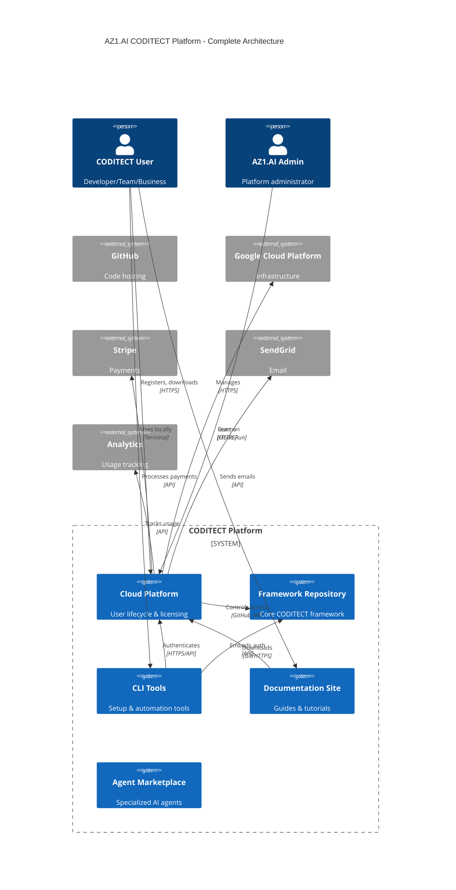

# AZ1.AI CODITECT Platform Rollout - Master Plan

**Copyright © 2025 AZ1.AI INC. All Rights Reserved.**
**Developed by Hal Casteel, Founder/CEO/CTO, AZ1.AI INC.**

**Status**: Phase 1 - Architecture & Planning
**Last Updated:** 2025-11-15

---

## Executive Summary

Complete infrastructure buildout plan for AZ1.AI CODITECT commercial rollout. This plan identifies all necessary components, organizes them into discrete projects, and applies the full CODITECT 1-2-3 methodology to each.

**Total Projects**: 8 major components
**Timeline**: 6 months (Q4 2025 → Q2 2026)
**Budget Estimate**: $850K total investment
**Team**: 8-12 engineers (full-time + contractors)

---

## Component Architecture Map

### Platform Architecture Diagram



---

## Project Breakdown

### **Project 1: CODITECT Cloud Platform (Backend)**

**Directory**: `~/PROJECTS/coditect-cloud-backend/`

**Description**: SaaS platform for user lifecycle management

**Tech Stack**:
- FastAPI (Python 3.11+)
- PostgreSQL 15 (user data, licenses, audit logs)
- Redis 7 (caching, sessions, rate limiting)
- Celery (background tasks)
- Alembic (database migrations)

**Features**:
- User registration & email verification
- GitHub OAuth authentication
- License management (EULA, NDA acceptance & tracking)
- Token generation & authentication (JWT + long-lived API tokens)
- Framework download control & logging
- Session tracking & analytics
- Admin API for user management
- Audit logging (all actions tracked)
- Automated offboarding & IP revocation

**API Endpoints** (RESTful):
```
/api/v1/auth/register
/api/v1/auth/login
/api/v1/auth/verify-email
/api/v1/auth/device (OAuth device flow)
/api/v1/licenses/accept
/api/v1/licenses/status
/api/v1/tokens/create
/api/v1/tokens/revoke
/api/v1/tokens/list
/api/v1/framework/download
/api/v1/framework/versions
/api/v1/sessions/track
/api/v1/admin/users (CRUD)
/api/v1/admin/audit-logs
/api/v1/admin/analytics
```

**Timeline**: 12 weeks
**Team**: 2 backend engineers + 1 DevOps
**Budget**: $135,000

---

### **Project 2: CODITECT Cloud Platform (Frontend)**

**Directory**: `~/PROJECTS/coditect-cloud-frontend/`

**Description**: Web application for users and admins

**Tech Stack**:
- React 18 + TypeScript
- TailwindCSS (styling)
- Vite (build tool)
- TanStack Query (data fetching)
- React Router (navigation)
- Zustand (state management)
- Radix UI (accessible components)

**Pages & Features**:

**Public Pages**:
- Landing page (marketing)
- Pricing page
- Documentation portal (embedded)
- Login/Register pages

**User Portal**:
- Dashboard (overview, recent activity)
- Profile management
- License agreements view
- Token management (create, view, revoke)
- Download history
- Session history
- Usage analytics
- Support ticket system

**Admin Dashboard**:
- User management (list, search, approve, suspend, offboard)
- License overview (acceptance rates, versions)
- Token management (view all tokens, bulk revoke)
- Session monitoring (active sessions, usage stats)
- Audit log viewer (filterable, exportable)
- Analytics dashboard (user growth, downloads, engagement)
- System health monitoring

**Timeline**: 10 weeks
**Team**: 2 frontend engineers + 1 UI/UX designer
**Budget**: $110,000

---

### **Project 3: CODITECT CLI Tools**

**Directory**: `~/PROJECTS/coditect-cli/`

**Description**: Command-line tools for local operations

**Tech Stack**:
- Python 3.11+ (core CLI)
- Click or Typer (CLI framework)
- Rich (beautiful terminal output)
- Requests (HTTP client)
- GitPython (Git operations)
- PyInstaller (binary distribution)

**Tools**:

**coditect** (main CLI):
```bash
coditect init              # Initialize new project
coditect login             # Authenticate with cloud platform
coditect download          # Download/update framework
coditect status            # Show authentication & framework status
coditect logout            # Logout & clear tokens
coditect version           # Show CLI version
```

**coditect-git** (Git automation):
```bash
coditect-git start "session description"  # Start work session
coditect-git commit "message"             # Auto-commit changes
coditect-git push                         # Push to remote
coditect-git sync                         # Pull from remote
coditect-git pr "title"                   # Create pull request
coditect-git end                          # End session
coditect-git status                       # Show Git & session status
```

**coditect-setup** (Interactive setup):
```bash
coditect-setup             # Full interactive setup wizard
coditect-setup --quick     # Quick setup with defaults
```

**Features**:
- Offline mode support
- Configuration management (~/.coditect/config.json)
- Automatic updates (self-update command)
- Cross-platform (macOS, Linux, Windows)
- Beautiful CLI with progress bars, spinners
- Error handling with helpful messages
- Shell completion (bash, zsh, fish)

**Timeline**: 8 weeks
**Team**: 1 CLI engineer + 1 Python developer
**Budget**: $75,000

---

### **Project 4: CODITECT Documentation Site**

**Directory**: `~/PROJECTS/coditect-docs/`

**Description**: Comprehensive documentation and learning platform

**Tech Stack**:
- Docusaurus or VitePress (static site generator)
- Markdown (content)
- Mermaid (diagrams)
- Algolia DocSearch (search)
- Vercel or Netlify (hosting)

**Documentation Sections**:

**Getting Started**:
- What is CODITECT?
- Installation & setup
- Quick start guide
- First project tutorial
- Video walkthroughs

**Guides**:
- CODITECT 1-2-3 Methodology
  - Phase 1: Discovery & Validation
  - Phase 2: Strategy & Planning
  - Phase 3: Execution & Delivery
- C4 Architecture Methodology
- Multi-LLM CLI Integration
- Git Workflow Automation
- Session Management & MEMORY-CONTEXT
- Platform Evolution Roadmap

**Reference**:
- CLI Commands Reference
- API Documentation (auto-generated from OpenAPI)
- Configuration Options
- Templates & Examples
- ADR Library
- Mermaid Diagram Examples

**Tutorials**:
- Project Planning Tutorial
- Architecture Design Tutorial
- Task Management Tutorial
- Git Workflow Tutorial
- Team Collaboration Tutorial

**Resources**:
- Case Studies
- Best Practices
- FAQ
- Troubleshooting Guide
- Community Forum (Discourse integration)
- Blog (platform updates, tips)

**Features**:
- Search (Algolia)
- Dark/light mode
- Multi-language support (future)
- Interactive examples
- Embedded videos
- PDF exports
- Versioned docs (track framework versions)

**Timeline**: 6 weeks
**Team**: 1 technical writer + 1 frontend developer
**Budget**: $55,000

---

### **Project 5: Agent Marketplace & Registry**

**Directory**: `~/PROJECTS/coditect-agent-marketplace/`

**Description**: Discover, share, and manage specialized AI agents

**Tech Stack**:
- Next.js 14 (full-stack framework)
- PostgreSQL (agent metadata)
- GitHub (agent source code)
- Algolia (search)
- Stripe (paid agents - future)

**Features**:

**Agent Discovery**:
- Browse agents by category (development, testing, documentation, etc.)
- Search with filters (language, framework, rating)
- Agent detail pages (description, usage, examples, ratings)
- Featured agents & collections
- Trending agents

**Agent Management**:
- Agent submission (developers can submit agents)
- Version control (track agent versions)
- Dependencies & compatibility
- Installation instructions
- Usage analytics

**Agent Metadata Schema**:
```json
{
  "id": "uuid",
  "name": "agent-name",
  "version": "1.0.0",
  "description": "What this agent does",
  "author": "user-id",
  "category": ["development", "testing"],
  "tags": ["python", "pytest", "automation"],
  "repository": "github-url",
  "documentation": "docs-url",
  "dependencies": ["agent-id-1", "agent-id-2"],
  "llm_compatibility": ["claude", "gemini", "grok"],
  "downloads": 12500,
  "rating": 4.8,
  "reviews": 156,
  "license": "MIT",
  "created_at": "timestamp",
  "updated_at": "timestamp"
}
```

**Installation**:
```bash
coditect agent install agent-name
coditect agent list
coditect agent update agent-name
coditect agent remove agent-name
```

**Timeline**: 10 weeks
**Team**: 2 full-stack engineers
**Budget**: $95,000

---

### **Project 6: Analytics & Monitoring Platform**

**Directory**: `~/PROJECTS/coditect-analytics/`

**Description**: Usage tracking, monitoring, and business intelligence

**Tech Stack**:
- Python (data processing)
- PostgreSQL (metrics storage)
- ClickHouse (time-series analytics)
- Grafana (visualization)
- Prometheus (metrics collection)
- Sentry (error tracking)

**Metrics Tracked**:

**User Metrics**:
- User registrations (daily, weekly, monthly)
- Active users (DAU, WAU, MAU)
- User retention (cohort analysis)
- Churn rate
- User journey funnels

**Product Metrics**:
- Framework downloads
- CLI usage (commands executed)
- Agent installations
- Project creations
- Session durations
- Feature adoption rates

**Technical Metrics**:
- API response times (p50, p95, p99)
- Error rates
- Uptime (SLA tracking)
- Database query performance
- Infrastructure costs

**Business Metrics**:
- MRR (Monthly Recurring Revenue) - future
- Conversion rates (trial → paid)
- Customer acquisition cost (CAC)
- Lifetime value (LTV)
- NPS (Net Promoter Score)

**Dashboards**:
- Executive Dashboard (high-level KPIs)
- Product Dashboard (feature usage)
- Engineering Dashboard (system health)
- Marketing Dashboard (growth metrics)

**Timeline**: 6 weeks
**Team**: 1 data engineer + 1 backend engineer
**Budget**: $65,000

---

### **Project 7: Infrastructure & DevOps**

**Directory**: `~/PROJECTS/coditect-infrastructure/`

**Description**: Infrastructure as Code, CI/CD, and deployment automation

**Tech Stack**:
- Terraform (infrastructure provisioning)
- Docker (containerization)
- Kubernetes or Cloud Run (orchestration)
- GitHub Actions (CI/CD)
- GCP (primary cloud provider)

**Infrastructure Components**:

**GCP Services**:
- Cloud Run (API + web hosting)
- Cloud SQL (PostgreSQL)
- Cloud Storage (framework downloads, backups)
- Cloud CDN (static assets)
- Cloud Load Balancing
- Cloud Logging & Monitoring
- Secret Manager (credentials)
- Cloud Scheduler (cron jobs)
- Cloud Build (CI/CD)

**Terraform Modules**:
```
infrastructure/
├── modules/
│   ├── networking/
│   ├── database/
│   ├── storage/
│   ├── compute/
│   ├── monitoring/
│   └── security/
├── environments/
│   ├── dev/
│   ├── staging/
│   └── production/
└── shared/
```

**CI/CD Pipelines**:

**Backend Pipeline**:
1. Lint & format (black, flake8)
2. Unit tests (pytest)
3. Integration tests
4. Security scan (Snyk, safety)
5. Build Docker image
6. Push to GCR (Google Container Registry)
7. Deploy to Cloud Run
8. Smoke tests

**Frontend Pipeline**:
1. Lint & format (ESLint, Prettier)
2. Type check (TypeScript)
3. Unit tests (Vitest)
4. Build production bundle
5. Deploy to Vercel/Netlify
6. Visual regression tests (Percy)

**CLI Pipeline**:
1. Lint & format
2. Unit tests
3. Integration tests
4. Build binaries (PyInstaller)
5. Sign binaries
6. Upload to releases

**Monitoring & Alerting**:
- Uptime monitoring (Pingdom)
- Error tracking (Sentry)
- Log aggregation (Cloud Logging)
- Metrics (Prometheus + Grafana)
- Alerts (PagerDuty for critical, email for warnings)

**Disaster Recovery**:
- Automated backups (daily full, hourly incremental)
- Point-in-time recovery (PostgreSQL)
- Multi-region deployment (future)
- Runbooks for common incidents

**Timeline**: 8 weeks (ongoing maintenance)
**Team**: 1 DevOps engineer + 1 SRE
**Budget**: $85,000

---

### **Project 8: Legal & Compliance**

**Directory**: `~/PROJECTS/coditect-legal/`

**Description**: Legal documents, compliance tracking, and IP protection

**Components**:

**Legal Documents**:
- End User License Agreement (EULA)
- Non-Disclosure Agreement (NDA)
- Terms of Service
- Privacy Policy
- Acceptable Use Policy
- Service Level Agreement (SLA)
- Data Processing Agreement (DPA) - for EU customers

**Compliance**:
- GDPR compliance (EU data protection)
- CCPA compliance (California privacy)
- SOC 2 Type II (future)
- ISO 27001 (future)

**IP Protection**:
- Copyright notices (all files)
- Trademark registration (AZ1.AI, CODITECT)
- Patent filings (if applicable)
- Open source license audit

**Deliverables**:
- Legal document templates (Markdown + PDF)
- Compliance checklist
- Privacy policy generator
- Cookie consent banner
- Terms acceptance tracking

**Timeline**: 4 weeks
**Team**: 1 lawyer + 1 compliance specialist (contractors)
**Budget**: $35,000

---

## Implementation Roadmap

### Phase 1: Foundation (Months 1-2)

**Projects**: Cloud Backend, Infrastructure, Legal

**Milestones**:
- Week 2: Infrastructure provisioned (GCP project, databases, networking)
- Week 4: Backend API v1 (auth, user registration)
- Week 6: License acceptance system working
- Week 8: Token generation & authentication complete

**Deliverables**:
- Working backend API (deployed to staging)
- Infrastructure as Code (Terraform)
- Legal documents finalized
- CI/CD pipelines operational

---

### Phase 2: User Experience (Months 3-4)

**Projects**: Cloud Frontend, CLI Tools, Documentation

**Milestones**:
- Week 10: Frontend v1 (user portal)
- Week 12: CLI tools beta release
- Week 14: Admin dashboard complete
- Week 16: Documentation site live

**Deliverables**:
- User portal (deployed to production)
- Admin dashboard (deployed to production)
- CLI tools (beta release for testing)
- Documentation site (docs.coditect.ai)

---

### Phase 3: Scale & Enhance (Months 5-6)

**Projects**: Agent Marketplace, Analytics

**Milestones**:
- Week 18: Agent marketplace MVP
- Week 20: Analytics dashboards live
- Week 22: Beta testing with 50+ users
- Week 24: Public launch

**Deliverables**:
- Agent marketplace (deployed to production)
- Analytics platform (internal + user-facing)
- Beta testing complete
- Public launch materials

---

## Budget Summary

| Project | Timeline | Team | Budget |
|---------|----------|------|--------|
| 1. Cloud Backend | 12 weeks | 3 | $135,000 |
| 2. Cloud Frontend | 10 weeks | 3 | $110,000 |
| 3. CLI Tools | 8 weeks | 2 | $75,000 |
| 4. Documentation | 6 weeks | 2 | $55,000 |
| 5. Agent Marketplace | 10 weeks | 2 | $95,000 |
| 6. Analytics | 6 weeks | 2 | $65,000 |
| 7. Infrastructure | 8 weeks | 2 | $85,000 |
| 8. Legal | 4 weeks | 2 | $35,000 |
| **TOTAL** | **6 months** | **8-12** | **$655,000** |

**Additional Costs**:
- Infrastructure (GCP): $5,000/month × 6 = $30,000
- External services (SendGrid, Stripe, etc.): $1,500/month × 6 = $9,000
- Design & branding: $25,000
- Marketing & launch: $50,000
- Contingency (15%): $115,000

**Grand Total**: $884,000

---

## Success Metrics

### Month 3 (MVP)
- [ ] 50 registered users
- [ ] Backend API operational (99.5% uptime)
- [ ] User portal functional
- [ ] CLI tools in beta

### Month 6 (Public Launch)
- [ ] 500 registered users
- [ ] 50 active projects using CODITECT
- [ ] 99.9% uptime SLA
- [ ] NPS > 50
- [ ] Documentation coverage 100%
- [ ] Agent marketplace with 20+ agents

### Month 12 (Growth)
- [ ] 5,000 registered users
- [ ] 100 paid accounts
- [ ] $50K MRR (Monthly Recurring Revenue)
- [ ] 99.95% uptime
- [ ] SOC 2 Type II certified
- [ ] 100+ agents in marketplace

---

## Risk Assessment

| Risk | Probability | Impact | Mitigation |
|------|-------------|--------|------------|
| GCP outage | Low | High | Multi-region backup plan |
| Security breach | Medium | Critical | Penetration testing, bug bounty |
| Slow user adoption | Medium | High | Strong marketing, early feedback |
| Team bandwidth | High | Medium | Hire contractors, prioritize ruthlessly |
| Budget overrun | Medium | High | 15% contingency, weekly reviews |
| Competitor entry | Low | Medium | Fast iteration, unique IP |

---

## Next Steps

### Immediate Actions (Week 1)

1. **Setup Project Structure**:
   ```bash
   cd ~/PROJECTS
   mkdir coditect-cloud-backend
   mkdir coditect-cloud-frontend
   mkdir coditect-cli
   mkdir coditect-docs
   mkdir coditect-agent-marketplace
   mkdir coditect-analytics
   mkdir coditect-infrastructure
   mkdir coditect-legal
   ```

2. **Initialize Each Project**:
   - Create PROJECT-PLAN.md (using CODITECT template)
   - Create TASKLIST.md with checkboxes
   - Create ADRs for key decisions
   - Create C4 architecture diagrams
   - Initialize Git repository
   - Setup GitHub remote
   - Configure .gitignore (use universal template)

3. **GCP Setup**:
   - Create GCP organization
   - Setup billing
   - Create projects (dev, staging, production)
   - Configure IAM & permissions

4. **Team Onboarding**:
   - Hire backend engineers (2)
   - Hire frontend engineers (2)
   - Hire DevOps engineer (1)
   - Contract legal counsel

### Week 2-4

- Begin backend API development (Sprint 1)
- Finalize infrastructure architecture
- Complete legal documents
- Setup CI/CD pipelines

---

**Copyright © 2025 AZ1.AI INC. All Rights Reserved.**
**Developed by Hal Casteel, Founder/CEO/CTO, AZ1.AI INC.**

**Status**: Ready for Implementation
**Next Review**: Weekly during execution
