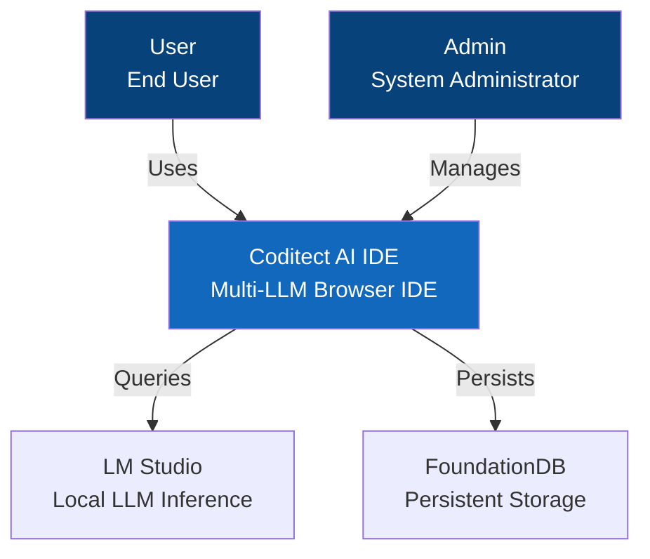
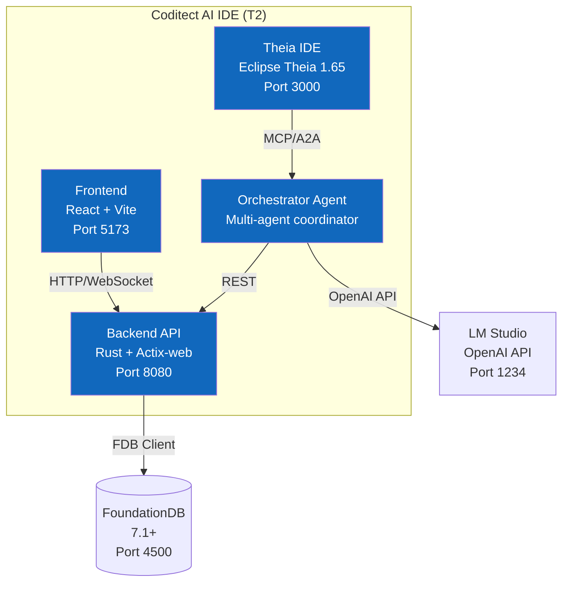
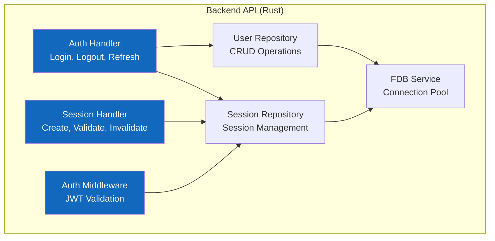

# Framework Patterns

Expert skill for event-driven systems, FSMs, architecture modeling, and reactive patterns.

## When to Use

✅ **Use this skill when:**
- Implementing event-driven architecture (decoupled systems)
- Designing finite state machines (FSM) for workflows/processes
- Creating C4 architecture diagrams (Context, Container, Component, Code)
- Building reactive systems (event streams, observables)
- Modeling complex workflows (multi-state processes)
- Documenting system architecture (visual + code patterns)
- Time savings: 60% faster architecture design (3h→1h)
- Proven: Used for T2 session management FSM, auth event flows

❌ **Don't use this skill when:**
- Simple CRUD operations (no state machine needed)
- Synchronous request/response only (no events)
- Single-file scripts (architecture overhead not worth it)
- Prototypes without architectural requirements

## Event-Driven Architecture

### Core Concepts

**Event:** Immutable fact that something happened
- Examples: `UserLoggedIn`, `SessionCreated`, `TokenExpired`
- Properties: `event_id`, `timestamp`, `event_type`, `payload`, `metadata`

**Event Producer:** Component that emits events
- Examples: Auth handler, Session manager, Workflow engine

**Event Consumer:** Component that reacts to events
- Examples: Audit logger, Notification service, Metrics collector

**Event Bus:** Central hub for event routing
- Decouples producers from consumers
- Enables async processing

### Event Pattern Template

```rust
// Event definition
#[derive(Debug, Clone, Serialize, Deserialize)]
pub struct Event {
    pub event_id: Uuid,
    pub timestamp: DateTime<Utc>,
    pub event_type: EventType,
    pub payload: serde_json::Value,
    pub metadata: EventMetadata,
}

#[derive(Debug, Clone, Serialize, Deserialize)]
pub enum EventType {
    UserLoggedIn,
    UserLoggedOut,
    SessionCreated,
    SessionInvalidated,
    TokenRefreshed,
    WorkflowStateChanged,
}

// Event producer
pub trait EventProducer {
    async fn emit(&self, event: Event) -> Result<(), EventError>;
}

// Event consumer
pub trait EventConsumer {
    async fn handle(&self, event: Event) -> Result<(), EventError>;
    fn event_types(&self) -> Vec<EventType>;
}

// Event bus
pub struct EventBus {
    consumers: HashMap<EventType, Vec<Box<dyn EventConsumer>>>,
}

impl EventBus {
    pub async fn publish(&self, event: Event) -> Result<(), EventError> {
        if let Some(consumers) = self.consumers.get(&event.event_type) {
            for consumer in consumers {
                consumer.handle(event.clone()).await?;
            }
        }
        Ok(())
    }
}
```

### Event-Driven Workflow Example

```rust
// Login event flow
async fn login_handler(
    credentials: LoginRequest,
    event_bus: Arc<EventBus>,
    fdb: Arc<FDBService>,
) -> Result<HttpResponse, ApiError> {
    // 1. Validate credentials
    let user = fdb.users().verify_credentials(&credentials).await?;

    // 2. Create session
    let session = fdb.sessions().create(&user.user_id).await?;

    // 3. Generate JWT
    let token = generate_jwt(&session)?;

    // 4. Emit event (async, non-blocking)
    event_bus.publish(Event {
        event_id: Uuid::new_v4(),
        timestamp: Utc::now(),
        event_type: EventType::UserLoggedIn,
        payload: json!({
            "user_id": user.user_id,
            "session_id": session.session_id,
            "ip_address": get_client_ip(),
        }),
        metadata: EventMetadata::default(),
    }).await?;

    // 5. Return response (don't wait for event processing)
    Ok(HttpResponse::Ok().json(LoginResponse { token, session }))
}

// Event consumers (triggered by event)
struct AuditLogger;
impl EventConsumer for AuditLogger {
    async fn handle(&self, event: Event) -> Result<(), EventError> {
        // Log to FDB audit table
        log_audit_event(event).await
    }

    fn event_types(&self) -> Vec<EventType> {
        vec![EventType::UserLoggedIn, EventType::UserLoggedOut]
    }
}

struct MetricsCollector;
impl EventConsumer for MetricsCollector {
    async fn handle(&self, event: Event) -> Result<(), EventError> {
        // Update login metrics
        increment_counter("user_logins_total").await
    }

    fn event_types(&self) -> Vec<EventType> {
        vec![EventType::UserLoggedIn]
    }
}
```

## Finite State Machines (FSM)

### Core Concepts

**State:** Discrete condition of the system
- Examples: `IDLE`, `RUNNING`, `PAUSED`, `COMPLETED`, `FAILED`

**Transition:** Movement from one state to another
- Triggered by: Events, commands, conditions

**Guard:** Condition that must be true for transition
- Examples: `user.is_active`, `token_not_expired`

**Action:** Side effect when entering/exiting state
- Examples: Send notification, update database

### FSM Pattern Template

```rust
// State enum
#[derive(Debug, Clone, Copy, PartialEq, Eq, Hash, Serialize, Deserialize)]
pub enum State {
    Idle,
    Running,
    Paused,
    Completed,
    Failed,
}

// Event/trigger enum
#[derive(Debug, Clone, PartialEq, Eq)]
pub enum Trigger {
    Start,
    Pause,
    Resume,
    Complete,
    Fail(String),
}

// State machine
pub struct StateMachine {
    current_state: State,
    transitions: HashMap<(State, Trigger), State>,
    guards: HashMap<(State, Trigger), Box<dyn Fn() -> bool>>,
    on_enter: HashMap<State, Box<dyn Fn()>>,
    on_exit: HashMap<State, Box<dyn Fn()>>,
}

impl StateMachine {
    pub fn new() -> Self {
        let mut transitions = HashMap::new();

        // Define valid transitions
        transitions.insert((State::Idle, Trigger::Start), State::Running);
        transitions.insert((State::Running, Trigger::Pause), State::Paused);
        transitions.insert((State::Paused, Trigger::Resume), State::Running);
        transitions.insert((State::Running, Trigger::Complete), State::Completed);
        // ... more transitions

        Self {
            current_state: State::Idle,
            transitions,
            guards: HashMap::new(),
            on_enter: HashMap::new(),
            on_exit: HashMap::new(),
        }
    }

    pub fn transition(&mut self, trigger: Trigger) -> Result<State, FSMError> {
        let key = (self.current_state, trigger.clone());

        // Check if transition is valid
        let next_state = self.transitions.get(&key)
            .ok_or(FSMError::InvalidTransition {
                from: self.current_state,
                trigger: trigger.clone(),
            })?;

        // Check guard condition
        if let Some(guard) = self.guards.get(&key) {
            if !guard() {
                return Err(FSMError::GuardFailed);
            }
        }

        // Execute exit action
        if let Some(on_exit) = self.on_exit.get(&self.current_state) {
            on_exit();
        }

        // Transition
        let prev_state = self.current_state;
        self.current_state = *next_state;

        // Execute enter action
        if let Some(on_enter) = self.on_enter.get(&self.current_state) {
            on_enter();
        }

        Ok(self.current_state)
    }
}
```

### Recursive Workflow FSM (T2 Pattern)

```rust
// From recursive_workflow command and workflow_validator.py
#[derive(Debug, Clone, Copy, PartialEq, Eq, Hash, Serialize, Deserialize)]
pub enum FSMState {
    INITIATE,
    IDENTIFY,
    DOCUMENT,
    SOLVE,
    CODE,
    DEPLOY,
    TEST,
    VALIDATE,
    COMPLETE,
    CHECKPOINT,
    SUSPENDED,
    ESCALATED,
}

pub struct RecursiveWorkflowFSM {
    state: FSMState,
    iteration_count: u32,
    max_iterations: u32,
}

impl RecursiveWorkflowFSM {
    pub fn new() -> Self {
        Self {
            state: FSMState::INITIATE,
            iteration_count: 0,
            max_iterations: 10,
        }
    }

    pub fn valid_transitions(&self) -> Vec<FSMState> {
        match self.state {
            FSMState::INITIATE => vec![FSMState::IDENTIFY, FSMState::CHECKPOINT],
            FSMState::IDENTIFY => vec![FSMState::DOCUMENT, FSMState::CHECKPOINT, FSMState::ESCALATED],
            FSMState::DOCUMENT => vec![FSMState::SOLVE, FSMState::CHECKPOINT],
            FSMState::SOLVE => vec![FSMState::CODE, FSMState::IDENTIFY, FSMState::CHECKPOINT],
            FSMState::CODE => vec![FSMState::DEPLOY, FSMState::SOLVE, FSMState::CHECKPOINT],
            FSMState::DEPLOY => vec![FSMState::TEST, FSMState::CODE, FSMState::CHECKPOINT],
            FSMState::TEST => vec![
                FSMState::VALIDATE,
                FSMState::IDENTIFY,  // Traceback: misidentified issue
                FSMState::SOLVE,     // Traceback: wrong approach
                FSMState::CODE,      // Traceback: implementation error
                FSMState::CHECKPOINT
            ],
            FSMState::VALIDATE => vec![FSMState::COMPLETE, FSMState::IDENTIFY, FSMState::CHECKPOINT],
            FSMState::COMPLETE => vec![],  // Terminal state
            FSMState::CHECKPOINT => vec![FSMState::SUSPENDED],
            FSMState::SUSPENDED => vec![],  // Can resume to any saved state
            FSMState::ESCALATED => vec![],  // Terminal state
        }
    }

    pub fn traceback(&mut self, failure_type: &str) -> FSMState {
        self.iteration_count += 1;

        if self.iteration_count >= self.max_iterations {
            return FSMState::ESCALATED;
        }

        match failure_type {
            "implementation_error" => FSMState::CODE,
            "wrong_approach" => FSMState::SOLVE,
            "misidentified_issue" => FSMState::IDENTIFY,
            "missing_context" => FSMState::DOCUMENT,
            "deployment_failure" => FSMState::DEPLOY,
            _ => FSMState::ESCALATED,
        }
    }
}
```

## C4 Architecture Modeling

### C4 Model Levels

**Level 1: Context Diagram** - System boundary and external actors
- Shows: System, users, external systems
- Abstraction: Highest (birds-eye view)

**Level 2: Container Diagram** - Major components and tech stack
- Shows: Web app, backend API, database, message queue
- Abstraction: High (deployment units)

**Level 3: Component Diagram** - Internal structure of containers
- Shows: Controllers, services, repositories
- Abstraction: Medium (code organization)

**Level 4: Code Diagram** - Class/function level details
- Shows: Classes, methods, relationships
- Abstraction: Lowest (implementation)

### C4 Mermaid Templates

#### Level 1: Context Diagram



#### Level 2: Container Diagram



#### Level 3: Component Diagram



### Generating C4 Diagrams from Code

See `core/generate_c4_diagram.py` for automated C4 diagram generation from codebase analysis.

## Reactive Programming Patterns

### Observer Pattern

```rust
// Subject (Observable)
pub trait Observable<T> {
    fn subscribe(&mut self, observer: Box<dyn Observer<T>>);
    fn notify(&self, value: T);
}

// Observer
pub trait Observer<T> {
    fn update(&self, value: T);
}

// Example: Session expiry notifications
struct SessionExpiryNotifier {
    observers: Vec<Box<dyn Observer<Session>>>,
}

impl Observable<Session> for SessionExpiryNotifier {
    fn subscribe(&mut self, observer: Box<dyn Observer<Session>>) {
        self.observers.push(observer);
    }

    fn notify(&self, session: Session) {
        for observer in &self.observers {
            observer.update(session.clone());
        }
    }
}

// Observers
struct LogObserver;
impl Observer<Session> for LogObserver {
    fn update(&self, session: Session) {
        println!("Session expired: {}", session.session_id);
    }
}

struct MetricsObserver;
impl Observer<Session> for MetricsObserver {
    fn update(&self, session: Session) {
        increment_counter("sessions_expired_total");
    }
}
```

### Reactive Streams (Rust Tokio)

```rust
use tokio::sync::mpsc;
use tokio_stream::{wrappers::ReceiverStream, StreamExt};

// Create event stream
let (tx, rx) = mpsc::channel::<Event>(100);
let stream = ReceiverStream::new(rx);

// Transform stream
let processed = stream
    .filter(|event| event.event_type == EventType::UserLoggedIn)
    .map(|event| transform_event(event))
    .buffer_unordered(10);  // Process up to 10 concurrently

// Consume stream
tokio::spawn(async move {
    tokio::pin!(processed);
    while let Some(result) = processed.next().await {
        handle_result(result).await;
    }
});

// Emit events
tx.send(Event { /* ... */ }).await.unwrap();
```

## Executable Scripts

See `core/generate_c4_diagram.py` for C4 diagram generation.
See `core/fsm_validator.py` for FSM validation.

## Best Practices

### Event-Driven

✅ **Events are immutable** - Never modify after creation
✅ **Events are facts** - "UserLoggedIn", not "LoginUser"
✅ **Async processing** - Don't block on event handling
✅ **Idempotent consumers** - Handle duplicate events gracefully

❌ **Don't use events for RPC** - Events announce facts, don't command
❌ **Don't block on event emission** - Fire and forget
❌ **Don't couple producers to consumers** - Use event bus

### FSM

✅ **Define all states explicitly** - No implicit states
✅ **Validate transitions** - Reject invalid transitions
✅ **Use guards** - Prevent invalid state changes
✅ **Handle terminal states** - COMPLETE, FAILED, ESCALATED

❌ **Don't allow arbitrary transitions** - Explicit transition table
❌ **Don't ignore iteration limits** - Prevent infinite loops
❌ **Don't skip state validation** - Always check current state

### C4 Modeling

✅ **Start with context** - Level 1 first, then drill down
✅ **Consistent notation** - Use standard C4 shapes
✅ **Focus on relationships** - How components communicate
✅ **Use technology labels** - "Rust + Actix", "React 18"

❌ **Don't mix abstraction levels** - Keep levels separate
❌ **Don't include implementation details in context** - Save for Level 4
❌ **Don't create diagrams manually** - Generate from code when possible

### Reactive

✅ **Use backpressure** - Prevent overwhelming consumers
✅ **Handle errors gracefully** - Don't crash on one bad event
✅ **Compose streams** - Chain transformations
✅ **Cancel when done** - Clean up stream subscriptions

❌ **Don't block streams** - Use async operations
❌ **Don't ignore backpressure** - Respect consumer limits
❌ **Don't leak subscriptions** - Always unsubscribe

## Integration with T2 Project

### Event-Driven Usage

```rust
// T2 uses event-driven for:
// - Audit logging (all auth events)
// - Metrics collection (session stats)
// - Workflow state changes (recursive workflows)
// - Multi-agent coordination (orchestrator events)
```

### FSM Usage

```rust
// T2 uses FSM for:
// - Recursive workflows (INITIATE → IDENTIFY → ... → COMPLETE)
// - Session lifecycle (ACTIVE → EXPIRED → INVALIDATED)
// - Agent coordination (IDLE → DELEGATED → EXECUTING → COMPLETED)
```

### C4 Modeling Usage

```
// T2 uses C4 for:
// - System architecture documentation (Level 1-2)
// - Component design (Level 3)
// - ADR diagrams (all levels)
```

### Reactive Usage

```rust
// T2 uses reactive for:
// - Real-time file system monitoring (file-monitor daemon)
// - WebSocket connections (Theia IDE)
// - Agent event streams (orchestrator coordination)
```

## Templates

See `templates/` directory for:
- `event_driven_template.md` - Event-driven system template
- `state_machine_template.md` - FSM implementation template
- `c4_diagrams.md` - C4 diagram Mermaid examples
- `reactive_streams.md` - Reactive programming patterns
