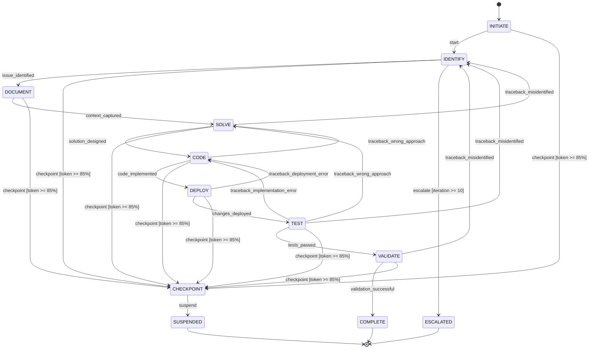

# Finite State Machine Template

## Basic FSM Implementation

```rust
use std::collections::HashMap;
use serde::{Deserialize, Serialize};

#[derive(Debug, Clone, Copy, PartialEq, Eq, Hash, Serialize, Deserialize)]
pub enum State {
    Idle,
    Running,
    Paused,
    Completed,
    Failed,
}

#[derive(Debug, Clone, PartialEq, Eq, Hash)]
pub enum Trigger {
    Start,
    Pause,
    Resume,
    Complete,
    Fail(String),
}

pub struct StateMachine {
    current_state: State,
    transitions: HashMap<(State, String), State>,
    guards: HashMap<(State, String), Box<dyn Fn() -> bool>>,
    on_enter: HashMap<State, Vec<Box<dyn Fn()>>>,
    on_exit: HashMap<State, Vec<Box<dyn Fn()>>>,
}

impl StateMachine {
    pub fn new() -> Self {
        let mut transitions = HashMap::new();

        // Define valid transitions
        transitions.insert((State::Idle, "start".to_string()), State::Running);
        transitions.insert((State::Running, "pause".to_string()), State::Paused);
        transitions.insert((State::Paused, "resume".to_string()), State::Running);
        transitions.insert((State::Running, "complete".to_string()), State::Completed);
        transitions.insert((State::Running, "fail".to_string()), State::Failed);
        transitions.insert((State::Paused, "fail".to_string()), State::Failed);

        Self {
            current_state: State::Idle,
            transitions,
            guards: HashMap::new(),
            on_enter: HashMap::new(),
            on_exit: HashMap::new(),
        }
    }

    pub fn current_state(&self) -> State {
        self.current_state
    }

    pub fn can_transition(&self, trigger: &str) -> bool {
        self.transitions.contains_key(&(self.current_state, trigger.to_string()))
    }

    pub fn transition(&mut self, trigger: &str) -> Result<State, FSMError> {
        let key = (self.current_state, trigger.to_string());

        // Check if transition is valid
        let next_state = self.transitions.get(&key)
            .ok_or_else(|| FSMError::InvalidTransition {
                from: self.current_state,
                trigger: trigger.to_string(),
            })?;

        // Check guard condition
        if let Some(guard) = self.guards.get(&key) {
            if !guard() {
                return Err(FSMError::GuardFailed {
                    from: self.current_state,
                    trigger: trigger.to_string(),
                });
            }
        }

        // Execute exit actions
        if let Some(exit_actions) = self.on_exit.get(&self.current_state) {
            for action in exit_actions {
                action();
            }
        }

        // Transition
        let prev_state = self.current_state;
        self.current_state = *next_state;

        // Execute enter actions
        if let Some(enter_actions) = self.on_enter.get(&self.current_state) {
            for action in enter_actions {
                action();
            }
        }

        info!("State transition: {:?} --[{}]--> {:?}", prev_state, trigger, self.current_state);

        Ok(self.current_state)
    }

    pub fn add_guard<F>(&mut self, from: State, trigger: &str, guard: F)
    where
        F: Fn() -> bool + 'static,
    {
        self.guards.insert((from, trigger.to_string()), Box::new(guard));
    }

    pub fn on_enter_state<F>(&mut self, state: State, action: F)
    where
        F: Fn() + 'static,
    {
        self.on_enter
            .entry(state)
            .or_insert_with(Vec::new)
            .push(Box::new(action));
    }

    pub fn on_exit_state<F>(&mut self, state: State, action: F)
    where
        F: Fn() + 'static,
    {
        self.on_exit
            .entry(state)
            .or_insert_with(Vec::new)
            .push(Box::new(action));
    }
}

#[derive(Debug, thiserror::Error)]
pub enum FSMError {
    #[error("Invalid transition from {from:?} on trigger '{trigger}'")]
    InvalidTransition { from: State, trigger: String },

    #[error("Guard failed for transition from {from:?} on trigger '{trigger}'")]
    GuardFailed { from: State, trigger: String },
}
```

## T2 Recursive Workflow FSM

```rust
#[derive(Debug, Clone, Copy, PartialEq, Eq, Hash, Serialize, Deserialize)]
pub enum WorkflowState {
    INITIATE,
    IDENTIFY,
    DOCUMENT,
    SOLVE,
    CODE,
    DEPLOY,
    TEST,
    VALIDATE,
    COMPLETE,
    CHECKPOINT,
    SUSPENDED,
    ESCALATED,
}

pub struct RecursiveWorkflowFSM {
    state: WorkflowState,
    iteration_count: u32,
    max_iterations: u32,
    token_usage: u32,
    max_tokens: u32,
}

impl RecursiveWorkflowFSM {
    pub fn new() -> Self {
        Self {
            state: WorkflowState::INITIATE,
            iteration_count: 0,
            max_iterations: 10,
            token_usage: 0,
            max_tokens: 160_000,
        }
    }

    pub fn current_state(&self) -> WorkflowState {
        self.state
    }

    pub fn valid_transitions(&self) -> Vec<WorkflowState> {
        match self.state {
            WorkflowState::INITIATE => vec![WorkflowState::IDENTIFY, WorkflowState::CHECKPOINT],
            WorkflowState::IDENTIFY => vec![WorkflowState::DOCUMENT, WorkflowState::CHECKPOINT, WorkflowState::ESCALATED],
            WorkflowState::DOCUMENT => vec![WorkflowState::SOLVE, WorkflowState::CHECKPOINT],
            WorkflowState::SOLVE => vec![WorkflowState::CODE, WorkflowState::IDENTIFY, WorkflowState::CHECKPOINT],
            WorkflowState::CODE => vec![WorkflowState::DEPLOY, WorkflowState::SOLVE, WorkflowState::CHECKPOINT],
            WorkflowState::DEPLOY => vec![WorkflowState::TEST, WorkflowState::CODE, WorkflowState::CHECKPOINT],
            WorkflowState::TEST => vec![
                WorkflowState::VALIDATE,
                WorkflowState::IDENTIFY,
                WorkflowState::SOLVE,
                WorkflowState::CODE,
                WorkflowState::CHECKPOINT
            ],
            WorkflowState::VALIDATE => vec![WorkflowState::COMPLETE, WorkflowState::IDENTIFY, WorkflowState::CHECKPOINT],
            WorkflowState::COMPLETE => vec![],
            WorkflowState::CHECKPOINT => vec![WorkflowState::SUSPENDED],
            WorkflowState::SUSPENDED => vec![],
            WorkflowState::ESCALATED => vec![],
        }
    }

    pub fn can_transition(&self, to_state: WorkflowState) -> bool {
        self.valid_transitions().contains(&to_state)
    }

    pub fn transition(&mut self, to_state: WorkflowState) -> Result<(), FSMError> {
        if !self.can_transition(to_state) {
            return Err(FSMError::InvalidTransition {
                from: self.state,
                trigger: format!("to {:?}", to_state),
            });
        }

        // Auto-checkpoint if token usage high
        if self.token_usage as f32 / self.max_tokens as f32 > 0.85 {
            if to_state != WorkflowState::CHECKPOINT {
                warn!("Token usage at {}%, auto-checkpointing",
                     (self.token_usage as f32 / self.max_tokens as f32 * 100.0) as u32);
                self.state = WorkflowState::CHECKPOINT;
                return Ok(());
            }
        }

        // Check iteration limit
        if self.iteration_count >= self.max_iterations {
            warn!("Iteration limit reached ({}), escalating", self.max_iterations);
            self.state = WorkflowState::ESCALATED;
            return Ok(());
        }

        self.state = to_state;
        Ok(())
    }

    pub fn traceback(&mut self, failure_type: &str) -> WorkflowState {
        self.iteration_count += 1;

        if self.iteration_count >= self.max_iterations {
            return WorkflowState::ESCALATED;
        }

        match failure_type {
            "implementation_error" => WorkflowState::CODE,
            "wrong_approach" => WorkflowState::SOLVE,
            "misidentified_issue" => WorkflowState::IDENTIFY,
            "missing_context" => WorkflowState::DOCUMENT,
            "deployment_failure" => WorkflowState::DEPLOY,
            _ => WorkflowState::ESCALATED,
        }
    }

    pub fn add_token_usage(&mut self, tokens: u32) {
        self.token_usage += tokens;
    }

    pub fn reset_iteration_count(&mut self) {
        self.iteration_count = 0;
    }
}
```

## FDB Persistence

```rust
use uuid::Uuid;
use chrono::{DateTime, Utc};

#[derive(Debug, Clone, Serialize, Deserialize)]
pub struct WorkflowStateRecord {
    pub workflow_id: Uuid,
    pub session_id: Uuid,
    pub tenant_id: Uuid,
    pub current_state: WorkflowState,
    pub iteration_count: u32,
    pub token_usage: u32,
    pub created_at: DateTime<Utc>,
    pub updated_at: DateTime<Utc>,
}

impl WorkflowStateRecord {
    pub async fn save(&self, fdb: &FDBService) -> Result<(), FSMError> {
        let key = format!(
            "/{}/workflows/{}/state",
            self.tenant_id,
            self.workflow_id
        );
        let value = serde_json::to_vec(self)?;

        let trx = fdb.create_transaction()?;
        trx.set(&key.as_bytes(), &value);
        trx.commit().await?;

        Ok(())
    }

    pub async fn load(
        workflow_id: &Uuid,
        tenant_id: &Uuid,
        fdb: &FDBService
    ) -> Result<Option<Self>, FSMError> {
        let key = format!("/{}/workflows/{}/state", tenant_id, workflow_id);

        let trx = fdb.create_transaction()?;
        if let Some(value) = trx.get(&key.as_bytes()).await? {
            let record: WorkflowStateRecord = serde_json::from_slice(&value)?;
            Ok(Some(record))
        } else {
            Ok(None)
        }
    }
}

#[derive(Debug, Clone, Serialize, Deserialize)]
pub struct StateTransition {
    pub transition_id: Uuid,
    pub workflow_id: Uuid,
    pub from_state: WorkflowState,
    pub to_state: WorkflowState,
    pub reason: String,
    pub timestamp: DateTime<Utc>,
}

impl StateTransition {
    pub async fn save(&self, fdb: &FDBService, tenant_id: &Uuid) -> Result<(), FSMError> {
        let key = format!(
            "/{}/workflows/{}/transitions/{}",
            tenant_id,
            self.workflow_id,
            self.transition_id
        );
        let value = serde_json::to_vec(self)?;

        let trx = fdb.create_transaction()?;
        trx.set(&key.as_bytes(), &value);
        trx.commit().await?;

        Ok(())
    }
}
```

## Usage Example

```rust
#[tokio::main]
async fn main() -> Result<(), Box<dyn std::error::Error>> {
    // Create FSM
    let mut fsm = RecursiveWorkflowFSM::new();

    // Workflow execution
    fsm.transition(WorkflowState::IDENTIFY)?;
    fsm.add_token_usage(5000);

    fsm.transition(WorkflowState::DOCUMENT)?;
    fsm.add_token_usage(8000);

    fsm.transition(WorkflowState::SOLVE)?;
    fsm.add_token_usage(12000);

    fsm.transition(WorkflowState::CODE)?;
    fsm.add_token_usage(20000);

    fsm.transition(WorkflowState::DEPLOY)?;
    fsm.add_token_usage(5000);

    fsm.transition(WorkflowState::TEST)?;
    fsm.add_token_usage(10000);

    // Test failed - traceback
    let target_state = fsm.traceback("implementation_error");
    fsm.transition(target_state)?;

    // Fixed, continue
    fsm.transition(WorkflowState::DEPLOY)?;
    fsm.transition(WorkflowState::TEST)?;
    fsm.transition(WorkflowState::VALIDATE)?;
    fsm.transition(WorkflowState::COMPLETE)?;

    println!("Workflow completed in {} iterations", fsm.iteration_count);

    Ok(())
}
```

## Best Practices

### ✅ DO

- **Define all states explicitly** - No implicit states
- **Validate transitions** - Reject invalid transitions early
- **Use guards for conditions** - Prevent invalid state changes
- **Handle terminal states** - COMPLETE, FAILED, ESCALATED
- **Persist state changes** - Store in FDB for recovery
- **Record state history** - Audit trail of transitions

### ❌ DON'T

- **Don't allow arbitrary transitions** - Use explicit transition table
- **Don't ignore iteration limits** - Prevent infinite loops
- **Don't skip state validation** - Always check current state
- **Don't forget error states** - Handle failures explicitly
- **Don't lose state on restart** - Persist to FDB

## State Diagram


