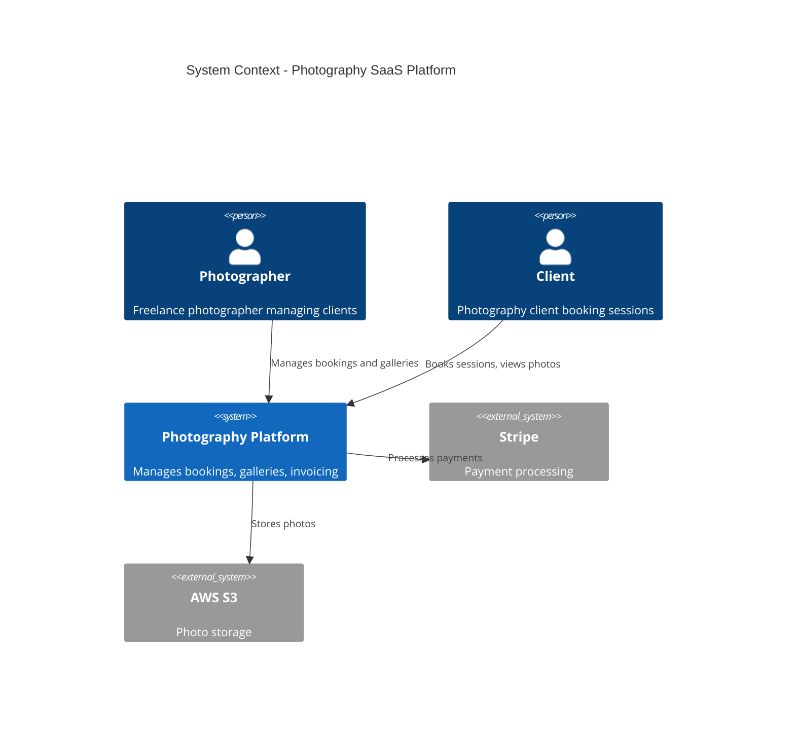

# CODITECT Operator FAQ

> **Frequently Asked Questions for CODITECT Operators**
> **Last Updated:** 2025-11-16
> **Version:** 1.0

---

## Table of Contents

- [Getting Started](#getting-started)
- [Environment Setup](#environment-setup)
- [Agent Invocation](#agent-invocation)
- [Business Discovery](#business-discovery)
- [Technical Specification](#technical-specification)
- [Project Management](#project-management)
- [Session Management](#session-management)
- [Troubleshooting](#troubleshooting)
- [Best Practices](#best-practices)
- [Advanced Topics](#advanced-topics)

---

## Getting Started

### Q: What is CODITECT?

**A:** CODITECT is a comprehensive multi-agent AI development framework that enables systematic, high-quality software project specification and development. It consists of 50 specialized AI agents, 189 reusable skills, 72 workflow commands, and automation scripts that work together to take projects from initial idea through production deployment.

### Q: Who should use CODITECT?

**A:** CODITECT is designed for:
- **Technical Founders:** Who need to spec projects before hiring developers
- **Product Managers:** Creating detailed requirements and specifications
- **Technical Architects:** Designing complex system architectures
- **Development Teams:** Standardizing project planning and documentation
- **Consultants:** Delivering comprehensive project specifications to clients
- **Entrepreneurs:** Validating business ideas with thorough market and technical analysis

### Q: How long does it take to become proficient?

**A:** With the structured training program:
- **30 minutes:** Basic competency (can initialize projects, invoke agents)
- **4-6 hours:** Complete training (all 5 modules)
- **1-2 projects:** Practical mastery (independent operation)
- **5+ projects:** Expert level (can train others)

The goal is a **very fast path to capable operator** who can work independently.

### Q: Do I need to know how to code?

**A:** No programming knowledge required for business discovery and specification work. However, understanding technical concepts helps when creating technical specifications. The agents do the heavy lifting - you orchestrate them.

### Q: What's the difference between CODITECT and Claude Code?

**A:**
- **Claude Code:** Anthropic's official CLI for Claude - the underlying AI platform
- **CODITECT:** A specialized framework built ON TOP of Claude Code with pre-configured agents, skills, commands, and workflows for software project development

Think of Claude Code as the engine, CODITECT as the complete vehicle with navigation, controls, and specialized tools.

---

## Environment Setup

### Q: What are the prerequisites?

**A:** Required:
- macOS, Linux, or Windows with WSL2
- Claude Code installed and configured
- Git installed
- GitHub account (for repository management)
- Terminal/command line familiarity

Optional but recommended:
- VS Code or similar text editor
- Basic understanding of git commands
- Familiarity with markdown

### Q: How do I initialize my first CODITECT project?

**A:** Two methods:

**Method 1: Automated Script (Recommended)**
```bash
cd /path/to/coditect-rollout-master
./scripts/coditect-project-init.sh
# Follow the prompts
```

**Method 2: Manual Setup**
```bash
mkdir -p ~/PROJECTS/my-project
cd ~/PROJECTS/my-project
git submodule add https://github.com/coditect-ai/coditect-core.git .coditect
ln -s .coditect .claude
mkdir -p MEMORY-CONTEXT/{sessions,decisions,business,technical}
mkdir -p docs/{research,business,architecture,decisions}
git init
```

### Q: What if the initialization script fails?

**A:** Common issues:

**Error: "git submodule add failed"**
```bash
# Solution: Initialize git first
git init
git submodule add https://github.com/coditect-ai/coditect-core.git .coditect
```

**Error: "Permission denied"**
```bash
# Solution: Make script executable
chmod +x scripts/coditect-project-init.sh
./scripts/coditect-project-init.sh
```

**Error: "Directory already exists"**
```bash
# Solution: Choose a different project name or remove existing directory
rm -rf ~/PROJECTS/conflicting-project-name
```

### Q: Why is `.claude` a symlink to `.coditect`?

**A:** Claude Code requires a `.claude` directory by convention. We use `.coditect` as the canonical name (more descriptive) and symlink `.claude` to it. This provides:
- Compatibility with Claude Code expectations
- Clear branding (you know you're using CODITECT)
- Single source of truth (no duplicate directories)

### Q: Can I have multiple CODITECT projects?

**A:** Yes! Best practice structure:
```
~/PROJECTS/
├── project-1/
│   ├── .coditect/          # Submodule
│   ├── .claude -> .coditect
│   └── MEMORY-CONTEXT/
├── project-2/
│   ├── .coditect/          # Submodule
│   ├── .claude -> .coditect
│   └── MEMORY-CONTEXT/
└── shared-coditect-rollout-master/
    └── scripts/            # Shared scripts
```

Each project gets its own `.coditect` submodule and `MEMORY-CONTEXT`.

---

## Agent Invocation

### Q: What is the Task Tool Pattern?

**A:** The Task Tool Pattern is the ONLY verified method to invoke CODITECT agents:

```python
Task(
    subagent_type="general-purpose",
    prompt="Use [agent-name] subagent to [detailed task description with specific requirements and expected outputs]"
)
```

**Critical components:**
1. `subagent_type` is ALWAYS "general-purpose"
2. `prompt` starts with "Use [agent-name] subagent to"
3. Task description is detailed and specific
4. Expected outputs are clearly defined

### Q: Why can't I invoke agents directly?

**A:** Direct invocation doesn't work:

❌ **WRONG:**
```python
Task(
    subagent_type="competitive-market-analyst",
    prompt="Research market"
)
```

✅ **CORRECT:**
```python
Task(
    subagent_type="general-purpose",
    prompt="Use competitive-market-analyst subagent to research the AI IDE market including TAM/SAM/SOM, competitor analysis, and growth trends"
)
```

The framework uses a "proxy pattern" where the general-purpose agent loads and executes the specialized agent.

### Q: How do I know which agent to use?

**A:** Reference guide:

| Task Type | Agent to Use |
|-----------|--------------|
| Market research | competitive-market-analyst |
| Business analysis | business-intelligence-analyst |
| System architecture | senior-architect, software-design-architect |
| Database design | senior-architect |
| Rust development | rust-expert-developer |
| Frontend (React/TS) | frontend-react-typescript-expert |
| Infrastructure | cloud-architect, devops-engineer |
| Testing | testing-specialist |
| Security review | security-specialist |
| Code review | orchestrator-code-review |
| Multi-agent orchestration | orchestrator |

**Full list:** See `.coditect/agents/` directory or CODITECT-OPERATOR-TRAINING-SYSTEM.md Module 1.

### Q: Can I invoke multiple agents in one command?

**A:** Yes, but be specific about the workflow:

```python
Task(
    subagent_type="general-purpose",
    prompt="""Use orchestrator subagent to coordinate a multi-agent workflow:

1. Use competitive-market-analyst to research AI IDE market
2. Use business-intelligence-analyst to analyze findings and create value proposition
3. Use senior-architect to design system architecture based on requirements

Project: AI-powered code review SaaS platform
Output: Complete business and technical specification package"""
)
```

The orchestrator manages the workflow between agents.

### Q: What if an agent invocation fails?

**A:** Troubleshooting steps:

1. **Check syntax:** Ensure you're using Task Tool Pattern correctly
2. **Verify agent exists:** Check `.coditect/agents/[agent-name].md`
3. **Review error message:** Look for specific guidance
4. **Simplify request:** Break complex tasks into smaller steps
5. **Check token budget:** You may be running low on context

**Common errors:**

**Error: "Agent not found"**
- Solution: Check agent name spelling, verify it exists in `.coditect/agents/`

**Error: "Invalid subagent_type"**
- Solution: Change to "general-purpose"

**Error: "Prompt too vague"**
- Solution: Add specific requirements, expected outputs, file paths

---

## Business Discovery

### Q: What business documents should I create for every project?

**A:** The complete business discovery package:

**Required (9 documents):**
1. Market Research (`docs/research/01-market-research.md`)
2. Value Proposition (`docs/business/01-value-proposition.md`)
3. Ideal Customer Profile (`docs/business/02-ideal-customer-profile.md`)
4. Product-Market Fit Analysis (`docs/business/03-product-market-fit.md`)
5. Competitive Analysis (`docs/business/04-competitive-analysis.md`)
6. Go-to-Market Strategy (`docs/business/05-go-to-market-strategy.md`)
7. Pricing Strategy (`docs/business/06-pricing-strategy.md`)
8. Business Model Canvas (`docs/business/07-business-model-canvas.md`)
9. Product Scope Definition (`docs/business/08-product-scope.md`)

**Optional:**
- Financial Projections
- SWOT Analysis
- Risk Assessment
- Regulatory Compliance Analysis

### Q: How do I calculate TAM/SAM/SOM?

**A:** Three-tier market sizing:

**TAM (Total Addressable Market):** All potential customers globally
- Example: "All software developers worldwide (27M people)"

**SAM (Serviceable Available Market):** Segment you can realistically serve
- Example: "Software developers in English-speaking countries working at startups (5M people)"

**SOM (Serviceable Obtainable Market):** What you can realistically capture
- Example: "Year 1: 0.1% of SAM = 5,000 customers"

**Formula approach:**
```
TAM = (Total customers) × (Annual spend per customer)
SAM = (Reachable customers) × (Annual spend per customer)
SOM = (TAM) × (Realistic market share %)
```

Use `competitive-market-analyst` agent to help with these calculations.

### Q: What's the 7-Fit PMF Framework?

**A:** Modern (2025) product-market fit methodology with 7 dimensions:

1. **Problem-Solution Fit:** Does your solution solve a real problem?
2. **Product-Market Fit:** Does the market want your product?
3. **Product-Channel Fit:** Can you reach customers through viable channels?
4. **Channel-Model Fit:** Does your sales channel match your business model?
5. **Model-Market Fit:** Does your business model fit the market's willingness to pay?
6. **Market-Value Fit:** Is the market large enough to sustain growth?
7. **Value-Company Fit:** Can your company actually deliver the value?

All 7 must align for sustainable product-market fit.

### Q: How detailed should my ICP (Ideal Customer Profile) be?

**A:** Three dimensions required:

**1. Demographics (Who they are):**
- Company size, industry, revenue
- Role, seniority, department
- Geographic location
- Technology stack

**2. Psychographics (How they think):**
- Pain points and frustrations
- Goals and aspirations
- Values and priorities
- Decision-making process

**3. Behavioral (What they do):**
- Current tools and workflows
- Budget and spending patterns
- Buying triggers
- Information sources

**Example specificity:**
- ❌ Too vague: "Software developers"
- ✅ Good: "Senior backend developers (5+ years experience) at Series A startups (20-100 employees) using microservices architecture, frustrated with debugging distributed systems, willing to pay $50-100/month for better observability tools"

### Q: Which GTM (Go-to-Market) motion should I choose?

**A:** Depends on your product, customer, and price point:

**PLG (Product-Led Growth):**
- Best for: Self-serve tools, low price ($10-50/month)
- Example: Developer tools, design software, productivity apps
- Strategy: Free trial/freemium, viral growth, minimal sales

**SLG (Sales-Led Growth):**
- Best for: Enterprise software, high price ($50K+/year)
- Example: Enterprise CRM, infrastructure platforms
- Strategy: Sales team, demos, proof-of-concepts, long sales cycles

**MLG (Marketing-Led Growth):**
- Best for: Mid-market B2B, medium price ($500-5K/month)
- Example: Marketing automation, analytics platforms
- Strategy: Content marketing, SEO, demand generation, nurture campaigns

**Partner-Led Growth:**
- Best for: Ecosystem plays, integration-heavy products
- Example: Payment processors, API platforms
- Strategy: Channel partners, resellers, platform marketplaces

You can combine multiple motions (hybrid GTM).

---

## Technical Specification

### Q: What technical documents should I create?

**A:** Complete technical specification package:

**Architecture (4 documents):**
1. System Architecture (`docs/architecture/01-system-architecture.md`)
   - C4 diagrams (Context, Container, Component)
   - Technology stack
   - System boundaries
2. Database Schema (`docs/architecture/02-database-schema.md`)
   - ERD (Entity Relationship Diagram)
   - Table definitions
   - Relationships and constraints
3. API Specification (`docs/architecture/03-api-specification.md`)
   - OpenAPI 3.1 spec
   - Endpoint documentation
   - Authentication approach
4. Software Design Document (`docs/architecture/04-software-design-document.md`)
   - Module design
   - Feature breakdown
   - Security considerations

**Decisions (ADRs):**
5. Architecture Decision Records (`docs/decisions/ADR-XXX-*.md`)
   - One ADR per significant decision
   - Database choice, authentication method, deployment strategy, etc.

**Testing:**
6. Test Design Document (`docs/architecture/05-test-design-document.md`)
   - Test strategy
   - Test cases
   - QA approach

### Q: What is C4 architecture?

**A:** C4 = Context, Container, Component, Code - a hierarchical architecture visualization method.

**Level 1 - Context:** System landscape
- Shows: Your system, users, external systems
- Audience: Everyone (technical and non-technical)
- Example: "User → Web App → Payment Gateway"

**Level 2 - Container:** Applications and data stores
- Shows: Web servers, databases, microservices
- Audience: Technical stakeholders
- Example: "React Frontend → Node.js API → PostgreSQL DB"

**Level 3 - Component:** Modules within containers
- Shows: Controllers, services, repositories
- Audience: Developers and architects
- Example: "AuthController → UserService → UserRepository"

**Level 4 - Code:** Classes and functions
- Shows: Actual code structure
- Audience: Developers
- Example: Class diagrams, sequence diagrams

**Best practice:** Create Context + Container for every project, Component for complex systems, Code for critical modules.

### Q: How do I create C4 diagrams?

**A:** Use mermaid syntax (renders in markdown):



Use `senior-architect` agent to generate these diagrams.

### Q: When should I create an ADR?

**A:** Create an Architecture Decision Record for:

- **Technology choices:** Database (PostgreSQL vs MongoDB), framework (React vs Vue)
- **Architecture patterns:** Microservices vs monolith, event-driven vs request-response
- **Infrastructure decisions:** Cloud provider, deployment strategy, CI/CD pipeline
- **Security approaches:** Authentication method (JWT vs sessions), authorization model
- **Data modeling:** Schema design, caching strategy
- **Third-party services:** Payment provider, email service, monitoring tools

**Rule of thumb:** If the decision impacts system design or is hard to reverse, create an ADR.

### Q: What's the ADR format?

**A:** Standard format:

```markdown
# ADR-001: Use PostgreSQL for Primary Database

## Status
Accepted

## Context
We need to choose a database for the photography SaaS platform. Requirements:
- Store structured data (users, bookings, invoices)
- Support complex queries and joins
- ACID compliance for financial transactions
- Mature ecosystem and tooling

## Decision
We will use PostgreSQL as the primary database.

## Consequences

**Positive:**
- ACID compliance ensures data integrity for payments
- Rich querying with SQL and JSON support
- Mature ecosystem (ORMs, migration tools, monitoring)
- Strong community support

**Negative:**
- Scaling requires careful planning (read replicas, partitioning)
- Learning curve for team unfamiliar with SQL
- May be overkill for simple use cases

**Neutral:**
- Need to implement regular backups and disaster recovery
- Will use Supabase (managed PostgreSQL) for easier operations
```

### Q: How detailed should my API specification be?

**A:** Use OpenAPI 3.1 format with:

**Minimum required:**
- All endpoints with HTTP methods
- Request/response schemas
- Authentication requirements
- Error responses

**Example:**
```yaml
paths:
  /api/bookings:
    post:
      summary: Create a new booking
      security:
        - bearerAuth: []
      requestBody:
        required: true
        content:
          application/json:
            schema:
              type: object
              required: [clientId, sessionType, date]
              properties:
                clientId:
                  type: string
                  format: uuid
                sessionType:
                  type: string
                  enum: [portrait, wedding, commercial]
                date:
                  type: string
                  format: date-time
      responses:
        201:
          description: Booking created
          content:
            application/json:
              schema:
                $ref: '#/components/schemas/Booking'
        400:
          description: Invalid request
        401:
          description: Unauthorized
```

Use `senior-architect` or `software-design-architect` agents for API spec generation.

---

## Project Management

### Q: What's the difference between PROJECT-PLAN.md and TASKLIST.md?

**A:**

**PROJECT-PLAN.md:**
- **Purpose:** High-level project overview and strategy
- **Contents:** Objectives, phases, timeline, risks, resources
- **Audience:** Stakeholders, management, team leads
- **Updates:** Weekly or at phase boundaries
- **Example sections:** Executive Summary, Technical Architecture, Development Phases, Success Criteria

**TASKLIST.md:**
- **Purpose:** Granular task tracking and execution
- **Contents:** Individual tasks with checkboxes, priorities, estimates
- **Audience:** Developers, operators, day-to-day execution
- **Updates:** Daily or after each task completion
- **Example entries:** `- [ ] [Phase 1] Implement user auth - Priority: HIGH - Est: 8h`

Think of PROJECT-PLAN as the "strategy document" and TASKLIST as the "execution checklist."

### Q: How do I structure PROJECT-PLAN.md?

**A:** Recommended structure:

```markdown
# PROJECT-PLAN.md

## Executive Summary
- Project name, vision, elevator pitch
- Key objectives
- Timeline overview

## Objectives & Success Criteria
- Business objectives
- Technical objectives
- Measurable success criteria (KPIs)

## Technical Architecture
- System overview
- Technology stack
- Key architectural decisions

## Development Phases

### Phase 1: Foundation (Weeks 1-2)
- Objectives
- Deliverables
- Key tasks

### Phase 2: Core Features (Weeks 3-6)
- Objectives
- Deliverables
- Key tasks

### Phase 3: Integration (Weeks 7-9)
- Objectives
- Deliverables
- Key tasks

### Phase 4: Launch Preparation (Weeks 10-12)
- Objectives
- Deliverables
- Key tasks

## Timeline & Milestones
- Gantt chart or timeline
- Key milestones with dates

## Risk Assessment
- Technical risks
- Business risks
- Mitigation strategies

## Resource Requirements
- Team composition
- Tools and services
- Budget estimate
```

### Q: How do I format TASKLIST.md entries?

**A:** Standard format:

```markdown
- [ ] **[Phase X]** Task description - `Priority: HIGH/MEDIUM/LOW` - `Est: Xh` - `Agent: agent-name`
```

**Examples:**

```markdown
## Phase 1: Foundation

- [x] **[Phase 1]** Initialize project repository - `Priority: HIGH` - `Est: 1h` - `Agent: N/A`
- [x] **[Phase 1]** Set up development environment - `Priority: HIGH` - `Est: 2h` - `Agent: devops-engineer`
- [ ] **[Phase 1]** Design database schema - `Priority: HIGH` - `Est: 4h` - `Agent: senior-architect`
- [ ] **[Phase 1]** Create API specification - `Priority: HIGH` - `Est: 6h` - `Agent: software-design-architect`
- [ ] **[Phase 1]** Implement authentication system - `Priority: MEDIUM` - `Est: 8h` - `Agent: rust-expert-developer`

## Phase 2: Core Features

- [ ] **[Phase 2]** Build booking management module - `Priority: HIGH` - `Est: 12h` - `Agent: frontend-react-typescript-expert`
- [ ] **[Phase 2]** Implement photo gallery feature - `Priority: HIGH` - `Est: 10h` - `Agent: frontend-react-typescript-expert`
```

**Key components:**
- `[ ]` or `[x]` for checkbox
- `[Phase X]` for phase association
- Task description (concise but clear)
- Priority level
- Time estimate (realistic)
- Agent responsible (optional but helpful)

### Q: How do I estimate task time?

**A:** Estimation guidelines:

**Small tasks (1-2h):**
- Single file changes
- Configuration updates
- Simple bug fixes

**Medium tasks (4-8h):**
- New features (single module)
- Database schema changes
- API endpoint implementation

**Large tasks (12-24h):**
- Complex features (multiple modules)
- Major refactoring
- Integration with external services

**Extra-large tasks (24h+):**
- These should be broken down into smaller tasks

**Tips:**
- Add 20-30% buffer for unknowns
- Include testing time
- Account for documentation
- Consider team experience level

### Q: How often should I update PROJECT-PLAN and TASKLIST?

**A:**

**TASKLIST.md:**
- ✅ After completing each task (mark with `[x]`)
- ✅ When adding new tasks discovered during development
- ✅ When reprioritizing based on new information
- ✅ Daily stand-up or end-of-day review

**PROJECT-PLAN.md:**
- ✅ Weekly progress reviews
- ✅ At phase boundaries
- ✅ When major risks or blockers arise
- ✅ When scope changes

**Both:**
- ✅ Before checkpoints
- ✅ Before stakeholder reviews
- ✅ Before git commits

---

## Session Management

### Q: What is catastrophic forgetting?

**A:** When AI loses context from previous sessions, resulting in:
- Forgetting project decisions
- Re-asking answered questions
- Losing research findings
- Repeating work
- Breaking continuity

**Solution:** MEMORY-CONTEXT system preserves knowledge across sessions.

### Q: How do I use the MEMORY-CONTEXT system?

**A:** Four-directory structure:

**1. `MEMORY-CONTEXT/sessions/`**
- Export full session summaries
- Include key decisions, work completed, next steps
- Format: `YYYY-MM-DD-session-summary.md`

**2. `MEMORY-CONTEXT/decisions/`**
- Architecture Decision Records (ADRs)
- Critical project decisions
- Format: `ADR-XXX-title.md`

**3. `MEMORY-CONTEXT/business/`**
- Market research notes
- Customer insights
- Business strategy documents

**4. `MEMORY-CONTEXT/technical/`**
- Code patterns discovered
- Implementation notes
- Technical research findings

**Usage pattern:**
```
1. Work on project
2. Before session ends or token budget fills:
   - Export session summary to sessions/
   - Save important decisions to decisions/
   - Document research in business/ or technical/
3. Start new session:
   - Reference MEMORY-CONTEXT files
   - AI regains project context
4. Continue work seamlessly
```

### Q: When should I export a session summary?

**A:** Export when:

- ✅ Ending work session for the day
- ✅ Token budget approaching limit (180K+ of 200K)
- ✅ Completing a major phase or milestone
- ✅ Before switching to different project
- ✅ After significant research or architectural decisions
- ✅ Before taking multi-day break

**Don't wait until token budget is exhausted** - export proactively.

### Q: What should a session summary include?

**A:** Template:

```markdown
# Session Summary: YYYY-MM-DD

## Work Completed
- List of tasks completed
- Documents created/updated
- Key decisions made

## Key Decisions
1. [Decision]: Rationale and impact
2. [Decision]: Rationale and impact

## Research Findings
- Important discoveries
- Market insights
- Technical learnings

## Next Steps
1. [Priority] Next task to tackle
2. [Priority] Next task to tackle
3. [Priority] Next task to tackle

## Context for Next Session
- Where we left off
- Any blockers or open questions
- Files to reference

## Files Modified
- path/to/file1.md
- path/to/file2.md
```

### Q: How do I continue work in a new session?

**A:** Session continuation workflow:

**Step 1: Load context**
```
"I'm continuing work on [project-name]. Please read:
- MEMORY-CONTEXT/sessions/[latest-session].md
- MEMORY-CONTEXT/decisions/[relevant-ADRs].md
- PROJECT-PLAN.md
- TASKLIST.md
```

**Step 2: Verify understanding**
```
"Based on these files, where did we leave off and what are the next priorities?"
```

**Step 3: Resume work**
```
"Let's continue with [next-task] from the TASKLIST."
```

**Step 4: Update as you go**
- Mark completed tasks in TASKLIST.md
- Update PROJECT-PLAN.md if needed
- Create new ADRs for decisions

### Q: What's the token budget and why does it matter?

**A:**

**Token budget:** 200,000 tokens per session
- Input tokens: Your messages + file reads + context
- Output tokens: AI responses + generated code

**Why it matters:**
- Once budget exhausted, session ends
- Lose context if not exported
- Work interrupted mid-task

**Monitoring:**
- Check token usage in session
- Typical breakdown: 150K input, 50K output
- Warning threshold: 180K used (export summary!)

**Best practices:**
- Don't read massive files repeatedly
- Use work reuse system
- Export session summaries before limit
- Break large projects into phases

---

## Troubleshooting

### Q: Agent invocation isn't working. What do I check?

**A:** Debugging checklist:

**1. Verify Task Tool Pattern syntax:**
```python
✅ Task(subagent_type="general-purpose", prompt="Use agent-name subagent to...")
❌ Task(subagent_type="agent-name", prompt="Do task")
```

**2. Check agent exists:**
```bash
ls .coditect/agents/competitive-market-analyst.md
# Should exist
```

**3. Verify .coditect symlink:**
```bash
ls -la .claude
# Should show: .claude -> .coditect
```

**4. Ensure detailed prompt:**
```python
# Too vague:
prompt="Research market"

# Better:
prompt="Use competitive-market-analyst subagent to research the AI IDE market including TAM/SAM/SOM analysis, 5 competitor profiles, market trends, and growth opportunities. Output to docs/research/01-market-research.md"
```

**5. Check for typos:**
- Agent names are lowercase with hyphens
- No spaces in agent names
- Exact spelling matters

### Q: Files aren't being created in expected locations. Why?

**A:** Common causes:

**1. Working directory mismatch:**
```bash
# Check where you are:
pwd

# Should be in project root:
cd ~/PROJECTS/my-project
```

**2. Directory doesn't exist:**
```bash
# Create docs structure:
mkdir -p docs/{research,business,architecture,decisions}
```

**3. Agent output path not specified:**
```python
# Specify exact file path in prompt:
prompt="Use competitive-market-analyst subagent to research market. Output: docs/research/01-market-research.md"
```

### Q: Git commits are failing. How do I fix this?

**A:** Common git issues:

**Error: "fatal: not a git repository"**
```bash
# Initialize git:
git init
```

**Error: "Please tell me who you are"**
```bash
# Configure git:
git config user.name "Your Name"
git config user.email "your.email@example.com"
```

**Error: "Submodule conflicts"**
```bash
# Re-initialize submodule:
git submodule update --init --recursive
```

**Error: "Permission denied (publickey)"**
```bash
# Add SSH key to GitHub or use HTTPS:
git remote set-url origin https://github.com/username/repo.git
```

### Q: Session summary export failed. What now?

**A:** Recovery steps:

**1. Manual export:**
```markdown
Create file manually: MEMORY-CONTEXT/sessions/YYYY-MM-DD-summary.md
Copy key information from session
Include work completed, decisions, next steps
```

**2. Commit what you have:**
```bash
git add MEMORY-CONTEXT/
git commit -m "Emergency session export"
```

**3. Start fresh session:**
```
Reference the manually created summary
Continue work from there
```

### Q: I'm running out of tokens. Help!

**A:** Token conservation strategies:

**Immediate actions:**
```
1. Export session summary NOW
2. Commit all work
3. Create checkpoint
4. Start new session
```

**Prevention:**
- Use work reuse system (don't re-read same files)
- Export summaries proactively at 150K-180K tokens
- Break large tasks into smaller sessions
- Reference MEMORY-CONTEXT instead of repeating context

**Long-term:**
- Structure work in phases
- Use checkpoints between phases
- Maintain good MEMORY-CONTEXT hygiene
- Smaller, focused sessions > marathon sessions

---

## Best Practices

### Q: What's the recommended workflow for a new project?

**A:** Complete workflow:

**Day 1: Setup (1-2 hours)**
```
1. Initialize project: ./scripts/coditect-project-init.sh
2. Create README.md with project vision
3. Create CLAUDE.md with context
4. Git commit: "Initial project setup"
```

**Day 2-3: Business Discovery (6-8 hours)**
```
1. Market research (competitive-market-analyst)
2. Value proposition (business-intelligence-analyst)
3. ICP, PMF, GTM, Pricing (business agents)
4. Export session summary
5. Git commit: "Complete business discovery"
```

**Day 4-5: Technical Specification (8-10 hours)**
```
1. System architecture (senior-architect)
2. Database schema (senior-architect)
3. API specification (software-design-architect)
4. ADRs for key decisions
5. Export session summary
6. Git commit: "Complete technical specification"
```

**Day 6: Project Planning (2-4 hours)**
```
1. Generate PROJECT-PLAN.md (orchestrator)
2. Generate TASKLIST.md (orchestrator)
3. Review and refine
4. Export session summary
5. Git commit: "Complete project specification"
```

**Day 7+: Development**
```
Follow TASKLIST, update daily, create checkpoints
```

### Q: How do I create effective checkpoints?

**A:** Checkpoint best practices:

**When to create:**
- End of each phase
- After major milestones
- Before significant changes
- Weekly for long projects

**What to include:**

```markdown
# CHECKPOINT: YYYY-MM-DDTHH-MM-SSZ - Phase Description

## Sprint Summary
- Phase/sprint completed
- Duration and dates
- Team composition

## Deliverables
- List all files created/modified
- Link to key documents
- Metrics (lines of code, documents, etc.)

## Key Decisions
- ADRs created
- Technology choices
- Design patterns adopted

## Lessons Learned
- What went well
- What didn't go well
- What to do differently

## Next Steps
- Upcoming phase objectives
- Immediate next tasks
- Risks to monitor

## Metrics
- Time spent
- Tasks completed
- Quality indicators
```

**File naming:**
```
CHECKPOINTS/YYYY-MM-DDTHH-MM-SSZ-phase-description.md
Example: CHECKPOINTS/2025-11-16T14-30-00Z-COMPLETE-BUSINESS-DISCOVERY.md
```

### Q: How do I maintain quality throughout the project?

**A:** Quality gates:

**Business Discovery Quality:**
- TAM/SAM/SOM has realistic calculations
- ICP is specific (not generic)
- Competitor analysis covers 5-7 companies
- Value proposition is differentiated
- GTM strategy matches target market

**Technical Specification Quality:**
- C4 diagrams are clear and accurate
- Database schema is normalized
- API specification is complete (all endpoints)
- ADRs exist for all major decisions
- SDD covers security and scalability

**Project Management Quality:**
- PROJECT-PLAN has clear success criteria
- TASKLIST has realistic time estimates
- Tasks are granular (not too large)
- Phases are logical and sequential
- Risks are identified with mitigations

**Documentation Quality:**
- All markdown is properly formatted
- Diagrams render correctly
- Links are valid
- No placeholder content ("TODO", "TBD")
- Professional tone and clarity

### Q: How do I collaborate with other CODITECT operators?

**A:** Collaboration patterns:

**Multi-operator workflow:**
```
Project Lead:
- Initializes project
- Creates PROJECT-PLAN
- Assigns phases to operators

Operator 1 (Business):
- Completes business discovery
- Creates ADRs for business decisions
- Exports to MEMORY-CONTEXT/business/

Operator 2 (Technical):
- Reads business context
- Creates technical specification
- Creates ADRs for technical decisions
- Exports to MEMORY-CONTEXT/technical/

All operators:
- Commit work regularly
- Update TASKLIST with their tasks
- Create session summaries
- Communicate via git commits and checkpoints
```

**Best practices:**
- Clear phase ownership
- Regular git commits
- Detailed commit messages
- MEMORY-CONTEXT for handoffs
- Checkpoint reviews together

---

## Advanced Topics

### Q: Can I create custom agents?

**A:** Yes! Custom agent creation:

**1. Create agent file:**
```bash
nano .coditect/agents/my-custom-agent.md
```

**2. Agent structure:**
```markdown
# My Custom Agent

You are a specialized agent for [specific domain/task].

## Your Role
[Clear description of agent's purpose]

## Your Capabilities
- [Capability 1]
- [Capability 2]

## Tools Available
- [Tool 1]
- [Tool 2]

## Output Format
[Expected output structure]

## Example Usage
[Show example invocation and result]
```

**3. Invoke your custom agent:**
```python
Task(
    subagent_type="general-purpose",
    prompt="Use my-custom-agent subagent to [task description]"
)
```

### Q: How do I manage multi-repository projects?

**A:** Multi-repo strategy:

**Structure:**
```
my-company/
├── project-specs/           # Specifications repo
│   ├── .coditect/
│   ├── docs/
│   └── MEMORY-CONTEXT/
├── backend-api/             # Backend repo
│   ├── .coditect/
│   ├── src/
│   └── MEMORY-CONTEXT/
└── frontend-app/            # Frontend repo
    ├── .coditect/
    ├── src/
    └── MEMORY-CONTEXT/
```

**Each repo:**
- Has own .coditect submodule
- Has own MEMORY-CONTEXT
- Can reference other repos' MEMORY-CONTEXT

**Cross-repo references:**
```
"For API design, see: ../project-specs/docs/architecture/03-api-specification.md"
```

### Q: Can I integrate CODITECT with CI/CD pipelines?

**A:** Yes! Integration patterns:

**1. Automated documentation checks:**
```yaml
# .github/workflows/docs-check.yml
name: Documentation Check
on: [pull_request]
jobs:
  check-docs:
    runs-on: ubuntu-latest
    steps:
      - uses: actions/checkout@v2
      - name: Verify required docs exist
        run: |
          test -f PROJECT-PLAN.md
          test -f TASKLIST.md
          test -f docs/architecture/01-system-architecture.md
```

**2. ADR validation:**
```yaml
- name: Validate ADRs
  run: |
    for adr in docs/decisions/ADR-*.md; do
      grep -q "## Status" "$adr" || exit 1
      grep -q "## Context" "$adr" || exit 1
      grep -q "## Decision" "$adr" || exit 1
    done
```

**3. Auto-generate changelogs from TASKLIST:**
```bash
# Script to extract completed tasks
grep "^\- \[x\]" TASKLIST.md > CHANGELOG.md
```

### Q: How do I handle large-scale projects (100+ tasks)?

**A:** Enterprise-scale strategies:

**1. Multi-phase breakdown:**
```
Instead of:
- 1 massive TASKLIST.md

Use:
- TASKLIST-PHASE-1-FOUNDATION.md
- TASKLIST-PHASE-2-CORE.md
- TASKLIST-PHASE-3-INTEGRATION.md
- TASKLIST-PHASE-4-LAUNCH.md
```

**2. Specialized sub-projects:**
```
project-root/
├── business-spec/
│   ├── .coditect/
│   └── PROJECT-PLAN.md
├── backend-spec/
│   ├── .coditect/
│   └── PROJECT-PLAN.md
└── frontend-spec/
    ├── .coditect/
    └── PROJECT-PLAN.md
```

**3. Master orchestration:**
```markdown
# MASTER-PROJECT-PLAN.md

## Sub-Projects
1. [Business Specification](./business-spec/)
2. [Backend Specification](./backend-spec/)
3. [Frontend Specification](./frontend-spec/)

## Dependencies
Backend depends on Business
Frontend depends on Backend API spec
```

**4. Milestone tracking:**
```
Use checkpoints for each sub-project
Aggregate metrics in master project
Review cadence: weekly sub-project, monthly master
```

### Q: What's the roadmap for CODITECT features?

**A:** Upcoming capabilities:

**Near-term (Current):**
- ✅ 50 specialized agents
- ✅ 189 skills
- ✅ 72 commands
- ✅ Task Tool Pattern
- ✅ MEMORY-CONTEXT system
- ⏳ Inter-agent communication (in development)

**Medium-term (3-6 months):**
- 🔮 Autonomous agent communication (no human-in-loop)
- 🔮 Message bus for agent coordination
- 🔮 Agent discovery service
- 🔮 Task queue manager
- 🔮 Work reuse optimization

**Long-term (6-12 months):**
- 🔮 100% autonomous multi-agent orchestration
- 🔮 Self-improving agents
- 🔮 Custom agent marketplace
- 🔮 Visual workflow builder
- 🔮 Integrated project analytics

**See:** `.coditect/docs/roadmap/ROADMAP-TO-100-PERCENT-AUTONOMY.md`

---

## Getting Help

### Q: Where can I find more documentation?

**A:** Documentation hierarchy:

**Quick Start:**
- `1-2-3-ONBOARDING-HOWTO-QUICK-GUIDE.md` (30-minute rapid onboarding)

**Comprehensive Training:**
- `CODITECT-OPERATOR-TRAINING-SYSTEM.md` (4-6 hour complete training)

**Assessments:**
- `CODITECT-OPERATOR-ASSESSMENTS.md` (quizzes and certification exam)

**Reference:**
- `.coditect/CLAUDE.md` (framework overview)
- `.coditect/README.md` (repository structure)
- `.coditect/agents/` (all agent descriptions)
- `.coditect/skills/` (all skill descriptions)
- `.coditect/commands/` (all command descriptions)

**This FAQ:**
- `CODITECT-OPERATOR-FAQ.md` (you are here)

### Q: I have a question not covered in this FAQ. What do I do?

**A:** Escalation path:

**1. Check documentation:**
- Search this FAQ
- Review training materials
- Read agent descriptions in `.coditect/agents/`

**2. Experiment and learn:**
- Try the Task Tool Pattern
- Read agent outputs
- Create small test projects

**3. Document and share:**
- If you solve a problem, add to MEMORY-CONTEXT
- Create ADR for decisions
- Update project documentation

**4. Community resources:**
- GitHub issues (coming soon)
- CODITECT operator community (coming soon)
- Training program updates

### Q: How do I contribute to CODITECT?

**A:** Contribution paths:

**1. Share learnings:**
- Document patterns you discover
- Create example projects
- Write case studies

**2. Improve documentation:**
- Fix errors in guides
- Add examples to FAQ
- Create tutorials

**3. Build custom agents:**
- Create specialized agents for your domain
- Share with community
- Document agent capabilities

**4. Report issues:**
- Document problems encountered
- Suggest improvements
- Test new features

---

## Quick Reference

### Essential Commands

```bash
# Initialize new project
./scripts/coditect-project-init.sh

# Check git status
git status

# Commit work
git add .
git commit -m "Descriptive commit message"

# Push to remote
git push origin main

# Create checkpoint
# (Manual - create markdown file in CHECKPOINTS/)
```

### Task Tool Pattern Template

```python
Task(
    subagent_type="general-purpose",
    prompt="Use [agent-name] subagent to [detailed task description].

Requirements:
- [Requirement 1]
- [Requirement 2]
- [Requirement 3]

Output: [expected file path or deliverable format]"
)
```

### Common Agents Quick Reference

| Task | Agent |
|------|-------|
| Market research | competitive-market-analyst |
| Business analysis | business-intelligence-analyst |
| System architecture | senior-architect |
| API design | software-design-architect |
| Database design | senior-architect |
| Rust code | rust-expert-developer |
| React/TypeScript | frontend-react-typescript-expert |
| DevOps/Infrastructure | devops-engineer, cloud-architect |
| Testing | testing-specialist |
| Security | security-specialist |
| Orchestration | orchestrator |

### Directory Structure Reference

```
project-root/
├── .coditect/              # Framework (submodule)
│   ├── agents/
│   ├── skills/
│   ├── commands/
│   └── scripts/
├── .claude -> .coditect    # Symlink
├── MEMORY-CONTEXT/
│   ├── sessions/
│   ├── decisions/
│   ├── business/
│   └── technical/
├── docs/
│   ├── research/
│   ├── business/
│   ├── architecture/
│   └── decisions/
├── CHECKPOINTS/
├── README.md
├── CLAUDE.md
├── PROJECT-PLAN.md
└── TASKLIST.md
```

---

**Version:** 1.0
**Last Updated:** 2025-11-16
**Maintainer:** CODITECT Training Team
**Feedback:** Submit issues or improvements to project repository
