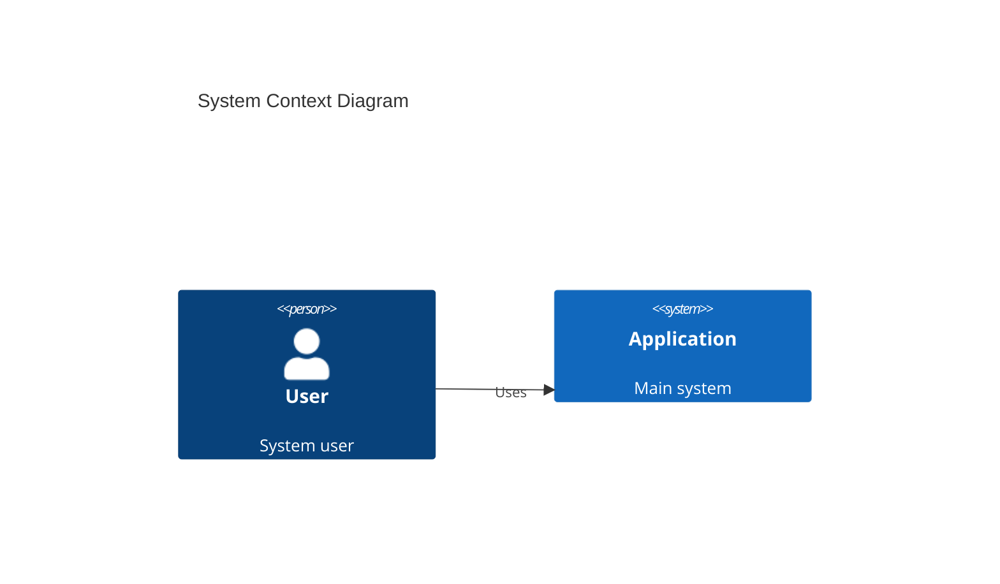

# CODITECT Operator Troubleshooting Guide

> **Solutions to common problems CODITECT operators encounter**
> **Fast resolution for getting back to productive work**
> **Last Updated:** 2025-11-16

---

## Table of Contents

- [Quick Diagnostics](#quick-diagnostics)
- [Environment Setup Issues](#environment-setup-issues)
- [Agent Invocation Problems](#agent-invocation-problems)
- [File Operation Errors](#file-operation-errors)
- [Git and Version Control](#git-and-version-control)
- [Session Management](#session-management)
- [Performance Issues](#performance-issues)
- [Documentation Generation](#documentation-generation)
- [Common Error Messages](#common-error-messages)
- [Recovery Procedures](#recovery-procedures)

---

## Quick Diagnostics

### Is Your Environment Set Up Correctly?

Run this diagnostic checklist:

```bash
# 1. Verify you're in the right directory
pwd
# Should show: /Users/[username]/PROJECTS/[project-name]

# 2. Check .coditect exists
ls -la .coditect
# Should show directory or symlink

# 3. Check .claude symlink
ls -la .claude
# Should show: .claude -> .coditect

# 4. Verify MEMORY-CONTEXT
ls -d MEMORY-CONTEXT/*/
# Should show: sessions/ decisions/ business/ technical/

# 5. Check git status
git status
# Should work without errors

# 6. Verify submodule
git submodule status
# Should show .coditect or submodules/coditect-core
```

**All checks passed?** ✅ Environment is good - issue is elsewhere

**Any checks failed?** ❌ See [Environment Setup Issues](#environment-setup-issues)

---

## Environment Setup Issues

### Problem: `.coditect` directory doesn't exist

**Symptoms:**
```bash
ls: .coditect: No such file or directory
```

**Cause:** Project not initialized or submodule not cloned

**Solution:**

```bash
# Option 1: Run initialization script
cd /path/to/coditect-rollout-master
./scripts/coditect-project-init.sh

# Option 2: Manual setup
cd ~/PROJECTS/my-project
git submodule add https://github.com/coditect-ai/coditect-core.git .coditect
ln -s .coditect .claude
mkdir -p MEMORY-CONTEXT/{sessions,decisions,business,technical}
```

**Verify:**
```bash
ls -la .coditect
# Should show directory contents
```

---

### Problem: `.claude` symlink broken

**Symptoms:**
```bash
ls: .claude: No such file or directory
# or
.claude -> .coditect (broken)
```

**Cause:** Symlink not created or pointing to wrong location

**Solution:**

```bash
# Remove broken symlink
rm .claude

# Recreate symlink
ln -s .coditect .claude

# Verify
ls -la .claude
# Should show: .claude -> .coditect (in blue/cyan, not red)
```

---

### Problem: Git submodule not initialized

**Symptoms:**
```bash
.coditect/ directory exists but is empty
```

**Cause:** Submodule cloned but not initialized

**Solution:**

```bash
# Initialize and update submodules
git submodule update --init --recursive

# Verify
ls .coditect/agents
# Should show agent files
```

---

### Problem: MEMORY-CONTEXT directories missing

**Symptoms:**
```bash
ls: MEMORY-CONTEXT/sessions: No such file or directory
```

**Cause:** Project initialized without MEMORY-CONTEXT structure

**Solution:**

```bash
# Create all required directories
mkdir -p MEMORY-CONTEXT/{sessions,decisions,business,technical}

# Create a README in each
echo "# Session Summaries" > MEMORY-CONTEXT/sessions/README.md
echo "# Architecture Decision Records" > MEMORY-CONTEXT/decisions/README.md
echo "# Business Research Notes" > MEMORY-CONTEXT/business/README.md
echo "# Technical Research Notes" > MEMORY-CONTEXT/technical/README.md

# Commit
git add MEMORY-CONTEXT/
git commit -m "Add MEMORY-CONTEXT structure"
```

---

### Problem: Permission denied errors

**Symptoms:**
```bash
./scripts/coditect-project-init.sh: Permission denied
```

**Cause:** Script not executable

**Solution:**

```bash
# Make script executable
chmod +x scripts/coditect-project-init.sh

# Run again
./scripts/coditect-project-init.sh
```

---

## Agent Invocation Problems

### Problem: "Agent not found" error

**Symptoms:**
```
I don't see an agent named "competitive-market-analyst"
```

**Cause:** Using wrong invocation method or typo in agent name

**Solution:**

**1. Verify agent exists:**
```bash
ls .coditect/agents/competitive-market-analyst.md
# Should exist
```

**2. Use correct Task Tool Pattern:**

❌ **WRONG:**
```python
Task(
    subagent_type="competitive-market-analyst",
    prompt="Research market"
)
```

✅ **CORRECT:**
```python
Task(
    subagent_type="general-purpose",
    prompt="Use competitive-market-analyst subagent to research the AI IDE market including TAM/SAM/SOM, competitors, and trends. Output to docs/research/01-market-research.md"
)
```

**3. Check spelling:**
```bash
# List all available agents
ls .coditect/agents/
```

Common typos:
- `market-analyst` → `competitive-market-analyst`
- `architect` → `senior-architect`
- `orchestrate` → `orchestrator`

---

### Problem: Agent invocation does nothing

**Symptoms:**
- Prompt sent but no agent activity
- Generic response instead of agent execution

**Cause:** Missing "Use [agent-name] subagent" in prompt

**Solution:**

Prompt MUST start with: `"Use [agent-name] subagent to"`

❌ **WRONG:**
```python
Task(
    subagent_type="general-purpose",
    prompt="Research the market for AI IDEs"
)
```

✅ **CORRECT:**
```python
Task(
    subagent_type="general-purpose",
    prompt="Use competitive-market-analyst subagent to research the market for AI IDEs"
)
```

---

### Problem: "Prompt too vague" error

**Symptoms:**
```
I need more details about what you want me to do
```

**Cause:** Prompt lacks specificity

**Solution:**

Include in your prompt:
1. **What** to research/create
2. **Why** (context/project)
3. **How** detailed (depth)
4. **Where** to output (file path)

**Example:**

❌ **Vague:**
```
"Use competitive-market-analyst subagent to research market"
```

✅ **Specific:**
```
"Use competitive-market-analyst subagent to research the SaaS market for design agency management tools.

Project: All-in-one platform for design agencies (5-20 people)

Research Focus:
1. Market size (TAM/SAM/SOM)
2. Competitors (5-7 key players)
3. Market trends
4. Customer pain points
5. Willingness to pay

Output: docs/research/01-market-research.md with TAM/SAM/SOM calculations, competitor profiles, and market validation"
```

---

## File Operation Errors

### Problem: Files created in wrong location

**Symptoms:**
- File created in root instead of `docs/`
- Can't find generated files

**Cause:** Working directory confusion or unspecified output path

**Solution:**

**1. Always specify full relative path:**
```
"Output: docs/research/01-market-research.md"
# NOT just "01-market-research.md"
```

**2. Verify working directory:**
```bash
pwd
# Should be in project root
```

**3. Create directory structure first:**
```bash
mkdir -p docs/{research,business,architecture,decisions}
```

**4. Use absolute paths if needed:**
```
"Output: /Users/halcasteel/PROJECTS/my-project/docs/research/01-market-research.md"
```

---

### Problem: "File already exists" error

**Symptoms:**
```
Cannot write - file already exists
```

**Cause:** Trying to write to existing file with Write tool

**Solution:**

```
# Instead of Write, use Edit:
"Edit docs/research/01-market-research.md and add a section on market trends"

# Or explicitly overwrite:
"Overwrite docs/research/01-market-research.md with updated market research"

# Or read first, then decide:
"Read docs/research/01-market-research.md"
# Then: "Update it with new information"
```

---

### Problem: Mermaid diagrams not rendering

**Symptoms:**
- C4 diagrams show as text code blocks
- No visual diagram appears

**Cause:** Incorrect mermaid syntax or markdown viewer doesn't support mermaid

**Solution:**

**1. Verify mermaid syntax:**

✅ **CORRECT:**
````markdown

````

❌ **WRONG:**
- Missing `mermaid` language tag
- Typos in C4Context
- Missing required fields

**2. Use a mermaid-compatible viewer:**
- GitHub (supports mermaid natively)
- VS Code with "Markdown Preview Mermaid Support" extension
- Obsidian
- Online: https://mermaid.live

**3. Validate diagram:**
```
Paste diagram code into https://mermaid.live to test
```

---

## Git and Version Control

### Problem: "Please tell me who you are" error

**Symptoms:**
```bash
git commit failed
fatal: Please tell me who you are
```

**Cause:** Git user not configured

**Solution:**

```bash
# Set globally (for all projects)
git config --global user.name "Your Name"
git config --global user.email "your.email@example.com"

# Or just for this project
git config user.name "Your Name"
git config user.email "your.email@example.com"

# Verify
git config user.name
git config user.email
```

---

### Problem: "Nothing to commit" error

**Symptoms:**
```bash
nothing to commit, working tree clean
```

**Cause:** No changes staged or files not tracked

**Solution:**

```bash
# Check status
git status

# If files are untracked:
git add .

# If files were deleted:
git add -A

# Then commit
git commit -m "Your commit message"
```

---

### Problem: Submodule conflicts

**Symptoms:**
```bash
error: Submodule '.coditect' could not be updated
```

**Cause:** Submodule out of sync or conflicts

**Solution:**

```bash
# Update submodule
git submodule update --remote --merge

# If conflicts persist:
git submodule deinit -f .coditect
git rm -f .coditect
git submodule add https://github.com/coditect-ai/coditect-core.git .coditect
git submodule update --init
```

---

### Problem: "Permission denied (publickey)" error

**Symptoms:**
```bash
git push failed
Permission denied (publickey)
```

**Cause:** SSH key not set up with GitHub

**Solution:**

**Option 1: Use HTTPS instead:**
```bash
# Check current remote
git remote -v

# Change to HTTPS
git remote set-url origin https://github.com/username/repo.git

# Push again
git push
```

**Option 2: Set up SSH key:**
```bash
# Generate SSH key
ssh-keygen -t ed25519 -C "your.email@example.com"

# Copy public key
cat ~/.ssh/id_ed25519.pub

# Add to GitHub:
# 1. Go to GitHub Settings → SSH and GPG keys
# 2. Click "New SSH key"
# 3. Paste your public key

# Test connection
ssh -T git@github.com
```

---

## Session Management

### Problem: Context lost between sessions

**Symptoms:**
- New session doesn't remember previous work
- Have to re-explain project every time

**Cause:** Session summaries not exported or not loaded

**Solution:**

**Before ending session:**
```
"Create a comprehensive session summary including:
- All work completed today
- Key decisions made
- Files created/modified
- Next steps

Export to: MEMORY-CONTEXT/sessions/2025-11-16-session-summary.md"
```

**Starting new session:**
```
"I'm continuing work on [project-name]. Please read:
- MEMORY-CONTEXT/sessions/[latest-date]-session-summary.md
- PROJECT-PLAN.md
- TASKLIST.md

Then tell me where we left off and what's next."
```

---

### Problem: Token budget exhausted

**Symptoms:**
```
We've reached the token limit for this session
```

**Cause:** Too much context accumulated (200K token limit reached)

**Prevention:**

```
# Monitor usage periodically:
"How much of our token budget have we used?"

# Export summary before limit:
"We're at 180K tokens - let's create a checkpoint now"
```

**Recovery:**

```bash
# 1. Exit current session
exit

# 2. Start new session
claude

# 3. Load context
"I'm continuing [project]. Read MEMORY-CONTEXT/sessions/[latest].md"

# 4. Resume work
"Let's continue with [next-task] from TASKLIST.md"
```

---

### Problem: Catastrophic forgetting mid-project

**Symptoms:**
- Claude forgets earlier decisions
- Contradicts previous architectural choices
- Asks questions already answered

**Cause:** Long session without context reinforcement

**Solution:**

**Immediate:**
```
"Let me remind you of our key decisions:
- Database: PostgreSQL (see ADR-001)
- Authentication: JWT (see ADR-002)
- Deployment: Kubernetes (see ADR-003)

Please review these ADRs in docs/decisions/ before proceeding."
```

**Prevention:**
```
# Create ADRs for ALL major decisions
# Export session summaries every 2-3 hours
# Keep CLAUDE.md updated with project context
```

---

## Performance Issues

### Problem: Slow response times

**Symptoms:**
- Responses take 30+ seconds
- Tools timing out

**Possible Causes & Solutions:**

**1. Large file reads:**
```
# Instead of:
"Read entire 5000-line file"

# Do:
"Read lines 100-200 of large-file.md"
"Search for 'specific function' in large-file.md"
```

**2. Too much context:**
```
# Solution: Export summary, start fresh session
exit
claude
```

**3. Complex multi-agent workflows:**
```
# Instead of:
"Use 5 agents simultaneously"

# Do:
"Use orchestrator to coordinate agents sequentially"
```

---

### Problem: Agent execution seems stuck

**Symptoms:**
- Agent invoked but no progress for 60+ seconds
- No tool use visible

**Solution:**

**1. Wait it out:**
- Complex research takes time
- Agent may be reading multiple files
- Be patient for 1-2 minutes

**2. Check if clarification needed:**
```
"Are you waiting for more information from me?"
```

**3. Simplify the request:**
```
"Let's break this into smaller steps. First, just do [step 1]"
```

**4. Restart if truly stuck:**
```bash
# Ctrl+C to cancel
# Then try again with simpler prompt
```

---

## Documentation Generation

### Problem: Documents are too generic/template-like

**Symptoms:**
- "Lorem ipsum" or "[Company Name]" placeholders
- Generic advice not specific to project
- Lacks detail and depth

**Cause:** Insufficient context provided to agent

**Solution:**

**Provide rich context:**
```python
Task(
    subagent_type="general-purpose",
    prompt="Use competitive-market-analyst subagent to research market for AI-powered code review SaaS.

PROJECT CONTEXT:
- Product: AI code reviewer using Claude
- Target: Small dev teams (5-20 developers)
- Price point: $20-50/developer/month
- Key feature: Automated PR reviews with AI explanations
- Differentiator: Understands business context, not just code syntax

RESEARCH REQUIREMENTS:
1. TAM/SAM/SOM (show calculations)
2. Competitors: GitHub Copilot, Amazon CodeWhisperer, Tabnine, Codeium, Replit AI
3. Market trends: AI adoption in development, enterprise vs startup
4. Customer pain points: slow code reviews, inconsistent standards
5. Pricing benchmarks from competitors

OUTPUT: docs/research/01-market-research.md with specific data, not generic templates"
)
```

---

### Problem: Missing critical sections in documents

**Symptoms:**
- Market research missing TAM/SAM/SOM
- Architecture doc missing C4 diagrams
- ADR missing consequences section

**Cause:** Incomplete prompt or agent output

**Solution:**

**1. Explicitly request missing sections:**
```
"Update docs/research/01-market-research.md to add:
- TAM/SAM/SOM calculations (show your math)
- Source citations for market data
- Competitive pricing comparison table"
```

**2. Use checklists in prompts:**
```
"Generate architecture document with:
☐ C4 Context diagram
☐ C4 Container diagram
☐ Technology stack table
☐ System boundaries
☐ Key architectural patterns
☐ Deployment architecture
☐ Security considerations"
```

---

### Problem: Inconsistent formatting across documents

**Symptoms:**
- Some docs use H1 (`#`), others use H2 (`##`)
- Inconsistent file naming
- Mixed table formats

**Cause:** No formatting standards specified

**Solution:**

**Create a style guide:**

```markdown
# CODITECT Documentation Standards

## File Naming
- Lowercase with hyphens: `market-research.md`
- Numbered sequences: `01-market-research.md`
- Dates: `2025-11-16-session-summary.md`
- ADRs: `ADR-001-database-choice.md`

## Heading Levels
- H1 (`#`): Document title only
- H2 (`##`): Major sections
- H3 (`###`): Subsections
- H4 (`####`): Details

## Tables
- Use markdown tables
- Left-align text columns
- Right-align number columns

## Code Blocks
- Always specify language: ```python, ```bash, ```typescript
```

**Reference in prompts:**
```
"Follow CODITECT Documentation Standards for formatting"
```

---

## Common Error Messages

### "I need to read the file before editing"

**Meaning:** Edit tool requires reading file first

**Solution:**
```
"Read src/main.rs"
# Wait for response
"Now edit src/main.rs to add error handling"
```

---

### "Could not find a unique match for that string"

**Meaning:** Edit operation ambiguous (multiple matches)

**Solution:**

```
# Be more specific:
"Replace the first occurrence of 'function calculate' with 'async function calculate'"

# Or use line numbers:
"Replace lines 42-45 with [new code]"

# Or provide more context:
"In the User class, replace the 'login' method with [new code]"
```

---

### "This would create a security vulnerability"

**Meaning:** Claude detected unsafe code pattern

**Solution:**

```
# Review the concern:
"What security issue did you find?"

# Address it:
"Show me a secure version of this code"

# Or explicitly acknowledge risk:
"I understand the risk. This is for a development environment only. Proceed with [code]"
```

---

## Recovery Procedures

### Procedure: Recover from corrupt session

**Symptoms:**
- Claude very confused about project
- Giving contradictory responses
- Context seems scrambled

**Steps:**

```bash
# 1. Exit immediately
exit

# 2. Save what you can
# (manually note any uncommitted work)

# 3. Start fresh session
claude

# 4. Load clean context
"I'm starting fresh on [project-name].

Please read these files to understand the project:
- README.md
- CLAUDE.md
- PROJECT-PLAN.md
- TASKLIST.md
- MEMORY-CONTEXT/sessions/[latest-good-session].md
- MEMORY-CONTEXT/decisions/ADR-*.md

Then summarize what you understand about the project."

# 5. Verify understanding before continuing
"Based on those files, what are we currently working on?"
```

---

### Procedure: Recover from accidental file deletion

**Symptoms:**
- Important file deleted by mistake
- Git shows deletion

**Steps:**

```bash
# If not yet committed:
git restore path/to/deleted/file.md

# If committed but not pushed:
git reset --soft HEAD~1
git restore path/to/deleted/file.md

# If already pushed:
git revert [commit-hash]
# Or restore specific file from history:
git checkout [commit-hash] -- path/to/file.md
```

---

### Procedure: Recover from bad git commit

**Symptoms:**
- Committed wrong files
- Bad commit message
- Want to undo last commit

**Steps:**

```bash
# Undo last commit, keep changes:
git reset --soft HEAD~1

# Undo last commit, discard changes (DANGER!):
git reset --hard HEAD~1

# Amend last commit message:
git commit --amend -m "New message"

# Amend last commit to add forgotten files:
git add forgotten-file.md
git commit --amend --no-edit
```

**⚠️ Warning:** Never use `--hard` unless you're sure you want to lose changes!

---

### Procedure: Recover from corrupted submodule

**Symptoms:**
```bash
fatal: could not access submodule '.coditect'
```

**Steps:**

```bash
# 1. Remove corrupted submodule
git submodule deinit -f .coditect
rm -rf .git/modules/.coditect
git rm -f .coditect

# 2. Re-add fresh submodule
git submodule add https://github.com/coditect-ai/coditect-core.git .coditect

# 3. Initialize
git submodule update --init --recursive

# 4. Recreate symlink
ln -s .coditect .claude

# 5. Commit
git add .gitmodules .coditect .claude
git commit -m "Fix corrupted submodule"
```

---

## Getting Additional Help

### Resources

**Training Materials:**
- `CODITECT-OPERATOR-TRAINING-SYSTEM.md` - Complete training
- `CODITECT-OPERATOR-FAQ.md` - Frequently asked questions
- `CLAUDE-CODE-BASICS.md` - Claude Code fundamentals
- `1-2-3-ONBOARDING-HOWTO-QUICK-GUIDE.md` - Quick start

**Framework Documentation:**
- `../CLAUDE.md` - Framework overview
- `../README.md` - Repository structure
- `../agents/` - Agent descriptions

**When All Else Fails:**

1. **Search the docs:**
   ```bash
   cd .coditect
   grep -r "your problem" .
   ```

2. **Review similar projects:**
   - Look at example projects in CODITECT repos
   - Check session summaries from successful projects

3. **Start simple:**
   - Create a minimal test project
   - Verify basic operations work
   - Gradually add complexity

4. **Ask Claude:**
   ```
   "I'm having trouble with [specific problem]. I've tried [solutions attempted]. What else should I check?"
   ```

---

## Prevention Best Practices

**To avoid most issues:**

✅ **Always initialize projects properly:**
- Use `coditect-project-init.sh` script
- Verify all directories created
- Test git operations before starting work

✅ **Use Task Tool Pattern consistently:**
- Never deviate from the pattern
- Always specify detailed prompts
- Include output file paths

✅ **Export session summaries regularly:**
- Every 2-3 hours of work
- Before ending each session
- At phase boundaries

✅ **Commit frequently:**
- After each major document
- At logical checkpoints
- With descriptive messages

✅ **Create ADRs for decisions:**
- Database choices
- Architecture patterns
- Technology selections
- Deployment strategies

✅ **Keep CLAUDE.md and README.md updated:**
- Add context as project evolves
- Document key decisions
- Update project vision

---

**Document Version:** 1.0
**Last Updated:** 2025-11-16
**Maintainer:** CODITECT Training Team

**Remember:** Most problems have simple solutions. Work through this guide systematically, and you'll be back to productive work quickly!
