# CODITECT Visual Architecture Guide

> **Step-by-step visual narrative with C4 diagrams**
> **Simple, clear visualizations that tell the complete story**
> **From high-level system to detailed implementation**

**Author:** Hal Casteel, Founder/CEO/CTO, AZ1.AI INC.
**Framework:** CODITECT
**Copyright:** © 2025 AZ1.AI INC. All rights reserved.
**Last Updated:** 2025-11-16

---

## How to Use This Guide

This guide uses **progressive visual disclosure** - starting with the big picture and zooming into details.

**Read in order:**
1. System Context (highest level)
2. Container Architecture (applications & databases)
3. Component Design (internal modules)
4. Workflow Diagrams (how it all works together)

**Each section includes:**
- 📊 Simple, focused diagram
- 📝 Narrative explaining the visual
- 🎯 Key takeaways
- 🔗 How it connects to other diagrams

---

## Part 1: System Context - The Big Picture

### What is CODITECT? (30,000 ft view)

### 📝 Narrative: The High-Level Flow

**The Cast:**
- **You (Operator):** The person creating project specifications
- **CODITECT:** The multi-agent framework you're learning
- **Claude AI:** The underlying AI platform (from Anthropic)
- **GitHub:** Where your specifications are stored
- **Developers & Stakeholders:** Who benefit from your specs

**The Story:**

1. **You start** with a business idea in your head
2. **You use CODITECT** to transform that idea into detailed specifications
3. **CODITECT orchestrates** 50+ specialized AI agents via Claude
4. **Agents research** external docs, market data, technical references
5. **CODITECT generates** business docs, technical specs, project plans
6. **Everything is stored** in GitHub for version control
7. **Developers build** from your specifications
8. **Stakeholders review** and approve your business documents

### 🎯 Key Takeaways

✅ CODITECT is the "conductor" orchestrating many specialized AI agents
✅ Claude AI is the "orchestra" - the underlying intelligence
✅ You are the "composer" - directing what gets created
✅ GitHub is the "music hall" - where the final output lives

---

## Part 2: CODITECT Framework Architecture

### How CODITECT is Organized Internally

### 📝 Narrative: Inside the Framework

Imagine CODITECT as a **professional services firm**:

**The Team (50 Agents):**
- Like having 50 domain experts on staff
- Each expert specializes: market research, architecture, development, testing
- You don't need to know how they work, just when to call them

**The Tools (189 Skills):**
- Each expert has tools they can use
- Database queries, code patterns, research methods
- Agents share tools (code reuse)

**The Processes (72 Commands):**
- Pre-defined workflows for common tasks
- Like SOPs (Standard Operating Procedures)
- `/market-research` triggers complete market analysis workflow

**The Scripts (Automation):**
- Setup new projects
- Orchestrate multiple agents in sequence
- Handle complex multi-step processes

**The Memory (MEMORY-CONTEXT):**
- Shared knowledge base for the team
- Prevents forgetting decisions across sessions
- Like a project wiki or knowledge base

### 🎯 Key Takeaways

✅ 49 agents = 50 specialized experts at your command
✅ 189 skills = The tools those experts can use
✅ 72 commands = Pre-built workflows for common tasks
✅ MEMORY-CONTEXT = Never forget decisions or research

---

## Part 3: Agent Domains - The Expert Teams

### Agents Organized by Specialty

### 📝 Narrative: Your Expert Team

Think of it like **assembling your dream team** for a project:

**Research & Analysis (13 agents):**
- Market research specialists
- Competitive intelligence
- Codebase explorers
- **When to use:** Business discovery phase, market validation

**Business Team (6 agents):**
- Business intelligence analysts
- Financial modeling experts
- VC/investor perspective
- **When to use:** Business strategy, investment docs, financial projections

**Architecture Team (7 agents):**
- Senior technical architects
- System designers
- Database specialists
- **When to use:** Technical specification, system design, architecture decisions

**Development Team (8 agents):**
- Language specialists (Rust, TypeScript, etc.)
- Full-stack developers
- Backend/frontend experts
- **When to use:** Implementation planning, code structure, technical reviews

**Infrastructure Team (8 agents):**
- Cloud architects
- DevOps engineers
- Kubernetes specialists
- **When to use:** Deployment strategy, infrastructure design, scalability planning

**Testing Team (4 agents):**
- QA specialists
- Security auditors
- Test designers
- **When to use:** Test planning, security reviews, quality assurance

**Orchestration Team (2 agents):**
- Multi-agent coordinators
- Workflow managers
- **When to use:** Complex tasks requiring multiple agents in sequence

### 🎯 Key Takeaways

✅ You don't use all 49 agents for every project
✅ Pick the right expert for each task
✅ Orchestrator helps coordinate when you need multiple experts
✅ Most projects use 10-15 agents total

---

## Part 4: Project Workflow - How Work Flows Through CODITECT

### Phase 1: Business Discovery

### 📝 Narrative: Business Discovery Flow

**The Journey (2-4 hours):**

**Step 1: Market Research**
- You invoke `competitive-market-analyst`
- Agent researches market size, competitors, trends
- Generates `01-market-research.md` with TAM/SAM/SOM
- Saves findings to MEMORY-CONTEXT for later use

**Step 2: Value Proposition**
- You invoke `business-intelligence-analyst`
- Agent loads market research from MEMORY-CONTEXT
- Analyzes ideal customer, product-market fit
- Generates value prop and ICP documents

**Step 3: Go-to-Market**
- Same business intelligence agent
- Loads ICP and market data from memory
- Determines best GTM motion (PLG/SLG/MLG)
- Designs pricing strategy
- Generates GTM and pricing documents

**The Magic:**
- Each agent builds on previous work (via MEMORY-CONTEXT)
- No re-doing research
- Consistency across documents
- Progressive refinement

### 🎯 Key Takeaways

✅ Business discovery is sequential (market → value → GTM)
✅ Agents share context via MEMORY-CONTEXT
✅ Each output builds on previous outputs
✅ 7-9 business documents generated in 2-4 hours

---

### Phase 2: Technical Specification

### 📝 Narrative: Technical Specification Flow

**The Journey (4-6 hours):**

**Step 1: System Architecture**
- `senior-architect` loads business requirements from MEMORY-CONTEXT
- Designs high-level system (C4 Context & Container diagrams)
- Recommends technology stack
- Generates `01-system-architecture.md`
- Saves key decisions to MEMORY-CONTEXT

**Step 2: Database Schema**
- Same `senior-architect`
- Loads feature requirements
- Creates Entity Relationship Diagram
- Defines tables, columns, relationships
- Generates `02-database-schema.md`

**Step 3: API Specification**
- `software-design-architect` takes over
- Loads architecture and database designs
- Creates RESTful API specification
- Documents all endpoints (CRUD operations)
- Generates `03-api-specification.md`
- Creates ADRs for key decisions

**The Magic:**
- Technical specs align with business requirements
- Database schema matches business objects (customers, projects, invoices)
- API endpoints serve frontend needs
- Everything is consistent and connected

### 🎯 Key Takeaways

✅ Technical specs flow from business requirements
✅ Architecture → Database → API (natural progression)
✅ ADRs document WHY decisions were made
✅ Complete technical blueprint in 4-6 hours

---

### Phase 3: Project Management

### 📝 Narrative: Project Management Flow

**The Journey (2-3 hours):**

**Input:** Complete business + technical specifications

**The Orchestrator's Role:**
- Reads all business and technical documents
- Understands full project scope
- Breaks work into logical phases
- Estimates time and resources

**Output 1: PROJECT-PLAN.md**
- **Phase 1: Foundation** - Setup, architecture, database
- **Phase 2: Core Features** - Main functionality
- **Phase 3: Integration** - Connect components, external services
- **Phase 4: Launch** - Testing, deployment, documentation

Each phase has:
- Clear objectives
- Deliverables
- Timeline
- Success criteria

**Output 2: TASKLIST.md**
- 50+ granular tasks
- Each task has:
  - Phase association
  - Priority (HIGH/MEDIUM/LOW)
  - Time estimate
  - Agent assignment
  - Checkbox for tracking

**The Result:**
- Development team knows exactly what to build
- Clear sequence (Phase 1 → 2 → 3 → 4)
- Realistic timeline with milestones
- Trackable progress (check off tasks daily)

### 🎯 Key Takeaways

✅ PROJECT-PLAN provides high-level roadmap
✅ TASKLIST provides day-to-day execution guide
✅ Both generated from specs (not manual planning)
✅ Ready to hand off to development team

---

## Part 5: Session Management & Continuity

### The Challenge: AI Memory is Limited

### 📝 Narrative: Keeping Context Across Sessions

**The Problem:**
- AI has limited memory (200,000 tokens per session)
- Large projects span multiple sessions
- Without memory management, AI forgets everything!

**The Solution: MEMORY-CONTEXT System**

**During each session:**
1. Work on business discovery (2-4 hours)
2. Before ending: Export session summary
3. Save to `MEMORY-CONTEXT/sessions/2025-11-16-business-discovery.md`
4. Include: work completed, decisions made, next steps

**Starting new session:**
1. Start Claude Code
2. Load summary: "Read MEMORY-CONTEXT/sessions/[latest].md"
3. AI regains all context from previous session
4. Continue seamlessly where you left off

**What to Save:**
- **sessions/**: Session summaries (every 2-3 hours)
- **decisions/**: ADRs (architecture decisions)
- **business/**: Research notes, customer insights
- **technical/**: Code patterns, implementation notes

**The Result:**
- Multi-day projects maintain continuity
- No catastrophic forgetting
- Build on previous work
- Professional project management

### 🎯 Key Takeaways

✅ Export session summaries BEFORE ending
✅ Load summaries WHEN starting new session
✅ Treat MEMORY-CONTEXT like a project wiki
✅ Never lose important decisions or research

---

## Part 6: Complete CODITECT Workflow Visualization

### From Idea to Production-Ready Specification

```mermaid
graph TB
    Start([💡 Business Idea]) --> Init[🔧 Initialize Project<br/>coditect-project-init.py]

    Init --> Phase1[📊 Phase 1: Business Discovery]
    Phase1 --> M1[Market Research]
    Phase1 --> V1[Value Proposition]
    Phase1 --> I1[ICP & PMF]
    Phase1 --> G1[GTM & Pricing]

    M1 & V1 & I1 & G1 --> Checkpoint1[✅ Checkpoint:<br/>Business Complete]

    Checkpoint1 --> Phase2[🏗️ Phase 2: Technical Spec]
    Phase2 --> A1[System Architecture]
    Phase2 --> D1[Database Schema]
    Phase2 --> API1[API Specification]
    Phase2 --> ADR1[ADRs]

    A1 & D1 & API1 & ADR1 --> Checkpoint2[✅ Checkpoint:<br/>Technical Complete]

    Checkpoint2 --> Phase3[📋 Phase 3: Project Management]
    Phase3 --> Plan[PROJECT-PLAN.md]
    Phase3 --> Tasks[TASKLIST.md]

    Plan & Tasks --> Checkpoint3[✅ Checkpoint:<br/>Planning Complete]

    Checkpoint3 --> Final([🎯 Complete Specification<br/>Ready for Development])

    style Start fill:#e1f5fe
    style Final fill:#c8e6c9
    style Checkpoint1 fill:#fff9c4
    style Checkpoint2 fill:#fff9c4
    style Checkpoint3 fill:#fff9c4
```

### 📝 Narrative: The Complete Journey

**Start: You have a business idea** 💡
- "I want to build a SaaS platform for design agencies"

**Step 1: Initialize Project** 🔧
- Run `coditect-project-init.py`
- Answer a few questions
- Complete directory structure created
- Git repository initialized
- Ready to start!

**Phase 1: Business Discovery** 📊 (2-4 hours)
- **Market Research:** TAM/SAM/SOM, competitors, trends
- **Value Proposition:** Problem, solution, differentiation
- **ICP & PMF:** Who's the customer? Does market want this?
- **GTM & Pricing:** How to reach customers? What to charge?
- **Checkpoint:** Commit all business docs to git

**Phase 2: Technical Specification** 🏗️ (4-6 hours)
- **System Architecture:** C4 diagrams, technology stack
- **Database Schema:** Tables, relationships, constraints
- **API Specification:** All endpoints documented
- **ADRs:** Document key technical decisions
- **Checkpoint:** Commit all technical specs to git

**Phase 3: Project Management** 📋 (2-3 hours)
- **PROJECT-PLAN:** 4 phases, timeline, risks, resources
- **TASKLIST:** 50+ tasks with estimates and priorities
- **Checkpoint:** Final commit - complete specification

**End: Production-Ready Specification** 🎯
- Business case validated
- Technical design complete
- Implementation roadmap defined
- **Ready to hand off to developers!**

**Total Time:** 8-12 hours (vs. weeks of manual work)

### 🎯 Key Takeaways

✅ Systematic process from idea to specification
✅ Each phase builds on previous phase
✅ Checkpoints ensure nothing is lost
✅ Complete specification in 1-2 days

---

## Part 7: Architecture Example - Sample Project (PixelFlow)

### C4 Context Diagram: Design Agency SaaS

### 📝 Narrative: PixelFlow System Context

**The Big Picture:**

**Users:**
- **Designers:** Team members working on projects
- **Clients:** Customers viewing deliverables
- **Admins:** Owners managing the agency

**The System:**
- **PixelFlow:** The all-in-one platform we're building

**External Services:**
- **Stripe:** Handle subscription billing and invoices
- **AWS S3:** Store large design files (PSDs, videos, etc.)
- **SendGrid:** Email notifications (project updates, invoices)
- **Google Calendar:** Sync deadlines and meetings

**Key Interactions:**
- Designers track time, manage projects
- Clients view galleries, approve work
- Admins generate invoices, view reports
- System integrates with payment, storage, email, calendar

---

### C4 Container Diagram: PixelFlow Technical Architecture

### 📝 Narrative: PixelFlow Technical Design

**Frontend:**
- **Web Application:** React/TypeScript SPA
- Users interact via modern web interface
- Real-time updates via WebSocket

**Backend:**
- **API Gateway:** Central entry point for all requests
- **Microservices:** Project, Time, Invoice, Gallery services
- Each service handles one domain
- **Auth Service:** JWT-based authentication

**Data Layer:**
- **PostgreSQL:** Main database (projects, users, time entries, invoices)
- **Redis:** Session cache, real-time data
- **RabbitMQ:** Async job queue (PDF generation, email sending)

**External Integrations:**
- **Stripe:** Subscription billing, invoice payments
- **AWS S3:** Design file storage (large files)

**Why This Architecture:**
- **Microservices:** Each domain can scale independently
- **JWT Auth:** Stateless, scalable authentication
- **Redis Cache:** Fast session management, real-time features
- **Message Queue:** Don't block API for slow operations (PDF generation)

---

## Part 8: Putting It All Together

### Your Journey Through CODITECT Training

### 📝 Your Path to Mastery

**Module 1: Foundation (60 minutes)**
- Quick start, steep learning curve
- Task Tool Pattern is critical (practice until automatic)
- First successful agent invocation feels amazing!

**Module 2: Business Discovery (90 minutes)**
- Generate professional business documents
- See agents in action (market research, competitive analysis)
- Build confidence in output quality

**Module 3: Technical Specification (90 minutes)**
- Create production-ready technical designs
- C4 diagrams, database schemas, API specs
- Understand how business + technical connect

**Module 4: Project Management (60 minutes)**
- Generate complete project plans
- Break work into phases and tasks
- Ready to hand off to development team

**Module 5: Advanced Operations (60 minutes)**
- Master session continuity
- Never lose context
- Handle multi-day/week projects like a pro

**Certification: Expert Operator**
- Complete 90-minute practical exam
- Create full specification for new project
- Prove independent capability

---

## Summary: What You've Learned

### The Visual Journey

You've seen CODITECT from **multiple perspectives**:

1. **System Context:** How CODITECT fits in the broader ecosystem
2. **Framework Architecture:** What's inside CODITECT
3. **Agent Organization:** The 50-agent expert team
4. **Workflow Sequences:** How work flows through the system
5. **Session Management:** Maintaining context over time
6. **Complete Process:** Idea → Specification in 8-12 hours
7. **Real Example:** PixelFlow architecture diagrams
8. **Your Journey:** Path to certification

### Key Visualizations to Remember

📊 **System Context:** Operator → CODITECT → Claude → GitHub → Developers
🏗️ **Framework:** 50 Agents + 189 Skills + 72 Commands + Scripts + MEMORY-CONTEXT
👥 **Agent Teams:** Research, Business, Architecture, Development, Infrastructure, Testing, Orchestration
🔄 **Workflow:** Business Discovery → Technical Spec → Project Management
💾 **Session Management:** Export → New Session → Load → Continue
🎯 **Complete Flow:** Idea → Init → Phases → Checkpoints → Production-Ready Spec

---

## Next Steps

**Now that you understand the visual architecture:**

1. **Review key diagrams** - Bookmark this guide
2. **Start hands-on training** - Use CODITECT-OPERATOR-TRAINING-SYSTEM.md
3. **Generate your own diagrams** - Apply to your projects
4. **Build muscle memory** - Practice Task Tool Pattern
5. **Create specifications** - Real projects, not just training

**Remember:** These diagrams aren't just documentation - they're your mental model for how CODITECT works. Refer back when confused or when explaining to others.

---

## Appendix: Mermaid Diagram Quick Reference

All diagrams in this guide use **mermaid** syntax. They render automatically on GitHub, VS Code (with extension), and many markdown viewers.

### Basic C4 Context

### Basic Flowchart

### Basic Sequence Diagram

**Learn more:** https://mermaid.js.org/

---

**Author:** Hal Casteel, Founder/CEO/CTO, AZ1.AI INC.
**Framework:** CODITECT
**Copyright:** © 2025 AZ1.AI INC. All rights reserved.
**Document Version:** 1.0
**Last Updated:** 2025-11-16

**You now have the complete visual understanding of CODITECT. Time to build!** 🚀
